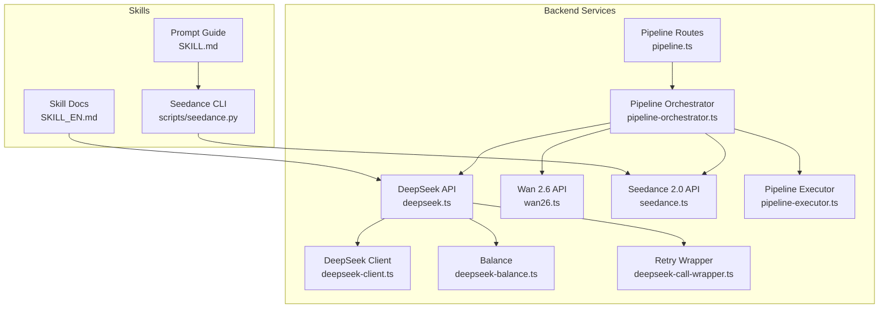
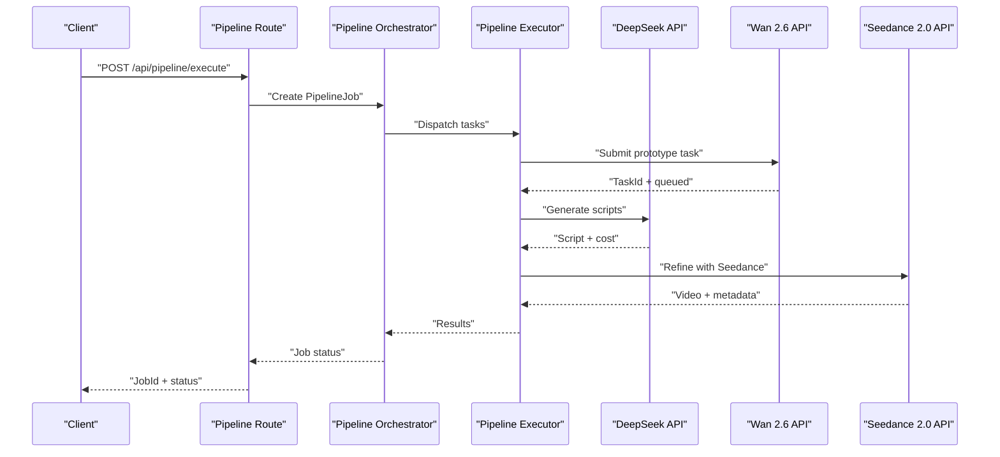
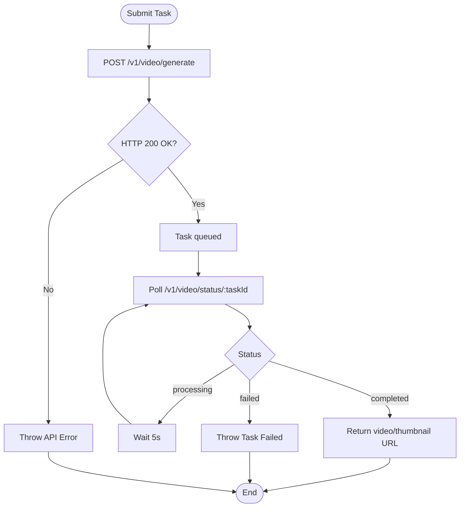
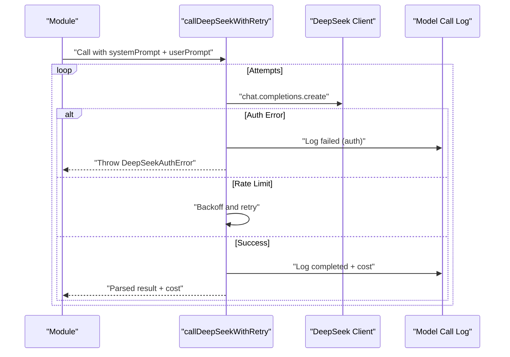
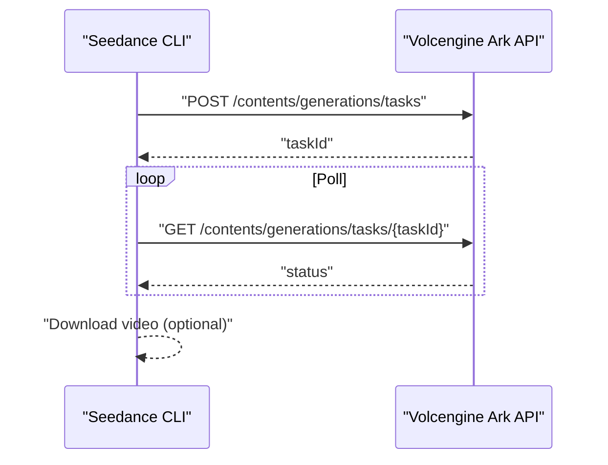
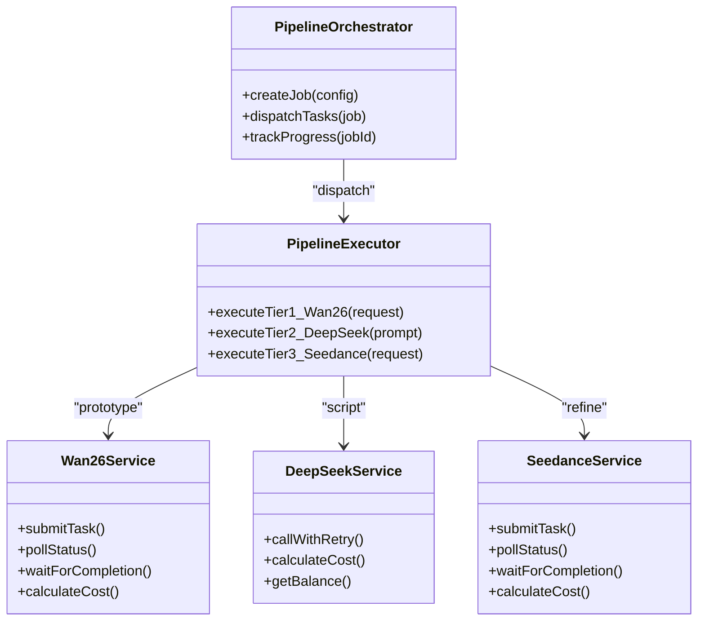
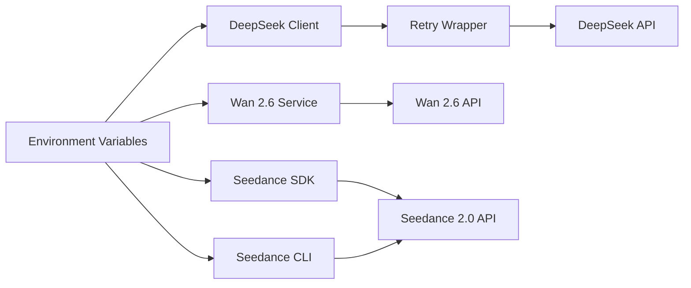

# AI Integration

<cite>
**Referenced Files in This Document**
- [seedance.py](file://docs/skills/scripts/seedance.py)
- [seedance.py (CN)](file://docs/skills/seedance2-skill-cn/scripts/seedance.py)
- [README_EN.md](file://docs/skills/README_EN.md)
- [SKILL_EN.md](file://docs/skills/SKILL_EN.md)
- [SKILL.md](file://docs/skills/SKILL.md)
- [DEEPSEEK_MIGRATION_GUIDE.md](file://docs/DEEPSEEK_MIGRATION_GUIDE.md)
- [deepseek.ts](file://packages/backend/src/services/ai/deepseek.ts)
- [deepseek-client.ts](file://packages/backend/src/services/ai/deepseek-client.ts)
- [deepseek-balance.ts](file://packages/backend/src/services/ai/deepseek-balance.ts)
- [deepseek-call-wrapper.ts](file://packages/backend/src/services/ai/deepseek-call-wrapper.ts)
- [wan26.ts](file://packages/backend/src/services/ai/wan26.ts)
- [seedance.ts](file://packages/backend/src/services/ai/seedance.ts)
- [pipeline-orchestrator.ts](file://packages/backend/src/services/pipeline-orchestrator.ts)
- [pipeline-executor.ts](file://packages/backend/src/services/pipeline-executor.ts)
- [pipeline.ts](file://packages/backend/src/routes/pipeline.ts)
- [deepseek.test.ts](file://packages/backend/tests/deepseek.test.ts)
- [deepseek-client.test.ts](file://packages/backend/tests/deepseek-client.test.ts)
- [deepseek-call-wrapper.test.ts](file://packages/backend/tests/deepseek-call-wrapper.test.ts)
- [wan26.test.ts](file://packages/backend/tests/wan26.test.ts)
- [seedance.test.ts](file://packages/backend/tests/seedance.test.ts)
</cite>

## Table of Contents

1. [Introduction](#introduction)
2. [Project Structure](#project-structure)
3. [Core Components](#core-components)
4. [Architecture Overview](#architecture-overview)
5. [Detailed Component Analysis](#detailed-component-analysis)
6. [Dependency Analysis](#dependency-analysis)
7. [Performance Considerations](#performance-considerations)
8. [Troubleshooting Guide](#troubleshooting-guide)
9. [Conclusion](#conclusion)
10. [Appendices](#appendices)

## Introduction

This document describes the three-tier AI pipeline integrated in the project:

- Tier 1: Low-cost prototype generation powered by the Wan 2.6 API (Atlas Cloud)
- Tier 2: Script generation powered by the DeepSeek API with robust retry and cost management
- Tier 3: High-quality refinement powered by the Seedance 2.0 API (Volcengine Ark)

It covers configuration, cost calculation and management, error handling, prompt engineering best practices, quality assessment criteria, workflow orchestration, batch processing, and performance optimization techniques.

## Project Structure

The AI integration spans both backend services and skill assets:

- Backend services encapsulate API clients, cost calculation, retries, and orchestration
- Skills provide CLI tools and prompt engineering guidance for Seedance 2.0

**Diagram sources**

- [seedance.py:1-407](file://docs/skills/scripts/seedance.py#L1-L407)
- [SKILL_EN.md:1-161](file://docs/skills/SKILL_EN.md#L1-L161)
- [SKILL.md:1-379](file://docs/skills/SKILL.md#L1-L379)
- [deepseek.ts:1-30](file://packages/backend/src/services/ai/deepseek.ts#L1-L30)
- [deepseek-client.ts:45-63](file://packages/backend/src/services/ai/deepseek-client.ts#L45-L63)
- [deepseek-balance.ts:1-33](file://packages/backend/src/services/ai/deepseek-balance.ts#L1-L33)
- [deepseek-call-wrapper.ts:1-177](file://packages/backend/src/services/ai/deepseek-call-wrapper.ts#L1-L177)
- [wan26.ts:1-92](file://packages/backend/src/services/ai/wan26.ts#L1-L92)
- [seedance.ts:1-229](file://packages/backend/src/services/ai/seedance.ts#L1-L229)
- [pipeline-orchestrator.ts](file://packages/backend/src/services/pipeline-orchestrator.ts)
- [pipeline-executor.ts](file://packages/backend/src/services/pipeline-executor.ts)
- [pipeline.ts](file://packages/backend/src/routes/pipeline.ts)

**Section sources**

- [seedance.py:1-407](file://docs/skills/scripts/seedance.py#L1-L407)
- [README_EN.md:1-134](file://docs/skills/README_EN.md#L1-L134)
- [SKILL_EN.md:1-161](file://docs/skills/SKILL_EN.md#L1-L161)
- [deepseek.ts:1-30](file://packages/backend/src/services/ai/deepseek.ts#L1-L30)
- [wan26.ts:1-92](file://packages/backend/src/services/ai/wan26.ts#L1-L92)
- [seedance.ts:1-229](file://packages/backend/src/services/ai/seedance.ts#L1-L229)
- [pipeline-orchestrator.ts](file://packages/backend/src/services/pipeline-orchestrator.ts)
- [pipeline-executor.ts](file://packages/backend/src/services/pipeline-executor.ts)
- [pipeline.ts](file://packages/backend/src/routes/pipeline.ts)

## Core Components

- Wan 2.6 API (Tier 1): Low-cost, quick-turnaround video generation with polling and cost-per-second calculation
- DeepSeek API (Tier 2): Script generation with centralized retry wrapper, cost calculation, and balance retrieval
- Seedance 2.0 API (Tier 3): High-quality multimodal video generation with CLI tooling and advanced parameters
- Pipeline Orchestration: Coordinates multi-tier workflows, batch job management, and progress tracking

**Section sources**

- [wan26.ts:1-92](file://packages/backend/src/services/ai/wan26.ts#L1-L92)
- [deepseek-call-wrapper.ts:1-177](file://packages/backend/src/services/ai/deepseek-call-wrapper.ts#L1-L177)
- [deepseek-client.ts:45-63](file://packages/backend/src/services/ai/deepseek-client.ts#L45-L63)
- [seedance.py:1-407](file://docs/skills/scripts/seedance.py#L1-L407)
- [seedance.ts:1-229](file://packages/backend/src/services/ai/seedance.ts#L1-L229)
- [pipeline-orchestrator.ts](file://packages/backend/src/services/pipeline-orchestrator.ts)
- [pipeline-executor.ts](file://packages/backend/src/services/pipeline-executor.ts)

## Architecture Overview

The system integrates three AI tiers behind a unified orchestration layer. The backend exposes pipeline endpoints that schedule jobs across the three services, while the Seedance skill provides a CLI for direct generation and prompt engineering support.

**Diagram sources**

- [pipeline.ts](file://packages/backend/src/routes/pipeline.ts)
- [pipeline-orchestrator.ts](file://packages/backend/src/services/pipeline-orchestrator.ts)
- [pipeline-executor.ts](file://packages/backend/src/services/pipeline-executor.ts)
- [wan26.ts:1-92](file://packages/backend/src/services/ai/wan26.ts#L1-L92)
- [deepseek.ts:1-30](file://packages/backend/src/services/ai/deepseek.ts#L1-L30)
- [seedance.ts:1-229](file://packages/backend/src/services/ai/seedance.ts#L1-L229)

## Detailed Component Analysis

### Wan 2.6 API Integration (Low-cost Prototype)

- Responsibilities: Submit generation requests, poll status, wait for completion, and compute cost
- Key behaviors:
  - Authentication via bearer token from environment
  - Polling interval and timeout window configurable
  - Cost calculation: linear cost per second
- Error handling: throws descriptive errors on HTTP failure or task failure

**Diagram sources**

- [wan26.ts:26-85](file://packages/backend/src/services/ai/wan26.ts#L26-L85)

**Section sources**

- [wan26.ts:1-92](file://packages/backend/src/services/ai/wan26.ts#L1-L92)
- [wan26.test.ts:1-150](file://packages/backend/tests/wan26.test.ts#L1-L150)

### DeepSeek API Integration (Script Generation)

- Responsibilities: Centralized retry logic, cost calculation, balance retrieval, and script expansion
- Key behaviors:
  - Retry wrapper handles auth errors, rate limits, and transient failures
  - Cost computed from token usage with optional cache-hit adjustment
  - Balance endpoint returns account balances
- Migration: Wrapper consolidates repeated retry logic across modules

**Diagram sources**

- [deepseek-call-wrapper.ts:56-145](file://packages/backend/src/services/ai/deepseek-call-wrapper.ts#L56-L145)

**Section sources**

- [deepseek-call-wrapper.ts:1-177](file://packages/backend/src/services/ai/deepseek-call-wrapper.ts#L1-L177)
- [deepseek-client.ts:45-63](file://packages/backend/src/services/ai/deepseek-client.ts#L45-L63)
- [deepseek-balance.ts:1-33](file://packages/backend/src/services/ai/deepseek-balance.ts#L1-L33)
- [DEEPSEEK_MIGRATION_GUIDE.md:1-388](file://docs/DEEPSEEK_MIGRATION_GUIDE.md#L1-L388)
- [deepseek.test.ts:1-55](file://packages/backend/tests/deepseek.test.ts#L1-L55)
- [deepseek-client.test.ts:1-106](file://packages/backend/tests/deepseek-client.test.ts#L1-L106)
- [deepseek-call-wrapper.test.ts:1-51](file://packages/backend/tests/deepseek-call-wrapper.test.ts#L1-L51)

### Seedance 2.0 API Integration (High-quality Refinement)

- Responsibilities: Multimodal video generation, CLI tooling, and advanced parameters
- Key behaviors:
  - CLI supports text, images, videos, and audio inputs with explicit role assignment
  - Service tier selection enables offline inference for cost savings
  - Status polling and optional automatic download
- Backend SDK mirrors CLI capabilities with programmatic submission and status polling

**Diagram sources**

- [seedance.py:142-300](file://docs/skills/scripts/seedance.py#L142-L300)
- [seedance.ts:124-169](file://packages/backend/src/services/ai/seedance.ts#L124-L169)

**Section sources**

- [seedance.py:1-407](file://docs/skills/scripts/seedance.py#L1-L407)
- [seedance.py (CN):1-407](file://docs/skills/seedance2-skill-cn/scripts/seedance.py#L1-L407)
- [README_EN.md:41-65](file://docs/skills/README_EN.md#L41-L65)
- [SKILL_EN.md:93-157](file://docs/skills/SKILL_EN.md#L93-L157)
- [seedance.ts:1-229](file://packages/backend/src/services/ai/seedance.ts#L1-L229)
- [seedance.test.ts:51-173](file://packages/backend/tests/seedance.test.ts#L51-L173)

### Prompt Engineering Best Practices (Seedance)

- Input constraints and reference syntax
- Camera language and shot sizes
- Capability-specific patterns (character consistency, motion replication, editing, beat-sync)
- Style and quality modifiers
- Workflow and quality redlines

**Section sources**

- [SKILL.md:1-379](file://docs/skills/SKILL.md#L1-L379)
- [SKILL_EN.md:1-161](file://docs/skills/SKILL_EN.md#L1-L161)

### Pipeline Orchestration and Batch Processing

- Orchestrator coordinates multi-tier jobs and tracks progress
- Executor dispatches tasks to Wan 2.6, DeepSeek, and Seedance
- Routes expose endpoints for initiating and querying pipeline jobs
- Batch processing supported by queueing multiple tasks and aggregating results

**Diagram sources**

- [pipeline-orchestrator.ts](file://packages/backend/src/services/pipeline-orchestrator.ts)
- [pipeline-executor.ts](file://packages/backend/src/services/pipeline-executor.ts)
- [wan26.ts:1-92](file://packages/backend/src/services/ai/wan26.ts#L1-L92)
- [deepseek.ts:1-30](file://packages/backend/src/services/ai/deepseek.ts#L1-L30)
- [seedance.ts:1-229](file://packages/backend/src/services/ai/seedance.ts#L1-L229)

**Section sources**

- [pipeline-orchestrator.ts](file://packages/backend/src/services/pipeline-orchestrator.ts)
- [pipeline-executor.ts](file://packages/backend/src/services/pipeline-executor.ts)
- [pipeline.ts](file://packages/backend/src/routes/pipeline.ts)

## Dependency Analysis

- Backend services depend on environment variables for API keys and base URLs
- Seedance CLI depends on environment variable for API key and supports local media conversion
- Tests validate cost calculations, error propagation, and status polling

**Diagram sources**

- [deepseek-client.ts:58-63](file://packages/backend/src/services/ai/deepseek-client.ts#L58-L63)
- [wan26.ts:3-4](file://packages/backend/src/services/ai/wan26.ts#L3-L4)
- [seedance.ts:4-5](file://packages/backend/src/services/ai/seedance.ts#L4-L5)
- [seedance.py:35-41](file://docs/skills/scripts/seedance.py#L35-L41)

**Section sources**

- [deepseek-client.ts:58-63](file://packages/backend/src/services/ai/deepseek-client.ts#L58-L63)
- [wan26.ts:3-4](file://packages/backend/src/services/ai/wan26.ts#L3-L4)
- [seedance.ts:4-5](file://packages/backend/src/services/ai/seedance.ts#L4-L5)
- [seedance.py:35-41](file://docs/skills/scripts/seedance.py#L35-L41)

## Performance Considerations

- Retry strategy: Exponential backoff for rate limits, immediate fail for auth errors
- Polling intervals: 5 seconds for Seedance and Wan 2.6 to reduce API load
- Cost-aware scheduling: Use Wan 2.6 for cheap prototypes; reserve Seedance for final refinement
- Batch orchestration: Queue multiple tasks and aggregate results asynchronously
- Media optimization: Respect file size and format limits to avoid upload failures

[No sources needed since this section provides general guidance]

## Troubleshooting Guide

- API key configuration
  - Seedance CLI requires ARK_API_KEY
  - Wan 2.6 requires ATLAS_API_KEY
  - DeepSeek requires DEEPSEEK_API_KEY and optional DEEPSEEK_BASE_URL
- Error handling patterns
  - Auth errors: Immediate failure without retry
  - Rate limit errors: Backoff and retry according to wrapper logic
  - Task failures: Throw descriptive errors with status and message
- CLI diagnostics
  - Seedance CLI prints detailed error messages for network/API failures and file constraints
  - Use status and wait commands to monitor progress and download artifacts

**Section sources**

- [seedance.py:35-73](file://docs/skills/scripts/seedance.py#L35-L73)
- [seedance.py:236-300](file://docs/skills/scripts/seedance.py#L236-L300)
- [wan26.ts:41-44](file://packages/backend/src/services/ai/wan26.ts#L41-L44)
- [seedance.ts:134-137](file://packages/backend/src/services/ai/seedance.ts#L134-L137)
- [deepseek-call-wrapper.ts:107-128](file://packages/backend/src/services/ai/deepseek-call-wrapper.ts#L107-L128)

## Conclusion

The three-tier AI pipeline leverages Wan 2.6 for rapid prototyping, DeepSeek for script generation with robust retry and cost control, and Seedance 2.0 for high-quality refinement. The backend orchestrates multi-step workflows, while the Seedance skill provides a powerful CLI and prompt engineering framework. Together, they enable efficient, cost-conscious, and scalable AI-driven video creation.

[No sources needed since this section summarizes without analyzing specific files]

## Appendices

### Cost Calculation and Management Strategies

- Wan 2.6: Linear cost per second; adjust duration to control cost
- Seedance 2.0: Simplified estimate of ¥1/second; use shorter durations for prototypes
- DeepSeek: Cost derived from token usage; leverage cache-hit adjustments where applicable
- Budget controls: Set max duration, prefer offline service tiers when acceptable, and batch similar tasks

**Section sources**

- [wan26.ts:88-91](file://packages/backend/src/services/ai/wan26.ts#L88-L91)
- [seedance.ts:221-228](file://packages/backend/src/services/ai/seedance.ts#L221-L228)
- [deepseek-client.ts:45-56](file://packages/backend/src/services/ai/deepseek-client.ts#L45-L56)

### API Key Configuration

- Seedance CLI: ARK_API_KEY
- Wan 2.6: ATLAS_API_KEY and optional ATLAS_API_URL
- DeepSeek: DEEPSEEK_API_KEY and optional DEEPSEEK_BASE_URL

**Section sources**

- [seedance.py:35-41](file://docs/skills/scripts/seedance.py#L35-L41)
- [wan26.ts:3-4](file://packages/backend/src/services/ai/wan26.ts#L3-L4)
- [deepseek-client.ts:58-63](file://packages/backend/src/services/ai/deepseek-client.ts#L58-L63)

### Quality Assessment Criteria

- Prompt completeness and clarity
- Role assignment for references (@Image1/@Video1/@Audio1)
- Camera movement and style consistency
- Emotional arc and narrative progression
- Adherence to platform constraints and redlines

**Section sources**

- [SKILL.md:28-31](file://docs/skills/SKILL.md#L28-L31)
- [SKILL.md:306-315](file://docs/skills/SKILL.md#L306-L315)
- [SKILL_EN.md:64-72](file://docs/skills/SKILL_EN.md#L64-L72)
