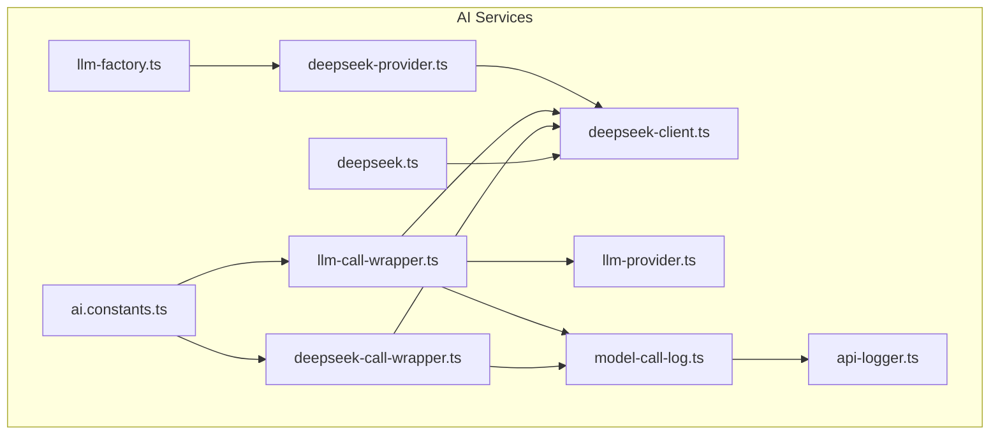
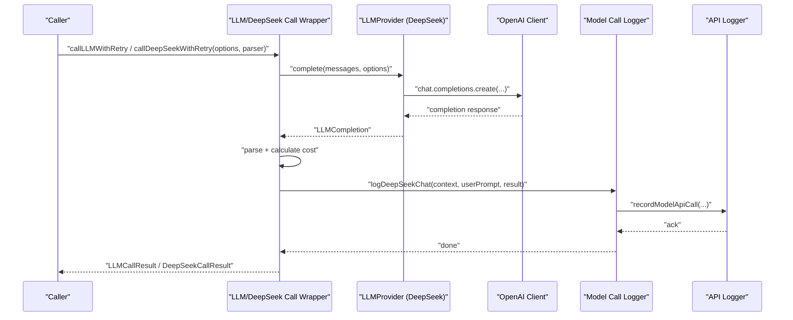
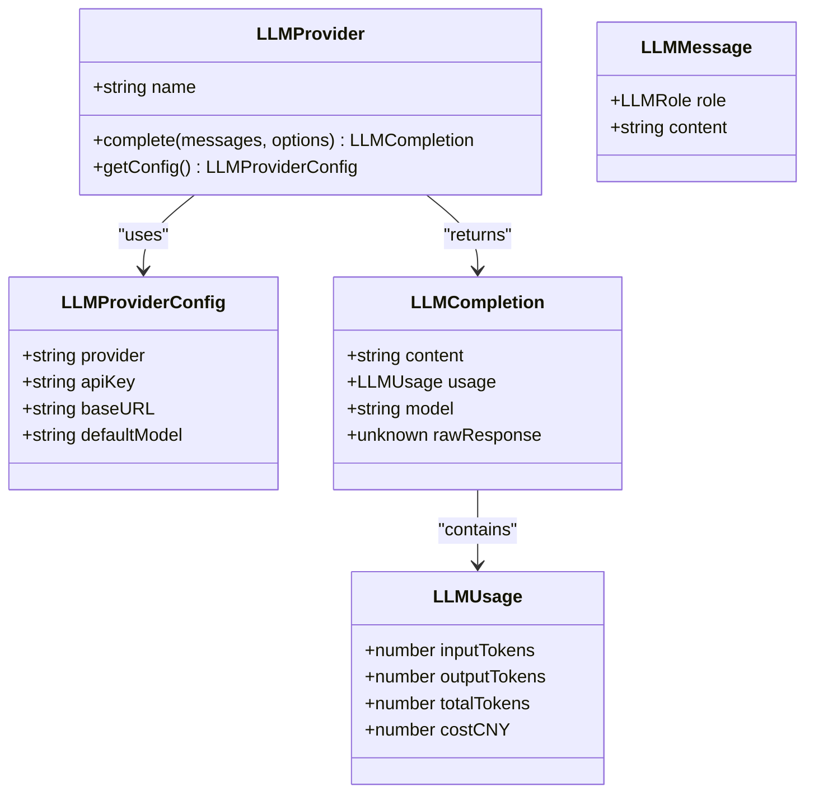
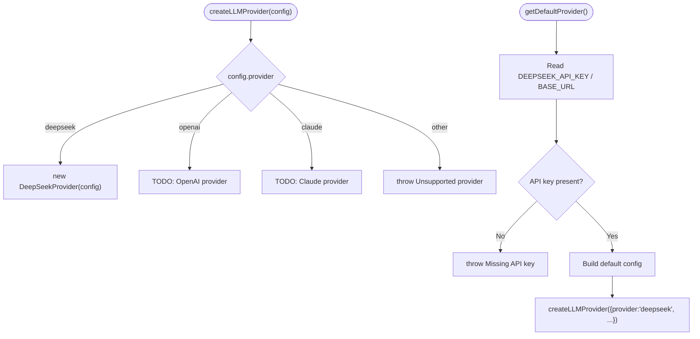
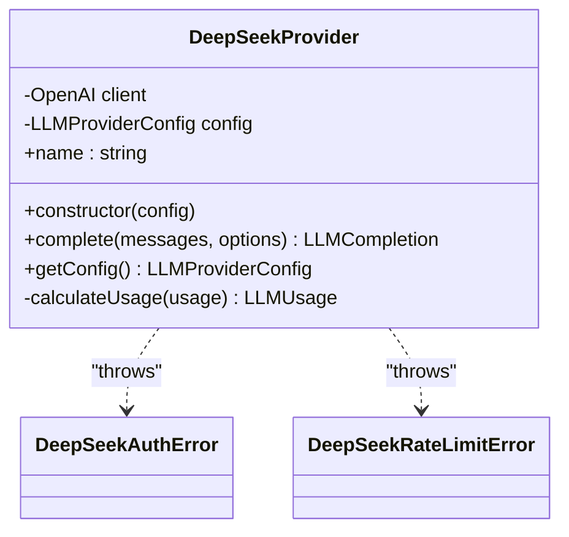
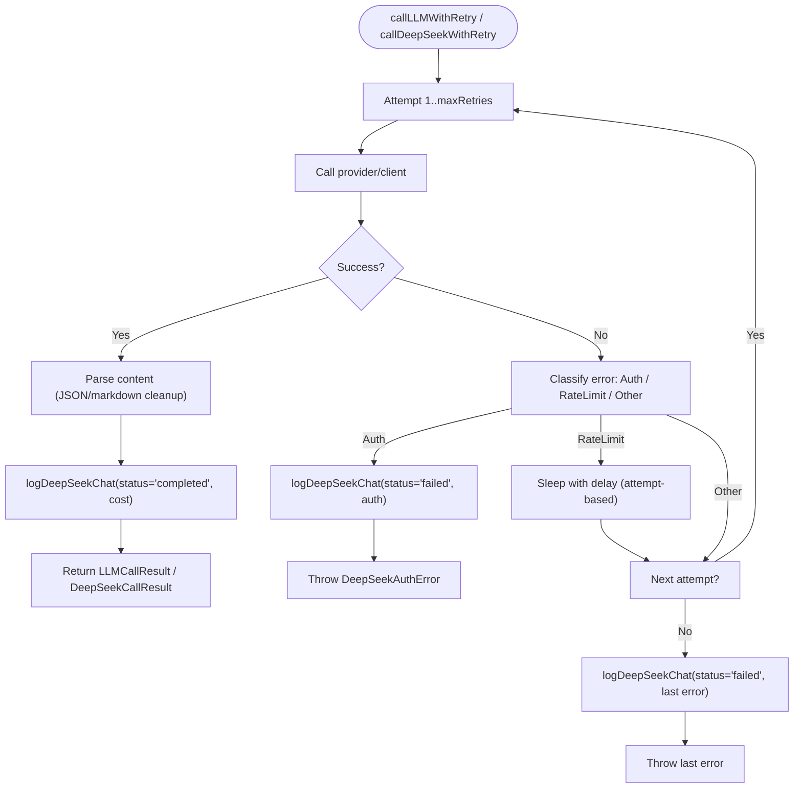
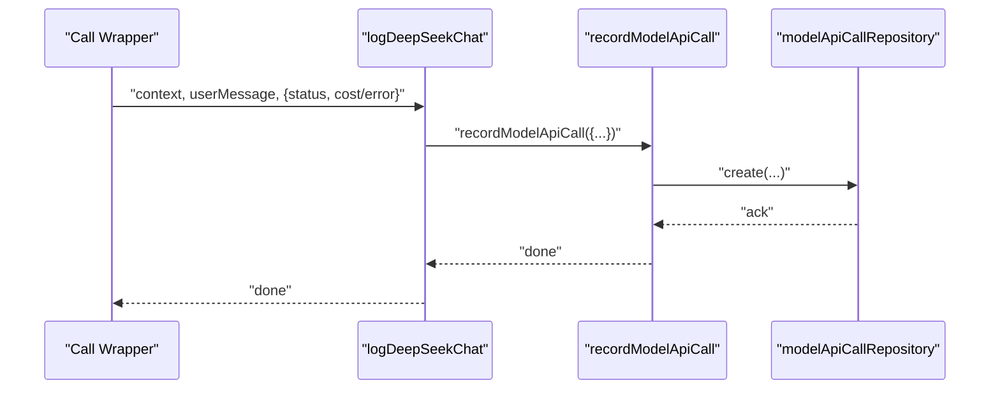
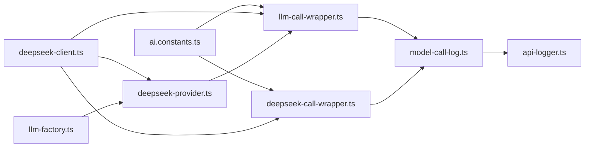

# AI Workflow Orchestration

<cite>
**Referenced Files in This Document**
- [llm-factory.ts](file://packages/backend/src/services/ai/llm-factory.ts)
- [llm-provider.ts](file://packages/backend/src/services/ai/llm-provider.ts)
- [deepseek-provider.ts](file://packages/backend/src/services/ai/deepseek-provider.ts)
- [llm-call-wrapper.ts](file://packages/backend/src/services/ai/llm-call-wrapper.ts)
- [deepseek-call-wrapper.ts](file://packages/backend/src/services/ai/deepseek-call-wrapper.ts)
- [deepseek-client.ts](file://packages/backend/src/services/ai/deepseek-client.ts)
- [ai.constants.ts](file://packages/backend/src/services/ai/ai.constants.ts)
- [model-call-log.ts](file://packages/backend/src/services/ai/model-call-log.ts)
- [api-logger.ts](file://packages/backend/src/services/ai/api-logger.ts)
- [deepseek.ts](file://packages/backend/src/services/ai/deepseek.ts)
</cite>

## Table of Contents

1. [Introduction](#introduction)
2. [Project Structure](#project-structure)
3. [Core Components](#core-components)
4. [Architecture Overview](#architecture-overview)
5. [Detailed Component Analysis](#detailed-component-analysis)
6. [Dependency Analysis](#dependency-analysis)
7. [Performance Considerations](#performance-considerations)
8. [Troubleshooting Guide](#troubleshooting-guide)
9. [Conclusion](#conclusion)
10. [Appendices](#appendices)

## Introduction

This document explains the AI workflow orchestration implemented in the backend AI services. It focuses on the factory pattern for LLM provider selection, a provider abstraction layer, a unified API call service, and robust logging and error handling. It also covers configuration management, retry and rate-limiting strategies, and performance monitoring. The system is designed to support multiple providers while maintaining a consistent interface and operational observability.

## Project Structure

The AI orchestration resides under the backend package’s AI services module. Key files include:

- Factory and provider abstractions
- Provider implementations (DeepSeek)
- Unified call wrappers with retry and logging
- Pricing and error types
- Logging and API call tracking utilities

**Diagram sources**

- [llm-factory.ts:1-72](file://packages/backend/src/services/ai/llm-factory.ts#L1-L72)
- [llm-provider.ts:1-89](file://packages/backend/src/services/ai/llm-provider.ts#L1-L89)
- [deepseek-provider.ts:1-92](file://packages/backend/src/services/ai/deepseek-provider.ts#L1-L92)
- [llm-call-wrapper.ts:1-170](file://packages/backend/src/services/ai/llm-call-wrapper.ts#L1-L170)
- [deepseek-call-wrapper.ts:1-177](file://packages/backend/src/services/ai/deepseek-call-wrapper.ts#L1-L177)
- [deepseek-client.ts:1-64](file://packages/backend/src/services/ai/deepseek-client.ts#L1-L64)
- [ai.constants.ts:1-78](file://packages/backend/src/services/ai/ai.constants.ts#L1-L78)
- [model-call-log.ts:1-44](file://packages/backend/src/services/ai/model-call-log.ts#L1-L44)
- [api-logger.ts:1-165](file://packages/backend/src/services/ai/api-logger.ts#L1-L165)
- [deepseek.ts:1-30](file://packages/backend/src/services/ai/deepseek.ts#L1-L30)

**Section sources**

- [llm-factory.ts:1-72](file://packages/backend/src/services/ai/llm-factory.ts#L1-L72)
- [llm-provider.ts:1-89](file://packages/backend/src/services/ai/llm-provider.ts#L1-L89)
- [deepseek-provider.ts:1-92](file://packages/backend/src/services/ai/deepseek-provider.ts#L1-L92)
- [llm-call-wrapper.ts:1-170](file://packages/backend/src/services/ai/llm-call-wrapper.ts#L1-L170)
- [deepseek-call-wrapper.ts:1-177](file://packages/backend/src/services/ai/deepseek-call-wrapper.ts#L1-L177)
- [deepseek-client.ts:1-64](file://packages/backend/src/services/ai/deepseek-client.ts#L1-L64)
- [ai.constants.ts:1-78](file://packages/backend/src/services/ai/ai.constants.ts#L1-L78)
- [model-call-log.ts:1-44](file://packages/backend/src/services/ai/model-call-log.ts#L1-L44)
- [api-logger.ts:1-165](file://packages/backend/src/services/ai/api-logger.ts#L1-L165)
- [deepseek.ts:1-30](file://packages/backend/src/services/ai/deepseek.ts#L1-L30)

## Core Components

- LLM Provider Abstraction: Defines roles, messages, usage statistics, completion results, provider configuration, and the provider interface contract.
- LLM Factory: Dynamically creates provider instances based on configuration and environment defaults.
- DeepSeek Provider: Implements the provider interface using an OpenAI-compatible client, mapping provider-specific errors and usage to the unified interface.
- Unified Call Wrappers: Provide retry logic, error categorization, parsing helpers, and model call logging for both generic provider usage and DeepSeek-specific flows.
- Pricing and Errors: Encapsulate cost calculation and standardized error types for authentication and rate-limit scenarios.
- Logging Utilities: Record model API calls to persistence and print concise terminal summaries, with truncation and filtering.

**Section sources**

- [llm-provider.ts:1-89](file://packages/backend/src/services/ai/llm-provider.ts#L1-L89)
- [llm-factory.ts:1-72](file://packages/backend/src/services/ai/llm-factory.ts#L1-L72)
- [deepseek-provider.ts:1-92](file://packages/backend/src/services/ai/deepseek-provider.ts#L1-L92)
- [llm-call-wrapper.ts:1-170](file://packages/backend/src/services/ai/llm-call-wrapper.ts#L1-L170)
- [deepseek-call-wrapper.ts:1-177](file://packages/backend/src/services/ai/deepseek-call-wrapper.ts#L1-L177)
- [deepseek-client.ts:1-64](file://packages/backend/src/services/ai/deepseek-client.ts#L1-L64)
- [model-call-log.ts:1-44](file://packages/backend/src/services/ai/model-call-log.ts#L1-L44)
- [api-logger.ts:1-165](file://packages/backend/src/services/ai/api-logger.ts#L1-L165)

## Architecture Overview

The system follows a layered architecture:

- Application code invokes the unified call wrapper with a provider instance and message payload.
- The wrapper executes the provider’s complete method, parses the response, records usage and cost, and logs the call.
- Errors are categorized into authentication, rate-limit, and transient failures, with tailored retry behavior.
- Logging integrates with a centralized API logger that persists records and prints terminal summaries.

**Diagram sources**

- [llm-call-wrapper.ts:54-138](file://packages/backend/src/services/ai/llm-call-wrapper.ts#L54-L138)
- [deepseek-call-wrapper.ts:56-144](file://packages/backend/src/services/ai/deepseek-call-wrapper.ts#L56-L144)
- [deepseek-provider.ts:35-76](file://packages/backend/src/services/ai/deepseek-provider.ts#L35-L76)
- [model-call-log.ts:15-43](file://packages/backend/src/services/ai/model-call-log.ts#L15-L43)
- [api-logger.ts:36-61](file://packages/backend/src/services/ai/api-logger.ts#L36-L61)

## Detailed Component Analysis

### LLM Provider Abstraction

Defines the canonical types and interface for LLM interactions:

- Roles and messages
- Usage metrics and cost estimation
- Completion result envelope
- Provider configuration and options
- The provider interface contract with complete and getConfig

**Diagram sources**

- [llm-provider.ts:6-89](file://packages/backend/src/services/ai/llm-provider.ts#L6-L89)

**Section sources**

- [llm-provider.ts:1-89](file://packages/backend/src/services/ai/llm-provider.ts#L1-L89)

### LLM Factory Pattern

Implements dynamic provider creation and default provider retrieval:

- createLLMProvider selects provider implementations by name
- getDefaultProvider reads environment variables and constructs a default DeepSeek provider
- Convenience factory for DeepSeek

**Diagram sources**

- [llm-factory.ts:17-56](file://packages/backend/src/services/ai/llm-factory.ts#L17-L56)

**Section sources**

- [llm-factory.ts:1-72](file://packages/backend/src/services/ai/llm-factory.ts#L1-L72)

### DeepSeek Provider Implementation

Encapsulates OpenAI-compatible client usage behind the provider interface:

- Initializes client with apiKey and baseURL
- Maps chat completion to LLMCompletion
- Converts provider-specific errors to standardized types
- Calculates usage and cost via pricing helper

**Diagram sources**

- [deepseek-provider.ts:21-91](file://packages/backend/src/services/ai/deepseek-provider.ts#L21-L91)
- [deepseek-client.ts:17-29](file://packages/backend/src/services/ai/deepseek-client.ts#L17-L29)

**Section sources**

- [deepseek-provider.ts:1-92](file://packages/backend/src/services/ai/deepseek-provider.ts#L1-L92)
- [deepseek-client.ts:1-64](file://packages/backend/src/services/ai/deepseek-client.ts#L1-L64)

### Unified Call Wrappers

Provide robust API invocation with retry, error handling, and logging:

- LLM call wrapper supports generic provider usage, JSON parsing, and markdown cleanup
- DeepSeek call wrapper targets system+user prompts, with similar resilience and logging
- Both wrappers:
  - Retry on transient errors, with exponential-like backoff for rate limits
  - Fail fast on authentication errors
  - Record model API calls with status, cost, and optional error messages
  - Parse structured responses and handle markdown fenced code blocks

**Diagram sources**

- [llm-call-wrapper.ts:54-138](file://packages/backend/src/services/ai/llm-call-wrapper.ts#L54-L138)
- [deepseek-call-wrapper.ts:56-144](file://packages/backend/src/services/ai/deepseek-call-wrapper.ts#L56-L144)

**Section sources**

- [llm-call-wrapper.ts:1-170](file://packages/backend/src/services/ai/llm-call-wrapper.ts#L1-L170)
- [deepseek-call-wrapper.ts:1-177](file://packages/backend/src/services/ai/deepseek-call-wrapper.ts#L1-L177)

### Logging and API Tracking

Centralized logging pipeline:

- logDeepSeekChat writes entries with user ID, model/provider, prompt, operation context, status, cost, and error messages
- recordModelApiCall persists logs and prints a concise terminal summary
- Truncation prevents oversized payloads
- Additional API logging utilities support broader API call tracking with status transitions and updates

**Diagram sources**

- [model-call-log.ts:15-43](file://packages/backend/src/services/ai/model-call-log.ts#L15-L43)
- [api-logger.ts:36-61](file://packages/backend/src/services/ai/api-logger.ts#L36-L61)

**Section sources**

- [model-call-log.ts:1-44](file://packages/backend/src/services/ai/model-call-log.ts#L1-L44)
- [api-logger.ts:1-165](file://packages/backend/src/services/ai/api-logger.ts#L1-L165)

### Configuration Management and Constants

Centralized configuration for:

- Temperature and max token presets per task type
- Retry attempts and delays
- Authentication and rate-limit status codes
- Time conversion and scene slot durations

These constants guide call wrappers and provider usage to maintain consistent behavior across tasks.

**Section sources**

- [ai.constants.ts:1-78](file://packages/backend/src/services/ai/ai.constants.ts#L1-L78)

### Pricing and Cost Calculation

- Pricing tiers for input tokens (cache hit vs miss) and output tokens
- Cost calculation function returning standardized usage metrics
- Provider implementation consumes usage to compute cost and populate LLMUsage

**Section sources**

- [deepseek-client.ts:31-56](file://packages/backend/src/services/ai/deepseek-client.ts#L31-L56)
- [deepseek-provider.ts:82-90](file://packages/backend/src/services/ai/deepseek-provider.ts#L82-L90)

### Export Facade

- Consolidates public APIs for downstream consumers (e.g., script enrichment, storyboard generation, balance queries)

**Section sources**

- [deepseek.ts:1-30](file://packages/backend/src/services/ai/deepseek.ts#L1-L30)

## Dependency Analysis

The following diagram shows key dependencies among components:

**Diagram sources**

- [ai.constants.ts:1-78](file://packages/backend/src/services/ai/ai.constants.ts#L1-L78)
- [llm-call-wrapper.ts:1-22](file://packages/backend/src/services/ai/llm-call-wrapper.ts#L1-L22)
- [deepseek-call-wrapper.ts:1-22](file://packages/backend/src/services/ai/deepseek-call-wrapper.ts#L1-L22)
- [deepseek-client.ts:1-64](file://packages/backend/src/services/ai/deepseek-client.ts#L1-L64)
- [deepseek-provider.ts:1-33](file://packages/backend/src/services/ai/deepseek-provider.ts#L1-L33)
- [model-call-log.ts:1-5](file://packages/backend/src/services/ai/model-call-log.ts#L1-L5)
- [api-logger.ts:1-5](file://packages/backend/src/services/ai/api-logger.ts#L1-L5)
- [llm-factory.ts:6-10](file://packages/backend/src/services/ai/llm-factory.ts#L6-L10)

**Section sources**

- [llm-factory.ts:1-72](file://packages/backend/src/services/ai/llm-factory.ts#L1-L72)
- [deepseek-provider.ts:1-92](file://packages/backend/src/services/ai/deepseek-provider.ts#L1-L92)
- [llm-call-wrapper.ts:1-170](file://packages/backend/src/services/ai/llm-call-wrapper.ts#L1-L170)
- [deepseek-call-wrapper.ts:1-177](file://packages/backend/src/services/ai/deepseek-call-wrapper.ts#L1-L177)
- [deepseek-client.ts:1-64](file://packages/backend/src/services/ai/deepseek-client.ts#L1-L64)
- [ai.constants.ts:1-78](file://packages/backend/src/services/ai/ai.constants.ts#L1-L78)
- [model-call-log.ts:1-44](file://packages/backend/src/services/ai/model-call-log.ts#L1-L44)
- [api-logger.ts:1-165](file://packages/backend/src/services/ai/api-logger.ts#L1-L165)

## Performance Considerations

- Token budgeting: Use task-specific temperature and max token presets to control output length and cost.
- Retry strategy: Prefer immediate retries for transient errors and incremental backoff for rate limits to reduce wasted attempts.
- Cost-aware usage: Leverage cache-hit pricing differences to optimize repeated prompts.
- Logging overhead: Logging is fire-and-forget in failure paths to minimize latency; ensure database throughput can handle the volume.
- Parsing efficiency: Clean markdown fences before JSON parsing to avoid unnecessary retries due to malformed content.

[No sources needed since this section provides general guidance]

## Troubleshooting Guide

Common issues and resolutions:

- Authentication failures: Immediate fail-fast with standardized error; verify API keys and base URLs.
- Rate limit exceeded: Automatic retry with increasing delays; consider lowering request frequency or adjusting presets.
- Empty or malformed responses: Ensure prompts are well-formed and consider enabling markdown cleanup prior to parsing.
- Missing environment configuration: Default provider requires API key and base URL; ensure environment variables are set.

Operational checks:

- Confirm provider factory receives supported provider names.
- Validate that usage metrics are populated and cost calculations align with pricing tiers.
- Review logged entries for status, cost, and error messages to diagnose failures.

**Section sources**

- [llm-call-wrapper.ts:96-138](file://packages/backend/src/services/ai/llm-call-wrapper.ts#L96-L138)
- [deepseek-call-wrapper.ts:103-144](file://packages/backend/src/services/ai/deepseek-call-wrapper.ts#L103-L144)
- [deepseek-client.ts:17-29](file://packages/backend/src/services/ai/deepseek-client.ts#L17-L29)
- [llm-factory.ts:42-56](file://packages/backend/src/services/ai/llm-factory.ts#L42-L56)

## Conclusion

The AI workflow orchestration leverages a clean provider abstraction, a factory-driven selection mechanism, and unified call wrappers to deliver resilient, observable, and cost-conscious LLM interactions. With standardized error handling, configurable retry policies, and integrated logging, the system supports scalable AI service utilization across diverse tasks.

[No sources needed since this section summarizes without analyzing specific files]

## Appendices

### API Definitions and Behaviors

- Provider interface: complete and getConfig define the contract for all providers.
- Call wrappers: accept messages or system+user prompts, apply task-appropriate temperature and token limits, and return typed results with cost and raw responses.
- Logging: recordModelApiCall persists structured logs with status, cost, and optional error messages; model-call-log consolidates context and truncates oversized inputs.

**Section sources**

- [llm-provider.ts:65-85](file://packages/backend/src/services/ai/llm-provider.ts#L65-L85)
- [llm-call-wrapper.ts:23-47](file://packages/backend/src/services/ai/llm-call-wrapper.ts#L23-L47)
- [deepseek-call-wrapper.ts:23-49](file://packages/backend/src/services/ai/deepseek-call-wrapper.ts#L23-L49)
- [api-logger.ts:22-61](file://packages/backend/src/services/ai/api-logger.ts#L22-L61)
- [model-call-log.ts:15-43](file://packages/backend/src/services/ai/model-call-log.ts#L15-L43)
