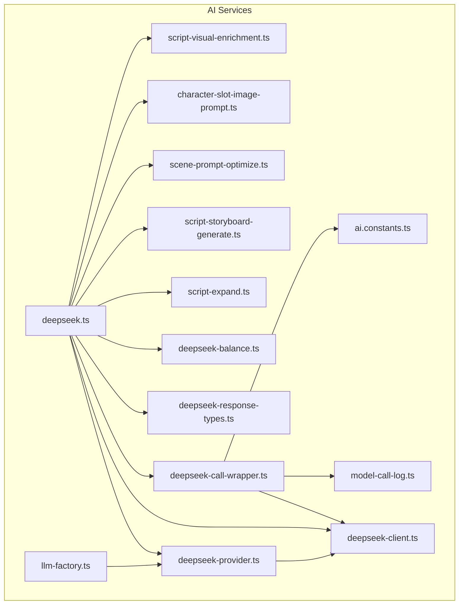
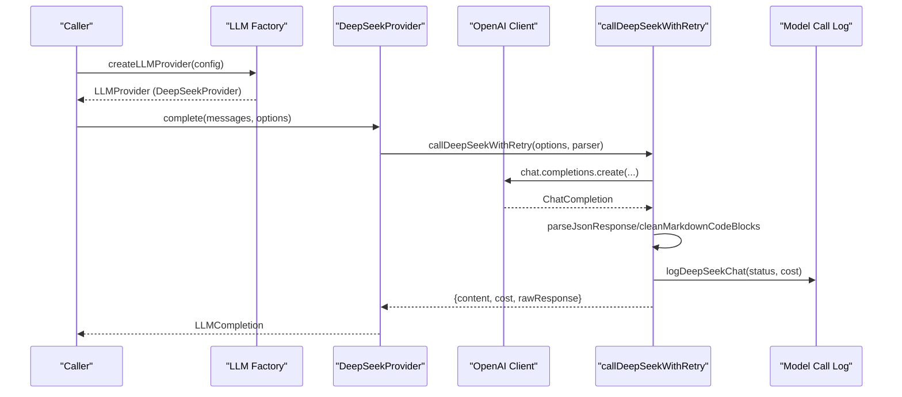
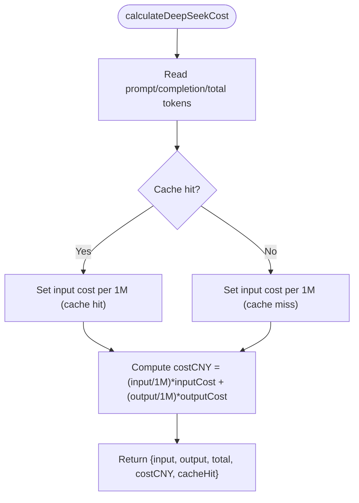
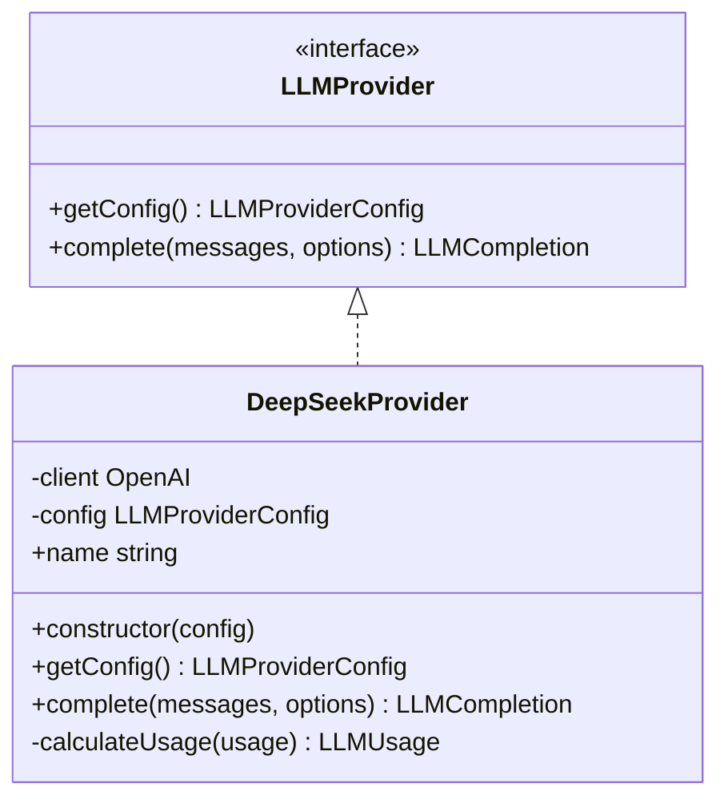
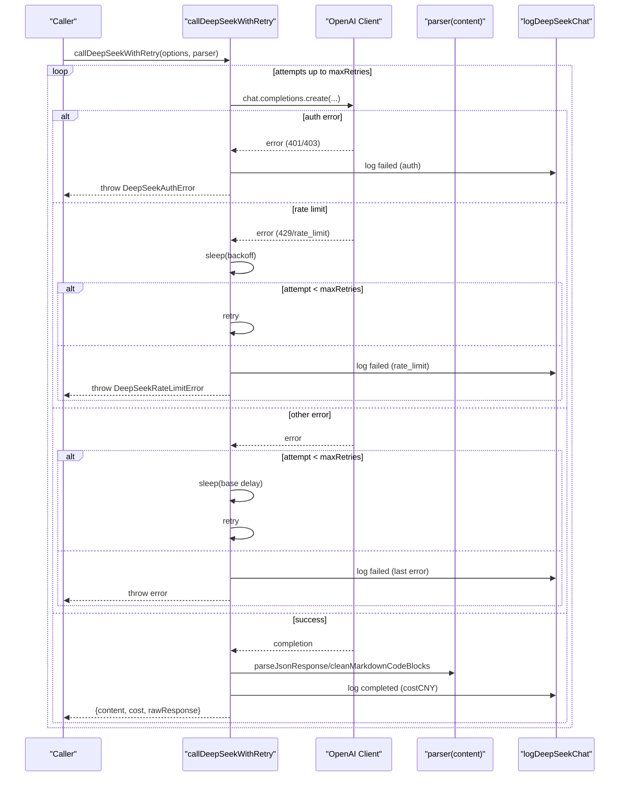
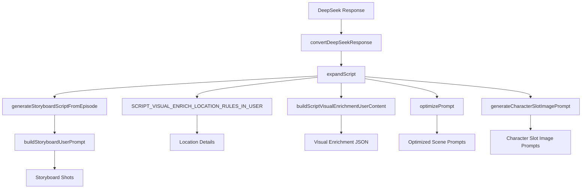
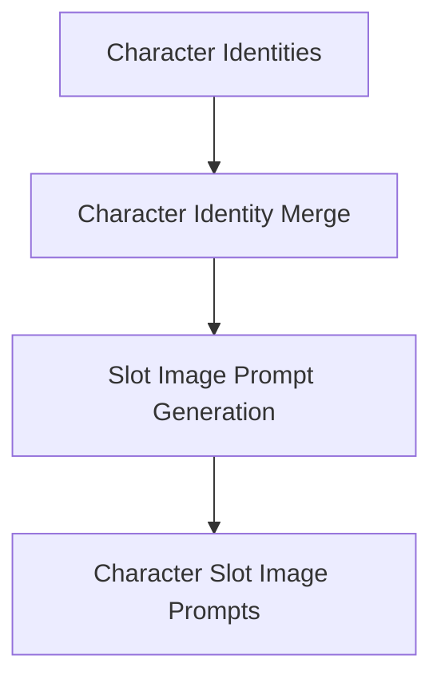
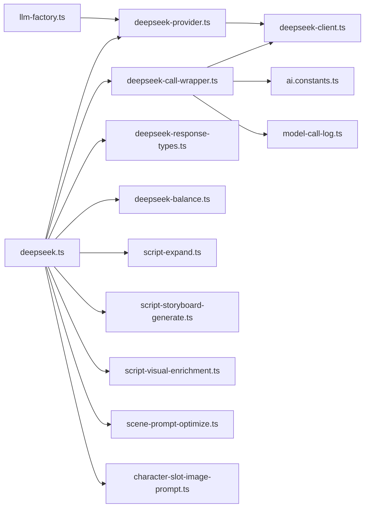

# DeepSeek Integration

<cite>
**Referenced Files in This Document**
- [README.md](file://README.md)
- [deepseek.ts](file://packages/backend/src/services/ai/deepseek.ts)
- [deepseek-client.ts](file://packages/backend/src/services/ai/deepseek-client.ts)
- [deepseek-provider.ts](file://packages/backend/src/services/ai/deepseek-provider.ts)
- [deepseek-call-wrapper.ts](file://packages/backend/src/services/ai/deepseek-call-wrapper.ts)
- [deepseek-response-types.ts](file://packages/backend/src/services/ai/deepseek-response-types.ts)
- [llm-factory.ts](file://packages/backend/src/services/ai/llm-factory.ts)
- [deepseek-balance.ts](file://packages/backend/src/services/ai/deepseek-balance.ts)
- [script-expand.ts](file://packages/backend/src/services/ai/script-expand.ts)
- [script-storyboard-generate.ts](file://packages/backend/src/services/ai/script-storyboard-generate.ts)
- [scene-prompt-optimize.ts](file://packages/backend/src/services/ai/scene-prompt-optimize.ts)
- [character-slot-image-prompt.ts](file://packages/backend/src/services/ai/character-slot-image-prompt.ts)
- [script-visual-enrichment.ts](file://packages/backend/src/services/ai/script-visual-enrichment.ts)
- [model-call-log.ts](file://packages/backend/src/services/ai/model-call-log.ts)
- [ai.constants.ts](file://packages/backend/src/services/ai/ai.constants.ts)
- [character-image-prompt.ts](file://packages/backend/src/lib/character-image-prompt.ts)
- [location-establishing-prompt.ts](file://packages/backend/src/lib/location-establishing-prompt.ts)
- [project-aspect.ts](file://packages/backend/src/lib/project-aspect.ts)
</cite>

## Table of Contents

1. [Introduction](#introduction)
2. [Project Structure](#project-structure)
3. [Core Components](#core-components)
4. [Architecture Overview](#architecture-overview)
5. [Detailed Component Analysis](#detailed-component-analysis)
6. [Dependency Analysis](#dependency-analysis)
7. [Performance Considerations](#performance-considerations)
8. [Troubleshooting Guide](#troubleshooting-guide)
9. [Conclusion](#conclusion)
10. [Appendices](#appendices)

## Introduction

This document explains the DeepSeek AI integration for the Dreamer platform, focusing on the complete script generation pipeline. It covers client configuration, the provider pattern for LLM integration, API wrapper implementation with retry and error handling, and the end-to-end workflows for script parsing, storyboard generation, visual enrichment, scene prompt optimization, character identity merging, and slot image prompt generation. It also documents cost management, balance tracking, and integration with the broader AI pipeline orchestration system.

## Project Structure

The DeepSeek integration lives under the backend AI services module. The key areas include:

- LLM provider abstraction and factory
- DeepSeek client and cost calculation
- API call wrapper with retry and logging
- Script expansion and storyboard generation
- Visual enrichment and scene prompt optimization
- Character identity and slot image prompt generation
- Balance retrieval and cost types

**Diagram sources**

- [deepseek.ts:1-30](file://packages/backend/src/services/ai/deepseek.ts#L1-L30)
- [deepseek-provider.ts:1-92](file://packages/backend/src/services/ai/deepseek-provider.ts#L1-L92)
- [deepseek-client.ts:1-64](file://packages/backend/src/services/ai/deepseek-client.ts#L1-L64)
- [deepseek-call-wrapper.ts:1-177](file://packages/backend/src/services/ai/deepseek-call-wrapper.ts#L1-L177)
- [deepseek-response-types.ts:1-71](file://packages/backend/src/services/ai/deepseek-response-types.ts#L1-L71)
- [llm-factory.ts:1-71](file://packages/backend/src/services/ai/llm-factory.ts#L1-L71)
- [deepseek-balance.ts:1-33](file://packages/backend/src/services/ai/deepseek-balance.ts#L1-L33)
- [script-expand.ts](file://packages/backend/src/services/ai/script-expand.ts)
- [script-storyboard-generate.ts](file://packages/backend/src/services/ai/script-storyboard-generate.ts)
- [scene-prompt-optimize.ts](file://packages/backend/src/services/ai/scene-prompt-optimize.ts)
- [character-slot-image-prompt.ts](file://packages/backend/src/services/ai/character-slot-image-prompt.ts)
- [script-visual-enrichment.ts](file://packages/backend/src/services/ai/script-visual-enrichment.ts)
- [model-call-log.ts](file://packages/backend/src/services/ai/model-call-log.ts)
- [ai.constants.ts](file://packages/backend/src/services/ai/ai.constants.ts)

**Section sources**

- [README.md:21-25](file://README.md#L21-L25)
- [deepseek.ts:1-30](file://packages/backend/src/services/ai/deepseek.ts#L1-L30)

## Core Components

- DeepSeek client configuration and cost calculator
- Provider pattern for LLM integration
- API call wrapper with retry/backoff, error normalization, and logging
- Script expansion and storyboard generation
- Visual enrichment and scene prompt optimization
- Character identity merging and slot image prompt generation
- Balance retrieval and cost types

**Section sources**

- [deepseek-client.ts:1-64](file://packages/backend/src/services/ai/deepseek-client.ts#L1-L64)
- [deepseek-provider.ts:1-92](file://packages/backend/src/services/ai/deepseek-provider.ts#L1-L92)
- [llm-factory.ts:1-71](file://packages/backend/src/services/ai/llm-factory.ts#L1-L71)
- [deepseek-call-wrapper.ts:1-177](file://packages/backend/src/services/ai/deepseek-call-wrapper.ts#L1-L177)
- [deepseek-response-types.ts:1-71](file://packages/backend/src/services/ai/deepseek-response-types.ts#L1-L71)
- [deepseek-balance.ts:1-33](file://packages/backend/src/services/ai/deepseek-balance.ts#L1-L33)

## Architecture Overview

The DeepSeek integration follows a layered architecture:

- Provider layer encapsulates the OpenAI-compatible client and exposes a unified LLM interface.
- Factory creates providers based on configuration.
- Wrapper layer handles retries, rate-limit/backoff, authentication errors, and structured logging.
- Domain services orchestrate higher-level workflows: script expansion, storyboard generation, visual enrichment, and prompt optimization.
- Utilities provide character and location prompt templates and project aspect ratio support.

**Diagram sources**

- [llm-factory.ts:17-71](file://packages/backend/src/services/ai/llm-factory.ts#L17-L71)
- [deepseek-provider.ts:35-76](file://packages/backend/src/services/ai/deepseek-provider.ts#L35-L76)
- [deepseek-call-wrapper.ts:56-145](file://packages/backend/src/services/ai/deepseek-call-wrapper.ts#L56-L145)
- [model-call-log.ts](file://packages/backend/src/services/ai/model-call-log.ts)

## Detailed Component Analysis

### DeepSeek Client and Cost Management

- Client creation supports environment-based API key and base URL.
- Cost calculation accounts for input/output tokens and cache-hit pricing tiers.
- Authentication and rate-limit errors are normalized into typed exceptions.

**Diagram sources**

- [deepseek-client.ts:31-56](file://packages/backend/src/services/ai/deepseek-client.ts#L31-L56)

**Section sources**

- [deepseek-client.ts:1-64](file://packages/backend/src/services/ai/deepseek-client.ts#L1-L64)
- [deepseek-balance.ts:1-33](file://packages/backend/src/services/ai/deepseek-balance.ts#L1-L33)

### Provider Pattern for LLM Integration

- Implements a unified LLMProvider interface with a DeepSeekProvider implementation.
- Wraps OpenAI client initialization and chat completions.
- Normalizes errors to typed exceptions for consistent handling.
- Calculates usage via the shared cost calculator.

**Diagram sources**

- [deepseek-provider.ts:21-92](file://packages/backend/src/services/ai/deepseek-provider.ts#L21-L92)

**Section sources**

- [deepseek-provider.ts:1-92](file://packages/backend/src/services/ai/deepseek-provider.ts#L1-L92)
- [llm-factory.ts:1-71](file://packages/backend/src/services/ai/llm-factory.ts#L1-L71)

### API Wrapper Implementation with Retry and Logging

- Provides a generic callDeepSeekWithRetry function with configurable retries, delays, and parsers.
- Handles authentication errors immediately and rate-limit errors with exponential backoff.
- Parses JSON responses, optionally cleaning markdown code blocks.
- Logs successful and failed calls with cost and error metadata.

**Diagram sources**

- [deepseek-call-wrapper.ts:56-145](file://packages/backend/src/services/ai/deepseek-call-wrapper.ts#L56-L145)
- [model-call-log.ts](file://packages/backend/src/services/ai/model-call-log.ts)
- [ai.constants.ts](file://packages/backend/src/services/ai/ai.constants.ts)

**Section sources**

- [deepseek-call-wrapper.ts:1-177](file://packages/backend/src/services/ai/deepseek-call-wrapper.ts#L1-L177)
- [ai.constants.ts](file://packages/backend/src/services/ai/ai.constants.ts)

### Script Parsing and Enrichment Workflows

- Script expansion converts DeepSeek responses into structured script entities.
- Storyboard generation builds user prompts and extracts shot lists for episodes.
- Visual enrichment augments scripts with location-establishing details and scene visuals.
- Scene prompt optimization refines prompts for image generation.
- Character identity merging and slot image prompt generation support casting and asset preparation.

**Diagram sources**

- [deepseek.ts:11-29](file://packages/backend/src/services/ai/deepseek.ts#L11-L29)
- [script-expand.ts](file://packages/backend/src/services/ai/script-expand.ts)
- [script-storyboard-generate.ts](file://packages/backend/src/services/ai/script-storyboard-generate.ts)
- [script-visual-enrichment.ts](file://packages/backend/src/services/ai/script-visual-enrichment.ts)
- [scene-prompt-optimize.ts](file://packages/backend/src/services/ai/scene-prompt-optimize.ts)
- [character-slot-image-prompt.ts](file://packages/backend/src/services/ai/character-slot-image-prompt.ts)

**Section sources**

- [deepseek.ts:1-30](file://packages/backend/src/services/ai/deepseek.ts#L1-L30)
- [deepseek-response-types.ts:1-71](file://packages/backend/src/services/ai/deepseek-response-types.ts#L1-L71)

### Character Identity Merging and Slot Image Prompt Generation

- Character identity merging consolidates character identities across script entities.
- Slot image prompt generation produces prompts for character slot images, leveraging character and project context.

**Diagram sources**

- [character-image-prompt.ts](file://packages/backend/src/lib/character-image-prompt.ts)
- [character-slot-image-prompt.ts](file://packages/backend/src/services/ai/character-slot-image-prompt.ts)

**Section sources**

- [character-image-prompt.ts](file://packages/backend/src/lib/character-image-prompt.ts)
- [character-slot-image-prompt.ts](file://packages/backend/src/services/ai/character-slot-image-prompt.ts)

### Location Establishing and Project Aspect Ratio

- Location-establishing prompt utilities help define scene settings.
- Project aspect ratio utilities support consistent visual composition.

**Section sources**

- [location-establishing-prompt.ts](file://packages/backend/src/lib/location-establishing-prompt.ts)
- [project-aspect.ts](file://packages/backend/src/lib/project-aspect.ts)

## Dependency Analysis

The integration exhibits low coupling and high cohesion:

- Provider depends on client and error types.
- Wrapper depends on client, constants, and logging.
- Public facade re-exports domain functions for external consumers.
- Domain services depend on response types and utilities.

**Diagram sources**

- [llm-factory.ts:1-71](file://packages/backend/src/services/ai/llm-factory.ts#L1-L71)
- [deepseek-provider.ts:1-92](file://packages/backend/src/services/ai/deepseek-provider.ts#L1-L92)
- [deepseek-client.ts:1-64](file://packages/backend/src/services/ai/deepseek-client.ts#L1-L64)
- [deepseek-call-wrapper.ts:1-177](file://packages/backend/src/services/ai/deepseek-call-wrapper.ts#L1-L177)
- [deepseek-response-types.ts:1-71](file://packages/backend/src/services/ai/deepseek-response-types.ts#L1-L71)
- [deepseek-balance.ts:1-33](file://packages/backend/src/services/ai/deepseek-balance.ts#L1-L33)
- [deepseek.ts:1-30](file://packages/backend/src/services/ai/deepseek.ts#L1-L30)
- [ai.constants.ts](file://packages/backend/src/services/ai/ai.constants.ts)
- [model-call-log.ts](file://packages/backend/src/services/ai/model-call-log.ts)

**Section sources**

- [deepseek.ts:1-30](file://packages/backend/src/services/ai/deepseek.ts#L1-L30)
- [llm-factory.ts:1-71](file://packages/backend/src/services/ai/llm-factory.ts#L1-L71)

## Performance Considerations

- Token-aware cost calculation enables budget-aware orchestration.
- Retry/backoff reduces transient failure impact while respecting rate limits.
- Structured logging supports observability and cost attribution.
- Using cache-hit pricing tiers encourages prompt reuse and chunking strategies.

[No sources needed since this section provides general guidance]

## Troubleshooting Guide

Common issues and resolutions:

- Authentication failures: Immediate throw without retry; verify API key and base URL environment variables.
- Rate limiting: Automatic backoff with capped retries; consider lowering concurrency or increasing delays.
- Empty responses: Parser validates content presence; ensure prompts yield non-empty outputs.
- JSON parsing errors: Use the built-in parser with markdown block cleanup for JSON responses.

**Section sources**

- [deepseek-call-wrapper.ts:103-145](file://packages/backend/src/services/ai/deepseek-call-wrapper.ts#L103-L145)
- [deepseek-client.ts:17-29](file://packages/backend/src/services/ai/deepseek-client.ts#L17-L29)

## Conclusion

The DeepSeek integration provides a robust, extensible foundation for AI-driven script generation and enrichment. The provider pattern ensures consistent LLM interactions, while the wrapper layer delivers resilient, observable, and cost-aware API calls. The domain services enable end-to-end orchestration from initial script expansion to storyboard generation, visual enrichment, and character asset preparation.

[No sources needed since this section summarizes without analyzing specific files]

## Appendices

### Environment Variables

- DEEPSEEK_API_KEY: DeepSeek API key for authentication.
- DEEPSEEK_BASE_URL: Optional override for the DeepSeek base URL.

**Section sources**

- [README.md:112-114](file://README.md#L112-L114)
- [llm-factory.ts:41-56](file://packages/backend/src/services/ai/llm-factory.ts#L41-L56)
- [deepseek-client.ts:58-63](file://packages/backend/src/services/ai/deepseek-client.ts#L58-L63)

### Example Prompt Engineering Patterns

- Use explicit JSON expectations in system/user prompts to improve parsing reliability.
- Enclose structured outputs in code blocks for cleaner extraction.
- Provide clear roles and constraints to reduce ambiguity and token waste.

[No sources needed since this section provides general guidance]

### Integration with AI Pipeline Orchestration

- The public facade exports domain functions for use across routes and workers.
- Model call logs integrate with the broader logging system for auditability and cost tracking.

**Section sources**

- [deepseek.ts:1-30](file://packages/backend/src/services/ai/deepseek.ts#L1-L30)
- [model-call-log.ts](file://packages/backend/src/services/ai/model-call-log.ts)
