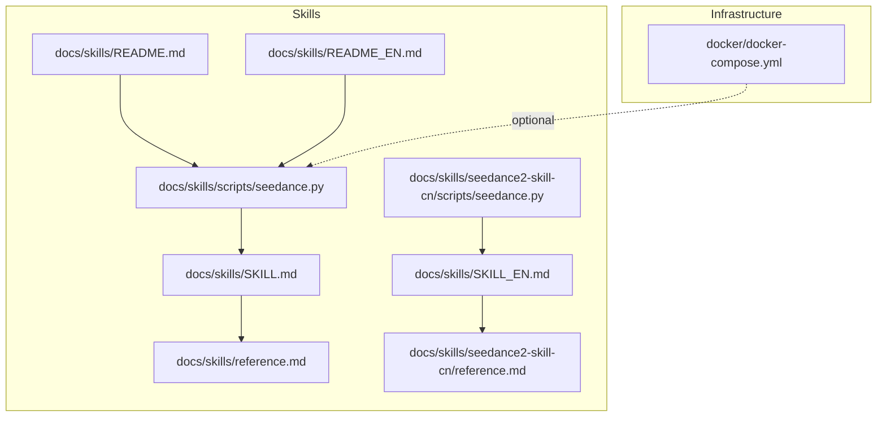
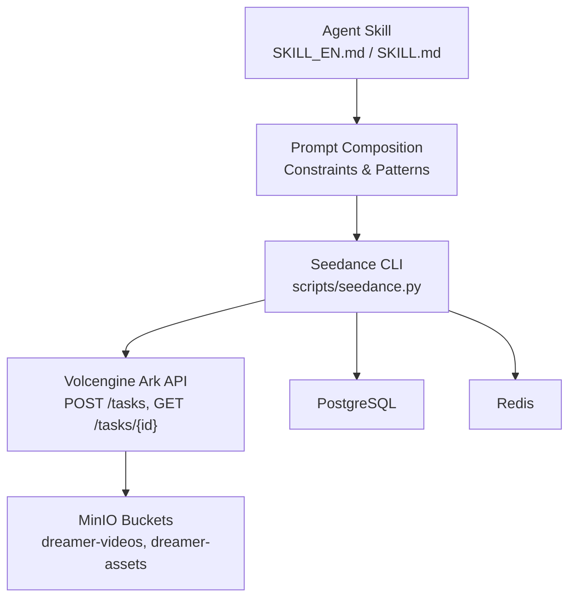
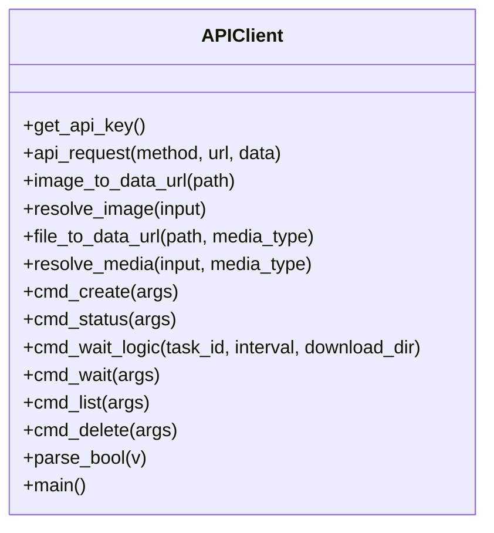
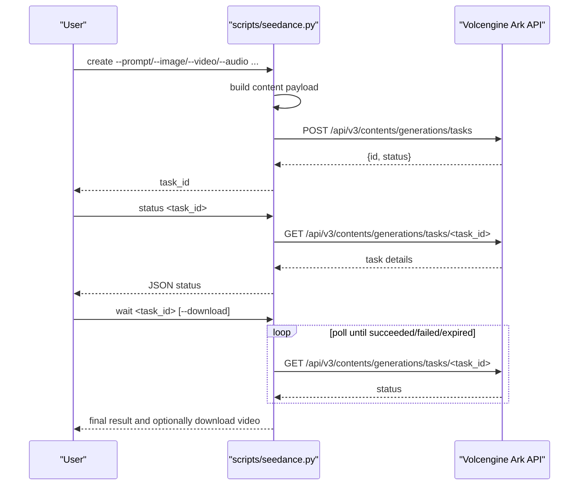
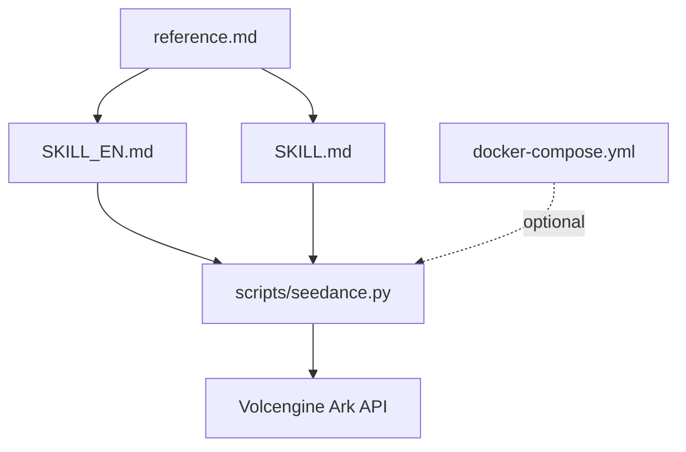

# Seedance 2.0 Integration

<cite>
**Referenced Files in This Document**
- [seedance.py](file://docs/skills/scripts/seedance.py)
- [seedance.py](file://docs/skills/seedance2-skill-cn/scripts/seedance.py)
- [SKILL.md](file://docs/skills/SKILL.md)
- [SKILL_EN.md](file://docs/skills/SKILL_EN.md)
- [README.md](file://docs/skills/README.md)
- [README_EN.md](file://docs/skills/README_EN.md)
- [reference.md](file://docs/skills/reference.md)
- [reference.md](file://docs/skills/seedance2-skill-cn/reference.md)
- [docker-compose.yml](file://docker/docker-compose.yml)
</cite>

## Table of Contents

1. [Introduction](#introduction)
2. [Project Structure](#project-structure)
3. [Core Components](#core-components)
4. [Architecture Overview](#architecture-overview)
5. [Detailed Component Analysis](#detailed-component-analysis)
6. [Dependency Analysis](#dependency-analysis)
7. [Performance Considerations](#performance-considerations)
8. [Troubleshooting Guide](#troubleshooting-guide)
9. [Conclusion](#conclusion)
10. [Appendices](#appendices)

## Introduction

This document explains the Seedance 2.0 integration within the Dreamer project, focusing on:

- The Seedance API client implemented as a Python CLI
- The Python-based skill system for prompt engineering and multimodal video generation
- Multilingual skill support (Chinese/English)
- Request/response handling, parameter passing, and result processing
- Examples of skill invocation, error handling, and integration with a video refinement pipeline
- Development patterns and customization options for extending Seedance capabilities

The integration leverages:

- A Volcengine Ark API client (Python CLI) to submit tasks and poll status
- Agent skills that guide prompt creation and multimodal composition
- Reference materials for camera language, style vocabularies, and examples
- Optional infrastructure (PostgreSQL, Redis, MinIO) for broader pipeline orchestration

## Project Structure

The Seedance integration is organized under docs/skills with:

- A Python CLI for Seedance API operations
- Agent skills and reference materials for prompt engineering
- Multilingual documentation and installation guidance
- Optional Docker compose for supporting services

**Diagram sources**

- [seedance.py:1-407](file://docs/skills/scripts/seedance.py#L1-L407)
- [seedance.py:1-407](file://docs/skills/seedance2-skill-cn/scripts/seedance.py#L1-L407)
- [SKILL.md:1-379](file://docs/skills/SKILL.md#L1-L379)
- [SKILL_EN.md:1-161](file://docs/skills/SKILL_EN.md#L1-L161)
- [reference.md:1-323](file://docs/skills/reference.md#L1-L323)
- [reference.md:1-323](file://docs/skills/seedance2-skill-cn/reference.md#L1-L323)
- [README.md:1-50](file://docs/skills/README.md#L1-L50)
- [README_EN.md:1-134](file://docs/skills/README_EN.md#L1-L134)
- [docker-compose.yml:1-71](file://docker/docker-compose.yml#L1-L71)

**Section sources**

- [README.md:1-50](file://docs/skills/README.md#L1-L50)
- [README_EN.md:1-134](file://docs/skills/README_EN.md#L1-L134)
- [docker-compose.yml:1-71](file://docker/docker-compose.yml#L1-L71)

## Core Components

- Seedance API Client (Python CLI)
  - Provides subcommands for task creation, status polling, waiting for completion, listing tasks, and deletion
  - Handles authentication via an environment variable and constructs requests to the Volcengine Ark API
  - Encodes local media files into base64 data URLs and resolves remote URLs
  - Supports advanced parameters such as aspect ratio, duration, resolution, camera fixation, watermark, audio generation, draft mode, last frame return, service tier, frame count, execution expiry, and callback URL
- Prompt Engineering Skills
  - Agent skill documents define multimodal prompt patterns, creativity gates, and reference systems
  - Provide templates and constraints for image/video/audio inputs and output expectations
- Reference Materials
  - Comprehensive vocabulary for camera language, styles, and examples
  - Guidance for long-form video composition via segmentation and chaining

**Section sources**

- [seedance.py:343-407](file://docs/skills/scripts/seedance.py#L343-L407)
- [SKILL.md:1-379](file://docs/skills/SKILL.md#L1-L379)
- [SKILL_EN.md:1-161](file://docs/skills/SKILL_EN.md#L1-L161)
- [reference.md:1-323](file://docs/skills/reference.md#L1-L323)

## Architecture Overview

The Seedance integration follows a modular architecture:

- Agent skill orchestrates prompt creation and multimodal composition
- Python CLI interacts with the Seedance API to submit tasks and manage lifecycle
- Optional infrastructure supports storage and orchestration for a broader pipeline

**Diagram sources**

- [SKILL_EN.md:1-161](file://docs/skills/SKILL_EN.md#L1-L161)
- [SKILL.md:1-379](file://docs/skills/SKILL.md#L1-L379)
- [seedance.py:31-33](file://docs/skills/scripts/seedance.py#L31-L33)
- [docker-compose.yml:1-71](file://docker/docker-compose.yml#L1-L71)

## Detailed Component Analysis

### Seedance API Client (Python CLI)

The CLI implements:

- Authentication via environment variable
- Media resolution helpers for images and media files
- Task creation with flexible multimodal content
- Status polling and result retrieval
- Listing and deletion of tasks
- Optional automatic download of generated videos

**Diagram sources**

- [seedance.py:35-407](file://docs/skills/scripts/seedance.py#L35-L407)

Key behaviors:

- Authentication and request construction
- Input validation and size limits for images and media
- Content assembly for Seedance tasks (text, images, videos, audios)
- Polling loop with status checks and result extraction
- Optional download of generated video and opening on macOS

**Section sources**

- [seedance.py:35-407](file://docs/skills/scripts/seedance.py#L35-L407)

### Seedance CLI Command Flow

**Diagram sources**

- [seedance.py:142-304](file://docs/skills/scripts/seedance.py#L142-L304)

### Prompt Engineering Skills and Multilingual Support

- SKILL_EN.md defines the English skill entry point and capabilities, including:
  - Multimodal vision, creative ideation, copy expansion, vocabulary selection, image diagnosis, pairing validation, creativity review, and API generation
  - Model capabilities and fallback strategies
  - Usage examples and prerequisites
- SKILL.md provides the Chinese skill entry point with:
  - Input constraints, @ reference syntax, camera language, prompt structure patterns, and ready-to-use templates
  - Examples for ads, dramas, MVs, educational content, and more
- reference.md complements both with:
  - Camera language vocabulary, style keywords, director style references, anime techniques
  - Practical examples and strategies for long-form videos

Integration patterns:

- Agents load either SKILL_EN.md or SKILL.md depending on language context
- Both produce Chinese prompts for optimal Seedance performance
- reference.md is loaded on-demand for additional context

**Section sources**

- [SKILL_EN.md:1-161](file://docs/skills/SKILL_EN.md#L1-L161)
- [SKILL.md:1-379](file://docs/skills/SKILL.md#L1-L379)
- [reference.md:1-323](file://docs/skills/reference.md#L1-L323)

### Skill Configuration, Parameter Passing, and Result Processing

- CLI parameters map directly to Seedance task fields:
  - Model selection, aspect ratio, duration, resolution, camera fixation, watermark, audio generation, draft mode, last frame return, service tier, frame count, execution expiry, callback URL
- Content assembly:
  - Text prompt, first/last frames, reference images, reference videos, reference audios
- Result processing:
  - Status polling yields video URL and optional last frame URL
  - Optional download to a specified directory with platform-specific open behavior

**Section sources**

- [seedance.py:142-233](file://docs/skills/scripts/seedance.py#L142-L233)
- [seedance.py:244-304](file://docs/skills/scripts/seedance.py#L244-L304)

### Examples of Skill Invocation and Integration

- Text-to-video, image-to-video, video reference, audio beat-sync, multimodal mixing, auto duration, draft preview, offline inference, video chaining, webhook callbacks, and task management are covered in the English skill documentation and CLI usage.

**Section sources**

- [SKILL_EN.md:93-157](file://docs/skills/SKILL_EN.md#L93-L157)
- [README_EN.md:49-65](file://docs/skills/README_EN.md#L49-L65)

### Error Handling

- Network and HTTP errors are captured and reported with meaningful messages
- CLI exits on authentication or resource errors
- Status polling differentiates succeeded, failed, and expired states and handles each appropriately

**Section sources**

- [seedance.py:44-73](file://docs/skills/scripts/seedance.py#L44-L73)
- [seedance.py:285-295](file://docs/skills/scripts/seedance.py#L285-L295)

### Integration with the Video Refinement Pipeline

- Optional infrastructure (PostgreSQL, Redis, MinIO) supports broader pipeline orchestration
- MinIO buckets are provisioned for storing generated videos and assets
- The CLI can download results to a local directory for downstream processing

**Section sources**

- [docker-compose.yml:1-71](file://docker/docker-compose.yml#L1-L71)

## Dependency Analysis

- The Python CLI is self-contained with standard library usage and has no third-party dependencies
- The skills rely on the CLI and reference materials for prompt engineering and multimodal composition
- Infrastructure dependencies (PostgreSQL, Redis, MinIO) are optional and managed via Docker compose

**Diagram sources**

- [seedance.py:343-407](file://docs/skills/scripts/seedance.py#L343-L407)
- [SKILL_EN.md:1-161](file://docs/skills/SKILL_EN.md#L1-L161)
- [SKILL.md:1-379](file://docs/skills/SKILL.md#L1-L379)
- [reference.md:1-323](file://docs/skills/reference.md#L1-L323)
- [docker-compose.yml:1-71](file://docker/docker-compose.yml#L1-L71)

**Section sources**

- [seedance.py:12-28](file://docs/skills/scripts/seedance.py#L12-L28)
- [README_EN.md:126-134](file://docs/skills/README_EN.md#L126-L134)

## Performance Considerations

- Use the service tier option to balance latency and cost
- Prefer adaptive ratios and durations when working with images
- Leverage draft mode for low-cost previews before final generation
- For long-form content, segment and chain videos using the last frame return feature
- Respect file size limits to avoid upload failures

[No sources needed since this section provides general guidance]

## Troubleshooting Guide

Common issues and resolutions:

- Missing API key: Ensure the environment variable is set before invoking the CLI
- Resource size limits exceeded: Reduce file sizes or adjust media types per constraints
- Task expiration: Increase execution expiry or use offline inference
- Network errors: Retry after verifying connectivity and endpoint availability

**Section sources**

- [seedance.py:35-41](file://docs/skills/scripts/seedance.py#L35-L41)
- [seedance.py:90-94](file://docs/skills/scripts/seedance.py#L90-L94)
- [seedance.py:115-119](file://docs/skills/scripts/seedance.py#L115-L119)
- [seedance.py:292-295](file://docs/skills/scripts/seedance.py#L292-L295)

## Conclusion

The Seedance 2.0 integration combines a robust Python CLI for API interaction with powerful agent skills for prompt engineering and multimodal composition. The system supports multilingual contexts, comprehensive reference materials, and optional infrastructure for scalable video generation and refinement workflows. By following the documented patterns and constraints, teams can reliably generate high-quality videos and extend capabilities through customization.

[No sources needed since this section summarizes without analyzing specific files]

## Appendices

### Appendix A: CLI Parameter Reference

- Model selection, aspect ratio, duration, resolution, camera fixation, watermark, audio generation, draft mode, last frame return, service tier, frame count, execution expiry, callback URL, wait/download options

**Section sources**

- [seedance.py:347-387](file://docs/skills/scripts/seedance.py#L347-L387)

### Appendix B: Prompt Engineering Patterns

- Input constraints, @ reference system, time-segmented prompts, camera language, style modifiers, and example templates

**Section sources**

- [SKILL.md:14-323](file://docs/skills/SKILL.md#L14-L323)

### Appendix C: Installation and Setup

- Manual copy and skills CLI installation options
- Environment variable setup and prerequisites

**Section sources**

- [README.md:11-31](file://docs/skills/README.md#L11-L31)
- [README_EN.md:33-47](file://docs/skills/README_EN.md#L33-L47)
