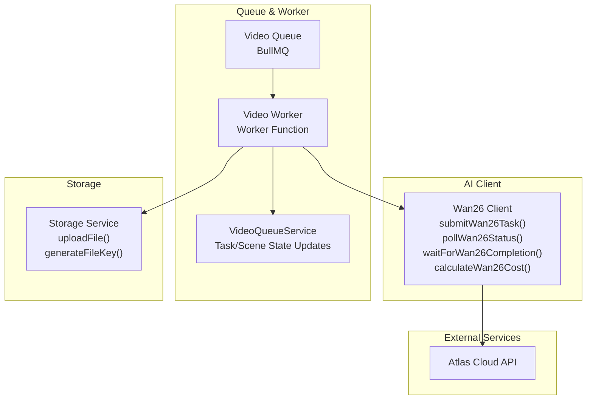
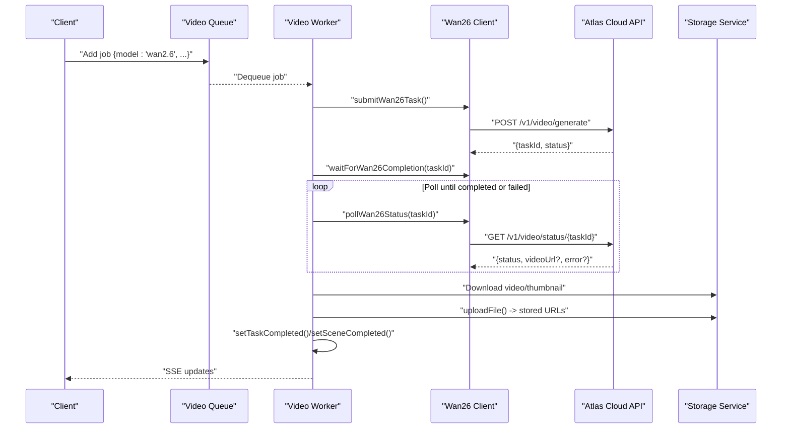
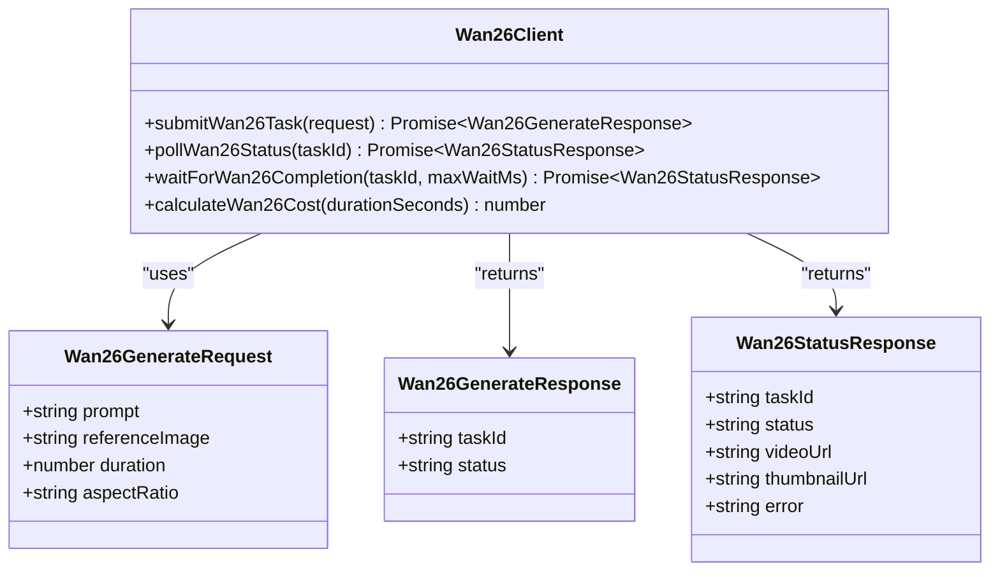
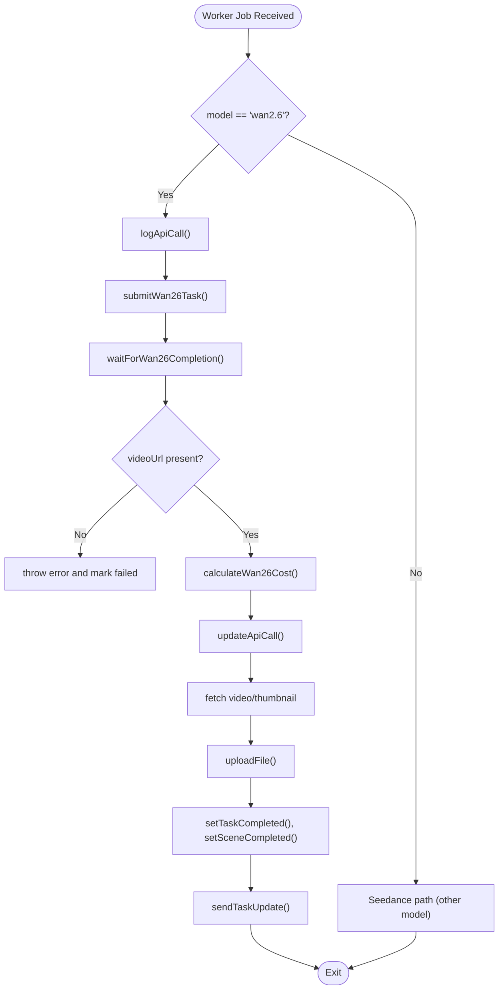
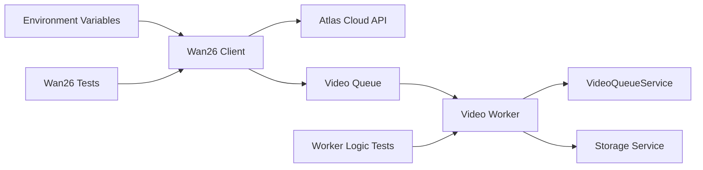

# Wan 2.6 Integration

<cite>
**Referenced Files in This Document**
- [wan26.ts](file://packages/backend/src/services/ai/wan26.ts)
- [video.ts](file://packages/backend/src/queues/video.ts)
- [video-queue-service.ts](file://packages/backend/src/services/video-queue-service.ts)
- [wan26.test.ts](file://packages/backend/tests/wan26.test.ts)
- [video-queue-worker-logic.test.ts](file://packages/backend/tests/video-queue-worker-logic.test.ts)
- [storage.ts](file://packages/backend/src/services/storage.ts)
- [ai.constants.ts](file://packages/backend/src/services/ai/ai.constants.ts)
</cite>

## Table of Contents

1. [Introduction](#introduction)
2. [Project Structure](#project-structure)
3. [Core Components](#core-components)
4. [Architecture Overview](#architecture-overview)
5. [Detailed Component Analysis](#detailed-component-analysis)
6. [Dependency Analysis](#dependency-analysis)
7. [Performance Considerations](#performance-considerations)
8. [Troubleshooting Guide](#troubleshooting-guide)
9. [Conclusion](#conclusion)
10. [Appendices](#appendices)

## Introduction

This document describes the Wan 2.6 AI integration for low-cost video prototype generation. It covers the API client implementation, request/response handling, integration with the image generation service, and the end-to-end prototype generation workflow. It also explains quality assessment criteria, cost optimization strategies, configuration options, error handling for AI service failures, and integration patterns with the main video generation pipeline. Examples of request formatting, response processing, and quality evaluation metrics are included to guide implementation and troubleshooting.

## Project Structure

The Wan 2.6 integration spans several modules:

- AI client module: Implements API submission, status polling, completion waiting, and cost calculation.
- Queue worker: Orchestrates job processing, integrates with storage, and updates task/scene states.
- Storage service: Handles downloading generated assets and uploading to object storage.
- Tests: Validate client behavior, queue logic, and error scenarios.

**Diagram sources**

- [wan26.ts:26-91](file://packages/backend/src/services/ai/wan26.ts#L26-L91)
- [video.ts:27-256](file://packages/backend/src/queues/video.ts#L27-L256)
- [video-queue-service.ts:6-61](file://packages/backend/src/services/video-queue-service.ts#L6-L61)
- [storage.ts](file://packages/backend/src/services/storage.ts)

**Section sources**

- [wan26.ts:1-92](file://packages/backend/src/services/ai/wan26.ts#L1-L92)
- [video.ts:1-272](file://packages/backend/src/queues/video.ts#L1-L272)
- [video-queue-service.ts:1-61](file://packages/backend/src/services/video-queue-service.ts#L1-L61)

## Core Components

- Wan26 API client
  - Request interface defines prompt, optional reference image, duration (default 5s), and aspect ratio selection.
  - Response interfaces define queued/processing/completed/failed states and optional URLs.
  - Submission endpoint posts to Atlas Cloud; status polling endpoint retrieves progress; completion waiter loops until completion or failure.
  - Cost calculator uses a fixed rate per second.

- Queue and worker
  - BullMQ queue with retry/backoff configuration.
  - Worker selects model ('wan2.6' vs 'seedance2.0'), submits tasks, waits for completion, downloads assets, uploads to storage, and updates statuses.

- Storage service
  - Downloads remote video/thumbnail and uploads to object storage with generated keys.

- Tests
  - Validate cost calculation, successful submission, status polling, completion, and error handling paths.
  - Validate queue worker logic for default duration, error propagation, and SSE notifications.

**Section sources**

- [wan26.ts:6-91](file://packages/backend/src/services/ai/wan26.ts#L6-L91)
- [video.ts:15-256](file://packages/backend/src/queues/video.ts#L15-L256)
- [video-queue-service.ts:6-61](file://packages/backend/src/services/video-queue-service.ts#L6-L61)
- [wan26.test.ts:25-151](file://packages/backend/tests/wan26.test.ts#L25-L151)
- [video-queue-worker-logic.test.ts:180-352](file://packages/backend/tests/video-queue-worker-logic.test.ts#L180-L352)

## Architecture Overview

The system integrates the Wan 2.6 AI client into the video generation pipeline via a queue worker. The worker handles model selection, logging, polling, asset download/upload, and state transitions.

**Diagram sources**

- [video.ts:27-256](file://packages/backend/src/queues/video.ts#L27-L256)
- [wan26.ts:26-85](file://packages/backend/src/services/ai/wan26.ts#L26-L85)
- [storage.ts](file://packages/backend/src/services/storage.ts)

## Detailed Component Analysis

### Wan26 API Client

Implements the Atlas Cloud API integration for video generation and status polling.

- Request/response contracts
  - Request fields: prompt, optional reference image, duration (default 5s), aspect ratio ('16:9' | '9:16' | '1:1').
  - Response fields: taskId, status ('queued' | 'processing'), plus optional videoUrl/thumbnailUrl/error on completion.

- Submission and polling
  - Uses Authorization header with bearer token from environment.
  - Submits JSON payload with mapped field names (ref_image, aspect_ratio).
  - Polling checks status and throws on failure; completion waiter enforces a maximum wait window.

- Cost calculation
  - Linear cost model: cost = durationInSeconds × rate_per_second.

**Diagram sources**

- [wan26.ts:6-91](file://packages/backend/src/services/ai/wan26.ts#L6-L91)

**Section sources**

- [wan26.ts:26-91](file://packages/backend/src/services/ai/wan26.ts#L26-L91)
- [wan26.test.ts:40-118](file://packages/backend/tests/wan26.test.ts#L40-L118)

### Queue and Worker Orchestration

The worker coordinates model-specific generation, logging, polling, storage, and state updates.

- Model routing
  - For 'wan2.6': logs API call, submits task, waits for completion, validates video URL, calculates cost, uploads assets, updates task/scene, and notifies via SSE.
  - For other models: follows Seedance path with image conversion and different cost calculation.

- Retry/backoff and concurrency
  - Queue configured with up to 3 attempts and exponential backoff starting at 5s.
  - Worker concurrency set to 5.

- Error handling
  - Catches errors, updates API logs, marks task/scene failed, and notifies clients.

**Diagram sources**

- [video.ts:27-256](file://packages/backend/src/queues/video.ts#L27-L256)

**Section sources**

- [video.ts:27-256](file://packages/backend/src/queues/video.ts#L27-L256)
- [video-queue-service.ts:6-61](file://packages/backend/src/services/video-queue-service.ts#L6-L61)
- [video-queue-worker-logic.test.ts:180-352](file://packages/backend/tests/video-queue-worker-logic.test.ts#L180-L352)

### Storage Integration

Downloads generated assets and uploads them to object storage with deterministic keys.

- Video download and upload
  - Fetches video URL, converts to buffer, generates key using taskId, uploads as MP4.
- Thumbnail upload
  - Conditionally uploads thumbnail if available, using a separate key pattern.
- Keys and content types
  - Videos: 'videos/<taskId>.mp4', content-type 'video/mp4'.
  - Thumbnails: 'assets/<taskId>\_thumb.jpg', content-type 'image/jpeg'.

**Section sources**

- [video.ts:173-198](file://packages/backend/src/queues/video.ts#L173-L198)
- [storage.ts](file://packages/backend/src/services/storage.ts)

### Quality Assessment Criteria

Quality evaluation for prototypes focuses on:

- Completeness
  - Non-empty video URL and thumbnail availability where supported.
- Timeliness
  - Completion within acceptable wait windows; timeouts trigger failure.
- Visual fidelity
  - Reference image alignment (when provided) and aspect ratio adherence.
- Duration consistency
  - Generated duration matches requested duration within tolerance.

These criteria are validated implicitly by the worker’s success conditions and explicit tests.

**Section sources**

- [video.ts:92-101](file://packages/backend/src/queues/video.ts#L92-L101)
- [wan26.test.ts:120-149](file://packages/backend/tests/wan26.test.ts#L120-L149)
- [video-queue-worker-logic.test.ts:243-264](file://packages/backend/tests/video-queue-worker-logic.test.ts#L243-L264)

### Cost Optimization Strategies

- Duration minimization
  - Use minimal required duration (default 5s) for prototypes to reduce cost.
- Batch processing
  - Queue multiple short-duration jobs to amortize overhead.
- Concurrency tuning
  - Adjust worker concurrency to balance throughput and resource usage.
- Retry policy
  - Exponential backoff reduces load during transient failures.

**Section sources**

- [wan26.ts:88-91](file://packages/backend/src/services/ai/wan26.ts#L88-L91)
- [video.ts:17-24](file://packages/backend/src/queues/video.ts#L17-L24)
- [ai.constants.ts:52-78](file://packages/backend/src/services/ai/ai.constants.ts#L52-L78)

### Configuration Options

- Environment variables
  - ATLAS_API_KEY: Authentication token for Atlas Cloud.
  - ATLAS_API_URL: Base URL for the API (defaults to production).
- Request options
  - duration: seconds (default 5).
  - aspectRatio: '16:9' | '9:16' | '1:1' (default '9:16').
  - referenceImage: optional image URL for conditioning.
- Queue configuration
  - Attempts: 3
  - Backoff: exponential, base delay 5s
  - Concurrency: 5

**Section sources**

- [wan26.ts:3-4](file://packages/backend/src/services/ai/wan26.ts#L3-L4)
- [wan26.ts:6-11](file://packages/backend/src/services/ai/wan26.ts#L6-L11)
- [video.ts:15-24](file://packages/backend/src/queues/video.ts#L15-L24)
- [video.ts:252-256](file://packages/backend/src/queues/video.ts#L252-L256)

### Error Handling for AI Service Failures

- API submission failures
  - Non-OK responses raise an error with status and textual body.
- Status polling failures
  - Non-OK responses raise an error with status and textual body.
- Task failure detection
  - If status is 'failed', the waiter throws with the error message.
- Timeout handling
  - If completion is not reached within the maximum wait window, a timeout error is thrown.
- Queue-level error propagation
  - Worker catches errors, updates API logs, marks task/scene failed, and notifies clients.

**Section sources**

- [wan26.ts:41-47](file://packages/backend/src/services/ai/wan26.ts#L41-L47)
- [wan26.ts:58-64](file://packages/backend/src/services/ai/wan26.ts#L58-L64)
- [wan26.ts:76-85](file://packages/backend/src/services/ai/wan26.ts#L76-L85)
- [video.ts:222-250](file://packages/backend/src/queues/video.ts#L222-L250)
- [wan26.test.ts:61-73](file://packages/backend/tests/wan26.test.ts#L61-L73)
- [wan26.test.ts:109-117](file://packages/backend/tests/wan26.test.ts#L109-L117)
- [wan26.test.ts:137-148](file://packages/backend/tests/wan26.test.ts#L137-L148)

### Integration Patterns with the Main Video Generation Pipeline

- Unified job interface
  - Jobs carry sceneId, taskId, prompt, model, optional referenceImage/imageUrls, duration, and aspectRatio.
- Model-agnostic worker
  - Worker routes to model-specific handlers while sharing common orchestration (logging, polling, storage, state updates).
- SSE notifications
  - Worker emits progress and completion events to subscribed clients.
- Database state updates
  - VideoQueueService encapsulates task and scene state transitions, decoupling worker from persistence.

**Section sources**

- [video.ts:27-171](file://packages/backend/src/queues/video.ts#L27-L171)
- [video-queue-service.ts:6-61](file://packages/backend/src/services/video-queue-service.ts#L6-L61)

## Dependency Analysis

The integration exhibits clear separation of concerns:

- wan26.ts depends on environment variables and the Atlas Cloud API.
- video.ts orchestrates queue, worker, storage, and state management.
- video-queue-service.ts centralizes database updates.
- Tests validate client behavior and worker logic independently and together.

**Diagram sources**

- [wan26.ts:3-4](file://packages/backend/src/services/ai/wan26.ts#L3-L4)
- [video.ts:5-9](file://packages/backend/src/queues/video.ts#L5-L9)
- [video-queue-service.ts:6-61](file://packages/backend/src/services/video-queue-service.ts#L6-L61)

**Section sources**

- [wan26.ts:1-92](file://packages/backend/src/services/ai/wan26.ts#L1-L92)
- [video.ts:1-272](file://packages/backend/src/queues/video.ts#L1-L272)
- [video-queue-service.ts:1-61](file://packages/backend/src/services/video-queue-service.ts#L1-L61)
- [wan26.test.ts:1-151](file://packages/backend/tests/wan26.test.ts#L1-L151)
- [video-queue-worker-logic.test.ts:180-352](file://packages/backend/tests/video-queue-worker-logic.test.ts#L180-L352)

## Performance Considerations

- Polling interval
  - Status polling occurs every 5 seconds; adjust if needed to balance responsiveness and API load.
- Concurrency and retries
  - Tune worker concurrency and queue backoff to match infrastructure capacity and API limits.
- Asset transfer
  - Download and upload steps can be bandwidth-bound; consider caching or CDN acceleration for thumbnails.
- Cost efficiency
  - Keep durations minimal for prototypes; batch short jobs to optimize throughput.

[No sources needed since this section provides general guidance]

## Troubleshooting Guide

Common issues and resolutions:

- Authentication failures
  - Verify ATLAS_API_KEY and ATLAS_API_URL are set correctly.
- Rate limiting
  - Implement client-side backoff and reduce concurrency.
- Empty video URL
  - Confirm Atlas Cloud returned a valid URL; check logs and re-run the job.
- Task timeout
  - Increase max wait window or investigate upstream delays.
- Missing userId
  - SSE notifications require a valid user ID; ensure project/task linkage is correct.

**Section sources**

- [wan26.ts:3-4](file://packages/backend/src/services/ai/wan26.ts#L3-L4)
- [video.ts:222-250](file://packages/backend/src/queues/video.ts#L222-L250)
- [video-queue-worker-logic.test.ts:243-264](file://packages/backend/tests/video-queue-worker-logic.test.ts#L243-L264)

## Conclusion

The Wan 2.6 integration provides a robust, test-backed pipeline for low-cost video prototype generation. By combining a concise AI client, resilient queue orchestration, and efficient storage handling, it supports rapid iteration with predictable costs and clear observability. Extending the worker to support additional models or refining quality checks can further enhance the prototype workflow.

[No sources needed since this section summarizes without analyzing specific files]

## Appendices

### Example Request Formatting

- Minimal request
  - Fields: prompt, duration (optional, defaults to 5), aspectRatio (optional, defaults to '9:16').
- With reference image
  - Add referenceImage URL to condition generation.

**Section sources**

- [wan26.ts:6-11](file://packages/backend/src/services/ai/wan26.ts#L6-L11)

### Example Response Processing

- Queued/processing
  - Poll status until completion or failure.
- Completed
  - Extract videoUrl and thumbnailUrl; upload assets; update task/scene; notify clients.
- Failed
  - Capture error message; mark task/scene failed; notify clients.

**Section sources**

- [wan26.ts:13-24](file://packages/backend/src/services/ai/wan26.ts#L13-L24)
- [wan26.ts:49-85](file://packages/backend/src/services/ai/wan26.ts#L49-L85)
- [video.ts:90-111](file://packages/backend/src/queues/video.ts#L90-L111)

### Quality Evaluation Metrics

- Availability: presence of videoUrl and thumbnailUrl.
- Timeliness: completion within expected time window.
- Fidelity: alignment with prompt/reference image and correct aspect ratio.
- Consistency: duration matches requested duration.

**Section sources**

- [video.ts:92-101](file://packages/backend/src/queues/video.ts#L92-L101)
- [wan26.test.ts:120-149](file://packages/backend/tests/wan26.test.ts#L120-L149)
