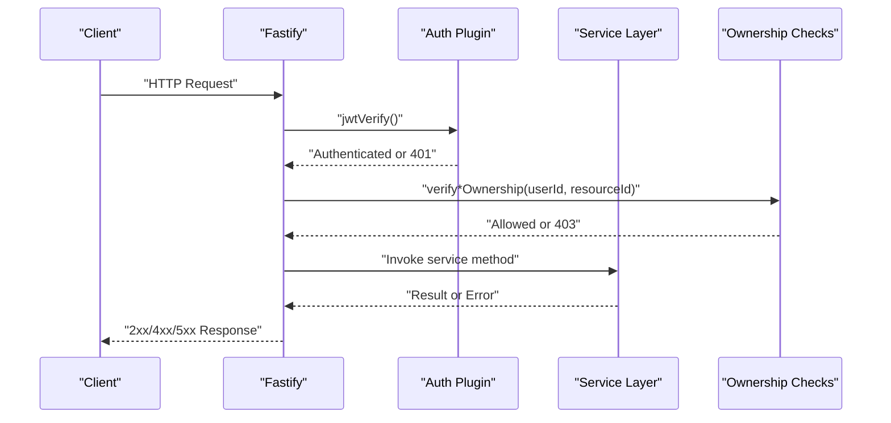
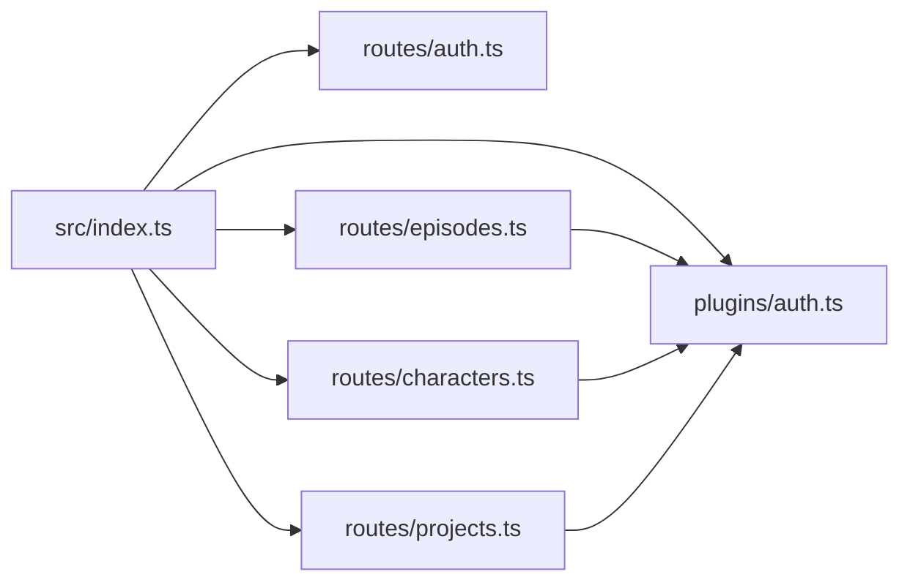

# API Reference

<cite>
**Referenced Files in This Document**
- [README.md](file://README.md)
- [packages/backend/src/index.ts](file://packages/backend/src/index.ts)
- [packages/backend/src/plugins/auth.ts](file://packages/backend/src/plugins/auth.ts)
- [packages/backend/src/bootstrap-env.ts](file://packages/backend/src/bootstrap-env.ts)
- [packages/backend/src/routes/auth.ts](file://packages/backend/src/routes/auth.ts)
- [packages/backend/src/routes/projects.ts](file://packages/backend/src/routes/projects.ts)
- [packages/backend/src/routes/episodes.ts](file://packages/backend/src/routes/episodes.ts)
- [packages/backend/src/routes/characters.ts](file://packages/backend/src/routes/characters.ts)
- [packages/backend/src/routes/character-images.ts](file://packages/backend/src/routes/character-images.ts)
- [packages/backend/src/routes/locations.ts](file://packages/backend/src/routes/locations.ts)
- [packages/backend/src/routes/takes.ts](file://packages/backend/src/routes/takes.ts)
- [packages/backend/src/routes/scenes.ts](file://packages/backend/src/routes/scenes.ts)
- [packages/backend/src/routes/shots.ts](file://packages/backend/src/routes/shots.ts)
- [packages/backend/src/routes/character-shots.ts](file://packages/backend/src/routes/character-shots.ts)
- [packages/backend/src/routes/tasks.ts](file://packages/backend/src/routes/tasks.ts)
- [packages/backend/src/routes/compositions.ts](file://packages/backend/src/routes/compositions.ts)
- [packages/backend/src/routes/stats.ts](file://packages/backend/src/routes/stats.ts)
- [packages/backend/src/routes/import.ts](file://packages/backend/src/routes/import.ts)
- [packages/backend/src/routes/settings.ts](file://packages/backend/src/routes/settings.ts)
- [packages/backend/src/routes/pipeline.ts](file://packages/backend/src/routes/pipeline.ts)
- [packages/backend/src/routes/image-generation-jobs.ts](file://packages/backend/src/routes/image-generation-jobs.ts)
- [packages/backend/src/routes/model-api-calls.ts](file://packages/backend/src/routes/model-api-calls.ts)
- [packages/backend/src/routes/memories.ts](file://packages/backend/src/routes/memories.ts)
</cite>

## Table of Contents

1. [Introduction](#introduction)
2. [Project Structure](#project-structure)
3. [Core Components](#core-components)
4. [Architecture Overview](#architecture-overview)
5. [Detailed Component Analysis](#detailed-component-analysis)
6. [Dependency Analysis](#dependency-analysis)
7. [Performance Considerations](#performance-considerations)
8. [Troubleshooting Guide](#troubleshooting-guide)
9. [Conclusion](#conclusion)
10. [Appendices](#appendices)

## Introduction

This document provides a comprehensive API reference for the Dreamer platform. It covers authentication endpoints, project management APIs, episode and script management, character and asset management, video generation and composition endpoints, and pipeline management interfaces. For each endpoint, you will find HTTP methods, URL patterns, request/response schemas, authentication requirements, and error codes. It also documents the Swagger/OpenAPI integration, rate limiting policies, API versioning strategy, and client implementation guidelines.

## Project Structure

The backend is a Fastify server that registers multiple route groups under the /api/\* namespace. Authentication is enforced via a JWT plugin and per-resource ownership checks. OpenAPI/Swagger is enabled and served at /docs.

```mermaid
graph TB
Client["Client"]
Fastify["Fastify Server"]
AuthPlugin["JWT Auth Plugin"]
RoutesAuth["/api/auth"]
RoutesProjects["/api/projects"]
RoutesEpisodes["/api/episodes"]
RoutesCharacters["/api/characters"]
RoutesCharImages["/api/character-images"]
RoutesLocations["/api/locations"]
RoutesTakes["/api/takes"]
RoutesScenes["/api/scenes"]
RoutesShots["/api/shots"]
RoutesCharShots["/api/character-shots"]
RoutesTasks["/api/tasks"]
RoutesCompositions["/api/compositions"]
RoutesStats["/api/stats"]
RoutesImport["/api/import"]
RoutesSettings["/api/settings"]
RoutesPipeline["/api/pipeline"]
RoutesImgJobs["/api/image-generation"]
RoutesModelCalls["/api/model-api-calls"]
RoutesMemories["/api/projects (memories)"]
Swagger["Swagger UI at /docs"]
Client --> Fastify
Fastify --> AuthPlugin
Fastify --> RoutesAuth
Fastify --> RoutesProjects
Fastify --> RoutesEpisodes
Fastify --> RoutesCharacters
Fastify --> RoutesCharImages
Fastify --> RoutesLocations
Fastify --> RoutesTakes
Fastify --> RoutesScenes
Fastify --> RoutesShots
Fastify --> RoutesCharShots
Fastify --> RoutesTasks
Fastify --> RoutesCompositions
Fastify --> RoutesStats
Fastify --> RoutesImport
Fastify --> RoutesSettings
Fastify --> RoutesPipeline
Fastify --> RoutesImgJobs
Fastify --> RoutesModelCalls
Fastify --> RoutesMemories
Fastify --> Swagger
```

**Diagram sources**

- [packages/backend/src/index.ts:35-117](file://packages/backend/src/index.ts#L35-L117)
- [packages/backend/src/plugins/auth.ts:12-35](file://packages/backend/src/plugins/auth.ts#L12-L35)

**Section sources**

- [packages/backend/src/index.ts:35-117](file://packages/backend/src/index.ts#L35-L117)
- [README.md:89-95](file://README.md#L89-L95)

## Core Components

- Authentication and Authorization
  - JWT-based authentication is registered globally and enforced on protected routes.
  - Ownership verification helpers ensure users can only access resources they own.
- OpenAPI/Swagger
  - OpenAPI metadata is configured with title and version.
  - Swagger UI is mounted at /docs.
- Environment Configuration
  - Environment variables are loaded before other modules to ensure AI service keys and secrets are available.

Key behaviors:

- All endpoints under /api/\* require a valid JWT bearer token.
- Certain endpoints additionally enforce ownership checks against related resources (projects, episodes, scenes, characters, compositions, tasks, locations, character images, shots, character-shots).

**Section sources**

- [packages/backend/src/plugins/auth.ts:12-35](file://packages/backend/src/plugins/auth.ts#L12-L35)
- [packages/backend/src/index.ts:59-70](file://packages/backend/src/index.ts#L59-L70)
- [packages/backend/src/bootstrap-env.ts:1-12](file://packages/backend/src/bootstrap-env.ts#L1-L12)

## Architecture Overview

The API follows a layered architecture:

- Route handlers define endpoints and bind to services.
- Services encapsulate business logic and orchestrate domain operations.
- Ownership checks and JWT verification occur via Fastify decorators and pre-handlers.
- OpenAPI/Swagger is integrated centrally to expose API documentation.

**Diagram sources**

- [packages/backend/src/plugins/auth.ts:12-35](file://packages/backend/src/plugins/auth.ts#L12-L35)
- [packages/backend/src/routes/episodes.ts:16-18](file://packages/backend/src/routes/episodes.ts#L16-L18)
- [packages/backend/src/routes/projects.ts:154-180](file://packages/backend/src/routes/projects.ts#L154-L180)

## Detailed Component Analysis

### Authentication Endpoints

- Base Path: /api/auth
- Authentication: Not required for registration/login; required for /api/auth/me

Endpoints:

- POST /api/auth/register
  - Description: Registers a new user.
  - Authentication: None
  - Request Body:
    - email: string (required)
    - password: string (required)
    - name: string (required)
  - Response:
    - accessToken: string
    - refreshToken: string
    - user: { id, email, name, createdAt, updatedAt }
  - Errors:
    - 400: Email already registered

- POST /api/auth/login
  - Description: Logs in an existing user.
  - Authentication: None
  - Request Body:
    - email: string (required)
    - password: string (required)
  - Response:
    - accessToken: string
    - refreshToken: string
    - user: { id, email, name, createdAt, updatedAt }
  - Errors:
    - 401: Invalid credentials

- GET /api/auth/me
  - Description: Retrieves the current authenticated user.
  - Authentication: Required (Bearer JWT)
  - Response:
    - user: { id, email, name, createdAt, updatedAt }

Common usage pattern:

- After successful register/login, store accessToken and use it in Authorization: Bearer header for subsequent requests.

**Section sources**

- [packages/backend/src/routes/auth.ts:4-64](file://packages/backend/src/routes/auth.ts#L4-L64)

### Project Management APIs

- Base Path: /api/projects

Endpoints:

- GET /api/projects/
  - Description: Lists projects for the current user.
  - Authentication: Required
  - Response: Array of projects

- POST /api/projects/
  - Description: Creates a new project.
  - Authentication: Required
  - Request Body:
    - name: string (required)
    - description: string (optional)
    - aspectRatio: string (optional)
  - Response: Project object
  - Errors:
    - 201 on success

- POST /api/projects/:id/episodes/generate-first
  - Description: Generates the first episode for a project.
  - Authentication: Required
  - Request Body:
    - description: string (optional)
  - Response:
    - episode: Episode
    - synopsis: string
  - Errors:
    - 400/4xx with error details

- POST /api/projects/:id/episodes/generate-remaining
  - Description: Asynchronously generates remaining episodes up to a target count.
  - Authentication: Required
  - Request Body:
    - targetEpisodes: number (optional)
  - Response:
    - jobId: string
    - status: "processing"
    - targetEpisodes: number
    - message: string

- POST /api/projects/:id/parse
  - Description: Parses script into entities, image slots, and episode synopses (asynchronous job).
  - Authentication: Required
  - Request Body:
    - targetEpisodes: number (optional)
  - Response:
    - jobId: string
    - status: "processing"
    - message: string

- GET /api/projects/:id/outline-active-job
  - Description: Checks for an active first-episode, batch, or parse job.
  - Authentication: Required
  - Response:
    - job: JobInfo|null

- GET /api/projects/:id
  - Description: Retrieves a project by ID.
  - Authentication: Required
  - Response: Project object
  - Errors:
    - 404: Project not found

- PUT /api/projects/:id
- PATCH /api/projects/:id
  - Description: Updates a project.
  - Authentication: Required
  - Request Body:
    - name: string (optional)
    - description: string (optional)
    - synopsis: string|null (optional)
    - visualStyle: string[] (optional)
    - aspectRatio: string (optional)
  - Response: Updated project
  - Errors:
    - 404: Project not found

- DELETE /api/projects/:id
  - Description: Deletes a project.
  - Authentication: Required
  - Response: 204 No Content
  - Errors:
    - 404: Project not found

Common usage pattern:

- Use POST /api/projects/ to create a project.
- Use POST /api/projects/:id/parse to start parsing the script asynchronously.
- Use POST /api/projects/:id/episodes/generate-first to create the first episode.
- Use POST /api/projects/:id/episodes/generate-remaining to schedule remaining episodes.

**Section sources**

- [packages/backend/src/routes/projects.ts:4-228](file://packages/backend/src/routes/projects.ts#L4-L228)

### Episode and Script Management

- Base Path: /api/episodes
- Ownership: Enforced via verifyEpisodeOwnership and verifyProjectOwnership

Endpoints:

- GET /api/episodes/?projectId=...
  - Description: Lists episodes for a given project.
  - Authentication: Required
  - Query:
    - projectId: string (required)
  - Response: Episodes array

- GET /api/episodes/:id
  - Description: Retrieves an episode by ID.
  - Authentication: Required
  - Response: Episode object
  - Errors:
    - 404: Episode not found

- GET /api/episodes/:id/detail
  - Description: Retrieves episode detail including scenes tree and project visualStyle.
  - Authentication: Required
  - Response: Episode detail object

- GET /api/episodes/:id/scenes
  - Description: Retrieves scenes for an episode.
  - Authentication: Required
  - Response: { scenes: [...] }

- POST /api/episodes/
  - Description: Creates an episode.
  - Authentication: Required
  - Request Body:
    - projectId: string (required)
    - episodeNum: number (required)
    - title: string (optional)
  - Response: Episode object
  - Errors:
    - 403: Permission denied if not owning the project

- PUT /api/episodes/:id
  - Description: Updates an episode (including script content).
  - Authentication: Required
  - Request Body:
    - title: string (optional)
    - synopsis: string|null (optional)
    - script: unknown (optional)
  - Errors:
    - 403: Permission denied if not owning the episode’s project

- DELETE /api/episodes/:id
  - Description: Deletes an episode.
  - Authentication: Required
  - Response: 204 No Content
  - Errors:
    - 404: Episode not found
    - 403: Permission denied

- POST /api/episodes/:id/compose
  - Description: Composes the episode into a final output using scenes and takes.
  - Authentication: Required
  - Request Body:
    - title: string (optional override)
  - Response:
    - compositionId: string
    - outputUrl: string
    - duration: number
    - message: string
  - Errors:
    - 400: Validation errors with details
    - 409: Conflict with compositionId returned
    - 4xx/5xx: General errors

- POST /api/episodes/:id/expand
  - Description: Expands episode script with AI (DeepSeek).
  - Authentication: Required
  - Request Body:
    - summary: string (required)
  - Response:
    - episode: Episode
    - script: Script
    - scenesCreated: number
    - aiCost: number
  - Errors:
    - 404: Not found
    - 4xx/5xx: General errors

- POST /api/episodes/:id/generate-storyboard-script
  - Description: Enqueues AI job to generate storyboard script for the episode.
  - Authentication: Required
  - Request Body:
    - hint: string (optional)
  - Response:
    - jobId: string
    - message: string
  - Errors:
    - 404: Not found
    - 400: Bad request with details
    - 409: Conflict
    - 4xx/5xx: General errors

Common usage pattern:

- Use GET /api/episodes/:id/detail to load episode and scenes.
- Use POST /api/episodes/:id/expand to enrich script.
- Use POST /api/episodes/:id/compose to render final output.

**Section sources**

- [packages/backend/src/routes/episodes.ts:7-254](file://packages/backend/src/routes/episodes.ts#L7-L254)
- [packages/backend/src/plugins/auth.ts:38-97](file://packages/backend/src/plugins/auth.ts#L38-L97)

### Character and Asset Management

- Base Path: /api/characters
- Ownership: Enforced via verifyCharacterOwnership and verifyProjectOwnership

Endpoints:

- GET /api/characters/?projectId=...
  - Description: Lists characters for a project (with images).
  - Authentication: Required
  - Query:
    - projectId: string (required)
  - Response: Characters array

- GET /api/characters/:id
  - Description: Retrieves a character with images tree.
  - Authentication: Required
  - Response: Character with nested images
  - Errors:
    - 404: Character not found

- POST /api/characters/
  - Description: Creates a character.
  - Authentication: Required
  - Request Body:
    - projectId: string (required)
    - name: string (required)
    - description: string (optional)
  - Response: Character object
  - Errors:
    - 403: Permission denied if not owning the project

- PUT /api/characters/:id
  - Description: Updates a character.
  - Authentication: Required
  - Request Body:
    - name: string (optional)
    - description: string (optional)
  - Errors:
    - 403: Permission denied

- DELETE /api/characters/:id
  - Description: Deletes a character.
  - Authentication: Required
  - Response: 204 No Content
  - Errors:
    - 403: Permission denied

- POST /api/characters/:id/images
  - Description: Adds an image to a character. Supports multipart upload or JSON to create a slot with AI prompt.
  - Authentication: Required
  - Path Params:
    - id: characterId (required)
  - Request Body (JSON mode):
    - name: string (required)
    - type: string (optional)
    - description: string (optional)
    - parentId: string (optional)
  - Response: Image object
  - Errors:
    - 400: Name required, invalid file type, no file uploaded
    - 409: Base image conflict ("each character can have only one base image")
    - 401: AI service auth failure
    - 429: AI service rate limit
    - 500: Prompt generation failed

- PUT /api/characters/:id/images/:imageId
  - Description: Updates a character image.
  - Authentication: Required
  - Request Body:
    - name: string (optional)
    - type: string (optional)
    - description: string (optional)
    - order: number (optional)
    - prompt: string|null (optional)
  - Response: Updated image

- POST /api/characters/:id/images/:imageId/avatar
  - Description: Uploads avatar image for an existing character image slot (multipart).
  - Authentication: Required
  - Request Body (multipart):
    - file: binary (required)
  - Response: Image object
  - Errors:
    - 400: Invalid file type or missing file
    - 404: Image not found

- DELETE /api/characters/:id/images/:imageId
  - Description: Deletes a character image and its descendants.
  - Authentication: Required
  - Response: 204 No Content
  - Errors:
    - 404: Image not found
    - 400: Cannot delete base image

- PUT /api/characters/:id/images/:imageId/move
  - Description: Moves an image under a new parent (re-parent).
  - Authentication: Required
  - Request Body:
    - parentId: string (optional)
  - Response: Moved image
  - Errors:
    - 400: Cannot move under its own descendant

Common usage pattern:

- Use POST /api/characters/ to create a character.
- Use POST /api/characters/:id/images (JSON) to create a slot with AI prompt.
- Use POST /api/characters/:id/images/:imageId/avatar to upload avatar.
- Use DELETE /api/characters/:id/images/:imageId to remove images.

**Section sources**

- [packages/backend/src/routes/characters.ts:6-338](file://packages/backend/src/routes/characters.ts#L6-L338)
- [packages/backend/src/plugins/auth.ts:38-97](file://packages/backend/src/plugins/auth.ts#L38-L97)

### Additional Resource Endpoints

Note: The following endpoints are registered under /api/\* and follow similar authentication and ownership patterns. Replace placeholders with actual IDs as indicated.

- GET /api/character-images/:id
  - Description: Retrieve a character image by ID.
  - Authentication: Required
  - Response: Character image object

- GET /api/locations/?projectId=...
  - Description: List locations for a project.
  - Authentication: Required
  - Query:
    - projectId: string (required)
  - Response: Locations array

- GET /api/takes/:id
  - Description: Retrieve a take by ID.
  - Authentication: Required
  - Response: Take object

- GET /api/scenes/:id
  - Description: Retrieve a scene by ID.
  - Authentication: Required
  - Response: Scene object

- GET /api/shots/:id
  - Description: Retrieve a shot by ID.
  - Authentication: Required
  - Response: Shot object

- GET /api/character-shots/:id
  - Description: Retrieve a character-shot relationship by ID.
  - Authentication: Required
  - Response: CharacterShot object

- GET /api/tasks/:id
  - Description: Retrieve a task by ID.
  - Authentication: Required
  - Response: Task object

- GET /api/compositions/:id
  - Description: Retrieve a composition by ID.
  - Authentication: Required
  - Response: Composition object

- GET /api/stats
  - Description: Retrieve platform statistics.
  - Authentication: Required
  - Response: Stats object

- POST /api/import
  - Description: Import assets or data (job-based).
  - Authentication: Required
  - Response: Job info

- GET /api/settings
  - Description: Retrieve user settings.
  - Authentication: Required
  - Response: Settings object

- POST /api/pipeline
  - Description: Submit a pipeline job.
  - Authentication: Required
  - Response: Job info

- GET /api/image-generation/:id
  - Description: Poll or retrieve image generation job status/results.
  - Authentication: Required
  - Response: Job status/result

- GET /api/model-api-calls
  - Description: List model API calls.
  - Authentication: Required
  - Response: Calls array

- GET /api/projects/:id/memories
  - Description: Retrieve memories for a project.
  - Authentication: Required
  - Response: Memories array

**Section sources**

- [packages/backend/src/index.ts:84-110](file://packages/backend/src/index.ts#L84-L110)
- [packages/backend/src/routes/character-images.ts](file://packages/backend/src/routes/character-images.ts)
- [packages/backend/src/routes/locations.ts](file://packages/backend/src/routes/locations.ts)
- [packages/backend/src/routes/takes.ts](file://packages/backend/src/routes/takes.ts)
- [packages/backend/src/routes/scenes.ts](file://packages/backend/src/routes/scenes.ts)
- [packages/backend/src/routes/shots.ts](file://packages/backend/src/routes/shots.ts)
- [packages/backend/src/routes/character-shots.ts](file://packages/backend/src/routes/character-shots.ts)
- [packages/backend/src/routes/tasks.ts](file://packages/backend/src/routes/tasks.ts)
- [packages/backend/src/routes/compositions.ts](file://packages/backend/src/routes/compositions.ts)
- [packages/backend/src/routes/stats.ts](file://packages/backend/src/routes/stats.ts)
- [packages/backend/src/routes/import.ts](file://packages/backend/src/routes/import.ts)
- [packages/backend/src/routes/settings.ts](file://packages/backend/src/routes/settings.ts)
- [packages/backend/src/routes/pipeline.ts](file://packages/backend/src/routes/pipeline.ts)
- [packages/backend/src/routes/image-generation-jobs.ts](file://packages/backend/src/routes/image-generation-jobs.ts)
- [packages/backend/src/routes/model-api-calls.ts](file://packages/backend/src/routes/model-api-calls.ts)
- [packages/backend/src/routes/memories.ts](file://packages/backend/src/routes/memories.ts)

## Dependency Analysis

High-level dependencies:

- Fastify registers plugins (CORS, JWT, Multipart, Swagger, SwaggerUI, SSE).
- Route modules depend on service modules and the auth plugin.
- Ownership verification helpers are reused across routes.

**Diagram sources**

- [packages/backend/src/index.ts:13-31](file://packages/backend/src/index.ts#L13-L31)
- [packages/backend/src/routes/episodes.ts:1-6](file://packages/backend/src/routes/episodes.ts#L1-L6)
- [packages/backend/src/routes/characters.ts:1-4](file://packages/backend/src/routes/characters.ts#L1-L4)
- [packages/backend/src/plugins/auth.ts:12-35](file://packages/backend/src/plugins/auth.ts#L12-L35)

**Section sources**

- [packages/backend/src/index.ts:13-31](file://packages/backend/src/index.ts#L13-L31)
- [packages/backend/src/routes/episodes.ts:1-6](file://packages/backend/src/routes/episodes.ts#L1-L6)
- [packages/backend/src/routes/characters.ts:1-4](file://packages/backend/src/routes/characters.ts#L1-L4)

## Performance Considerations

- File uploads are supported with a 100 MB size limit. Large payloads may increase latency and memory usage.
- Async jobs (e.g., episode parsing, remaining episode generation, storyboard script generation, image generation) return job IDs; poll the corresponding job endpoints to avoid blocking requests.
- Use pagination-friendly listing endpoints where available.
- Batch operations (e.g., generating remaining episodes) reduce repeated round-trips but may be resource-intensive; monitor job progress via dedicated endpoints.

[No sources needed since this section provides general guidance]

## Troubleshooting Guide

Common issues and resolutions:

- 401 Unauthorized
  - Cause: Missing or invalid JWT token.
  - Resolution: Authenticate via /api/auth/login or /api/auth/register and include Authorization: Bearer <accessToken>.

- 403 Forbidden
  - Cause: Attempting to access a resource that does not belong to the user.
  - Resolution: Verify the resource belongs to your project/episode/scene/etc.

- 404 Not Found
  - Cause: Resource does not exist.
  - Resolution: Ensure the ID is correct and the resource was created.

- 400 Bad Request
  - Cause: Invalid request body or unsupported file type.
  - Resolution: Check required fields and allowed file types (JPEG, PNG, WebP).

- 409 Conflict
  - Cause: Business rule violation (e.g., base image conflict).
  - Resolution: Remove conflicting items before retrying.

- 429 Too Many Requests
  - Cause: AI service rate limiting.
  - Resolution: Retry after the specified delay or reduce request frequency.

- 5xx Internal Server Error
  - Cause: Unexpected server-side failures.
  - Resolution: Inspect server logs and retry; contact support if persistent.

**Section sources**

- [packages/backend/src/plugins/auth.ts:12-35](file://packages/backend/src/plugins/auth.ts#L12-L35)
- [packages/backend/src/routes/characters.ts:115-214](file://packages/backend/src/routes/characters.ts#L115-L214)
- [packages/backend/src/routes/episodes.ts:159-178](file://packages/backend/src/routes/episodes.ts#L159-L178)

## Conclusion

This API reference documents the Dreamer platform’s REST endpoints, authentication, ownership enforcement, and OpenAPI integration. Use the documented endpoints to build clients that manage projects, episodes, characters, assets, and video generation pipelines. Follow the authentication and error handling guidance to ensure robust integrations.

[No sources needed since this section summarizes without analyzing specific files]

## Appendices

### Authentication Requirements

- All endpoints under /api/\* require a valid JWT Bearer token.
- Some endpoints additionally require ownership verification.

**Section sources**

- [packages/backend/src/plugins/auth.ts:12-35](file://packages/backend/src/plugins/auth.ts#L12-L35)

### OpenAPI/Swagger Integration

- OpenAPI metadata includes title and version.
- Swagger UI is mounted at /docs.

**Section sources**

- [packages/backend/src/index.ts:59-70](file://packages/backend/src/index.ts#L59-L70)

### Rate Limiting Policies

- AI service rate limiting is surfaced as 429 responses during character image prompt generation.
- General API rate limiting is not explicitly implemented in the server code; consider implementing client-side throttling or server-side middleware as needed.

**Section sources**

- [packages/backend/src/routes/characters.ts:142-147](file://packages/backend/src/routes/characters.ts#L142-L147)

### API Versioning Strategy

- OpenAPI version is set to 0.1.0.
- No explicit URL versioning scheme is present; consider adding /v1 prefixes or semver suffixes in future iterations.

**Section sources**

- [packages/backend/src/index.ts:60-65](file://packages/backend/src/index.ts#L60-L65)

### Client Implementation Guidelines

- Store accessToken from /api/auth/register or /api/auth/login and send it in the Authorization header for protected endpoints.
- For multipart uploads (avatar and image creation), ensure proper form encoding and file type validation.
- Poll asynchronous job endpoints (e.g., /api/projects/:id/parse, /api/projects/:id/episodes/generate-remaining, /api/image-generation/:id) to track progress.
- Respect 429 responses from AI services and implement exponential backoff.

**Section sources**

- [packages/backend/src/routes/auth.ts:6-64](file://packages/backend/src/routes/auth.ts#L6-L64)
- [packages/backend/src/routes/characters.ts:100-214](file://packages/backend/src/routes/characters.ts#L100-L214)
- [packages/backend/src/routes/projects.ts:62-117](file://packages/backend/src/routes/projects.ts#L62-L117)
- [packages/backend/src/routes/image-generation-jobs.ts](file://packages/backend/src/routes/image-generation-jobs.ts)
