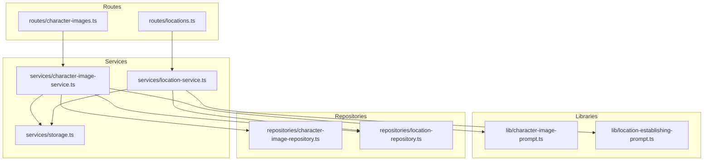
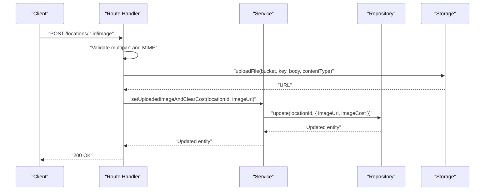
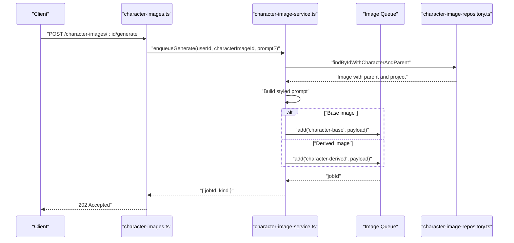
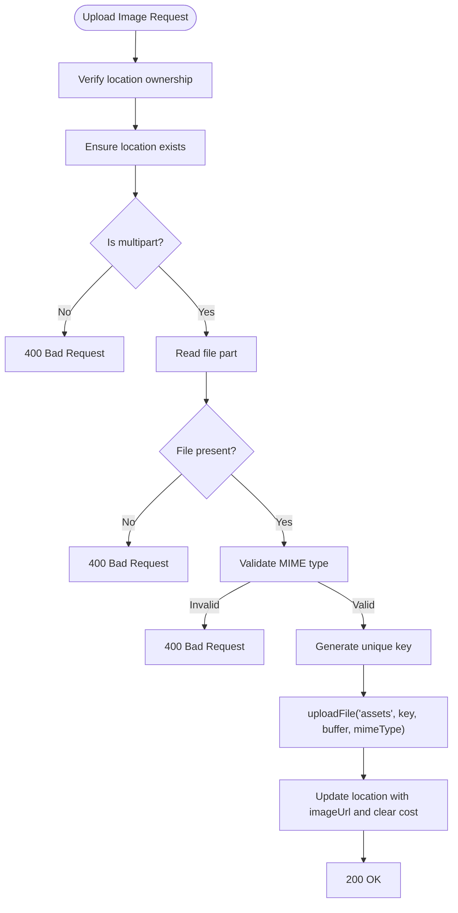
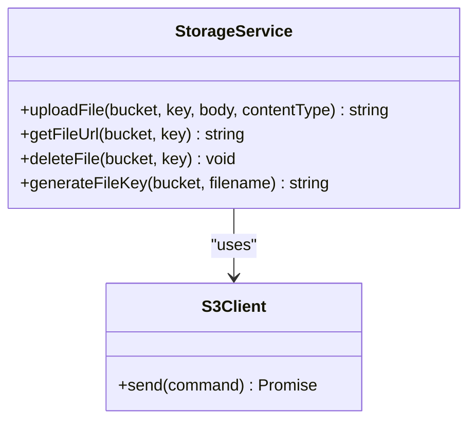
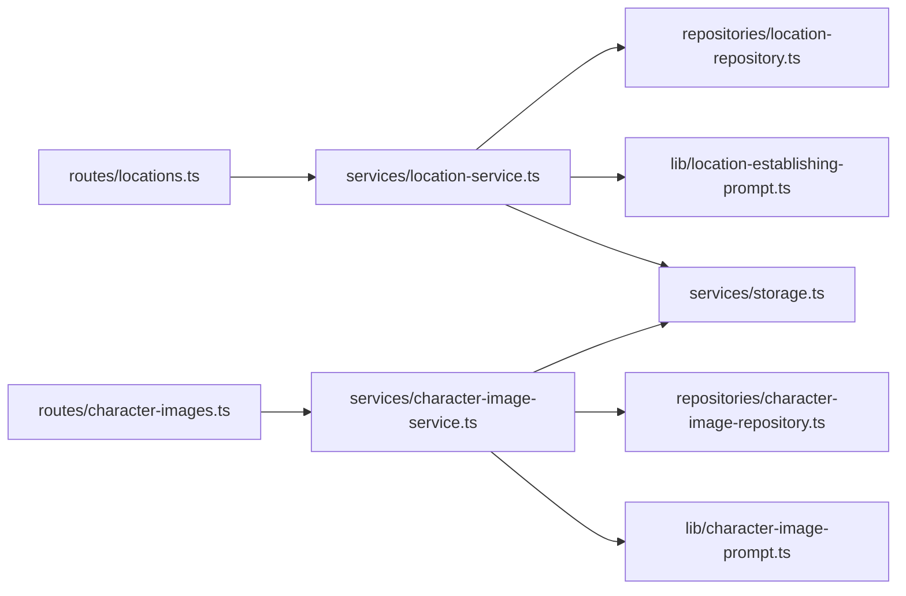

# Asset Management API

<cite>
**Referenced Files in This Document**
- [storage.ts](file://packages/backend/src/services/storage.ts)
- [character-images.ts](file://packages/backend/src/routes/character-images.ts)
- [locations.ts](file://packages/backend/src/routes/locations.ts)
- [character-image-service.ts](file://packages/backend/src/services/character-image-service.ts)
- [location-service.ts](file://packages/backend/src/services/location-service.ts)
- [character-image-prompt.ts](file://packages/backend/src/lib/character-image-prompt.ts)
- [location-establishing-prompt.ts](file://packages/backend/src/lib/location-establishing-prompt.ts)
- [character-image-repository.ts](file://packages/backend/src/repositories/character-image-repository.ts)
- [location-repository.ts](file://packages/backend/src/repositories/location-repository.ts)
- [seedance-scene-request.test.ts](file://packages/backend/tests/seedance-scene-request.test.ts)
- [storage.test.ts](file://packages/backend/tests/storage.test.ts)
- [seedance.py](file://docs/skills/scripts/seedance.py)
- [seedance.py](file://docs/skills/seedance2-skill-cn/scripts/seedance.py)
</cite>

## Table of Contents

1. [Introduction](#introduction)
2. [Project Structure](#project-structure)
3. [Core Components](#core-components)
4. [Architecture Overview](#architecture-overview)
5. [Detailed Component Analysis](#detailed-component-analysis)
6. [Dependency Analysis](#dependency-analysis)
7. [Performance Considerations](#performance-considerations)
8. [Troubleshooting Guide](#troubleshooting-guide)
9. [Conclusion](#conclusion)
10. [Appendices](#appendices)

## Introduction

This document describes the asset management APIs for characters, locations, and visual assets. It covers upload, retrieval, update, and deletion operations; media handling for images, videos, and audio; metadata management; categorization and search; versioning and batch operations; and integration with storage services. It also documents validation rules, format restrictions, and performance optimization strategies for large media files.

## Project Structure

The asset management system is implemented in the backend package under the services and routes directories. Storage integration is handled via an S3-compatible client with configurable buckets for assets and videos. Routes define the public API surface, while services encapsulate business logic and queue integrations for asynchronous jobs. Repositories provide database access patterns.

**Diagram sources**

- [character-images.ts:1-70](file://packages/backend/src/routes/character-images.ts#L1-L70)
- [locations.ts:1-234](file://packages/backend/src/routes/locations.ts#L1-L234)
- [character-image-service.ts:1-150](file://packages/backend/src/services/character-image-service.ts#L1-L150)
- [location-service.ts:1-186](file://packages/backend/src/services/location-service.ts#L1-L186)
- [storage.ts:1-65](file://packages/backend/src/services/storage.ts#L1-L65)
- [character-image-prompt.ts:1-10](file://packages/backend/src/lib/character-image-prompt.ts#L1-L10)
- [location-establishing-prompt.ts:1-12](file://packages/backend/src/lib/location-establishing-prompt.ts#L1-L12)
- [character-image-repository.ts:1-57](file://packages/backend/src/repositories/character-image-repository.ts#L1-L57)
- [location-repository.ts:1-117](file://packages/backend/src/repositories/location-repository.ts#L1-L117)

**Section sources**

- [character-images.ts:1-70](file://packages/backend/src/routes/character-images.ts#L1-L70)
- [locations.ts:1-234](file://packages/backend/src/routes/locations.ts#L1-L234)
- [storage.ts:1-65](file://packages/backend/src/services/storage.ts#L1-L65)

## Core Components

- Storage service: Provides upload, URL generation, and deletion for S3-compatible storage with separate buckets for assets and videos.
- Character image service: Manages character image slots, enqueues generation jobs, and supports batch operations to generate missing avatars.
- Location service: Manages locations, updates metadata, enqueues establishing image generation, and supports batch generation.
- Prompt builders: Apply project visual styles to prompts for consistent generation quality.
- Repositories: Encapsulate database queries for character images and locations.

**Section sources**

- [storage.ts:1-65](file://packages/backend/src/services/storage.ts#L1-L65)
- [character-image-service.ts:1-150](file://packages/backend/src/services/character-image-service.ts#L1-L150)
- [location-service.ts:1-186](file://packages/backend/src/services/location-service.ts#L1-L186)
- [character-image-prompt.ts:1-10](file://packages/backend/src/lib/character-image-prompt.ts#L1-L10)
- [location-establishing-prompt.ts:1-12](file://packages/backend/src/lib/location-establishing-prompt.ts#L1-L12)
- [character-image-repository.ts:1-57](file://packages/backend/src/repositories/character-image-repository.ts#L1-L57)
- [location-repository.ts:1-117](file://packages/backend/src/repositories/location-repository.ts#L1-L117)

## Architecture Overview

The asset management architecture separates concerns into routes, services, repositories, and storage. Routes validate permissions and ownership, services orchestrate business logic and queue jobs, repositories manage persistence, and storage handles object uploads and URLs.

**Diagram sources**

- [locations.ts:144-201](file://packages/backend/src/routes/locations.ts#L144-L201)
- [location-service.ts:180-182](file://packages/backend/src/services/location-service.ts#L180-L182)
- [storage.ts:23-41](file://packages/backend/src/services/storage.ts#L23-L41)

## Detailed Component Analysis

### Character Assets: Upload, Generation, and Batch Operations

- Upload avatar for a character image slot:
  - Endpoint: POST /character-images/:id/generate
  - Behavior: Validates ownership, enqueues a generation job based on whether the slot is a base or derived image, and returns a job identifier.
  - Validation: Requires a prompt either in the request body or stored on the image; derived images require the parent’s avatar to be present.
- Batch generate missing avatars:
  - Endpoint: POST /character-images/batch-generate-missing-avatars
  - Behavior: Scans project or character-specific slots without avatars, filters by presence of prompts and parent avatar readiness, enqueues jobs, and returns counts and skipped reasons.
- Metadata and ordering:
  - Character images support name, type, description, and ordering within siblings. Creation places items at the end of sibling order.

**Diagram sources**

- [character-images.ts:40-68](file://packages/backend/src/routes/character-images.ts#L40-L68)
- [character-image-service.ts:37-89](file://packages/backend/src/services/character-image-service.ts#L37-L89)
- [character-image-repository.ts:7-15](file://packages/backend/src/repositories/character-image-repository.ts#L7-L15)

**Section sources**

- [character-images.ts:1-70](file://packages/backend/src/routes/character-images.ts#L1-L70)
- [character-image-service.ts:1-150](file://packages/backend/src/services/character-image-service.ts#L1-L150)
- [character-image-repository.ts:1-57](file://packages/backend/src/repositories/character-image-repository.ts#L1-L57)
- [character-image-prompt.ts:1-10](file://packages/backend/src/lib/character-image-prompt.ts#L1-L10)

### Location Assets: Upload, Generation, and Batch Operations

- Upload establishing image:
  - Endpoint: POST /locations/:id/image
  - Media handling: Supports multipart uploads with field name file; validates MIME types for images (JPEG, PNG, WebP); generates a unique key and uploads to the assets bucket; clears cost after successful upload.
- Generate establishing image:
  - Endpoint: POST /locations/:id/generate-image
  - Behavior: Validates ownership and prompt availability; enqueues a location establishing image job; returns job identifier.
- Batch generating establishing images:
  - Endpoint: POST /locations/batch-generate-images
  - Behavior: Scans locations without established images, sanitizes and applies overrides to prompts, enqueues jobs, and reports skipped reasons.
- Metadata and categorization:
  - Locations include name, time-of-day, description, and optional character associations. Deletion is soft-delete and unlinks related scenes.

**Diagram sources**

- [locations.ts:144-201](file://packages/backend/src/routes/locations.ts#L144-L201)
- [storage.ts:23-41](file://packages/backend/src/services/storage.ts#L23-L41)

**Section sources**

- [locations.ts:1-234](file://packages/backend/src/routes/locations.ts#L1-L234)
- [location-service.ts:1-186](file://packages/backend/src/services/location-service.ts#L1-L186)
- [location-repository.ts:1-117](file://packages/backend/src/repositories/location-repository.ts#L1-L117)

### Storage Integration and Media Handling

- Buckets:
  - assets: Stores images and small assets.
  - videos: Stores video outputs.
- Upload:
  - uploadFile(bucket, key, body, contentType) returns a URL constructed from configured endpoint and bucket.
- URL generation:
  - getFileUrl(bucket, key) constructs a public URL for retrieval.
- Deletion:
  - deleteFile(bucket, key) removes objects from storage.
- Key generation:
  - generateFileKey(bucket, filename) produces a unique key with timestamp and random suffix, preserving extension and sanitizing names.

**Diagram sources**

- [storage.ts:1-65](file://packages/backend/src/services/storage.ts#L1-L65)

**Section sources**

- [storage.ts:1-65](file://packages/backend/src/services/storage.ts#L1-L65)
- [storage.test.ts:1-110](file://packages/backend/tests/storage.test.ts#L1-L110)

### Prompt Construction and Visual Style Application

- Character image styled prompt:
  - buildCharacterImageStyledPrompt(project.visualStyle, corePrompt) prepends visual style keywords to the prompt for consistent generation.
- Location establishing prompt:
  - buildLocationEstablishingPrompt(name, effectivePrompt) composes a strong leading descriptor for establishing shots.

**Section sources**

- [character-image-prompt.ts:1-10](file://packages/backend/src/lib/character-image-prompt.ts#L1-L10)
- [location-establishing-prompt.ts:1-12](file://packages/backend/src/lib/location-establishing-prompt.ts#L1-L12)

### Search and Categorization

- Locations:
  - List by project with ordering by name.
  - Upsert from script scenes by project and name, restoring soft-deleted entries.
- Character images:
  - Find slots without avatars per project or per character, including parent context for derived images.

**Section sources**

- [location-repository.ts:7-37](file://packages/backend/src/repositories/location-repository.ts#L7-L37)
- [location-repository.ts:82-113](file://packages/backend/src/repositories/location-repository.ts#L82-L113)
- [character-image-repository.ts:24-53](file://packages/backend/src/repositories/character-image-repository.ts#L24-L53)

### Versioning and Batch Operations

- Versioning:
  - Keys generated by generateFileKey include timestamp and random suffix, enabling multiple versions of the same logical asset.
- Batch operations:
  - Character: batchEnqueueMissingAvatars scans slots and enqueues jobs for missing avatars with detailed skip reasons.
  - Locations: batchEnqueueEstablishingImages scans locations, sanitizes prompts, applies overrides, and enqueues jobs.

**Section sources**

- [storage.ts:57-64](file://packages/backend/src/services/storage.ts#L57-L64)
- [character-image-service.ts:91-146](file://packages/backend/src/services/character-image-service.ts#L91-L146)
- [location-service.ts:77-127](file://packages/backend/src/services/location-service.ts#L77-L127)

### Integration with Storage Services

- S3-compatible client:
  - Configured with endpoint, region, credentials, and path-style access for MinIO compatibility.
- Public URLs:
  - Returned by uploadFile and getFileUrl for direct client-side access.

**Section sources**

- [storage.ts:4-12](file://packages/backend/src/services/storage.ts#L4-L12)
- [storage.ts:38-46](file://packages/backend/src/services/storage.ts#L38-L46)

### Media Handling for Images, Videos, and Audio

- Images:
  - Supported MIME types for uploads: JPEG, PNG, WebP.
  - Maximum file size enforced by client-side scripts: 30 MB for images.
- Videos and Audio:
  - Client-side scripts enforce maximum sizes: 50 MB for video, 15 MB for audio.
  - MIME detection falls back to known mappings when auto-detection fails.

**Section sources**

- [locations.ts](file://packages/backend/src/routes/locations.ts#L8)
- [seedance.py:115-127](file://docs/skills/scripts/seedance.py#L115-L127)
- [seedance.py:115-127](file://docs/skills/seedance2-skill-cn/scripts/seedance.py#L115-L127)

## Dependency Analysis

The following diagram shows key dependencies among components involved in asset management.

**Diagram sources**

- [locations.ts:1-234](file://packages/backend/src/routes/locations.ts#L1-L234)
- [character-images.ts:1-70](file://packages/backend/src/routes/character-images.ts#L1-L70)
- [location-service.ts:1-186](file://packages/backend/src/services/location-service.ts#L1-L186)
- [character-image-service.ts:1-150](file://packages/backend/src/services/character-image-service.ts#L1-L150)
- [character-image-repository.ts:1-57](file://packages/backend/src/repositories/character-image-repository.ts#L1-L57)
- [location-repository.ts:1-117](file://packages/backend/src/repositories/location-repository.ts#L1-L117)
- [storage.ts:1-65](file://packages/backend/src/services/storage.ts#L1-L65)
- [character-image-prompt.ts:1-10](file://packages/backend/src/lib/character-image-prompt.ts#L1-L10)
- [location-establishing-prompt.ts:1-12](file://packages/backend/src/lib/location-establishing-prompt.ts#L1-L12)

**Section sources**

- [locations.ts:1-234](file://packages/backend/src/routes/locations.ts#L1-L234)
- [character-images.ts:1-70](file://packages/backend/src/routes/character-images.ts#L1-L70)
- [location-service.ts:1-186](file://packages/backend/src/services/location-service.ts#L1-L186)
- [character-image-service.ts:1-150](file://packages/backend/src/services/character-image-service.ts#L1-L150)
- [character-image-repository.ts:1-57](file://packages/backend/src/repositories/character-image-repository.ts#L1-L57)
- [location-repository.ts:1-117](file://packages/backend/src/repositories/location-repository.ts#L1-L117)
- [storage.ts:1-65](file://packages/backend/src/services/storage.ts#L1-L65)
- [character-image-prompt.ts:1-10](file://packages/backend/src/lib/character-image-prompt.ts#L1-L10)
- [location-establishing-prompt.ts:1-12](file://packages/backend/src/lib/location-establishing-prompt.ts#L1-L12)

## Performance Considerations

- Asynchronous generation:
  - Character and location image generation are queued to avoid blocking requests; clients poll or subscribe to job completion.
- Batch operations:
  - Batch endpoints reduce API overhead by processing multiple assets in a single request.
- Key generation:
  - Unique keys with timestamps and randomness prevent cache pollution and enable efficient CDN caching strategies.
- Client-side limits:
  - Scripts enforce maximum file sizes for images, videos, and audio to prevent oversized uploads.

[No sources needed since this section provides general guidance]

## Troubleshooting Guide

- Authentication and ownership:
  - Many endpoints require authenticated users and verify ownership or project membership; unauthorized requests receive 403 responses.
- Validation errors:
  - Missing or invalid parameters (e.g., projectId, name, prompt) return 400 responses with descriptive messages.
  - Unsupported MIME types for uploads return 400 responses.
- Not found:
  - Accessing non-existent resources returns 404 responses.
- Batch skips:
  - Batch operations report skipped reasons (e.g., existing image, missing prompt, parent not ready) to help diagnose issues.

**Section sources**

- [locations.ts:18-27](file://packages/backend/src/routes/locations.ts#L18-L27)
- [locations.ts:160-190](file://packages/backend/src/routes/locations.ts#L160-L190)
- [character-images.ts:19-36](file://packages/backend/src/routes/character-images.ts#L19-L36)
- [character-image-service.ts:112-131](file://packages/backend/src/services/character-image-service.ts#L112-L131)

## Conclusion

The asset management system provides robust APIs for managing character and location visual assets, including secure uploads, prompt-driven generation, batch operations, and integration with S3-compatible storage. Clear validation, structured metadata, and performance-conscious design support scalable workflows for media-heavy production pipelines.

[No sources needed since this section summarizes without analyzing specific files]

## Appendices

### API Reference: Characters

- POST /character-images/:id/generate
  - Purpose: Enqueue generation for a character image slot (base or derived).
  - Authentication: Required.
  - Ownership: Must own the character image.
  - Body: Optional prompt string.
  - Responses: 202 with job identifier; 400 with reason; 404 if not found.
- POST /character-images/batch-generate-missing-avatars
  - Purpose: Batch enqueue missing avatars for a project or character.
  - Authentication: Required.
  - Ownership: Must own the project.
  - Body: projectId (required), optional characterId.
  - Responses: 202 with counts and skipped reasons.

**Section sources**

- [character-images.ts:12-68](file://packages/backend/src/routes/character-images.ts#L12-L68)
- [character-image-service.ts:91-146](file://packages/backend/src/services/character-image-service.ts#L91-L146)

### API Reference: Locations

- GET /locations/
  - Purpose: List locations for a project.
  - Authentication: Required.
  - Ownership: Must own the project.
  - Query: projectId (required).
  - Responses: 200 with array of locations.
- POST /locations/
  - Purpose: Create a location manually.
  - Authentication: Required.
  - Ownership: Must own the project.
  - Body: projectId (required), name (required), timeOfDay, description.
  - Responses: 201 on success; 400/409 on validation/conflict.
- PUT /locations/:id
  - Purpose: Update location metadata.
  - Authentication: Required.
  - Ownership: Must own the location.
  - Body: timeOfDay, description, imagePrompt, characters (array of strings).
  - Responses: 200 with updated location; 400 if characters is not an array; 404 if not found.
- DELETE /locations/:id
  - Purpose: Soft-delete location and unlink scenes.
  - Authentication: Required.
  - Ownership: Must own the location.
  - Responses: 204 on success; 404 if not found.
- POST /locations/:id/image
  - Purpose: Upload an establishing image.
  - Authentication: Required.
  - Ownership: Must own the location.
  - Body: multipart form with field file (Buffer).
  - Validation: Only JPEG, PNG, WebP; 400 on invalid MIME.
  - Responses: 200 with updated location; 400/404 on errors.
- POST /locations/:id/generate-image
  - Purpose: Enqueue establishing image generation.
  - Authentication: Required.
  - Ownership: Must own the location.
  - Body: Optional prompt override.
  - Responses: 202 with job identifier; 400 if missing prompt; 404 if not found.
- POST /locations/batch-generate-images
  - Purpose: Batch enqueue establishing images for eligible locations.
  - Authentication: Required.
  - Ownership: Must own the project.
  - Body: projectId (required), optional promptOverrides map.
  - Responses: 202 with counts and skipped reasons.

**Section sources**

- [locations.ts:10-234](file://packages/backend/src/routes/locations.ts#L10-L234)
- [location-service.ts:77-168](file://packages/backend/src/services/location-service.ts#L77-L168)

### Storage Utilities

- uploadFile(bucket, key, body, contentType)
  - Returns public URL; uses configured endpoint and bucket.
- getFileUrl(bucket, key)
  - Constructs public URL for retrieval.
- deleteFile(bucket, key)
  - Removes object from storage.
- generateFileKey(bucket, filename)
  - Produces unique key with timestamp and random suffix.

**Section sources**

- [storage.ts:23-64](file://packages/backend/src/services/storage.ts#L23-L64)
- [storage.test.ts:62-100](file://packages/backend/tests/storage.test.ts#L62-L100)

### Media Size Limits

- Images: Maximum 30 MB.
- Videos: Maximum 50 MB.
- Audio: Maximum 15 MB.

**Section sources**

- [seedance.py:90-94](file://docs/skills/scripts/seedance.py#L90-L94)
- [seedance.py:115-119](file://docs/skills/scripts/seedance.py#L115-L119)
- [seedance.py:90-94](file://docs/skills/seedance2-skill-cn/scripts/seedance.py#L90-L94)
- [seedance.py:115-119](file://docs/skills/seedance2-skill-cn/scripts/seedance.py#L115-L119)

### Reference Image Capping for Seedance

- Reference image URLs are capped at 9 for Seedance payloads to optimize performance and limit API load.

**Section sources**

- [seedance-scene-request.test.ts:512-564](file://packages/backend/tests/seedance-scene-request.test.ts#L512-L564)
