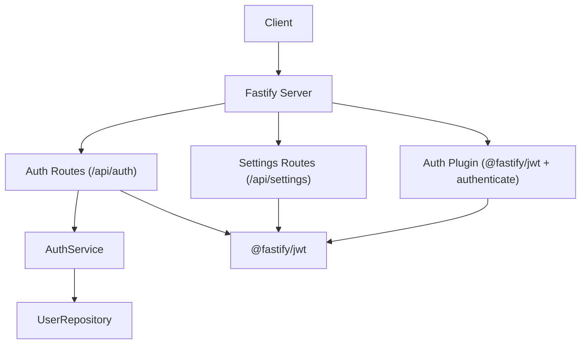
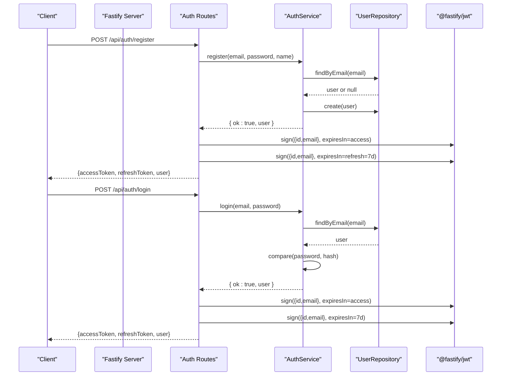
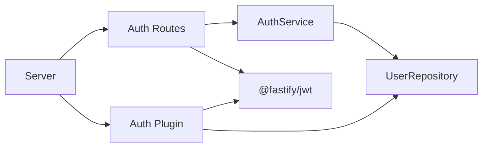

# Authentication API

<cite>
**Referenced Files in This Document**
- [auth.ts](file://packages/backend/src/routes/auth.ts)
- [auth-service.ts](file://packages/backend/src/services/auth-service.ts)
- [auth.ts](file://packages/backend/src/plugins/auth.ts)
- [index.ts](file://packages/backend/src/index.ts)
- [user-repository.ts](file://packages/backend/src/repositories/user-repository.ts)
- [settings.ts](file://packages/backend/src/routes/settings.ts)
- [auth.test.ts](file://packages/backend/tests/auth.test.ts)
</cite>

## Table of Contents

1. [Introduction](#introduction)
2. [Project Structure](#project-structure)
3. [Core Components](#core-components)
4. [Architecture Overview](#architecture-overview)
5. [Detailed Component Analysis](#detailed-component-analysis)
6. [Dependency Analysis](#dependency-analysis)
7. [Performance Considerations](#performance-considerations)
8. [Troubleshooting Guide](#troubleshooting-guide)
9. [Conclusion](#conclusion)
10. [Appendices](#appendices)

## Introduction

This document provides comprehensive API documentation for the authentication system. It covers the available endpoints for registration, login, and retrieving the current user profile. It also documents JWT token issuance, middleware requirements, session management, and security considerations. Where applicable, it outlines missing endpoints (logout, token refresh, password reset, account verification, and multi-factor authentication) and provides recommended integration points.

## Project Structure

The authentication system is implemented as part of the backend service and consists of:

- Route handlers under the `/api/auth` prefix
- An authentication service responsible for user registration and login logic
- A JWT-based authentication plugin that validates tokens and loads the current user session
- A user repository for database interactions
- Optional settings endpoints that require authentication

**Diagram sources**

- [index.ts:84](file://packages/backend/src/index.ts#L84)
- [auth.ts:1](file://packages/backend/src/routes/auth.ts#L1)
- [auth-service.ts:11](file://packages/backend/src/services/auth-service.ts#L11)
- [auth.ts:12](file://packages/backend/src/plugins/auth.ts#L12)
- [user-repository.ts:4](file://packages/backend/src/repositories/user-repository.ts#L4)

**Section sources**

- [index.ts:84](file://packages/backend/src/index.ts#L84)
- [auth.ts:1](file://packages/backend/src/routes/auth.ts#L1)
- [auth-service.ts:11](file://packages/backend/src/services/auth-service.ts#L11)
- [auth.ts:12](file://packages/backend/src/plugins/auth.ts#L12)
- [user-repository.ts:4](file://packages/backend/src/repositories/user-repository.ts#L4)

## Core Components

- Authentication routes: Registration, login, and current user retrieval
- Authentication service: Password hashing, user lookup, and safe user projection
- Authentication plugin: JWT verification and session user loading
- User repository: Database queries for user data and session loading
- Settings routes: Optional authenticated endpoints (not part of core auth but require authentication)

**Section sources**

- [auth.ts:4](file://packages/backend/src/routes/auth.ts#L4)
- [auth-service.ts:11](file://packages/backend/src/services/auth-service.ts#L11)
- [auth.ts:12](file://packages/backend/src/plugins/auth.ts#L12)
- [user-repository.ts:4](file://packages/backend/src/repositories/user-repository.ts#L4)
- [settings.ts:4](file://packages/backend/src/routes/settings.ts#L4)

## Architecture Overview

The authentication flow integrates @fastify/jwt for token signing and verification, with a custom authenticate decorator ensuring protected routes enforce session validity.

**Diagram sources**

- [auth.ts:6](file://packages/backend/src/routes/auth.ts#L6)
- [auth.ts:30](file://packages/backend/src/routes/auth.ts#L30)
- [auth-service.ts:14](file://packages/backend/src/services/auth-service.ts#L14)
- [auth-service.ts:42](file://packages/backend/src/services/auth-service.ts#L42)
- [user-repository.ts:15](file://packages/backend/src/repositories/user-repository.ts#L15)
- [index.ts:49](file://packages/backend/src/index.ts#L49)

## Detailed Component Analysis

### Authentication Endpoints

#### POST /api/auth/register

- Description: Registers a new user with email, password, and name.
- Request body:
  - email: string
  - password: string
  - name: string
- Responses:
  - 200 OK: Returns accessToken, refreshToken, and user object
  - 400 Bad Request: Email already registered
- Security considerations:
  - Password is hashed before storage
  - Returned user excludes sensitive fields
- Example request (paths):
  - [auth.test.ts:74-88](file://packages/backend/tests/auth.test.ts#L74-L88)
- Example response (paths):
  - [auth.test.ts:84-87](file://packages/backend/tests/auth.test.ts#L84-L87)

**Section sources**

- [auth.ts:6](file://packages/backend/src/routes/auth.ts#L6)
- [auth-service.ts:14](file://packages/backend/src/services/auth-service.ts#L14)
- [auth-service.ts:24](file://packages/backend/src/services/auth-service.ts#L24)
- [auth.test.ts:62-107](file://packages/backend/tests/auth.test.ts#L62-L107)

#### POST /api/auth/login

- Description: Authenticates a user with email and password.
- Request body:
  - email: string
  - password: string
- Responses:
  - 200 OK: Returns accessToken, refreshToken, and user object
  - 401 Unauthorized: Invalid credentials
- Security considerations:
  - Password comparison uses bcrypt
  - Returned user excludes sensitive fields
- Example request (paths):
  - [auth.test.ts:119-132](file://packages/backend/tests/auth.test.ts#L119-L132)
- Example response (paths):
  - [auth.test.ts:128-131](file://packages/backend/tests/auth.test.ts#L128-L131)
- Error responses (paths):
  - [auth.test.ts:134-172](file://packages/backend/tests/auth.test.ts#L134-L172)

**Section sources**

- [auth.ts:30](file://packages/backend/src/routes/auth.ts#L30)
- [auth-service.ts:42](file://packages/backend/src/services/auth-service.ts#L42)
- [auth-service.ts:51](file://packages/backend/src/services/auth-service.ts#L51)
- [auth.test.ts:109-173](file://packages/backend/tests/auth.test.ts#L109-L173)

#### GET /api/auth/me

- Description: Retrieves the currently authenticated user’s public profile.
- Authentication: Requires a valid JWT bearer token.
- Responses:
  - 200 OK: Returns user object with id, email, name, createdAt
  - 401 Unauthorized: Missing or invalid token, or session invalid
- Security considerations:
  - Enforced by the authenticate decorator
  - Session user loaded via repository
- Example request (paths):
  - [auth.test.ts:184-193](file://packages/backend/tests/auth.test.ts#L184-L193)

**Section sources**

- [auth.ts:55](file://packages/backend/src/routes/auth.ts#L55)
- [auth.ts:58](file://packages/backend/src/routes/auth.ts#L58)
- [auth.ts:12](file://packages/backend/src/plugins/auth.ts#L12)
- [user-repository.ts:19](file://packages/backend/src/repositories/user-repository.ts#L19)
- [auth.test.ts:175-194](file://packages/backend/tests/auth.test.ts#L175-L194)

### JWT Token Handling

- Issuance:
  - Access token: signed with default expiration
  - Refresh token: signed with 7-day expiration
- Verification:
  - The authenticate decorator verifies the JWT and loads the session user
  - On failure, responds with 401 Unauthorized
- Secret:
  - Configured via environment variable for @fastify/jwt

**Section sources**

- [auth.ts:16](file://packages/backend/src/routes/auth.ts#L16)
- [auth.ts:41](file://packages/backend/src/routes/auth.ts#L41)
- [auth.ts:12](file://packages/backend/src/plugins/auth.ts#L12)
- [index.ts:49-51](file://packages/backend/src/index.ts#L49-L51)

### Authentication Middleware Requirements

- Global plugin registration:
  - @fastify/jwt configured with secret
  - Custom authenticate decorator registered
- Route protection:
  - GET /api/auth/me requires authentication via preHandler
- Session management:
  - authenticate decorator loads user from database using the token’s subject
  - If the user does not exist in the database, responds with 401

**Section sources**

- [index.ts:80-81](file://packages/backend/src/index.ts#L80-L81)
- [auth.ts:58](file://packages/backend/src/routes/auth.ts#L58)
- [auth.ts:12](file://packages/backend/src/plugins/auth.ts#L12)
- [user-repository.ts:8](file://packages/backend/src/repositories/user-repository.ts#L8)

### Logout and Token Refresh

- Current state:
  - No explicit logout endpoint
  - No token refresh endpoint
- Recommended integration points:
  - Logout: Invalidate or revoke tokens at the client level; optionally maintain a revocation list server-side
  - Token refresh: Add POST /api/auth/token-refresh; validate refresh token and issue a new access token; rotate refresh tokens periodically

[No sources needed since this section provides recommendations without analyzing specific files]

### Password Reset and Account Verification

- Current state:
  - No dedicated password reset endpoint
  - No account verification endpoint
- Recommended integration points:
  - Password reset: Add POST /api/auth/forgot-password and POST /api/auth/reset-password with secure token generation and short-lived links
  - Account verification: Add POST /api/auth/verify-email and resend endpoints

[No sources needed since this section provides recommendations without analyzing specific files]

### Multi-Factor Authentication (MFA)

- Current state:
  - No MFA endpoints
- Recommended integration points:
  - Enable MFA: Add POST /api/auth/mfa-enable and POST /api/auth/mfa-verify
  - Backup codes: Add endpoints to manage backup codes

[No sources needed since this section provides recommendations without analyzing specific files]

## Dependency Analysis

The authentication system depends on:

- @fastify/jwt for token signing and verification
- AuthService for business logic
- UserRepository for database access
- Authentication plugin for middleware enforcement

**Diagram sources**

- [auth.ts:1](file://packages/backend/src/routes/auth.ts#L1)
- [auth-service.ts:11](file://packages/backend/src/services/auth-service.ts#L11)
- [user-repository.ts:4](file://packages/backend/src/repositories/user-repository.ts#L4)
- [auth.ts:12](file://packages/backend/src/plugins/auth.ts#L12)
- [index.ts:49](file://packages/backend/src/index.ts#L49)

**Section sources**

- [auth.ts:1](file://packages/backend/src/routes/auth.ts#L1)
- [auth-service.ts:11](file://packages/backend/src/services/auth-service.ts#L11)
- [user-repository.ts:4](file://packages/backend/src/repositories/user-repository.ts#L4)
- [auth.ts:12](file://packages/backend/src/plugins/auth.ts#L12)
- [index.ts:49](file://packages/backend/src/index.ts#L49)

## Performance Considerations

- Password hashing cost: bcrypt cost of 10 is used during registration; consider tuning based on hardware
- Token signing overhead: Keep refresh token expiration reasonable to reduce long-lived token risks
- Database queries: UserRepository methods are straightforward; ensure database indexing on email for efficient lookups

[No sources needed since this section provides general guidance]

## Troubleshooting Guide

Common issues and resolutions:

- 401 Unauthorized on protected routes:
  - Ensure the Authorization header includes a valid JWT
  - Confirm the token was issued by the same secret and is not expired
- 400 Bad Request on registration:
  - Verify the email is not already registered
- 401 Unauthorized on login:
  - Confirm the email exists and the password is correct
- Session invalid:
  - If the user is deleted or disabled in the database, the authenticate decorator returns 401

**Section sources**

- [auth.ts:12-35](file://packages/backend/src/plugins/auth.ts#L12-L35)
- [auth.ts:58](file://packages/backend/src/routes/auth.ts#L58)
- [auth-service.ts:42-65](file://packages/backend/src/services/auth-service.ts#L42-L65)
- [auth.test.ts:134-172](file://packages/backend/tests/auth.test.ts#L134-L172)

## Conclusion

The authentication system provides secure registration, login, and current user retrieval with JWT-based session management. It enforces authentication via a dedicated plugin and exposes a single protected endpoint for profile access. To achieve enterprise-grade security and UX, integrate logout, token refresh, password reset, account verification, and MFA endpoints at the recommended integration points.

[No sources needed since this section summarizes without analyzing specific files]

## Appendices

### Endpoint Reference Summary

- POST /api/auth/register
  - Request: email, password, name
  - Response: accessToken, refreshToken, user
  - Errors: 400 on duplicate email
- POST /api/auth/login
  - Request: email, password
  - Response: accessToken, refreshToken, user
  - Errors: 401 on invalid credentials
- GET /api/auth/me
  - Auth: Bearer JWT
  - Response: user profile
  - Errors: 401 on invalid/expired token or invalid session

**Section sources**

- [auth.ts:6](file://packages/backend/src/routes/auth.ts#L6)
- [auth.ts:30](file://packages/backend/src/routes/auth.ts#L30)
- [auth.ts:55](file://packages/backend/src/routes/auth.ts#L55)
- [auth.test.ts:62-194](file://packages/backend/tests/auth.test.ts#L62-L194)
