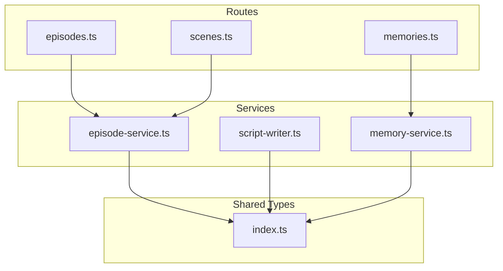
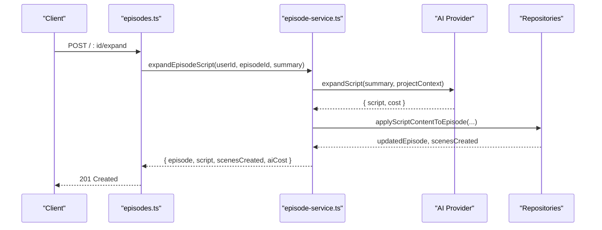
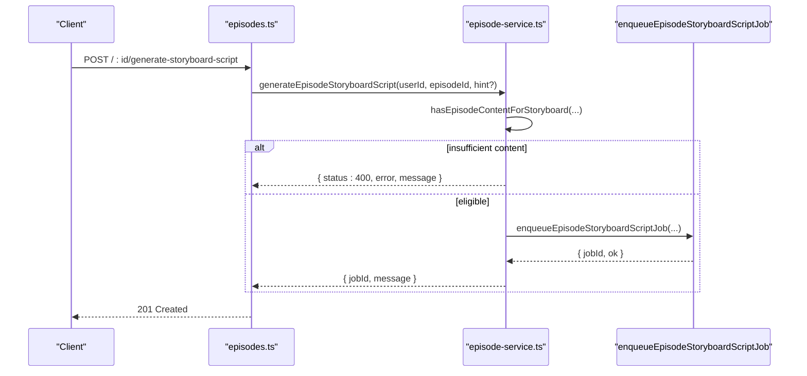
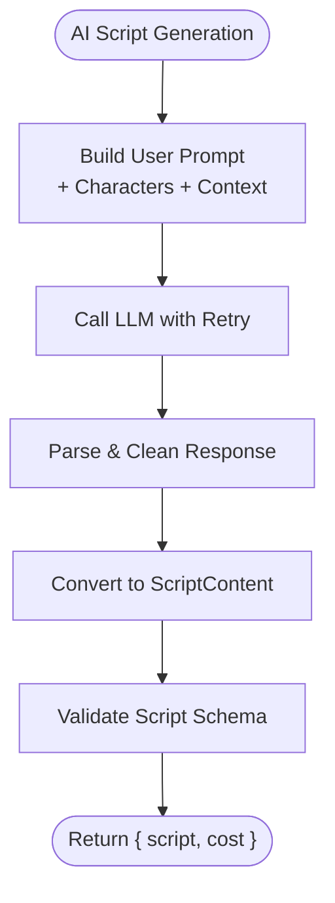
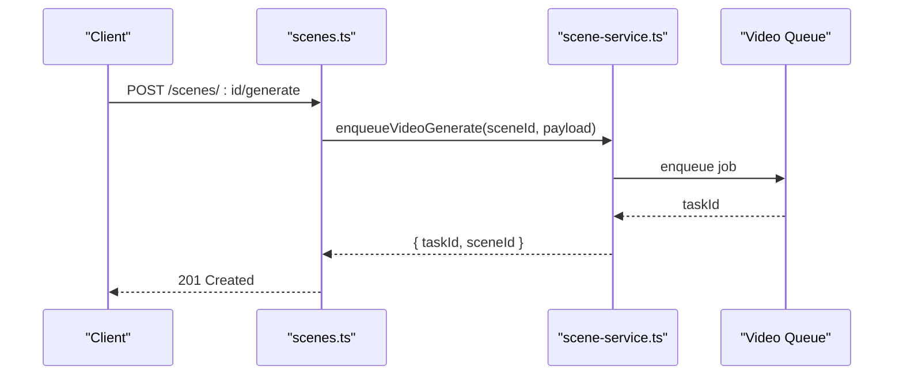
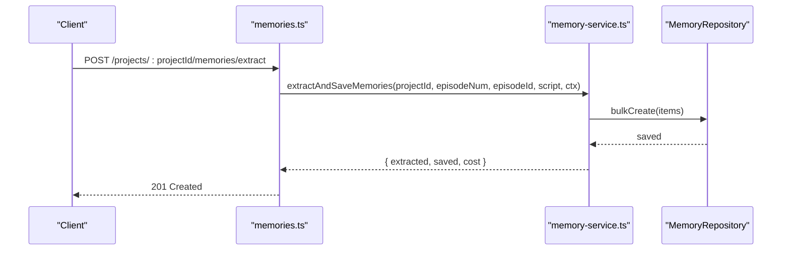
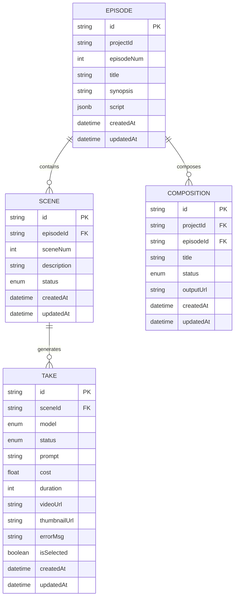
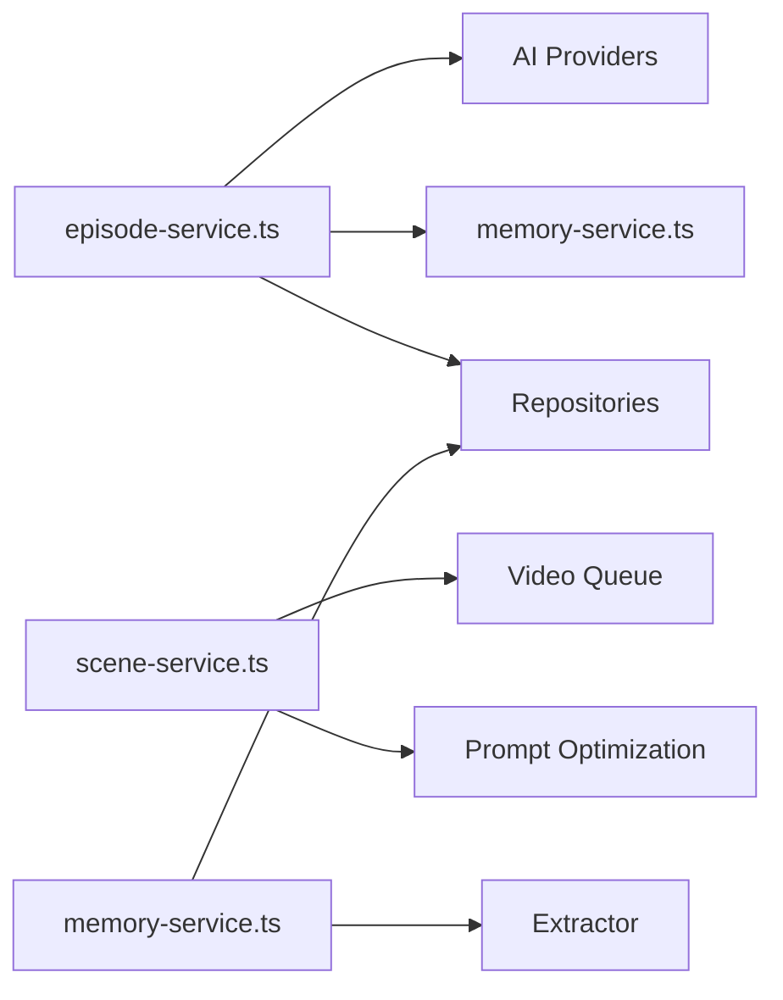

# Episode and Script API

<cite>
**Referenced Files in This Document**
- [episodes.ts](file://packages/backend/src/routes/episodes.ts)
- [episode-service.ts](file://packages/backend/src/services/episode-service.ts)
- [script-writer.ts](file://packages/backend/src/services/script-writer.ts)
- [scenes.ts](file://packages/backend/src/routes/scenes.ts)
- [memories.ts](file://packages/backend/src/routes/memories.ts)
- [index.ts](file://packages/shared/src/types/index.ts)
- [deepseek.ts](file://packages/backend/src/services/ai/deepseek.ts)
- [script-expand.ts](file://packages/backend/src/services/ai/script-expand.ts)
- [memory-service.ts](file://packages/backend/src/services/memory/memory-service.ts)
</cite>

## Table of Contents

1. [Introduction](#introduction)
2. [Project Structure](#project-structure)
3. [Core Components](#core-components)
4. [Architecture Overview](#architecture-overview)
5. [Detailed Component Analysis](#detailed-component-analysis)
6. [Dependency Analysis](#dependency-analysis)
7. [Performance Considerations](#performance-considerations)
8. [Troubleshooting Guide](#troubleshooting-guide)
9. [Conclusion](#conclusion)
10. [Appendices](#appendices)

## Introduction

This document provides comprehensive API documentation for episode and script management endpoints. It covers episode lifecycle operations, AI-powered script generation, scene breakdown, and memory management. It specifies request/response schemas for narrative structure, script formatting, scene planning, and content organization. It also documents integrations with AI providers, rich text editor capabilities, version control features, content validation, auto-save mechanisms, and conflict resolution strategies.

## Project Structure

The episode and script APIs are implemented in the backend service layer with dedicated routes and services:

- Episode management: routes and service orchestration for CRUD, composition, and AI expansion
- Scene management: routes and services for scene creation, video generation, and task selection
- Memory management: routes and services for querying, creating, updating, deleting, and searching memories
- Shared types: standardized schemas for scripts, scenes, characters, and composition assets

**Diagram sources**

- [episodes.ts:1-255](file://packages/backend/src/routes/episodes.ts#L1-L255)
- [episode-service.ts:1-624](file://packages/backend/src/services/episode-service.ts#L1-L624)
- [script-writer.ts:1-386](file://packages/backend/src/services/script-writer.ts#L1-L386)
- [scenes.ts:1-205](file://packages/backend/src/routes/scenes.ts#L1-L205)
- [memories.ts:1-454](file://packages/backend/src/routes/memories.ts#L1-L454)
- [index.ts:1-567](file://packages/shared/src/types/index.ts#L1-L567)

**Section sources**

- [episodes.ts:1-255](file://packages/backend/src/routes/episodes.ts#L1-L255)
- [episode-service.ts:1-624](file://packages/backend/src/services/episode-service.ts#L1-L624)
- [script-writer.ts:1-386](file://packages/backend/src/services/script-writer.ts#L1-L386)
- [scenes.ts:1-205](file://packages/backend/src/routes/scenes.ts#L1-L205)
- [memories.ts:1-454](file://packages/backend/src/routes/memories.ts#L1-L454)
- [index.ts:1-567](file://packages/shared/src/types/index.ts#L1-L567)

## Core Components

- Episode API: list episodes, get episode details, manage episode content, compose episode videos, expand scripts via AI, and generate storyboard scripts
- Scene API: list scenes, create/update/delete scenes, generate videos, batch generation, select tasks, and optimize prompts
- Memory API: query, create, update, delete, search, and compute statistics for memories; extract memories from episodes
- Shared Types: standardized schemas for scripts, scenes, characters, composition assets, and pipeline artifacts

Key responsibilities:

- EpisodeService orchestrates script application, scene creation, composition, and AI expansions
- SceneService manages scene lifecycle and video generation tasks
- MemoryService extracts and persists memories from scripts and builds contextual data for writing and storyboard generation

**Section sources**

- [episode-service.ts:90-621](file://packages/backend/src/services/episode-service.ts#L90-L621)
- [scenes.ts:1-205](file://packages/backend/src/routes/scenes.ts#L1-L205)
- [memories.ts:1-454](file://packages/backend/src/routes/memories.ts#L1-L454)
- [index.ts:47-220](file://packages/shared/src/types/index.ts#L47-L220)

## Architecture Overview

The system integrates Fastify routes with service-layer logic and shared type definitions. AI operations leverage external providers through wrappers and factories. Composition and video generation integrate with downstream workers and storage.

**Diagram sources**

- [episodes.ts:182-213](file://packages/backend/src/routes/episodes.ts#L182-L213)
- [episode-service.ts:446-536](file://packages/backend/src/services/episode-service.ts#L446-L536)
- [script-expand.ts:127-179](file://packages/backend/src/services/ai/script-expand.ts#L127-L179)

**Section sources**

- [episodes.ts:182-213](file://packages/backend/src/routes/episodes.ts#L182-L213)
- [episode-service.ts:446-536](file://packages/backend/src/services/episode-service.ts#L446-L536)
- [script-expand.ts:127-179](file://packages/backend/src/services/ai/script-expand.ts#L127-L179)

## Detailed Component Analysis

### Episode Management API

Endpoints:

- GET /projects/:projectId/episodes
- GET /episodes/:id
- GET /episodes/:id/detail
- GET /episodes/:id/scenes
- POST /episodes
- PUT /episodes/:id
- DELETE /episodes/:id
- POST /episodes/:id/compose
- POST /episodes/:id/expand
- POST /episodes/:id/generate-storyboard-script

Behavior highlights:

- Ownership verification ensures only authorized users can access episodes
- Detail endpoint returns episode metadata, scenes tree, and project visual style
- Scenes endpoint lists scenes for episode editor
- Compose endpoint validates selected takes and exports a composition
- Expand and storyboard generation endpoints trigger AI operations and persist results

Request/response schemas:

- CreateEpisodeRequest: projectId, episodeNum, title?
- UpdateEpisodeRequest: title?, synopsis?, script?
- ExpandScriptRequest: summary (string)
- ComposeEpisodeResponse: compositionId, outputUrl, duration, message
- ExpandEpisodeResult: episode, script, scenesCreated, aiCost
- GenerateStoryboardScriptResult: jobId, message

Validation and error handling:

- 403 permission denied for unauthorized access
- 404 not found for missing episodes
- 400 bad request for invalid composition prerequisites
- 409 conflict for job submission conflicts
- 429 rate limit for AI provider throttling
- 500 server error for internal failures

**Diagram sources**

- [episodes.ts:216-253](file://packages/backend/src/routes/episodes.ts#L216-L253)
- [episode-service.ts:538-620](file://packages/backend/src/services/episode-service.ts#L538-L620)

**Section sources**

- [episodes.ts:8-255](file://packages/backend/src/routes/episodes.ts#L8-L255)
- [episode-service.ts:70-88](file://packages/backend/src/services/episode-service.ts#L70-L88)
- [episode-service.ts:366-444](file://packages/backend/src/services/episode-service.ts#L366-L444)
- [episode-service.ts:446-536](file://packages/backend/src/services/episode-service.ts#L446-L536)
- [episode-service.ts:538-620](file://packages/backend/src/services/episode-service.ts#L538-L620)

### Script Generation and Formatting

AI-powered script generation supports:

- Expanding a short summary into a structured script
- Generating storyboard scripts from episode content
- Optimizing scene descriptions for video generation
- Rich text editor support via editorDoc field in ScriptContent

Request/response schemas:

- writeScriptFromIdea: idea, options (characters?, projectContext?, modelLog?)
- writeEpisodeForProject: episodeNum, seriesSynopsis, rollingContext, seriesTitle, modelLog?
- expandScript: script, additionalScenes?, options?
- improveScript: script, feedback, options?
- optimizeSceneDescription: description, sceneContext?, modelLog?

Validation and parsing:

- Responses are cleaned of markdown code blocks and validated against ScriptContent schema
- Scene actions are split into arrays based on punctuation
- Dialogues support both array and object forms

**Diagram sources**

- [script-writer.ts:31-61](file://packages/backend/src/services/script-writer.ts#L31-L61)
- [script-writer.ts:280-304](file://packages/backend/src/services/script-writer.ts#L280-L304)
- [script-writer.ts:364-381](file://packages/backend/src/services/script-writer.ts#L364-L381)

**Section sources**

- [script-writer.ts:16-26](file://packages/backend/src/services/script-writer.ts#L16-L26)
- [script-writer.ts:31-103](file://packages/backend/src/services/script-writer.ts#L31-L103)
- [script-writer.ts:108-152](file://packages/backend/src/services/script-writer.ts#L108-L152)
- [script-writer.ts:157-199](file://packages/backend/src/services/script-writer.ts#L157-L199)
- [script-writer.ts:204-250](file://packages/backend/src/services/script-writer.ts#L204-L250)
- [script-writer.ts:280-304](file://packages/backend/src/services/script-writer.ts#L280-L304)
- [script-writer.ts:364-381](file://packages/backend/src/services/script-writer.ts#L364-L381)

### Scene Management API

Endpoints:

- GET /scenes?episodeId=...
- GET /scenes/:id
- POST /scenes
- PUT /scenes/:id
- DELETE /scenes/:id
- POST /scenes/:id/generate
- POST /scenes/batch-generate
- POST /scenes/:id/tasks/:taskId/select
- GET /scenes/:id/tasks
- POST /scenes/:id/optimize-prompt

Behavior highlights:

- Create scene with first shot using a prompt
- Enqueue video generation jobs per scene or in batch
- Select a generated task as the chosen take
- Optimize scene prompts for better video generation

Request/response schemas:

- CreateSceneRequest: episodeId, sceneNum, description?, prompt
- GenerateVideoRequest: model, referenceImage?, duration?
- BatchGenerateRequest: sceneIds[], model, referenceImage?
- Task selection response: selected task details
- Prompt optimization response: optimizedPrompt, aiCost

Validation and error handling:

- 403 permission denied for unauthorized access
- 404 not found for missing scenes
- 400 bad request when generating without prompt
- 401 unauthorized for AI provider auth errors
- 429 rate limit for AI provider throttling
- 500 server error for internal failures

**Diagram sources**

- [scenes.ts:104-123](file://packages/backend/src/routes/scenes.ts#L104-L123)

**Section sources**

- [scenes.ts:8-205](file://packages/backend/src/routes/scenes.ts#L8-L205)

### Memory Management API

Endpoints:

- GET /projects/:projectId/memories
- GET /projects/:projectId/memories/:memoryId
- POST /projects/:projectId/memories
- PUT /projects/:projectId/memories/:memoryId
- DELETE /projects/:projectId/memories/:memoryId
- POST /projects/:projectId/memories/search
- GET /projects/:projectId/memories/context
- POST /projects/:projectId/memories/extract
- GET /projects/:projectId/memories/stats

Behavior highlights:

- Query memories with filters (type, isActive, episodeId, tags, minImportance, category)
- Create/update/delete memories with validation
- Search memories by text query
- Extract memories from episode scripts and save to database
- Compute statistics (counts, active, verified, average importance)

Request/response schemas:

- CreateMemoryRequest: type, category?, title, content, tags?, importance?, episodeId?, metadata?
- UpdateMemoryRequest: title?, content?, tags?, importance?, isActive?, verified?, category?
- SearchMemoryRequest: query, limit?
- ExtractMemoryRequest: episodeId, episodeNum
- StatsResponse: total, byType, byImportance, active, verified, averageImportance

Validation and error handling:

- 403 permission denied for unauthorized access
- 400 bad request for missing required fields or invalid importance range
- 404 not found for missing memories
- 500 server error for extraction failures

**Diagram sources**

- [memories.ts:339-401](file://packages/backend/src/routes/memories.ts#L339-L401)
- [memory-service.ts:19-66](file://packages/backend/src/services/memory/memory-service.ts#L19-L66)

**Section sources**

- [memories.ts:17-454](file://packages/backend/src/routes/memories.ts#L17-L454)
- [memory-service.ts:13-120](file://packages/backend/src/services/memory/memory-service.ts#L13-L120)

### Data Models and Schemas

Core types define narrative structure, script formatting, scene planning, and content organization:

- Episode: id, projectId, episodeNum, title?, synopsis?, script?, createdAt, updatedAt, listStats?
- ScriptContent: title, summary, metadata?, scenes[], editorDoc?
- ScriptScene: sceneNum, location, timeOfDay, characters[], description, dialogues[], actions[], shots?
- ScriptStoryboardShot: shotNum?, order?, description, cameraAngle?, cameraMovement?, duration?, characters?
- ScriptDialogueLine: character, content
- EpisodeScene: id, episodeId, sceneNum, description?, status
- Take: id, sceneId, model, status, prompt, cost?, duration?, videoUrl?, thumbnailUrl?, errorMsg?, isSelected
- Composition: id, projectId, episodeId, title, status, outputUrl?
- CompositionTimelineClip: id?, compositionId?, sceneId, takeId, order

Validation rules:

- Episode list stats derive counts from script and database-backed scenes/dialogues/character shots
- Script scenes require location and description; dialogues require character/content pairs
- Scene status transitions through pending, generating, processing, completed, failed
- Composition status transitions through draft, processing, completed, failed

**Diagram sources**

- [index.ts:65-196](file://packages/shared/src/types/index.ts#L65-L196)
- [index.ts:199-220](file://packages/shared/src/types/index.ts#L199-L220)

**Section sources**

- [index.ts:47-196](file://packages/shared/src/types/index.ts#L47-L196)
- [index.ts:197-220](file://packages/shared/src/types/index.ts#L197-L220)

## Dependency Analysis

The EpisodeService depends on:

- AI providers for script expansion and storyboard generation
- Repositories for episode, scene, and pipeline operations
- Memory service for extracting memories post-expansion
- Composition export for video synthesis

SceneService depends on:

- Video queue for asynchronous generation
- Task selection and optimization utilities

MemoryService depends on:

- Repository for persistence
- LLM-based extractor for memory parsing

**Diagram sources**

- [episode-service.ts:1-25](file://packages/backend/src/services/episode-service.ts#L1-L25)
- [memory-service.ts:1-12](file://packages/backend/src/services/memory/memory-service.ts#L1-L12)
- [script-expand.ts:1-26](file://packages/backend/src/services/ai/script-expand.ts#L1-L26)

**Section sources**

- [episode-service.ts:1-25](file://packages/backend/src/services/episode-service.ts#L1-L25)
- [memory-service.ts:1-12](file://packages/backend/src/services/memory/memory-service.ts#L1-L12)
- [script-expand.ts:1-26](file://packages/backend/src/services/ai/script-expand.ts#L1-L26)

## Performance Considerations

- Batch video generation reduces queue overhead and improves throughput
- Scene duration caps prevent excessive processing time per scene
- Composition scene clipping validates take availability before export
- AI call retries and cost tracking help manage provider quotas and costs
- Memory extraction batches minimize repeated LLM calls

## Troubleshooting Guide

Common issues and resolutions:

- Permission denied: verify ownership checks for episodes and scenes
- Episode not found: ensure episode exists before composing or expanding
- Composition prerequisites: ensure scenes have selected completed takes with video URLs
- AI provider errors: handle auth failures, rate limits, and generic failures with appropriate status codes
- Memory extraction: verify episode script presence and handle extraction failures gracefully

**Section sources**

- [episodes.ts:16-18](file://packages/backend/src/routes/episodes.ts#L16-L18)
- [episodes.ts:153-155](file://packages/backend/src/routes/episodes.ts#L153-L155)
- [episode-service.ts:366-444](file://packages/backend/src/services/episode-service.ts#L366-L444)
- [episode-service.ts:511-535](file://packages/backend/src/services/episode-service.ts#L511-L535)
- [memories.ts:371-376](file://packages/backend/src/routes/memories.ts#L371-L376)
- [memories.ts:392-399](file://packages/backend/src/routes/memories.ts#L392-L399)

## Conclusion

The episode and script management APIs provide a robust foundation for collaborative writing, AI-assisted script generation, scene breakdown, and memory-driven content organization. The modular architecture enables scalable composition, efficient video generation, and intelligent memory extraction, while strict validation and error handling ensure reliable operation.

## Appendices

### API Reference Summary

- Episodes
  - GET /projects/:projectId/episodes
  - GET /episodes/:id
  - GET /episodes/:id/detail
  - GET /episodes/:id/scenes
  - POST /episodes
  - PUT /episodes/:id
  - DELETE /episodes/:id
  - POST /episodes/:id/compose
  - POST /episodes/:id/expand
  - POST /episodes/:id/generate-storyboard-script

- Scenes
  - GET /scenes?episodeId=...
  - GET /scenes/:id
  - POST /scenes
  - PUT /scenes/:id
  - DELETE /scenes/:id
  - POST /scenes/:id/generate
  - POST /scenes/batch-generate
  - POST /scenes/:id/tasks/:taskId/select
  - GET /scenes/:id/tasks
  - POST /scenes/:id/optimize-prompt

- Memories
  - GET /projects/:projectId/memories
  - GET /projects/:projectId/memories/:memoryId
  - POST /projects/:projectId/memories
  - PUT /projects/:projectId/memories/:memoryId
  - DELETE /projects/:projectId/memories/:memoryId
  - POST /projects/:projectId/memories/search
  - GET /projects/:projectId/memories/context
  - POST /projects/:projectId/memories/extract
  - GET /projects/:projectId/memories/stats

**Section sources**

- [episodes.ts:8-255](file://packages/backend/src/routes/episodes.ts#L8-L255)
- [scenes.ts:8-205](file://packages/backend/src/routes/scenes.ts#L8-L205)
- [memories.ts:17-454](file://packages/backend/src/routes/memories.ts#L17-L454)
