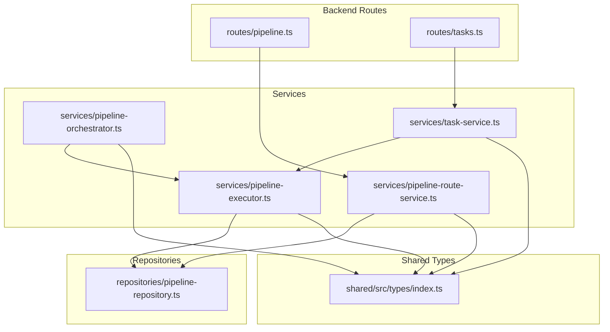
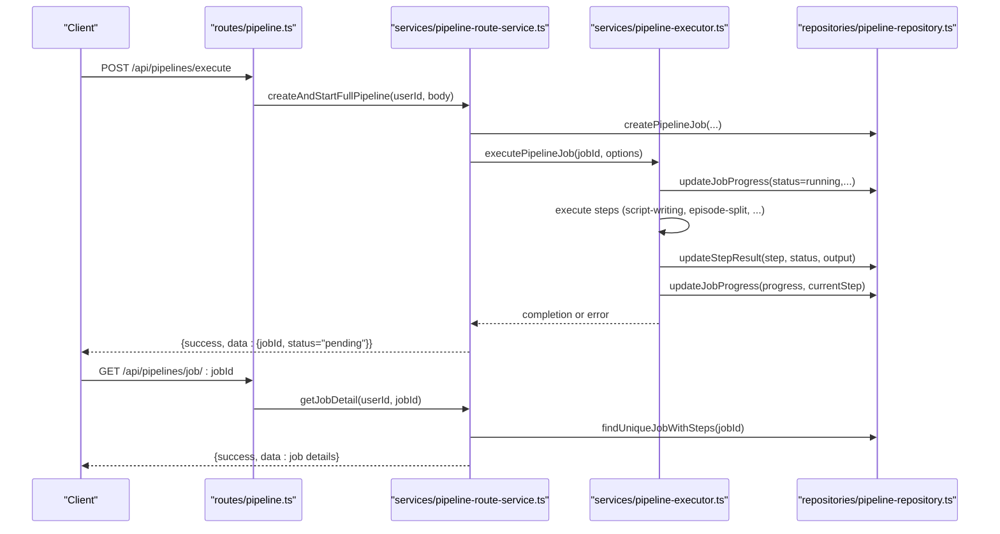
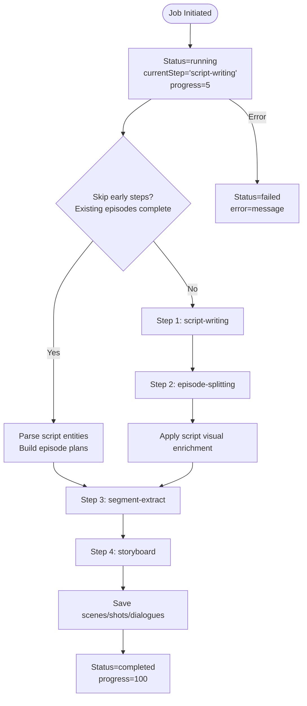
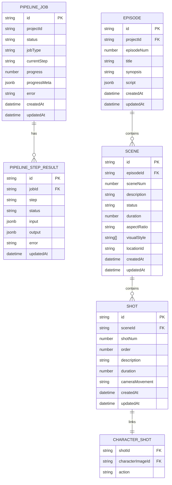
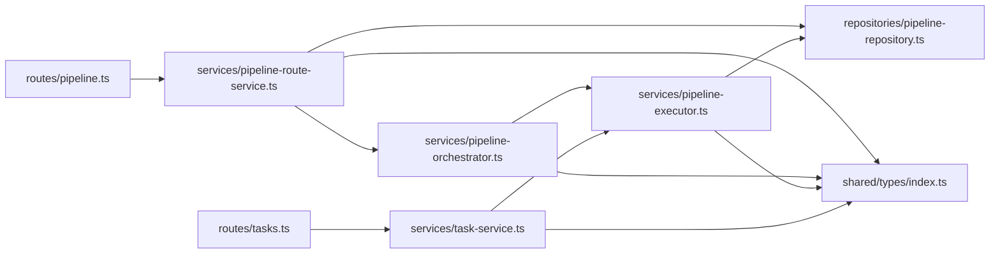

# Pipeline Management API

<cite>
**Referenced Files in This Document**
- [pipeline.ts](file://packages/backend/src/routes/pipeline.ts)
- [tasks.ts](file://packages/backend/src/routes/tasks.ts)
- [pipeline-route-service.ts](file://packages/backend/src/services/pipeline-route-service.ts)
- [pipeline-orchestrator.ts](file://packages/backend/src/services/pipeline-orchestrator.ts)
- [pipeline-executor.ts](file://packages/backend/src/services/pipeline-executor.ts)
- [pipeline-repository.ts](file://packages/backend/src/repositories/pipeline-repository.ts)
- [task-service.ts](file://packages/backend/src/services/task-service.ts)
- [index.ts](file://packages/shared/src/types/index.ts)
</cite>

## Table of Contents

1. [Introduction](#introduction)
2. [Project Structure](#project-structure)
3. [Core Components](#core-components)
4. [Architecture Overview](#architecture-overview)
5. [Detailed Component Analysis](#detailed-component-analysis)
6. [Dependency Analysis](#dependency-analysis)
7. [Performance Considerations](#performance-considerations)
8. [Troubleshooting Guide](#troubleshooting-guide)
9. [Conclusion](#conclusion)
10. [Appendices](#appendices)

## Introduction

This document provides comprehensive API documentation for pipeline orchestration and task management endpoints. It covers workflow initiation, progress monitoring, task queuing, and pipeline state management. It specifies request/response schemas for pipeline configuration, step execution, and error handling. It also documents real-time progress tracking, job scheduling, resource allocation, task prioritization, dependency management, and performance optimization strategies.

## Project Structure

The pipeline and task management APIs are implemented in the backend package under Fastify routes and services. The shared types define the canonical request/response schemas and domain models used across the system.

**Diagram sources**

- [pipeline.ts:1-133](file://packages/backend/src/routes/pipeline.ts#L1-L133)
- [tasks.ts:1-83](file://packages/backend/src/routes/tasks.ts#L1-L83)
- [pipeline-route-service.ts:1-187](file://packages/backend/src/services/pipeline-route-service.ts#L1-L187)
- [pipeline-orchestrator.ts:1-399](file://packages/backend/src/services/pipeline-orchestrator.ts#L1-L399)
- [pipeline-executor.ts:1-236](file://packages/backend/src/services/pipeline-executor.ts#L1-L236)
- [pipeline-repository.ts:1-398](file://packages/backend/src/repositories/pipeline-repository.ts#L1-L398)
- [task-service.ts:1-95](file://packages/backend/src/services/task-service.ts#L1-L95)
- [index.ts:1-567](file://packages/shared/src/types/index.ts#L1-L567)

**Section sources**

- [pipeline.ts:1-133](file://packages/backend/src/routes/pipeline.ts#L1-L133)
- [tasks.ts:1-83](file://packages/backend/src/routes/tasks.ts#L1-L83)
- [pipeline-route-service.ts:1-187](file://packages/backend/src/services/pipeline-route-service.ts#L1-L187)
- [pipeline-orchestrator.ts:1-399](file://packages/backend/src/services/pipeline-orchestrator.ts#L1-L399)
- [pipeline-executor.ts:1-236](file://packages/backend/src/services/pipeline-executor.ts#L1-L236)
- [pipeline-repository.ts:1-398](file://packages/backend/src/repositories/pipeline-repository.ts#L1-L398)
- [task-service.ts:1-95](file://packages/backend/src/services/task-service.ts#L1-L95)
- [index.ts:1-567](file://packages/shared/src/types/index.ts#L1-L567)

## Core Components

- Pipeline routes expose endpoints for initiating full pipelines, checking job status, retrieving project pipeline status, listing steps, listing jobs, and canceling jobs.
- Task routes expose endpoints for retrieving a single task, listing tasks by project, canceling a task, and retrying a failed task.
- Pipeline orchestration coordinates end-to-end execution across multiple steps and integrates with the executor for asynchronous job processing.
- Pipeline repository persists pipeline jobs, step results, and materializes derived data (e.g., scenes, shots, dialogues) from storyboard segments.
- Shared types define request/response schemas, pipeline step types, status enums, and domain entities.

**Section sources**

- [pipeline.ts:9-133](file://packages/backend/src/routes/pipeline.ts#L9-L133)
- [tasks.ts:6-83](file://packages/backend/src/routes/tasks.ts#L6-L83)
- [pipeline-route-service.ts:5-187](file://packages/backend/src/services/pipeline-route-service.ts#L5-L187)
- [pipeline-orchestrator.ts:49-399](file://packages/backend/src/services/pipeline-orchestrator.ts#L49-L399)
- [pipeline-executor.ts:54-236](file://packages/backend/src/services/pipeline-executor.ts#L54-L236)
- [pipeline-repository.ts:10-398](file://packages/backend/src/repositories/pipeline-repository.ts#L10-L398)
- [index.ts:506-567](file://packages/shared/src/types/index.ts#L506-L567)

## Architecture Overview

The system follows an asynchronous job pattern. Clients initiate a full pipeline via a POST endpoint. The route handler creates a pipeline job and enqueues background execution. Progress updates are persisted to the database and can be queried via dedicated endpoints. Tasks represent individual units of work (e.g., video generation) that are queued and executed independently.

**Diagram sources**

- [pipeline.ts:11-47](file://packages/backend/src/routes/pipeline.ts#L11-L47)
- [pipeline-route-service.ts:19-87](file://packages/backend/src/services/pipeline-route-service.ts#L19-L87)
- [pipeline-executor.ts:81-231](file://packages/backend/src/services/pipeline-executor.ts#L81-L231)
- [pipeline-repository.ts:19-70](file://packages/backend/src/repositories/pipeline-repository.ts#L19-L70)

## Detailed Component Analysis

### Pipeline Orchestration API

#### Endpoints

- POST /api/pipelines/execute
  - Description: Initiates a full pipeline job asynchronously.
  - Authentication: Required.
  - Request body schema:
    - projectId: string
    - idea: string
    - targetEpisodes?: number
    - targetDuration?: number
    - defaultAspectRatio?: '16:9' | '9:16' | '1:1'
    - defaultResolution?: '480p' | '720p'
  - Response:
    - success: boolean
    - data: { jobId: string, status: 'pending', message: string }

- GET /api/pipelines/job/:jobId
  - Description: Retrieves detailed job status and step results.
  - Authentication: Required.
  - Path params: jobId: string
  - Response:
    - success: boolean
    - data: Pipeline job details including status, currentStep, progress, progressMeta, error, stepResults, timestamps.

- GET /api/pipelines/status/:projectId
  - Description: Returns the latest pipeline status for a project.
  - Authentication: Required.
  - Path params: projectId: string
  - Response:
    - success: boolean
    - data: { id: string, status: string, currentStep: string, progress: number, error?: string, stepResults: any[] }

- GET /api/pipelines/steps
  - Description: Lists available pipeline steps with descriptions.
  - Authentication: Required.
  - Response:
    - steps: array of { id: string, description: string }

- GET /api/pipelines/jobs
  - Description: Lists all pipeline jobs for the authenticated user.
  - Authentication: Required.
  - Response: array of job summaries with id, projectId, projectName, jobType, status, currentStep, progress, timestamps.

- DELETE /api/pipelines/job/:jobId
  - Description: Cancels a pending pipeline job.
  - Authentication: Required.
  - Path params: jobId: string
  - Response:
    - success: boolean
    - message: string (on success)

#### Error Handling

- Validation errors return 400 with an error message.
- Not found errors return 404 with an error message.
- Internal server errors return 500 with an error payload.

**Section sources**

- [pipeline.ts:11-131](file://packages/backend/src/routes/pipeline.ts#L11-L131)
- [pipeline-route-service.ts:19-183](file://packages/backend/src/services/pipeline-route-service.ts#L19-L183)
- [index.ts:520-527](file://packages/shared/src/types/index.ts#L520-L527)

### Task Management API

#### Endpoints

- GET /api/tasks/:id
  - Description: Retrieves a single task by ID after verifying ownership.
  - Authentication: Required.
  - Path params: id: string
  - Response: Task entity.

- GET /api/tasks?projectId=:projectId
  - Description: Lists tasks for a project after verifying ownership.
  - Authentication: Required.
  - Query params: projectId: string
  - Response: array of tasks with scene metadata.

- POST /api/tasks/:id/cancel
  - Description: Cancels a task if it is not completed or failed.
  - Authentication: Required.
  - Path params: id: string
  - Response: Task entity.

- POST /api/tasks/:id/retry
  - Description: Retries a failed task by requeuing it.
  - Authentication: Required.
  - Path params: id: string
  - Response: New task entity.

#### Error Handling

- Ownership verification failures return 403 with a permission denied message.
- Not found returns 404 with an error message.
- Invalid state transitions return 400 with an error message.

**Section sources**

- [tasks.ts:7-81](file://packages/backend/src/routes/tasks.ts#L7-L81)
- [task-service.ts:20-95](file://packages/backend/src/services/task-service.ts#L20-L95)

### Pipeline Execution Flow

**Diagram sources**

- [pipeline-executor.ts:81-231](file://packages/backend/src/services/pipeline-executor.ts#L81-L231)
- [pipeline-repository.ts:221-394](file://packages/backend/src/repositories/pipeline-repository.ts#L221-L394)

### Data Models and Schemas

**Diagram sources**

- [pipeline-repository.ts:19-70](file://packages/backend/src/repositories/pipeline-repository.ts#L19-L70)
- [pipeline-repository.ts:221-394](file://packages/backend/src/repositories/pipeline-repository.ts#L221-L394)
- [index.ts:65-196](file://packages/shared/src/types/index.ts#L65-L196)

## Dependency Analysis

- Route handlers depend on service classes for business logic.
- Services depend on repositories for persistence.
- Orchestrator coordinates step execution and delegates to executor for asynchronous job processing.
- Shared types unify schemas across services and routes.

**Diagram sources**

- [pipeline.ts:6-7](file://packages/backend/src/routes/pipeline.ts#L6-L7)
- [tasks.ts:2-4](file://packages/backend/src/routes/tasks.ts#L2-L4)
- [pipeline-route-service.ts:1-3](file://packages/backend/src/services/pipeline-route-service.ts#L1-L3)
- [pipeline-orchestrator.ts:6-47](file://packages/backend/src/services/pipeline-orchestrator.ts#L6-L47)
- [pipeline-executor.ts:6-35](file://packages/backend/src/services/pipeline-executor.ts#L6-L35)
- [pipeline-repository.ts:1-8](file://packages/backend/src/repositories/pipeline-repository.ts#L1-L8)
- [task-service.ts:1-3](file://packages/backend/src/services/task-service.ts#L1-L3)
- [index.ts:1-567](file://packages/shared/src/types/index.ts#L1-L567)

**Section sources**

- [pipeline.ts:6-7](file://packages/backend/src/routes/pipeline.ts#L6-L7)
- [tasks.ts:2-4](file://packages/backend/src/routes/tasks.ts#L2-L4)
- [pipeline-route-service.ts:1-3](file://packages/backend/src/services/pipeline-route-service.ts#L1-L3)
- [pipeline-orchestrator.ts:6-47](file://packages/backend/src/services/pipeline-orchestrator.ts#L6-L47)
- [pipeline-executor.ts:6-35](file://packages/backend/src/services/pipeline-executor.ts#L6-L35)
- [pipeline-repository.ts:1-8](file://packages/backend/src/repositories/pipeline-repository.ts#L1-L8)
- [task-service.ts:1-3](file://packages/backend/src/services/task-service.ts#L1-L3)
- [index.ts:1-567](file://packages/shared/src/types/index.ts#L1-L567)

## Performance Considerations

- Asynchronous execution: Pipeline steps are executed asynchronously to avoid blocking clients. Progress updates are persisted incrementally.
- Early skip optimization: When sufficient episodes already exist with complete scripts, the system skips AI writing and splitting to reduce cost and latency.
- Incremental writes: Scenes, shots, and dialogues are saved per step to minimize memory footprint and enable resumable execution.
- Cost estimation: The orchestrator provides a simplified cost estimation function to help users budget for pipeline execution.
- Parallelism: While the orchestration executes steps sequentially, downstream task queues (e.g., video generation) support parallel processing of independent tasks.

[No sources needed since this section provides general guidance]

## Troubleshooting Guide

- Job not found: Ensure the jobId exists and belongs to the authenticated user. Verify project ownership when querying job details.
- Cannot cancel running job: Only pending jobs can be canceled. Wait until the job completes or fails, or contact support for exceptions.
- Task cancellation failed: Tasks can only be canceled if they are not already completed or failed. Re-attempt after confirming task status.
- Retry failed task: Retrying a task creates a new task and re-queues it. Ensure prerequisites (e.g., scene status) are met.
- Internal errors: Inspect server logs for stack traces. The system returns structured error payloads with messages for client-side handling.

**Section sources**

- [pipeline-route-service.ts:159-183](file://packages/backend/src/services/pipeline-route-service.ts#L159-L183)
- [task-service.ts:43-91](file://packages/backend/src/services/task-service.ts#L43-L91)
- [pipeline-executor.ts:215-230](file://packages/backend/src/services/pipeline-executor.ts#L215-L230)

## Conclusion

The Pipeline Management API provides a robust, asynchronous framework for orchestrating multi-step AI-driven workflows while offering granular progress tracking, ownership checks, and task-level controls. By leveraging shared schemas, incremental persistence, and modular services, the system supports scalability, maintainability, and predictable performance.

[No sources needed since this section summarizes without analyzing specific files]

## Appendices

### API Definitions

- POST /api/pipelines/execute
  - Request body: { projectId: string, idea: string, targetEpisodes?: number, targetDuration?: number, defaultAspectRatio?: '16:9' | '9:16' | '1:1', defaultResolution?: '480p' | '720p' }
  - Response: { success: boolean, data: { jobId: string, status: 'pending', message: string } }

- GET /api/pipelines/job/:jobId
  - Response: { success: boolean, data: PipelineStatus }

- GET /api/pipelines/status/:projectId
  - Response: { success: boolean, data: { id: string, status: string, currentStep: string, progress: number, error?: string, stepResults: any[] } }

- GET /api/pipelines/steps
  - Response: { steps: array of { id: string, description: string } }

- GET /api/pipelines/jobs
  - Response: array of { id: string, projectId: string, projectName?: string, jobType: string, status: string, currentStep: string, progress: number, progressMeta?: any, error?: string, createdAt: string, updatedAt: string }

- DELETE /api/pipelines/job/:jobId
  - Response: { success: boolean, message: string }

- GET /api/tasks/:id
  - Response: Task entity

- GET /api/tasks?projectId=:projectId
  - Response: array of tasks with scene metadata

- POST /api/tasks/:id/cancel
  - Response: Task entity

- POST /api/tasks/:id/retry
  - Response: New task entity

**Section sources**

- [pipeline.ts:11-131](file://packages/backend/src/routes/pipeline.ts#L11-L131)
- [tasks.ts:7-81](file://packages/backend/src/routes/tasks.ts#L7-L81)
- [index.ts:520-567](file://packages/shared/src/types/index.ts#L520-L567)
