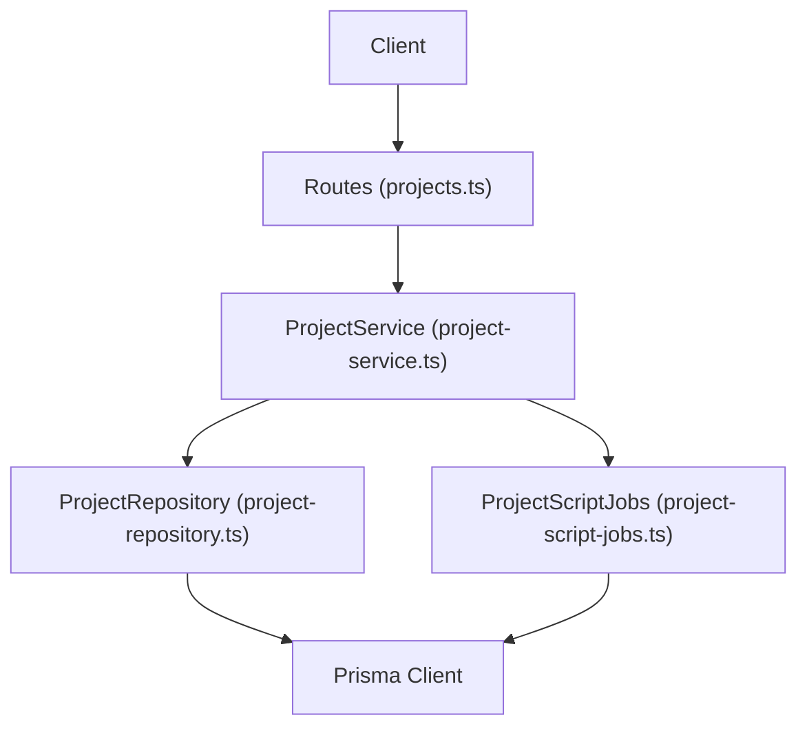
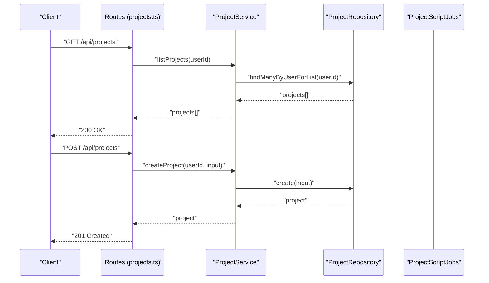
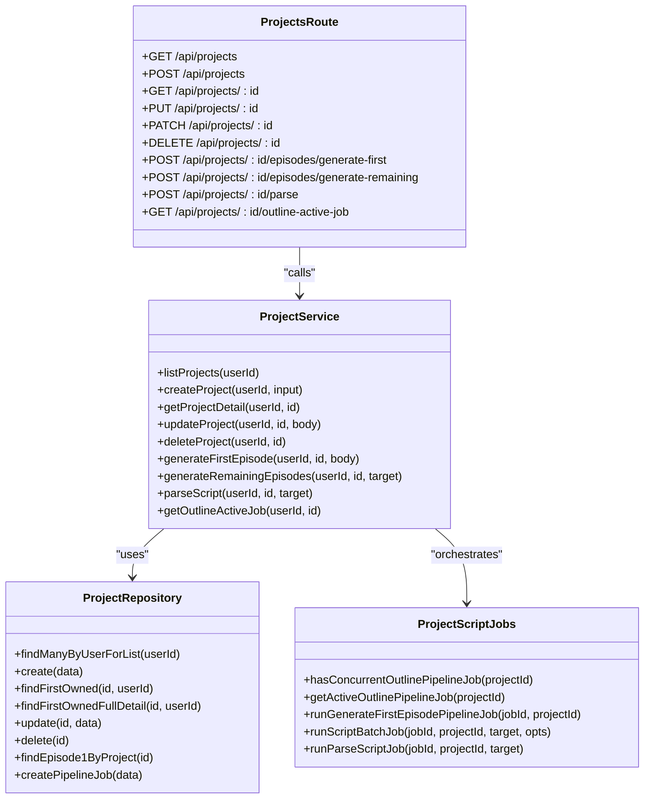

# Project Management API

<cite>
**Referenced Files in This Document**
- [projects.ts](file://packages/backend/src/routes/projects.ts)
- [project-service.ts](file://packages/backend/src/services/project-service.ts)
- [project-repository.ts](file://packages/backend/src/repositories/project-repository.ts)
- [project-aspect.ts](file://packages/backend/src/lib/project-aspect.ts)
- [project-script-jobs.ts](file://packages/backend/src/services/project-script-jobs.ts)
- [projects.test.ts](file://packages/backend/tests/projects.test.ts)
</cite>

## Table of Contents

1. [Introduction](#introduction)
2. [Project Structure](#project-structure)
3. [Core Components](#core-components)
4. [Architecture Overview](#architecture-overview)
5. [Detailed Component Analysis](#detailed-component-analysis)
6. [Dependency Analysis](#dependency-analysis)
7. [Performance Considerations](#performance-considerations)
8. [Troubleshooting Guide](#troubleshooting-guide)
9. [Conclusion](#conclusion)

## Introduction

This document provides comprehensive API documentation for project management endpoints. It covers project lifecycle operations (list, create, retrieve, update, delete), project configuration options, collaboration features, and advanced workflows such as episode generation and parsing. It also documents request/response schemas, permission and access control patterns, and outlines project hierarchy and nested resource relationships.

## Project Structure

The project management API is implemented in the backend package with a layered architecture:

- Routes: Define HTTP endpoints and request validation
- Services: Encapsulate business logic and orchestrate operations
- Repositories: Handle database interactions via Prisma
- Libraries: Provide shared utilities (e.g., aspect ratio normalization)
- Tests: Verify endpoint behavior and data shaping

**Diagram sources**

- [projects.ts:1-229](file://packages/backend/src/routes/projects.ts#L1-L229)
- [project-service.ts:1-281](file://packages/backend/src/services/project-service.ts#L1-L281)
- [project-repository.ts:1-160](file://packages/backend/src/repositories/project-repository.ts#L1-L160)
- [project-script-jobs.ts:1-526](file://packages/backend/src/services/project-script-jobs.ts#L1-L526)

**Section sources**

- [projects.ts:1-229](file://packages/backend/src/routes/projects.ts#L1-L229)
- [project-service.ts:1-281](file://packages/backend/src/services/project-service.ts#L1-L281)
- [project-repository.ts:1-160](file://packages/backend/src/repositories/project-repository.ts#L1-L160)
- [project-script-jobs.ts:1-526](file://packages/backend/src/services/project-script-jobs.ts#L1-L526)

## Core Components

- Authentication middleware ensures all protected endpoints require a valid user session
- ProjectService exposes domain operations for listing, creating, retrieving, updating, and deleting projects
- ProjectRepository abstracts database queries and mutations
- Aspect ratio normalization enforces supported formats and defaults
- ProjectScriptJobs orchestrates asynchronous workflows for generating episodes and parsing scripts

Key responsibilities:

- Route handlers validate request bodies and delegate to ProjectService
- ProjectService validates inputs, checks ownership, and coordinates with repositories and jobs
- ProjectRepository performs CRUD operations and includes related resources for detailed views
- ProjectScriptJobs manages pipeline jobs and progress tracking for long-running operations

**Section sources**

- [projects.ts:4-229](file://packages/backend/src/routes/projects.ts#L4-L229)
- [project-service.ts:50-281](file://packages/backend/src/services/project-service.ts#L50-L281)
- [project-repository.ts:5-160](file://packages/backend/src/repositories/project-repository.ts#L5-L160)
- [project-aspect.ts:1-35](file://packages/backend/src/lib/project-aspect.ts#L1-L35)

## Architecture Overview

The API follows a clean architecture pattern:

- HTTP layer (routes) handles transport concerns
- Application layer (service) encapsulates business rules
- Domain/data layer (repository) abstracts persistence
- Asynchronous workflows (jobs) manage heavy operations

**Diagram sources**

- [projects.ts:6-33](file://packages/backend/src/routes/projects.ts#L6-L33)
- [project-service.ts:53-67](file://packages/backend/src/services/project-service.ts#L53-L67)
- [project-repository.ts:18-20](file://packages/backend/src/repositories/project-repository.ts#L18-L20)

## Detailed Component Analysis

### Project Lifecycle Endpoints

- List projects
  - Method: GET
  - Path: /api/projects
  - Authenticated: Yes
  - Response: Array of projects with basic metadata
  - Notes: Includes a preview of associated characters

- Create project
  - Method: POST
  - Path: /api/projects
  - Authenticated: Yes
  - Request body:
    - name (string, required)
    - description (string, optional)
    - aspectRatio (string, optional)
  - Response: Created project object
  - Behavior: aspectRatio is normalized to supported values

- Retrieve project
  - Method: GET
  - Path: /api/projects/:id
  - Authenticated: Yes
  - Path params: id (string)
  - Response: Full project details including episodes, characters, locations, compositions
  - Behavior: Returns 404 if not found

- Update project
  - Method: PUT or PATCH
  - Path: /api/projects/:id
  - Authenticated: Yes
  - Path params: id (string)
  - Request body:
    - name (string, optional)
    - description (string, optional)
    - synopsis (string|null, optional)
    - visualStyle (string[], optional)
    - aspectRatio (string, optional)
  - Response: Updated project object
  - Behavior: Partial updates supported; validates types and normalizes aspectRatio

- Delete project
  - Method: DELETE
  - Path: /api/projects/:id
  - Authenticated: Yes
  - Path params: id (string)
  - Response: 204 No Content or 404 Not Found

Access control:

- All endpoints require authentication
- Ownership verification ensures users can only access their own projects

**Section sources**

- [projects.ts:6-152](file://packages/backend/src/routes/projects.ts#L6-L152)
- [projects.ts:154-227](file://packages/backend/src/routes/projects.ts#L154-L227)
- [project-service.ts:53-67](file://packages/backend/src/services/project-service.ts#L53-L67)
- [project-service.ts:229-268](file://packages/backend/src/services/project-service.ts#L229-L268)
- [project-repository.ts:8-63](file://packages/backend/src/repositories/project-repository.ts#L8-L63)

### Advanced Workflows: Episode Generation and Parsing

These endpoints initiate asynchronous jobs for generating episodes and parsing scripts. They return job identifiers and statuses for polling.

- Generate first episode
  - Method: POST
  - Path: /api/projects/:id/episodes/generate-first
  - Authenticated: Yes
  - Path params: id (string)
  - Request body:
    - description (string, optional)
  - Response:
    - episode: First episode object
    - synopsis: Project synopsis
  - Constraints: Prevents concurrent outline pipeline jobs

- Generate remaining episodes (bulk)
  - Method: POST
  - Path: /api/projects/:id/episodes/generate-remaining
  - Authenticated: Yes
  - Path params: id (string)
  - Request body:
    - targetEpisodes (number, optional, default 36, range 2–200)
  - Response:
    - jobId (string)
    - status (string)
    - targetEpisodes (number)
    - message (string)

- Parse script
  - Method: POST
  - Path: /api/projects/:id/parse
  - Authenticated: Yes
  - Path params: id (string)
  - Request body:
    - targetEpisodes (number, optional, default 36)
  - Response:
    - jobId (string)
    - status (string)
    - message (string)

- Get active outline job
  - Method: GET
  - Path: /api/projects/:id/outline-active-job
  - Authenticated: Yes
  - Path params: id (string)
  - Response:
    - job: Active pipeline job details or null

Concurrency control:

- Jobs prevent overlapping outline pipeline operations
- Progress tracking and status reporting support real-time UI updates

**Section sources**

- [projects.ts:35-136](file://packages/backend/src/routes/projects.ts#L35-L136)
- [project-service.ts:69-227](file://packages/backend/src/services/project-service.ts#L69-L227)
- [project-script-jobs.ts:26-39](file://packages/backend/src/services/project-script-jobs.ts#L26-L39)
- [project-script-jobs.ts:164-241](file://packages/backend/src/services/project-script-jobs.ts#L164-L241)
- [project-script-jobs.ts:248-409](file://packages/backend/src/services/project-script-jobs.ts#L248-L409)
- [project-script-jobs.ts:468-525](file://packages/backend/src/services/project-script-jobs.ts#L468-L525)

### Request/Response Schemas

Project object (partial):

- id (string)
- name (string)
- description (string|null)
- synopsis (string|null)
- visualStyle (string[])
- aspectRatio (string)
- userId (string)
- createdAt (timestamp)
- updatedAt (timestamp)

Project creation request:

- name (required)
- description (optional)
- aspectRatio (optional)

Project update request:

- name (optional)
- description (optional)
- synopsis (optional)
- visualStyle (optional)
- aspectRatio (optional)

Bulk generation request:

- targetEpisodes (optional, default 36, min 2, max 200)

Parse request:

- targetEpisodes (optional, default 36)

Job response (common fields):

- jobId (string)
- status (string)
- message (string)
- progress (number, optional)
- progressMeta (object, optional)
- error (string, optional)

**Section sources**

- [project-service.ts:13-25](file://packages/backend/src/services/project-service.ts#L13-L25)
- [project-service.ts:19-25](file://packages/backend/src/services/project-service.ts#L19-L25)
- [project-script-jobs.ts:21](file://packages/backend/src/services/project-script-jobs.ts#L21)
- [project-script-jobs.ts:92-115](file://packages/backend/src/services/project-script-jobs.ts#L92-L115)

### Permission Levels and Access Control

- Authentication: All endpoints use a shared authentication pre-handler
- Ownership: Operations verify that the requesting user owns the project
- Error responses:
  - 404 Not Found for missing projects
  - 400 Bad Request for invalid inputs (e.g., wrong type for visualStyle)
  - 409 Conflict for concurrent outline pipeline jobs
  - 500 Internal Server Error for unexpected failures

**Section sources**

- [projects.ts:8, 18, 41, 68, 99, 122, 141, 194, 216:8-216](file://packages/backend/src/routes/projects.ts#L8-L216)
- [project-service.ts:74-114](file://packages/backend/src/services/project-service.ts#L74-L114)
- [project-service.ts:121-157](file://packages/backend/src/services/project-service.ts#L121-L157)
- [project-service.ts:164-201](file://packages/backend/src/services/project-service.ts#L164-L201)
- [project-service.ts:240-268](file://packages/backend/src/services/project-service.ts#L240-L268)

### Project Settings and Configuration Options

Supported project-level settings:

- aspectRatio: Normalized to supported values; invalid values fall back to default
- visualStyle: Array of strings representing artistic styles
- synopsis: Optional high-level summary
- description: Optional free-form description used as project idea

Aspect ratio normalization:

- Supported values: 16:9, 9:16, 1:1, 4:3, 3:4, 21:9
- Default fallback: 9:16

**Section sources**

- [project-aspect.ts:5-34](file://packages/backend/src/lib/project-aspect.ts#L5-L34)
- [project-service.ts:59-66](file://packages/backend/src/services/project-service.ts#L59-L66)
- [project-service.ts:255-260](file://packages/backend/src/services/project-service.ts#L255-L260)

### Collaboration Features and Member Management

- Team member management: Not exposed by the documented endpoints
- Invitation workflows: Not exposed by the documented endpoints
- Permission levels: Not exposed by the documented endpoints
- Notes: The current API focuses on individual ownership; collaboration features are not present in the analyzed routes

**Section sources**

- [projects.ts:1-229](file://packages/backend/src/routes/projects.ts#L1-L229)

### Examples

#### Example: Create a project

- Endpoint: POST /api/projects
- Request body:
  - name: "My Awesome Project"
  - description: "A story about adventure"
  - aspectRatio: "16:9"
- Expected response: 201 with the created project object

#### Example: Update project settings

- Endpoint: PUT /api/projects/:id
- Request body:
  - visualStyle: ["cinematic", "anime"]
  - synopsis: "A thrilling tale"
  - aspectRatio: "9:16"
- Expected response: 200 with updated project

#### Example: Generate first episode

- Endpoint: POST /api/projects/:id/episodes/generate-first
- Request body:
  - description: "A fantasy world with dragons"
- Expected response: 200 with episode and synopsis

#### Example: Bulk generate remaining episodes

- Endpoint: POST /api/projects/:id/episodes/generate-remaining
- Request body:
  - targetEpisodes: 36
- Expected response: 200 with jobId and status

#### Example: Parse script

- Endpoint: POST /api/projects/:id/parse
- Request body:
  - targetEpisodes: 36
- Expected response: 200 with jobId and status

#### Example: Poll for active job

- Endpoint: GET /api/projects/:id/outline-active-job
- Expected response: 200 with job details or null

**Section sources**

- [projects.test.ts:152-176](file://packages/backend/tests/projects.test.ts#L152-L176)
- [projects.test.ts:178-274](file://packages/backend/tests/projects.test.ts#L178-L274)
- [projects.test.ts:276-299](file://packages/backend/tests/projects.test.ts#L276-L299)
- [projects.test.ts:301-330](file://packages/backend/tests/projects.test.ts#L301-L330)

### Project Hierarchy and Nested Resources

Project relationships visible in the API:

- Project contains Episodes (ordered by episode number)
- Project contains Characters (with images)
- Project contains Locations (excluding soft-deleted entries)
- Project contains Compositions

These relationships are included in detailed project retrieval.

**Section sources**

- [project-repository.ts:49-62](file://packages/backend/src/repositories/project-repository.ts#L49-L62)

## Dependency Analysis

The following diagram shows key dependencies among components:

**Diagram sources**

- [projects.ts:4-229](file://packages/backend/src/routes/projects.ts#L4-L229)
- [project-service.ts:50-281](file://packages/backend/src/services/project-service.ts#L50-L281)
- [project-repository.ts:5-160](file://packages/backend/src/repositories/project-repository.ts#L5-L160)
- [project-script-jobs.ts:1-526](file://packages/backend/src/services/project-script-jobs.ts#L1-L526)

**Section sources**

- [projects.ts:4-229](file://packages/backend/src/routes/projects.ts#L4-L229)
- [project-service.ts:50-281](file://packages/backend/src/services/project-service.ts#L50-L281)
- [project-repository.ts:5-160](file://packages/backend/src/repositories/project-repository.ts#L5-L160)
- [project-script-jobs.ts:1-526](file://packages/backend/src/services/project-script-jobs.ts#L1-L526)

## Performance Considerations

- Asynchronous job execution prevents blocking requests during heavy operations
- Concurrency guards avoid overlapping outline pipeline jobs, reducing contention
- Pagination and inclusion of minimal character previews in listings optimize response sizes
- Normalize aspect ratios early to reduce downstream validation overhead

## Troubleshooting Guide

Common errors and resolutions:

- 404 Not Found: Project does not exist or belongs to another user
- 400 Bad Request: Invalid input types (e.g., visualStyle must be an array)
- 409 Conflict: Concurrent outline pipeline job detected
- 500 Internal Server Error: Unexpected failure in job execution

Operational tips:

- Use GET /api/projects/:id/outline-active-job to check for running jobs before initiating new ones
- Validate aspectRatio against supported values to avoid normalization surprises
- For bulk operations, ensure targetEpisodes is within the allowed range

**Section sources**

- [project-service.ts:74-114](file://packages/backend/src/services/project-service.ts#L74-L114)
- [project-service.ts:121-157](file://packages/backend/src/services/project-service.ts#L121-L157)
- [project-service.ts:164-201](file://packages/backend/src/services/project-service.ts#L164-L201)
- [project-service.ts:240-268](file://packages/backend/src/services/project-service.ts#L240-L268)

## Conclusion

The Project Management API provides a robust foundation for project lifecycle operations with strong access control and extensible workflows for episode generation and script parsing. While collaboration features are not currently exposed, the architecture supports future enhancements to member management and permission levels.
