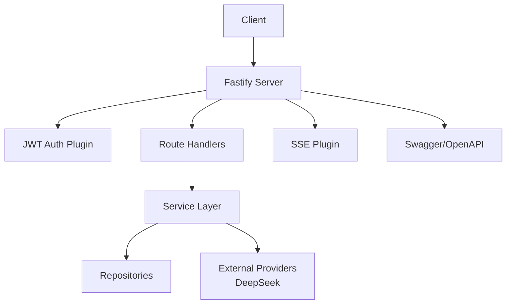
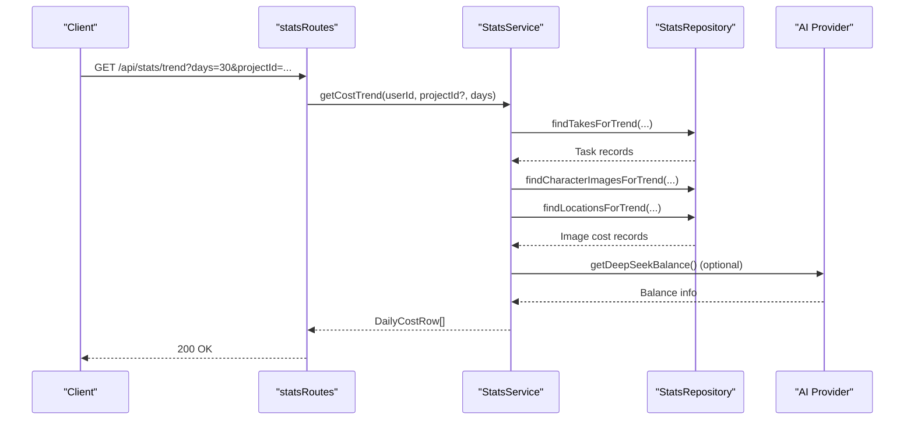
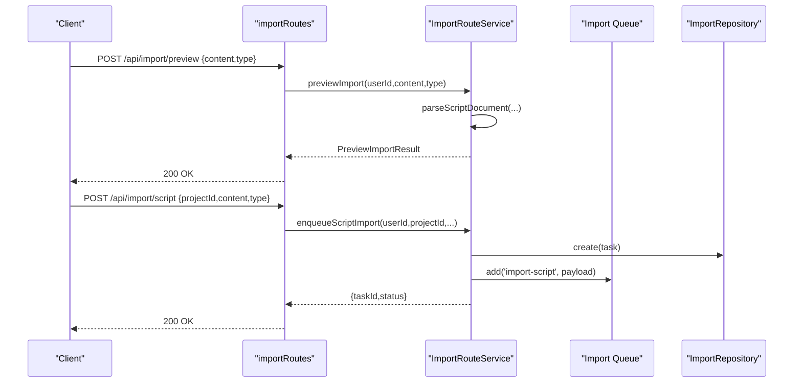
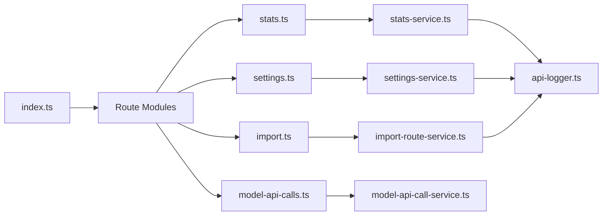

# System Integration API

<cite>
**Referenced Files in This Document**
- [index.ts](file://packages/backend/src/index.ts)
- [model-api-calls.ts](file://packages/backend/src/routes/model-api-calls.ts)
- [stats.ts](file://packages/backend/src/routes/stats.ts)
- [settings.ts](file://packages/backend/src/routes/settings.ts)
- [import.ts](file://packages/backend/src/routes/import.ts)
- [stats-service.ts](file://packages/backend/src/services/stats-service.ts)
- [settings-service.ts](file://packages/backend/src/services/settings-service.ts)
- [import-route-service.ts](file://packages/backend/src/services/import-route-service.ts)
- [model-api-call-service.ts](file://packages/backend/src/services/ai/model-api-call-service.ts)
- [api-logger.ts](file://packages/backend/src/services/ai/api-logger.ts)
</cite>

## Table of Contents

1. [Introduction](#introduction)
2. [Project Structure](#project-structure)
3. [Core Components](#core-components)
4. [Architecture Overview](#architecture-overview)
5. [Detailed Component Analysis](#detailed-component-analysis)
6. [Dependency Analysis](#dependency-analysis)
7. [Performance Considerations](#performance-considerations)
8. [Troubleshooting Guide](#troubleshooting-guide)
9. [Conclusion](#conclusion)
10. [Appendices](#appendices)

## Introduction

This document provides comprehensive API documentation for system integration endpoints focused on model API calls, analytics and statistics, settings and configuration, and import/export operations. It covers monitoring metrics, usage statistics, administrative functions, rate limiting considerations, data export formats, and integration with external AI providers. The APIs are built with Fastify and organized under a consistent prefix pattern for easy integration.

## Project Structure

```mermaid
graph TB
Client["Client"] --> Health["GET /health"]
Client --> Docs["GET /docs (Swagger UI)"]
Client --> SSE["GET /api/sse (SSE)"]
subgraph "Authenticated Routes"
Auth["/api/auth/*"]
Projects["/api/projects/*"]
Episodes["/api/episodes/*"]
Scenes["/api/scenes/*"]
Shots["/api/shots/*"]
Tasks["/api/tasks/*"]
Compositions["/api/compositions/*"]
Stats["/api/stats/*"]
Import["/api/import/*"]
Settings["/api/settings/*"]
Pipeline["/api/pipeline/*"]
Images["/api/image-generation/*"]
ModelCalls["/api/model-api-calls/*"]
Memory["/api/memory/*"]
end
Client --> Auth
Client --> Projects
Client --> Episodes
Client --> Scenes
Client --> Shots
Client --> Tasks
Client --> Compositions
Client --> Stats
Client --> Import
Client --> Settings
Client --> Pipeline
Client --> Images
Client --> ModelCalls
Client --> Memory
```

The backend exposes REST endpoints via Fastify with route registration centralized in the main entry point. Routes are grouped by domain (authentication, projects, stats, import, settings, etc.) and mounted under `/api/<resource>`.

**Diagram sources**

- [index.ts:88-115](file://packages/backend/src/index.ts#L88-L115)

**Section sources**

- [index.ts:88-115](file://packages/backend/src/index.ts#L88-L115)

## Core Components

- Authentication middleware ensures protected endpoints require a valid JWT bearer token.
- Route handlers enforce permissions for project-scoped operations.
- Services encapsulate business logic and integrate with repositories and external providers.
- Analytics and statistics are computed from task records and AI provider balances.
- Import/export operations leverage asynchronous queues and preview capabilities.

**Section sources**

- [index.ts:44-86](file://packages/backend/src/index.ts#L44-L86)
- [import.ts:4-6](file://packages/backend/src/routes/import.ts#L4-L6)

## Architecture Overview

The system follows a layered architecture:

- HTTP Layer: Fastify routes define endpoints and apply authentication.
- Service Layer: Business logic orchestrates data retrieval, computation, and external integrations.
- Repository Layer: Data access abstractions (not detailed here) support queries and writes.
- External Integrations: AI provider APIs (e.g., DeepSeek) for balance and analytics.

**Diagram sources**

- [index.ts:35-75](file://packages/backend/src/index.ts#L35-L75)
- [stats-service.ts:102-103](file://packages/backend/src/services/stats-service.ts#L102-L103)
- [settings-service.ts:5-6](file://packages/backend/src/services/settings-service.ts#L5-L6)

## Detailed Component Analysis

### System Health Check

- Endpoint: GET /health
- Purpose: Basic liveness probe for container orchestration and load balancers.
- Response: Plain JSON indicating service status.

**Section sources**

- [index.ts:117-118](file://packages/backend/src/index.ts#L117-L118)

### OpenAPI Documentation

- Endpoint: GET /docs
- Purpose: Swagger UI for interactive API documentation.
- Notes: OpenAPI metadata is configured at startup.

**Section sources**

- [index.ts:64-75](file://packages/backend/src/index.ts#L64-L75)

### Server-Sent Events (SSE)

- Endpoint: GET /api/sse
- Purpose: Real-time event streaming for long-lived connections.
- Behavior: Subscribes clients to the global SSE channel.

**Section sources**

- [index.ts:80-83](file://packages/backend/src/index.ts#L80-L83)

### Statistics and Analytics

#### Cost Statistics by Project

- Endpoint: GET /api/stats/projects/:projectId
- Authentication: Required
- Query: None
- Response: ProjectCostStats object containing totals and breakdowns by model and task status.

**Section sources**

- [stats.ts:10-25](file://packages/backend/src/routes/stats.ts#L10-L25)
- [stats-service.ts:102-111](file://packages/backend/src/services/stats-service.ts#L102-L111)

#### User Cost Statistics

- Endpoint: GET /api/stats/me
- Authentication: Required
- Query: None
- Response: UserCostStats aggregating across all user projects.

**Section sources**

- [stats.ts:27-35](file://packages/backend/src/routes/stats.ts#L27-L35)
- [stats-service.ts:113-149](file://packages/backend/src/services/stats-service.ts#L113-L149)

#### Daily Cost Trend

- Endpoint: GET /api/stats/trend
- Authentication: Required
- Query Parameters:
  - projectId: optional project identifier
  - days: integer, default 30
- Response: Array of DailyCostRow entries aggregated by date.

**Section sources**

- [stats.ts:37-47](file://packages/backend/src/routes/stats.ts#L37-L47)
- [stats-service.ts:152-240](file://packages/backend/src/services/stats-service.ts#L152-L240)

#### AI Provider Account Balance

- Endpoint: GET /api/stats/ai-balance
- Authentication: Required
- Response: Balance information from the AI provider or error payload.

**Section sources**

- [stats.ts:49-56](file://packages/backend/src/routes/stats.ts#L49-L56)
- [stats-service.ts:242-250](file://packages/backend/src/services/stats-service.ts#L242-L250)

#### Monitoring Metrics Schema

- ProjectCostStats
  - projectId: string
  - projectName: string
  - totalCost: number
  - aiCost: number
  - videoCost: number
  - imageCost: number
  - totalTasks: number
  - completedTasks: number
  - failedTasks: number
  - tasksByModel: object with model keys and counts/costs
  - recentTasks: array of task summaries
- UserCostStats
  - userId: string
  - totalCost: number
  - aiCost: number
  - videoCost: number
  - imageCost: number
  - totalProjects: number
  - totalTasks: number
  - projects: array of ProjectCostStats
- DailyCostRow
  - date: string (ISO date)
  - wanCost: number
  - seedanceCost: number
  - imageCost: number
  - total: number

**Section sources**

- [stats-service.ts:4-37](file://packages/backend/src/services/stats-service.ts#L4-L37)
- [stats-service.ts:94-100](file://packages/backend/src/services/stats-service.ts#L94-L100)

#### Analytics Data Collection Flow

**Diagram sources**

- [stats.ts:37-47](file://packages/backend/src/routes/stats.ts#L37-L47)
- [stats-service.ts:152-240](file://packages/backend/src/services/stats-service.ts#L152-L240)

**Section sources**

- [stats-service.ts:102-250](file://packages/backend/src/services/stats-service.ts#L102-L250)

### Settings and Configuration Management

#### Get User Settings

- Endpoint: GET /api/settings/me
- Authentication: Required
- Response: Settings payload including user profile, API key presence, optional balance, and external provider URLs.

**Section sources**

- [settings.ts:5-13](file://packages/backend/src/routes/settings.ts#L5-L13)
- [settings-service.ts:8-48](file://packages/backend/src/services/settings-service.ts#L8-L48)

#### Update User Settings

- Endpoint: PUT /api/settings/me
- Authentication: Required
- Request Body: Partial update supporting name, apiKey, and apiKeys (deepseekApiUrl, atlasApiKey, atlasApiUrl, arkApiKey, arkApiUrl).
- Response: Updated user profile and API key presence flag.

**Section sources**

- [settings.ts:15-41](file://packages/backend/src/routes/settings.ts#L15-L41)
- [settings-service.ts:51-91](file://packages/backend/src/services/settings-service.ts#L51-L91)

#### Verify API Key

- Endpoint: POST /api/settings/verify-api-key
- Authentication: Required
- Request Body: apiKey string
- Response: { valid: true, balance } or error with status 400.

**Section sources**

- [settings.ts:43-66](file://packages/backend/src/routes/settings.ts#L43-L66)
- [settings-service.ts:93-113](file://packages/backend/src/services/settings-service.ts#L93-L113)

#### Configuration Schema

- Settings Payload
  - user: { id, email, name, createdAt }
  - hasApiKey: boolean
  - balance: object or null
  - balanceError: string or null
  - apiKeys: { deepseekApiUrl, atlasApiKey, atlasApiUrl, arkApiKey, arkApiUrl }

**Section sources**

- [settings-service.ts:31-47](file://packages/backend/src/services/settings-service.ts#L31-L47)

### Import and Export Operations

#### Preview Import

- Endpoint: POST /api/import/preview
- Authentication: Required
- Request Body:
  - content: string (script content)
  - type: "markdown" | "json"
- Response: PreviewImportResult with preview metadata and estimated AI cost.

**Section sources**

- [import.ts:7-35](file://packages/backend/src/routes/import.ts#L7-L35)
- [import-route-service.ts:26-69](file://packages/backend/src/services/import-route-service.ts#L26-L69)

#### Import Script into Existing Project

- Endpoint: POST /api/import/script
- Authentication: Required
- Permissions: Must own the target project
- Request Body:
  - projectId: string
  - content: string
  - type: "markdown" | "json"
- Response: { success: true, taskId, status }

**Section sources**

- [import.ts:36-71](file://packages/backend/src/routes/import.ts#L36-L71)
- [import.ts:54-56](file://packages/backend/src/routes/import.ts#L54-L56)
- [import-route-service.ts:71-94](file://packages/backend/src/services/import-route-service.ts#L71-L94)

#### One-Click Import (New Project)

- Endpoint: POST /api/import/project
- Authentication: Required
- Request Body:
  - content: string
  - type: "markdown" | "json"
- Response: { success: true, taskId, status }

**Section sources**

- [import.ts:73-98](file://packages/backend/src/routes/import.ts#L73-L98)
- [import-route-service.ts:96-116](file://packages/backend/src/services/import-route-service.ts#L96-L116)

#### Import Task Status

- Endpoint: GET /api/import/task/:id
- Authentication: Required
- Permissions: Task must belong to the requesting user
- Response: Full task record or 404 if not found.

**Section sources**

- [import.ts:100-122](file://packages/backend/src/routes/import.ts#L100-L122)
- [import-route-service.ts:118-120](file://packages/backend/src/services/import-route-service.ts#L118-L120)

#### List Import Tasks

- Endpoint: GET /api/import/tasks
- Authentication: Required
- Query Parameters:
  - limit: number, default 50
  - offset: number, default 0
- Response: { tasks: [...], total: number }

**Section sources**

- [import.ts:124-137](file://packages/backend/src/routes/import.ts#L124-L137)
- [import-route-service.ts:122-128](file://packages/backend/src/services/import-route-service.ts#L122-L128)

#### Import Flow

**Diagram sources**

- [import.ts:7-35](file://packages/backend/src/routes/import.ts#L7-L35)
- [import.ts:36-71](file://packages/backend/src/routes/import.ts#L36-L71)
- [import-route-service.ts:26-69](file://packages/backend/src/services/import-route-service.ts#L26-L69)
- [import-route-service.ts:71-94](file://packages/backend/src/services/import-route-service.ts#L71-L94)

### Model API Calls and Analytics

#### List Model API Calls

- Endpoint: GET /api/model-api-calls
- Authentication: Required
- Query Parameters:
  - limit: number, min 1, max 200, default 50
  - offset: number, default 0
  - model: string filter
  - op: string filter
  - projectId: string filter
  - status: string filter
- Response: { items: [...], limit, offset }
- Items include parsed request metadata derived from raw parameters.

**Section sources**

- [model-api-calls.ts:4-19](file://packages/backend/src/routes/model-api-calls.ts#L4-L19)
- [model-api-call-service.ts:3-27](file://packages/backend/src/services/ai/model-api-call-service.ts#L3-L27)
- [model-api-call-service.ts:29-37](file://packages/backend/src/services/ai/model-api-call-service.ts#L29-L37)

#### Analytics Data Collection Schema

- Model API Call Item
  - Fields from underlying records plus:
  - meta: parsed request parameters (structure depends on provider-specific parsing)

**Section sources**

- [model-api-call-service.ts:32-36](file://packages/backend/src/services/ai/model-api-call-service.ts#L32-L36)
- [api-logger.ts](file://packages/backend/src/services/ai/api-logger.ts)

### Rate Limiting

- No explicit rate-limiting middleware is registered in the server initialization.
- Recommendations:
  - Apply a rate-limit plugin per route groups or globally.
  - Differentiate endpoints by sensitivity (e.g., lower limits for settings and import).
  - Enforce per-user quotas for AI provider operations.

[No sources needed since this section provides general guidance]

### Data Export Formats

- Import Preview: JSON-like preview structure with project metadata, character lists, and episode/scene summaries.
- Import Tasks: Standard task records with status and optional result payloads.
- Statistics: Aggregated numeric metrics suitable for dashboards and charts.

**Section sources**

- [import-route-service.ts:43-69](file://packages/backend/src/services/import-route-service.ts#L43-L69)
- [import-route-service.ts:118-128](file://packages/backend/src/services/import-route-service.ts#L118-L128)
- [stats-service.ts:102-240](file://packages/backend/src/services/stats-service.ts#L102-L240)

### Integration with External Systems

- AI Provider Balance: Retrieved via dedicated service method integrating with the provider SDK.
- Authentication: JWT bearer tokens required for protected endpoints.
- CORS: Configurable origin and credentials enabled.

**Section sources**

- [stats-service.ts:242-250](file://packages/backend/src/services/stats-service.ts#L242-L250)
- [index.ts:48-52](file://packages/backend/src/index.ts#L48-L52)
- [index.ts:54-56](file://packages/backend/src/index.ts#L54-L56)

## Dependency Analysis

**Diagram sources**

- [index.ts:13-31](file://packages/backend/src/index.ts#L13-L31)
- [stats.ts:1-6](file://packages/backend/src/routes/stats.ts#L1-L6)
- [settings.ts:1-2](file://packages/backend/src/routes/settings.ts#L1-L2)
- [import.ts:1-4](file://packages/backend/src/routes/import.ts#L1-L4)
- [model-api-calls.ts:1-2](file://packages/backend/src/routes/model-api-calls.ts#L1-L2)
- [stats-service.ts:1-2](file://packages/backend/src/services/stats-service.ts#L1-L2)
- [settings-service.ts:1-3](file://packages/backend/src/services/settings-service.ts#L1-L3)
- [import-route-service.ts:1-3](file://packages/backend/src/services/import-route-service.ts#L1-L3)
- [model-api-call-service.ts:1](file://packages/backend/src/services/ai/model-api-call-service.ts#L1)

**Section sources**

- [index.ts:13-31](file://packages/backend/src/index.ts#L13-L31)

## Performance Considerations

- Asynchronous Imports: Import operations enqueue jobs to background queues; avoid long request timeouts for these endpoints.
- Pagination: Statistics and model API calls support configurable limit/offset to control payload sizes.
- Trend Aggregation: Daily cost trends compute aggregates over filtered task sets; consider narrowing filters (e.g., projectId) to reduce scan volume.
- SSE: Long-lived connections should be monitored for resource usage; configure appropriate connection timeouts.

**Section sources**

- [import.ts:58-63](file://packages/backend/src/routes/import.ts#L58-L63)
- [model-api-call-service.ts:12-14](file://packages/backend/src/services/ai/model-api-call-service.ts#L12-L14)
- [index.ts:37-42](file://packages/backend/src/index.ts#L37-L42)

## Troubleshooting Guide

- Authentication Failures
  - Symptom: 401 Unauthorized on protected endpoints.
  - Cause: Missing or invalid JWT.
  - Resolution: Ensure Authorization header with a valid bearer token.

- Permission Denied on Import
  - Symptom: 403 Forbidden when importing into a project.
  - Cause: Caller does not own the target project.
  - Resolution: Verify project ownership or use a shared project mechanism if available.

- Invalid API Key Verification
  - Symptom: 400 Bad Request with error details.
  - Cause: Empty key or provider-side validation failure.
  - Resolution: Provide a valid key and retry; check provider credentials.

- Import Task Not Found
  - Symptom: 404 Not Found when checking task status.
  - Cause: Task ID does not exist or belongs to another user.
  - Resolution: Confirm task ID and user context.

- Health Probe Issues
  - Symptom: Load balancer reports unhealthy.
  - Cause: Application crash or misconfiguration.
  - Resolution: Check server logs and ensure the health endpoint is reachable.

**Section sources**

- [import.ts:54-56](file://packages/backend/src/routes/import.ts#L54-L56)
- [import.ts:112-114](file://packages/backend/src/routes/import.ts#L112-L114)
- [settings.ts:52-59](file://packages/backend/src/routes/settings.ts#L52-L59)
- [index.ts:117-118](file://packages/backend/src/index.ts#L117-L118)

## Conclusion

The System Integration API provides robust endpoints for monitoring costs, managing configurations, and orchestrating import/export workflows. With JWT-based authentication, structured analytics, and asynchronous job processing, it supports scalable system integration. Administrators should consider adding rate limiting and monitoring for production deployments.

## Appendices

### Endpoint Reference Summary

- GET /health: Liveness check
- GET /docs: OpenAPI documentation
- GET /api/sse: Server-Sent Events
- GET /api/stats/projects/:projectId: Project cost stats
- GET /api/stats/me: User cost stats
- GET /api/stats/trend: Daily cost trend
- GET /api/stats/ai-balance: AI provider balance
- GET /api/settings/me: User settings
- PUT /api/settings/me: Update settings
- POST /api/settings/verify-api-key: Verify API key
- POST /api/import/preview: Preview import
- POST /api/import/script: Import into existing project
- POST /api/import/project: One-click import
- GET /api/import/task/:id: Import task status
- GET /api/import/tasks: List import tasks
- GET /api/model-api-calls: List model API calls

**Section sources**

- [index.ts:117-118](file://packages/backend/src/index.ts#L117-L118)
- [index.ts:73-75](file://packages/backend/src/index.ts#L73-L75)
- [index.ts:80-83](file://packages/backend/src/index.ts#L80-L83)
- [stats.ts:10-56](file://packages/backend/src/routes/stats.ts#L10-L56)
- [settings.ts:5-66](file://packages/backend/src/routes/settings.ts#L5-L66)
- [import.ts:7-137](file://packages/backend/src/routes/import.ts#L7-L137)
- [model-api-calls.ts:4-19](file://packages/backend/src/routes/model-api-calls.ts#L4-L19)
