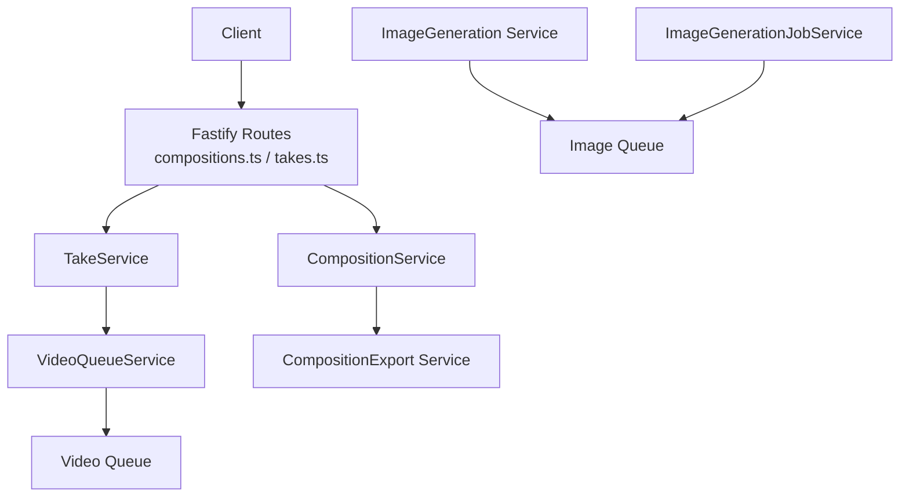
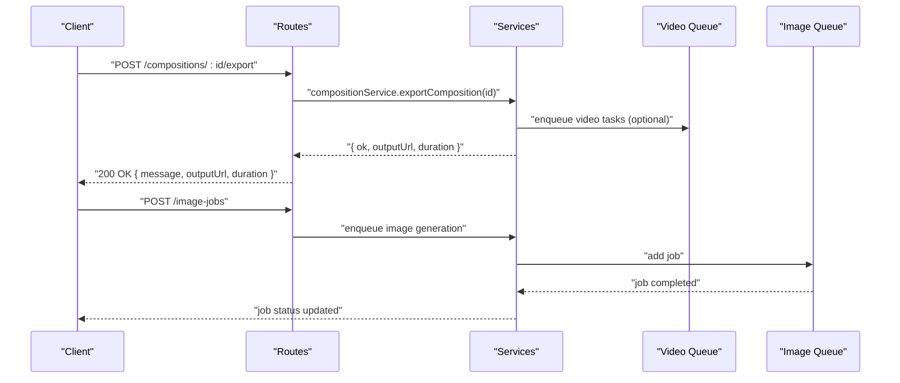
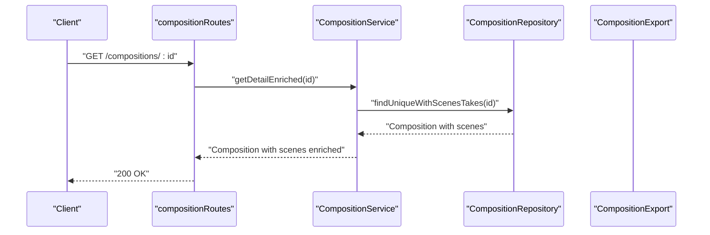
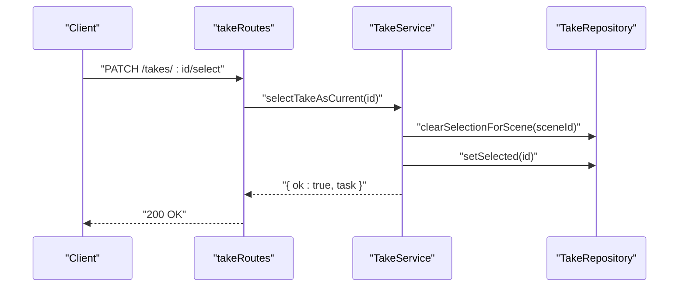
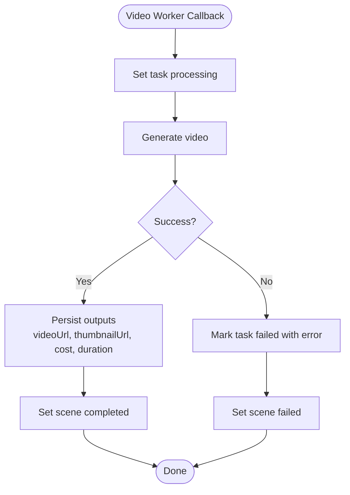
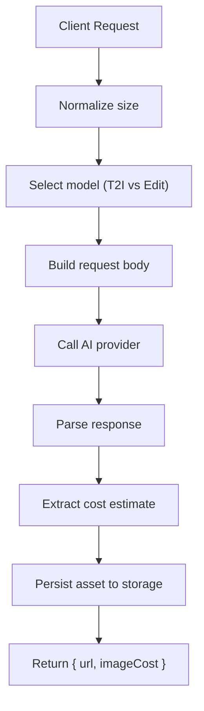
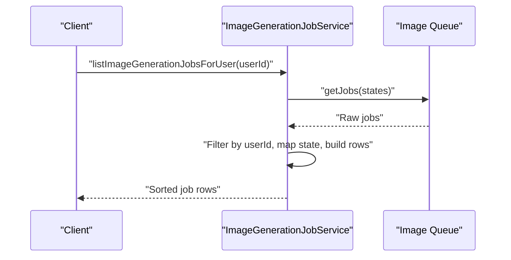
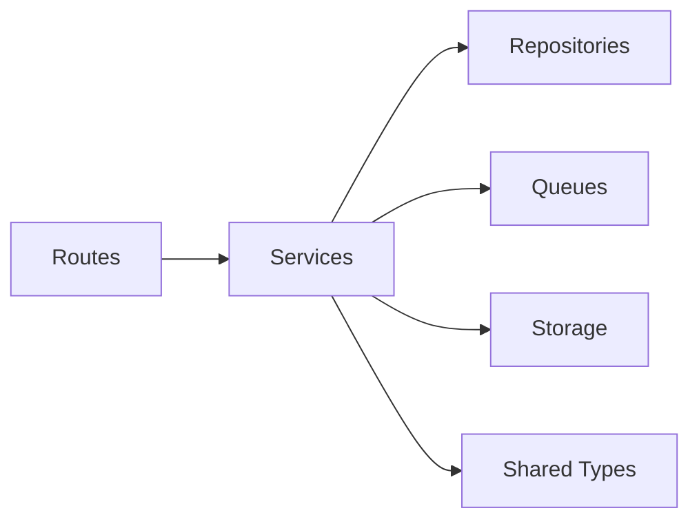

# Video Generation API

<cite>
**Referenced Files in This Document**
- [index.ts](file://packages/backend/src/index.ts)
- [compositions.ts](file://packages/backend/src/routes/compositions.ts)
- [composition-service.ts](file://packages/backend/src/services/composition-service.ts)
- [composition-export.ts](file://packages/backend/src/services/composition-export.ts)
- [take-service.ts](file://packages/backend/src/services/take-service.ts)
- [takes.ts](file://packages/backend/src/routes/takes.ts)
- [video-queue-service.ts](file://packages/backend/src/services/video-queue-service.ts)
- [image-generation.ts](file://packages/backend/src/services/ai/image-generation.ts)
- [image-generation-job-service.ts](file://packages/backend/src/services/image-generation-job-service.ts)
- [image.ts](file://packages/backend/src/queues/image.ts)
- [video.ts](file://packages/backend/src/queues/video.ts)
- [index.ts](file://packages/shared/src/types/index.ts)
</cite>

## Table of Contents

1. [Introduction](#introduction)
2. [Project Structure](#project-structure)
3. [Core Components](#core-components)
4. [Architecture Overview](#architecture-overview)
5. [Detailed Component Analysis](#detailed-component-analysis)
6. [Dependency Analysis](#dependency-analysis)
7. [Performance Considerations](#performance-considerations)
8. [Troubleshooting Guide](#troubleshooting-guide)
9. [Conclusion](#conclusion)
10. [Appendices](#appendices)

## Introduction

This document provides comprehensive API documentation for video generation and composition endpoints. It covers shot creation, take generation, composition assembly, and image generation job management. It specifies request/response schemas for video processing parameters, quality settings, and generation workflows. It also documents AI model integration points, batch processing capabilities, progress tracking mechanisms, and cost calculation for AI service usage. Examples for video editing operations, timeline assembly, and export formats are included.

## Project Structure

The backend exposes REST endpoints via Fastify and orchestrates workflows using dedicated services and queues. Key areas:

- Routes: Composition and Take selection endpoints
- Services: Composition orchestration, Take selection, Video queue coordination, Image generation
- Queues: Video and Image job queues
- Shared types: Request/response schemas and enums used across the system

**Diagram sources**

- [compositions.ts:1-147](file://packages/backend/src/routes/compositions.ts#L1-L147)
- [composition-service.ts:1-75](file://packages/backend/src/services/composition-service.ts#L1-L75)
- [composition-export.ts](file://packages/backend/src/services/composition-export.ts)
- [take-service.ts:1-20](file://packages/backend/src/services/take-service.ts#L1-L20)
- [video-queue-service.ts:1-61](file://packages/backend/src/services/video-queue-service.ts#L1-L61)
- [image-generation.ts:1-304](file://packages/backend/src/services/ai/image-generation.ts#L1-L304)
- [image-generation-job-service.ts:1-122](file://packages/backend/src/services/image-generation-job-service.ts#L1-L122)
- [image.ts](file://packages/backend/src/queues/image.ts)
- [video.ts](file://packages/backend/src/queues/video.ts)

**Section sources**

- [compositions.ts:1-147](file://packages/backend/src/routes/compositions.ts#L1-L147)
- [composition-service.ts:1-75](file://packages/backend/src/services/composition-service.ts#L1-L75)
- [take-service.ts:1-20](file://packages/backend/src/services/take-service.ts#L1-L20)
- [video-queue-service.ts:1-61](file://packages/backend/src/services/video-queue-service.ts#L1-L61)
- [image-generation.ts:1-304](file://packages/backend/src/services/ai/image-generation.ts#L1-L304)
- [image-generation-job-service.ts:1-122](file://packages/backend/src/services/image-generation-job-service.ts#L1-L122)
- [index.ts:197-325](file://packages/shared/src/types/index.ts#L197-L325)

## Core Components

- Composition endpoints manage creation, retrieval, updates, deletion, timeline assembly, and export of edited videos.
- Take selection endpoint allows choosing a preferred take per scene.
- Video queue service coordinates task and scene state transitions and persists outputs.
- Image generation service integrates with an AI provider, normalizes sizes, extracts costs, and persists assets.
- Image generation job service enumerates jobs and maps queue states to job statuses.

**Section sources**

- [compositions.ts:1-147](file://packages/backend/src/routes/compositions.ts#L1-L147)
- [composition-service.ts:1-75](file://packages/backend/src/services/composition-service.ts#L1-L75)
- [takes.ts:1-27](file://packages/backend/src/routes/takes.ts#L1-L27)
- [take-service.ts:1-20](file://packages/backend/src/services/take-service.ts#L1-L20)
- [video-queue-service.ts:1-61](file://packages/backend/src/services/video-queue-service.ts#L1-L61)
- [image-generation.ts:1-304](file://packages/backend/src/services/ai/image-generation.ts#L1-L304)
- [image-generation-job-service.ts:1-122](file://packages/backend/src/services/image-generation-job-service.ts#L1-L122)

## Architecture Overview

The system separates concerns across routes, services, and queues:

- Routes enforce authentication and ownership checks, then delegate to services.
- Services encapsulate domain logic and coordinate with repositories and queues.
- Queues handle asynchronous work (video and image generation) with explicit state transitions.
- Shared types define request/response schemas and enums used across the stack.

**Diagram sources**

- [compositions.ts:117-145](file://packages/backend/src/routes/compositions.ts#L117-L145)
- [composition-service.ts:69-71](file://packages/backend/src/services/composition-service.ts#L69-L71)
- [composition-export.ts](file://packages/backend/src/services/composition-export.ts)
- [image-generation-job-service.ts:67-121](file://packages/backend/src/services/image-generation-job-service.ts#L67-L121)
- [image.ts](file://packages/backend/src/queues/image.ts)

## Detailed Component Analysis

### Composition Endpoints

Endpoints support listing compositions by project, retrieving enriched details, creating/updating/deleting compositions, assembling timelines, and exporting edited videos.

- List compositions by project
  - Method: GET
  - Path: /compositions
  - Query: projectId (required)
  - Authentication: Required
  - Ownership: Project ownership verified
  - Response: Array of compositions

- Get composition detail
  - Method: GET
  - Path: /compositions/:id
  - Params: id (required)
  - Authentication: Required
  - Ownership: Composition ownership verified
  - Response: Composition with enriched scenes (videoUrl/thumbnailUrl from selected take)

- Create composition
  - Method: POST
  - Path: /compositions
  - Body: { projectId, episodeId, title }
  - Authentication: Required
  - Ownership: Project ownership verified
  - Response: Created composition (201)

- Update composition title
  - Method: PUT
  - Path: /compositions/:id
  - Params: id (required)
  - Body: { title?: string }
  - Authentication: Required
  - Ownership: Composition ownership verified
  - Response: Updated composition

- Delete composition
  - Method: DELETE
  - Path: /compositions/:id
  - Params: id (required)
  - Authentication: Required
  - Ownership: Composition ownership verified
  - Response: 204 No Content or 404 Not Found

- Update timeline
  - Method: PUT
  - Path: /compositions/:id/timeline
  - Params: id (required)
  - Body: { clips: [{ sceneId, takeId, order }] }
  - Authentication: Required
  - Ownership: Composition ownership verified
  - Response: Composition with scenes ordered

- Export composition
  - Method: POST
  - Path: /compositions/:id/export
  - Params: id (required)
  - Authentication: Required
  - Ownership: Composition ownership verified
  - Response: { message, outputUrl, duration } or error with httpStatus

**Diagram sources**

- [compositions.ts:22-40](file://packages/backend/src/routes/compositions.ts#L22-L40)
- [composition-service.ts:14-30](file://packages/backend/src/services/composition-service.ts#L14-L30)

**Section sources**

- [compositions.ts:1-147](file://packages/backend/src/routes/compositions.ts#L1-L147)
- [composition-service.ts:1-75](file://packages/backend/src/services/composition-service.ts#L1-L75)

### Take Selection Endpoint

Allows selecting a preferred take for a scene, clearing previous selections.

- Select current take
  - Method: PATCH
  - Path: /takes/:id/select
  - Params: id (required)
  - Authentication: Required
  - Ownership: Task ownership verified
  - Response: { ok: true, task } or 404 Not Found

**Diagram sources**

- [takes.ts:7-25](file://packages/backend/src/routes/takes.ts#L7-L25)
- [take-service.ts:7-16](file://packages/backend/src/services/take-service.ts#L7-L16)

**Section sources**

- [takes.ts:1-27](file://packages/backend/src/routes/takes.ts#L1-L27)
- [take-service.ts:1-20](file://packages/backend/src/services/take-service.ts#L1-L20)

### Video Queue Coordination

Coordinates task and scene state transitions and persists outputs.

- Set task processing
- Set external task ID
- Mark task completed with videoUrl, thumbnailUrl, cost, duration
- Mark task failed with error message
- Set scene generating/completed/failed

**Diagram sources**

- [video-queue-service.ts:14-57](file://packages/backend/src/services/video-queue-service.ts#L14-L57)

**Section sources**

- [video-queue-service.ts:1-61](file://packages/backend/src/services/video-queue-service.ts#L1-L61)

### Image Generation Integration

Integrates with an AI provider for text-to-image and image editing, with size normalization, optional watermark, and cost extraction.

- Text-to-image
  - Options: size, n, model, watermark
  - Returns: { url, imageCost }
  - Size normalization ensures minimum pixel count

- Image edit
  - Options: model, size, strength, watermark
  - Strength mapped to guidance scale for compatible models
  - Supports base64 or URL reference images

- Cost estimation
  - Extracts billing tokens from provider response
  - Converts to estimated RMB using configurable rate

- Persistence
  - Downloads remote URLs and uploads to asset storage
  - Returns persisted asset URLs

**Diagram sources**

- [image-generation.ts:238-303](file://packages/backend/src/services/ai/image-generation.ts#L238-L303)

**Section sources**

- [image-generation.ts:1-304](file://packages/backend/src/services/ai/image-generation.ts#L1-L304)

### Image Generation Job Management

Enumerates image generation jobs for a user, mapping queue states to job statuses and attaching bindings for UI association.

- Job listing
  - Retrieves jobs from queue across states
  - Filters by userId
  - Maps queue state to internal status
  - Builds rows with binding metadata

- Binding types
  - Character image regeneration/regenerate
  - Location establishing
  - Character new image creation (base/derived)

**Diagram sources**

- [image-generation-job-service.ts:67-121](file://packages/backend/src/services/image-generation-job-service.ts#L67-L121)

**Section sources**

- [image-generation-job-service.ts:1-122](file://packages/backend/src/services/image-generation-job-service.ts#L1-L122)
- [image.ts](file://packages/backend/src/queues/image.ts)

### Data Models and Schemas

Core request/response schemas and enums used across endpoints and services.

- Video generation
  - GenerateVideoRequest: { model, referenceImage?, duration? }
  - BatchGenerateRequest: { sceneIds[], model, referenceImage? }
  - VideoJobData: { sceneId, taskId, prompt, model, referenceImage?, imageUrls?, duration?, aspectRatio? }

- Composition
  - CreateCompositionRequest: { projectId, episodeId, title }
  - UpdateTimelineRequest: { clips: Omit<CompositionTimelineClip, 'id' | 'compositionId'>[] }
  - CompositionStatus: draft | processing | completed | failed

- Enums
  - VideoModel: wan2.6 | seedance2.0
  - TaskStatus: queued | processing | completed | failed
  - SceneStatus: pending | generating | processing | completed | failed

- Export response
  - Export result: { ok: boolean, outputUrl?: string, duration?: number, error?: string, httpStatus?: number }

**Section sources**

- [index.ts:290-325](file://packages/shared/src/types/index.ts#L290-L325)
- [index.ts:197-220](file://packages/shared/src/types/index.ts#L197-L220)
- [index.ts:176-196](file://packages/shared/src/types/index.ts#L176-L196)

## Dependency Analysis

- Routes depend on services for business logic and on authentication plugins for ownership verification.
- Services depend on repositories and queues for persistence and asynchronous work.
- Image generation service depends on storage and environment configuration.
- Composition export depends on video queue and scene/take state.

**Diagram sources**

- [compositions.ts:1-147](file://packages/backend/src/routes/compositions.ts#L1-L147)
- [composition-service.ts:1-75](file://packages/backend/src/services/composition-service.ts#L1-L75)
- [index.ts:197-325](file://packages/shared/src/types/index.ts#L197-L325)

**Section sources**

- [compositions.ts:1-147](file://packages/backend/src/routes/compositions.ts#L1-L147)
- [composition-service.ts:1-75](file://packages/backend/src/services/composition-service.ts#L1-L75)
- [index.ts:197-325](file://packages/shared/src/types/index.ts#L197-L325)

## Performance Considerations

- Queue backpressure: Limit concurrent video/image jobs to match provider throughput and storage capacity.
- Batch processing: Prefer batch endpoints for sceneIds to reduce overhead and improve throughput.
- Cost estimation: Use estimated cost to inform budgeting and throttling policies.
- Size normalization: Ensure minimum pixel requirements to avoid provider errors and retries.

## Troubleshooting Guide

- Authentication and ownership
  - Ensure requests include a valid access token and that the user owns the project/composition/task.
- Video export failures
  - Check export result httpStatus and error message; inspect worker logs for downstream failures.
- Image generation errors
  - Verify ARK_API_KEY and ARK_API_URL; confirm size normalization and model compatibility.
- Job status mismatches
  - Confirm queue state mapping and job filtering by userId.

**Section sources**

- [compositions.ts:14-16](file://packages/backend/src/routes/compositions.ts#L14-L16)
- [compositions.ts:129-136](file://packages/backend/src/routes/compositions.ts#L129-L136)
- [image-generation.ts:96-104](file://packages/backend/src/services/ai/image-generation.ts#L96-L104)

## Conclusion

The Video Generation API provides a cohesive set of endpoints for composing edited videos from generated takes, selecting preferred takes per scene, and managing image generation jobs. It integrates with AI providers for text-to-image and editing, supports batch processing, and tracks progress and costs. The architecture leverages queues for asynchronous work and shared types for consistent schemas across the stack.

## Appendices

### API Definitions

- Compositions
  - GET /compositions?projectId={string}
    - Response: Composition[]
  - GET /compositions/{id}
    - Response: Composition with enriched scenes
  - POST /compositions
    - Request: CreateCompositionRequest
    - Response: Composition (201)
  - PUT /compositions/{id}
    - Request: { title?: string }
    - Response: Composition
  - DELETE /compositions/{id}
    - Response: 204 or 404
  - PUT /compositions/{id}/timeline
    - Request: UpdateTimelineRequest
    - Response: Composition with scenes ordered
  - POST /compositions/{id}/export
    - Response: { message, outputUrl, duration } or error with httpStatus

- Takes
  - PATCH /takes/{id}/select
    - Response: { ok: true, task } or 404

- Video Jobs
  - POST /projects/{projectId}/scenes/batch-generate
    - Request: BatchGenerateRequest
    - Response: { ok: true } or error

- Image Jobs
  - GET /image-jobs
    - Response: ImageGenerationJobRow[] sorted by createdAt desc

**Section sources**

- [compositions.ts:1-147](file://packages/backend/src/routes/compositions.ts#L1-L147)
- [takes.ts:1-27](file://packages/backend/src/routes/takes.ts#L1-L27)
- [index.ts:296-300](file://packages/shared/src/types/index.ts#L296-L300)
- [image-generation-job-service.ts:67-121](file://packages/backend/src/services/image-generation-job-service.ts#L67-L121)
