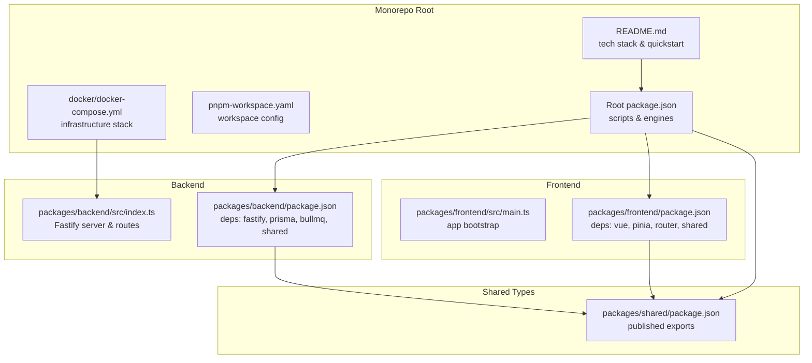
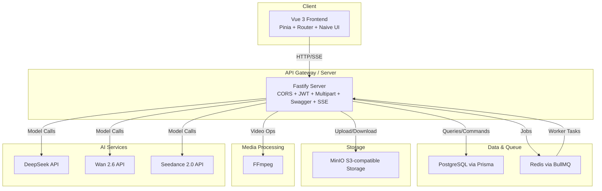
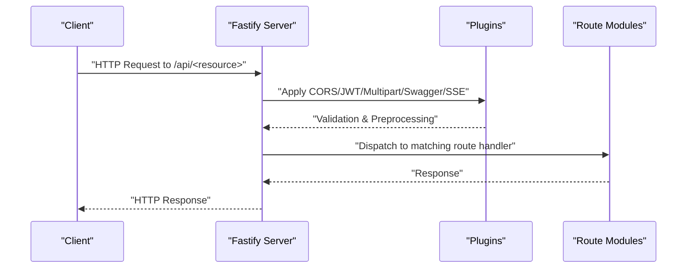
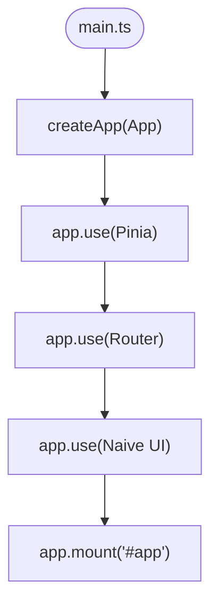
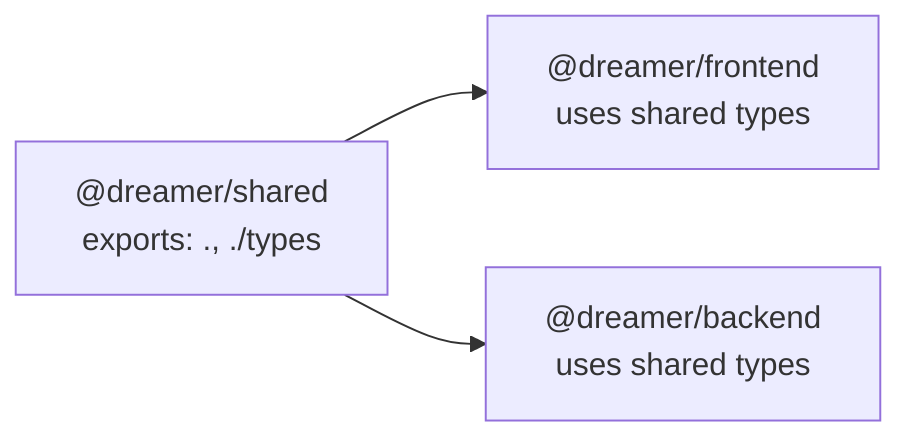
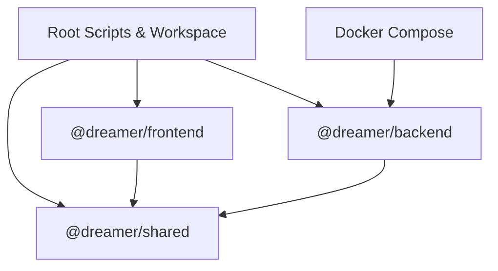
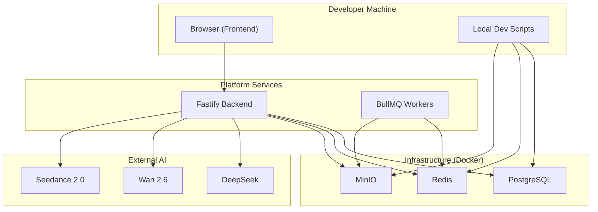

# Architecture Overview

<cite>
**Referenced Files in This Document**
- [README.md](file://README.md)
- [package.json](file://package.json)
- [pnpm-workspace.yaml](file://pnpm-workspace.yaml)
- [docker/docker-compose.yml](file://docker/docker-compose.yml)
- [packages/backend/src/index.ts](file://packages/backend/src/index.ts)
- [packages/backend/package.json](file://packages/backend/package.json)
- [packages/frontend/src/main.ts](file://packages/frontend/src/main.ts)
- [packages/frontend/package.json](file://packages/frontend/package.json)
- [packages/shared/package.json](file://packages/shared/package.json)
</cite>

## Table of Contents

1. [Introduction](#introduction)
2. [Project Structure](#project-structure)
3. [Core Components](#core-components)
4. [Architecture Overview](#architecture-overview)
5. [Detailed Component Analysis](#detailed-component-analysis)
6. [Dependency Analysis](#dependency-analysis)
7. [Performance Considerations](#performance-considerations)
8. [Security Patterns](#security-patterns)
9. [Scalability Considerations](#scalability-considerations)
10. [System Context and Deployment Topology](#system-context-and-deployment-topology)
11. [Troubleshooting Guide](#troubleshooting-guide)
12. [Conclusion](#conclusion)

## Introduction

This document describes the Dreamer platform’s system design. It is an AI-powered short-video production platform that transforms ideas into finished videos through an API-driven workflow. The platform follows a monorepo architecture with three primary packages:

- Frontend: Vue 3 Single Page Application with Pinia and Vue Router
- Backend: Fastify-based microservice-like API server with task queues and persistence
- Shared: Cross-package TypeScript types published as a local workspace package

Technology highlights include Fastify for backend speed and plugin ecosystem, Prisma and PostgreSQL for data modeling and persistence, BullMQ and Redis for asynchronous job processing, MinIO for object storage, and FFmpeg for video synthesis. AI services integrate via external APIs for script generation, low-cost video iteration, and high-quality refinement.

## Project Structure

The repository is organized as a pnpm workspace with a clear separation of concerns:

- Root scripts and configuration orchestrate development, testing, and Docker-based infrastructure
- packages/backend: Fastify server, routes, plugins, services, queues, and Prisma schema
- packages/frontend: Vue 3 SPA with routing, state management, and UI components
- packages/shared: Published TypeScript types consumed by both frontend and backend

**Diagram sources**

- [package.json:1-43](file://package.json#L1-L43)
- [pnpm-workspace.yaml:1-3](file://pnpm-workspace.yaml#L1-L3)
- [README.md:1-123](file://README.md#L1-L123)
- [docker/docker-compose.yml:1-71](file://docker/docker-compose.yml#L1-L71)
- [packages/frontend/src/main.ts:1-18](file://packages/frontend/src/main.ts#L1-L18)
- [packages/frontend/package.json:1-41](file://packages/frontend/package.json#L1-L41)
- [packages/backend/src/index.ts:1-131](file://packages/backend/src/index.ts#L1-L131)
- [packages/backend/package.json:1-51](file://packages/backend/package.json#L1-L51)
- [packages/shared/package.json:1-26](file://packages/shared/package.json#L1-L26)

**Section sources**

- [README.md:26-42](file://README.md#L26-L42)
- [package.json:6-23](file://package.json#L6-L23)
- [pnpm-workspace.yaml:1-3](file://pnpm-workspace.yaml#L1-L3)

## Core Components

- Vue 3 Frontend
  - Bootstrapped in main.ts with Pinia, Vue Router, and Naive UI
  - Consumes shared types via workspace package
  - Uses Axios for API calls and composable utilities for SSE and pipeline jobs
- Fastify Backend
  - Centralized server initialization registers CORS, JWT, multipart, Swagger, SSE, and routes under /api/\*
  - Exposes health checks and OpenAPI docs
  - Integrates with Prisma for database operations and BullMQ for async tasks
- Shared Types
  - Published as a workspace package with explicit exports for both runtime and type-only usage
  - Enables strong typing across frontend/backend boundaries

**Section sources**

- [packages/frontend/src/main.ts:1-18](file://packages/frontend/src/main.ts#L1-L18)
- [packages/frontend/package.json:14-29](file://packages/frontend/package.json#L14-L29)
- [packages/backend/src/index.ts:35-122](file://packages/backend/src/index.ts#L35-L122)
- [packages/backend/package.json:22-39](file://packages/backend/package.json#L22-L39)
- [packages/shared/package.json:8-17](file://packages/shared/package.json#L8-L17)

## Architecture Overview

The system follows a client-server pattern with a Vue 3 SPA frontend and a Fastify backend. The backend exposes a RESTful API with clear resource-based boundaries under /api/\*. Authentication is handled via JWT, and real-time updates are supported via Server-Sent Events (SSE). Asynchronous workloads are offloaded to BullMQ workers backed by Redis, while MinIO handles media assets and FFmpeg performs video composition.

**Diagram sources**

- [packages/backend/src/index.ts:35-122](file://packages/backend/src/index.ts#L35-L122)
- [packages/backend/package.json:22-39](file://packages/backend/package.json#L22-L39)
- [README.md:13-25](file://README.md#L13-L25)

## Detailed Component Analysis

### Backend Server and API Boundaries

The backend initializes Fastify, registers essential plugins, and mounts numerous route modules grouped by domain resources. Each route group is mounted under a dedicated /api/<resource> prefix, establishing clear API boundaries:

- Authentication (/api/auth)
- Projects (/api/projects)
- Episodes (/api/episodes)
- Characters (/api/characters, /api/character-images, /api/character-shots)
- Locations (/api/locations)
- Takes/Shots/Compositions (/api/takes, /api/scenes, /api/shots, /api/compositions)
- Tasks (/api/tasks)
- Stats (/api/stats)
- Import (/api/import)
- Settings (/api/settings)
- Pipeline (/api/pipeline)
- Image Generation Jobs (/api/image-generation)
- Model API Calls (/api/model-api-calls)
- Memories (/api/projects)

**Diagram sources**

- [packages/backend/src/index.ts:83-111](file://packages/backend/src/index.ts#L83-L111)

**Section sources**

- [packages/backend/src/index.ts:13-31](file://packages/backend/src/index.ts#L13-L31)
- [packages/backend/src/index.ts:83-111](file://packages/backend/src/index.ts#L83-L111)

### Frontend SPA Architecture

The frontend bootstraps Vue with Pinia for state management and Vue Router for navigation. It consumes shared types and integrates with UI components from Naive UI. API interactions are centralized and driven by composables for SSE and pipeline orchestration.

**Diagram sources**

- [packages/frontend/src/main.ts:1-18](file://packages/frontend/src/main.ts#L1-L18)

**Section sources**

- [packages/frontend/src/main.ts:1-18](file://packages/frontend/src/main.ts#L1-L18)
- [packages/frontend/package.json:14-29](file://packages/frontend/package.json#L14-L29)

### Shared Type System

The shared package publishes both runtime and type-only exports, enabling consistent type definitions across the monorepo. Both frontend and backend depend on this workspace package to maintain alignment on data contracts.

**Diagram sources**

- [packages/shared/package.json:8-17](file://packages/shared/package.json#L8-L17)
- [packages/frontend/package.json:14-16](file://packages/frontend/package.json#L14-L16)
- [packages/backend/package.json:22-24](file://packages/backend/package.json#L22-L24)

**Section sources**

- [packages/shared/package.json:8-17](file://packages/shared/package.json#L8-L17)
- [packages/frontend/package.json:14-16](file://packages/frontend/package.json#L14-L16)
- [packages/backend/package.json:22-24](file://packages/backend/package.json#L22-L24)

## Dependency Analysis

The monorepo enforces workspace-based dependencies:

- Root orchestrates scripts and workspace configuration
- Frontend depends on shared types and UI libraries
- Backend depends on shared types, Fastify plugins, Prisma, BullMQ, and AWS SDK for S3-compatible storage
- Docker Compose provisions PostgreSQL, Redis, and MinIO for local development

**Diagram sources**

- [package.json:6-23](file://package.json#L6-L23)
- [pnpm-workspace.yaml:1-3](file://pnpm-workspace.yaml#L1-L3)
- [docker/docker-compose.yml:1-71](file://docker/docker-compose.yml#L1-L71)
- [packages/frontend/package.json:14-16](file://packages/frontend/package.json#L14-L16)
- [packages/backend/package.json:22-24](file://packages/backend/package.json#L22-L24)

**Section sources**

- [package.json:6-23](file://package.json#L6-L23)
- [pnpm-workspace.yaml:1-3](file://pnpm-workspace.yaml#L1-L3)
- [docker/docker-compose.yml:1-71](file://docker/docker-compose.yml#L1-L71)
- [packages/frontend/package.json:14-16](file://packages/frontend/package.json#L14-L16)
- [packages/backend/package.json:22-24](file://packages/backend/package.json#L22-L24)

## Performance Considerations

- Asynchronous Task Offloading
  - Use BullMQ workers to handle long-running tasks (image/video generation) and keep the API responsive
- Streaming Media Uploads
  - Fastify multipart supports large file uploads; tune limits according to workload
- Caching and CDN
  - Serve static assets via CDN and cache frequently accessed metadata
- Database Scaling
  - Use read replicas and connection pooling; optimize Prisma queries and indexes
- Worker Scaling
  - Horizontally scale workers behind Redis to process queued jobs efficiently

## Security Patterns

- Authentication and Authorization
  - JWT-based authentication via Fastify JWT plugin; apply auth plugin to protected routes
- CORS and CSRF
  - Configure CORS origin per environment; enable credentials where necessary
- Secrets Management
  - Store sensitive keys (JWT secret, AI API keys) in environment variables managed by Docker Compose and CI/CD
- Data Validation
  - Use Zod for request/response validation to prevent malformed data from entering the system

## Scalability Considerations

- Horizontal Scaling
  - Run multiple backend instances behind a load balancer; ensure stateless design and shared Redis/PostgreSQL
- Queue Backpressure
  - Monitor queue lengths and scale workers dynamically; implement retry policies and dead-letter exchanges
- Storage Throughput
  - Use MinIO in distributed mode or migrate to cloud storage for global distribution
- API Gateway
  - Introduce an API gateway or reverse proxy to manage rate limiting, caching, and observability

## System Context and Deployment Topology

The platform integrates with external AI services and relies on containerized infrastructure for local development and staging. The deployment topology below reflects the current developer setup and can be extended to production environments.

**Diagram sources**

- [docker/docker-compose.yml:3-71](file://docker/docker-compose.yml#L3-L71)
- [README.md:13-25](file://README.md#L13-L25)
- [packages/backend/src/index.ts:35-122](file://packages/backend/src/index.ts#L35-L122)

**Section sources**

- [docker/docker-compose.yml:1-71](file://docker/docker-compose.yml#L1-L71)
- [README.md:13-25](file://README.md#L13-L25)

## Troubleshooting Guide

- Health Checks
  - Verify backend health endpoint availability and logs
- Database Connectivity
  - Confirm Prisma client connectivity and migrations applied
- Queue Workers
  - Ensure Redis is reachable and workers are started
- Storage Access
  - Validate MinIO credentials and bucket creation
- Environment Variables
  - Confirm presence of required keys for AI providers and JWT signing

**Section sources**

- [packages/backend/src/index.ts:112-118](file://packages/backend/src/index.ts#L112-L118)
- [docker/docker-compose.yml:52-65](file://docker/docker-compose.yml#L52-L65)

## Conclusion

The Dreamer platform employs a clean monorepo architecture with a Vue 3 frontend, a Fastify backend, and a shared type system. Its microservice-like backend design organizes API boundaries by domain resources, while asynchronous job processing and external AI integrations support scalable media production workflows. The documented context, deployment topology, and operational guidance provide a foundation for extending the platform to production-scale environments.
