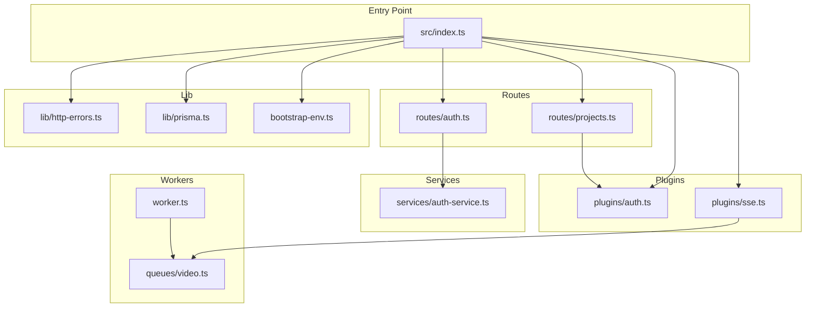
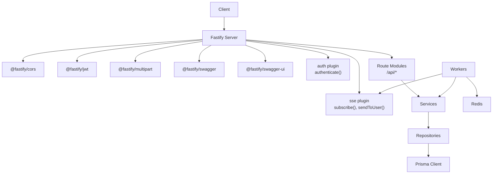
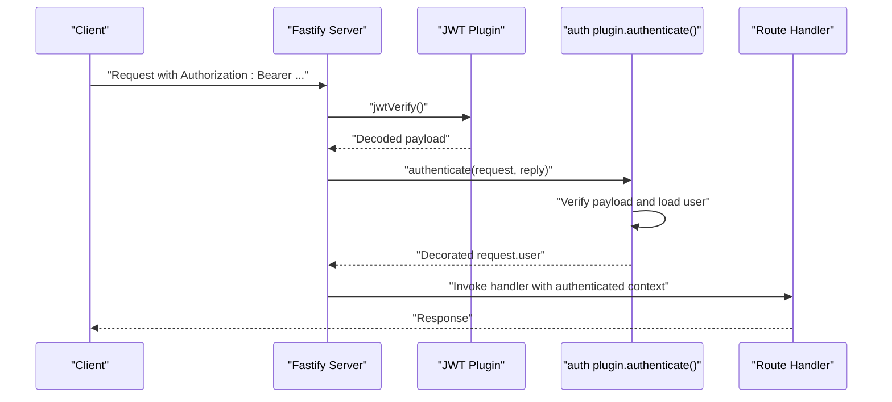
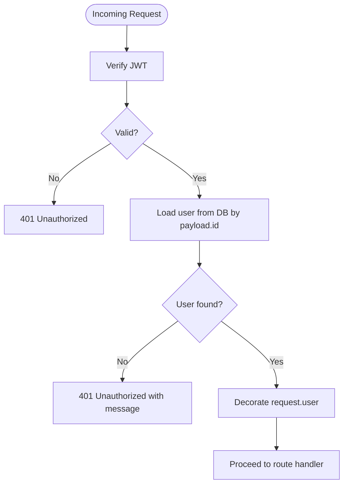
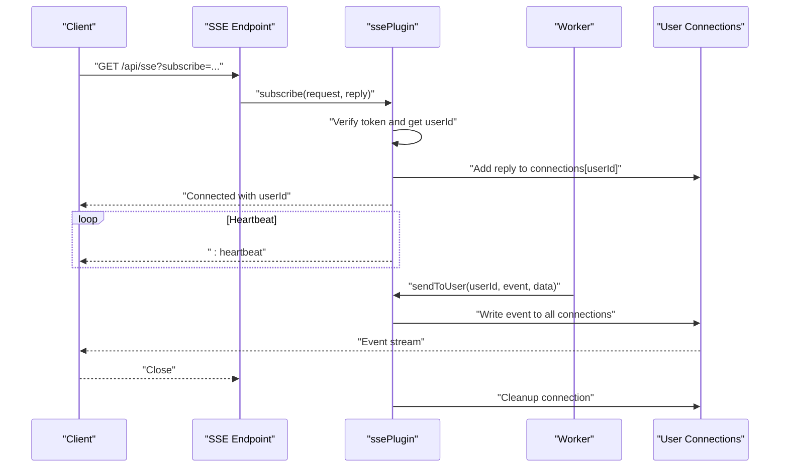
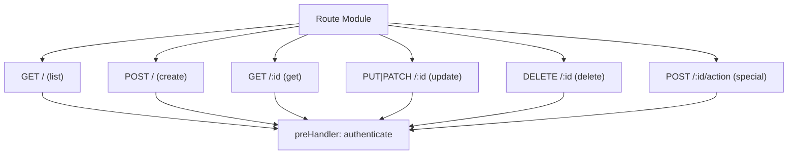
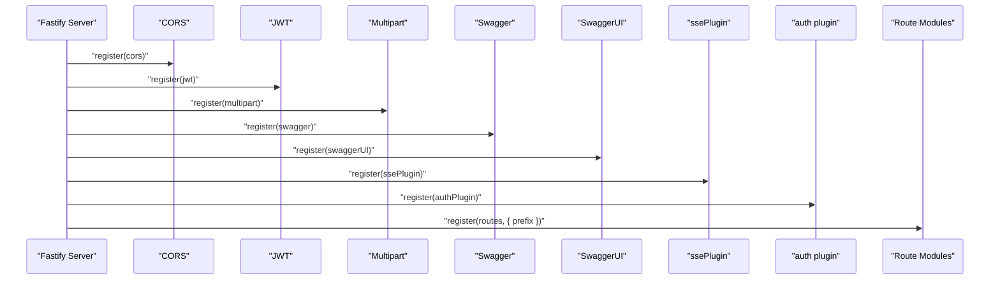
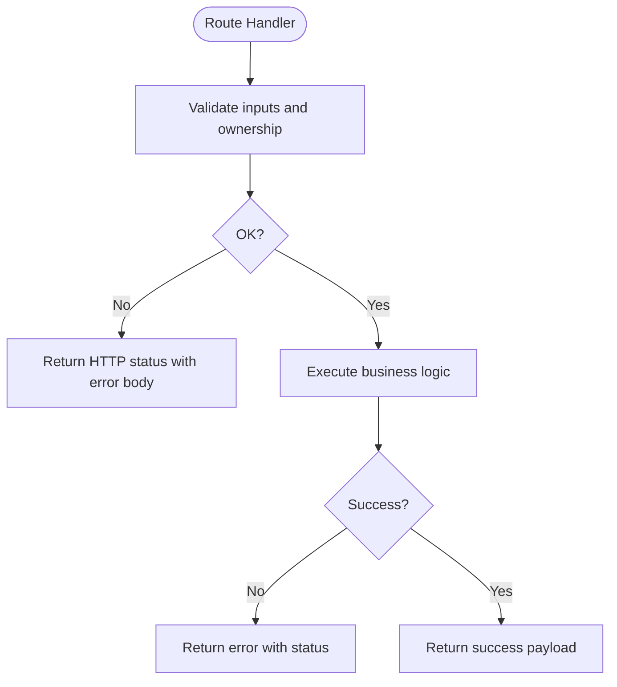
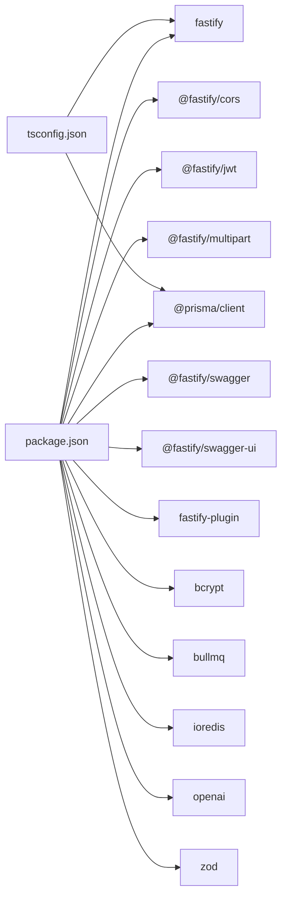

# Backend Architecture

<cite>
**Referenced Files in This Document**
- [index.ts](file://packages/backend/src/index.ts)
- [auth.ts](file://packages/backend/src/plugins/auth.ts)
- [sse.ts](file://packages/backend/src/plugins/sse.ts)
- [http-errors.ts](file://packages/backend/src/lib/http-errors.ts)
- [prisma.ts](file://packages/backend/src/lib/prisma.ts)
- [bootstrap-env.ts](file://packages/backend/src/bootstrap-env.ts)
- [auth.ts](file://packages/backend/src/routes/auth.ts)
- [projects.ts](file://packages/backend/src/routes/projects.ts)
- [package.json](file://packages/backend/package.json)
- [docker-compose.yml](file://docker/docker-compose.yml)
- [tsconfig.json](file://packages/backend/tsconfig.json)
- [worker.ts](file://packages/backend/src/worker.ts)
- [video.ts](file://packages/backend/src/queues/video.ts)
- [auth-service.ts](file://packages/backend/src/services/auth-service.ts)
</cite>

## Table of Contents

1. [Introduction](#introduction)
2. [Project Structure](#project-structure)
3. [Core Components](#core-components)
4. [Architecture Overview](#architecture-overview)
5. [Detailed Component Analysis](#detailed-component-analysis)
6. [Dependency Analysis](#dependency-analysis)
7. [Performance Considerations](#performance-considerations)
8. [Troubleshooting Guide](#troubleshooting-guide)
9. [Conclusion](#conclusion)
10. [Appendices](#appendices)

## Introduction

This document describes the backend architecture of the Fastify-based service. It covers the plugin system, middleware pattern, modular route organization, authentication via JWT, Server-Sent Events (SSE) for real-time updates, RESTful API design, plugin registration, error handling, logging, CORS configuration, OpenAPI/Swagger documentation, and the end-to-end request/response flow across backend layers.

## Project Structure

The backend is organized around a layered architecture:

- Entry point initializes Fastify, registers plugins, and mounts routes.
- Plugins encapsulate cross-cutting concerns (authentication, SSE).
- Routes define REST endpoints grouped by domain.
- Services implement business logic.
- Repositories abstract persistence.
- Workers handle long-running jobs asynchronously.

**Diagram sources**

- [index.ts:35-122](file://packages/backend/src/index.ts#L35-L122)
- [auth.ts:12-35](file://packages/backend/src/plugins/auth.ts#L12-L35)
- [sse.ts:45-107](file://packages/backend/src/plugins/sse.ts#L45-L107)
- [auth.ts:4-64](file://packages/backend/src/routes/auth.ts#L4-L64)
- [projects.ts:4-228](file://packages/backend/src/routes/projects.ts#L4-L228)
- [auth-service.ts:11-73](file://packages/backend/src/services/auth-service.ts#L11-L73)
- [http-errors.ts:1-3](file://packages/backend/src/lib/http-errors.ts#L1-L3)
- [prisma.ts:1-4](file://packages/backend/src/lib/prisma.ts#L1-L4)
- [bootstrap-env.ts:1-12](file://packages/backend/src/bootstrap-env.ts#L1-L12)
- [worker.ts:1-30](file://packages/backend/src/worker.ts#L1-L30)
- [video.ts:1-272](file://packages/backend/src/queues/video.ts#L1-L272)

**Section sources**

- [index.ts:35-122](file://packages/backend/src/index.ts#L35-L122)
- [package.json:1-51](file://packages/backend/package.json#L1-L51)
- [tsconfig.json:1-24](file://packages/backend/tsconfig.json#L1-L24)

## Core Components

- Fastify server initialization and plugin registration
- Authentication plugin with JWT verification and session user hydration
- SSE plugin for real-time notifications
- Modular route modules with preHandlers for authentication
- Service layer implementing business logic
- Prisma client for database access
- Environment bootstrap ensuring secrets are loaded before other modules
- Background workers for asynchronous tasks

**Section sources**

- [index.ts:35-122](file://packages/backend/src/index.ts#L35-L122)
- [auth.ts:12-35](file://packages/backend/src/plugins/auth.ts#L12-L35)
- [sse.ts:45-107](file://packages/backend/src/plugins/sse.ts#L45-L107)
- [auth.ts:4-64](file://packages/backend/src/routes/auth.ts#L4-L64)
- [projects.ts:4-228](file://packages/backend/src/routes/projects.ts#L4-L228)
- [auth-service.ts:11-73](file://packages/backend/src/services/auth-service.ts#L11-L73)
- [prisma.ts:1-4](file://packages/backend/src/lib/prisma.ts#L1-L4)
- [bootstrap-env.ts:1-12](file://packages/backend/src/bootstrap-env.ts#L1-L12)
- [worker.ts:1-30](file://packages/backend/src/worker.ts#L1-L30)
- [video.ts:1-272](file://packages/backend/src/queues/video.ts#L1-L272)

## Architecture Overview

The backend follows a layered Fastify architecture:

- Application bootstrap loads environment variables before other modules.
- Fastify instance is configured with logging and core plugins.
- CORS, JWT, multipart, Swagger, and SwaggerUI are registered globally.
- SSE plugin exposes subscription and broadcast APIs.
- Authentication plugin decorates the server with an authenticate method used as a preHandler.
- Route modules are mounted under /api/\* prefixes.
- Workers consume queues for long-running tasks and emit SSE updates.

**Diagram sources**

- [index.ts:35-122](file://packages/backend/src/index.ts#L35-L122)
- [auth.ts:12-35](file://packages/backend/src/plugins/auth.ts#L12-L35)
- [sse.ts:45-107](file://packages/backend/src/plugins/sse.ts#L45-L107)
- [auth.ts:4-64](file://packages/backend/src/routes/auth.ts#L4-L64)
- [projects.ts:4-228](file://packages/backend/src/routes/projects.ts#L4-L228)
- [prisma.ts:1-4](file://packages/backend/src/lib/prisma.ts#L1-L4)
- [video.ts:1-272](file://packages/backend/src/queues/video.ts#L1-L272)

## Detailed Component Analysis

### Plugin System and Middleware Pattern

- Fastify plugins are registered early in the lifecycle to decorate the server and provide reusable behavior.
- The authentication plugin decorates the server with an authenticate method that verifies JWT and hydrates the request user.
- PreHandlers on routes enforce authentication before controller logic executes.
- The SSE plugin decorates the server with subscribe and sendToUser methods for real-time updates.

**Diagram sources**

- [index.ts:80-81](file://packages/backend/src/index.ts#L80-L81)
- [auth.ts:13-34](file://packages/backend/src/plugins/auth.ts#L13-L34)
- [auth.ts:56-63](file://packages/backend/src/routes/auth.ts#L56-L63)

**Section sources**

- [index.ts:80-81](file://packages/backend/src/index.ts#L80-L81)
- [auth.ts:12-35](file://packages/backend/src/plugins/auth.ts#L12-L35)
- [auth.ts:56-63](file://packages/backend/src/routes/auth.ts#L56-L63)

### Authentication System Using JWT

- JWT secret is configured via environment variable.
- The auth plugin verifies tokens and enriches the request with a hydrated user object.
- Ownership helpers verify permissions across related resources (project, episode, scene, character, composition, task, location, character image, shot, character shot).
- Route handlers use preHandler: [fastify.authenticate] to protect endpoints.

**Diagram sources**

- [auth.ts:13-34](file://packages/backend/src/plugins/auth.ts#L13-L34)
- [auth.ts:38-97](file://packages/backend/src/plugins/auth.ts#L38-L97)

**Section sources**

- [index.ts:49-51](file://packages/backend/src/index.ts#L49-L51)
- [auth.ts:13-34](file://packages/backend/src/plugins/auth.ts#L13-L34)
- [auth.ts:38-97](file://packages/backend/src/plugins/auth.ts#L38-L97)

### Server-Sent Events Implementation

- SSE plugin establishes long-lived connections with heartbeat and cleanup.
- Subscriptions accept tokens via query or Authorization header.
- Broadcast helpers send events to a specific user’s connections.
- Workers publish task and project updates via SSE.

**Diagram sources**

- [index.ts:75-78](file://packages/backend/src/index.ts#L75-L78)
- [sse.ts:47-106](file://packages/backend/src/plugins/sse.ts#L47-L106)
- [video.ts:50-53](file://packages/backend/src/queues/video.ts#L50-L53)
- [video.ts:210-218](file://packages/backend/src/queues/video.ts#L210-L218)

**Section sources**

- [index.ts:75-78](file://packages/backend/src/index.ts#L75-L78)
- [sse.ts:45-107](file://packages/backend/src/plugins/sse.ts#L45-L107)
- [video.ts:50-53](file://packages/backend/src/queues/video.ts#L50-L53)
- [video.ts:210-218](file://packages/backend/src/queues/video.ts#L210-L218)

### RESTful API Design

- Routes are grouped by domain and mounted under /api/<resource>.
- Common patterns:
  - GET /: list resources (authenticated)
  - POST /: create resource (authenticated)
  - GET /:id: get single resource (authenticated)
  - PUT/PATCH /:id: update resource (authenticated)
  - DELETE /:id: delete resource (authenticated)
- Special actions are exposed as POST endpoints under resource paths (e.g., generating first episode, parsing scripts).
- Ownership checks are enforced via preHandlers and helper functions.

**Diagram sources**

- [projects.ts:6-33](file://packages/backend/src/routes/projects.ts#L6-L33)
- [projects.ts:138-152](file://packages/backend/src/routes/projects.ts#L138-L152)
- [projects.ts:182-211](file://packages/backend/src/routes/projects.ts#L182-L211)
- [projects.ts:213-227](file://packages/backend/src/routes/projects.ts#L213-L227)

**Section sources**

- [projects.ts:6-33](file://packages/backend/src/routes/projects.ts#L6-L33)
- [projects.ts:138-152](file://packages/backend/src/routes/projects.ts#L138-L152)
- [projects.ts:182-211](file://packages/backend/src/routes/projects.ts#L182-L211)
- [projects.ts:213-227](file://packages/backend/src/routes/projects.ts#L213-L227)

### Fastify Plugin Registration Pattern

- CORS, JWT, multipart, Swagger, and SwaggerUI are registered globally.
- SSE plugin is registered and exposes a dedicated SSE endpoint.
- Authentication plugin is registered and decorated onto the server.
- Route modules are registered with a prefix to organize the API surface.

**Diagram sources**

- [index.ts:42-110](file://packages/backend/src/index.ts#L42-L110)

**Section sources**

- [index.ts:42-110](file://packages/backend/src/index.ts#L42-L110)

### Error Handling Strategies

- Route handlers return appropriate HTTP status codes and structured error bodies.
- The http-errors library defines a standardized 403 response body for permission-related failures.
- Authentication plugin returns 401 for invalid or missing tokens and for missing/invalid sessions.
- Workers catch errors, update task and scene statuses, and emit failure events via SSE.

**Diagram sources**

- [http-errors.ts:1-3](file://packages/backend/src/lib/http-errors.ts#L1-L3)
- [auth.ts:15-31](file://packages/backend/src/plugins/auth.ts#L15-L31)
- [projects.ts:146-148](file://packages/backend/src/routes/projects.ts#L146-L148)
- [projects.ts:220-225](file://packages/backend/src/routes/projects.ts#L220-L225)
- [video.ts:222-250](file://packages/backend/src/queues/video.ts#L222-L250)

**Section sources**

- [http-errors.ts:1-3](file://packages/backend/src/lib/http-errors.ts#L1-L3)
- [auth.ts:15-31](file://packages/backend/src/plugins/auth.ts#L15-L31)
- [projects.ts:146-148](file://packages/backend/src/routes/projects.ts#L146-L148)
- [projects.ts:220-225](file://packages/backend/src/routes/projects.ts#L220-L225)
- [video.ts:222-250](file://packages/backend/src/queues/video.ts#L222-L250)

### Logging Mechanisms

- Fastify server is initialized with logger enabled.
- Workers log job progress and outcomes to stdout/stderr.
- API call logs are maintained for AI providers and updated with completion/failure states.

**Section sources**

- [index.ts:35-37](file://packages/backend/src/index.ts#L35-L37)
- [video.ts:32-33](file://packages/backend/src/queues/video.ts#L32-L33)
- [video.ts:258-264](file://packages/backend/src/queues/video.ts#L258-L264)

### CORS Configuration

- CORS is registered with origin configurable via environment variable and credentials support enabled.
- Production deployments should restrict origin to specific domains.

**Section sources**

- [index.ts:42-47](file://packages/backend/src/index.ts#L42-L47)

### Swagger/OpenAPI Documentation

- Swagger metadata is configured with title and version.
- SwaggerUI is mounted under /docs for interactive API documentation.

**Section sources**

- [index.ts:59-70](file://packages/backend/src/index.ts#L59-L70)

### Environment Bootstrap

- Environment variables are loaded before any other module to ensure secrets are available to dependent modules.

**Section sources**

- [bootstrap-env.ts:1-12](file://packages/backend/src/bootstrap-env.ts#L1-L12)

### Background Job Processing

- Workers are launched separately from the main API server.
- Redis is used as the queue backend with BullMQ.
- Video generation worker handles model-specific tasks, uploads artifacts to storage, and emits SSE updates.

**Section sources**

- [worker.ts:1-30](file://packages/backend/src/worker.ts#L1-L30)
- [video.ts:1-272](file://packages/backend/src/queues/video.ts#L1-L272)

## Dependency Analysis

The backend relies on Fastify and several official plugins. Dependencies are declared in package.json, and TypeScript configuration ensures ES modules and path mapping.

**Diagram sources**

- [package.json:22-39](file://packages/backend/package.json#L22-L39)
- [tsconfig.json:2-19](file://packages/backend/tsconfig.json#L2-L19)

**Section sources**

- [package.json:22-39](file://packages/backend/package.json#L22-L39)
- [tsconfig.json:2-19](file://packages/backend/tsconfig.json#L2-L19)

## Performance Considerations

- Use preHandlers to short-circuit unauthorized requests early.
- Keep route handlers thin; delegate business logic to services.
- Leverage multipart limits appropriately to prevent large payload abuse.
- Monitor SSE connections and clean up on close to avoid memory leaks.
- Configure queue concurrency based on downstream provider capacity and infrastructure.

## Troubleshooting Guide

- Authentication failures:
  - Ensure JWT secret is set and matches the client.
  - Verify tokens are included in Authorization header or SSE subscribe query.
- CORS issues:
  - Confirm CORS origin setting and credentials flag.
- SSE connectivity:
  - Check heartbeat writes and connection cleanup on client disconnect.
- Database connectivity:
  - Confirm Prisma client initialization and environment variables.
- Worker shutdown:
  - Ensure graceful shutdown hooks close queues and connections.

**Section sources**

- [index.ts:42-47](file://packages/backend/src/index.ts#L42-L47)
- [auth.ts:15-31](file://packages/backend/src/plugins/auth.ts#L15-L31)
- [sse.ts:87-100](file://packages/backend/src/plugins/sse.ts#L87-L100)
- [prisma.ts:1-4](file://packages/backend/src/lib/prisma.ts#L1-L4)
- [worker.ts:14-29](file://packages/backend/src/worker.ts#L14-L29)

## Conclusion

The backend employs a clean, modular Fastify architecture with strong separation of concerns. Plugins encapsulate cross-cutting concerns, routes are organized by domain, services implement business logic, and workers handle asynchronous workloads. JWT-based authentication, SSE for real-time updates, and Swagger documentation provide a robust developer and operator experience.

## Appendices

- Deployment stack includes PostgreSQL, Redis, and MinIO via docker-compose.
- Environment bootstrap ensures secrets are loaded prior to module evaluation.

**Section sources**

- [docker-compose.yml:1-71](file://docker/docker-compose.yml#L1-L71)
- [bootstrap-env.ts:1-12](file://packages/backend/src/bootstrap-env.ts#L1-L12)
