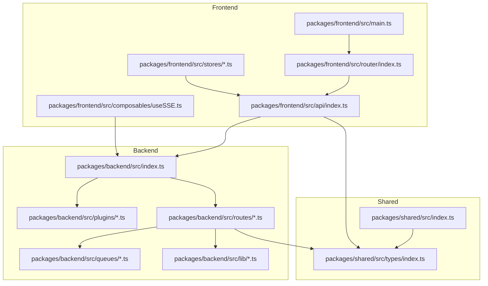
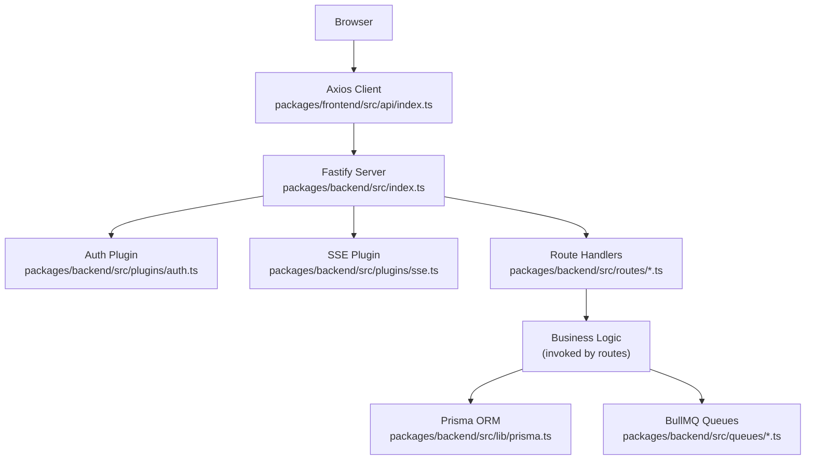
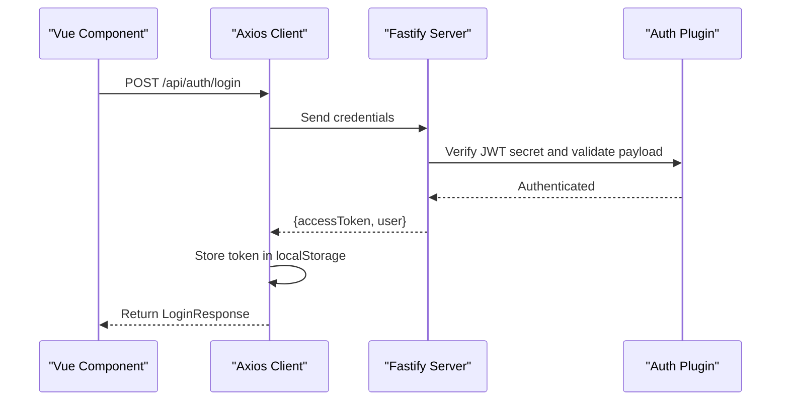
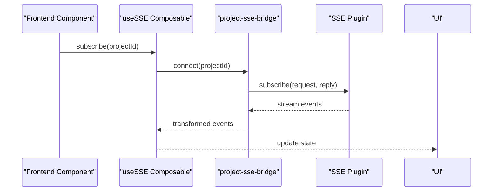
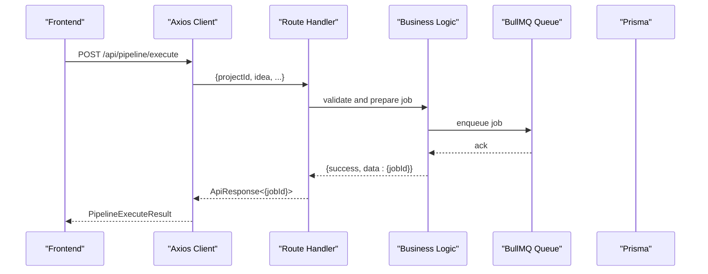
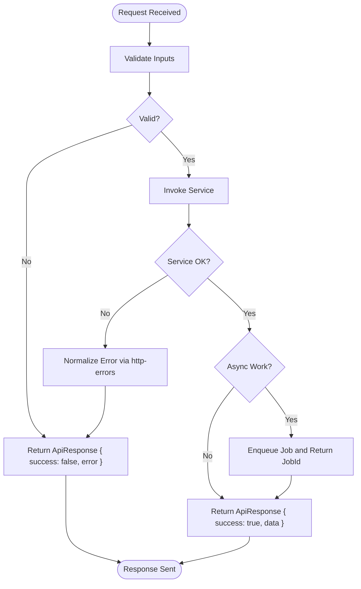
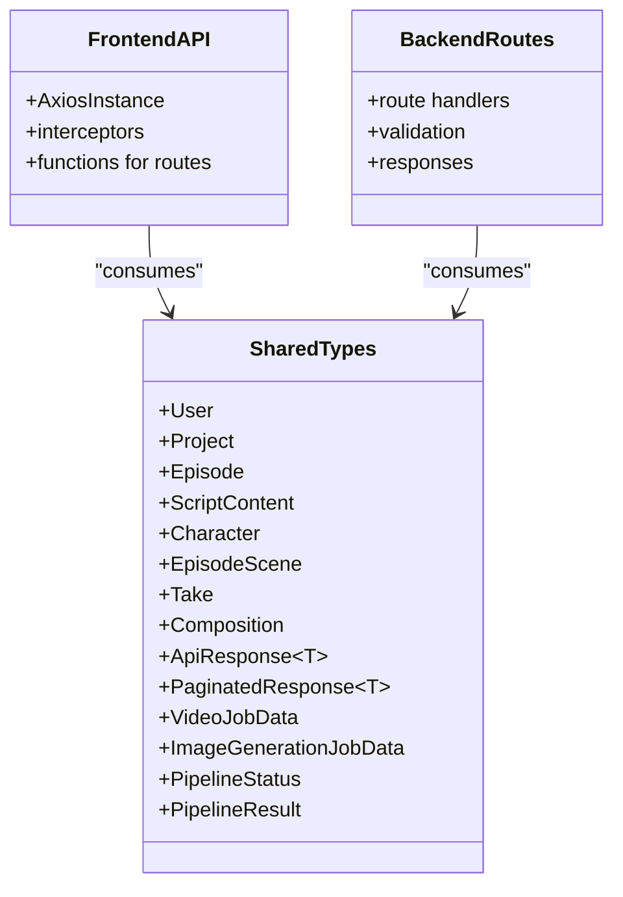
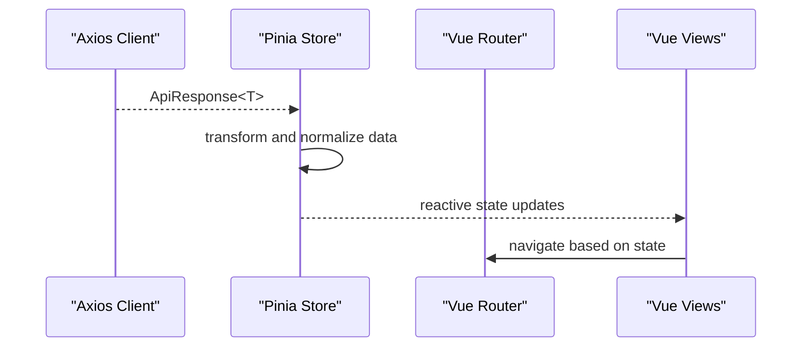
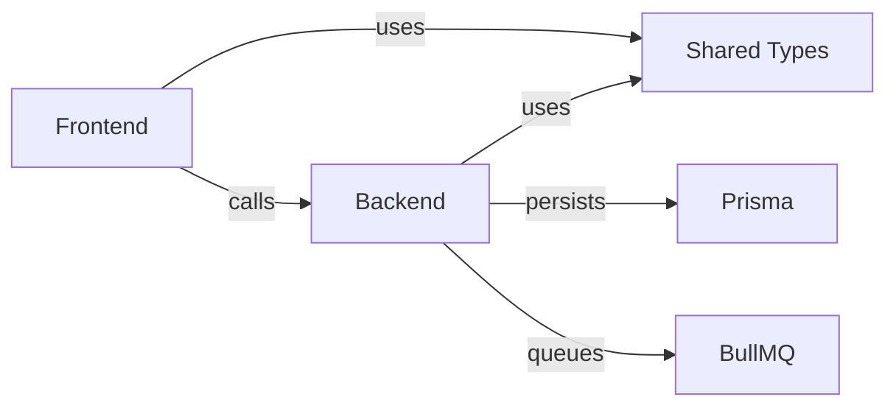

# Data Flow and Communication

<cite>
**Referenced Files in This Document**
- [README.md](file://README.md)
- [package.json](file://package.json)
- [pnpm-workspace.yaml](file://pnpm-workspace.yaml)
- [packages/backend/src/index.ts](file://packages/backend/src/index.ts)
- [packages/backend/src/plugins/auth.ts](file://packages/backend/src/plugins/auth.ts)
- [packages/backend/src/plugins/sse.ts](file://packages/backend/src/plugins/sse.ts)
- [packages/backend/src/lib/http-errors.ts](file://packages/backend/src/lib/http-errors.ts)
- [packages/backend/src/lib/prisma.ts](file://packages/backend/src/lib/prisma.ts)
- [packages/backend/src/queues/video.ts](file://packages/backend/src/queues/video.ts)
- [packages/backend/src/queues/image.ts](file://packages/backend/src/queues/image.ts)
- [packages/backend/src/queues/import.ts](file://packages/backend/src/queues/import.ts)
- [packages/backend/src/routes/projects.ts](file://packages/backend/src/routes/projects.ts)
- [packages/backend/src/routes/episodes.ts](file://packages/backend/src/routes/episodes.ts)
- [packages/backend/src/routes/characters.ts](file://packages/backend/src/routes/characters.ts)
- [packages/backend/src/routes/character-images.ts](file://packages/backend/src/routes/character-images.ts)
- [packages/backend/src/routes/locations.ts](file://packages/backend/src/routes/locations.ts)
- [packages/backend/src/routes/takes.ts](file://packages/backend/src/routes/takes.ts)
- [packages/backend/src/routes/scenes.ts](file://packages/backend/src/routes/scenes.ts)
- [packages/backend/src/routes/shots.ts](file://packages/backend/src/routes/shots.ts)
- [packages/backend/src/routes/character-shots.ts](file://packages/backend/src/routes/character-shots.ts)
- [packages/backend/src/routes/tasks.ts](file://packages/backend/src/routes/tasks.ts)
- [packages/backend/src/routes/compositions.ts](file://packages/backend/src/routes/compositions.ts)
- [packages/backend/src/routes/auth.ts](file://packages/backend/src/routes/auth.ts)
- [packages/backend/src/routes/stats.ts](file://packages/backend/src/routes/stats.ts)
- [packages/backend/src/routes/import.ts](file://packages/backend/src/routes/import.ts)
- [packages/backend/src/routes/settings.ts](file://packages/backend/src/routes/settings.ts)
- [packages/backend/src/routes/pipeline.ts](file://packages/backend/src/routes/pipeline.ts)
- [packages/backend/src/routes/image-generation-jobs.ts](file://packages/backend/src/routes/image-generation-jobs.ts)
- [packages/backend/src/routes/model-api-calls.ts](file://packages/backend/src/routes/model-api-calls.ts)
- [packages/backend/src/routes/memories.ts](file://packages/backend/src/routes/memories.ts)
- [packages/frontend/src/main.ts](file://packages/frontend/src/main.ts)
- [packages/frontend/src/api/index.ts](file://packages/frontend/src/api/index.ts)
- [packages/frontend/src/router/index.ts](file://packages/frontend/src/router/index.ts)
- [packages/frontend/src/stores/project.ts](file://packages/frontend/src/stores/project.ts)
- [packages/frontend/src/stores/episode.ts](file://packages/frontend/src/stores/episode.ts)
- [packages/frontend/src/stores/scene.ts](file://packages/frontend/src/stores/scene.ts)
- [packages/frontend/src/stores/composition.ts](file://packages/frontend/src/stores/composition.ts)
- [packages/frontend/src/stores/character.ts](file://packages/frontend/src/stores/character.ts)
- [packages/frontend/src/stores/stats.ts](file://packages/frontend/src/stores/stats.ts)
- [packages/frontend/src/composables/useSSE.ts](file://packages/frontend/src/composables/useSSE.ts)
- [packages/frontend/src/lib/project-sse-bridge.ts](file://packages/frontend/src/lib/project-sse-bridge.ts)
- [packages/shared/src/index.ts](file://packages/shared/src/index.ts)
- [packages/shared/src/types/index.ts](file://packages/shared/src/types/index.ts)
</cite>

## Table of Contents

1. [Introduction](#introduction)
2. [Project Structure](#project-structure)
3. [Core Components](#core-components)
4. [Architecture Overview](#architecture-overview)
5. [Detailed Component Analysis](#detailed-component-analysis)
6. [Dependency Analysis](#dependency-analysis)
7. [Performance Considerations](#performance-considerations)
8. [Troubleshooting Guide](#troubleshooting-guide)
9. [Conclusion](#conclusion)
10. [Appendices](#appendices)

## Introduction

This document explains how data flows across the Dreamer platform, from frontend to backend and back, and how shared TypeScript types maintain consistency across package boundaries. It covers:

- Frontend-to-backend request/response patterns and authentication
- Backend routing, plugins, and layered processing
- Shared type contracts and API design
- Error propagation and data transformation
- Typical data flow scenarios and integration patterns

## Project Structure

The platform is a monorepo organized into three packages:

- frontend: Vue 3 + TypeScript SPA using Pinia for state and Vue Router for navigation
- backend: Fastify server exposing REST APIs, plugins for auth and SSE, and route handlers grouped by domain
- shared: TypeScript types consumed by both frontend and backend to enforce API contracts

**Diagram sources**

- [packages/frontend/src/main.ts:1-18](file://packages/frontend/src/main.ts#L1-L18)
- [packages/frontend/src/router/index.ts](file://packages/frontend/src/router/index.ts)
- [packages/frontend/src/api/index.ts:1-332](file://packages/frontend/src/api/index.ts#L1-L332)
- [packages/backend/src/index.ts:1-136](file://packages/backend/src/index.ts#L1-L136)
- [packages/backend/src/plugins/auth.ts](file://packages/backend/src/plugins/auth.ts)
- [packages/backend/src/plugins/sse.ts](file://packages/backend/src/plugins/sse.ts)
- [packages/shared/src/index.ts:1-2](file://packages/shared/src/index.ts#L1-L2)
- [packages/shared/src/types/index.ts:1-567](file://packages/shared/src/types/index.ts#L1-L567)

**Section sources**

- [README.md:26-42](file://README.md#L26-L42)
- [package.json:6-8](file://package.json#L6-L8)
- [pnpm-workspace.yaml:1-3](file://pnpm-workspace.yaml#L1-L3)

## Core Components

- Frontend API client: Axios-based client configured with base URL, interceptors for auth tokens and multipart forms, and centralized response error handling.
- Backend server: Fastify server registering plugins (CORS, JWT, multipart, Swagger, SSE), registering routes under /api/\*, and exposing health checks and OpenAPI docs.
- Shared types: A single source of truth for request/response shapes, enums, and pipeline-related structures used by both frontend and backend.
- Queues: BullMQ-based asynchronous workers for video generation, image generation, and import jobs.
- Stores and composables: Frontend Pinia stores and composables orchestrate UI state and SSE-driven updates.

Key responsibilities:

- Frontend: Build requests, handle auth redirects, transform responses into store-friendly shapes, and subscribe to SSE events.
- Backend: Validate requests via plugins, delegate to services/routing logic, enqueue async work, and return standardized responses.
- Shared: Define API contracts and pipeline structures ensuring type safety across packages.

**Section sources**

- [packages/frontend/src/api/index.ts:1-332](file://packages/frontend/src/api/index.ts#L1-L332)
- [packages/backend/src/index.ts:35-127](file://packages/backend/src/index.ts#L35-L127)
- [packages/shared/src/types/index.ts:221-368](file://packages/shared/src/types/index.ts#L221-L368)

## Architecture Overview

The system follows a layered backend architecture:

- Transport: Fastify server
- Plugins: Auth, SSE, CORS, JWT, multipart, Swagger
- Routes: Feature-specific handlers under /api/\*
- Services/Layers: Business logic invoked by routes
- Persistence: Prisma ORM
- Asynchronous Work: BullMQ queues for long-running tasks
- Frontend: Axios client, Pinia stores, Vue Router, SSE composables

**Diagram sources**

- [packages/frontend/src/api/index.ts:1-332](file://packages/frontend/src/api/index.ts#L1-L332)
- [packages/backend/src/index.ts:44-127](file://packages/backend/src/index.ts#L44-L127)
- [packages/backend/src/plugins/auth.ts](file://packages/backend/src/plugins/auth.ts)
- [packages/backend/src/plugins/sse.ts](file://packages/backend/src/plugins/sse.ts)
- [packages/backend/src/lib/prisma.ts](file://packages/backend/src/lib/prisma.ts)
- [packages/backend/src/queues/video.ts](file://packages/backend/src/queues/video.ts)
- [packages/backend/src/queues/image.ts](file://packages/backend/src/queues/image.ts)
- [packages/backend/src/queues/import.ts](file://packages/backend/src/queues/import.ts)

## Detailed Component Analysis

### Frontend API Client and Authentication Flow

- Axios instance configured with base URL pointing to /api, global request interceptor adding Authorization header from localStorage, and response interceptor handling 401 by redirecting to login.
- Special handling for multipart forms to avoid Content-Type conflicts.
- Public auth endpoints bypass global 401 redirect.

**Diagram sources**

- [packages/frontend/src/api/index.ts:34-55](file://packages/frontend/src/api/index.ts#L34-L55)
- [packages/backend/src/plugins/auth.ts](file://packages/backend/src/plugins/auth.ts)
- [packages/backend/src/routes/auth.ts](file://packages/backend/src/routes/auth.ts)

**Section sources**

- [packages/frontend/src/api/index.ts:1-332](file://packages/frontend/src/api/index.ts#L1-L332)
- [packages/backend/src/plugins/auth.ts](file://packages/backend/src/plugins/auth.ts)
- [packages/backend/src/routes/auth.ts](file://packages/backend/src/routes/auth.ts)

### SSE Integration for Real-Time Updates

- Backend exposes /api/sse endpoint via SSE plugin.
- Frontend composable subscribes to SSE streams and forwards events to UI.
- Project-level SSE bridge coordinates per-project event channels.

**Diagram sources**

- [packages/frontend/src/composables/useSSE.ts](file://packages/frontend/src/composables/useSSE.ts)
- [packages/frontend/src/lib/project-sse-bridge.ts](file://packages/frontend/src/lib/project-sse-bridge.ts)
- [packages/backend/src/plugins/sse.ts](file://packages/backend/src/plugins/sse.ts)

**Section sources**

- [packages/frontend/src/composables/useSSE.ts](file://packages/frontend/src/composables/useSSE.ts)
- [packages/frontend/src/lib/project-sse-bridge.ts](file://packages/frontend/src/lib/project-sse-bridge.ts)
- [packages/backend/src/plugins/sse.ts](file://packages/backend/src/plugins/sse.ts)

### Route Layer and Request/Response Patterns

- Backend registers routes under /api/\* with feature-specific prefixes (projects, episodes, characters, scenes, compositions, pipeline, stats, import, etc.).
- Each route handler typically validates inputs, delegates to service logic, and returns standardized ApiResponse<T> or paginated responses.
- Async operations enqueue jobs and return immediate job identifiers.

**Diagram sources**

- [packages/backend/src/routes/pipeline.ts](file://packages/backend/src/routes/pipeline.ts)
- [packages/backend/src/queues/video.ts](file://packages/backend/src/queues/video.ts)
- [packages/shared/src/types/index.ts:313-325](file://packages/shared/src/types/index.ts#L313-L325)

**Section sources**

- [packages/backend/src/index.ts:88-116](file://packages/backend/src/index.ts#L88-L116)
- [packages/backend/src/routes/pipeline.ts](file://packages/backend/src/routes/pipeline.ts)
- [packages/shared/src/types/index.ts:221-236](file://packages/shared/src/types/index.ts#L221-L236)

### Error Propagation and Standardized Responses

- Backend uses a shared ApiResponse<T> contract with success, data, error, and message fields.
- HTTP errors are normalized via a dedicated HTTP errors utility.
- Frontend centralizes 401 handling to redirect unauthenticated users.

**Diagram sources**

- [packages/shared/src/types/index.ts:221-236](file://packages/shared/src/types/index.ts#L221-L236)
- [packages/backend/src/lib/http-errors.ts](file://packages/backend/src/lib/http-errors.ts)
- [packages/frontend/src/api/index.ts:34-55](file://packages/frontend/src/api/index.ts#L34-L55)

**Section sources**

- [packages/shared/src/types/index.ts:221-236](file://packages/shared/src/types/index.ts#L221-L236)
- [packages/backend/src/lib/http-errors.ts](file://packages/backend/src/lib/http-errors.ts)
- [packages/frontend/src/api/index.ts:34-55](file://packages/frontend/src/api/index.ts#L34-L55)

### Shared TypeScript Types and Contract Design

- Shared types define:
  - Domain models (User, Project, Episode, ScriptContent, Character, EpisodeScene, Take, Composition, etc.)
  - API request/response contracts (LoginRequest/LoginResponse, CreateProjectRequest, PaginatedResponse, ApiResponse)
  - Worker/job types (VideoJobData, ImageGenerationJobData variants)
  - Pipeline types (EpisodePlan, SceneActions, StoryboardSegment, SeedanceSegmentConfig, VoiceSegment, PipelineStatus, PipelineResult)
- Frontend imports these types to ensure UI and API payloads match backend expectations.
- Backend routes and services reference the same types to maintain consistency.

**Diagram sources**

- [packages/shared/src/types/index.ts:1-567](file://packages/shared/src/types/index.ts#L1-L567)
- [packages/frontend/src/api/index.ts:1-332](file://packages/frontend/src/api/index.ts#L1-L332)
- [packages/backend/src/routes/projects.ts](file://packages/backend/src/routes/projects.ts)

**Section sources**

- [packages/shared/src/types/index.ts:1-567](file://packages/shared/src/types/index.ts#L1-L567)
- [packages/shared/src/index.ts:1-2](file://packages/shared/src/index.ts#L1-L2)

### Data Transformation and State Management

- Frontend Pinia stores encapsulate domain state (projects, episodes, scenes, compositions, characters, stats).
- API responses are mapped into store-friendly shapes; SSE events update state reactively.
- Router integrates with stores to drive view transitions.

**Diagram sources**

- [packages/frontend/src/stores/project.ts](file://packages/frontend/src/stores/project.ts)
- [packages/frontend/src/stores/episode.ts](file://packages/frontend/src/stores/episode.ts)
- [packages/frontend/src/stores/scene.ts](file://packages/frontend/src/stores/scene.ts)
- [packages/frontend/src/stores/composition.ts](file://packages/frontend/src/stores/composition.ts)
- [packages/frontend/src/stores/character.ts](file://packages/frontend/src/stores/character.ts)
- [packages/frontend/src/stores/stats.ts](file://packages/frontend/src/stores/stats.ts)
- [packages/frontend/src/router/index.ts](file://packages/frontend/src/router/index.ts)

**Section sources**

- [packages/frontend/src/stores/project.ts](file://packages/frontend/src/stores/project.ts)
- [packages/frontend/src/stores/episode.ts](file://packages/frontend/src/stores/episode.ts)
- [packages/frontend/src/stores/scene.ts](file://packages/frontend/src/stores/scene.ts)
- [packages/frontend/src/stores/composition.ts](file://packages/frontend/src/stores/composition.ts)
- [packages/frontend/src/stores/character.ts](file://packages/frontend/src/stores/character.ts)
- [packages/frontend/src/stores/stats.ts](file://packages/frontend/src/stores/stats.ts)
- [packages/frontend/src/router/index.ts](file://packages/frontend/src/router/index.ts)

### Example Scenarios

#### Scenario 1: Creating a Project and Uploading Assets

- Frontend calls POST /api/projects with CreateProjectRequest.
- Backend validates inputs, persists via Prisma, and returns ApiResponse<Project>.
- Frontend updates store and navigates to project detail.

**Section sources**

- [packages/backend/src/routes/projects.ts](file://packages/backend/src/routes/projects.ts)
- [packages/shared/src/types/index.ts:257-260](file://packages/shared/src/types/index.ts#L257-L260)
- [packages/frontend/src/api/index.ts:1-332](file://packages/frontend/src/api/index.ts#L1-L332)

#### Scenario 2: Executing the Pipeline and Monitoring Progress

- Frontend calls POST /api/pipeline/execute with PipelineExecuteParams.
- Backend enqueues a pipeline job and returns ApiResponse<{jobId}>.
- Frontend polls GET /api/pipeline/job/:jobId until completion or failure, updating UI via SSE and store.

**Section sources**

- [packages/backend/src/routes/pipeline.ts](file://packages/backend/src/routes/pipeline.ts)
- [packages/shared/src/types/index.ts:203-244](file://packages/shared/src/types/index.ts#L203-L244)
- [packages/frontend/src/api/index.ts:246-291](file://packages/frontend/src/api/index.ts#L246-L291)

#### Scenario 3: Generating Video with Async Job

- Frontend calls POST /api/shots/:id/generate-video with GenerateVideoRequest.
- Backend enqueues a video job and returns ApiResponse<{jobId}> immediately.
- Worker processes queue, updates Take status, and emits SSE events consumed by frontend.

**Section sources**

- [packages/backend/src/routes/shots.ts](file://packages/backend/src/routes/shots.ts)
- [packages/shared/src/types/index.ts:290-300](file://packages/shared/src/types/index.ts#L290-L300)
- [packages/backend/src/queues/video.ts](file://packages/backend/src/queues/video.ts)
- [packages/frontend/src/composables/useSSE.ts](file://packages/frontend/src/composables/useSSE.ts)

## Dependency Analysis

- Frontend depends on:
  - Axios client for HTTP
  - Shared types for API contracts
  - Pinia stores for state
  - Vue Router for navigation
  - SSE composables for real-time updates
- Backend depends on:
  - Fastify for transport
  - Plugins for auth, SSE, CORS, JWT, multipart, Swagger
  - Prisma for persistence
  - BullMQ for queues
  - Shared types for contracts
- Shared types are consumed by both frontend and backend to prevent drift.

**Diagram sources**

- [packages/frontend/src/api/index.ts:1-332](file://packages/frontend/src/api/index.ts#L1-L332)
- [packages/shared/src/types/index.ts:1-567](file://packages/shared/src/types/index.ts#L1-L567)
- [packages/backend/src/lib/prisma.ts](file://packages/backend/src/lib/prisma.ts)
- [packages/backend/src/queues/video.ts](file://packages/backend/src/queues/video.ts)

**Section sources**

- [packages/frontend/src/api/index.ts:1-332](file://packages/frontend/src/api/index.ts#L1-L332)
- [packages/shared/src/types/index.ts:1-567](file://packages/shared/src/types/index.ts#L1-L567)
- [packages/backend/src/lib/prisma.ts](file://packages/backend/src/lib/prisma.ts)

## Performance Considerations

- Request timeouts: Backend sets requestTimeout to avoid zombie connections; long-running tasks should return job IDs promptly.
- File uploads: Multipart limits configured to ~100 MB; ensure frontend sends FormData and removes Content-Type header for proper boundary handling.
- SSE: ConnectionTimeout set to unlimited to support long-lived streams; ensure clients handle reconnects gracefully.
- Async work: Offload heavy work to BullMQ queues; return job IDs quickly to keep API responsive.

**Section sources**

- [packages/backend/src/index.ts:35-42](file://packages/backend/src/index.ts#L35-L42)
- [packages/backend/src/index.ts:58-62](file://packages/backend/src/index.ts#L58-L62)
- [packages/frontend/src/api/index.ts:57-64](file://packages/frontend/src/api/index.ts#L57-L64)

## Troubleshooting Guide

- 401 Unauthorized:
  - Frontend automatically clears token and redirects to login for protected routes; public auth endpoints are exempt.
- CORS issues:
  - Verify CORS origin environment variable and credentials setting in backend.
- Upload failures:
  - Ensure FormData is used and Content-Type is not forced for multipart requests.
- Pipeline job timeouts:
  - Increase polling intervals or timeouts; monitor progress via SSE and store updates.
- Database connectivity:
  - Confirm DATABASE_URL and Prisma client initialization.

**Section sources**

- [packages/frontend/src/api/index.ts:25-55](file://packages/frontend/src/api/index.ts#L25-L55)
- [packages/backend/src/index.ts:48-52](file://packages/backend/src/index.ts#L48-L52)
- [packages/backend/src/lib/prisma.ts](file://packages/backend/src/lib/prisma.ts)

## Conclusion

The Dreamer platform achieves clean separation of concerns through a well-defined frontend/backend boundary, standardized shared types, and robust asynchronous processing. The frontend consumes a cohesive API surface, the backend enforces contracts via plugins and routes, and shared types ensure type safety across package boundaries. SSE enables real-time updates, while queues decouple long-running tasks from request/response cycles.

## Appendices

### API Contract Reference Highlights

- Authentication: LoginRequest/LoginResponse
- Projects: CreateProjectRequest, Project
- Episodes/Scripts: CreateEpisodeRequest, Episode, ScriptContent
- Characters: CreateCharacterRequest, Character, CharacterImage
- Scenes/Takes: CreateSceneRequest, EpisodeScene, Take
- Compositions: CreateCompositionRequest, Composition, CompositionTimelineClip
- Pipeline: PipelineExecuteParams, PipelineJob, PipelineStatus, PipelineResult
- Workers: VideoJobData, ImageGenerationJobData variants

**Section sources**

- [packages/shared/src/types/index.ts:221-567](file://packages/shared/src/types/index.ts#L221-L567)
