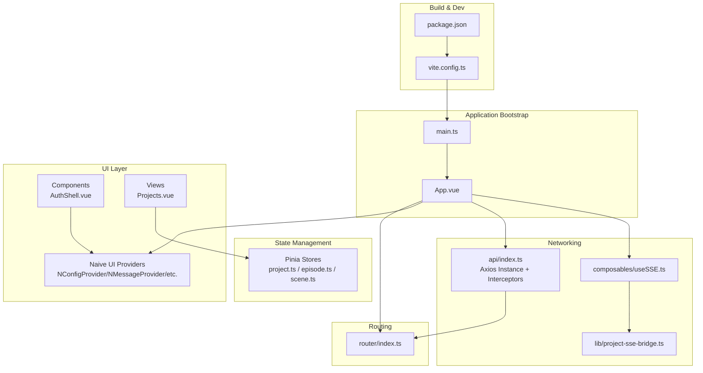
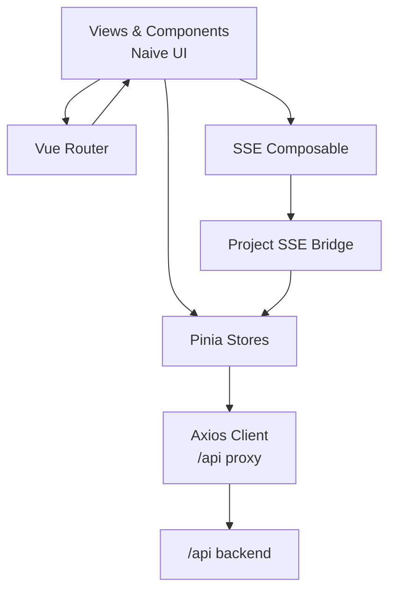
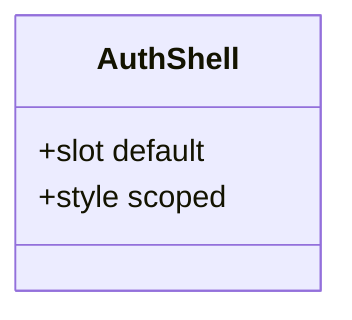
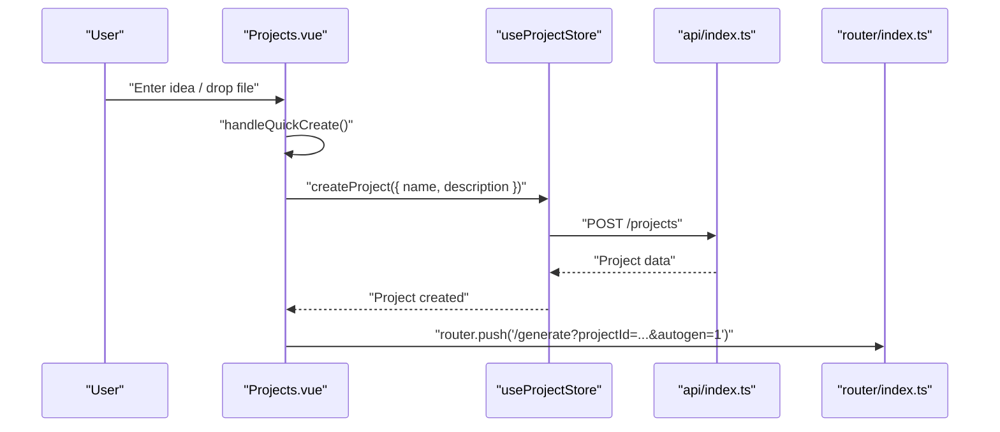
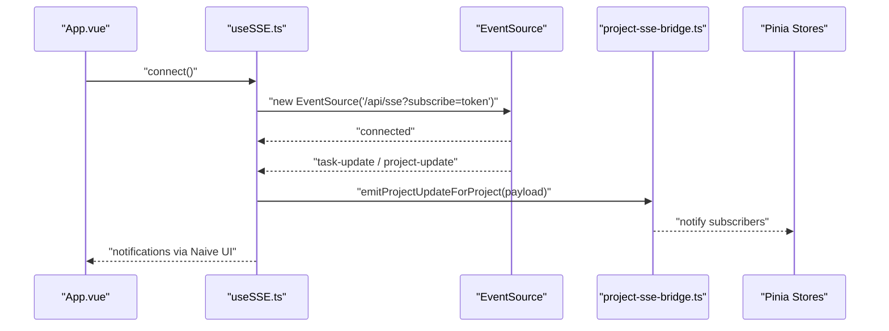
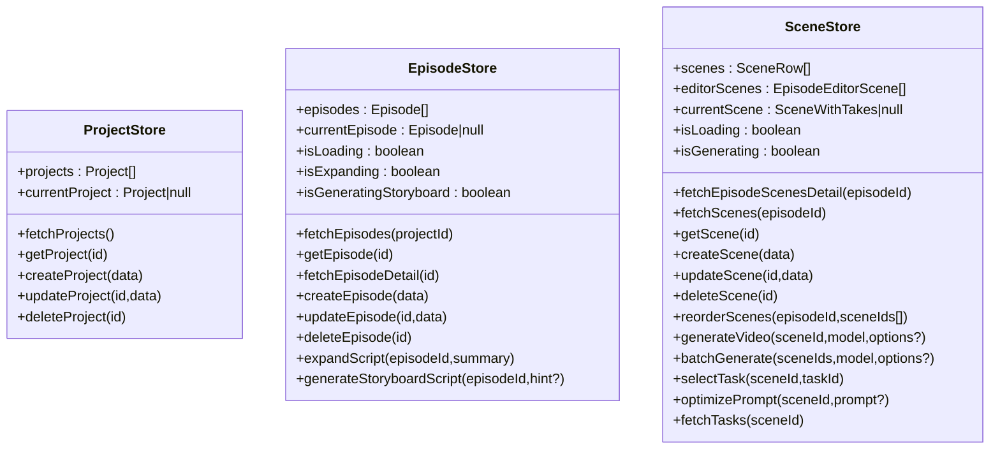
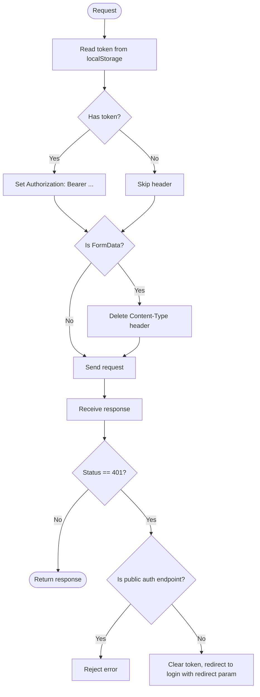
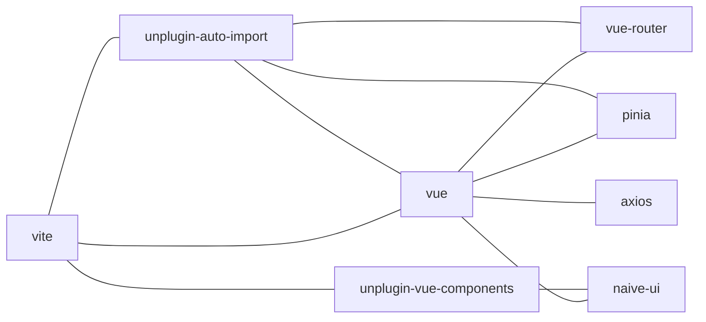

# Frontend Architecture

<cite>
**Referenced Files in This Document**
- [package.json](file://packages/frontend/package.json)
- [vite.config.ts](file://packages/frontend/vite.config.ts)
- [main.ts](file://packages/frontend/src/main.ts)
- [App.vue](file://packages/frontend/src/App.vue)
- [router/index.ts](file://packages/frontend/src/router/index.ts)
- [api/index.ts](file://packages/frontend/src/api/index.ts)
- [composables/useSSE.ts](file://packages/frontend/src/composables/useSSE.ts)
- [lib/project-sse-bridge.ts](file://packages/frontend/src/lib/project-sse-bridge.ts)
- [stores/project.ts](file://packages/frontend/src/stores/project.ts)
- [stores/episode.ts](file://packages/frontend/src/stores/episode.ts)
- [stores/scene.ts](file://packages/frontend/src/stores/scene.ts)
- [components/auth/AuthShell.vue](file://packages/frontend/src/components/auth/AuthShell.vue)
- [views/Projects.vue](file://packages/frontend/src/views/Projects.vue)
</cite>

## Table of Contents

1. [Introduction](#introduction)
2. [Project Structure](#project-structure)
3. [Core Components](#core-components)
4. [Architecture Overview](#architecture-overview)
5. [Detailed Component Analysis](#detailed-component-analysis)
6. [Dependency Analysis](#dependency-analysis)
7. [Performance Considerations](#performance-considerations)
8. [Troubleshooting Guide](#troubleshooting-guide)
9. [Conclusion](#conclusion)

## Introduction

This document describes the frontend architecture of the Vue 3 application. It covers the component-based structure, routing with Vue Router, state management via Pinia, integration with the Naive UI component library, the Vite build system, and API communication patterns. It also explains reactive data flow, lifecycle management, UI patterns, development workflow including Hot Module Replacement (HMR), and build optimization strategies.

## Project Structure

The frontend is organized as a Vue 3 + TypeScript single-page application under packages/frontend. Key areas include:

- Application bootstrap and global providers in main.ts
- Root component with layout, theme, and providers in App.vue
- Routing configuration in router/index.ts
- API client and interceptors in api/index.ts
- Composables for reusable logic (e.g., SSE) in composables/
- Pinia stores for domain state in stores/
- UI components and views under components/ and views/
- Build configuration in vite.config.ts and package.json scripts

**Diagram sources**

- [main.ts:1-18](file://packages/frontend/src/main.ts#L1-L18)
- [App.vue:1-231](file://packages/frontend/src/App.vue#L1-L231)
- [router/index.ts:1-145](file://packages/frontend/src/router/index.ts#L1-L145)
- [api/index.ts:1-332](file://packages/frontend/src/api/index.ts#L1-L332)
- [composables/useSSE.ts:1-109](file://packages/frontend/src/composables/useSSE.ts#L1-L109)
- [lib/project-sse-bridge.ts:1-48](file://packages/frontend/src/lib/project-sse-bridge.ts#L1-L48)
- [stores/project.ts:1-51](file://packages/frontend/src/stores/project.ts#L1-L51)
- [stores/episode.ts:1-125](file://packages/frontend/src/stores/episode.ts#L1-L125)
- [stores/scene.ts:1-213](file://packages/frontend/src/stores/scene.ts#L1-L213)
- [components/auth/AuthShell.vue:1-180](file://packages/frontend/src/components/auth/AuthShell.vue#L1-L180)
- [views/Projects.vue:1-435](file://packages/frontend/src/views/Projects.vue#L1-L435)
- [vite.config.ts:1-48](file://packages/frontend/vite.config.ts#L1-L48)
- [package.json:1-41](file://packages/frontend/package.json#L1-L41)

**Section sources**

- [main.ts:1-18](file://packages/frontend/src/main.ts#L1-L18)
- [App.vue:1-231](file://packages/frontend/src/App.vue#L1-L231)
- [router/index.ts:1-145](file://packages/frontend/src/router/index.ts#L1-L145)
- [api/index.ts:1-332](file://packages/frontend/src/api/index.ts#L1-L332)
- [composables/useSSE.ts:1-109](file://packages/frontend/src/composables/useSSE.ts#L1-L109)
- [lib/project-sse-bridge.ts:1-48](file://packages/frontend/src/lib/project-sse-bridge.ts#L1-L48)
- [stores/project.ts:1-51](file://packages/frontend/src/stores/project.ts#L1-L51)
- [stores/episode.ts:1-125](file://packages/frontend/src/stores/episode.ts#L1-L125)
- [stores/scene.ts:1-213](file://packages/frontend/src/stores/scene.ts#L1-L213)
- [components/auth/AuthShell.vue:1-180](file://packages/frontend/src/components/auth/AuthShell.vue#L1-L180)
- [views/Projects.vue:1-435](file://packages/frontend/src/views/Projects.vue#L1-L435)
- [vite.config.ts:1-48](file://packages/frontend/vite.config.ts#L1-L48)
- [package.json:1-41](file://packages/frontend/package.json#L1-L41)

## Core Components

- Application shell and providers: App.vue sets up Naive UI providers, theme overrides, header with user menu, and mounts RouterView. It initializes SSE after mount and manages user session state via localStorage.
- Router: router/index.ts defines routes including nested routes for project-centric views and guards that enforce authentication and prevent open redirects.
- API client: api/index.ts creates an Axios instance with base URL pointing to /api, attaches Authorization tokens, normalizes multipart forms, and centralizes 401 handling to redirect unauthenticated users to login.
- SSE composable: composables/useSSE.ts encapsulates EventSource connection, reconnection logic, and emits notifications for task and project updates. It integrates with lib/project-sse-bridge.ts to dispatch project-specific updates to subscribers.
- Pinia stores: stores/project.ts, stores/episode.ts, and stores/scene.ts manage domain state for projects, episodes, and scenes respectively, exposing async actions to fetch/update/delete resources and track loading states.
- UI components: components/auth/AuthShell.vue provides a themed authentication shell with product messaging and form container. views/Projects.vue demonstrates a typical page integrating UI components, stores, and API interactions.

**Section sources**

- [App.vue:1-231](file://packages/frontend/src/App.vue#L1-L231)
- [router/index.ts:1-145](file://packages/frontend/src/router/index.ts#L1-L145)
- [api/index.ts:1-332](file://packages/frontend/src/api/index.ts#L1-L332)
- [composables/useSSE.ts:1-109](file://packages/frontend/src/composables/useSSE.ts#L1-L109)
- [lib/project-sse-bridge.ts:1-48](file://packages/frontend/src/lib/project-sse-bridge.ts#L1-L48)
- [stores/project.ts:1-51](file://packages/frontend/src/stores/project.ts#L1-L51)
- [stores/episode.ts:1-125](file://packages/frontend/src/stores/episode.ts#L1-L125)
- [stores/scene.ts:1-213](file://packages/frontend/src/stores/scene.ts#L1-L213)
- [components/auth/AuthShell.vue:1-180](file://packages/frontend/src/components/auth/AuthShell.vue#L1-L180)
- [views/Projects.vue:1-435](file://packages/frontend/src/views/Projects.vue#L1-L435)

## Architecture Overview

The frontend follows a layered architecture:

- Presentation layer: Views and components using Naive UI
- Domain layer: Pinia stores encapsulate business logic and data fetching
- Infrastructure layer: Router, API client, and SSE bridge
- Build and dev tooling: Vite with auto-import and component resolvers

**Diagram sources**

- [App.vue:1-231](file://packages/frontend/src/App.vue#L1-L231)
- [router/index.ts:1-145](file://packages/frontend/src/router/index.ts#L1-L145)
- [api/index.ts:1-332](file://packages/frontend/src/api/index.ts#L1-L332)
- [composables/useSSE.ts:1-109](file://packages/frontend/src/composables/useSSE.ts#L1-L109)
- [lib/project-sse-bridge.ts:1-48](file://packages/frontend/src/lib/project-sse-bridge.ts#L1-L48)
- [stores/project.ts:1-51](file://packages/frontend/src/stores/project.ts#L1-L51)
- [stores/episode.ts:1-125](file://packages/frontend/src/stores/episode.ts#L1-L125)
- [stores/scene.ts:1-213](file://packages/frontend/src/stores/scene.ts#L1-L213)

## Detailed Component Analysis

### Authentication Shell Component

AuthShell.vue provides a branded authentication layout with:

- Product branding and feature list
- Form container slot for login/register views
- Responsive design and themed card styling

**Diagram sources**

- [components/auth/AuthShell.vue:1-180](file://packages/frontend/src/components/auth/AuthShell.vue#L1-L180)

**Section sources**

- [components/auth/AuthShell.vue:1-180](file://packages/frontend/src/components/auth/AuthShell.vue#L1-L180)

### Projects View and Reactive Data Flow

Projects.vue demonstrates:

- Reactive filtering based on user input
- Composition of UI components (Naive UI) and local state
- Interaction with Pinia store and API client
- Conditional navigation based on project state and active jobs

**Diagram sources**

- [views/Projects.vue:1-435](file://packages/frontend/src/views/Projects.vue#L1-L435)
- [stores/project.ts:1-51](file://packages/frontend/src/stores/project.ts#L1-L51)
- [api/index.ts:1-332](file://packages/frontend/src/api/index.ts#L1-L332)
- [router/index.ts:1-145](file://packages/frontend/src/router/index.ts#L1-L145)

**Section sources**

- [views/Projects.vue:1-435](file://packages/frontend/src/views/Projects.vue#L1-L435)
- [stores/project.ts:1-51](file://packages/frontend/src/stores/project.ts#L1-L51)
- [api/index.ts:1-332](file://packages/frontend/src/api/index.ts#L1-L332)
- [router/index.ts:1-145](file://packages/frontend/src/router/index.ts#L1-L145)

### SSE Integration and Project Updates

SSE is initialized after App.vue mounts and reacts to token changes. The composable connects to /api/sse with the token in query, listens for task and project events, and notifies the user. Project updates are dispatched to subscribers via project-sse-bridge.ts.

**Diagram sources**

- [App.vue:1-231](file://packages/frontend/src/App.vue#L1-L231)
- [composables/useSSE.ts:1-109](file://packages/frontend/src/composables/useSSE.ts#L1-L109)
- [lib/project-sse-bridge.ts:1-48](file://packages/frontend/src/lib/project-sse-bridge.ts#L1-L48)
- [stores/episode.ts:1-125](file://packages/frontend/src/stores/episode.ts#L1-L125)
- [stores/scene.ts:1-213](file://packages/frontend/src/stores/scene.ts#L1-L213)

**Section sources**

- [App.vue:1-231](file://packages/frontend/src/App.vue#L1-L231)
- [composables/useSSE.ts:1-109](file://packages/frontend/src/composables/useSSE.ts#L1-L109)
- [lib/project-sse-bridge.ts:1-48](file://packages/frontend/src/lib/project-sse-bridge.ts#L1-L48)
- [stores/episode.ts:1-125](file://packages/frontend/src/stores/episode.ts#L1-L125)
- [stores/scene.ts:1-213](file://packages/frontend/src/stores/scene.ts#L1-L213)

### Pinia Stores: Projects, Episodes, Scenes

Stores encapsulate CRUD operations and loading states:

- Project store: fetches, gets, creates, updates, deletes projects
- Episode store: manages episodes, loading flags, expansion and storyboard generation
- Scene store: manages scenes, editor scenes, generation, batching, task selection, and prompt optimization

**Diagram sources**

- [stores/project.ts:1-51](file://packages/frontend/src/stores/project.ts#L1-L51)
- [stores/episode.ts:1-125](file://packages/frontend/src/stores/episode.ts#L1-L125)
- [stores/scene.ts:1-213](file://packages/frontend/src/stores/scene.ts#L1-L213)

**Section sources**

- [stores/project.ts:1-51](file://packages/frontend/src/stores/project.ts#L1-L51)
- [stores/episode.ts:1-125](file://packages/frontend/src/stores/episode.ts#L1-L125)
- [stores/scene.ts:1-213](file://packages/frontend/src/stores/scene.ts#L1-L213)

### API Client and Interceptors

The Axios instance:

- Uses /api as baseURL and proxies via Vite dev server to backend
- Injects Authorization header from localStorage
- Removes Content-Type for FormData to allow proper multipart encoding
- Centralizes 401 handling to redirect to login with encoded redirect path

**Diagram sources**

- [api/index.ts:1-332](file://packages/frontend/src/api/index.ts#L1-L332)
- [vite.config.ts:36-41](file://packages/frontend/vite.config.ts#L36-L41)

**Section sources**

- [api/index.ts:1-332](file://packages/frontend/src/api/index.ts#L1-L332)
- [vite.config.ts:36-41](file://packages/frontend/vite.config.ts#L36-L41)

## Dependency Analysis

Key dependencies and integrations:

- Vue 3 runtime and router for SPA navigation
- Pinia for centralized state management
- Naive UI for UI primitives and theming
- Axios for HTTP requests with interceptors
- Vite for dev server, HMR, and build

**Diagram sources**

- [package.json:14-28](file://packages/frontend/package.json#L14-L28)
- [vite.config.ts:9-19](file://packages/frontend/vite.config.ts#L9-L19)

**Section sources**

- [package.json:14-28](file://packages/frontend/package.json#L14-L28)
- [vite.config.ts:9-19](file://packages/frontend/vite.config.ts#L9-L19)

## Performance Considerations

- Lazy route loading: Routes use dynamic imports to split bundles per view.
- Auto-import and component resolvers: Reduce boilerplate and enable tree-shaking-friendly component usage.
- Proxy and polling: Vite proxy targets backend on localhost; SSE reconnects automatically to maintain responsiveness.
- Loading flags: Stores expose isLoading/isGenerating flags to avoid redundant requests and improve UX.
- Source maps: Enabled in build for debugging without impacting runtime performance significantly.

[No sources needed since this section provides general guidance]

## Troubleshooting Guide

Common issues and remedies:

- Authentication redirects: 401 responses trigger a redirect to login unless the request is a public auth endpoint or the current route is login/register. Verify token presence and interceptor logic.
- SSE connectivity: If SSE disconnects, the composable attempts to reconnect automatically. Ensure the token is present and the backend SSE endpoint is reachable.
- API proxy: In development, requests to /api are proxied to http://localhost:4000. Confirm backend is running and CORS is configured.
- Hot Module Replacement: HMR is enabled with overlay and clientPort aligned with dev server. If HMR does not work, check browser console for overlay errors and Vite server logs.

**Section sources**

- [api/index.ts:34-55](file://packages/frontend/src/api/index.ts#L34-L55)
- [composables/useSSE.ts:44-51](file://packages/frontend/src/composables/useSSE.ts#L44-L51)
- [vite.config.ts:25-42](file://packages/frontend/vite.config.ts#L25-L42)

## Conclusion

The frontend employs a clean, layered architecture leveraging Vue 3, Vue Router, Pinia, and Naive UI. Reactive data flow is driven by stores and API clients with robust interceptors and SSE integration. Vite streamlines development with auto-import, component resolution, and HMR. The structure supports scalable growth with clear separation of concerns and predictable navigation and state management patterns.
