# Infrastructure and Dependencies

<cite>
**Referenced Files in This Document**
- [docker-compose.yml](file://docker/docker-compose.yml)
- [backend package.json](file://packages/backend/package.json)
- [backend index.ts](file://packages/backend/src/index.ts)
- [backend worker.ts](file://packages/backend/src/worker.ts)
- [Prisma schema](file://packages/backend/prisma/schema.prisma)
- [Baseline migration SQL](file://packages/backend/prisma/migrations/20260416120000_baseline_schema/migration.sql)
- [root package.json](file://package.json)
</cite>

## Table of Contents

1. [Introduction](#introduction)
2. [Project Structure](#project-structure)
3. [Core Components](#core-components)
4. [Architecture Overview](#architecture-overview)
5. [Detailed Component Analysis](#detailed-component-analysis)
6. [Dependency Analysis](#dependency-analysis)
7. [Performance Considerations](#performance-considerations)
8. [Troubleshooting Guide](#troubleshooting-guide)
9. [Conclusion](#conclusion)

## Introduction

This document describes the Dreamer platform’s deployment infrastructure and dependencies. It covers the Docker orchestration setup, service dependencies, container networking, database configuration via Prisma, Redis for caching and queues, MinIO for object storage, health checks, scaling considerations, environment variable configuration, and how the infrastructure supports video generation workflows. It also outlines AI service integrations and external API dependencies.

## Project Structure

The platform uses a monorepo layout with a Docker Compose stack for local development and a backend service built with Fastify and Prisma. The frontend is separate and communicates with the backend API. The root package orchestrates workspace scripts for development and Docker lifecycle.

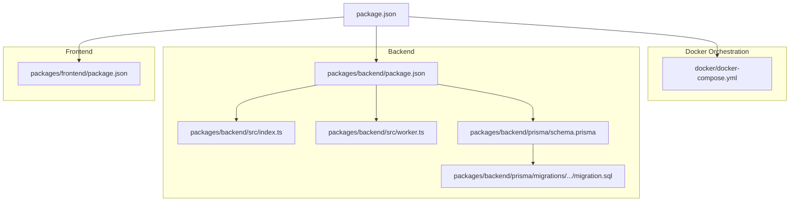

**Diagram sources**

- [docker-compose.yml:1-71](file://docker/docker-compose.yml#L1-L71)
- [backend package.json:1-51](file://packages/backend/package.json#L1-L51)
- [backend index.ts:1-136](file://packages/backend/src/index.ts#L1-L136)
- [backend worker.ts:1-30](file://packages/backend/src/worker.ts#L1-L30)
- [Prisma schema:1-430](file://packages/backend/prisma/schema.prisma#L1-L430)
- [Baseline migration SQL:1-471](file://packages/backend/prisma/migrations/20260416120000_baseline_schema/migration.sql#L1-L471)
- [root package.json:1-43](file://package.json#L1-L43)

**Section sources**

- [docker-compose.yml:1-71](file://docker/docker-compose.yml#L1-L71)
- [backend package.json:1-51](file://packages/backend/package.json#L1-L51)
- [backend index.ts:1-136](file://packages/backend/src/index.ts#L1-L136)
- [backend worker.ts:1-30](file://packages/backend/src/worker.ts#L1-L30)
- [Prisma schema:1-430](file://packages/backend/prisma/schema.prisma#L1-L430)
- [Baseline migration SQL:1-471](file://packages/backend/prisma/migrations/20260416120000_baseline_schema/migration.sql#L1-L471)
- [root package.json:1-43](file://package.json#L1-L43)

## Core Components

- PostgreSQL (primary relational database)
- Redis (in-memory cache and queue backend)
- MinIO (object storage compatible with S3)
- Backend API server (Fastify)
- Workers (queue processors for video, import, and image jobs)
- Frontend (Vue-based web app)

Key runtime characteristics:

- Backend listens on port 4000 and exposes a health endpoint.
- Workers run as separate processes with graceful shutdown hooks.
- Prisma manages schema and migrations against PostgreSQL.
- BullMQ with ioredis powers asynchronous job queues.
- OpenAI SDK integration indicates LLM-based AI workflows.
- AWS SDK S3 client indicates optional S3 compatibility for object storage.

**Section sources**

- [backend index.ts:117-127](file://packages/backend/src/index.ts#L117-L127)
- [backend worker.ts:1-30](file://packages/backend/src/worker.ts#L1-L30)
- [backend package.json:22-38](file://packages/backend/package.json#L22-L38)
- [Prisma schema:1-8](file://packages/backend/prisma/schema.prisma#L1-L8)

## Architecture Overview

The platform runs in containers orchestrated by Docker Compose. The backend API and workers depend on PostgreSQL for persistence, Redis for caching and queues, and MinIO for storing generated videos and assets. The frontend consumes the backend API.

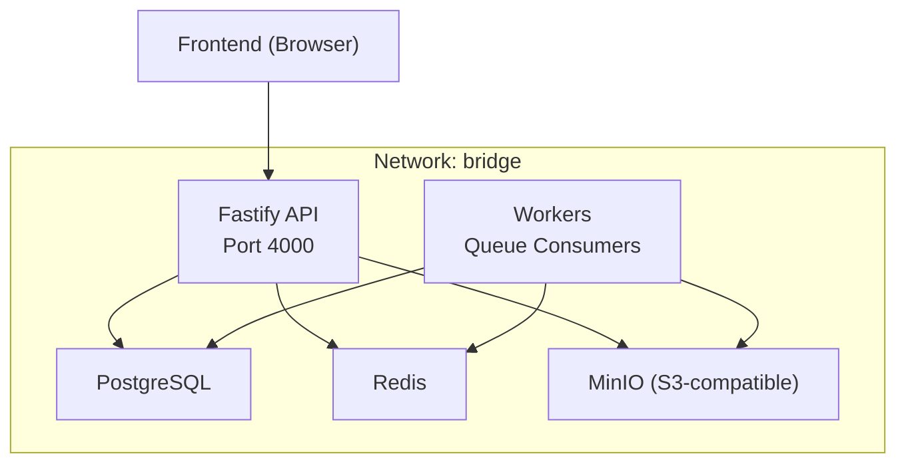

**Diagram sources**

- [docker-compose.yml:3-71](file://docker/docker-compose.yml#L3-L71)
- [backend index.ts:117-127](file://packages/backend/src/index.ts#L117-L127)
- [backend worker.ts:1-30](file://packages/backend/src/worker.ts#L1-L30)
- [backend package.json:33-36](file://packages/backend/package.json#L33-L36)

## Detailed Component Analysis

### PostgreSQL Database

- Provider: PostgreSQL 16 (Alpine)
- Persistence: Named volume for data
- Credentials: Environment-configured database, user, and password
- Health check: Uses pg_isready to verify readiness
- Schema: Managed by Prisma with migrations applied via backend scripts

Operational notes:

- DATABASE_URL is sourced from environment variables in Prisma configuration.
- Migrations are executed via backend scripts; baseline schema aligns with Prisma models.
- Indexes and foreign keys are defined in the baseline migration SQL.

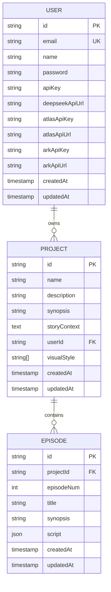

**Diagram sources**

- [Prisma schema:10-53](file://packages/backend/prisma/schema.prisma#L10-L53)
- [Baseline migration SQL:6-50](file://packages/backend/prisma/migrations/20260416120000_baseline_schema/migration.sql#L6-L50)

**Section sources**

- [docker-compose.yml:4-19](file://docker/docker-compose.yml#L4-L19)
- [Prisma schema:5-8](file://packages/backend/prisma/schema.prisma#L5-L8)
- [Baseline migration SQL:1-471](file://packages/backend/prisma/migrations/20260416120000_baseline_schema/migration.sql#L1-L471)

### Redis

- Provider: Redis 7 (Alpine)
- Persistence: Named volume for data
- Health check: redis-cli ping
- Usage: Caching and as the queue backend for BullMQ workers

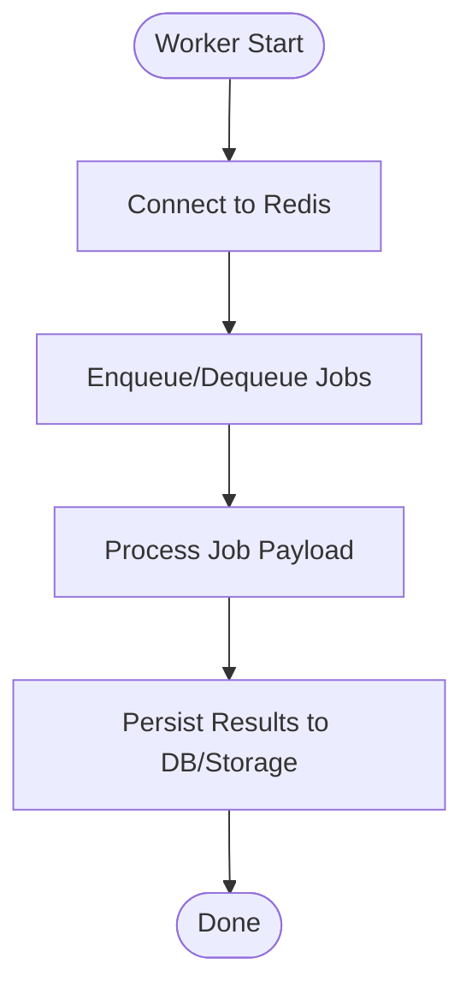

**Diagram sources**

- [docker-compose.yml:21-32](file://docker/docker-compose.yml#L21-L32)
- [backend package.json:33-36](file://packages/backend/package.json#L33-L36)
- [backend worker.ts:5-7](file://packages/backend/src/worker.ts#L5-L7)

**Section sources**

- [docker-compose.yml:21-32](file://docker/docker-compose.yml#L21-L32)
- [backend package.json:33-36](file://packages/backend/package.json#L33-L36)
- [backend worker.ts:1-30](file://packages/backend/src/worker.ts#L1-L30)

### MinIO (Object Storage)

- Provider: MinIO latest
- Ports: 9000 (API), 9001 (Console)
- Credentials: Root user and password configured via environment
- Health check: Live endpoint via curl
- Bootstrap: A one-off init container creates buckets and sets anonymous downloads

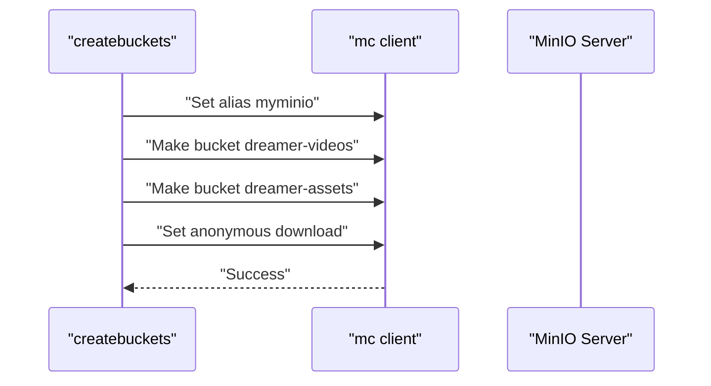

**Diagram sources**

- [docker-compose.yml:52-65](file://docker/docker-compose.yml#L52-L65)

**Section sources**

- [docker-compose.yml:34-65](file://docker/docker-compose.yml#L34-L65)

### Backend API Server

- Framework: Fastify
- Plugins: CORS, JWT, multipart/form-data, Swagger/OpenAPI, Server-Sent Events
- Routes: Authentication, projects, episodes, characters, locations, scenes, shots, tasks, compositions, stats, import, settings, pipeline, image generation jobs, model API calls, memories
- Health endpoint: GET /health
- Request timeouts: Configured for long-running connections and SSE

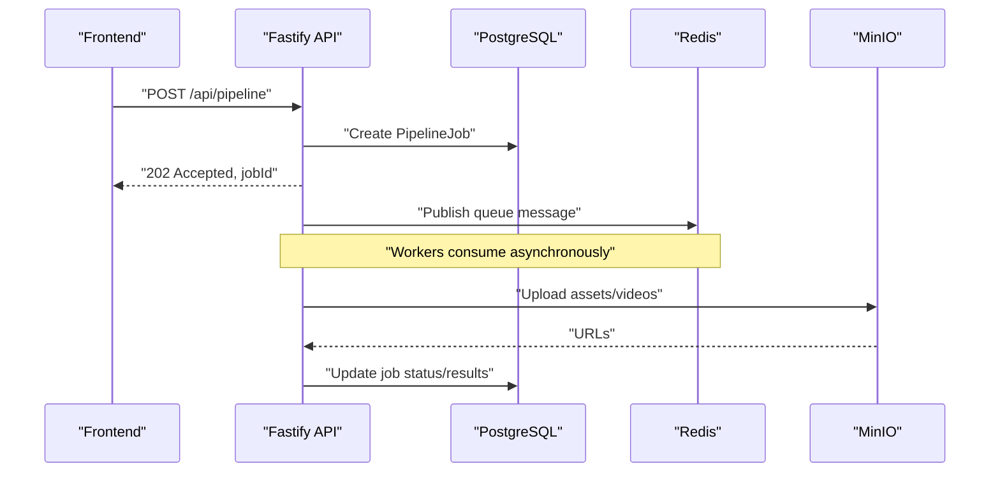

**Diagram sources**

- [backend index.ts:88-118](file://packages/backend/src/index.ts#L88-L118)
- [Prisma schema:314-330](file://packages/backend/prisma/schema.prisma#L314-L330)

**Section sources**

- [backend index.ts:35-127](file://packages/backend/src/index.ts#L35-L127)

### Workers

- Separate process from the API server
- Concurrency:
  - Video generation worker: named “video-generation” with concurrency 5
  - Import worker: named “import” with concurrency 2
  - Image generation worker: named “image-generation” with concurrency 3
- Graceful shutdown on SIGINT/SIGTERM closes queues and exits cleanly

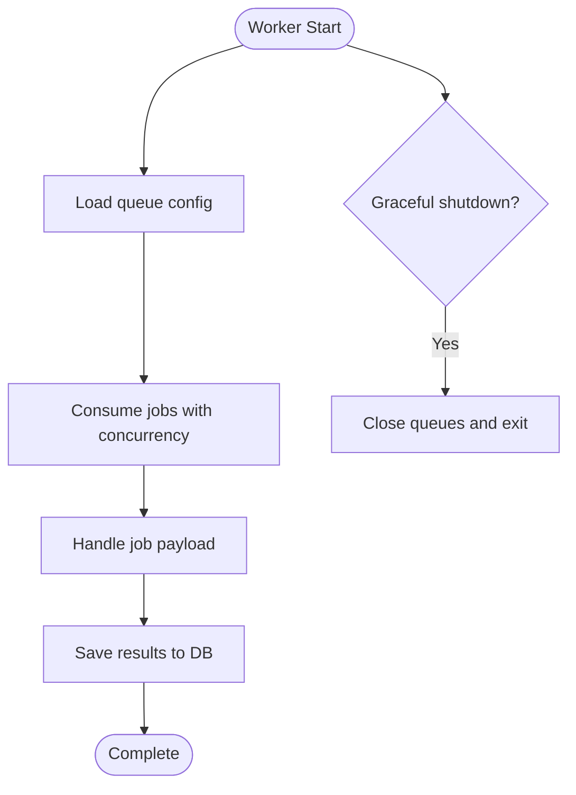

**Diagram sources**

- [backend worker.ts:9-21](file://packages/backend/src/worker.ts#L9-L21)

**Section sources**

- [backend worker.ts:1-30](file://packages/backend/src/worker.ts#L1-L30)

### Prisma ORM Setup

- Client provider: prisma-client-js
- Data source: PostgreSQL, URL from environment
- Models: Users, Projects, Episodes, Characters, Locations, Scenes, Shots, CharacterShots, SceneDialogue, Takes, ModelApiCall, Compositions, CompositionScene, ImportTask, PipelineJob, PipelineStepResult, ProjectAssets, Memory items and snapshots
- Migrations: Baseline schema and subsequent migrations under prisma/migrations

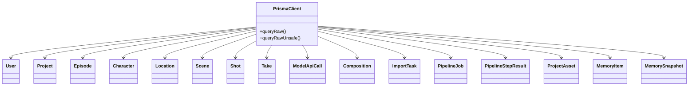

**Diagram sources**

- [Prisma schema:10-429](file://packages/backend/prisma/schema.prisma#L10-L429)

**Section sources**

- [Prisma schema:1-8](file://packages/backend/prisma/schema.prisma#L1-L8)
- [Baseline migration SQL:1-471](file://packages/backend/prisma/migrations/20260416120000_baseline_schema/migration.sql#L1-L471)

### Container Networking

- Services share the default bridge network in Docker Compose.
- Internal DNS resolution:
  - Backend connects to postgres, redis, and minio by service name.
  - Workers connect to redis and minio similarly.
- Port exposure:
  - PostgreSQL: 5432
  - Redis: 6379
  - MinIO: 9000, 9001
  - Backend API: 4000 (host binding is not defined in Compose, so default is container-local bind)

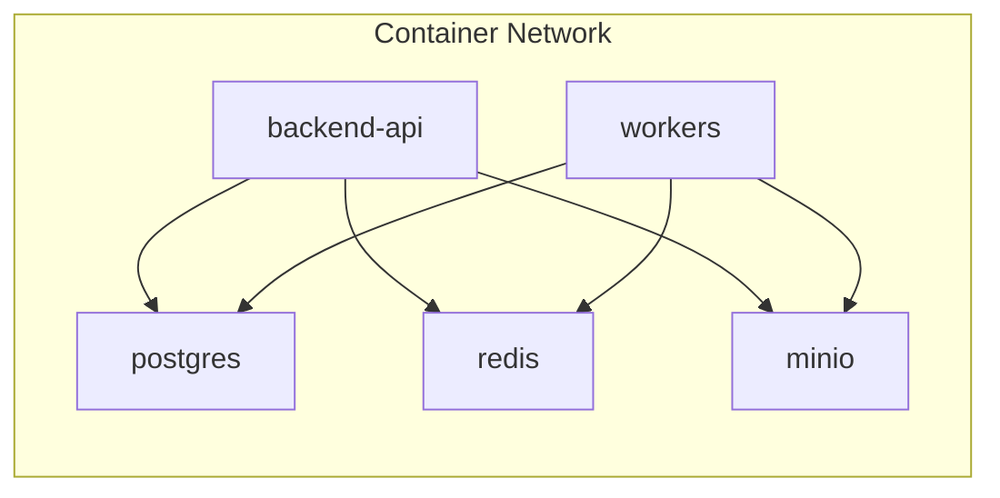

**Diagram sources**

- [docker-compose.yml:3-71](file://docker/docker-compose.yml#L3-L71)

**Section sources**

- [docker-compose.yml:1-71](file://docker/docker-compose.yml#L1-L71)

### Environment Variables and Configuration

- Backend reads environment variables for:
  - CORS origin
  - JWT secret
  - Database URL (via Prisma)
  - AI provider URLs and keys (DeepSeek, Atlas, Ark) on User model
- Docker Compose defines service-specific environment variables for:
  - PostgreSQL: database, user, password
  - Redis: none (defaults)
  - MinIO: root user and password
- Root workspace scripts expose commands to bring up/down the stack and run backend/worker processes.

Recommended environment variables (from code):

- DATABASE_URL
- JWT_SECRET
- CORS_ORIGIN
- Optional AI provider keys and URLs on per-user basis

**Section sources**

- [backend index.ts:48-56](file://packages/backend/src/index.ts#L48-L56)
- [Prisma schema:16-20](file://packages/backend/prisma/schema.prisma#L16-L20)
- [docker-compose.yml:7-40](file://docker/docker-compose.yml#L7-L40)
- [root package.json:17-18](file://package.json#L17-L18)

### AI Service Integrations and External APIs

- OpenAI SDK integration indicates potential use of OpenAI models for text/image/video generation workflows.
- AWS SDK S3 client suggests compatibility with S3-compatible storage; MinIO is used locally, but S3 client enables cloud storage integration.
- Users can configure provider URLs and keys per account (fields present on User model), enabling multi-provider support.

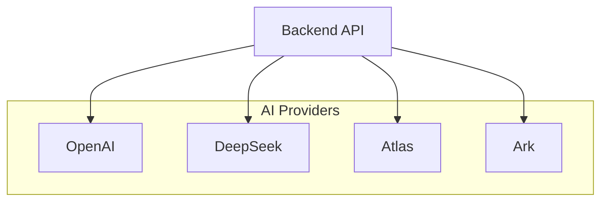

**Diagram sources**

- [backend package.json:37-37](file://packages/backend/package.json#L37-L37)
- [Prisma schema:16-20](file://packages/backend/prisma/schema.prisma#L16-L20)

**Section sources**

- [backend package.json:24-38](file://packages/backend/package.json#L24-L38)
- [Prisma schema:16-20](file://packages/backend/prisma/schema.prisma#L16-L20)

### Video Generation Workflows

- Asynchronous job processing:
  - API enqueues jobs into Redis queues.
  - Workers consume jobs and coordinate with AI providers and storage.
  - Results are persisted to PostgreSQL and stored in MinIO.
- Endpoints involved:
  - Pipeline routes for orchestrating multi-step workflows.
  - Image generation job routes for image-related tasks.
  - Model API call routes for tracking provider calls and costs.

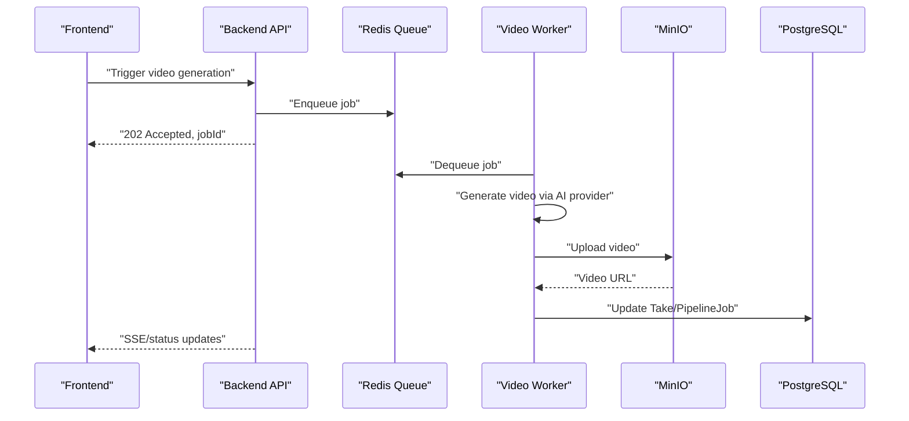

**Diagram sources**

- [backend index.ts:108-115](file://packages/backend/src/index.ts#L108-L115)
- [backend worker.ts:5-7](file://packages/backend/src/worker.ts#L5-L7)
- [Prisma schema:216-238](file://packages/backend/prisma/schema.prisma#L216-L238)

**Section sources**

- [backend index.ts:88-118](file://packages/backend/src/index.ts#L88-L118)
- [backend worker.ts:1-30](file://packages/backend/src/worker.ts#L1-L30)
- [Prisma schema:216-238](file://packages/backend/prisma/schema.prisma#L216-L238)

## Dependency Analysis

- Backend depends on:
  - Prisma client for database operations
  - BullMQ/ioredis for queues
  - OpenAI SDK for AI integrations
  - AWS SDK S3 client for object storage compatibility
- Docker Compose ties services together with health checks and persistent volumes.
- Root scripts orchestrate development and Docker operations.

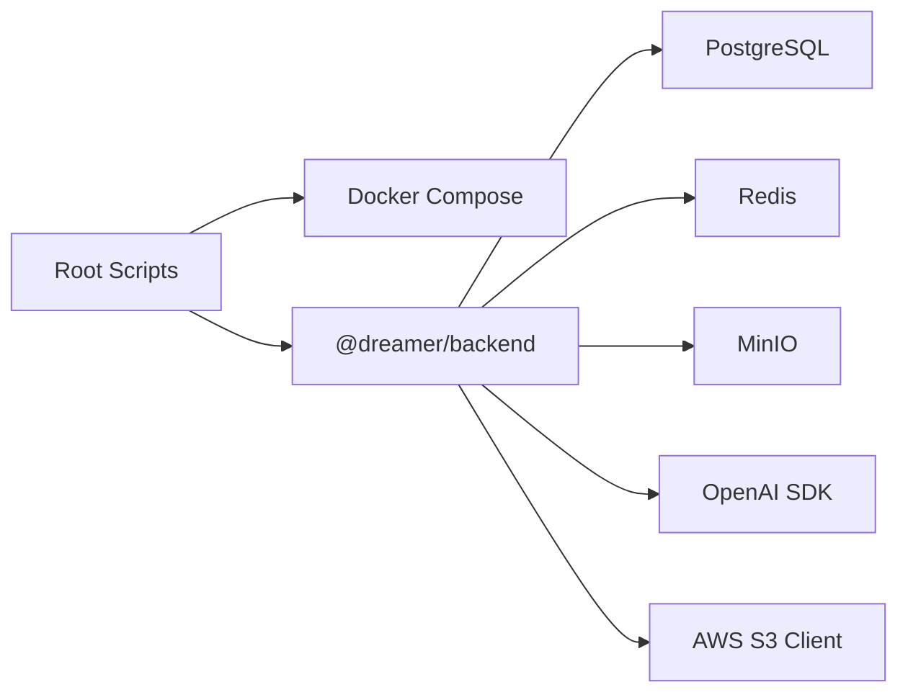

**Diagram sources**

- [root package.json:9-22](file://package.json#L9-L22)
- [docker-compose.yml:3-71](file://docker/docker-compose.yml#L3-L71)
- [backend package.json:24-38](file://packages/backend/package.json#L24-L38)

**Section sources**

- [root package.json:9-22](file://package.json#L9-L22)
- [docker-compose.yml:3-71](file://docker/docker-compose.yml#L3-L71)
- [backend package.json:24-38](file://packages/backend/package.json#L24-L38)

## Performance Considerations

- Queue concurrency tuning:
  - Adjust worker concurrency based on CPU, GPU, and provider rate limits.
  - Monitor Redis memory usage and queue backlog.
- Database:
  - Ensure appropriate PostgreSQL sizing and indexing for high-throughput writes during pipeline execution.
- Storage:
  - Use MinIO for local development; consider S3-compatible backends for production scalability.
- API:
  - Keep request timeouts reasonable for SSE and long-running tasks.
- Caching:
  - Use Redis for short-lived caches and rate-limiting to reduce provider API calls.

[No sources needed since this section provides general guidance]

## Troubleshooting Guide

- Health checks:
  - PostgreSQL: pg_isready-based health check.
  - Redis: redis-cli ping.
  - MinIO: live endpoint check.
- Bucket initialization:
  - The createbuckets service ensures buckets exist and anonymous downloads are enabled.
- Graceful shutdown:
  - Workers handle SIGINT/SIGTERM to close queues cleanly.
- Database connectivity:
  - Verify DATABASE_URL and Prisma migrations are applied.
- CORS/JWT:
  - Confirm CORS_ORIGIN and JWT_SECRET are set appropriately.

**Section sources**

- [docker-compose.yml:15-50](file://docker/docker-compose.yml#L15-L50)
- [docker-compose.yml:52-65](file://docker/docker-compose.yml#L52-L65)
- [backend worker.ts:14-29](file://packages/backend/src/worker.ts#L14-L29)
- [Prisma schema:5-8](file://packages/backend/prisma/schema.prisma#L5-L8)

## Conclusion

The Dreamer platform’s infrastructure centers on a Docker Compose-managed stack with PostgreSQL, Redis, and MinIO supporting a Fastify backend and dedicated workers. Prisma handles schema and migrations, while BullMQ and Redis power asynchronous workflows for video, import, and image generation. The design supports scalable, event-driven video generation pipelines with clear health checks, environment-driven configuration, and extensibility for AI providers and storage backends.
