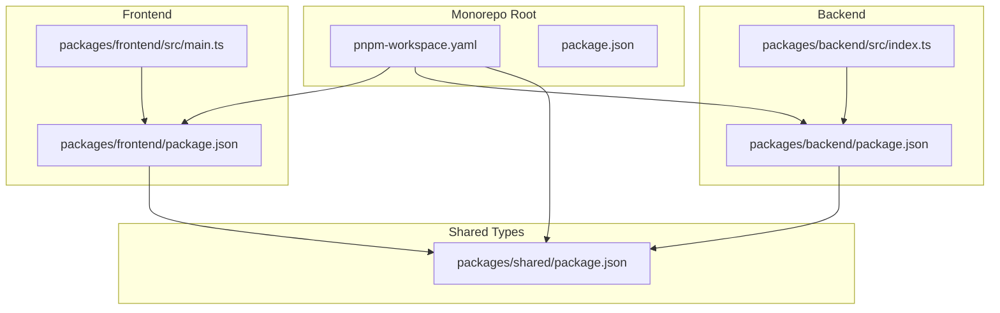
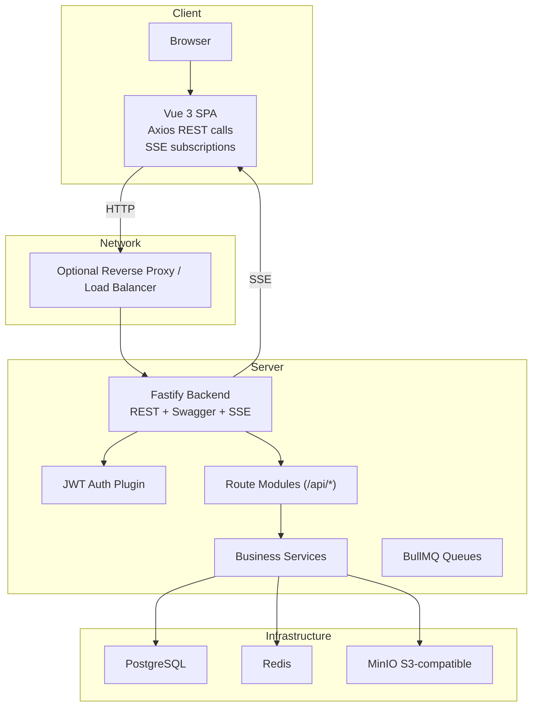
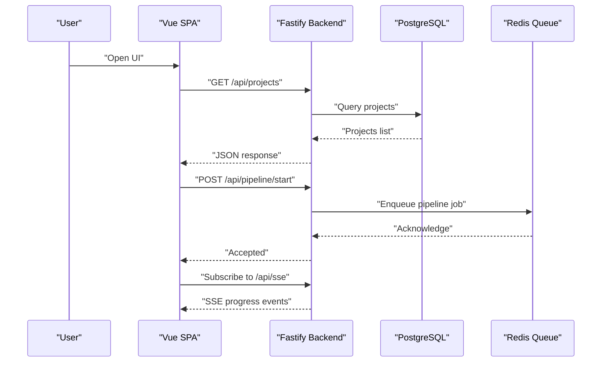
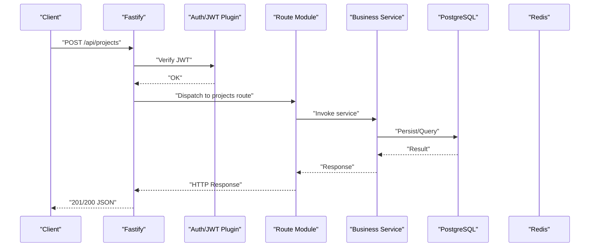
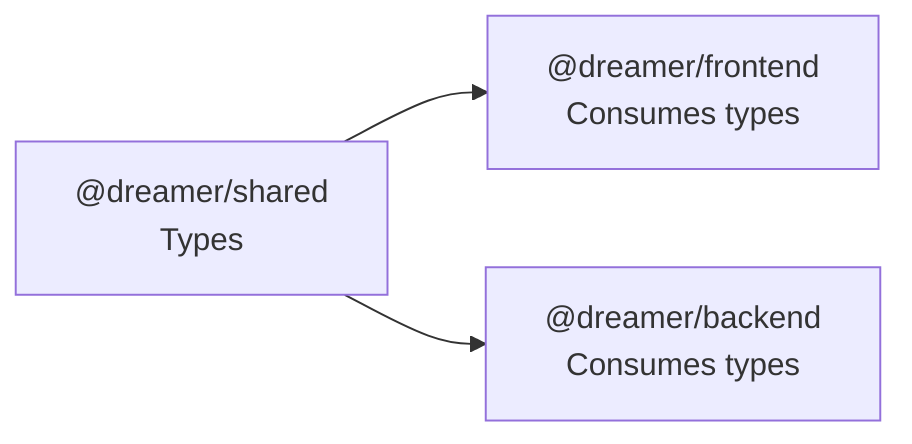
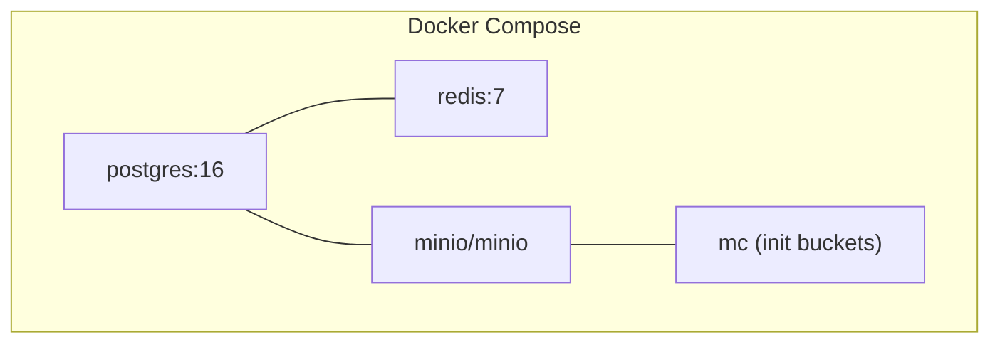
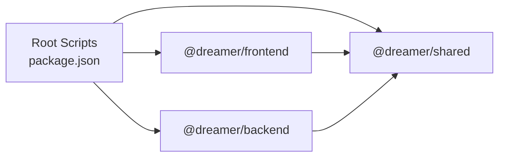

# System Design

<cite>
**Referenced Files in This Document**
- [README.md](file://README.md)
- [package.json](file://package.json)
- [pnpm-workspace.yaml](file://pnpm-workspace.yaml)
- [docker/docker-compose.yml](file://docker/docker-compose.yml)
- [packages/frontend/package.json](file://packages/frontend/package.json)
- [packages/frontend/src/main.ts](file://packages/frontend/src/main.ts)
- [packages/backend/package.json](file://packages/backend/package.json)
- [packages/backend/src/index.ts](file://packages/backend/src/index.ts)
- [packages/shared/package.json](file://packages/shared/package.json)
</cite>

## Table of Contents

1. [Introduction](#introduction)
2. [Project Structure](#project-structure)
3. [Core Components](#core-components)
4. [Architecture Overview](#architecture-overview)
5. [Detailed Component Analysis](#detailed-component-analysis)
6. [Dependency Analysis](#dependency-analysis)
7. [Performance Considerations](#performance-considerations)
8. [Security Patterns](#security-patterns)
9. [Scalability Considerations](#scalability-considerations)
10. [Troubleshooting Guide](#troubleshooting-guide)
11. [Conclusion](#conclusion)

## Introduction

Dreamer is an AI-powered short-video production platform that transforms a one-sentence idea into finished videos. It follows a modern monorepo architecture with:

- A Vue 3 single-page application (SPA) frontend
- A Fastify-based backend microservice exposing REST APIs
- Shared TypeScript types across packages
- Integrated infrastructure via Docker Compose for databases, caching, object storage, and development tooling

The platform emphasizes API-driven workflows, with AI services integrated for script generation, low-cost video iteration, and high-quality fine-tuning.

## Project Structure

The repository is organized as a pnpm workspace with three primary packages:

- packages/frontend: Vue 3 SPA with TypeScript, Pinia, and Vue Router
- packages/backend: Fastify REST API server with Prisma ORM, BullMQ job queues, and AI integrations
- packages/shared: Shared TypeScript types exported for cross-package usage

**Diagram sources**

- [pnpm-workspace.yaml](file://pnpm-workspace.yaml)
- [package.json](file://package.json)
- [packages/frontend/package.json](file://packages/frontend/package.json)
- [packages/frontend/src/main.ts](file://packages/frontend/src/main.ts)
- [packages/backend/package.json](file://packages/backend/package.json)
- [packages/backend/src/index.ts](file://packages/backend/src/index.ts)
- [packages/shared/package.json](file://packages/shared/package.json)

**Section sources**

- [README.md](file://README.md)
- [pnpm-workspace.yaml](file://pnpm-workspace.yaml)
- [package.json](file://package.json)

## Core Components

- Frontend SPA (Vue 3 + TypeScript): Provides project management, AI-assisted scripting, storyboard editing, character and location management, and video composition workflows. It consumes the backend REST API and subscribes to server-sent events for real-time updates.
- Backend Microservice (Fastify + TypeScript): Exposes REST endpoints under /api/\*, registers Swagger/OpenAPI documentation, handles JWT authentication, multipart uploads, and SSE subscriptions. It orchestrates business logic, interacts with AI providers, and manages asynchronous jobs via BullMQ.
- Shared Types: Centralized type definitions published via the @dreamer/shared package, enabling compile-time type safety across frontend and backend.

Key runtime ports and endpoints:

- Frontend: http://localhost:3000
- Backend API: http://localhost:4000
- API Docs: http://localhost:4000/docs
- MinIO Console: http://localhost:9001

**Section sources**

- [README.md](file://README.md)
- [packages/frontend/package.json](file://packages/frontend/package.json)
- [packages/frontend/src/main.ts](file://packages/frontend/src/main.ts)
- [packages/backend/src/index.ts](file://packages/backend/src/index.ts)
- [packages/shared/package.json](file://packages/shared/package.json)

## Architecture Overview

The system is composed of client-server boundaries with clear separation of concerns:

- Client boundary: Vue 3 SPA handles UI rendering, state management (Pinia), routing, and API communication.
- Server boundary: Fastify backend exposes REST APIs, enforces authentication, and coordinates AI services and storage.
- Infrastructure boundary: PostgreSQL (via Prisma), Redis (via BullMQ), and MinIO provide persistence, queueing, and object storage.

**Diagram sources**

- [packages/backend/src/index.ts](file://packages/backend/src/index.ts)
- [packages/frontend/src/main.ts](file://packages/frontend/src/main.ts)

## Detailed Component Analysis

### Frontend SPA

- Composition and bootstrapping: Initializes Vue app, Pinia, Vue Router, and Naive UI; mounts to DOM.
- Communication pattern: Uses Axios for REST requests to the backend API and subscribes to server-sent events for live updates.
- State management: Pinia stores encapsulate domain-specific state (projects, episodes, scenes, characters, compositions).
- Routing: Vue Router organizes views for project management, storyboard editing, jobs, and settings.

**Diagram sources**

- [packages/frontend/src/main.ts](file://packages/frontend/src/main.ts)
- [packages/backend/src/index.ts](file://packages/backend/src/index.ts)

**Section sources**

- [packages/frontend/src/main.ts](file://packages/frontend/src/main.ts)
- [packages/frontend/package.json](file://packages/frontend/package.json)

### Backend REST API and Plugins

- Bootstrap and plugins:
  - CORS, JWT, multipart upload, Swagger/OpenAPI UI, SSE plugin, and auth plugin are registered early.
  - Route modules are mounted under /api/\* namespaces for projects, episodes, characters, scenes, shots, tasks, compositions, stats, import, settings, pipeline, image generation jobs, model API calls, and memories.
- Authentication: JWT-based authentication enforced via a dedicated plugin.
- Real-time updates: SSE plugin enables long-lived connections for progress notifications.
- Health checks: /health endpoint returns operational status.

**Diagram sources**

- [packages/backend/src/index.ts](file://packages/backend/src/index.ts)
- [packages/backend/package.json](file://packages/backend/package.json)

**Section sources**

- [packages/backend/src/index.ts](file://packages/backend/src/index.ts)
- [packages/backend/package.json](file://packages/backend/package.json)

### Shared Types Package

- Purpose: Publishes centralized TypeScript types consumed by both frontend and backend.
- Export shape: Main export and a named export for types to support ergonomic imports across packages.
- Build: TypeScript compilation produces distributable types for consumers.

**Diagram sources**

- [packages/shared/package.json](file://packages/shared/package.json)

**Section sources**

- [packages/shared/package.json](file://packages/shared/package.json)

### Infrastructure Dependencies and Deployment Topology

- Local development uses Docker Compose to provision:
  - PostgreSQL database
  - Redis cache/queue
  - MinIO S3-compatible object storage with buckets for videos and assets
- Scripts orchestrate lifecycle:
  - docker:up/down for infrastructure
  - db:push/db:migrate for schema management
  - dev/dev:backend/dev:frontend for local runs

**Diagram sources**

- [docker/docker-compose.yml](file://docker/docker-compose.yml)

**Section sources**

- [docker/docker-compose.yml](file://docker/docker-compose.yml)
- [package.json](file://package.json)

## Dependency Analysis

- Monorepo tooling: pnpm workspace coordinates package builds and scripts.
- Frontend depends on @dreamer/shared for shared types and UI libraries.
- Backend depends on @dreamer/shared and integrates Prisma, BullMQ, OpenAI SDK, AWS S3 client, and Fastify ecosystem plugins.
- Workspace scripts enable parallel development and coordinated builds.

**Diagram sources**

- [package.json](file://package.json)
- [pnpm-workspace.yaml](file://pnpm-workspace.yaml)
- [packages/frontend/package.json](file://packages/frontend/package.json)
- [packages/backend/package.json](file://packages/backend/package.json)
- [packages/shared/package.json](file://packages/shared/package.json)

**Section sources**

- [package.json](file://package.json)
- [pnpm-workspace.yaml](file://pnpm-workspace.yaml)
- [packages/frontend/package.json](file://packages/frontend/package.json)
- [packages/backend/package.json](file://packages/backend/package.json)
- [packages/shared/package.json](file://packages/shared/package.json)

## Performance Considerations

- Asynchronous processing: Long-running tasks (image/video generation) are queued via BullMQ to prevent blocking the API.
- Streaming updates: SSE reduces polling overhead and improves UX responsiveness during pipeline execution.
- Resource limits: Multipart upload size limits are configured to manage payload sizes.
- Database and cache: Prisma and Redis are designed to handle concurrent workloads typical of media production workflows.

[No sources needed since this section provides general guidance]

## Security Patterns

- Authentication: JWT-based authentication enforced via a Fastify plugin.
- Authorization: Route handlers should validate ownership and permissions for mutating resources.
- Transport security: CORS configuration supports secure cross-origin access; production deployments should restrict origins.
- Secrets management: Environment variables for database URLs, Redis, S3, JWT secrets, and AI provider keys are loaded via a bootstrap script.

**Section sources**

- [packages/backend/src/index.ts](file://packages/backend/src/index.ts)
- [packages/backend/package.json](file://packages/backend/package.json)

## Scalability Considerations

- Horizontal scaling: Run multiple backend instances behind a load balancer; ensure shared Redis and PostgreSQL are externally reachable.
- Queue scaling: Distribute workers across machines to process BullMQ jobs concurrently.
- Storage scalability: MinIO supports distributed deployments; configure replication and retention policies.
- CDN and asset delivery: Serve MinIO objects via CDN for global distribution of generated assets.
- Observability: Add metrics, structured logging, and tracing to monitor throughput and latency.

[No sources needed since this section provides general guidance]

## Troubleshooting Guide

- Local environment startup:
  - Bring up infrastructure: docker compose up -d
  - Initialize database: pnpm db:push or pnpm db:migrate
  - Start services: pnpm dev for full stack or pnpm dev:backend/dev:frontend for focused development
- Health checks:
  - Verify backend health: GET /health
  - Access API docs: /docs for interactive Swagger UI
- Common issues:
  - CORS errors: Confirm CORS_ORIGIN environment variable and browser origin.
  - Upload failures: Check multipart limits and network connectivity to MinIO.
  - Queue not processing: Inspect Redis connectivity and worker processes.

**Section sources**

- [README.md](file://README.md)
- [docker/docker-compose.yml](file://docker/docker-compose.yml)
- [packages/backend/src/index.ts](file://packages/backend/src/index.ts)

## Conclusion

Dreamer’s architecture balances developer productivity and system reliability through a clean separation of frontend and backend, robust asynchronous processing, and shared type safety. The monorepo structure simplifies coordination across packages while enabling independent development. With Docker-based infrastructure and modular plugins, the platform is well-positioned for iterative enhancements, scalable deployments, and secure operations.
