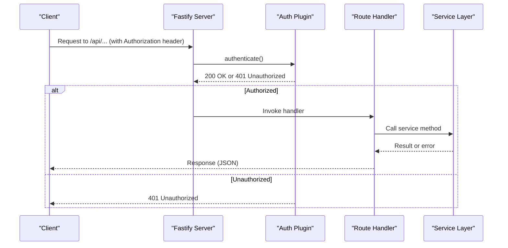
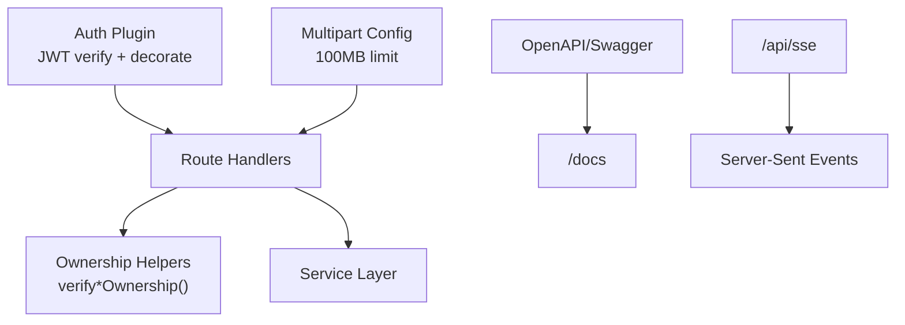

# API Endpoints

<cite>
**Referenced Files in This Document**
- [index.ts](file://packages/backend/src/index.ts)
- [auth.ts](file://packages/backend/src/plugins/auth.ts)
- [auth.ts](file://packages/backend/src/routes/auth.ts)
- [projects.ts](file://packages/backend/src/routes/projects.ts)
- [episodes.ts](file://packages/backend/src/routes/episodes.ts)
- [characters.ts](file://packages/backend/src/routes/characters.ts)
- [locations.ts](file://packages/backend/src/routes/locations.ts)
- [shots.ts](file://packages/backend/src/routes/shots.ts)
- [compositions.ts](file://packages/backend/src/routes/compositions.ts)
- [tasks.ts](file://packages/backend/src/routes/tasks.ts)
- [pipeline.ts](file://packages/backend/src/routes/pipeline.ts)
- [takes.ts](file://packages/backend/src/routes/takes.ts)
- [character-shots.ts](file://packages/backend/src/routes/character-shots.ts)
</cite>

## Table of Contents

1. [Introduction](#introduction)
2. [Project Structure](#project-structure)
3. [Core Components](#core-components)
4. [Architecture Overview](#architecture-overview)
5. [Detailed Component Analysis](#detailed-component-analysis)
6. [Dependency Analysis](#dependency-analysis)
7. [Performance Considerations](#performance-considerations)
8. [Troubleshooting Guide](#troubleshooting-guide)
9. [Conclusion](#conclusion)

## Introduction

This document provides comprehensive API documentation for the backend service built with Fastify. It covers all route groups, including authentication, project management, episode management, character management, location management, shot generation, composition, pipeline orchestration, and task management. For each endpoint, we specify HTTP methods, URL patterns, request/response schemas, authentication requirements, and error responses. We also document OpenAPI/Swagger integration, parameter validation, and example requests/responses. Pagination, filtering, sorting, and rate limiting are noted where applicable.

## Project Structure

The server registers multiple route groups under the /api namespace and exposes an OpenAPI specification with Swagger UI. Authentication is enforced via a JWT plugin and per-resource ownership checks.

```mermaid
graph TB
Client["Client"] --> SwaggerUI["Swagger UI<br/>/docs"]
Client --> APIAuth["/api/auth/*"]
Client --> APIProjects["/api/projects/*"]
Client --> APIEpisodes["/api/episodes/*"]
Client --> APILocations["/api/locations/*"]
Client --> APITasks["/api/tasks/*"]
Client --> APICompositions["/api/compositions/*"]
Client --> APIPipeline["/api/pipeline/*"]
Client --> APIShots["/api/shots/*"]
Client --> APITakes["/api/takes/*"]
Client --> APICharacters["/api/characters/*"]
Client --> APICharImages["/api/character-images/*"]
Client --> APICharShots["/api/character-shots/*"]
Client --> APIImport["/api/import/*"]
Client --> APIMemory["/api/memories/*"]
Client --> APISSE["/api/sse"]
Client --> APIHealth["/health"]
```

**Diagram sources**

- [index.ts:84-110](file://packages/backend/src/index.ts#L84-L110)

**Section sources**

- [index.ts:35-122](file://packages/backend/src/index.ts#L35-L122)

## Core Components

- OpenAPI/Swagger: Registered with metadata and served under /docs.
- Authentication: JWT-based, enforced globally via a plugin decorator and per-handler preHandlers.
- Ownership verification: Route handlers validate that the authenticated user owns the resource (project, episode, scene, character, composition, task, location, shot, character-shot).
- File uploads: Multipart support configured with a 100 MB limit; several endpoints accept file uploads for images.

**Section sources**

- [index.ts:59-70](file://packages/backend/src/index.ts#L59-L70)
- [index.ts:80-81](file://packages/backend/src/index.ts#L80-L81)
- [auth.ts:12-35](file://packages/backend/src/plugins/auth.ts#L12-L35)

## Architecture Overview

The API follows a modular Fastify plugin and route registration pattern. Each route group encapsulates related endpoints and applies shared middleware for authentication and ownership checks.

**Diagram sources**

- [index.ts:84-110](file://packages/backend/src/index.ts#L84-L110)
- [auth.ts:12-35](file://packages/backend/src/plugins/auth.ts#L12-L35)

## Detailed Component Analysis

### Authentication (/api/auth)

- Base path: /api/auth
- Authentication requirement: Not required for register/login; /api/auth/me requires JWT.
- OpenAPI: Exposed automatically via Swagger registration.

Endpoints:

- POST /api/auth/register
  - Description: Registers a new user.
  - Authentication: None.
  - Request body:
    - email: string
    - password: string
    - name: string
  - Responses:
    - 200: { accessToken: string, refreshToken: string, user: object }
    - 400: { error: string }

- POST /api/auth/login
  - Description: Logs in an existing user.
  - Authentication: None.
  - Request body:
    - email: string
    - password: string
  - Responses:
    - 200: { accessToken: string, refreshToken: string, user: object }
    - 401: { error: string }

- GET /api/auth/me
  - Description: Returns the current user profile.
  - Authentication: JWT required.
  - Responses:
    - 200: { user object }
    - 401: { error: string }

Example request (login):

- POST /api/auth/login
- Headers: Content-Type: application/json
- Body: { "email": "...", "password": "..." }

Example response (login):

- 200: { "accessToken": "...", "refreshToken": "...", "user": { "id": "...", "email": "...", "name": "..." } }

**Section sources**

- [auth.ts:4-64](file://packages/backend/src/routes/auth.ts#L4-L64)
- [index.ts:59-70](file://packages/backend/src/index.ts#L59-L70)

### Project Management (/api/projects)

- Base path: /api/projects
- Authentication: All endpoints require JWT.
- Ownership: Operations scoped to the authenticated user’s projects.

Endpoints:

- GET /api/projects/
  - Description: Lists projects for the current user.
  - Responses: 200: array of projects

- POST /api/projects/
  - Description: Creates a new project.
  - Request body:
    - name: string
    - description?: string
    - aspectRatio?: string
  - Responses:
    - 201: project object
    - 400/422: error details

- POST /api/projects/:id/episodes/generate-first
  - Description: Generates the first episode for a project.
  - Request body:
    - description?: string
  - Responses:
    - 200: { episode: object, synopsis: string }
    - 4xx: error details

- POST /api/projects/:id/episodes/generate-remaining
  - Description: Asynchronously generates remaining episodes.
  - Request body:
    - targetEpisodes?: number
  - Responses:
    - 200: { jobId: string, status: string, targetEpisodes?: number, message: string }
    - 4xx: error details

- POST /api/projects/:id/parse
  - Description: Parses script into entities, slots, and episode synopses (asynchronous).
  - Request body:
    - targetEpisodes?: number
  - Responses:
    - 200: { jobId: string, status: string, message: string }
    - 4xx: error details

- GET /api/projects/:id/outline-active-job
  - Description: Checks for active outline-related jobs.
  - Responses:
    - 200: { job: object|null }
    - 4xx: error details

- GET /api/projects/:id
  - Description: Retrieves a project by ID.
  - Responses:
    - 200: project object
    - 404: { error: string }

- PUT /api/projects/:id
- PATCH /api/projects/:id
  - Description: Updates a project.
  - Request body:
    - name?: string
    - description?: string
    - synopsis?: string|null
    - visualStyle?: string[]
    - aspectRatio?: string
  - Responses:
    - 200: updated project
    - 4xx: error details

- DELETE /api/projects/:id
  - Description: Deletes a project.
  - Responses:
    - 204: empty
    - 404: { error: string }

Example request (create project):

- POST /api/projects/
- Headers: Authorization: Bearer ...
- Body: { "name": "My Project", "aspectRatio": "16:9" }

Example response (create project):

- 201: { "id": "...", "name": "My Project", "aspectRatio": "16:9", ... }

**Section sources**

- [projects.ts:4-228](file://packages/backend/src/routes/projects.ts#L4-L228)

### Episode Management (/api/episodes)

- Base path: /api/episodes
- Authentication: All endpoints require JWT.
- Ownership: Enforced via verifyEpisodeOwnership and verifyProjectOwnership helpers.

Endpoints:

- GET /api/episodes/?projectId=...
  - Description: Lists episodes for a given project.
  - Query: projectId: string
  - Responses: 200: array of episodes

- GET /api/episodes/:id
  - Description: Retrieves an episode by ID.
  - Responses:
    - 200: episode object
    - 404: { error: string }

- GET /api/episodes/:id/detail
  - Description: Retrieves episode detail including scenes and project visual style.
  - Responses:
    - 200: { episode: object, scenes: array, visualStyle: array }
    - 404: { error: string }

- GET /api/episodes/:id/scenes
  - Description: Lists scenes for an episode.
  - Responses: 200: { scenes: array }

- POST /api/episodes/
  - Description: Creates an episode.
  - Request body:
    - projectId: string
    - episodeNum: number
    - title?: string
  - Responses:
    - 201: episode object
    - 403: { error: string }

- PUT /api/episodes/:id
  - Description: Updates an episode (including script content).
  - Request body:
    - title?: string
    - synopsis?: string|null
    - script?: unknown
  - Responses:
    - 200: updated episode
    - 403/404: { error: string }

- DELETE /api/episodes/:id
  - Description: Deletes an episode.
  - Responses:
    - 204: empty
    - 404: { error: string }

- POST /api/episodes/:id/compose
  - Description: Composes an episode into a final composition.
  - Request body:
    - title?: string
  - Responses:
    - 200: { compositionId: string, outputUrl: string, duration: number, message: string }
    - 4xx: error details

- POST /api/episodes/:id/expand
  - Description: Expands episode script with AI.
  - Request body:
    - summary: string
  - Responses:
    - 200: { episode: object, script: unknown, scenesCreated: number, aiCost: number }
    - 4xx: { error: string, message?: string }

- POST /api/episodes/:id/generate-storyboard-script
  - Description: Enqueues AI job to generate storyboard script.
  - Request body:
    - hint?: string
  - Responses:
    - 202: { jobId: string, message: string }
    - 4xx: error details

Example request (compose episode):

- POST /api/episodes/:id/compose
- Headers: Authorization: Bearer ...
- Body: { "title": "Episode 1 Final" }

Example response (compose episode):

- 200: { "compositionId": "...", "outputUrl": "...", "duration": 120, "message": "Synthesis completed" }

**Section sources**

- [episodes.ts:7-254](file://packages/backend/src/routes/episodes.ts#L7-L254)

### Character Management (/api/characters)

- Base path: /api/characters
- Authentication: All endpoints require JWT.
- Ownership: Enforced via verifyCharacterOwnership and verifyProjectOwnership helpers.

Endpoints:

- GET /api/characters/?projectId=...
  - Description: Lists characters for a project (with images).
  - Query: projectId: string
  - Responses: 200: array of characters

- GET /api/characters/:id
  - Description: Retrieves a character with images tree.
  - Responses:
    - 200: character object
    - 404: { error: string }

- POST /api/characters/
  - Description: Creates a character.
  - Request body:
    - projectId: string
    - name: string
    - description?: string
  - Responses:
    - 201: character object
    - 403: { error: string }

- PUT /api/characters/:id
  - Description: Updates a character.
  - Request body:
    - name?: string
    - description?: string
  - Responses:
    - 200: updated character
    - 403: { error: string }

- DELETE /api/characters/:id
  - Description: Deletes a character.
  - Responses:
    - 204: empty
    - 403: { error: string }

- POST /api/characters/:id/images
  - Description: Adds an image to a character. Supports multipart upload or JSON to create a slot with AI prompt.
  - Path params: id: string
  - Request body (JSON mode):
    - name: string
    - type?: string
    - description?: string
    - parentId?: string
  - Or multipart mode (fields: name, type?, description?, parentId?; file: binary)
  - Validation:
    - JSON mode requires name; 400 if missing
    - Multipart mode requires file and name; invalid file type if not allowed
  - Responses:
    - 201: image object
    - 400/403/409/429/500: error details

- PUT /api/characters/:id/images/:imageId
  - Description: Updates a character image.
  - Request body:
    - name?: string
    - type?: string
    - description?: string
    - order?: number
    - prompt?: string|null
  - Responses:
    - 200: updated image
    - 400/403/404: error details

- POST /api/characters/:id/images/:imageId/avatar
  - Description: Uploads or replaces avatar for a character image (multipart file field: file).
  - Responses:
    - 200: updated image
    - 400/403/404: error details

- DELETE /api/characters/:id/images/:imageId
  - Description: Deletes an image and its descendants.
  - Responses:
    - 204: empty
    - 400/403/404: error details

- PUT /api/characters/:id/images/:imageId/move
  - Description: Moves an image to a new parent (re-parent).
  - Request body:
    - parentId?: string
  - Responses:
    - 200: moved image
    - 400: { error: string }

Example request (add character image via multipart):

- POST /api/characters/:id/images
- Headers: Authorization: Bearer ..., Content-Type: multipart/form-data
- Fields: name, type?, description?, parentId?, file (binary)

Example response (add character image):

- 201: { "id": "...", "name": "Base Avatar", "characterId": "...", ... }

**Section sources**

- [characters.ts:6-338](file://packages/backend/src/routes/characters.ts#L6-L338)

### Location Management (/api/locations)

- Base path: /api/locations
- Authentication: All endpoints require JWT.
- Ownership: Enforced via verifyLocationOwnership and verifyProjectOwnership helpers.

Endpoints:

- GET /api/locations/?projectId=...
  - Description: Lists locations for a project.
  - Query: projectId: string
  - Responses: 200: array of locations

- POST /api/locations/
  - Description: Creates a manual location.
  - Request body:
    - projectId?: string
    - name?: string
    - timeOfDay?: string|null
    - description?: string|null
  - Validation:
    - Requires projectId and non-empty name; 400/409 on conflict
  - Responses:
    - 201: location object
    - 400/403/409: error details

- POST /api/locations/batch-generate-images
  - Description: Enqueues batch generation of establishing images for eligible locations.
  - Request body:
    - projectId: string
    - promptOverrides?: object
  - Responses:
    - 202: { queued: number, message: string }
    - 400/403: error details

- PUT /api/locations/:id
  - Description: Updates location fields.
  - Request body:
    - timeOfDay?: string|null
    - description?: string|null
    - imagePrompt?: string|null
    - characters?: string[] (must be array)
  - Responses:
    - 200: updated location
    - 400/404: error details

- DELETE /api/locations/:id
  - Description: Deletes a location.
  - Responses:
    - 204: empty
    - 404: { error: string }

- POST /api/locations/:id/image
  - Description: Uploads an establishing image (multipart file field: file).
  - Validation:
    - Only JPEG, PNG, WebP allowed
  - Responses:
    - 200: updated location with imageUrl
    - 400/403/404: error details

- POST /api/locations/:id/generate-image
  - Description: Enqueues AI job to generate an establishing image.
  - Request body:
    - prompt?: string
  - Responses:
    - 202: { jobId: string, kind: string }
    - 400/404: error details

Example request (upload location image):

- POST /api/locations/:id/image
- Headers: Authorization: Bearer ..., Content-Type: multipart/form-data
- Field: file (binary)

Example response (upload location image):

- 200: { "id": "...", "imageUrl": "https://...", ... }

**Section sources**

- [locations.ts:10-233](file://packages/backend/src/routes/locations.ts#L10-L233)

### Shot Generation (/api/shots)

- Base path: /api/shots
- Authentication: JWT required.
- Ownership: Enforced via verifyShotOwnership.

Endpoints:

- POST /api/shots/:shotId/character-shots
  - Description: Associates a character image with a shot.
  - Request body:
    - characterImageId: string
    - action?: string|null
  - Validation:
    - characterImageId required; 400 if missing
  - Responses:
    - 201: character-shot object
    - 400/403/404/409: error details

Example request (associate character image with shot):

- POST /api/shots/:shotId/character-shots
- Headers: Authorization: Bearer ...
- Body: { "characterImageId": "...", "action": "running" }

Example response (associate character image with shot):

- 201: { "id": "...", "shotId": "...", "characterImageId": "...", ... }

**Section sources**

- [shots.ts:6-47](file://packages/backend/src/routes/shots.ts#L6-L47)

### Composition (/api/compositions)

- Base path: /api/compositions
- Authentication: JWT required.
- Ownership: Enforced via verifyCompositionOwnership and verifyProjectOwnership helpers.

Endpoints:

- GET /api/compositions/?projectId=...
  - Description: Lists compositions for a project.
  - Query: projectId: string
  - Responses: 200: array of compositions

- GET /api/compositions/:id
  - Description: Retrieves a composition detail enriched with timeline and assets.
  - Responses:
    - 200: composition object
    - 404: { error: string }

- POST /api/compositions/
  - Description: Creates a composition.
  - Request body:
    - projectId: string
    - episodeId: string
    - title: string
  - Responses:
    - 201: composition object
    - 403: { error: string }

- PUT /api/compositions/:id
  - Description: Updates composition title.
  - Request body:
    - title?: string
  - Responses:
    - 200: updated composition
    - 403: { error: string }

- DELETE /api/compositions/:id
  - Description: Deletes a composition.
  - Responses:
    - 204: empty
    - 404: { error: string }

- PUT /api/compositions/:id/timeline
  - Description: Updates the composition timeline clips.
  - Request body:
    - clips: array of { sceneId: string, takeId: string, order: number }
  - Responses:
    - 200: updated composition
    - 403: { error: string }

- POST /api/compositions/:id/export
  - Description: Exports the composition to video.
  - Responses:
    - 200: { message: string, outputUrl: string, duration: number }
    - 4xx: error details

Example request (export composition):

- POST /api/compositions/:id/export
- Headers: Authorization: Bearer ...

Example response (export composition):

- 200: { "message": "Export completed", "outputUrl": "...", "duration": 120 }

**Section sources**

- [compositions.ts:6-146](file://packages/backend/src/routes/compositions.ts#L6-L146)

### Pipeline Orchestration (/api/pipeline)

- Base path: /api/pipeline
- Authentication: JWT required.

Endpoints:

- POST /api/pipeline/execute
  - Description: Starts a full pipeline job for a project.
  - Request body:
    - projectId: string
    - idea: string
    - targetEpisodes?: number
    - targetDuration?: number
    - defaultAspectRatio?: '16:9'|'9:16'|'1:1'
    - defaultResolution?: '480p'|'720p'
  - Responses:
    - 200: { success: true, data: { jobId: string, status: string, message: string } }
    - 4xx/5xx: error details

- GET /api/pipeline/job/:jobId
  - Description: Retrieves job details.
  - Responses:
    - 200: { success: true, data: object }
    - 4xx: { error: string }

- GET /api/pipeline/status/:projectId
  - Description: Retrieves latest pipeline status for a project.
  - Responses:
    - 200: { success: true, data: object }
    - 4xx: { error: string }

- GET /api/pipeline/steps
  - Description: Lists available pipeline steps catalog.
  - Responses: 200: steps catalog

- GET /api/pipeline/jobs
  - Description: Lists all jobs for the current user.
  - Responses: 200: jobs array

- DELETE /api/pipeline/job/:jobId
  - Description: Cancels a running job.
  - Responses:
    - 200: { success: true, message: string }
    - 4xx: { error: string }

Example request (execute pipeline):

- POST /api/pipeline/execute
- Headers: Authorization: Bearer ...
- Body: { "projectId": "...", "idea": "A story about...", "targetEpisodes": 3 }

Example response (execute pipeline):

- 200: { "success": true, "data": { "jobId": "...", "status": "pending", "message": "Pipeline started" } }

**Section sources**

- [pipeline.ts:9-132](file://packages/backend/src/routes/pipeline.ts#L9-L132)

### Task Management (/api/tasks)

- Base path: /api/tasks
- Authentication: JWT required.
- Ownership: Enforced via verifyTaskOwnership and verifyProjectOwnership helpers.

Endpoints:

- GET /api/tasks/:id
  - Description: Retrieves a task by ID.
  - Responses:
    - 200: task object
    - 404: { error: string }

- GET /api/tasks/?projectId=...
  - Description: Lists tasks for a project.
  - Query: projectId: string
  - Responses: 200: array of tasks

- POST /api/tasks/:id/cancel
  - Description: Cancels a task.
  - Responses:
    - 200: task object
    - 4xx: { error: string }

- POST /api/tasks/:id/retry
  - Description: Retries a task.
  - Responses:
    - 200: task object
    - 4xx: { error: string }

Example request (retry task):

- POST /api/tasks/:id/retry
- Headers: Authorization: Bearer ...

Example response (retry task):

- 200: { "id": "...", "status": "queued", ... }

**Section sources**

- [tasks.ts:6-82](file://packages/backend/src/routes/tasks.ts#L6-L82)

### Additional Routes

- Takes (/api/takes)
  - Base path: /api/takes
  - Authentication: JWT required.
  - Ownership: Enforced via verifyTaskOwnership.

  Endpoints:
  - PATCH /api/takes/:id/select
    - Description: Selects a take as current for a task.
    - Responses:
      - 200: task object
      - 404: { error: string }

- Character Shots (/api/character-shots)
  - Base path: /api/character-shots
  - Authentication: JWT required.
  - Ownership: Enforced via verifyCharacterShotOwnership.

  Endpoints:
  - PATCH /api/character-shots/:id
    - Description: Updates the character image associated with a character-shot.
    - Request body:
      - characterImageId: string
    - Responses:
      - 200: character-shot object
      - 400/403/404: { error: string }

**Section sources**

- [takes.ts:6-26](file://packages/backend/src/routes/takes.ts#L6-L26)
- [character-shots.ts:6-41](file://packages/backend/src/routes/character-shots.ts#L6-L41)

## Dependency Analysis

- Authentication and ownership:
  - Global auth plugin enforces JWT verification.
  - Per-route preHandlers call ownership helpers to ensure the user owns the target resource.
- OpenAPI/Swagger:
  - Registered with server info and served under /docs.
- File uploads:
  - Multipart enabled with a 100 MB file size limit.
- SSE:
  - Endpoint exposed at /api/sse for server-sent events.

**Diagram sources**

- [index.ts:59-70](file://packages/backend/src/index.ts#L59-L70)
- [auth.ts:12-35](file://packages/backend/src/plugins/auth.ts#L12-L35)

**Section sources**

- [index.ts:59-70](file://packages/backend/src/index.ts#L59-L70)
- [auth.ts:12-35](file://packages/backend/src/plugins/auth.ts#L12-L35)

## Performance Considerations

- File uploads: The multipart plugin enforces a 100 MB limit. Large payloads may increase memory usage; consider streaming and disk buffering for very large files.
- Batch operations: Several endpoints (e.g., batch-generate-images for locations, generate-remaining for episodes) are asynchronous and return job IDs; clients should poll job status endpoints.
- Export operations: Composition export is asynchronous and returns a URL upon completion; avoid synchronous waits in production.
- Rate limiting: No explicit rate limiter is present in the server setup; consider adding one for public endpoints or sensitive operations.

[No sources needed since this section provides general guidance]

## Troubleshooting Guide

Common errors and resolutions:

- 401 Unauthorized
  - Cause: Missing or invalid Authorization header; token expired or malformed.
  - Resolution: Re-authenticate via /api/auth/login or refresh tokens.

- 403 Forbidden
  - Cause: Resource ownership mismatch; user does not own the target project/episode/scene/etc.
  - Resolution: Verify the resource belongs to the authenticated user’s project.

- 404 Not Found
  - Cause: Resource does not exist (e.g., project, episode, character, composition, task).
  - Resolution: Ensure correct IDs and that resources were created.

- 400 Bad Request
  - Cause: Invalid input (missing fields, wrong types, unsupported file types).
  - Resolution: Validate request bodies and file types according to endpoint documentation.

- 409 Conflict
  - Cause: Duplicate resource (e.g., base character image exists).
  - Resolution: Remove or adjust conflicting entries.

- 429 Too Many Requests
  - Cause: AI service rate limits exceeded.
  - Resolution: Retry after cooldown or reduce request frequency.

**Section sources**

- [auth.ts:12-35](file://packages/backend/src/plugins/auth.ts#L12-L35)
- [characters.ts:124-154](file://packages/backend/src/routes/characters.ts#L124-L154)
- [locations.ts:188-190](file://packages/backend/src/routes/locations.ts#L188-L190)

## Conclusion

This API provides a comprehensive set of endpoints for managing cinematic projects from concept to export. Authentication and ownership checks protect resources, while asynchronous jobs enable scalable operations like episode generation and composition export. OpenAPI/Swagger integration simplifies client development and testing.
