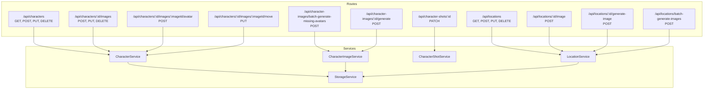
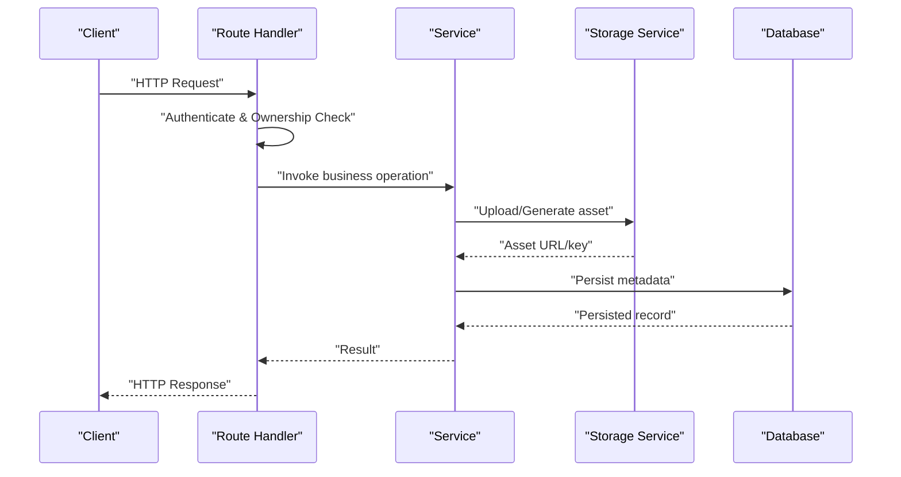
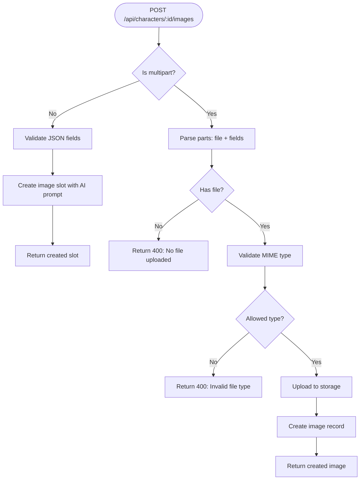
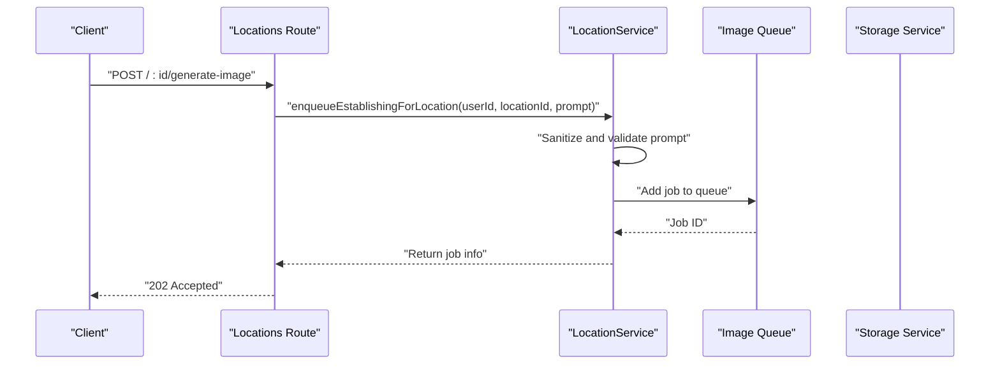
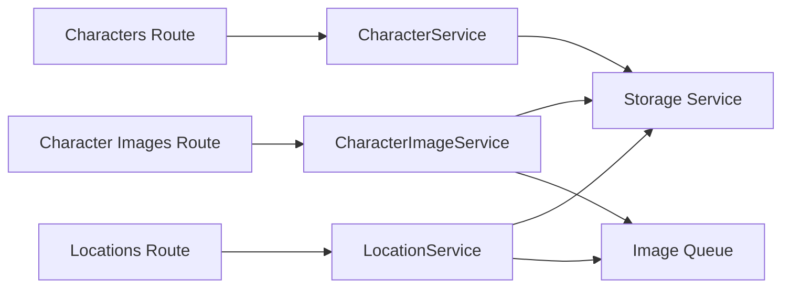

# Asset Management API

<cite>
**Referenced Files in This Document**
- [characters.ts](file://packages/backend/src/routes/characters.ts)
- [character-images.ts](file://packages/backend/src/routes/character-images.ts)
- [character-shots.ts](file://packages/backend/src/routes/character-shots.ts)
- [locations.ts](file://packages/backend/src/routes/locations.ts)
- [character-service.ts](file://packages/backend/src/services/character-service.ts)
- [character-image-service.ts](file://packages/backend/src/services/character-image-service.ts)
- [character-shot-service.ts](file://packages/backend/src/services/character-shot-service.ts)
- [location-service.ts](file://packages/backend/src/services/location-service.ts)
- [storage.ts](file://packages/backend/src/services/storage.ts)
- [bootstrap-env.ts](file://packages/backend/src/bootstrap-env.ts)
</cite>

## Table of Contents

1. [Introduction](#introduction)
2. [Project Structure](#project-structure)
3. [Core Components](#core-components)
4. [Architecture Overview](#architecture-overview)
5. [Detailed Component Analysis](#detailed-component-analysis)
6. [Dependency Analysis](#dependency-analysis)
7. [Performance Considerations](#performance-considerations)
8. [Troubleshooting Guide](#troubleshooting-guide)
9. [Conclusion](#conclusion)

## Introduction

This document provides comprehensive API documentation for asset management endpoints focused on characters and locations. It covers:

- Character lifecycle: creation, retrieval, updates, deletion
- Character image management: uploading avatars, generating derived images, organizing slots, moving/reparenting images
- Location management: listing, creation, updating, deletion, establishing image generation and uploads
- Character shot linking to images
- Asset upload/download, metadata management, versioning, and storage integration with MinIO-compatible S3

It also specifies file upload limits, supported formats, and asset organization patterns used by the system.

## Project Structure

The asset management APIs are implemented as Fastify routes backed by dedicated services and repositories. Storage is handled via an S3-compatible client configured for MinIO.

**Diagram sources**

- [characters.ts:6-345](file://packages/backend/src/routes/characters.ts#L6-L345)
- [character-images.ts:10-78](file://packages/backend/src/routes/character-images.ts#L10-L78)
- [character-shots.ts:6-42](file://packages/backend/src/routes/character-shots.ts#L6-L42)
- [locations.ts:10-243](file://packages/backend/src/routes/locations.ts#L10-L243)
- [character-service.ts:34-265](file://packages/backend/src/services/character-service.ts#L34-L265)
- [character-image-service.ts:28-147](file://packages/backend/src/services/character-image-service.ts#L28-L147)
- [character-shot-service.ts:3-89](file://packages/backend/src/services/character-shot-service.ts#L3-L89)
- [location-service.ts:22-183](file://packages/backend/src/services/location-service.ts#L22-L183)
- [storage.ts:28-74](file://packages/backend/src/services/storage.ts#L28-L74)

**Section sources**

- [characters.ts:6-345](file://packages/backend/src/routes/characters.ts#L6-L345)
- [locations.ts:10-243](file://packages/backend/src/routes/locations.ts#L10-L243)
- [character-images.ts:10-78](file://packages/backend/src/routes/character-images.ts#L10-L78)
- [character-shots.ts:6-42](file://packages/backend/src/routes/character-shots.ts#L6-L42)
- [character-service.ts:34-265](file://packages/backend/src/services/character-service.ts#L34-L265)
- [character-image-service.ts:28-147](file://packages/backend/src/services/character-image-service.ts#L28-L147)
- [character-shot-service.ts:3-89](file://packages/backend/src/services/character-shot-service.ts#L3-L89)
- [location-service.ts:22-183](file://packages/backend/src/services/location-service.ts#L22-L183)
- [storage.ts:28-74](file://packages/backend/src/services/storage.ts#L28-L74)

## Core Components

- Authentication and authorization: All endpoints require JWT authentication and enforce ownership checks per route.
- Storage: Assets are stored in S3-compatible MinIO with configurable endpoint, region, credentials, and buckets.
- Image generation: Character and location images are enqueued to background queues for asynchronous processing.
- Metadata and organization: Images and assets are organized by keys under bucket prefixes (e.g., assets/...).

Key responsibilities:

- Characters: CRUD plus image slot management, reparenting, and avatar uploads.
- Locations: CRUD plus establishing image generation and uploads.
- Character Shots: Linking shots to character images with validation.
- Storage: Upload, URL generation, and deletion of assets.

**Section sources**

- [characters.ts:6-345](file://packages/backend/src/routes/characters.ts#L6-L345)
- [locations.ts:10-243](file://packages/backend/src/routes/locations.ts#L10-L243)
- [character-images.ts:10-78](file://packages/backend/src/routes/character-images.ts#L10-L78)
- [character-shots.ts:6-42](file://packages/backend/src/routes/character-shots.ts#L6-L42)
- [storage.ts:28-74](file://packages/backend/src/services/storage.ts#L28-L74)

## Architecture Overview

The API follows a layered architecture:

- Routes define HTTP endpoints and request validation
- Services encapsulate business logic and orchestrate storage and queues
- Repositories handle database operations
- Storage service abstracts S3-compatible operations

**Diagram sources**

- [characters.ts:46-61](file://packages/backend/src/routes/characters.ts#L46-L61)
- [character-service.ts:136-171](file://packages/backend/src/services/character-service.ts#L136-L171)
- [storage.ts:28-48](file://packages/backend/src/services/storage.ts#L28-L48)
- [location-service.ts:126-165](file://packages/backend/src/services/location-service.ts#L126-L165)

## Detailed Component Analysis

### Character Management Endpoints

- Base path: `/api/characters`
- Methods:
  - GET `/` - List characters for a project (requires project ownership)
  - GET `/:id` - Retrieve a character with its images tree (requires character ownership)
  - POST `/` - Create a character (requires project ownership)
  - PUT `/:id` - Update a character (requires character ownership)
  - DELETE `/:id` - Delete a character (requires character ownership)

Validation and behavior:

- Ownership verification is performed for each request.
- Creation requires a valid project ID and name; optional description is supported.
- Retrieval returns the character with ordered images tree.

**Section sources**

- [characters.ts:8-96](file://packages/backend/src/routes/characters.ts#L8-L96)

### Character Image Management Endpoints

- Base path: `/api/characters/:id/images`
- Methods:
  - POST `/` - Add image to character
    - Supports multipart/form-data with field `file` for direct upload, or JSON body to create a slot with AI-generated prompt
    - When using multipart, fields include `name`, `type`, `description`, `parentId`
    - When using JSON, fields include `name`, `type`, `description`, `parentId`
    - Allowed file types: JPEG, PNG, WebP
    - Base image restriction: Each character can have at most one base image (no parent)
  - PUT `/:imageId` - Update image metadata (name, type, description, order, prompt)
  - DELETE `/:imageId` - Delete image and descendants (base image cannot be deleted)
  - POST `/:id/images/:imageId/avatar` - Upload/replace avatar for an existing image slot
    - Requires multipart/form-data with field `file`
    - Allowed file types: JPEG, PNG, WebP
  - PUT `/:id/images/:imageId/move` - Reparent image under a new parent (prevents cycles)

Validation and behavior:

- Ownership enforced per character.
- Multipart parsing collects file buffer and metadata fields.
- Avatar uploads are stored via S3-compatible storage with generated keys.
- Reparenting prevents creating cycles by checking ancestors.

**Diagram sources**

- [characters.ts:101-213](file://packages/backend/src/routes/characters.ts#L101-L213)
- [character-service.ts:136-171](file://packages/backend/src/services/character-service.ts#L136-L171)
- [storage.ts:28-48](file://packages/backend/src/services/storage.ts#L28-L48)

**Section sources**

- [characters.ts:101-343](file://packages/backend/src/routes/characters.ts#L101-L343)
- [character-service.ts:136-261](file://packages/backend/src/services/character-service.ts#L136-L261)

### Character Image Generation Endpoints

- Base path: `/api/character-images`
- Methods:
  - POST `/batch-generate-missing-avatars` - Enqueue missing avatars for slots meeting criteria
  - POST `/:id/generate` - Enqueue generation for a specific character image slot
    - Requires either prompt in the image record or prompt passed in request body
    - For derived images, parent must have an avatar

Behavior:

- Uses image generation queues; returns job identifiers upon success.
- Skips slots without prompts or with unmet prerequisites.

**Section sources**

- [character-images.ts:12-76](file://packages/backend/src/routes/character-images.ts#L12-L76)
- [character-image-service.ts:34-86](file://packages/backend/src/services/character-image-service.ts#L34-L86)

### Character Shot Management Endpoint

- Base path: `/api/character-shots/:id`
- Method:
  - PATCH `/` - Update the character image linked to a shot
    - Requires `characterImageId` in request body
    - Validates that the new image belongs to the same character as the shot’s original image

**Section sources**

- [character-shots.ts:7-40](file://packages/backend/src/routes/character-shots.ts#L7-L40)
- [character-shot-service.ts:4-36](file://packages/backend/src/services/character-shot-service.ts#L4-L36)

### Location Management Endpoints

- Base path: `/api/locations`
- Methods:
  - GET `/` - List locations for a project (requires project ownership)
  - POST `/` - Create a location manually (requires project ownership)
  - PUT `/:id` - Update location fields (time of day, description, image prompt, associated characters)
  - DELETE `/:id` - Soft delete location and unlink scenes
  - POST `/batch-generate-images` - Enqueue establishing images for eligible locations
  - POST `/:id/image` - Upload establishing image (multipart/form-data, field `file`)
  - POST `/:id/generate-image` - Enqueue establishing image generation for a location

Validation and behavior:

- Ownership enforced per location.
- Uploads are stored with keys under the assets bucket and return public URLs.
- Establishing image generation uses sanitized prompts and queues jobs.

**Diagram sources**

- [locations.ts:212-241](file://packages/backend/src/routes/locations.ts#L212-L241)
- [location-service.ts:126-165](file://packages/backend/src/services/location-service.ts#L126-L165)

**Section sources**

- [locations.ts:11-241](file://packages/backend/src/routes/locations.ts#L11-L241)
- [location-service.ts:22-183](file://packages/backend/src/services/location-service.ts#L22-L183)

## Dependency Analysis

- Routes depend on services for business logic and on storage for asset operations.
- Services depend on repositories for persistence and on queues for background jobs.
- Storage depends on S3-compatible client configuration.

**Diagram sources**

- [characters.ts:6-345](file://packages/backend/src/routes/characters.ts#L6-L345)
- [character-images.ts:10-78](file://packages/backend/src/routes/character-images.ts#L10-L78)
- [locations.ts:10-243](file://packages/backend/src/routes/locations.ts#L10-L243)
- [character-service.ts:34-265](file://packages/backend/src/services/character-service.ts#L34-L265)
- [character-image-service.ts:28-147](file://packages/backend/src/services/character-image-service.ts#L28-L147)
- [location-service.ts:22-183](file://packages/backend/src/services/location-service.ts#L22-L183)
- [storage.ts:28-74](file://packages/backend/src/services/storage.ts#L28-L74)

**Section sources**

- [characters.ts:6-345](file://packages/backend/src/routes/characters.ts#L6-L345)
- [character-images.ts:10-78](file://packages/backend/src/routes/character-images.ts#L10-L78)
- [locations.ts:10-243](file://packages/backend/src/routes/locations.ts#L10-L243)
- [character-service.ts:34-265](file://packages/backend/src/services/character-service.ts#L34-L265)
- [character-image-service.ts:28-147](file://packages/backend/src/services/character-image-service.ts#L28-L147)
- [location-service.ts:22-183](file://packages/backend/src/services/location-service.ts#L22-L183)
- [storage.ts:28-74](file://packages/backend/src/services/storage.ts#L28-L74)

## Performance Considerations

- Asynchronous image generation: Use batch endpoints to enqueue jobs rather than blocking on long-running operations.
- Efficient batching: Prefer batch endpoints for locations and character images to reduce API round trips.
- MinIO configuration: Ensure endpoint, region, and credentials are optimized for network latency and throughput.
- File sizes: While explicit limits are not enforced in code, clients should avoid unnecessarily large images to minimize upload time and storage costs.

[No sources needed since this section provides general guidance]

## Troubleshooting Guide

Common errors and resolutions:

- Authentication/authorization failures:
  - 403 Permission denied when ownership checks fail
- Validation errors:
  - 400 Bad Request for missing fields, invalid types, or unsupported operations
- Resource not found:
  - 404 Not Found for characters, images, locations, or shots
- Rate limiting or external service issues:
  - 429 Too Many Requests or 401 Unauthorized for AI prompt generation
- Storage-related:
  - Ensure S3 endpoint, credentials, and bucket names are correctly configured

Environment configuration:

- Load environment variables early to ensure S3 client initialization succeeds.

**Section sources**

- [characters.ts:132-149](file://packages/backend/src/routes/characters.ts#L132-L149)
- [locations.ts:197-199](file://packages/backend/src/routes/locations.ts#L197-L199)
- [character-service.ts:180-183](file://packages/backend/src/services/character-service.ts#L180-L183)
- [bootstrap-env.ts:1-12](file://packages/backend/src/bootstrap-env.ts#L1-L12)

## Conclusion

The asset management API provides a robust, secure, and scalable foundation for managing characters, their images, and location establishing assets. It integrates seamlessly with MinIO-compatible storage, supports asynchronous image generation, and enforces strict ownership and validation rules. Use the documented endpoints and patterns to implement efficient asset workflows with clear metadata management and organized storage keys.
