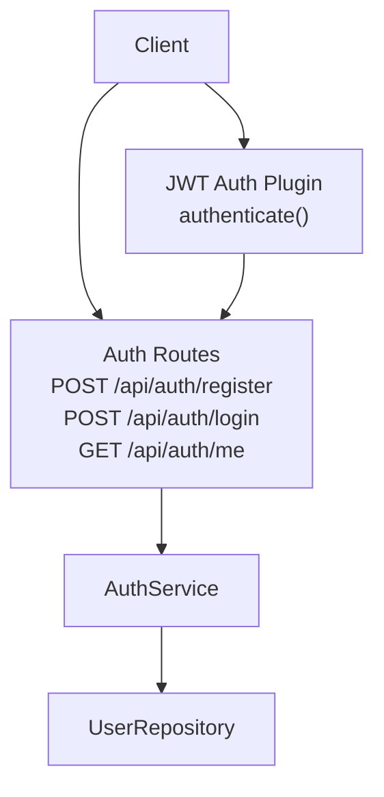
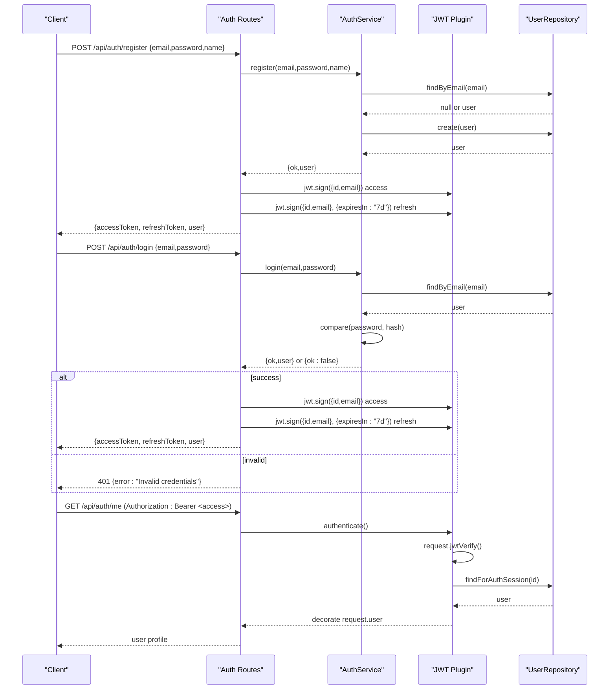
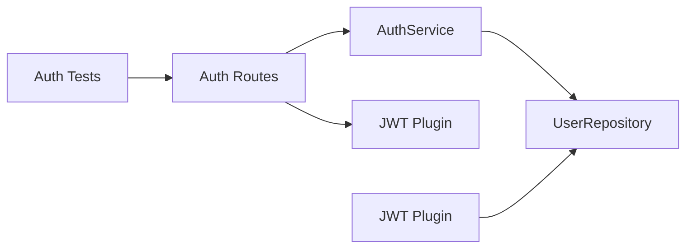

# Authentication API

<cite>
**Referenced Files in This Document**
- [auth.ts](file://packages/backend/src/routes/auth.ts)
- [auth-service.ts](file://packages/backend/src/services/auth-service.ts)
- [user-repository.ts](file://packages/backend/src/repositories/user-repository.ts)
- [auth.ts](file://packages/backend/src/plugins/auth.ts)
- [index.ts](file://packages/backend/src/index.ts)
- [auth.test.ts](file://packages/backend/tests/auth.test.ts)
- [index.ts](file://packages/shared/src/types/index.ts)
</cite>

## Table of Contents

1. [Introduction](#introduction)
2. [Project Structure](#project-structure)
3. [Core Components](#core-components)
4. [Architecture Overview](#architecture-overview)
5. [Detailed Component Analysis](#detailed-component-analysis)
6. [Dependency Analysis](#dependency-analysis)
7. [Performance Considerations](#performance-considerations)
8. [Troubleshooting Guide](#troubleshooting-guide)
9. [Conclusion](#conclusion)

## Introduction

This document provides comprehensive API documentation for the authentication endpoints. It covers login, registration, and session retrieval endpoints, along with JWT token handling, authentication middleware requirements, and error responses. It also outlines security considerations, token refresh mechanisms, and rate limiting policies.

## Project Structure

The authentication system is implemented as part of the backend service using Fastify. The key components are:

- Route handlers for authentication endpoints
- Authentication service implementing business logic
- User repository for data access
- JWT authentication plugin for middleware and token verification
- Shared types for request/response schemas

**Diagram sources**

- [auth.ts:1-65](file://packages/backend/src/routes/auth.ts#L1-L65)
- [auth-service.ts:1-73](file://packages/backend/src/services/auth-service.ts#L1-L73)
- [user-repository.ts:1-32](file://packages/backend/src/repositories/user-repository.ts#L1-L32)
- [auth.ts:1-98](file://packages/backend/src/plugins/auth.ts#L1-L98)

**Section sources**

- [auth.ts:1-65](file://packages/backend/src/routes/auth.ts#L1-L65)
- [auth-service.ts:1-73](file://packages/backend/src/services/auth-service.ts#L1-L73)
- [user-repository.ts:1-32](file://packages/backend/src/repositories/user-repository.ts#L1-L32)
- [auth.ts:1-98](file://packages/backend/src/plugins/auth.ts#L1-L98)
- [index.ts:1-136](file://packages/backend/src/index.ts#L1-L136)

## Core Components

- Authentication routes: Define endpoints for registration, login, and retrieving the current user profile.
- Authentication service: Implements registration and login logic, hashing passwords, and user lookup.
- User repository: Provides data access methods for user operations.
- JWT authentication plugin: Decorates the server with an authenticate function that verifies JWT tokens and loads the session user.

Key endpoint definitions:

- POST /api/auth/register
- POST /api/auth/login
- GET /api/auth/me

Response schema for successful login and registration:

- accessToken: string (JWT)
- refreshToken: string (JWT, 7-day expiry)
- user: object containing id, email, name, createdAt

Request schema for registration:

- email: string
- password: string
- name: string

Request schema for login:

- email: string
- password: string

**Section sources**

- [auth.ts:1-65](file://packages/backend/src/routes/auth.ts#L1-L65)
- [auth-service.ts:1-73](file://packages/backend/src/services/auth-service.ts#L1-L73)
- [user-repository.ts:1-32](file://packages/backend/src/repositories/user-repository.ts#L1-L32)
- [index.ts:54-56](file://packages/backend/src/index.ts#L54-L56)
- [index.ts:244-248](file://packages/shared/src/types/index.ts#L244-L248)

## Architecture Overview

The authentication flow integrates Fastify routes, the authentication service, and the JWT plugin. Registration and login endpoints return both access and refresh tokens. The session endpoint requires authentication middleware.

**Diagram sources**

- [auth.ts:1-65](file://packages/backend/src/routes/auth.ts#L1-L65)
- [auth-service.ts:1-73](file://packages/backend/src/services/auth-service.ts#L1-L73)
- [user-repository.ts:1-32](file://packages/backend/src/repositories/user-repository.ts#L1-L32)
- [auth.ts:1-98](file://packages/backend/src/plugins/auth.ts#L1-L98)

## Detailed Component Analysis

### Authentication Routes

- POST /api/auth/register
  - Request body: email, password, name
  - Response: accessToken, refreshToken, user
  - Behavior: Validates uniqueness, hashes password, creates user, signs access and refresh tokens
- POST /api/auth/login
  - Request body: email, password
  - Response: accessToken, refreshToken, user
  - Behavior: Verifies credentials, signs access and refresh tokens
- GET /api/auth/me
  - Requires: Authorization header with Bearer token
  - Response: user profile
  - Behavior: Uses authenticate middleware to verify token and load user

Security and error handling:

- Invalid credentials during login return 401 with error message
- Duplicate email during registration returns 400 with error message
- Unauthorized access attempts return 401

Token handling:

- Access token: signed with default expiration
- Refresh token: signed with 7-day expiration

**Section sources**

- [auth.ts:1-65](file://packages/backend/src/routes/auth.ts#L1-L65)
- [auth.test.ts:62-196](file://packages/backend/tests/auth.test.ts#L62-L196)
- [index.ts:244-248](file://packages/shared/src/types/index.ts#L244-L248)

### Authentication Service

Responsibilities:

- register(email, password, name): Checks for existing user, hashes password, persists user, returns safe user object
- login(email, password): Finds user by email, compares password hash, returns safe user object
- getMe(userId): Retrieves public user information

Data structures:

- SafeUser: id, email, name, createdAt

Complexity:

- findByEmail/findByIdPublic: O(1) database lookup
- Password hashing: O(k) where k is password length
- bcrypt comparison: O(k)

**Section sources**

- [auth-service.ts:1-73](file://packages/backend/src/services/auth-service.ts#L1-L73)
- [user-repository.ts:1-32](file://packages/backend/src/repositories/user-repository.ts#L1-L32)

### User Repository

Responsibilities:

- findForAuthSession(userId): Loads user for JWT verification
- findByEmail(email): Lookup by email
- findByIdPublic(userId): Public profile retrieval
- create(data): Persist new user

Data access pattern:

- Uses Prisma client for database operations
- Selective field projection for security

**Section sources**

- [user-repository.ts:1-32](file://packages/backend/src/repositories/user-repository.ts#L1-L32)

### JWT Authentication Plugin

Responsibilities:

- decorate(server, 'authenticate'): Adds authenticate(request, reply) function
- verify JWT in request and load user session
- Reject unauthorized requests and handle missing/invalid sessions

Behavior:

- Calls request.jwtVerify()
- Loads user via userRepository.findForAuthSession
- Replaces request.user with database user

**Section sources**

- [auth.ts:1-98](file://packages/backend/src/plugins/auth.ts#L1-L98)
- [user-repository.ts:1-32](file://packages/backend/src/repositories/user-repository.ts#L1-L32)

### Token Refresh Mechanism

Current implementation:

- Registration and login return both accessToken and refreshToken
- refreshToken is signed with 7-day expiry
- No dedicated refresh endpoint is present in the current routes

Recommended approach:

- Add POST /api/auth/token-refresh endpoint
- Accept refreshToken and optional accessToken
- Validate refreshToken and issue new accessToken
- Optionally rotate refreshToken and update stored value

Note: The current code does not include a logout endpoint. Logout can be handled client-side by discarding tokens or by maintaining a blacklist.

**Section sources**

- [auth.ts:16-20](file://packages/backend/src/routes/auth.ts#L16-L20)
- [auth.ts:42-45](file://packages/backend/src/routes/auth.ts#L42-L45)

## Dependency Analysis

The authentication system exhibits clear separation of concerns:

- Routes depend on AuthService
- AuthService depends on UserRepository
- Routes and plugin depend on JWT configuration
- Tests validate route behavior and error responses

**Diagram sources**

- [auth.ts:1-65](file://packages/backend/src/routes/auth.ts#L1-L65)
- [auth-service.ts:1-73](file://packages/backend/src/services/auth-service.ts#L1-L73)
- [user-repository.ts:1-32](file://packages/backend/src/repositories/user-repository.ts#L1-L32)
- [auth.ts:1-98](file://packages/backend/src/plugins/auth.ts#L1-L98)
- [auth.test.ts:1-196](file://packages/backend/tests/auth.test.ts#L1-L196)

**Section sources**

- [auth.ts:1-65](file://packages/backend/src/routes/auth.ts#L1-L65)
- [auth-service.ts:1-73](file://packages/backend/src/services/auth-service.ts#L1-L73)
- [user-repository.ts:1-32](file://packages/backend/src/repositories/user-repository.ts#L1-L32)
- [auth.ts:1-98](file://packages/backend/src/plugins/auth.ts#L1-L98)
- [auth.test.ts:1-196](file://packages/backend/tests/auth.test.ts#L1-L196)

## Performance Considerations

- Password hashing uses bcrypt with a cost factor suitable for server environments
- JWT signing occurs per request; consider caching short-lived access tokens if needed
- Database queries are simple lookups; ensure proper indexing on email
- Avoid exposing sensitive fields in user responses beyond the public profile

## Troubleshooting Guide

Common issues and resolutions:

- 401 Unauthorized on protected routes
  - Cause: Missing or invalid Authorization header
  - Resolution: Ensure Bearer token is included and valid
- 401 Invalid credentials on login
  - Cause: Incorrect email/password combination
  - Resolution: Verify credentials and reattempt login
- 400 Email already registered on registration
  - Cause: Email already exists in database
  - Resolution: Use a different email or log in
- Session invalidation
  - Cause: User deleted or modified between sessions
  - Resolution: Require user to log in again

Security checks:

- Confirm JWT secret is configured in environment
- Ensure HTTPS in production to protect tokens
- Rotate refresh tokens and invalidate on suspicious activity

**Section sources**

- [auth.ts:13-35](file://packages/backend/src/plugins/auth.ts#L13-L35)
- [auth.test.ts:134-172](file://packages/backend/tests/auth.test.ts#L134-L172)
- [auth.test.ts:90-106](file://packages/backend/tests/auth.test.ts#L90-L106)

## Conclusion

The authentication API provides secure registration, login, and session retrieval with JWT-based token handling. The current implementation includes access and refresh tokens and robust middleware for session validation. Extending the system with a dedicated token refresh endpoint and logout mechanism would further enhance security and usability.
