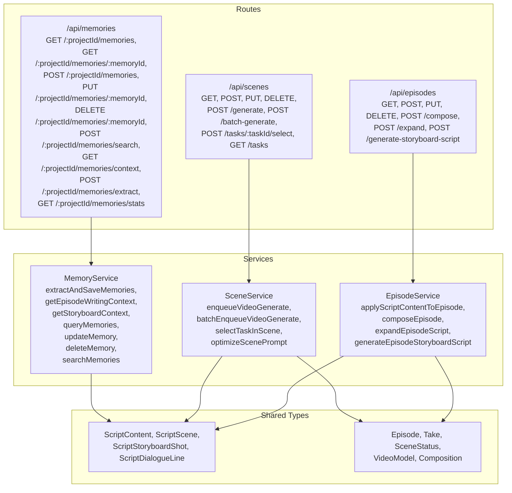
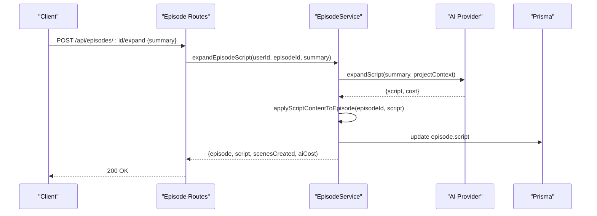
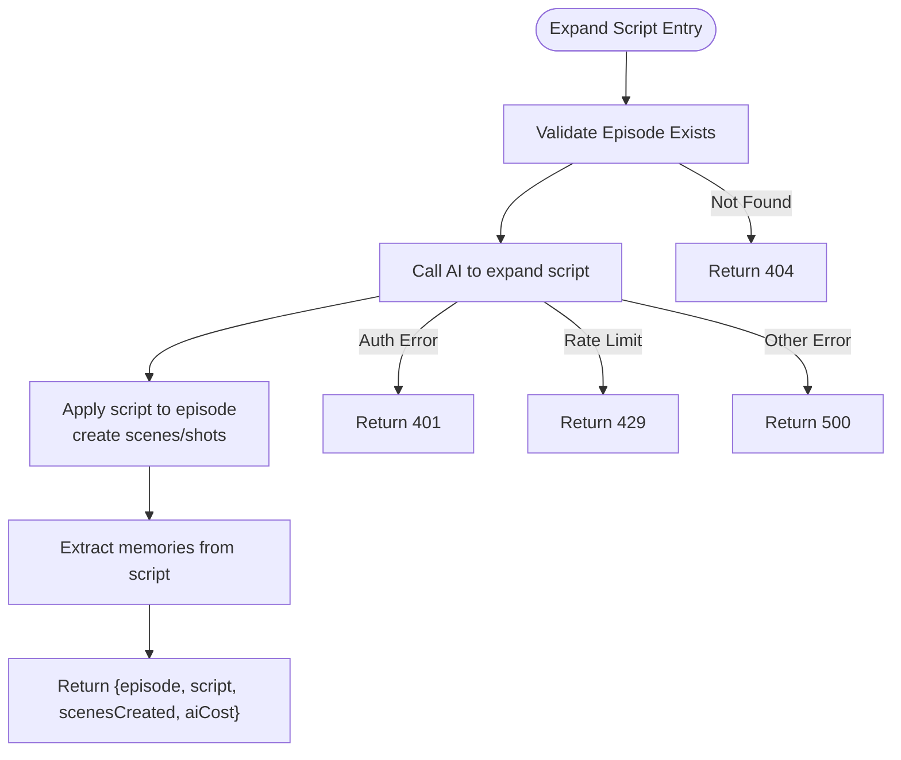
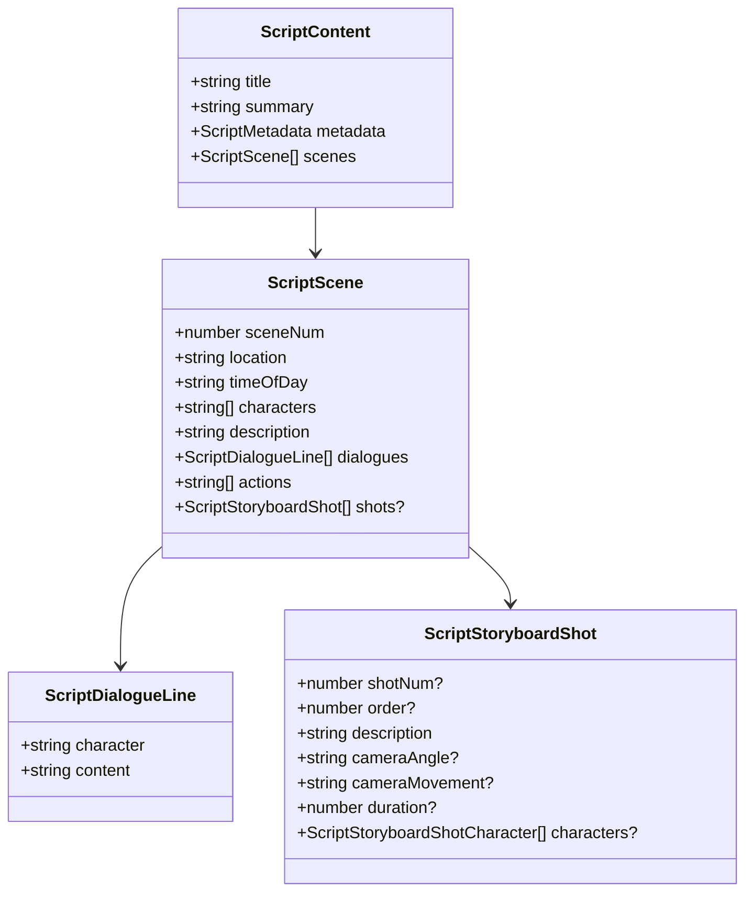
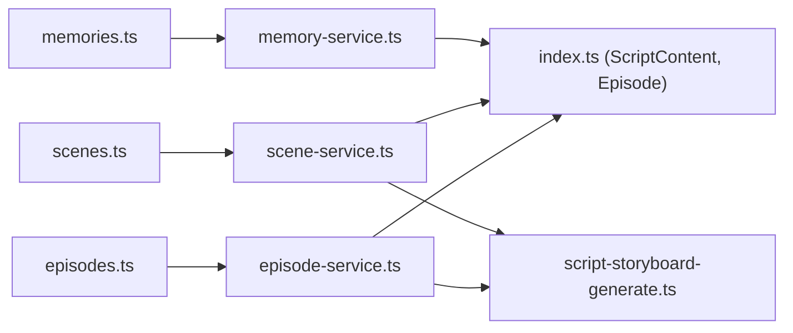

# Episode & Script API

<cite>
**Referenced Files in This Document**
- [episodes.ts](file://packages/backend/src/routes/episodes.ts)
- [scenes.ts](file://packages/backend/src/routes/scenes.ts)
- [memories.ts](file://packages/backend/src/routes/memories.ts)
- [episode-service.ts](file://packages/backend/src/services/episode-service.ts)
- [scene-service.ts](file://packages/backend/src/services/scene-service.ts)
- [memory-service.ts](file://packages/backend/src/services/memory/memory-service.ts)
- [index.ts](file://packages/shared/src/types/index.ts)
- [script-storyboard-generate.ts](file://packages/backend/src/services/ai/script-storyboard-generate.ts)
- [deepseek.ts](file://packages/backend/src/services/ai/deepseek.ts)
</cite>

## Table of Contents

1. [Introduction](#introduction)
2. [Project Structure](#project-structure)
3. [Core Components](#core-components)
4. [Architecture Overview](#architecture-overview)
5. [Detailed Component Analysis](#detailed-component-analysis)
6. [Dependency Analysis](#dependency-analysis)
7. [Performance Considerations](#performance-considerations)
8. [Troubleshooting Guide](#troubleshooting-guide)
9. [Conclusion](#conclusion)
10. [Appendices](#appendices)

## Introduction

This document provides comprehensive API documentation for episode and script management, covering:

- Episode lifecycle management: listing episodes, retrieving episode details, creating episodes, updating episodes (including script content), deleting episodes, composing episodes into final videos, expanding scripts via AI, and generating storyboard scripts via AI.
- Scene planning: listing scenes, creating scenes with initial shots, updating scenes, deleting scenes, generating videos per scene or in batches, selecting preferred takes, listing tasks, and optimizing scene prompts.
- Memory integration: querying memories, creating/updating/deleting memories, searching memories, fetching writing context for episodes, extracting memories from episodes, and retrieving memory statistics.

It also documents script generation workflows, AI-assisted writing features, scene breakdown functionality, and narrative structure management, with explicit request/response schemas for script content, scene metadata, and memory associations.

## Project Structure

The relevant backend components are organized under:

- Routes: HTTP endpoints for episodes, scenes, and memories.
- Services: Business logic for episode, scene, and memory operations, including AI integrations.
- Shared Types: Strongly typed request/response schemas and domain models.

**Diagram sources**

- [episodes.ts:1-250](file://packages/backend/src/routes/episodes.ts#L1-L250)
- [scenes.ts:1-199](file://packages/backend/src/routes/scenes.ts#L1-L199)
- [memories.ts:1-425](file://packages/backend/src/routes/memories.ts#L1-L425)
- [episode-service.ts:1-594](file://packages/backend/src/services/episode-service.ts#L1-L594)
- [scene-service.ts:1-281](file://packages/backend/src/services/scene-service.ts#L1-L281)
- [memory-service.ts:1-112](file://packages/backend/src/services/memory/memory-service.ts#L1-L112)
- [index.ts:79-135](file://packages/shared/src/types/index.ts#L79-L135)

**Section sources**

- [episodes.ts:1-250](file://packages/backend/src/routes/episodes.ts#L1-L250)
- [scenes.ts:1-199](file://packages/backend/src/routes/scenes.ts#L1-L199)
- [memories.ts:1-425](file://packages/backend/src/routes/memories.ts#L1-L425)
- [episode-service.ts:1-594](file://packages/backend/src/services/episode-service.ts#L1-L594)
- [scene-service.ts:1-281](file://packages/backend/src/services/scene-service.ts#L1-L281)
- [memory-service.ts:1-112](file://packages/backend/src/services/memory/memory-service.ts#L1-L112)
- [index.ts:79-135](file://packages/shared/src/types/index.ts#L79-L135)

## Core Components

- Episode Management
  - List episodes by project, get episode detail (episode + scenes + project visual style), get scenes for an episode, create/update/delete episodes, compose episode into final video, expand script via AI, and generate storyboard script via AI.
- Scene Planning
  - List scenes by episode, create scene with first shot, update scene, delete scene, generate video per scene or in batch, select preferred take, list tasks, and optimize scene prompt.
- Memory Integration
  - Query memories with filters, get single memory, create/update/delete memory, search memories, get writing context for an episode, extract memories from an episode, and get memory statistics.

**Section sources**

- [episodes.ts:8-249](file://packages/backend/src/routes/episodes.ts#L8-L249)
- [scenes.ts:7-198](file://packages/backend/src/routes/scenes.ts#L7-L198)
- [memories.ts:14-424](file://packages/backend/src/routes/memories.ts#L14-L424)

## Architecture Overview

The APIs follow a layered architecture:

- Route handlers validate ownership, authenticate requests, and delegate to services.
- Services encapsulate business logic, orchestrate AI calls, and manage persistence.
- Shared types define request/response schemas and domain models.

**Diagram sources**

- [episodes.ts:176-208](file://packages/backend/src/routes/episodes.ts#L176-L208)
- [episode-service.ts:425-509](file://packages/backend/src/services/episode-service.ts#L425-L509)
- [script-storyboard-generate.ts:107-145](file://packages/backend/src/services/ai/script-storyboard-generate.ts#L107-L145)

**Section sources**

- [episodes.ts:176-208](file://packages/backend/src/routes/episodes.ts#L176-L208)
- [episode-service.ts:425-509](file://packages/backend/src/services/episode-service.ts#L425-L509)
- [script-storyboard-generate.ts:107-145](file://packages/backend/src/services/ai/script-storyboard-generate.ts#L107-L145)

## Detailed Component Analysis

### Episode Lifecycle Management

Endpoints

- GET /api/episodes
  - Purpose: List episodes for a project.
  - Authentication: Required.
  - Ownership: Requires project ownership verification.
  - Response: Array of episodes with aggregated stats.
- GET /api/episodes/:id
  - Purpose: Retrieve a single episode by ID.
  - Authentication: Required.
  - Ownership: Requires episode ownership verification.
  - Response: Episode object or 404 Not Found.
- GET /api/episodes/:id/detail
  - Purpose: Retrieve episode detail including scenes and project visual style.
  - Authentication: Required.
  - Ownership: Requires episode ownership verification.
  - Response: Episode + scenes + project visual style.
- GET /api/episodes/:id/scenes
  - Purpose: Retrieve scenes for an episode (editor view).
  - Authentication: Required.
  - Ownership: Requires episode ownership verification.
  - Response: { scenes }.
- POST /api/episodes
  - Purpose: Create a new episode.
  - Authentication: Required.
  - Ownership: Requires project ownership verification.
  - Request Body: { projectId, episodeNum, title? }.
  - Response: 201 Created with episode object.
- PUT /api/episodes/:id
  - Purpose: Update episode (supports title, synopsis, and script content).
  - Authentication: Required.
  - Ownership: Requires episode ownership verification.
  - Request Body: { title?, synopsis?, script? }.
  - Response: Updated episode.
- DELETE /api/episodes/:id
  - Purpose: Delete an episode if exists.
  - Authentication: Required.
  - Ownership: Requires episode ownership verification.
  - Response: 204 No Content or 404 Not Found.
- POST /api/episodes/:id/compose
  - Purpose: Compose selected takes into a final composition and export video.
  - Authentication: Required.
  - Ownership: Requires episode ownership verification.
  - Request Body: { title? }.
  - Response: { compositionId, outputUrl, duration, message } or error with details.
- POST /api/episodes/:id/expand
  - Purpose: Expand episode script using AI with a summary.
  - Authentication: Required.
  - Ownership: Requires episode ownership verification.
  - Request Body: { summary }.
  - Response: { episode, script, scenesCreated, aiCost } or error.
- POST /api/episodes/:id/generate-storyboard-script
  - Purpose: Generate storyboard script via AI from episode content.
  - Authentication: Required.
  - Ownership: Requires episode ownership verification.
  - Request Body: { hint? }.
  - Response: { jobId, message } or error.

Request/Response Schemas

- CreateEpisodeRequest: { projectId, episodeNum, title? }
- Episode (response): { id, projectId, episodeNum, title?, synopsis?, script?, createdAt, updatedAt, listStats? }
- ComposeEpisode response: { compositionId, outputUrl, duration, message } or error details.
- ExpandScript response: { episode, script, scenesCreated, aiCost } or error.
- GenerateStoryboardScript response: { jobId, message } or error.

Notes

- Script content is stored as structured JSON (ScriptContent) and supports scene breakdown with multiple shots and character associations.
- Composition requires at least one scene with a selected completed take.

**Section sources**

- [episodes.ts:8-249](file://packages/backend/src/routes/episodes.ts#L8-L249)
- [episode-service.ts:320-423](file://packages/backend/src/services/episode-service.ts#L320-L423)
- [episode-service.ts:425-590](file://packages/backend/src/services/episode-service.ts#L425-L590)
- [index.ts:65-77](file://packages/shared/src/types/index.ts#L65-L77)
- [index.ts:79-86](file://packages/shared/src/types/index.ts#L79-L86)

### Scene Planning

Endpoints

- GET /api/scenes
  - Purpose: List scenes by episode.
  - Authentication: Required.
  - Ownership: Requires episode ownership verification.
  - Query: episodeId (required).
  - Response: Scenes array.
- GET /api/scenes/:id
  - Purpose: Retrieve scene with takes and shots.
  - Authentication: Required.
  - Ownership: Requires scene ownership verification.
  - Response: Scene with associated takes/shots or 404 Not Found.
- POST /api/scenes
  - Purpose: Create scene with first shot.
  - Authentication: Required.
  - Ownership: Requires episode ownership verification.
  - Request Body: { episodeId, sceneNum, description?, prompt }.
  - Response: 201 Created with scene object or 404 Episode not found.
- PUT /api/scenes/:id
  - Purpose: Update scene (description, sceneNum, prompt).
  - Authentication: Required.
  - Ownership: Requires scene ownership verification.
  - Request Body: { description?, sceneNum?, prompt? }.
  - Response: Updated scene.
- DELETE /api/scenes/:id
  - Purpose: Delete scene if exists.
  - Authentication: Required.
  - Ownership: Requires scene ownership verification.
  - Response: 204 No Content or 404 Not Found.
- POST /api/scenes/:id/generate
  - Purpose: Enqueue video generation for a scene.
  - Authentication: Required.
  - Ownership: Requires scene ownership verification.
  - Request Body: { model, referenceImage?, imageUrls?, duration? }.
  - Response: { taskId, sceneId } or 400 if no prompt.
- POST /api/scenes/batch-generate
  - Purpose: Enqueue batch video generation for multiple scenes.
  - Authentication: Required.
  - Ownership: Requires verifying ownership per scene.
  - Request Body: { sceneIds[], model, referenceImage?, imageUrls? }.
  - Response: Array of { sceneId, taskId }.
- POST /api/scenes/:id/tasks/:taskId/select
  - Purpose: Select preferred take for a scene.
  - Authentication: Required.
  - Ownership: Requires scene ownership verification.
  - Response: Selected take.
- GET /api/scenes/:id/tasks
  - Purpose: List tasks for a scene.
  - Authentication: Required.
  - Ownership: Requires scene ownership verification.
  - Response: Tasks array.
- POST /api/scenes/:id/optimize-prompt
  - Purpose: Optimize scene prompt via AI.
  - Authentication: Required.
  - Ownership: Requires scene ownership verification.
  - Request Body: { prompt? }.
  - Response: { optimizedPrompt, aiCost } or error.

Request/Response Schemas

- CreateSceneRequest: { episodeId, sceneNum, description?, prompt }
- GenerateVideoRequest: { model, referenceImage?, duration? }
- BatchGenerateRequest: { sceneIds[], model, referenceImage? }
- SceneStatus: pending | generating | processing | completed | failed
- VideoModel: wan2.6 | seedance2.0
- Take: { id, sceneId, model, status, prompt, cost?, duration?, videoUrl?, thumbnailUrl?, errorMsg?, isSelected, createdAt, updatedAt }

Notes

- Prompt optimization updates the first shot description when successful.
- Batch generation enqueues tasks per scene and updates scene status to generating.

**Section sources**

- [scenes.ts:7-198](file://packages/backend/src/routes/scenes.ts#L7-L198)
- [scene-service.ts:42-277](file://packages/backend/src/services/scene-service.ts#L42-L277)
- [index.ts:166-196](file://packages/shared/src/types/index.ts#L166-L196)

### Memory Integration

Endpoints

- GET /api/memories/:projectId/memories
  - Purpose: List memories for a project with optional filters.
  - Authentication: Required.
  - Ownership: Requires project ownership verification.
  - Query: type?, isActive?, episodeId?, tags?, minImportance?, category?, limit?, offset?.
  - Response: { success: true, count, data: Memory[] }.
- GET /api/memories/:projectId/memories/:memoryId
  - Purpose: Get a single memory by ID.
  - Authentication: Required.
  - Ownership: Requires project ownership verification.
  - Response: { success: true, data } or 404 Not Found.
- POST /api/memories/:projectId/memories
  - Purpose: Create a memory.
  - Authentication: Required.
  - Ownership: Requires project ownership verification.
  - Request Body: { type, category?, title, content, tags?, importance?, episodeId?, metadata? }.
  - Validation: type, title, content required; importance must be 1–5.
  - Response: 201 Created with memory object.
- PUT /api/memories/:projectId/memories/:memoryId
  - Purpose: Update a memory.
  - Authentication: Required.
  - Ownership: Requires project ownership verification.
  - Request Body: { title?, content?, tags?, importance?, isActive?, verified?, category? }.
  - Validation: importance must be 1–5.
  - Response: { success: true, data } or 404 Not Found.
- DELETE /api/memories/:projectId/memories/:memoryId
  - Purpose: Delete a memory.
  - Authentication: Required.
  - Ownership: Requires project ownership verification.
  - Response: { success: true, message } or 404 Not Found.
- POST /api/memories/:projectId/memories/search
  - Purpose: Search memories by text query.
  - Authentication: Required.
  - Ownership: Requires project ownership verification.
  - Request Body: { query, limit? }.
  - Response: { success: true, count, data }.
- GET /api/memories/:projectId/memories/context
  - Purpose: Get writing context for an episode.
  - Authentication: Required.
  - Ownership: Requires project ownership verification.
  - Query: episodeNum (required).
  - Response: { success: true, data }.
- POST /api/memories/:projectId/memories/extract
  - Purpose: Manually trigger memory extraction from an episode’s script.
  - Authentication: Required.
  - Ownership: Requires project ownership verification.
  - Request Body: { episodeId, episodeNum }.
  - Response: { success: true, data, message }.
- GET /api/memories/:projectId/memories/stats
  - Purpose: Get memory statistics for a project.
  - Authentication: Required.
  - Ownership: Requires project ownership verification.
  - Response: { success: true, data: { total, byType, byImportance, active, verified, averageImportance } }.

Request/Response Schemas

- Memory (query): { id, projectId, type, category?, title, content, tags?, importance, isActive, verified?, episodeId?, metadata?, createdAt, updatedAt }.
- Memory (create/update): { type, category?, title, content, tags?, importance?, episodeId?, metadata? }.
- WritingContext: { memories: Memory[], projectContext: string }.

Notes

- Memory extraction integrates with AI to parse ScriptContent and persist structured memories.
- Writing context aggregates relevant memories to assist episode writing.

**Section sources**

- [memories.ts:14-424](file://packages/backend/src/routes/memories.ts#L14-L424)
- [memory-service.ts:10-101](file://packages/backend/src/services/memory/memory-service.ts#L10-L101)
- [index.ts:1-27](file://packages/shared/src/types/index.ts#L1-L27)

### Script Generation Workflows and AI-Assisted Writing

Key Workflows

- Expand Episode Script
  - Endpoint: POST /api/episodes/:id/expand
  - Input: { summary }
  - Behavior: Calls AI to expand script, applies to episode (writing scenes and shots), extracts memories, returns results and cost.
- Generate Storyboard Script
  - Endpoint: POST /api/episodes/:id/generate-storyboard-script
  - Input: { hint? }
  - Behavior: Validates content availability, calls AI to produce structured storyboard script, applies to episode, returns job info.
- Scene Prompt Optimization
  - Endpoint: POST /api/scenes/:id/optimize-prompt
  - Input: { prompt? }
  - Behavior: Optimizes prompt via AI, optionally updates first shot description, returns optimized prompt and cost.

AI Integration Details

- AI provider: DeepSeek (chat model).
- Cost tracking: Returns cost in CNY.
- Error handling: Propagates authentication and rate-limit errors from AI provider.

**Diagram sources**

- [episodes.ts:176-208](file://packages/backend/src/routes/episodes.ts#L176-L208)
- [episode-service.ts:425-509](file://packages/backend/src/services/episode-service.ts#L425-L509)
- [script-storyboard-generate.ts:107-145](file://packages/backend/src/services/ai/script-storyboard-generate.ts#L107-L145)

**Section sources**

- [episodes.ts:176-248](file://packages/backend/src/routes/episodes.ts#L176-L248)
- [episode-service.ts:425-590](file://packages/backend/src/services/episode-service.ts#L425-L590)
- [script-storyboard-generate.ts:19-27](file://packages/backend/src/services/ai/script-storyboard-generate.ts#L19-L27)
- [deepseek.ts:1-30](file://packages/backend/src/services/ai/deepseek.ts#L1-L30)

### Scene Breakdown Functionality and Narrative Structure Management

Scene Breakdown

- Scene creation writes a first shot and optionally multiple shots based on script breakdown.
- Each shot can include camera angle/movement and character associations linked to character images.
- Dialogue lines are attached to scenes with timing derived from scene duration.

Narrative Structure Management

- ScriptContent defines scenes with locations, time-of-day, characters, descriptions, dialogues, actions, and optional shots.
- EpisodeService applies script content to episode, creating scenes and shots, distributing dialogue timing, and enforcing max scene duration.

**Diagram sources**

- [index.ts:79-135](file://packages/shared/src/types/index.ts#L79-L135)

**Section sources**

- [episode-service.ts:90-221](file://packages/backend/src/services/episode-service.ts#L90-L221)
- [index.ts:79-135](file://packages/shared/src/types/index.ts#L79-L135)

## Dependency Analysis

High-level dependencies

- Routes depend on services for business logic.
- Services depend on shared types for schemas and on AI providers for LLM calls.
- EpisodeService orchestrates script application and composition.
- SceneService manages video generation queues and prompt optimization.
- MemoryService coordinates extraction and context building.

**Diagram sources**

- [episodes.ts:1-250](file://packages/backend/src/routes/episodes.ts#L1-L250)
- [scenes.ts:1-199](file://packages/backend/src/routes/scenes.ts#L1-L199)
- [memories.ts:1-425](file://packages/backend/src/routes/memories.ts#L1-L425)
- [episode-service.ts:1-594](file://packages/backend/src/services/episode-service.ts#L1-L594)
- [scene-service.ts:1-281](file://packages/backend/src/services/scene-service.ts#L1-L281)
- [memory-service.ts:1-112](file://packages/backend/src/services/memory/memory-service.ts#L1-L112)
- [index.ts:79-135](file://packages/shared/src/types/index.ts#L79-L135)
- [script-storyboard-generate.ts:1-146](file://packages/backend/src/services/ai/script-storyboard-generate.ts#L1-L146)

**Section sources**

- [episodes.ts:1-250](file://packages/backend/src/routes/episodes.ts#L1-L250)
- [scenes.ts:1-199](file://packages/backend/src/routes/scenes.ts#L1-L199)
- [memories.ts:1-425](file://packages/backend/src/routes/memories.ts#L1-L425)
- [episode-service.ts:1-594](file://packages/backend/src/services/episode-service.ts#L1-L594)
- [scene-service.ts:1-281](file://packages/backend/src/services/scene-service.ts#L1-L281)
- [memory-service.ts:1-112](file://packages/backend/src/services/memory/memory-service.ts#L1-L112)
- [index.ts:79-135](file://packages/shared/src/types/index.ts#L79-L135)
- [script-storyboard-generate.ts:1-146](file://packages/backend/src/services/ai/script-storyboard-generate.ts#L1-L146)

## Performance Considerations

- Batch video generation reduces queue overhead by enqueuing multiple scenes efficiently.
- Prompt optimization caches resolved prompts and updates first shot descriptions to minimize redundant AI calls.
- Composition validates take selection and status to avoid unnecessary export attempts.
- Memory extraction is performed asynchronously and does not block primary flows.

## Troubleshooting Guide

Common Issues and Resolutions

- Authentication/Authorization
  - Symptom: 403 Permission Denied.
  - Cause: Ownership verification failed.
  - Resolution: Ensure the authenticated user owns the project/episode/scene.
- Episode Not Found
  - Symptom: 404 Not Found for episode endpoints.
  - Cause: Episode ID invalid or missing.
  - Resolution: Verify episodeId and ensure it belongs to the project.
- Scene Has No Prompt
  - Symptom: 400 Bad Request on video generation.
  - Cause: Scene lacks prompt and no automatic payload could be built.
  - Resolution: Add a shot description or provide reference images for Seedance 2.0 auto mode.
- AI Service Errors
  - Symptom: 401 Unauthorized or 429 Too Many Requests from AI.
  - Cause: Authentication failure or rate limiting.
  - Resolution: Check AI credentials and retry after cooldown.
- Composition Issues
  - Symptom: 400 Bad Request with details indicating missing takes.
  - Cause: No selected completed takes or empty scenes.
  - Resolution: Select valid takes and ensure scenes exist.

**Section sources**

- [episodes.ts:140-174](file://packages/backend/src/routes/episodes.ts#L140-L174)
- [scenes.ts:101-119](file://packages/backend/src/routes/scenes.ts#L101-L119)
- [scene-service.ts:100-154](file://packages/backend/src/services/scene-service.ts#L100-L154)
- [episode-service.ts:350-423](file://packages/backend/src/services/episode-service.ts#L350-L423)

## Conclusion

The Episode & Script API suite provides a robust foundation for managing episodes and scenes, integrating AI-assisted writing and video generation, and connecting narrative structure with memory-driven context. The documented endpoints, schemas, and workflows enable efficient script authoring, scene breakdown, and composition while maintaining strong ownership checks and error handling.

## Appendices

### API Definitions

- Episode Endpoints
  - GET /api/episodes?projectId={string}
    - Response: Episode[]
  - GET /api/episodes/:id
    - Response: Episode
  - GET /api/episodes/:id/detail
    - Response: { episode, scenes, project }
  - GET /api/episodes/:id/scenes
    - Response: { scenes }
  - POST /api/episodes
    - Request: CreateEpisodeRequest
    - Response: Episode
  - PUT /api/episodes/:id
    - Request: { title?, synopsis?, script? }
    - Response: Episode
  - DELETE /api/episodes/:id
    - Response: 204 or 404
  - POST /api/episodes/:id/compose
    - Request: { title? }
    - Response: { compositionId, outputUrl, duration, message } or error
  - POST /api/episodes/:id/expand
    - Request: { summary }
    - Response: { episode, script, scenesCreated, aiCost } or error
  - POST /api/episodes/:id/generate-storyboard-script
    - Request: { hint? }
    - Response: { jobId, message } or error

- Scene Endpoints
  - GET /api/scenes?episodeId={string}
    - Response: EpisodeScene[]
  - GET /api/scenes/:id
    - Response: EpisodeScene with takes/shots
  - POST /api/scenes
    - Request: CreateSceneRequest
    - Response: EpisodeScene
  - PUT /api/scenes/:id
    - Request: { description?, sceneNum?, prompt? }
    - Response: EpisodeScene
  - DELETE /api/scenes/:id
    - Response: 204 or 404
  - POST /api/scenes/:id/generate
    - Request: GenerateVideoRequest
    - Response: { taskId, sceneId } or 400
  - POST /api/scenes/batch-generate
    - Request: BatchGenerateRequest
    - Response: Array<{ sceneId, taskId }>
  - POST /api/scenes/:id/tasks/:taskId/select
    - Response: Take
  - GET /api/scenes/:id/tasks
    - Response: Take[]
  - POST /api/scenes/:id/optimize-prompt
    - Request: { prompt? }
    - Response: { optimizedPrompt, aiCost } or error

- Memory Endpoints
  - GET /api/memories/:projectId/memories?type=&isActive=&episodeId=&tags=&minImportance=&category=&limit=&offset=
    - Response: { success: true, count, data: Memory[] }
  - GET /api/memories/:projectId/memories/:memoryId
    - Response: { success: true, data }
  - POST /api/memories/:projectId/memories
    - Request: { type, category?, title, content, tags?, importance?, episodeId?, metadata? }
    - Response: { success: true, data } (201)
  - PUT /api/memories/:projectId/memories/:memoryId
    - Request: { title?, content?, tags?, importance?, isActive?, verified?, category? }
    - Response: { success: true, data }
  - DELETE /api/memories/:projectId/memories/:memoryId
    - Response: { success: true, message }
  - POST /api/memories/:projectId/memories/search
    - Request: { query, limit? }
    - Response: { success: true, count, data }
  - GET /api/memories/:projectId/memories/context?episodeNum={number}
    - Response: { success: true, data }
  - POST /api/memories/:projectId/memories/extract
    - Request: { episodeId, episodeNum }
    - Response: { success: true, data, message }
  - GET /api/memories/:projectId/memories/stats
    - Response: { success: true, data }

**Section sources**

- [episodes.ts:8-249](file://packages/backend/src/routes/episodes.ts#L8-L249)
- [scenes.ts:7-198](file://packages/backend/src/routes/scenes.ts#L7-L198)
- [memories.ts:14-424](file://packages/backend/src/routes/memories.ts#L14-L424)
- [index.ts:262-301](file://packages/shared/src/types/index.ts#L262-L301)
