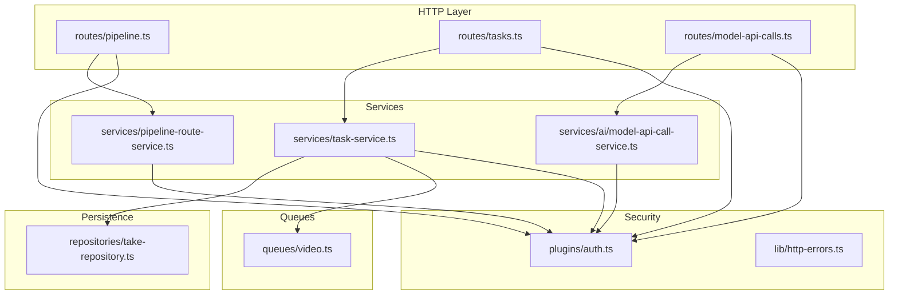
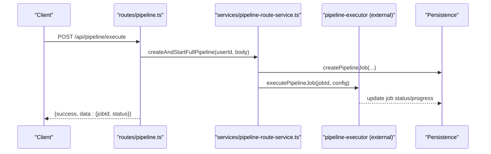
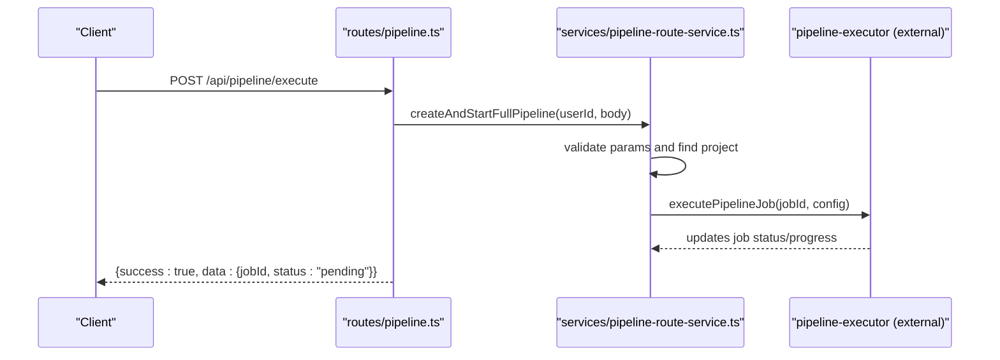
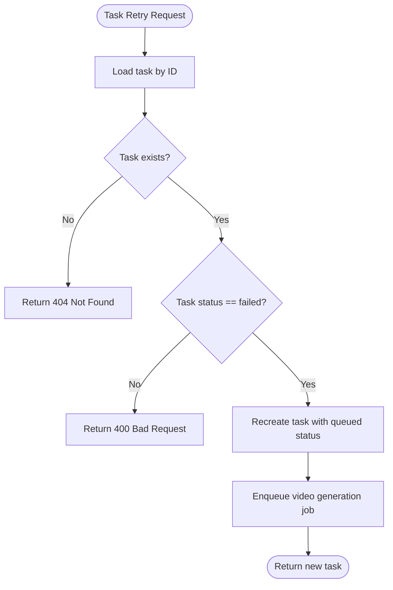
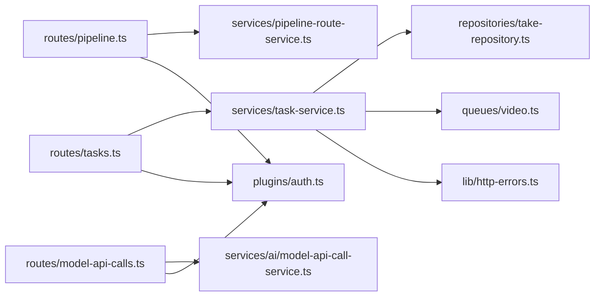

# Pipeline & Task API

<cite>
**Referenced Files in This Document**
- [pipeline.ts](file://packages/backend/src/routes/pipeline.ts)
- [tasks.ts](file://packages/backend/src/routes/tasks.ts)
- [model-api-calls.ts](file://packages/backend/src/routes/model-api-calls.ts)
- [pipeline-route-service.ts](file://packages/backend/src/services/pipeline-route-service.ts)
- [task-service.ts](file://packages/backend/src/services/task-service.ts)
- [model-api-call-service.ts](file://packages/backend/src/services/ai/model-api-call-service.ts)
- [video.ts](file://packages/backend/src/queues/video.ts)
- [take-repository.ts](file://packages/backend/src/repositories/take-repository.ts)
- [auth.ts](file://packages/backend/src/plugins/auth.ts)
- [http-errors.ts](file://packages/backend/src/lib/http-errors.ts)
</cite>

## Table of Contents

1. [Introduction](#introduction)
2. [Project Structure](#project-structure)
3. [Core Components](#core-components)
4. [Architecture Overview](#architecture-overview)
5. [Detailed Component Analysis](#detailed-component-analysis)
6. [Dependency Analysis](#dependency-analysis)
7. [Performance Considerations](#performance-considerations)
8. [Troubleshooting Guide](#troubleshooting-guide)
9. [Conclusion](#conclusion)

## Introduction

This document provides comprehensive API documentation for pipeline orchestration and task management endpoints. It covers:

- Pipeline execution: creation, status retrieval, cancellation, and step catalog
- Task queue management: listing tasks per project, retrieving individual tasks, cancellation, and retry
- Model API call tracking: filtering and pagination of model API usage per user

The documentation explains workflow coordination, step-by-step processing, progress monitoring, error handling, retry mechanisms, and resource allocation. It also specifies pipeline configuration, task prioritization, and monitoring capabilities.

## Project Structure

The relevant backend components are organized under the packages/backend directory:

- Routes define HTTP endpoints and authentication middleware
- Services encapsulate business logic for pipelines, tasks, and model API calls
- Repositories manage persistence for pipeline jobs and tasks
- Queues handle asynchronous work distribution (e.g., video generation)
- Plugins and utilities provide authentication and error handling

**Diagram sources**

- [pipeline.ts:1-143](file://packages/backend/src/routes/pipeline.ts#L1-L143)
- [tasks.ts:1-83](file://packages/backend/src/routes/tasks.ts#L1-L83)
- [model-api-calls.ts:1-20](file://packages/backend/src/routes/model-api-calls.ts#L1-L20)
- [pipeline-route-service.ts:1-193](file://packages/backend/src/services/pipeline-route-service.ts#L1-L193)
- [task-service.ts:1-93](file://packages/backend/src/services/task-service.ts#L1-L93)
- [model-api-call-service.ts:1-41](file://packages/backend/src/services/ai/model-api-call-service.ts#L1-L41)
- [video.ts](file://packages/backend/src/queues/video.ts)
- [take-repository.ts](file://packages/backend/src/repositories/take-repository.ts)
- [auth.ts](file://packages/backend/src/plugins/auth.ts)
- [http-errors.ts](file://packages/backend/src/lib/http-errors.ts)

**Section sources**

- [pipeline.ts:1-143](file://packages/backend/src/routes/pipeline.ts#L1-L143)
- [tasks.ts:1-83](file://packages/backend/src/routes/tasks.ts#L1-L83)
- [model-api-calls.ts:1-20](file://packages/backend/src/routes/model-api-calls.ts#L1-L20)

## Core Components

This section summarizes the primary APIs and their responsibilities.

- Pipeline Execution
  - POST /api/pipeline/execute: Creates and starts a full pipeline job for a project with configuration parameters
  - GET /api/pipeline/job/:jobId: Retrieves detailed status and metadata for a specific job
  - GET /api/pipeline/status/:projectId: Returns the latest pipeline status for a project
  - GET /api/pipeline/steps: Lists available pipeline steps and descriptions
  - GET /api/pipeline/jobs: Lists all jobs for the authenticated user
  - DELETE /api/pipeline/job/:jobId: Cancels a pending pipeline job

- Task Queue Management
  - GET /api/tasks?projectId=...: Lists tasks associated with a project
  - GET /api/tasks/:id: Retrieves a single task by ID
  - POST /api/tasks/:id/cancel: Cancels a queued or running task (if allowed)
  - POST /api/tasks/:id/retry: Retries a failed task by recreating it and re-queueing work

- Model API Call Tracking
  - GET /api/model-api-calls: Lists model API calls for the authenticated user with optional filters

**Section sources**

- [pipeline.ts:11-142](file://packages/backend/src/routes/pipeline.ts#L11-L142)
- [tasks.ts:7-81](file://packages/backend/src/routes/tasks.ts#L7-L81)
- [model-api-calls.ts:5-18](file://packages/backend/src/routes/model-api-calls.ts#L5-L18)

## Architecture Overview

The system follows a layered architecture:

- HTTP routes define endpoints and enforce authentication
- Services implement business logic and orchestrate workflows
- Repositories abstract persistence
- Queues distribute asynchronous workloads
- Plugins and utilities provide cross-cutting concerns (auth, errors)

**Diagram sources**

- [pipeline.ts:11-49](file://packages/backend/src/routes/pipeline.ts#L11-L49)
- [pipeline-route-service.ts:19-93](file://packages/backend/src/services/pipeline-route-service.ts#L19-L93)

## Detailed Component Analysis

### Pipeline Execution API

Endpoints

- POST /api/pipeline/execute
  - Purpose: Create and start a full pipeline job for a project
  - Authentication: Required
  - Request body:
    - projectId: string (required)
    - idea: string (required)
    - targetEpisodes: number (optional)
    - targetDuration: number (optional)
    - defaultAspectRatio: '16:9' | '9:16' | '1:1' (optional)
    - defaultResolution: '480p' | '720p' (optional)
  - Response:
    - success: boolean
    - data.jobId: string
    - data.status: 'pending'
    - data.message: string
  - Error responses:
    - 400: Missing required parameters
    - 404: Project not found
    - 500: Internal server error

- GET /api/pipeline/job/:jobId
  - Purpose: Retrieve detailed job information including step results
  - Response fields:
    - id, projectId, status, jobType, currentStep, progress, progressMeta, error, stepResults, createdAt, updatedAt
  - Error responses:
    - 404: Job not found

- GET /api/pipeline/status/:projectId
  - Purpose: Get the latest pipeline status for a project
  - Response:
    - data.status: 'not_started' | 'pending' | 'running' | 'completed' | 'failed'
    - Additional fields when a job exists: id, status, currentStep, progress, error, stepResults

- GET /api/pipeline/steps
  - Purpose: List available pipeline steps and descriptions

- GET /api/pipeline/jobs
  - Purpose: List all jobs for the authenticated user
  - Response: Array of jobs with summary fields

- DELETE /api/pipeline/job/:jobId
  - Purpose: Cancel a pending job
  - Constraints:
    - Cannot cancel a job that is currently running
  - Error responses:
    - 404: Job not found
    - 400: Cannot cancel a running job

Workflow Coordination and Progress Monitoring

- Step catalog defines four steps: script-writing, episode-split, segment-extract, storyboard
- Jobs maintain currentStep, progress, progressMeta, and stepResults
- Status transitions are managed by the pipeline executor and persisted via the repository

Error Handling and Retry Mechanisms

- Route handlers return structured error bodies with appropriate HTTP status codes
- Pipeline creation catches exceptions and returns 500 with error message
- Cancellation validates job state before updating status

Resource Allocation

- Pipeline configuration supports aspect ratio and resolution defaults
- Aspect ratio resolution considers project defaults when not provided

**Section sources**

- [pipeline.ts:11-142](file://packages/backend/src/routes/pipeline.ts#L11-L142)
- [pipeline-route-service.ts:8-193](file://packages/backend/src/services/pipeline-route-service.ts#L8-L193)

#### Pipeline Execution Sequence

**Diagram sources**

- [pipeline.ts:11-49](file://packages/backend/src/routes/pipeline.ts#L11-L49)
- [pipeline-route-service.ts:19-93](file://packages/backend/src/services/pipeline-route-service.ts#L19-L93)

### Task Queue Management API

Endpoints

- GET /api/tasks?projectId=...
  - Purpose: List tasks for a given project
  - Response: Array of tasks enriched with scene metadata (sceneNum, sceneDescription)
  - Sorting: Tasks are sorted by creation time (newest first)

- GET /api/tasks/:id
  - Purpose: Retrieve a single task by ID
  - Access control: Requires ownership verification

- POST /api/tasks/:id/cancel
  - Purpose: Cancel a task if it is not already completed or failed
  - Behavior: Marks task as failed with user-cancelled error and resets scene status to pending

- POST /api/tasks/:id/retry
  - Purpose: Retry a failed task
  - Behavior: Recreates the task with queued status and enqueues a video generation job

Access Control and Permissions

- Ownership checks are performed for both tasks and projects
- Unauthorized access returns 403 with a standardized permission denied body

Error Handling

- Not found: 404 when task or project does not exist
- Validation: 400 for invalid operations (e.g., cancelling completed/failed tasks, retrying non-failed tasks)

**Diagram sources**

- [task-service.ts:61-89](file://packages/backend/src/services/task-service.ts#L61-L89)

**Section sources**

- [tasks.ts:7-81](file://packages/backend/src/routes/tasks.ts#L7-L81)
- [task-service.ts:20-93](file://packages/backend/src/services/task-service.ts#L20-L93)
- [take-repository.ts](file://packages/backend/src/repositories/take-repository.ts)
- [auth.ts](file://packages/backend/src/plugins/auth.ts)
- [http-errors.ts](file://packages/backend/src/lib/http-errors.ts)

### Model API Call Tracking API

Endpoint

- GET /api/model-api-calls
  - Purpose: List model API calls for the authenticated user
  - Query parameters:
    - limit: number (default 50, min 1, max 200)
    - offset: number (default 0)
    - model: string (filter by model)
    - op: string (filter by operation)
    - projectId: string (filter by project)
    - status: string (filter by status)
  - Response:
    - items: array of call records with parsed request parameters in meta
    - limit, offset: pagination metadata

Filtering and Pagination

- Limits are enforced to prevent excessive loads
- Filters are trimmed and normalized before applying

**Section sources**

- [model-api-calls.ts:5-18](file://packages/backend/src/routes/model-api-calls.ts#L5-L18)
- [model-api-call-service.ts:3-41](file://packages/backend/src/services/ai/model-api-call-service.ts#L3-L41)

## Dependency Analysis

Key dependencies and relationships:

- Routes depend on services for business logic
- Services depend on repositories for persistence
- Task service depends on queues for asynchronous work
- All endpoints require authentication via the auth plugin
- Error responses follow a consistent pattern using shared utilities

**Diagram sources**

- [pipeline.ts:1-143](file://packages/backend/src/routes/pipeline.ts#L1-L143)
- [tasks.ts:1-83](file://packages/backend/src/routes/tasks.ts#L1-L83)
- [model-api-calls.ts:1-20](file://packages/backend/src/routes/model-api-calls.ts#L1-L20)
- [pipeline-route-service.ts:1-193](file://packages/backend/src/services/pipeline-route-service.ts#L1-L193)
- [task-service.ts:1-93](file://packages/backend/src/services/task-service.ts#L1-L93)
- [model-api-call-service.ts:1-41](file://packages/backend/src/services/ai/model-api-call-service.ts#L1-L41)
- [video.ts](file://packages/backend/src/queues/video.ts)
- [take-repository.ts](file://packages/backend/src/repositories/take-repository.ts)
- [auth.ts](file://packages/backend/src/plugins/auth.ts)
- [http-errors.ts](file://packages/backend/src/lib/http-errors.ts)

**Section sources**

- [pipeline.ts:1-143](file://packages/backend/src/routes/pipeline.ts#L1-L143)
- [tasks.ts:1-83](file://packages/backend/src/routes/tasks.ts#L1-L83)
- [model-api-calls.ts:1-20](file://packages/backend/src/routes/model-api-calls.ts#L1-L20)
- [task-service.ts:1-93](file://packages/backend/src/services/task-service.ts#L1-L93)

## Performance Considerations

- Pagination limits: The model API call endpoint enforces a maximum page size to avoid heavy queries
- Asynchronous execution: Pipeline jobs and task retries leverage queues to prevent blocking the main thread
- Sorting and aggregation: Task listing aggregates scene metadata and sorts by creation time; consider indexing for large datasets
- Error logging: Pipeline failures are logged to aid debugging and monitoring

## Troubleshooting Guide

Common issues and resolutions:

- 400 Bad Request
  - Pipeline creation missing required parameters
  - Attempting to cancel a completed or failed task
  - Attempting to retry a task that is not failed
- 404 Not Found
  - Job or task does not exist
  - Project not found during pipeline creation
- 403 Forbidden
  - Accessing tasks or projects without proper ownership verification
- 500 Internal Server Error
  - Pipeline creation failure due to unexpected errors

Monitoring and Diagnostics:

- Use GET /api/pipeline/status/:projectId to check the latest pipeline status
- Use GET /api/pipeline/job/:jobId for detailed job information including step results and error messages
- Use GET /api/tasks?projectId=... to inspect task states and troubleshoot failures
- Use GET /api/model-api-calls with filters to audit model API usage

**Section sources**

- [pipeline.ts:30-47](file://packages/backend/src/routes/pipeline.ts#L30-L47)
- [tasks.ts:14-22](file://packages/backend/src/routes/tasks.ts#L14-L22)
- [task-service.ts:41-89](file://packages/backend/src/services/task-service.ts#L41-L89)
- [model-api-call-service.ts:12-26](file://packages/backend/src/services/ai/model-api-call-service.ts#L12-L26)

## Conclusion

The Pipeline & Task API provides a robust foundation for orchestrating AI-driven content production. It supports asynchronous pipeline execution, granular task management with retry and cancellation, and comprehensive monitoring through status endpoints and model API call tracking. The architecture emphasizes separation of concerns, strong access controls, and scalable asynchronous processing via queues.
