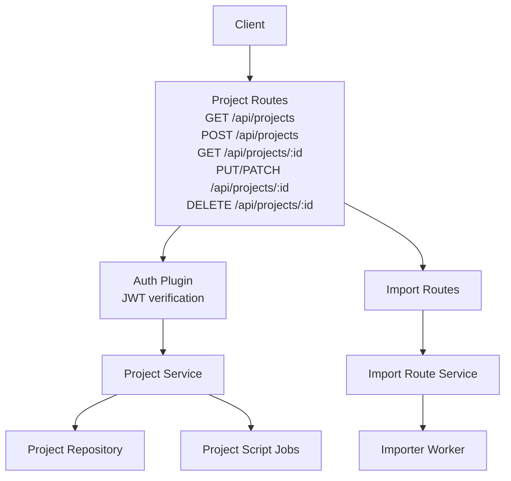
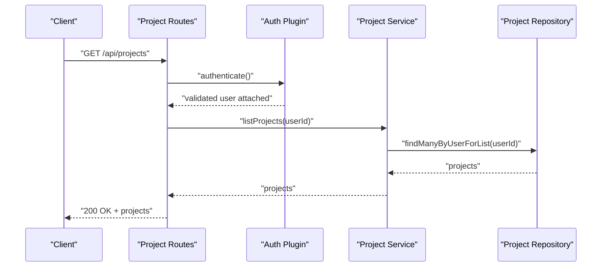
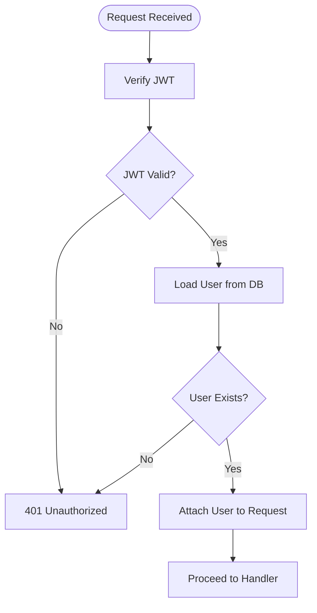
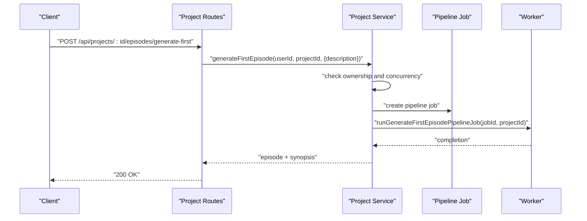
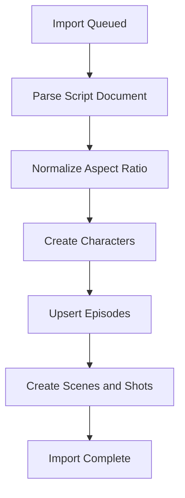
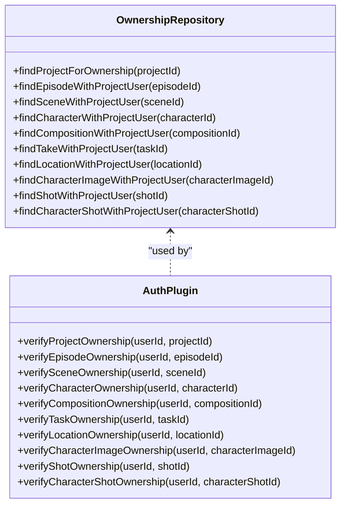
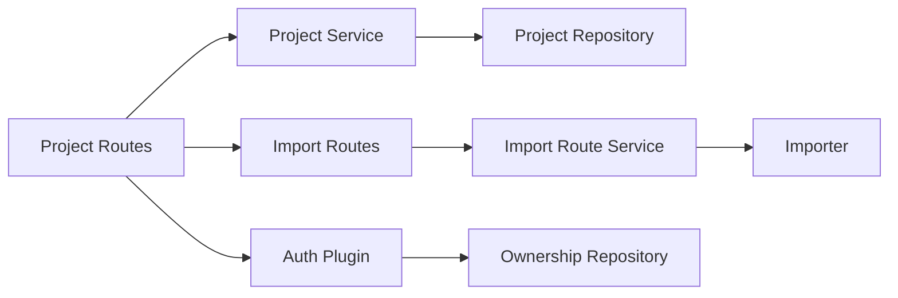

# Project Management API

<cite>
**Referenced Files in This Document**
- [projects.ts](file://packages/backend/src/routes/projects.ts)
- [project-service.ts](file://packages/backend/src/services/project-service.ts)
- [project-repository.ts](file://packages/backend/src/repositories/project-repository.ts)
- [auth.ts](file://packages/backend/src/plugins/auth.ts)
- [ownership-repository.ts](file://packages/backend/src/repositories/ownership-repository.ts)
- [import-route-service.ts](file://packages/backend/src/services/import-route-service.ts)
- [importer.ts](file://packages/backend/src/services/importer.ts)
- [import.ts](file://packages/backend/src/routes/import.ts)
</cite>

## Table of Contents

1. [Introduction](#introduction)
2. [Project Structure](#project-structure)
3. [Core Components](#core-components)
4. [Architecture Overview](#architecture-overview)
5. [Detailed Component Analysis](#detailed-component-analysis)
6. [Dependency Analysis](#dependency-analysis)
7. [Performance Considerations](#performance-considerations)
8. [Troubleshooting Guide](#troubleshooting-guide)
9. [Conclusion](#conclusion)

## Introduction

This document provides comprehensive API documentation for project management endpoints. It covers project creation, retrieval, updates, deletion, import/export functionality, and collaboration features. It specifies request/response schemas, validation rules, permission requirements, and error handling for project ownership and access control.

## Project Structure

The project management API is implemented as a Fastify plugin with route handlers delegating to a service layer, which in turn uses repositories for database operations. Authentication is enforced via a JWT-based middleware that verifies session validity and attaches a user object to the request.

**Diagram sources**

- [projects.ts:1-213](file://packages/backend/src/routes/projects.ts#L1-L213)
- [auth.ts:12-35](file://packages/backend/src/plugins/auth.ts#L12-L35)
- [project-service.ts:51-322](file://packages/backend/src/services/project-service.ts#L51-L322)
- [project-repository.ts:5-160](file://packages/backend/src/repositories/project-repository.ts#L5-L160)
- [import.ts:1-200](file://packages/backend/src/routes/import.ts#L1-L200)
- [import-route-service.ts:23-127](file://packages/backend/src/services/import-route-service.ts#L23-L127)
- [importer.ts:67-160](file://packages/backend/src/services/importer.ts#L67-L160)

**Section sources**

- [projects.ts:1-213](file://packages/backend/src/routes/projects.ts#L1-L213)
- [auth.ts:12-35](file://packages/backend/src/plugins/auth.ts#L12-L35)
- [project-service.ts:51-322](file://packages/backend/src/services/project-service.ts#L51-L322)
- [project-repository.ts:5-160](file://packages/backend/src/repositories/project-repository.ts#L5-L160)
- [import.ts:1-200](file://packages/backend/src/routes/import.ts#L1-L200)
- [import-route-service.ts:23-127](file://packages/backend/src/services/import-route-service.ts#L23-L127)
- [importer.ts:67-160](file://packages/backend/src/services/importer.ts#L67-L160)

## Core Components

- Project Routes: Define endpoints for listing, creating, retrieving, updating, and deleting projects. They enforce authentication and delegate to the Project Service.
- Project Service: Implements business logic for project operations, including validation, ownership checks, and orchestration of related jobs.
- Project Repository: Encapsulates database queries and mutations for projects and related entities.
- Auth Plugin: Provides JWT verification and attaches a validated user to the request.
- Ownership Repository: Supports cross-entity ownership verification used by the auth plugin.
- Import Route Service: Handles import preview, queueing, and task management for script and project imports.
- Importer: Processes parsed script data to create/update characters, episodes, scenes, and shots.

**Section sources**

- [projects.ts:4-213](file://packages/backend/src/routes/projects.ts#L4-L213)
- [project-service.ts:51-322](file://packages/backend/src/services/project-service.ts#L51-L322)
- [project-repository.ts:5-160](file://packages/backend/src/repositories/project-repository.ts#L5-L160)
- [auth.ts:12-35](file://packages/backend/src/plugins/auth.ts#L12-L35)
- [ownership-repository.ts:7-118](file://packages/backend/src/repositories/ownership-repository.ts#L7-L118)
- [import-route-service.ts:23-127](file://packages/backend/src/services/import-route-service.ts#L23-L127)
- [importer.ts:67-160](file://packages/backend/src/services/importer.ts#L67-L160)

## Architecture Overview

The API follows a layered architecture:

- Presentation Layer: Fastify routes define endpoint contracts and request/response shapes.
- Application Layer: Services encapsulate business rules and coordinate operations.
- Domain Layer: Repositories abstract persistence concerns.
- Security Layer: Auth plugin enforces JWT-based authentication and ownership checks.

**Diagram sources**

- [projects.ts:6-9](file://packages/backend/src/routes/projects.ts#L6-L9)
- [auth.ts:12-35](file://packages/backend/src/plugins/auth.ts#L12-L35)
- [project-service.ts:54-56](file://packages/backend/src/services/project-service.ts#L54-L56)
- [project-repository.ts:8-16](file://packages/backend/src/repositories/project-repository.ts#L8-L16)

## Detailed Component Analysis

### Authentication and Authorization

- Authentication: All project endpoints require a valid JWT. The auth plugin verifies the token and ensures the user exists in the database.
- Authorization: Ownership checks are performed against the project resource. The service validates that the requesting user owns the project before allowing modifications or deletions.

**Diagram sources**

- [auth.ts:12-35](file://packages/backend/src/plugins/auth.ts#L12-L35)

**Section sources**

- [auth.ts:12-35](file://packages/backend/src/plugins/auth.ts#L12-L35)
- [project-service.ts:274-318](file://packages/backend/src/services/project-service.ts#L274-L318)
- [ownership-repository.ts:10-15](file://packages/backend/src/repositories/ownership-repository.ts#L10-L15)

### Project Endpoints

#### GET /api/projects

- Purpose: Retrieve a list of projects owned by the authenticated user.
- Authentication: Required.
- Response: Array of projects with basic metadata (e.g., id, name, description, createdAt, character preview).
- Notes: Projects are ordered by creation date descending.

**Section sources**

- [projects.ts:6-9](file://packages/backend/src/routes/projects.ts#L6-L9)
- [project-service.ts:54-56](file://packages/backend/src/services/project-service.ts#L54-L56)
- [project-repository.ts:8-16](file://packages/backend/src/repositories/project-repository.ts#L8-L16)

#### POST /api/projects

- Purpose: Create a new project for the authenticated user.
- Authentication: Required.
- Request Body:
  - name: string (required)
  - description: string (optional)
  - aspectRatio: string (optional)
- Validation:
  - name is required.
  - aspectRatio, if provided, is normalized by the service.
- Response: Created project object (201 Created).
- Error Codes:
  - 400 Bad Request: Validation errors.
  - 500 Internal Server Error: Unexpected failure.

**Section sources**

- [projects.ts:12-25](file://packages/backend/src/routes/projects.ts#L12-L25)
- [project-service.ts:58-68](file://packages/backend/src/services/project-service.ts#L58-L68)
- [project-repository.ts:18-20](file://packages/backend/src/repositories/project-repository.ts#L18-L20)

#### GET /api/projects/:id

- Purpose: Retrieve detailed information for a specific project owned by the authenticated user.
- Authentication: Required.
- Path Parameters:
  - id: string (required)
- Response: Project with episodes, characters (with images), locations, and compositions included.
- Error Codes:
  - 404 Not Found: Project does not exist or is not owned by the user.

**Section sources**

- [projects.ts:126-140](file://packages/backend/src/routes/projects.ts#L126-L140)
- [project-service.ts:270-272](file://packages/backend/src/services/project-service.ts#L270-L272)
- [project-repository.ts:49-62](file://packages/backend/src/repositories/project-repository.ts#L49-L62)

#### PUT /api/projects/:id and PATCH /api/projects/:id

- Purpose: Update project attributes for the authenticated user’s project.
- Authentication: Required.
- Path Parameters:
  - id: string (required)
- Request Body:
  - name: string (optional)
  - description: string (optional)
  - synopsis: string | null (optional)
  - visualStyle: string[] (optional)
  - aspectRatio: string (optional)
- Validation:
  - visualStyle must be an array of strings.
  - aspectRatio must be a string; if provided, it is normalized.
  - At least one field must be present; otherwise, the request is accepted without changes.
- Response: Updated project object.
- Error Codes:
  - 400 Bad Request: Invalid field types or missing required fields.
  - 404 Not Found: Project not found or not owned.

**Section sources**

- [projects.ts:170-195](file://packages/backend/src/routes/projects.ts#L170-L195)
- [project-service.ts:274-309](file://packages/backend/src/services/project-service.ts#L274-L309)

#### DELETE /api/projects/:id

- Purpose: Delete a project owned by the authenticated user.
- Authentication: Required.
- Path Parameters:
  - id: string (required)
- Response: No Content (204).
- Error Codes:
  - 404 Not Found: Project not found or not owned.

**Section sources**

- [projects.ts:197-211](file://packages/backend/src/routes/projects.ts#L197-L211)
- [project-service.ts:311-318](file://packages/backend/src/services/project-service.ts#L311-L318)

### Project Generation and Parsing Endpoints

These endpoints support asynchronous workflows for generating episodes and parsing scripts. They enforce mutual exclusion of concurrent outline pipeline jobs.

**Diagram sources**

- [projects.ts:27-52](file://packages/backend/src/routes/projects.ts#L27-L52)
- [project-service.ts:70-115](file://packages/backend/src/services/project-service.ts#L70-L115)

**Section sources**

- [projects.ts:27-105](file://packages/backend/src/routes/projects.ts#L27-L105)
- [project-service.ts:70-115](file://packages/backend/src/services/project-service.ts#L70-L115)

### Import/Export Functionality

The system supports importing scripts and projects, with preview capabilities and queued processing.

#### Import Preview

- Endpoint: POST /api/import/preview
- Purpose: Preview import details for a script document without persisting changes.
- Request:
  - content: string (required)
  - type: "markdown" | "json" (required)
- Response:
  - projectName: string
  - description: string
  - characters: array
  - episodes: array of episode previews with scene counts and sample scenes
  - aiCost: number
- Error Codes:
  - 400 Bad Request: Missing parameters or parsing failures.

**Section sources**

- [import-route-service.ts:26-68](file://packages/backend/src/services/import-route-service.ts#L26-L68)

#### Enqueue Script Import

- Endpoint: POST /api/import/script
- Purpose: Queue a script import for a specific project.
- Request:
  - projectId: string (required)
  - content: string (required)
  - type: "markdown" | "json" (required)
- Response:
  - taskId: string
  - status: "pending"

**Section sources**

- [import-route-service.ts:70-93](file://packages/backend/src/services/import-route-service.ts#L70-L93)

#### Enqueue Project Import

- Endpoint: POST /api/import/project
- Purpose: Queue a project import (without an existing project ID).
- Request:
  - content: string (required)
  - type: "markdown" | "json" (required)
- Response:
  - taskId: string
  - status: "pending"

**Section sources**

- [import-route-service.ts:95-111](file://packages/backend/src/services/import-route-service.ts#L95-L111)

#### Import Task Status and Listing

- Endpoint: GET /api/import/tasks/:taskId
- Purpose: Retrieve import task details.
- Response: Task record.

- Endpoint: GET /api/import/tasks
- Purpose: List import tasks for the authenticated user.
- Query Parameters:
  - limit: number (default 20)
  - offset: number (default 0)
- Response:
  - tasks: array
  - total: number

**Section sources**

- [import-route-service.ts:113-123](file://packages/backend/src/services/import-route-service.ts#L113-L123)

#### Import Processing

- Worker: The import queue triggers the importer to process parsed data, creating/updating characters, episodes, scenes, and shots while normalizing aspect ratios.

**Diagram sources**

- [importer.ts:67-160](file://packages/backend/src/services/importer.ts#L67-L160)

**Section sources**

- [importer.ts:67-160](file://packages/backend/src/services/importer.ts#L67-L160)

### Team Member Management and Collaboration

- Ownership Model: Access control is enforced per-project via the ownership repository. Only the project owner can modify or delete the project.
- Cross-resource Ownership: The auth plugin provides helpers to verify ownership across episodes, scenes, characters, compositions, locations, and related entities.

**Diagram sources**

- [ownership-repository.ts:7-118](file://packages/backend/src/repositories/ownership-repository.ts#L7-L118)
- [auth.ts:38-107](file://packages/backend/src/plugins/auth.ts#L38-L107)

**Section sources**

- [ownership-repository.ts:7-118](file://packages/backend/src/repositories/ownership-repository.ts#L7-L118)
- [auth.ts:38-107](file://packages/backend/src/plugins/auth.ts#L38-L107)

### Project Settings

- aspectRatio: Can be set during creation and updated via PUT/PATCH. Values are normalized by the service to ensure consistent storage and downstream processing.
- visualStyle: An array of strings representing stylistic preferences for the project.
- synopsis: Optional free-text summary that can be cleared by sending null.

**Section sources**

- [project-service.ts:14-26](file://packages/backend/src/services/project-service.ts#L14-L26)
- [project-service.ts:274-309](file://packages/backend/src/services/project-service.ts#L274-L309)
- [project-repository.ts:18-20](file://packages/backend/src/repositories/project-repository.ts#L18-L20)

## Dependency Analysis

The project management API exhibits clear separation of concerns:

- Routes depend on the service layer for business logic.
- Services depend on repositories for persistence.
- Auth plugin centralizes JWT verification and ownership checks.
- Import routes depend on the import route service and importer worker.

**Diagram sources**

- [projects.ts:4-213](file://packages/backend/src/routes/projects.ts#L4-L213)
- [project-service.ts:51-322](file://packages/backend/src/services/project-service.ts#L51-L322)
- [project-repository.ts:5-160](file://packages/backend/src/repositories/project-repository.ts#L5-L160)
- [import.ts:1-200](file://packages/backend/src/routes/import.ts#L1-L200)
- [import-route-service.ts:23-127](file://packages/backend/src/services/import-route-service.ts#L23-L127)
- [importer.ts:67-160](file://packages/backend/src/services/importer.ts#L67-L160)
- [auth.ts:12-35](file://packages/backend/src/plugins/auth.ts#L12-L35)
- [ownership-repository.ts:7-118](file://packages/backend/src/repositories/ownership-repository.ts#L7-L118)

**Section sources**

- [projects.ts:4-213](file://packages/backend/src/routes/projects.ts#L4-L213)
- [project-service.ts:51-322](file://packages/backend/src/services/project-service.ts#L51-L322)
- [project-repository.ts:5-160](file://packages/backend/src/repositories/project-repository.ts#L5-L160)
- [import.ts:1-200](file://packages/backend/src/routes/import.ts#L1-L200)
- [import-route-service.ts:23-127](file://packages/backend/src/services/import-route-service.ts#L23-L127)
- [importer.ts:67-160](file://packages/backend/src/services/importer.ts#L67-L160)
- [auth.ts:12-35](file://packages/backend/src/plugins/auth.ts#L12-L35)
- [ownership-repository.ts:7-118](file://packages/backend/src/repositories/ownership-repository.ts#L7-L118)

## Performance Considerations

- Asynchronous Operations: Episode generation and script parsing are queued and executed asynchronously to avoid blocking requests.
- Concurrency Control: Mutual exclusion prevents overlapping outline pipeline jobs, reducing contention and ensuring predictable outcomes.
- Selective Includes: Repository queries include only necessary relations to minimize payload sizes and database load.

## Troubleshooting Guide

- 401 Unauthorized:
  - Cause: Missing or invalid JWT, or user not found in the database.
  - Resolution: Re-authenticate and ensure the token is valid and unexpired.
- 403 Forbidden:
  - Cause: Not applicable for project endpoints; ownership checks return 404 if not owned.
- 404 Not Found:
  - Cause: Project does not exist or is not owned by the user.
  - Resolution: Verify the project ID and ensure ownership.
- 400 Bad Request:
  - Cause: Invalid field types (e.g., visualStyle not an array, aspectRatio not a string) or invalid parameters for generation/parsing.
  - Resolution: Correct the request body according to validation rules.
- 409 Conflict:
  - Cause: Concurrent outline pipeline job detected.
  - Resolution: Wait until the current job completes before initiating another operation.
- 500 Internal Server Error:
  - Cause: Unexpected failure during generation or parsing.
  - Resolution: Retry after checking server logs for detailed error messages.

**Section sources**

- [auth.ts:12-35](file://packages/backend/src/plugins/auth.ts#L12-L35)
- [project-service.ts:74-106](file://packages/backend/src/services/project-service.ts#L74-L106)
- [project-service.ts:127-133](file://packages/backend/src/services/project-service.ts#L127-L133)
- [project-service.ts:191-200](file://packages/backend/src/services/project-service.ts#L191-L200)
- [project-service.ts:291-301](file://packages/backend/src/services/project-service.ts#L291-L301)

## Conclusion

The project management API provides a secure, extensible foundation for managing projects, including creation, retrieval, updates, deletion, and advanced workflows such as episode generation and script parsing. Import/export capabilities enable seamless content ingestion, while robust ownership checks and error handling ensure safe collaboration and predictable behavior.
