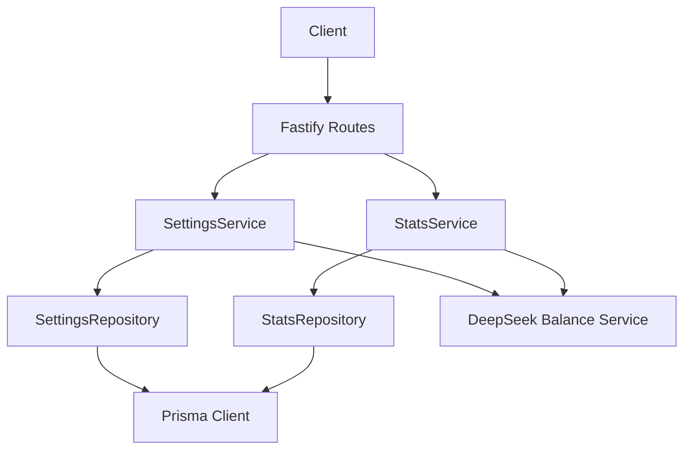
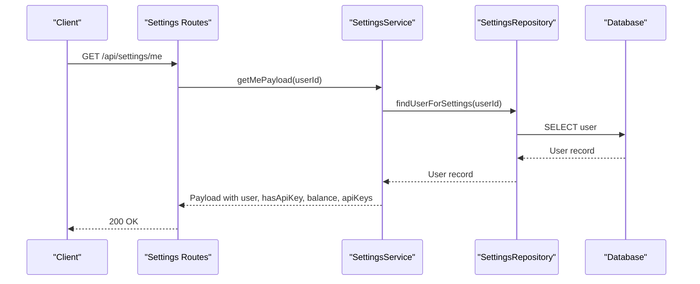
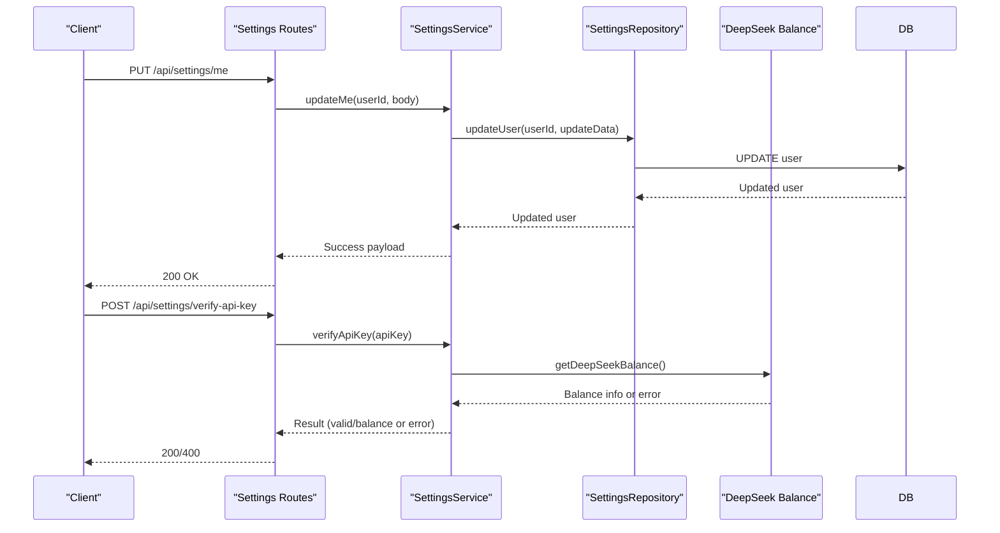
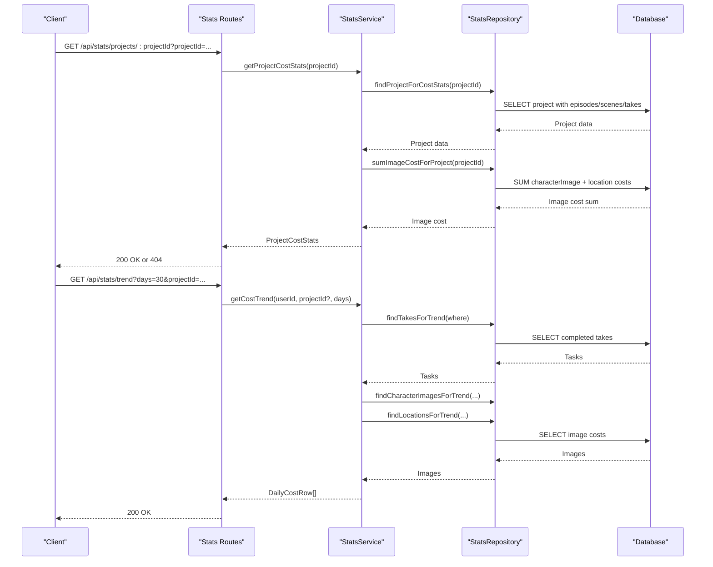
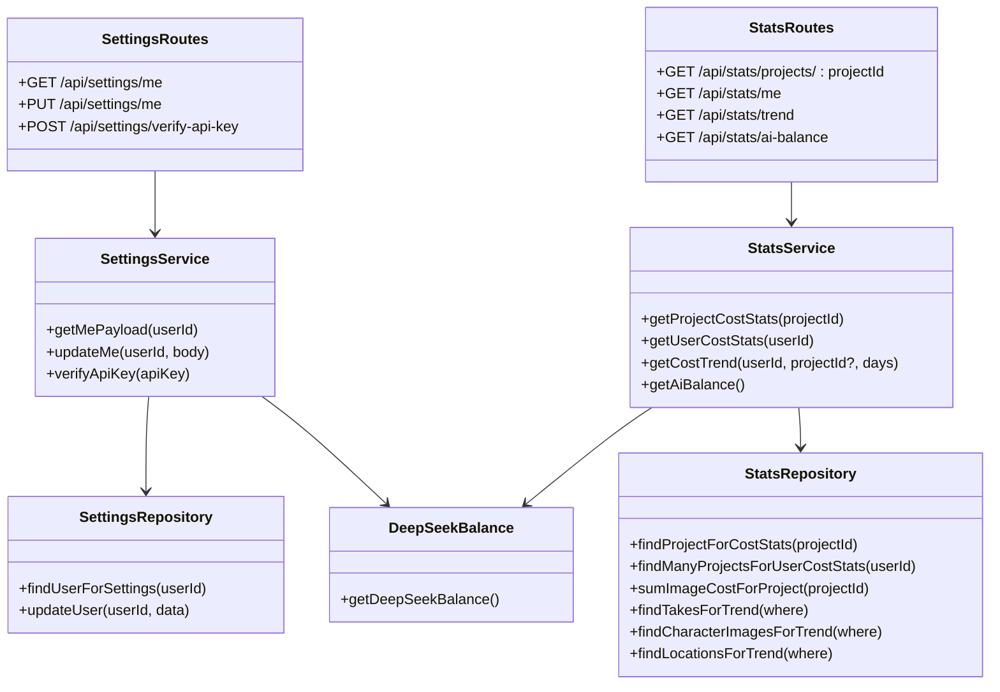

# System Settings API

<cite>
**Referenced Files in This Document**
- [settings.ts](file://packages/backend/src/routes/settings.ts)
- [stats.ts](file://packages/backend/src/routes/stats.ts)
- [settings-service.ts](file://packages/backend/src/services/settings-service.ts)
- [stats-service.ts](file://packages/backend/src/services/stats-service.ts)
- [settings-repository.ts](file://packages/backend/src/repositories/settings-repository.ts)
- [stats-repository.ts](file://packages/backend/src/repositories/stats-repository.ts)
- [deepseek.ts](file://packages/backend/src/services/ai/deepseek.ts)
- [deepseek-balance.ts](file://packages/backend/src/services/ai/deepseek-balance.ts)
- [index.ts](file://packages/backend/src/index.ts)
- [settings.test.ts](file://packages/backend/tests/settings.test.ts)
- [stats.test.ts](file://packages/backend/tests/stats.test.ts)
</cite>

## Table of Contents

1. [Introduction](#introduction)
2. [Project Structure](#project-structure)
3. [Core Components](#core-components)
4. [Architecture Overview](#architecture-overview)
5. [Detailed Component Analysis](#detailed-component-analysis)
6. [Dependency Analysis](#dependency-analysis)
7. [Performance Considerations](#performance-considerations)
8. [Troubleshooting Guide](#troubleshooting-guide)
9. [Conclusion](#conclusion)

## Introduction

This document provides comprehensive API documentation for system configuration and statistics endpoints. It covers:

- Settings management endpoints for user configuration and API key verification
- Statistics and analytics endpoints for usage metrics, cost tracking, and system health reporting
- Configuration schemas, validation rules, and administrative access requirements

The APIs are built with Fastify and TypeScript, using a layered architecture with routes, services, and repositories. Authentication is enforced via a JWT-based authentication plugin.

## Project Structure

The relevant components are organized into routes, services, and repositories:

- Routes define HTTP endpoints and request handlers
- Services encapsulate business logic and orchestrate data access
- Repositories handle database queries using Prisma
- AI services provide external API integrations (e.g., DeepSeek balance checks)

**Diagram sources**

- [settings.ts:1-60](file://packages/backend/src/routes/settings.ts#L1-L60)
- [stats.ts:1-50](file://packages/backend/src/routes/stats.ts#L1-L50)
- [settings-service.ts:1-117](file://packages/backend/src/services/settings-service.ts#L1-L117)
- [stats-service.ts:1-252](file://packages/backend/src/services/stats-service.ts#L1-L252)
- [settings-repository.ts:1-42](file://packages/backend/src/repositories/settings-repository.ts#L1-L42)
- [stats-repository.ts:1-89](file://packages/backend/src/repositories/stats-repository.ts#L1-L89)
- [deepseek-balance.ts:1-34](file://packages/backend/src/services/ai/deepseek-balance.ts#L1-L34)

**Section sources**

- [index.ts:88-107](file://packages/backend/src/index.ts#L88-L107)

## Core Components

This section documents the primary endpoints for settings and statistics, including request/response schemas, validation rules, and access requirements.

### Settings Endpoints

- GET /api/settings/me
  - Purpose: Retrieve current user's settings payload
  - Authentication: Required (JWT)
  - Response: User profile, API key presence flag, optional account balance and error, and provider-specific API keys
  - Validation: None (returns stored values)
  - Access: Self-only (authenticated user)

- PUT /api/settings/me
  - Purpose: Update user settings (name, API key, provider API keys)
  - Authentication: Required (JWT)
  - Request body:
    - Optional name: string
    - Optional apiKey: string (empty string clears key)
    - Optional apiKeys: object containing:
      - deepseekApiUrl: string
      - atlasApiKey: string
      - atlasApiUrl: string
      - arkApiKey: string
      - arkApiUrl: string
  - Response: Success indicator and updated user profile (id, email, name, hasApiKey)
  - Validation:
    - Empty apiKey value clears the key
    - Partial updates supported per field
  - Access: Self-only (authenticated user)

- POST /api/settings/verify-api-key
  - Purpose: Verify an API key against external provider
  - Authentication: Required (JWT)
  - Request body: apiKey: string
  - Response:
    - On success: valid: true, balance: object from provider
    - On empty key: 400 with error message
    - On invalid key: 400 with error details
  - Validation: Non-empty apiKey required
  - Access: Self-only (authenticated user)

**Section sources**

- [settings.ts:6-58](file://packages/backend/src/routes/settings.ts#L6-L58)
- [settings-service.ts:8-113](file://packages/backend/src/services/settings-service.ts#L8-L113)
- [settings-repository.ts:20-38](file://packages/backend/src/repositories/settings-repository.ts#L20-L38)

### Statistics Endpoints

- GET /api/stats/projects/:projectId
  - Purpose: Retrieve cost statistics for a specific project
  - Authentication: Required (JWT)
  - Query: projectId: string (required)
  - Response: ProjectCostStats object
  - Validation: projectId must reference an existing project
  - Access: Owner-only (authenticated user owns the project)

- GET /api/stats/me
  - Purpose: Retrieve cost statistics for current user across all projects
  - Authentication: Required (JWT)
  - Response: UserCostStats object
  - Validation: None (aggregates across owned projects)
  - Access: Self-only (authenticated user)

- GET /api/stats/trend
  - Purpose: Retrieve daily cost trend
  - Authentication: Required (JWT)
  - Query:
    - projectId?: string (optional)
    - days?: number (default: 30)
  - Response: Array of DailyCostRow objects sorted by date
  - Validation: days must be a positive integer
  - Access: Self-only (authenticated user)

- GET /api/stats/ai-balance
  - Purpose: Retrieve current AI provider account balance
  - Authentication: Required (JWT)
  - Response: DeepSeekBalance object or error wrapper
  - Validation: None (external API call)
  - Access: Self-only (authenticated user)

**Section sources**

- [stats.ts:12-48](file://packages/backend/src/routes/stats.ts#L12-L48)
- [stats-service.ts:105-248](file://packages/backend/src/services/stats-service.ts#L105-L248)
- [stats-repository.ts:7-85](file://packages/backend/src/repositories/stats-repository.ts#L7-L85)

## Architecture Overview

The system follows a clean architecture pattern:

- Routes layer handles HTTP concerns and request/response formatting
- Services layer encapsulates business logic and orchestrates repositories
- Repositories layer abstracts data access via Prisma
- AI services integrate with external providers (e.g., DeepSeek)

**Diagram sources**

- [settings.ts:6-9](file://packages/backend/src/routes/settings.ts#L6-L9)
- [settings-service.ts:8-49](file://packages/backend/src/services/settings-service.ts#L8-L49)
- [settings-repository.ts:20-25](file://packages/backend/src/repositories/settings-repository.ts#L20-L25)

**Section sources**

- [settings-service.ts:5-117](file://packages/backend/src/services/settings-service.ts#L5-L117)
- [stats-service.ts:102-252](file://packages/backend/src/services/stats-service.ts#L102-L252)

## Detailed Component Analysis

### Settings Management Flow

The settings endpoints provide user-centric configuration management with optional provider API key verification.

**Diagram sources**

- [settings.ts:12-58](file://packages/backend/src/routes/settings.ts#L12-L58)
- [settings-service.ts:51-113](file://packages/backend/src/services/settings-service.ts#L51-L113)
- [settings-repository.ts:27-38](file://packages/backend/src/repositories/settings-repository.ts#L27-L38)
- [deepseek-balance.ts:11-33](file://packages/backend/src/services/ai/deepseek-balance.ts#L11-L33)

**Section sources**

- [settings-service.ts:51-113](file://packages/backend/src/services/settings-service.ts#L51-L113)
- [settings-repository.ts:27-38](file://packages/backend/src/repositories/settings-repository.ts#L27-L38)

### Statistics and Analytics Flow

The statistics endpoints aggregate costs across projects, tasks, and images, with optional daily trend analysis.

**Diagram sources**

- [stats.ts:12-43](file://packages/backend/src/routes/stats.ts#L12-L43)
- [stats-service.ts:105-238](file://packages/backend/src/services/stats-service.ts#L105-L238)
- [stats-repository.ts:7-85](file://packages/backend/src/repositories/stats-repository.ts#L7-L85)

**Section sources**

- [stats-service.ts:105-238](file://packages/backend/src/services/stats-service.ts#L105-L238)
- [stats-repository.ts:7-85](file://packages/backend/src/repositories/stats-repository.ts#L7-L85)

### Data Models and Schemas

This section defines the data structures returned by the endpoints.

- ProjectCostStats
  - projectId: string
  - projectName: string
  - totalCost: number
  - aiCost: number
  - videoCost: number
  - imageCost: number
  - totalTasks: number
  - completedTasks: number
  - failedTasks: number
  - tasksByModel: {
    wan2dot6: { count: number; cost: number }
    seedance2dot0: { count: number; cost: number }
    }
  - recentTasks: Array of {
    id: string
    model: string
    cost: number
    status: string
    createdAt: Date
    }

- UserCostStats
  - userId: string
  - totalCost: number
  - aiCost: number
  - videoCost: number
  - imageCost: number
  - totalProjects: number
  - totalTasks: number
  - projects: ProjectCostStats[]

- DailyCostRow
  - date: string (YYYY-MM-DD)
  - wanCost: number
  - seedanceCost: number
  - imageCost: number
  - total: number

- DeepSeekBalance
  - isAvailable: boolean
  - balanceInfos: Array of {
    currency: string
    totalBalance: number
    grantedBalance: number
    toppedUpBalance: number
    }
  - error?: string (when unavailable)

**Section sources**

- [stats-service.ts:4-37](file://packages/backend/src/services/stats-service.ts#L4-L37)
- [stats-service.ts:94-100](file://packages/backend/src/services/stats-service.ts#L94-L100)
- [stats-service.ts:240-248](file://packages/backend/src/services/stats-service.ts#L240-L248)

## Dependency Analysis

The following diagram shows the key dependencies among components:

**Diagram sources**

- [settings.ts:1-60](file://packages/backend/src/routes/settings.ts#L1-L60)
- [stats.ts:1-50](file://packages/backend/src/routes/stats.ts#L1-L50)
- [settings-service.ts:5-117](file://packages/backend/src/services/settings-service.ts#L5-L117)
- [stats-service.ts:102-252](file://packages/backend/src/services/stats-service.ts#L102-L252)
- [settings-repository.ts:17-42](file://packages/backend/src/repositories/settings-repository.ts#L17-L42)
- [stats-repository.ts:4-89](file://packages/backend/src/repositories/stats-repository.ts#L4-L89)
- [deepseek-balance.ts:11-33](file://packages/backend/src/services/ai/deepseek-balance.ts#L11-L33)

**Section sources**

- [settings-service.ts:5-117](file://packages/backend/src/services/settings-service.ts#L5-L117)
- [stats-service.ts:102-252](file://packages/backend/src/services/stats-service.ts#L102-L252)

## Performance Considerations

- Settings endpoint
  - Single database read for user retrieval
  - Optional external API call for balance verification; cache results at the client level if frequent checks occur
- Statistics endpoint
  - Project-level aggregation involves nested includes; consider pagination or filtering for large datasets
  - Trend calculation performs multiple queries and aggregates; limit days window to reduce payload size
  - Image cost aggregation uses parallel queries; ensure database indexing on relevant fields

[No sources needed since this section provides general guidance]

## Troubleshooting Guide

Common issues and resolutions:

- Authentication failures
  - Ensure JWT token is present and valid in Authorization header
  - Verify the authentication plugin is registered and configured correctly
- Settings update errors
  - Confirm the request body matches the expected schema
  - Empty apiKey clears the key; verify intended behavior
- API key verification failures
  - External provider may reject invalid or expired keys
  - Check network connectivity and provider service status
- Statistics not found
  - Project ID must belong to the authenticated user
  - Ensure the project has associated episodes/scenes/takes

**Section sources**

- [settings.ts:36-58](file://packages/backend/src/routes/settings.ts#L36-L58)
- [stats.ts:12-24](file://packages/backend/src/routes/stats.ts#L12-L24)
- [settings.test.ts:182-208](file://packages/backend/tests/settings.test.ts#L182-L208)
- [stats.test.ts:118-128](file://packages/backend/tests/stats.test.ts#L118-L128)

## Conclusion

The system provides robust endpoints for managing user settings and retrieving comprehensive statistics. The architecture cleanly separates concerns across routes, services, and repositories, enabling maintainable and testable code. Proper authentication and validation ensure secure access to sensitive configuration and financial data.
