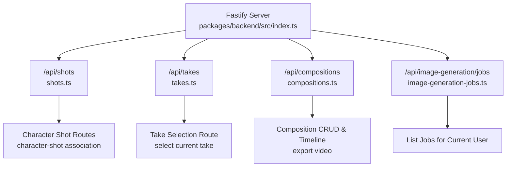
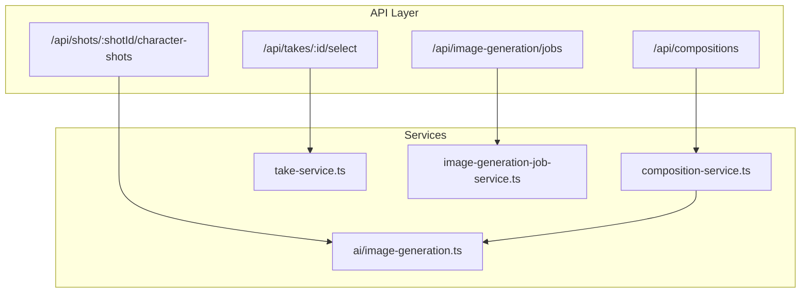
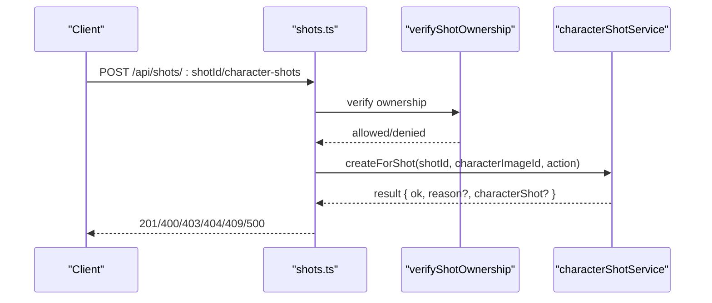
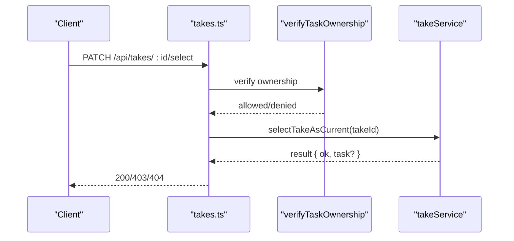
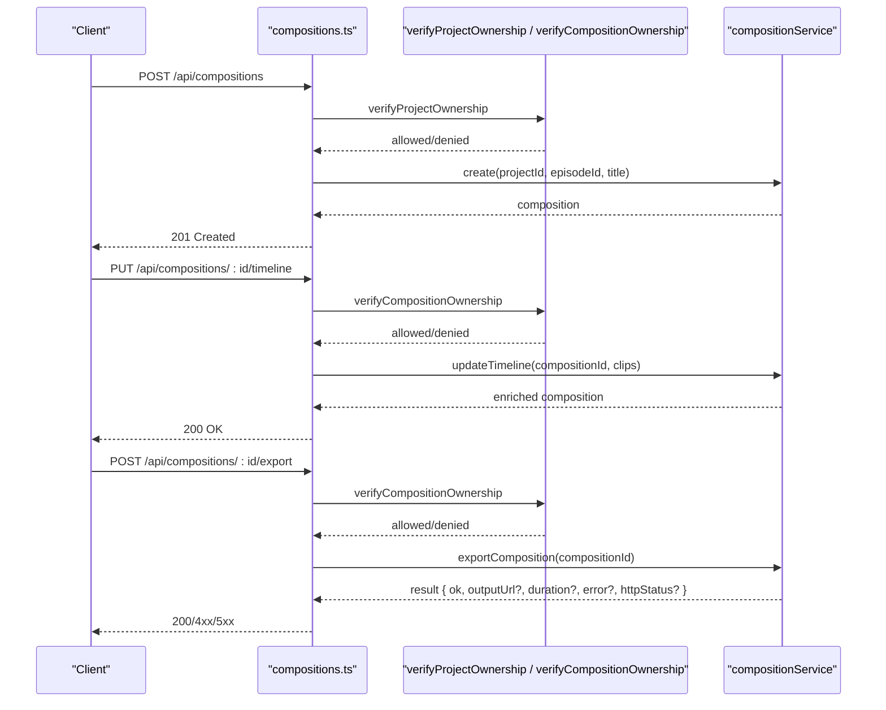
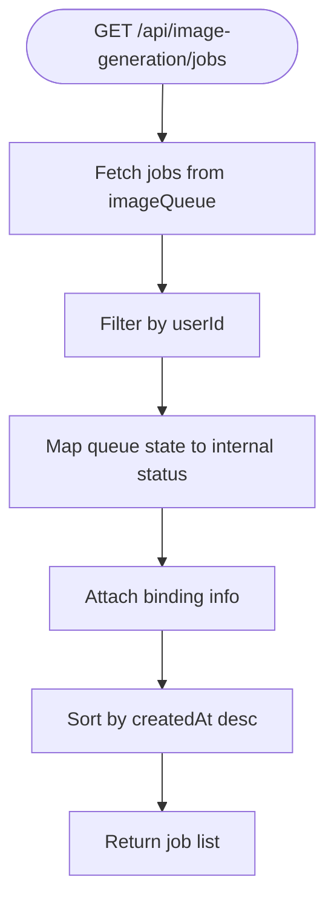
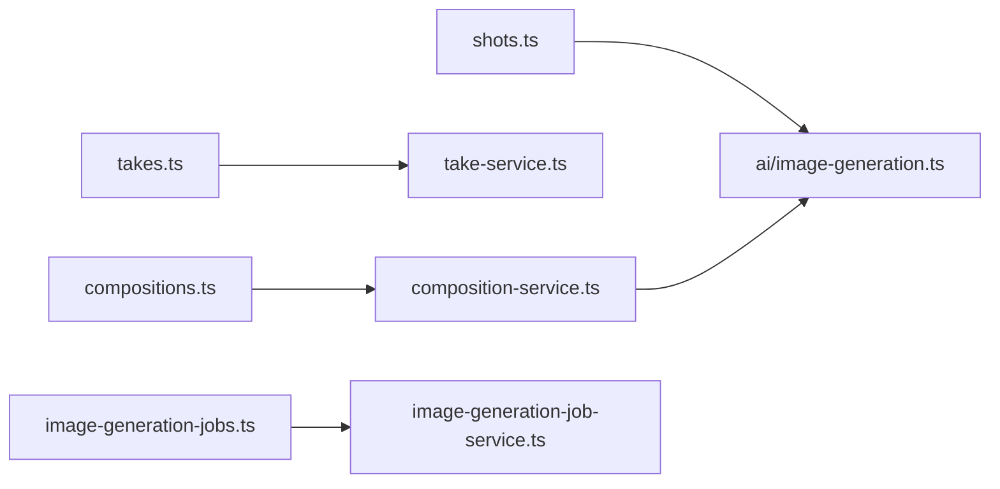

# Video Generation API

<cite>
**Referenced Files in This Document**
- [index.ts](file://packages/backend/src/index.ts)
- [shots.ts](file://packages/backend/src/routes/shots.ts)
- [takes.ts](file://packages/backend/src/routes/takes.ts)
- [compositions.ts](file://packages/backend/src/routes/compositions.ts)
- [image-generation-jobs.ts](file://packages/backend/src/routes/image-generation-jobs.ts)
- [composition-service.ts](file://packages/backend/src/services/composition-service.ts)
- [take-service.ts](file://packages/backend/src/services/take-service.ts)
- [image-generation-job-service.ts](file://packages/backend/src/services/image-generation-job-service.ts)
- [image-generation.ts](file://packages/backend/src/services/ai/image-generation.ts)
- [deepseek.ts](file://packages/backend/src/services/ai/deepseek.ts)
</cite>

## Table of Contents

1. [Introduction](#introduction)
2. [Project Structure](#project-structure)
3. [Core Components](#core-components)
4. [Architecture Overview](#architecture-overview)
5. [Detailed Component Analysis](#detailed-component-analysis)
6. [Dependency Analysis](#dependency-analysis)
7. [Performance Considerations](#performance-considerations)
8. [Troubleshooting Guide](#troubleshooting-guide)
9. [Conclusion](#conclusion)

## Introduction

This document describes the video generation and composition APIs exposed by the backend. It covers:

- Shot management: associating character images to shots
- Take generation and selection: marking a selected take for a scene
- Composition assembly: creating compositions, managing timelines, and exporting videos
- Image generation jobs: listing user image generation tasks and understanding their status

It also documents AI model integration, generation parameters, quality assessment via cost estimation, timeline editing, and final output generation. Request schemas, progress tracking, and result retrieval are specified.

## Project Structure

The backend registers API routes under the /api/\* namespace. The relevant endpoints for video generation and composition are registered in the main server bootstrap.

**Diagram sources**

- [index.ts:98-115](file://packages/backend/src/index.ts#L98-L115)
- [shots.ts:6-44](file://packages/backend/src/routes/shots.ts#L6-L44)
- [takes.ts:6-27](file://packages/backend/src/routes/takes.ts#L6-L27)
- [compositions.ts:6-143](file://packages/backend/src/routes/compositions.ts#L6-L143)
- [image-generation-jobs.ts:10-16](file://packages/backend/src/routes/image-generation-jobs.ts#L10-L16)

**Section sources**

- [index.ts:98-115](file://packages/backend/src/index.ts#L98-L115)

## Core Components

- Shot management: POST /api/shots/:shotId/character-shots associates a character image to a shot.
- Take selection: PATCH /api/takes/:id/select marks a take as the current selection for its scene.
- Composition assembly:
  - POST /api/compositions creates a composition for a project/episode
  - PUT /api/compositions/:id/timeline updates the composition timeline clips
  - POST /api/compositions/:id/export triggers video export
- Image generation jobs: GET /api/image-generation/jobs lists recent image generation jobs for the current user

**Section sources**

- [shots.ts:7-42](file://packages/backend/src/routes/shots.ts#L7-L42)
- [takes.ts:7-25](file://packages/backend/src/routes/takes.ts#L7-L25)
- [compositions.ts:43-141](file://packages/backend/src/routes/compositions.ts#L43-L141)
- [image-generation-jobs.ts:10-16](file://packages/backend/src/routes/image-generation-jobs.ts#L10-L16)

## Architecture Overview

The API layer delegates to service classes. Composition operations rely on composition-service, take selection on take-service, and image generation job listing on image-generation-job-service. AI image generation integrates with external providers and persists assets.

**Diagram sources**

- [shots.ts:10-42](file://packages/backend/src/routes/shots.ts#L10-L42)
- [takes.ts:10-25](file://packages/backend/src/routes/takes.ts#L10-L25)
- [compositions.ts:46-141](file://packages/backend/src/routes/compositions.ts#L46-L141)
- [image-generation-jobs.ts:12-15](file://packages/backend/src/routes/image-generation-jobs.ts#L12-L15)
- [composition-service.ts:7-75](file://packages/backend/src/services/composition-service.ts#L7-L75)
- [take-service.ts:4-22](file://packages/backend/src/services/take-service.ts#L4-L22)
- [image-generation-job-service.ts:67-125](file://packages/backend/src/services/image-generation-job-service.ts#L67-L125)
- [image-generation.ts:178-307](file://packages/backend/src/services/ai/image-generation.ts#L178-L307)

## Detailed Component Analysis

### Shot Management: POST /api/shots/:shotId/character-shots

- Purpose: Associate a character image to a shot for a given shotId.
- Authentication: Requires JWT; verifies ownership of the shot.
- Request body:
  - characterImageId: string (required)
  - action: string | null (optional)
- Responses:
  - 201 Created: Returns the created character shot record
  - 400 Bad Request: Missing characterImageId or invalid payload
  - 403 Forbidden: Permission denied if not owner
  - 404 Not Found: Shot or character image not found
  - 409 Conflict: Duplicate association
  - 500 Internal Server Error: General failure

**Diagram sources**

- [shots.ts:10-42](file://packages/backend/src/routes/shots.ts#L10-L42)

**Section sources**

- [shots.ts:7-42](file://packages/backend/src/routes/shots.ts#L7-L42)

### Take Selection: PATCH /api/takes/:id/select

- Purpose: Mark a take as the current selection for its scene.
- Authentication: Requires JWT; verifies ownership of the take/task.
- Path parameter:
  - id: string (take identifier)
- Responses:
  - 200 OK: Returns the updated task
  - 403 Forbidden: Permission denied if not owner
  - 404 Not Found: Take does not exist

**Diagram sources**

- [takes.ts:10-25](file://packages/backend/src/routes/takes.ts#L10-L25)
- [take-service.ts:7-18](file://packages/backend/src/services/take-service.ts#L7-L18)

**Section sources**

- [takes.ts:7-25](file://packages/backend/src/routes/takes.ts#L7-L25)
- [take-service.ts:4-22](file://packages/backend/src/services/take-service.ts#L4-L22)

### Composition Assembly: POST /api/compositions, PUT /api/compositions/:id/timeline, POST /api/compositions/:id/export

- Composition creation:
  - Method: POST /api/compositions
  - Body: { projectId: string, episodeId: string, title: string }
  - Responses: 201 Created with composition object; 403 Forbidden if not project owner
- Timeline editing:
  - Method: PUT /api/compositions/:id/timeline
  - Body: { clips: [{ sceneId: string, takeId: string, order: number }] }
  - Responses: 200 OK with updated composition; 403 Forbidden if not composition owner
- Export:
  - Method: POST /api/compositions/:id/export
  - Responses: 200 OK with { message, outputUrl, duration }; handles 500 on export failure

**Diagram sources**

- [compositions.ts:46-141](file://packages/backend/src/routes/compositions.ts#L46-L141)
- [composition-service.ts:32-71](file://packages/backend/src/services/composition-service.ts#L32-L71)

**Section sources**

- [compositions.ts:6-141](file://packages/backend/src/routes/compositions.ts#L6-L141)
- [composition-service.ts:7-75](file://packages/backend/src/services/composition-service.ts#L7-L75)

### Image Generation Jobs: GET /api/image-generation/jobs

- Purpose: List recent image generation jobs for the current user.
- Authentication: Requires JWT.
- Behavior: Aggregates jobs from the image queue, maps states to status, attaches bindings, and sorts by creation time.

**Diagram sources**

- [image-generation-jobs.ts:12-15](file://packages/backend/src/routes/image-generation-jobs.ts#L12-L15)
- [image-generation-job-service.ts:67-125](file://packages/backend/src/services/image-generation-job-service.ts#L67-L125)

**Section sources**

- [image-generation-jobs.ts:10-16](file://packages/backend/src/routes/image-generation-jobs.ts#L10-L16)
- [image-generation-job-service.ts:16-30](file://packages/backend/src/services/image-generation-job-service.ts#L16-L30)
- [image-generation-job-service.ts:67-125](file://packages/backend/src/services/image-generation-job-service.ts#L67-L125)

## Dependency Analysis

- API routes depend on service classes for business logic.
- Composition export depends on AI image generation for asset resolution and persistence.
- Image generation job listing depends on the image queue abstraction.

**Diagram sources**

- [shots.ts:10-42](file://packages/backend/src/routes/shots.ts#L10-L42)
- [takes.ts:10-25](file://packages/backend/src/routes/takes.ts#L10-L25)
- [compositions.ts:46-141](file://packages/backend/src/routes/compositions.ts#L46-L141)
- [image-generation-jobs.ts:12-15](file://packages/backend/src/routes/image-generation-jobs.ts#L12-L15)
- [composition-service.ts:69-71](file://packages/backend/src/services/composition-service.ts#L69-L71)
- [image-generation.ts:178-307](file://packages/backend/src/services/ai/image-generation.ts#L178-L307)

**Section sources**

- [composition-service.ts:7-75](file://packages/backend/src/services/composition-service.ts#L7-L75)
- [image-generation-job-service.ts:67-125](file://packages/backend/src/services/image-generation-job-service.ts#L67-L125)
- [image-generation.ts:178-307](file://packages/backend/src/services/ai/image-generation.ts#L178-L307)

## Performance Considerations

- Asynchronous exports: The export endpoint returns immediately upon queuing; clients should poll or subscribe to progress via SSE or job listings.
- Batch timeline updates: The timeline endpoint replaces scenes; prefer batching updates to minimize database writes.
- Asset persistence: Image generation stores URLs in assets to avoid expiring provider links; ensure storage is configured for long-term availability.
- Queue back-pressure: Limit concurrent image generation requests per user to prevent queue overload.

## Troubleshooting Guide

- Authentication failures:
  - Ensure JWT is provided and valid; endpoints require preHandlers for authentication.
- Ownership errors:
  - Shot and composition endpoints enforce ownership checks; verify the resource belongs to the authenticated user’s project.
- Image generation errors:
  - Provider errors surface as ArkImageError; check ARK_API_KEY and ARK_API_URL configuration.
  - Size normalization: Ensure requested sizes meet provider pixel minimums; otherwise defaults apply.
- Export failures:
  - Export endpoint returns 500 with error details when export fails; inspect returned message and logs.

**Section sources**

- [index.ts:54-56](file://packages/backend/src/index.ts#L54-L56)
- [shots.ts:15-42](file://packages/backend/src/routes/shots.ts#L15-L42)
- [compositions.ts:124-133](file://packages/backend/src/routes/compositions.ts#L124-L133)
- [image-generation.ts:48-53](file://packages/backend/src/services/ai/image-generation.ts#L48-L53)
- [image-generation.ts:96-104](file://packages/backend/src/services/ai/image-generation.ts#L96-L104)

## Conclusion

The API provides a cohesive workflow for shot-to-composition video production:

- Shots are associated with character images
- Takes are selected per scene
- Compositions assemble scenes and takes into a timeline and export a final video
- Image generation jobs are tracked per user with status mapping and binding metadata

AI integration is centered around configurable image generation with cost estimation and robust asset persistence. Use the documented endpoints and schemas to orchestrate generation, selection, assembly, and export.
