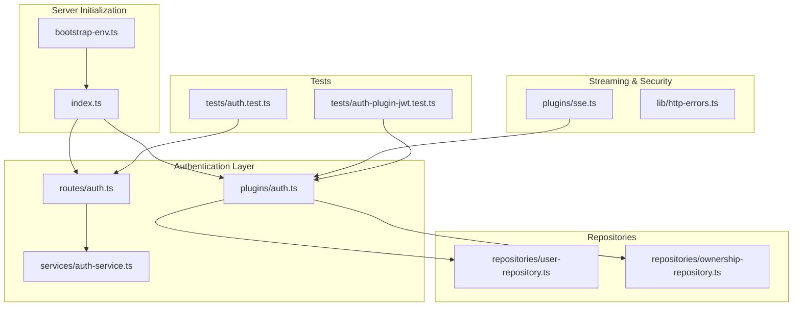
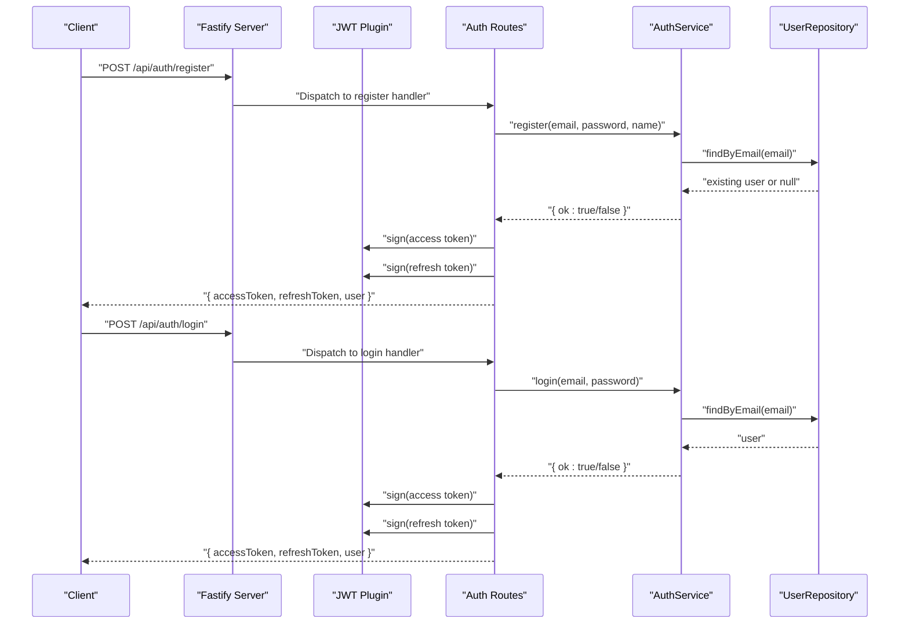
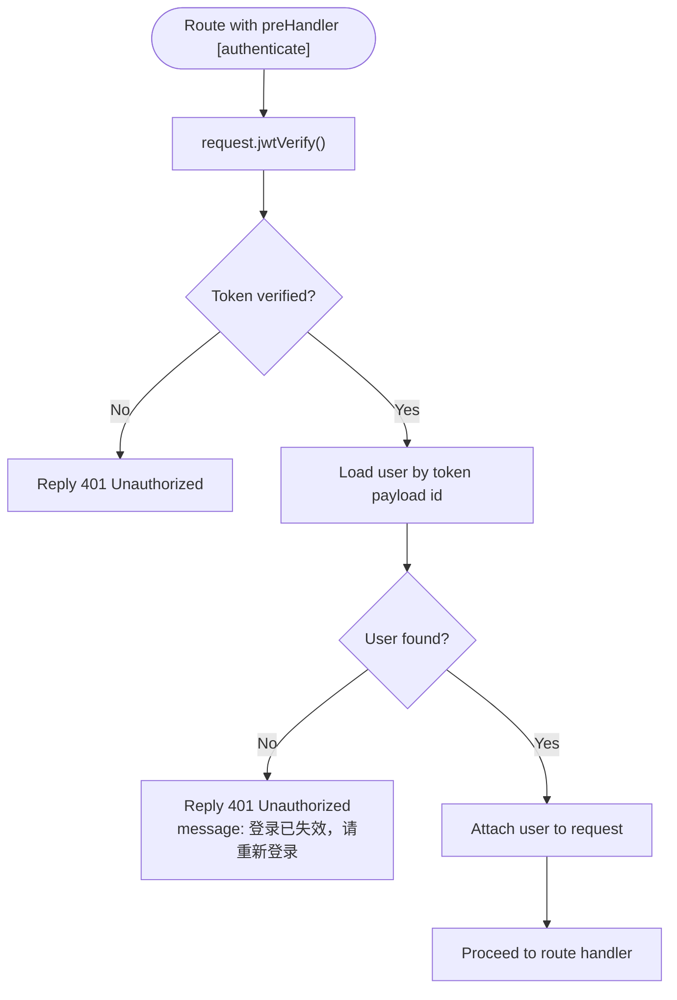
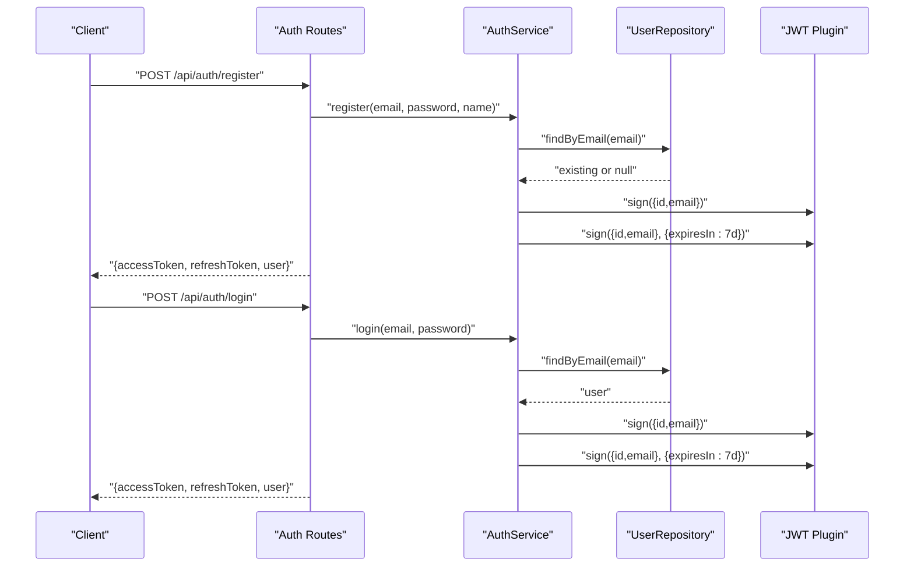
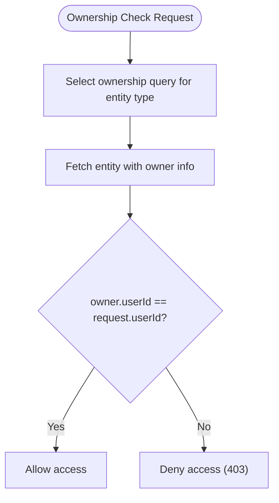
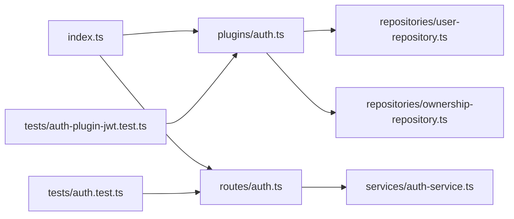

# Authentication and Authorization

<cite>
**Referenced Files in This Document**
- [index.ts](file://packages/backend/src/index.ts)
- [auth.ts](file://packages/backend/src/plugins/auth.ts)
- [auth-service.ts](file://packages/backend/src/services/auth-service.ts)
- [auth.ts](file://packages/backend/src/routes/auth.ts)
- [user-repository.ts](file://packages/backend/src/repositories/user-repository.ts)
- [ownership-repository.ts](file://packages/backend/src/repositories/ownership-repository.ts)
- [http-errors.ts](file://packages/backend/src/lib/http-errors.ts)
- [auth.test.ts](file://packages/backend/tests/auth.test.ts)
- [auth-plugin-jwt.test.ts](file://packages/backend/tests/auth-plugin-jwt.test.ts)
- [sse.ts](file://packages/backend/src/plugins/sse.ts)
- [bootstrap-env.ts](file://packages/backend/src/bootstrap-env.ts)
</cite>

## Table of Contents

1. [Introduction](#introduction)
2. [Project Structure](#project-structure)
3. [Core Components](#core-components)
4. [Architecture Overview](#architecture-overview)
5. [Detailed Component Analysis](#detailed-component-analysis)
6. [Dependency Analysis](#dependency-analysis)
7. [Performance Considerations](#performance-considerations)
8. [Troubleshooting Guide](#troubleshooting-guide)
9. [Conclusion](#conclusion)
10. [Appendices](#appendices)

## Introduction

This document provides comprehensive authentication and authorization documentation for the backend system. It covers JWT token generation and validation, user registration and login, password hashing, role-based access control (RBAC), resource-level authorization, session management, token refresh mechanisms, logout procedures, middleware for protecting routes, API key authentication, third-party integration authentication, security best practices, rate limiting, brute force protection, audit logging, CORS configuration, secure cookie handling, and CSRF protection.

## Project Structure

The authentication and authorization features are implemented across several modules:

- Environment bootstrap and server initialization
- JWT configuration and CORS setup
- Authentication plugin for route protection
- Authentication service for registration and login
- Repositories for user and ownership checks
- SSE plugin for token-aware streaming
- Tests validating JWT verification and protected routes

**Diagram sources**

- [index.ts:1-136](file://packages/backend/src/index.ts#L1-L136)
- [auth.ts:1-98](file://packages/backend/src/plugins/auth.ts#L1-L98)
- [auth-service.ts:1-73](file://packages/backend/src/services/auth-service.ts#L1-L73)
- [auth.ts:1-65](file://packages/backend/src/routes/auth.ts#L1-L65)
- [user-repository.ts:1-32](file://packages/backend/src/repositories/user-repository.ts#L1-L32)
- [ownership-repository.ts:1-118](file://packages/backend/src/repositories/ownership-repository.ts#L1-L118)
- [sse.ts:45-85](file://packages/backend/src/plugins/sse.ts#L45-L85)
- [http-errors.ts:1-3](file://packages/backend/src/lib/http-errors.ts#L1-L3)
- [auth.test.ts:1-196](file://packages/backend/tests/auth.test.ts#L1-L196)
- [auth-plugin-jwt.test.ts:52-92](file://packages/backend/tests/auth-plugin-jwt.test.ts#L52-L92)

**Section sources**

- [index.ts:1-136](file://packages/backend/src/index.ts#L1-L136)
- [bootstrap-env.ts:1-12](file://packages/backend/src/bootstrap-env.ts#L1-L12)

## Core Components

- JWT configuration and CORS setup in the server initializer
- Authentication plugin that verifies tokens and loads session users
- Authentication service implementing registration, login, and profile retrieval
- Repositories for user session lookup and resource ownership checks
- SSE plugin supporting token-aware subscriptions
- Tests validating JWT verification and protected route behavior

Key capabilities:

- Token-based authentication with bearer tokens
- Password hashing via bcrypt
- Resource-level authorization helpers for projects, episodes, scenes, characters, compositions, tasks, locations, images, shots, and character shots
- Unified 403 response body for permission denied scenarios

**Section sources**

- [index.ts:44-86](file://packages/backend/src/index.ts#L44-L86)
- [auth.ts:12-35](file://packages/backend/src/plugins/auth.ts#L12-L35)
- [auth-service.ts:11-73](file://packages/backend/src/services/auth-service.ts#L11-L73)
- [user-repository.ts:4-28](file://packages/backend/src/repositories/user-repository.ts#L4-L28)
- [ownership-repository.ts:7-114](file://packages/backend/src/repositories/ownership-repository.ts#L7-L114)
- [http-errors.ts:1-3](file://packages/backend/src/lib/http-errors.ts#L1-L3)

## Architecture Overview

The authentication and authorization architecture centers on:

- Server initialization configuring CORS, JWT, and route registration
- An authentication plugin that decorates Fastify with an authenticate handler
- Route handlers for registration, login, and current user retrieval
- Repositories for user session validation and ownership verification
- SSE plugin that optionally validates tokens for streaming connections

**Diagram sources**

- [index.ts:89-89](file://packages/backend/src/index.ts#L89-L89)
- [auth.ts:4-64](file://packages/backend/src/routes/auth.ts#L4-L64)
- [auth-service.ts:14-65](file://packages/backend/src/services/auth-service.ts#L14-L65)
- [user-repository.ts:15-28](file://packages/backend/src/repositories/user-repository.ts#L15-L28)

## Detailed Component Analysis

### JWT Configuration and CORS

- CORS is enabled with configurable origin and credentials support
- JWT secret is loaded from environment variables
- Multipart upload limits are configured for file handling

Security implications:

- CORS credentials must be explicitly enabled; production should restrict origin to trusted domains
- JWT secret must be strong and managed securely; avoid default values

**Section sources**

- [index.ts:47-56](file://packages/backend/src/index.ts#L47-L56)
- [index.ts:89-115](file://packages/backend/src/index.ts#L89-L115)

### Authentication Middleware

The authentication plugin:

- Verifies JWT tokens on protected routes
- Loads the current user from the database for session validation
- Returns 401 Unauthorized for invalid or missing tokens or when the user no longer exists

**Diagram sources**

- [auth.ts:13-34](file://packages/backend/src/plugins/auth.ts#L13-L34)
- [user-repository.ts:8-13](file://packages/backend/src/repositories/user-repository.ts#L8-L13)

**Section sources**

- [auth.ts:12-35](file://packages/backend/src/plugins/auth.ts#L12-L35)
- [auth-plugin-jwt.test.ts:52-92](file://packages/backend/tests/auth-plugin-jwt.test.ts#L52-L92)

### Registration and Login

- Registration hashes passwords with bcrypt and prevents duplicate emails
- Login validates credentials using bcrypt comparison
- Both endpoints issue access and refresh tokens upon success

**Diagram sources**

- [auth.ts:6-63](file://packages/backend/src/routes/auth.ts#L6-L63)
- [auth-service.ts:14-65](file://packages/backend/src/services/auth-service.ts#L14-L65)
- [user-repository.ts:15-28](file://packages/backend/src/repositories/user-repository.ts#L15-L28)

**Section sources**

- [auth-service.ts:14-65](file://packages/backend/src/services/auth-service.ts#L14-L65)
- [auth.ts:6-63](file://packages/backend/src/routes/auth.ts#L6-L63)
- [auth.test.ts:62-107](file://packages/backend/tests/auth.test.ts#L62-L107)
- [auth.test.ts:109-173](file://packages/backend/tests/auth.test.ts#L109-L173)

### Password Hashing and Security Measures

- Passwords are hashed using bcrypt with a work factor suitable for server environments
- Login compares provided password against stored hash
- Tests mock bcrypt to isolate authentication logic during unit tests

Best practices:

- Use a sufficiently high bcrypt cost for production
- Never log raw passwords or full Authorization headers
- Enforce strong password policies at the client boundary

**Section sources**

- [auth-service.ts:24-51](file://packages/backend/src/services/auth-service.ts#L24-L51)
- [auth.test.ts:12-18](file://packages/backend/tests/auth.test.ts#L12-L18)

### Role-Based Access Control (RBAC) and Permissions

- The system does not define explicit roles or permissions in the analyzed files
- A unified 403 response body is provided for permission-denied scenarios
- RBAC can be layered on top of the existing authentication framework by checking user roles and scopes before granting access

Recommendations:

- Define role constants and permission matrices
- Introduce middleware to enforce role and permission checks
- Audit sensitive operations and maintain access logs

**Section sources**

- [http-errors.ts:1-3](file://packages/backend/src/lib/http-errors.ts#L1-L3)

### Resource-Level Authorization

Ownership verification helpers ensure that the requesting user owns the target resource. These helpers traverse relationships from specific entities to the owning user.

Supported resources:

- Projects
- Episodes and their associated projects
- Scenes and their associated projects
- Characters and their associated projects
- Compositions and their associated projects
- Tasks and their associated projects
- Locations and their associated projects
- Character images and their associated projects
- Shots and their associated projects
- Character shots and their associated projects

**Diagram sources**

- [ownership-repository.ts:10-114](file://packages/backend/src/repositories/ownership-repository.ts#L10-L114)
- [auth.ts:38-97](file://packages/backend/src/plugins/auth.ts#L38-L97)

**Section sources**

- [ownership-repository.ts:7-114](file://packages/backend/src/repositories/ownership-repository.ts#L7-L114)
- [auth.ts:38-97](file://packages/backend/src/plugins/auth.ts#L38-L97)

### Session Management, Token Refresh, and Logout

- Access tokens are issued per successful registration/login
- Refresh tokens are issued with a 7-day expiration
- Logout is not implemented in the analyzed files; typical approaches include blacklisting tokens or relying on short-lived access tokens with refresh tokens

Recommendations:

- Implement a token blacklist or short-lived access tokens with rotation
- Provide a dedicated logout endpoint that invalidates tokens
- Store refresh tokens securely and consider device-bound tokens

**Section sources**

- [auth.ts:16-26](file://packages/backend/src/routes/auth.ts#L16-L26)
- [auth.ts:41-52](file://packages/backend/src/routes/auth.ts#L41-L52)

### Middleware for Protecting Routes

- The authenticate decorator is applied to the “/api/auth/me” route to protect it
- Protected routes should consistently apply the authenticate decorator to enforce JWT verification and session validation

**Section sources**

- [auth.ts:56-63](file://packages/backend/src/routes/auth.ts#L56-L63)
- [auth.ts:12-35](file://packages/backend/src/plugins/auth.ts#L12-L35)

### API Key Authentication and Third-Party Integration Authentication

- API key verification is present in settings routes and tests
- Third-party integration authentication is not implemented in the analyzed files

Recommendations:

- Implement API key generation, rotation, and revocation
- Support OAuth or OpenID Connect for third-party integrations
- Enforce API key scopes and rate limits per key

**Section sources**

- [settings.test.ts:197-209](file://packages/backend/tests/settings.test.ts#L197-L209)

### SSE and Token-Aware Streaming

- The SSE plugin supports optional token verification for subscriptions
- If a valid token is provided via query or Authorization header, the connection is attributed to the user; otherwise, it falls back to anonymous

**Section sources**

- [sse.ts:45-85](file://packages/backend/src/plugins/sse.ts#L45-L85)

## Dependency Analysis

The authentication system exhibits clear separation of concerns:

- Server initializer composes plugins and routes
- Authentication plugin depends on user repository for session validation
- Authentication routes depend on the authentication service
- Ownership helpers depend on the ownership repository
- Tests validate JWT verification and protected route behavior

**Diagram sources**

- [index.ts:89-115](file://packages/backend/src/index.ts#L89-L115)
- [auth.ts:12-35](file://packages/backend/src/plugins/auth.ts#L12-L35)
- [auth.ts:4-64](file://packages/backend/src/routes/auth.ts#L4-L64)
- [auth-service.ts:11-73](file://packages/backend/src/services/auth-service.ts#L11-L73)
- [user-repository.ts:4-28](file://packages/backend/src/repositories/user-repository.ts#L4-L28)
- [ownership-repository.ts:7-114](file://packages/backend/src/repositories/ownership-repository.ts#L7-L114)
- [auth.test.ts:33-52](file://packages/backend/tests/auth.test.ts#L33-L52)
- [auth-plugin-jwt.test.ts:52-92](file://packages/backend/tests/auth-plugin-jwt.test.ts#L52-L92)

**Section sources**

- [index.ts:89-115](file://packages/backend/src/index.ts#L89-L115)
- [auth.ts:12-35](file://packages/backend/src/plugins/auth.ts#L12-L35)
- [auth-service.ts:11-73](file://packages/backend/src/services/auth-service.ts#L11-L73)
- [user-repository.ts:4-28](file://packages/backend/src/repositories/user-repository.ts#L4-L28)
- [ownership-repository.ts:7-114](file://packages/backend/src/repositories/ownership-repository.ts#L7-L114)

## Performance Considerations

- JWT verification is lightweight; ensure token signing keys are rotated periodically
- Password hashing costs should balance security and latency; monitor login duration
- Keep protected route handlers minimal to reduce overhead
- Use connection pooling and efficient queries in repositories

## Troubleshooting Guide

Common issues and resolutions:

- 401 Unauthorized on protected routes:
  - Verify the Authorization header contains a valid Bearer token
  - Confirm the token was signed with the correct secret
  - Ensure the user still exists in the database
- Registration failures:
  - Duplicate email addresses are rejected; ensure uniqueness
- Login failures:
  - Incorrect credentials return 401; verify email and password
- CORS errors:
  - Ensure the client origin matches the configured CORS origin and credentials are enabled
- SSE subscription issues:
  - Provide a valid token via query or Authorization header; otherwise, connections are anonymous

**Section sources**

- [auth-plugin-jwt.test.ts:52-92](file://packages/backend/tests/auth-plugin-jwt.test.ts#L52-L92)
- [auth.test.ts:62-107](file://packages/backend/tests/auth.test.ts#L62-L107)
- [auth.test.ts:109-173](file://packages/backend/tests/auth.test.ts#L109-L173)
- [index.ts:47-56](file://packages/backend/src/index.ts#L47-L56)

## Conclusion

The backend implements a robust JWT-based authentication system with password hashing, session validation, and resource-level authorization helpers. While RBAC and logout are not implemented in the analyzed files, the architecture supports easy extension for roles, permissions, and token lifecycle management. Additional security measures such as rate limiting, brute force protection, audit logging, CORS hardening, secure cookies, and CSRF protection should be introduced to meet production-grade requirements.

## Appendices

### CORS Configuration

- Origin is configurable via environment variable
- Credentials are supported; ensure trusted origins in production

**Section sources**

- [index.ts:47-52](file://packages/backend/src/index.ts#L47-L52)

### Secure Cookie Handling and CSRF Protection

- Not implemented in the analyzed files
- Recommendations:
  - Use HttpOnly, SameSite, and Secure flags for cookies
  - Implement CSRF tokens for state-changing requests
  - Prefer token-based authentication for APIs

### Rate Limiting and Brute Force Protection

- Not implemented in the analyzed files
- Recommendations:
  - Apply IP-based rate limits on auth endpoints
  - Implement account lockout after failed attempts
  - Use sliding windows or exponential backoff

### Audit Logging

- Not implemented in the analyzed files
- Recommendations:
  - Log authentication events (success/failure), token issuance, and access to sensitive resources
  - Avoid logging sensitive fields; redact tokens and passwords
