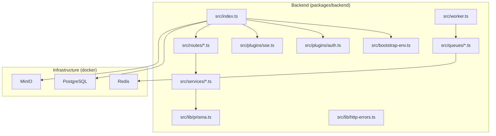
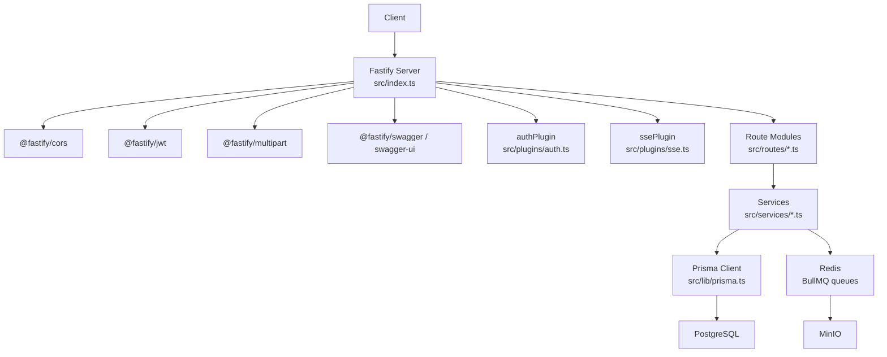
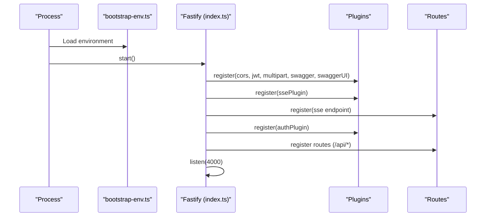
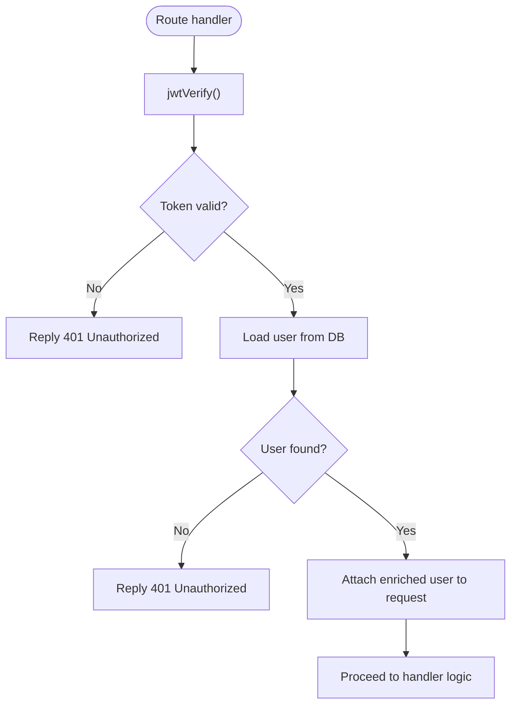
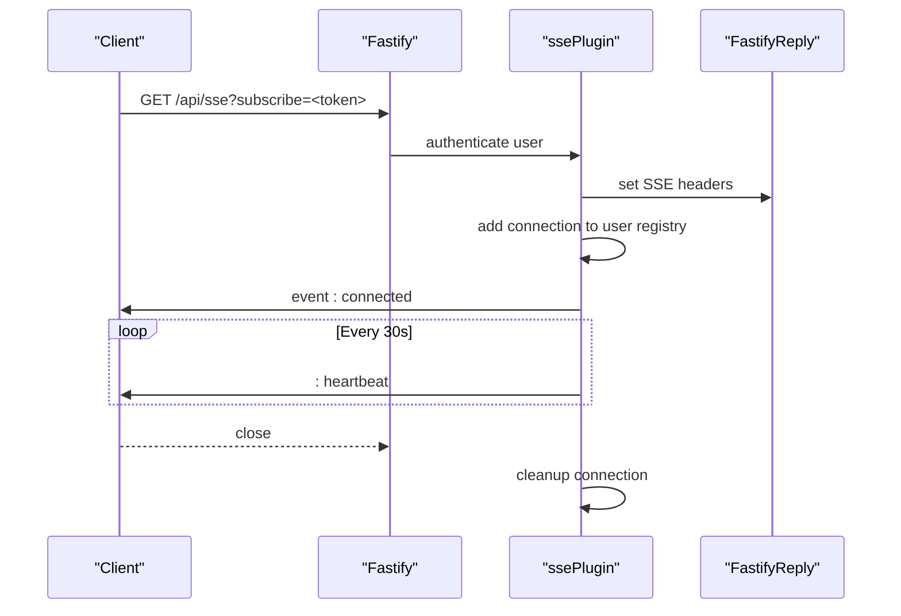
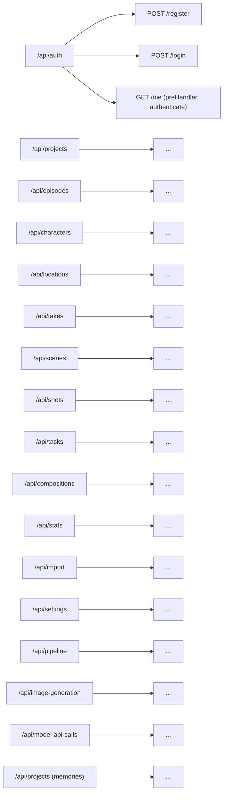
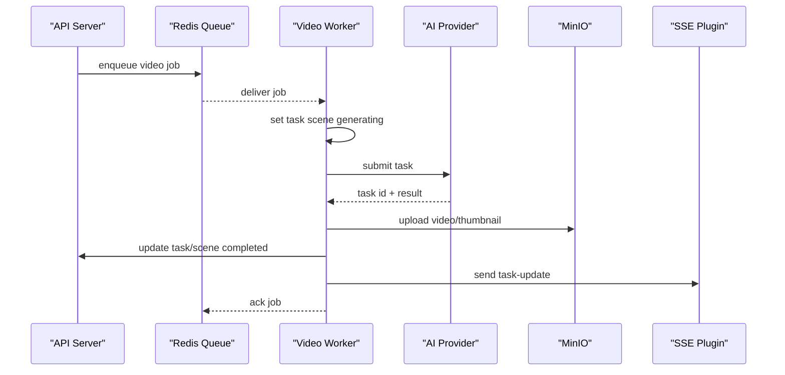
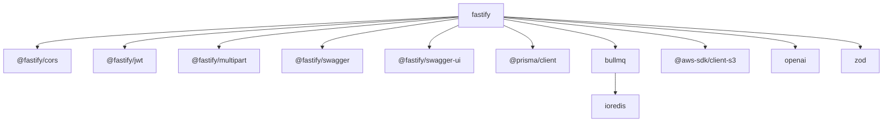

# Backend Overview

<cite>
**Referenced Files in This Document**
- [packages/backend/src/index.ts](file://packages/backend/src/index.ts)
- [packages/backend/src/bootstrap-env.ts](file://packages/backend/src/bootstrap-env.ts)
- [packages/backend/src/plugins/auth.ts](file://packages/backend/src/plugins/auth.ts)
- [packages/backend/src/plugins/sse.ts](file://packages/backend/src/plugins/sse.ts)
- [packages/backend/src/lib/http-errors.ts](file://packages/backend/src/lib/http-errors.ts)
- [packages/backend/src/lib/prisma.ts](file://packages/backend/src/lib/prisma.ts)
- [packages/backend/src/routes/auth.ts](file://packages/backend/src/routes/auth.ts)
- [packages/backend/src/worker.ts](file://packages/backend/src/worker.ts)
- [packages/backend/src/queues/video.ts](file://packages/backend/src/queues/video.ts)
- [packages/backend/package.json](file://packages/backend/package.json)
- [docker/docker-compose.yml](file://docker/docker-compose.yml)
- [packages/backend/tsconfig.json](file://packages/backend/tsconfig.json)
- [README.md](file://README.md)
</cite>

## Table of Contents

1. [Introduction](#introduction)
2. [Project Structure](#project-structure)
3. [Core Components](#core-components)
4. [Architecture Overview](#architecture-overview)
5. [Detailed Component Analysis](#detailed-component-analysis)
6. [Dependency Analysis](#dependency-analysis)
7. [Performance Considerations](#performance-considerations)
8. [Troubleshooting Guide](#troubleshooting-guide)
9. [Conclusion](#conclusion)
10. [Appendices](#appendices)

## Introduction

This document provides a comprehensive overview of the Fastify-based backend service powering the AI short-form video production platform. It explains the application initialization, plugin system, middleware stack, modular routing, error handling, logging, configuration management, and deployment setup. It also covers the authentication plugin, server-sent events (SSE) plugin, and background job processing via BullMQ and Redis.

## Project Structure

The backend is organized as a TypeScript project under packages/backend with the following high-level layout:

- src/index.ts: Application entry point and server initialization
- src/bootstrap-env.ts: Early environment variable loading for ESM compatibility
- src/plugins/: Fastify plugins (authentication, SSE)
- src/routes/: Modular API route groups (prefixes under /api)
- src/services/: Business logic modules (referenced by routes)
- src/lib/: Shared libraries (Prisma client, HTTP error constants)
- src/queues/: Background job queues and workers (BullMQ)
- src/worker.ts: Worker process entry point
- docker/docker-compose.yml: Local infrastructure (PostgreSQL, Redis, MinIO)
- package.json: Scripts, dependencies, and build configuration
- tsconfig.json: TypeScript compiler options

**Diagram sources**

- [packages/backend/src/index.ts:1-131](file://packages/backend/src/index.ts#L1-L131)
- [packages/backend/src/bootstrap-env.ts:1-12](file://packages/backend/src/bootstrap-env.ts#L1-L12)
- [packages/backend/src/plugins/auth.ts:1-98](file://packages/backend/src/plugins/auth.ts#L1-L98)
- [packages/backend/src/plugins/sse.ts:1-108](file://packages/backend/src/plugins/sse.ts#L1-L108)
- [packages/backend/src/lib/prisma.ts:1-4](file://packages/backend/src/lib/prisma.ts#L1-L4)
- [packages/backend/src/queues/video.ts:1-272](file://packages/backend/src/queues/video.ts#L1-L272)
- [packages/backend/src/worker.ts:1-30](file://packages/backend/src/worker.ts#L1-L30)
- [docker/docker-compose.yml:1-71](file://docker/docker-compose.yml#L1-L71)

**Section sources**

- [README.md:26-42](file://README.md#L26-L42)
- [packages/backend/package.json:1-51](file://packages/backend/package.json#L1-L51)
- [packages/backend/tsconfig.json:1-24](file://packages/backend/tsconfig.json#L1-L24)

## Core Components

- Fastify server initialization and plugin registration
- Environment bootstrap for ESM-safe dotenv loading
- Authentication plugin with JWT verification and ownership checks
- SSE plugin for real-time notifications
- Modular route registration under /api/\*
- Prisma client for database access
- BullMQ-based background job processing
- Worker process for offloading long-running tasks

**Section sources**

- [packages/backend/src/index.ts:35-122](file://packages/backend/src/index.ts#L35-L122)
- [packages/backend/src/bootstrap-env.ts:1-12](file://packages/backend/src/bootstrap-env.ts#L1-L12)
- [packages/backend/src/plugins/auth.ts:12-35](file://packages/backend/src/plugins/auth.ts#L12-L35)
- [packages/backend/src/plugins/sse.ts:45-107](file://packages/backend/src/plugins/sse.ts#L45-L107)
- [packages/backend/src/lib/prisma.ts:1-4](file://packages/backend/src/lib/prisma.ts#L1-L4)
- [packages/backend/src/queues/video.ts:15-256](file://packages/backend/src/queues/video.ts#L15-L256)
- [packages/backend/src/worker.ts:1-30](file://packages/backend/src/worker.ts#L1-L30)

## Architecture Overview

The backend follows a layered architecture:

- Entry point initializes Fastify, registers plugins, and mounts routes
- Plugins decorate Fastify with reusable capabilities (authentication, SSE)
- Routes delegate to services for business logic
- Services interact with Prisma for persistence and external APIs for AI models
- Background jobs are queued and processed asynchronously by workers
- Infrastructure services (PostgreSQL, Redis, MinIO) support persistence, queues, and storage

**Diagram sources**

- [packages/backend/src/index.ts:35-122](file://packages/backend/src/index.ts#L35-L122)
- [packages/backend/src/plugins/auth.ts:12-35](file://packages/backend/src/plugins/auth.ts#L12-L35)
- [packages/backend/src/plugins/sse.ts:45-107](file://packages/backend/src/plugins/sse.ts#L45-L107)
- [packages/backend/src/lib/prisma.ts:1-4](file://packages/backend/src/lib/prisma.ts#L1-L4)
- [docker/docker-compose.yml:4-51](file://docker/docker-compose.yml#L4-L51)

## Detailed Component Analysis

### Application Initialization and Plugin System

- Environment bootstrap ensures dotenv is loaded before other modules, preventing missing environment variables in early imports.
- Fastify server is configured with built-in logging enabled.
- Plugins are registered in order:
  - CORS with configurable origin and credentials
  - JWT with secret from environment
  - Multipart with 100 MB file size limit
  - Swagger/OpenAPI and Swagger UI
  - SSE plugin and endpoint
  - Authentication plugin
  - Route modules mounted under /api/\* prefixes
- Health check endpoint exposed at /health
- Server listens on 0.0.0.0:4000 for containerized deployments

**Diagram sources**

- [packages/backend/src/bootstrap-env.ts:1-12](file://packages/backend/src/bootstrap-env.ts#L1-L12)
- [packages/backend/src/index.ts:35-122](file://packages/backend/src/index.ts#L35-L122)

**Section sources**

- [packages/backend/src/bootstrap-env.ts:1-12](file://packages/backend/src/bootstrap-env.ts#L1-L12)
- [packages/backend/src/index.ts:35-122](file://packages/backend/src/index.ts#L35-L122)

### Authentication Plugin

- Decorates Fastify with authenticate method that verifies JWT and enriches request.user with database-backed user session
- Provides ownership verification helpers for projects, episodes, scenes, characters, compositions, tasks, locations, character images, shots, and character shots
- Unauthorized responses are standardized with 401 status

**Diagram sources**

- [packages/backend/src/plugins/auth.ts:13-34](file://packages/backend/src/plugins/auth.ts#L13-L34)

**Section sources**

- [packages/backend/src/plugins/auth.ts:12-35](file://packages/backend/src/plugins/auth.ts#L12-L35)

### Server-Sent Events (SSE) Plugin

- Maintains a per-user connection registry
- Supports subscription via Authorization header or query parameter token
- Sends heartbeat messages and cleans up connections on close
- Exposes helper functions to broadcast task/project updates to specific users

**Diagram sources**

- [packages/backend/src/plugins/sse.ts:47-100](file://packages/backend/src/plugins/sse.ts#L47-L100)

**Section sources**

- [packages/backend/src/plugins/sse.ts:1-108](file://packages/backend/src/plugins/sse.ts#L1-L108)

### Modular Routing Organization

- Routes are grouped by domain and mounted under /api/<resource>
- Example registrations include auth, projects, episodes, characters, locations, takes, scenes, shots, tasks, compositions, stats, import, settings, pipeline, image generation jobs, model API calls, and memories
- Ownership middleware (preHandler) is applied to protected endpoints

**Diagram sources**

- [packages/backend/src/index.ts:84-110](file://packages/backend/src/index.ts#L84-L110)
- [packages/backend/src/routes/auth.ts:4-64](file://packages/backend/src/routes/auth.ts#L4-L64)

**Section sources**

- [packages/backend/src/index.ts:84-110](file://packages/backend/src/index.ts#L84-L110)
- [packages/backend/src/routes/auth.ts:4-64](file://packages/backend/src/routes/auth.ts#L4-L64)

### Error Handling Patterns

- Unauthorized access is handled centrally by the authentication plugin with standardized 401 responses
- Permission-denied scenarios for authenticated but unauthorized access use a shared constant body for 403 responses
- Route handlers return appropriate HTTP statuses and bodies for validation failures (e.g., registration and login)
- Workers handle job failures and update task status accordingly, broadcasting SSE updates

**Section sources**

- [packages/backend/src/plugins/auth.ts:13-34](file://packages/backend/src/plugins/auth.ts#L13-L34)
- [packages/backend/src/lib/http-errors.ts:1-3](file://packages/backend/src/lib/http-errors.ts#L1-L3)
- [packages/backend/src/routes/auth.ts:12-14](file://packages/backend/src/routes/auth.ts#L12-L14)
- [packages/backend/src/queues/video.ts:222-250](file://packages/backend/src/queues/video.ts#L222-L250)

### Logging Strategies

- Fastify’s logger is enabled globally
- Console logging is used in workers for lifecycle events and job progress
- API call logs are maintained for AI model usage tracking

**Section sources**

- [packages/backend/src/index.ts:36-37](file://packages/backend/src/index.ts#L36-L37)
- [packages/backend/src/queues/video.ts:32-220](file://packages/backend/src/queues/video.ts#L32-L220)

### Configuration Management

- Environment variables are loaded early via a dedicated bootstrap module
- CORS origin and credentials are configurable via environment
- JWT secret is configurable via environment
- Multipart file size limit is configured in code
- Swagger metadata is configured in code
- Worker processes rely on Redis and database URLs from environment

**Section sources**

- [packages/backend/src/bootstrap-env.ts:1-12](file://packages/backend/src/bootstrap-env.ts#L1-L12)
- [packages/backend/src/index.ts:43-56](file://packages/backend/src/index.ts#L43-L56)
- [packages/backend/package.json:7-20](file://packages/backend/package.json#L7-L20)

### Development vs Production Configurations

- Development scripts run TypeScript with tsx watch and generate Prisma client
- Production start scripts use Node with ESM import hook to load environment bootstrap before server entry
- Docker Compose provisions PostgreSQL, Redis, and MinIO for local development
- Ports and host binding are suitable for containerized environments

**Section sources**

- [packages/backend/package.json:7-20](file://packages/backend/package.json#L7-L20)
- [docker/docker-compose.yml:1-71](file://docker/docker-compose.yml#L1-L71)
- [packages/backend/src/index.ts:115-117](file://packages/backend/src/index.ts#L115-L117)

### Plugin Architecture Details

- Authentication plugin:
  - Decorates Fastify with authenticate
  - Verifies JWT and enriches request.user
  - Provides ownership verification helpers
- SSE plugin:
  - Decorates Fastify with sse.subscribe and sse.sendToUser
  - Manages per-user connections and heartbeats
  - Supports optional anonymous subscriptions

**Section sources**

- [packages/backend/src/plugins/auth.ts:12-35](file://packages/backend/src/plugins/auth.ts#L12-L35)
- [packages/backend/src/plugins/sse.ts:45-107](file://packages/backend/src/plugins/sse.ts#L45-L107)

### Background Job Processing

- Worker entry point loads environment and starts queue workers
- Video generation worker consumes jobs from Redis, interacts with AI providers, uploads assets to MinIO, updates task/scene status, and emits SSE notifications
- Graceful shutdown closes workers and Redis connections

**Diagram sources**

- [packages/backend/src/queues/video.ts:27-256](file://packages/backend/src/queues/video.ts#L27-L256)
- [packages/backend/src/worker.ts:1-30](file://packages/backend/src/worker.ts#L1-L30)
- [packages/backend/src/plugins/sse.ts:7-26](file://packages/backend/src/plugins/sse.ts#L7-L26)

**Section sources**

- [packages/backend/src/worker.ts:1-30](file://packages/backend/src/worker.ts#L1-L30)
- [packages/backend/src/queues/video.ts:1-272](file://packages/backend/src/queues/video.ts#L1-L272)

## Dependency Analysis

- Fastify core and official plugins are used for CORS, JWT, multipart, Swagger, and Swagger UI
- Prisma client provides database access
- BullMQ and IORedis power asynchronous job processing
- AWS SDK and MinIO client enable object storage operations
- OpenAI SDK integrates with AI providers
- Zod validates request schemas

**Diagram sources**

- [packages/backend/package.json:22-39](file://packages/backend/package.json#L22-L39)

**Section sources**

- [packages/backend/package.json:22-39](file://packages/backend/package.json#L22-L39)

## Performance Considerations

- Use appropriate Redis connection settings and backoff policies for BullMQ queues
- Tune worker concurrency based on CPU and I/O capacity
- Monitor SSE connection counts and clean up stale connections
- Limit multipart upload sizes and validate content types
- Enable caching and connection pooling for database and external API clients

## Troubleshooting Guide

- Environment variables not loaded:
  - Ensure bootstrap-env.ts runs before other modules
- CORS issues:
  - Verify CORS_ORIGIN and credentials settings
- JWT signature mismatches:
  - Confirm JWT_SECRET matches across processes
- SSE connection drops:
  - Check heartbeat intervals and client-side reconnection logic
- Worker not processing jobs:
  - Validate Redis connectivity and queue names
- Database migration drift:
  - Use provided scripts to deploy migrations

**Section sources**

- [packages/backend/src/bootstrap-env.ts:1-12](file://packages/backend/src/bootstrap-env.ts#L1-L12)
- [packages/backend/src/index.ts:43-51](file://packages/backend/src/index.ts#L43-L51)
- [packages/backend/src/plugins/sse.ts:78-85](file://packages/backend/src/plugins/sse.ts#L78-L85)
- [packages/backend/package.json:12-18](file://packages/backend/package.json#L12-L18)

## Conclusion

The backend leverages Fastify’s plugin system and modular routing to deliver a scalable API for an AI-driven video production platform. Authentication and SSE plugins provide essential cross-cutting concerns, while BullMQ workers handle long-running tasks. The architecture balances simplicity with extensibility, supporting development and production deployments through Docker Compose and environment-driven configuration.

## Appendices

- Deployment and infrastructure provisioning are described in the repository’s main README and Docker Compose file.

**Section sources**

- [README.md:68-95](file://README.md#L68-L95)
- [docker/docker-compose.yml:1-71](file://docker/docker-compose.yml#L1-L71)
