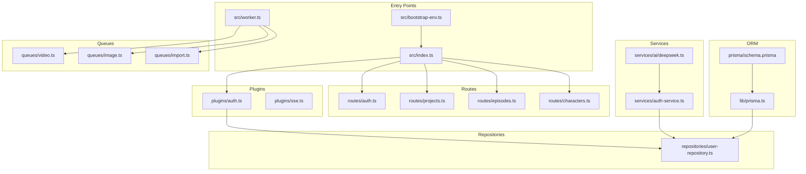
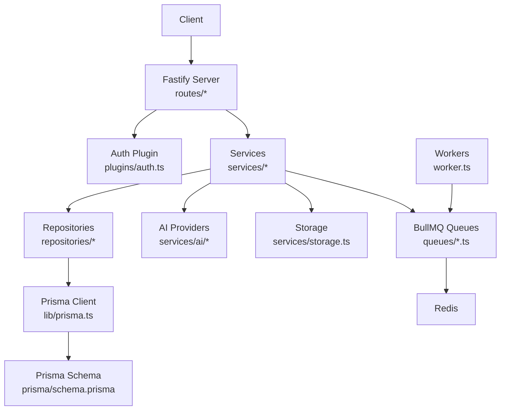
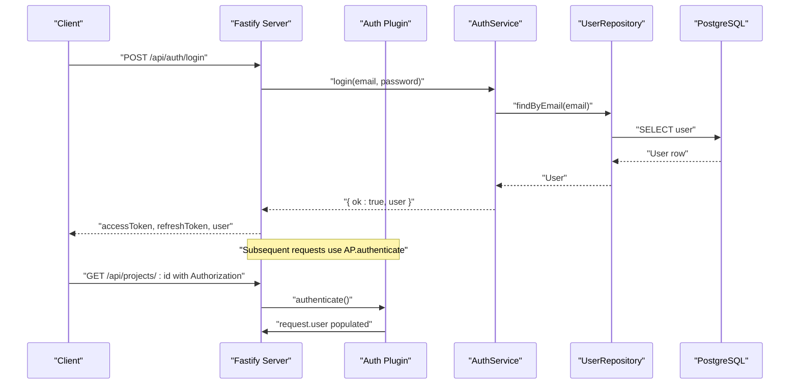
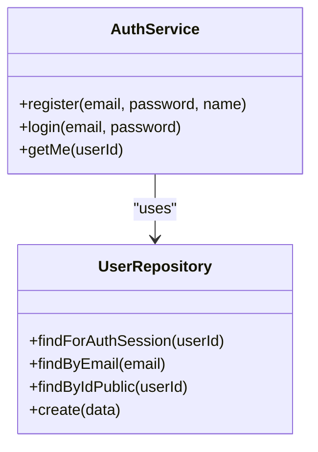
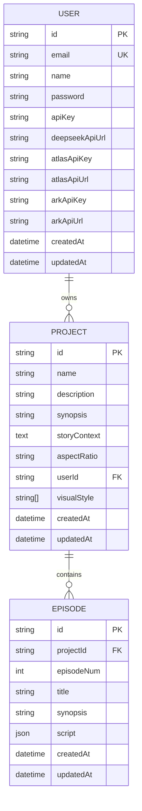
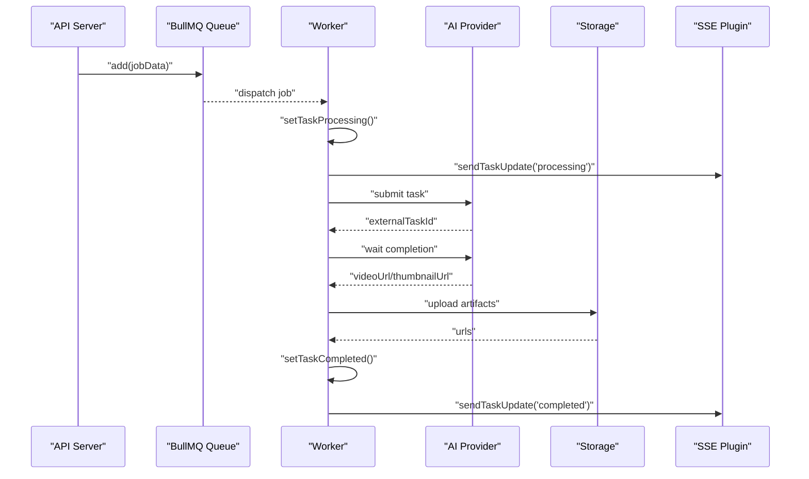
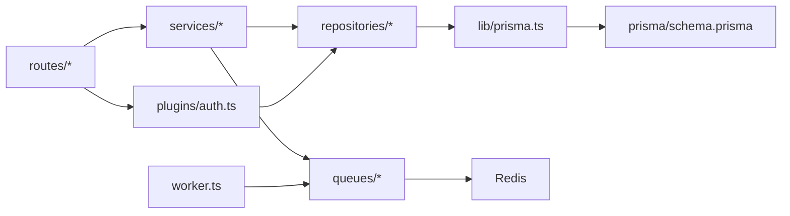

# Backend System

<cite>
**Referenced Files in This Document**
- [index.ts](file://packages/backend/src/index.ts)
- [worker.ts](file://packages/backend/src/worker.ts)
- [bootstrap-env.ts](file://packages/backend/src/bootstrap-env.ts)
- [schema.prisma](file://packages/backend/prisma/schema.prisma)
- [prisma.ts](file://packages/backend/src/lib/prisma.ts)
- [auth.ts](file://packages/backend/src/plugins/auth.ts)
- [auth-service.ts](file://packages/backend/src/services/auth-service.ts)
- [user-repository.ts](file://packages/backend/src/repositories/user-repository.ts)
- [video.ts](file://packages/backend/src/queues/video.ts)
- [image.ts](file://packages/backend/src/queues/image.ts)
- [import.ts](file://packages/backend/src/queues/import.ts)
- [auth.ts](file://packages/backend/src/routes/auth.ts)
- [projects.ts](file://packages/backend/src/routes/projects.ts)
- [episodes.ts](file://packages/backend/src/routes/episodes.ts)
- [characters.ts](file://packages/backend/src/routes/characters.ts)
- [deepseek.ts](file://packages/backend/src/services/ai/deepseek.ts)
</cite>

## Table of Contents

1. [Introduction](#introduction)
2. [Project Structure](#project-structure)
3. [Core Components](#core-components)
4. [Architecture Overview](#architecture-overview)
5. [Detailed Component Analysis](#detailed-component-analysis)
6. [Dependency Analysis](#dependency-analysis)
7. [Performance Considerations](#performance-considerations)
8. [Troubleshooting Guide](#troubleshooting-guide)
9. [Conclusion](#conclusion)
10. [Appendices](#appendices)

## Introduction

This document describes the Fastify-based backend service for the Dreamer project. It covers the modular route organization by domain, layered architecture with service and repository patterns, the plugin system for middleware and custom functionality, Prisma ORM integration, BullMQ task queue system for background processing, AI service integrations, authentication, error handling, logging, API documentation generation, worker architecture for video generation tasks, database schema design, and performance optimization strategies.

## Project Structure

The backend is organized into distinct layers:

- Entry points: server and worker bootstraps
- Plugins: reusable middleware and utilities
- Routes: domain-specific HTTP endpoints grouped by feature
- Services: business logic and orchestrators
- Repositories: data access layer using Prisma
- Queues: background job processing via BullMQ
- Prisma schema: database modeling

**Diagram sources**

- [index.ts:1-131](file://packages/backend/src/index.ts#L1-L131)
- [worker.ts:1-30](file://packages/backend/src/worker.ts#L1-L30)
- [bootstrap-env.ts:1-12](file://packages/backend/src/bootstrap-env.ts#L1-L12)
- [auth.ts:1-98](file://packages/backend/src/plugins/auth.ts#L1-L98)
- [auth-service.ts:1-73](file://packages/backend/src/services/auth-service.ts#L1-L73)
- [user-repository.ts:1-32](file://packages/backend/src/repositories/user-repository.ts#L1-L32)
- [prisma.ts:1-4](file://packages/backend/src/lib/prisma.ts#L1-L4)
- [schema.prisma:1-430](file://packages/backend/prisma/schema.prisma#L1-L430)
- [video.ts:1-272](file://packages/backend/src/queues/video.ts#L1-L272)
- [image.ts:1-302](file://packages/backend/src/queues/image.ts#L1-L302)
- [import.ts:1-114](file://packages/backend/src/queues/import.ts#L1-L114)
- [auth.ts:1-65](file://packages/backend/src/routes/auth.ts#L1-L65)
- [projects.ts:1-229](file://packages/backend/src/routes/projects.ts#L1-L229)
- [episodes.ts:1-255](file://packages/backend/src/routes/episodes.ts#L1-L255)
- [characters.ts:1-339](file://packages/backend/src/routes/characters.ts#L1-L339)

**Section sources**

- [index.ts:1-131](file://packages/backend/src/index.ts#L1-L131)
- [worker.ts:1-30](file://packages/backend/src/worker.ts#L1-L30)
- [bootstrap-env.ts:1-12](file://packages/backend/src/bootstrap-env.ts#L1-L12)

## Core Components

- Server bootstrap registers plugins, Swagger/OpenAPI, routes, and health checks.
- Worker bootstrap starts dedicated background workers for video, image, and import jobs.
- Environment initialization ensures secrets are loaded before other modules.
- Prisma client provides strongly-typed database access.
- Plugin-based authentication enforces JWT verification and ownership checks.
- Route handlers delegate to services; services encapsulate business logic and orchestrate repositories and external APIs.

**Section sources**

- [index.ts:35-122](file://packages/backend/src/index.ts#L35-L122)
- [worker.ts:1-30](file://packages/backend/src/worker.ts#L1-L30)
- [bootstrap-env.ts:1-12](file://packages/backend/src/bootstrap-env.ts#L1-L12)
- [prisma.ts:1-4](file://packages/backend/src/lib/prisma.ts#L1-L4)
- [auth.ts:12-35](file://packages/backend/src/plugins/auth.ts#L12-L35)

## Architecture Overview

The system follows a layered architecture:

- Presentation: Fastify routes
- Application: Services coordinate workflows
- Domain: Repositories abstract data access
- Infrastructure: Prisma ORM, Redis-backed BullMQ queues, AI providers, storage

**Diagram sources**

- [index.ts:11-110](file://packages/backend/src/index.ts#L11-L110)
- [auth.ts:12-35](file://packages/backend/src/plugins/auth.ts#L12-L35)
- [prisma.ts:1-4](file://packages/backend/src/lib/prisma.ts#L1-L4)
- [schema.prisma:1-430](file://packages/backend/prisma/schema.prisma#L1-L430)
- [video.ts:15-256](file://packages/backend/src/queues/video.ts#L15-L256)
- [image.ts:19-287](file://packages/backend/src/queues/image.ts#L19-L287)
- [import.ts:30-95](file://packages/backend/src/queues/import.ts#L30-L95)
- [worker.ts:5-21](file://packages/backend/src/worker.ts#L5-L21)

## Detailed Component Analysis

### Authentication System

- JWT-based session with a custom auth plugin that verifies tokens and loads the user session.
- Ownership helpers enforce domain-level permissions across projects, episodes, scenes, characters, compositions, tasks, locations, character images, shots, and character shots.
- Public user retrieval and registration/login flows are handled by the AuthService backed by UserRepository.

**Diagram sources**

- [auth.ts:12-35](file://packages/backend/src/plugins/auth.ts#L12-L35)
- [auth-service.ts:42-65](file://packages/backend/src/services/auth-service.ts#L42-L65)
- [user-repository.ts:15-28](file://packages/backend/src/repositories/user-repository.ts#L15-L28)
- [auth.ts:1-98](file://packages/backend/src/plugins/auth.ts#L1-L98)
- [auth.ts:38-97](file://packages/backend/src/plugins/auth.ts#L38-L97)

**Section sources**

- [auth.ts:12-35](file://packages/backend/src/plugins/auth.ts#L12-L35)
- [auth-service.ts:11-70](file://packages/backend/src/services/auth-service.ts#L11-L70)
- [user-repository.ts:4-28](file://packages/backend/src/repositories/user-repository.ts#L4-L28)
- [auth.ts:38-97](file://packages/backend/src/plugins/auth.ts#L38-L97)

### Modular Route Organization by Domain

- Auth routes: register, login, get current user.
- Projects routes: CRUD, outline active job, generate first episode, generate remaining episodes, parse script.
- Episodes routes: list, get, detail, scenes, create/update/delete, compose, expand script, generate storyboard script.
- Characters routes: list, get, create/update/delete, manage images (slots, uploads, updates, moves, deletes).

Each route module:

- Uses preHandlers for authentication and ownership checks.
- Delegates to domain services.
- Returns structured responses or error bodies.

**Section sources**

- [auth.ts:1-65](file://packages/backend/src/routes/auth.ts#L1-L65)
- [projects.ts:4-229](file://packages/backend/src/routes/projects.ts#L4-L229)
- [episodes.ts:7-255](file://packages/backend/src/routes/episodes.ts#L7-L255)
- [characters.ts:6-339](file://packages/backend/src/routes/characters.ts#L6-L339)

### Layered Architecture: Services and Repositories

- Services encapsulate business logic and coordinate repositories and external integrations.
- Repositories abstract Prisma queries and mutations, exposing domain-focused methods.
- Example: AuthService depends on UserRepository; routes depend on services.

**Diagram sources**

- [auth-service.ts:11-70](file://packages/backend/src/services/auth-service.ts#L11-L70)
- [user-repository.ts:4-28](file://packages/backend/src/repositories/user-repository.ts#L4-L28)

**Section sources**

- [auth-service.ts:11-70](file://packages/backend/src/services/auth-service.ts#L11-L70)
- [user-repository.ts:4-28](file://packages/backend/src/repositories/user-repository.ts#L4-L28)

### Plugin System: Middleware and Custom Functionality

- Auth plugin decorates the server with an authenticate method that validates JWT and enriches the request with a safe user object.
- Ownership helpers provide granular checks per domain entity.
- SSE plugin enables real-time notifications; routes expose an SSE endpoint.

**Section sources**

- [auth.ts:12-35](file://packages/backend/src/plugins/auth.ts#L12-L35)
- [auth.ts:38-97](file://packages/backend/src/plugins/auth.ts#L38-L97)
- [index.ts:72-78](file://packages/backend/src/index.ts#L72-L78)

### Prisma ORM Integration

- Prisma client instantiated once and reused across repositories.
- Strongly-typed models define the domain schema, including relations and indexes.
- Repositories encapsulate queries and mutations, keeping routes and services clean.

**Diagram sources**

- [prisma.ts:1-4](file://packages/backend/src/lib/prisma.ts#L1-L4)
- [schema.prisma:10-72](file://packages/backend/prisma/schema.prisma#L10-L72)

**Section sources**

- [prisma.ts:1-4](file://packages/backend/src/lib/prisma.ts#L1-L4)
- [schema.prisma:10-72](file://packages/backend/prisma/schema.prisma#L10-L72)

### BullMQ Task Queue System

- Video generation queue: handles WAN 2.6 and Seedance 2.0 video tasks, integrates with AI providers, uploads artifacts to storage, and emits SSE updates.
- Image generation queue: manages character and location image jobs, records API calls, and notifies via SSE.
- Import queue: parses documents, optionally creates projects, imports data, and triggers enrichment.

**Diagram sources**

- [video.ts:15-256](file://packages/backend/src/queues/video.ts#L15-L256)
- [image.ts:19-287](file://packages/backend/src/queues/image.ts#L19-L287)
- [import.ts:30-95](file://packages/backend/src/queues/import.ts#L30-L95)

**Section sources**

- [video.ts:15-256](file://packages/backend/src/queues/video.ts#L15-L256)
- [image.ts:19-287](file://packages/backend/src/queues/image.ts#L19-L287)
- [import.ts:30-95](file://packages/backend/src/queues/import.ts#L30-L95)

### AI Service Integrations

- DeepSeek integration: script expansion, storyboard generation, prompt optimization, visual enrichment orchestration.
- WAN 2.6 and Seedance 2.0 video generation: task submission, polling, cost calculation, artifact upload.
- Volcengine Ark for image generation: text-to-image and image edit flows.

**Section sources**

- [deepseek.ts:1-30](file://packages/backend/src/services/ai/deepseek.ts#L1-L30)
- [video.ts:58-171](file://packages/backend/src/queues/video.ts#L58-L171)
- [image.ts:54-247](file://packages/backend/src/queues/image.ts#L54-L247)

### Error Handling Patterns

- Route handlers return structured errors with appropriate HTTP status codes.
- Ownership checks return permission-denied bodies when unauthorized.
- Workers wrap job processing in try/catch, update task status, record API call logs, and emit SSE failure events.

**Section sources**

- [episodes.ts:16-18](file://packages/backend/src/routes/episodes.ts#L16-L18)
- [projects.ts:146-148](file://packages/backend/src/routes/projects.ts#L146-L148)
- [video.ts:222-250](file://packages/backend/src/queues/video.ts#L222-L250)
- [image.ts:249-281](file://packages/backend/src/queues/image.ts#L249-L281)

### Logging Strategies

- Server logs enabled via Fastify logger.
- Workers log job lifecycle events (completed/failed).
- API call logging records provider, model, request parameters, status, cost, and duration.

**Section sources**

- [index.ts:35-37](file://packages/backend/src/index.ts#L35-L37)
- [video.ts:258-264](file://packages/backend/src/queues/video.ts#L258-L264)
- [image.ts:289-295](file://packages/backend/src/queues/image.ts#L289-L295)

### API Documentation Generation

- Swagger/OpenAPI is registered with Fastify and served via Swagger UI at a dedicated route.
- OpenAPI metadata is configured at server startup.

**Section sources**

- [index.ts:59-70](file://packages/backend/src/index.ts#L59-L70)

### Worker Architecture for Video Generation Tasks

- Dedicated worker process runs video, image, and import workers concurrently.
- Graceful shutdown closes workers and Redis connections.
- Video worker supports exponential backoff and retries, integrates AI providers, and uploads artifacts.

**Section sources**

- [worker.ts:1-30](file://packages/backend/src/worker.ts#L1-L30)
- [video.ts:27-256](file://packages/backend/src/queues/video.ts#L27-L256)

### Database Schema Design

- Rich relational schema modeling Users, Projects, Episodes, Scenes, Shots, Characters, Locations, Takes, Compositions, ImportTasks, PipelineJobs, and Memory items.
- Indexes and unique constraints support efficient lookups and referential integrity.
- JSON fields enable flexible scripting and metadata storage.

**Section sources**

- [schema.prisma:10-430](file://packages/backend/prisma/schema.prisma#L10-L430)

## Dependency Analysis

- Routes depend on services; services depend on repositories and external providers.
- Repositories depend on Prisma client; Prisma client depends on the schema.
- Workers depend on queues and Redis; queues depend on BullMQ and Redis.
- Auth plugin depends on repositories and JWT.

**Diagram sources**

- [index.ts:11-110](file://packages/backend/src/index.ts#L11-L110)
- [auth.ts:12-35](file://packages/backend/src/plugins/auth.ts#L12-L35)
- [prisma.ts:1-4](file://packages/backend/src/lib/prisma.ts#L1-L4)
- [schema.prisma:1-430](file://packages/backend/prisma/schema.prisma#L1-L430)
- [video.ts:15-256](file://packages/backend/src/queues/video.ts#L15-L256)
- [image.ts:19-287](file://packages/backend/src/queues/image.ts#L19-L287)
- [import.ts:30-95](file://packages/backend/src/queues/import.ts#L30-L95)
- [worker.ts:5-21](file://packages/backend/src/worker.ts#L5-L21)

**Section sources**

- [index.ts:11-110](file://packages/backend/src/index.ts#L11-L110)
- [auth.ts:12-35](file://packages/backend/src/plugins/auth.ts#L12-L35)
- [prisma.ts:1-4](file://packages/backend/src/lib/prisma.ts#L1-L4)
- [schema.prisma:1-430](file://packages/backend/prisma/schema.prisma#L1-L430)
- [video.ts:15-256](file://packages/backend/src/queues/video.ts#L15-L256)
- [image.ts:19-287](file://packages/backend/src/queues/image.ts#L19-L287)
- [import.ts:30-95](file://packages/backend/src/queues/import.ts#L30-L95)
- [worker.ts:5-21](file://packages/backend/src/worker.ts#L5-L21)

## Performance Considerations

- Use indexes and unique constraints from the schema to speed up lookups.
- Offload heavy work to BullMQ workers; keep API routes synchronous and lightweight.
- Configure queue backoff and retry policies to balance reliability and latency.
- Limit multipart upload sizes and validate file types early in routes.
- Cache frequently accessed domain data where appropriate and invalidate on mutation.

[No sources needed since this section provides general guidance]

## Troubleshooting Guide

- Authentication failures: verify JWT secret, token validity, and user existence in the database.
- Ownership denied: confirm relation chains (episode.project.userId, scene.episode.project.userId, etc.) and that the user matches.
- Queue failures: inspect worker logs, Redis connectivity, and external provider rate limits.
- API documentation: ensure Swagger/OpenAPI registration and UI route are reachable.

**Section sources**

- [auth.ts:12-35](file://packages/backend/src/plugins/auth.ts#L12-L35)
- [auth.ts:38-97](file://packages/backend/src/plugins/auth.ts#L38-L97)
- [video.ts:222-250](file://packages/backend/src/queues/video.ts#L222-L250)
- [image.ts:249-281](file://packages/backend/src/queues/image.ts#L249-L281)
- [index.ts:59-70](file://packages/backend/src/index.ts#L59-L70)

## Conclusion

The backend employs a clean, modular Fastify architecture with strong separation of concerns. Services and repositories encapsulate business logic and data access, while plugins provide reusable middleware. Prisma offers robust ORM capabilities, and BullMQ powers scalable background processing. AI integrations are centralized in services, and the system includes comprehensive logging and API documentation. The worker architecture isolates long-running tasks, and the schema supports rich storytelling domains.

[No sources needed since this section summarizes without analyzing specific files]

## Appendices

- Environment loading order is enforced to ensure secrets are available before other modules are imported.
- Server exposes health checks and a Swagger UI endpoint for API exploration.

**Section sources**

- [bootstrap-env.ts:1-12](file://packages/backend/src/bootstrap-env.ts#L1-L12)
- [index.ts:112-118](file://packages/backend/src/index.ts#L112-L118)
- [index.ts:68-70](file://packages/backend/src/index.ts#L68-L70)
