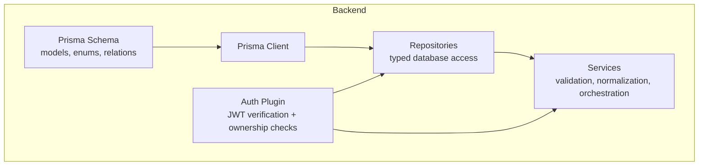
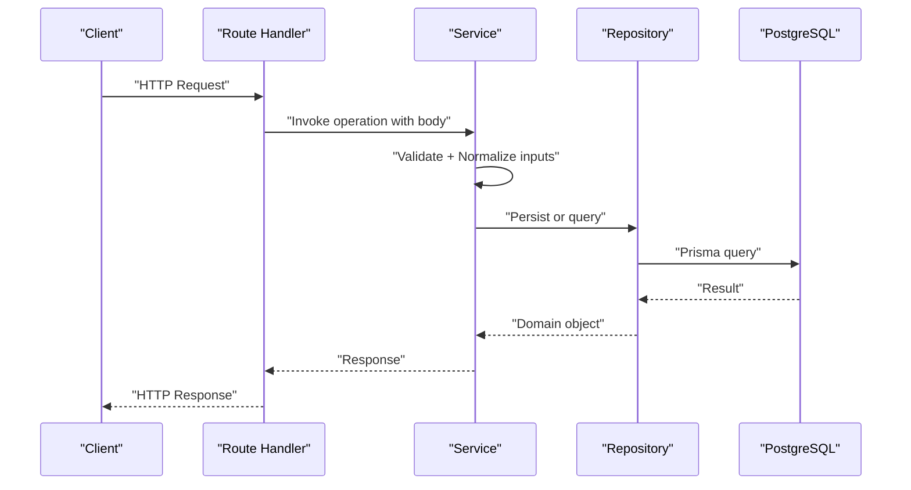
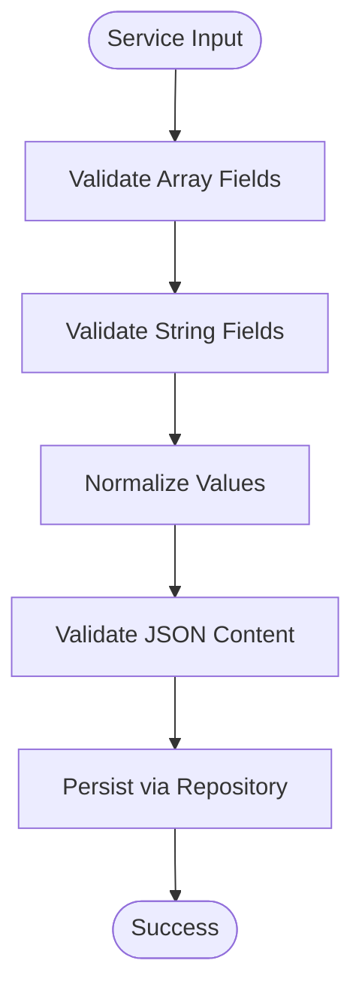
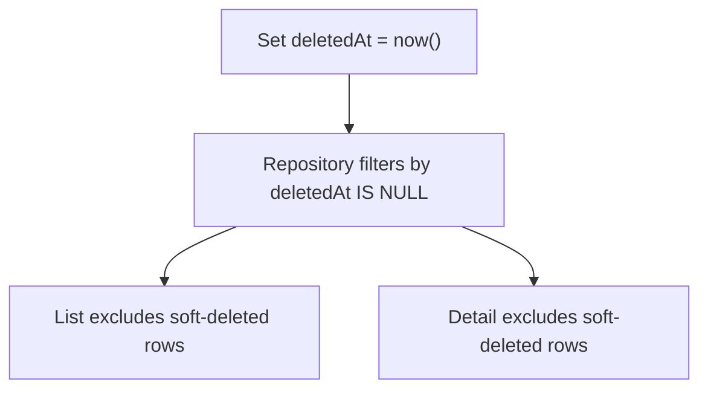
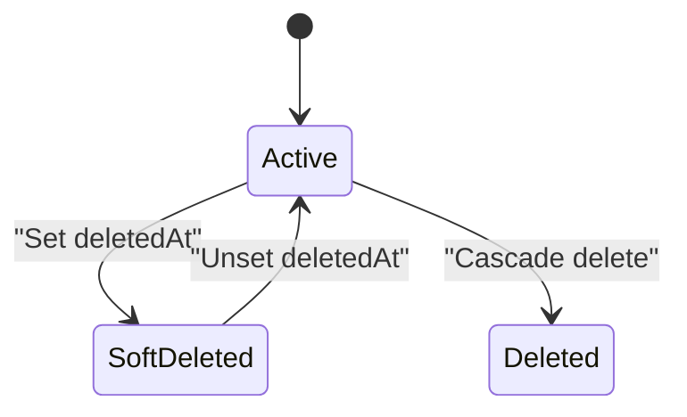
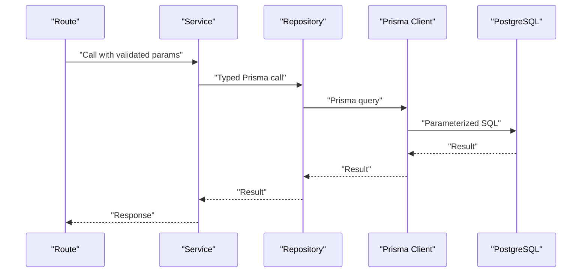
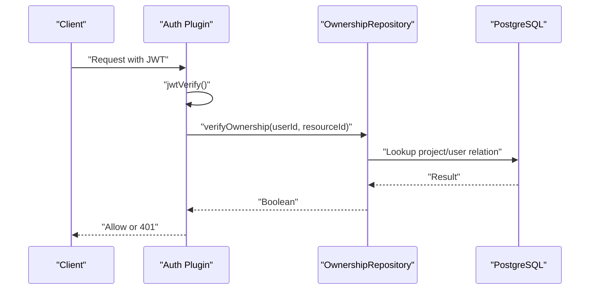
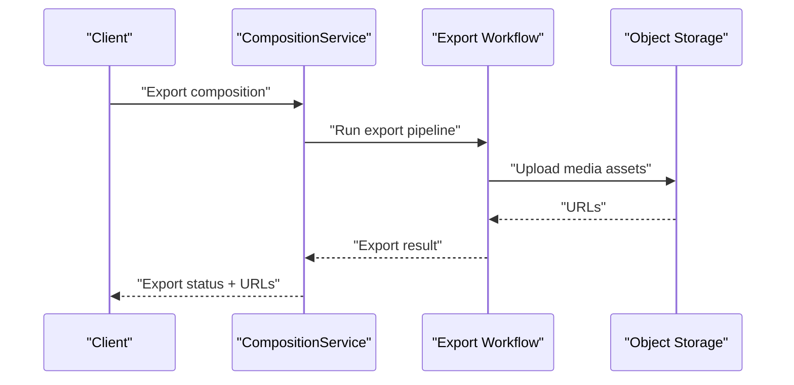
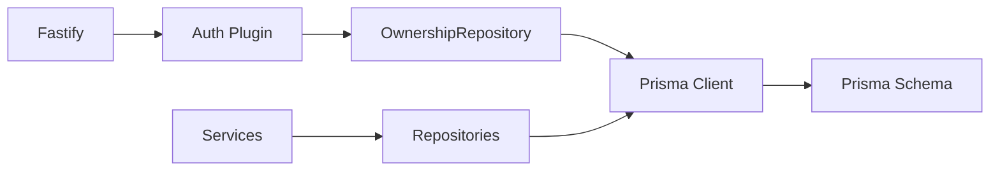
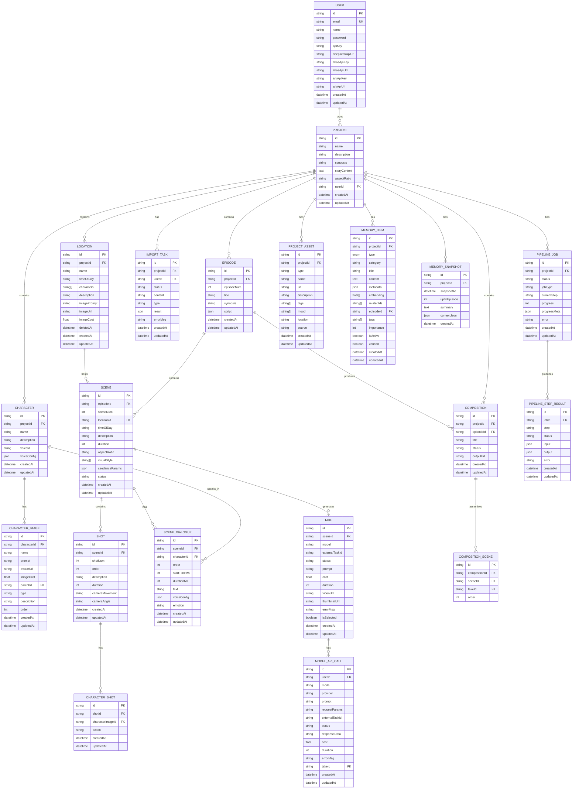

# Data Validation and Security Considerations

<cite>
**Referenced Files in This Document**
- [schema.prisma](file://packages/backend/prisma/schema.prisma)
- [package.json](file://packages/backend/package.json)
- [project-service.ts](file://packages/backend/src/services/project-service.ts)
- [project-repository.ts](file://packages/backend/src/repositories/project-repository.ts)
- [auth-service.ts](file://packages/backend/src/services/auth-service.ts)
- [auth.ts](file://packages/backend/src/plugins/auth.ts)
- [ownership-repository.ts](file://packages/backend/src/repositories/ownership-repository.ts)
- [project-aspect.ts](file://packages/backend/src/lib/project-aspect.ts)
- [prisma.ts](file://packages/backend/src/lib/prisma.ts)
- [README.md](file://README.md)
</cite>

## Table of Contents

1. [Introduction](#introduction)
2. [Project Structure](#project-structure)
3. [Core Components](#core-components)
4. [Architecture Overview](#architecture-overview)
5. [Detailed Component Analysis](#detailed-component-analysis)
6. [Dependency Analysis](#dependency-analysis)
7. [Performance Considerations](#performance-considerations)
8. [Troubleshooting Guide](#troubleshooting-guide)
9. [Conclusion](#conclusion)
10. [Appendices](#appendices)

## Introduction

This document provides comprehensive data validation and security guidance for the Prisma schema implementation in the backend. It focuses on:

- Field-level validation rules and data type constraints
- Input sanitization and normalization patterns
- Soft delete patterns using deletedAt fields
- Audit trail implementation and data lifecycle management
- Security considerations including SQL injection prevention, data masking, and access control patterns
- Enum usage for status fields, array constraints for tags and styles, and JSON field validation
- Data export/import procedures, backup strategies, and disaster recovery considerations
- GDPR compliance, data retention policies, and user data portability

## Project Structure

The backend uses Prisma with PostgreSQL and Fastify. The Prisma schema defines the data model, while services and repositories encapsulate validation, normalization, and access control. Authentication is handled via JWT, enforced by a Fastify plugin, and ownership checks are performed against the database.

**Diagram sources**

- [schema.prisma:1-430](file://packages/backend/prisma/schema.prisma#L1-L430)
- [prisma.ts:1-4](file://packages/backend/src/lib/prisma.ts#L1-L4)
- [auth.ts:1-107](file://packages/backend/src/plugins/auth.ts#L1-L107)

**Section sources**

- [README.md:13-26](file://README.md#L13-L26)
- [schema.prisma:1-430](file://packages/backend/prisma/schema.prisma#L1-L430)
- [package.json:22-38](file://packages/backend/package.json#L22-L38)

## Core Components

- Prisma schema: Defines models, fields, relations, indexes, defaults, and enums. It enforces data types and constraints at the database level.
- Services: Apply business validation, normalize inputs, and enforce domain rules before delegating to repositories.
- Repositories: Encapsulate Prisma queries and handle ownership checks and soft-deleted filtering.
- Auth plugin: Enforces JWT-based authentication and verifies resource ownership across models.

Key validation and security mechanisms observed:

- Field defaults and non-nullability in the schema
- Array fields with default empty arrays
- JSON fields with unvalidated content
- Enum fields for controlled status values
- Soft delete pattern via deletedAt on Location
- Ownership checks for all CRUD operations

**Section sources**

- [schema.prisma:10-430](file://packages/backend/prisma/schema.prisma#L10-L430)
- [project-service.ts:14-319](file://packages/backend/src/services/project-service.ts#L14-L319)
- [project-repository.ts:1-160](file://packages/backend/src/repositories/project-repository.ts#L1-L160)
- [auth.ts:12-107](file://packages/backend/src/plugins/auth.ts#L12-L107)

## Architecture Overview

The system separates concerns across schema, repositories, services, and plugins. Validation occurs at multiple layers:

- Database constraints (schema)
- Service-level normalization and validation
- Plugin-level authentication and authorization
- Ownership repository queries that filter soft-deleted rows

**Diagram sources**

- [project-service.ts:51-319](file://packages/backend/src/services/project-service.ts#L51-L319)
- [project-repository.ts:5-160](file://packages/backend/src/repositories/project-repository.ts#L5-L160)
- [schema.prisma:28-53](file://packages/backend/prisma/schema.prisma#L28-L53)

## Detailed Component Analysis

### Data Types, Constraints, and Defaults

- Scalars: String, Int, Float, Boolean, DateTime, Json
- Arrays: String[] defaults to empty arrays for visualStyle, characters, tags, mood, relatedIds, embedding
- JSON: Used for structured payloads (e.g., script, voiceConfig, metadata, progressMeta)
- Enums: Status fields use enums (e.g., Project, Episode, Scene, Take, Composition, PipelineJob)
- Indexes: Composite and single-column indexes for performance and uniqueness
- Defaults: createdAt defaults to now(), updatedAt tracks changes, cuid() for primary keys

Validation and normalization patterns:

- Aspect ratio normalization to a fixed set of allowed values
- Array validation in services before persistence
- JSON content validation and sanitization in services

**Section sources**

- [schema.prisma:10-430](file://packages/backend/prisma/schema.prisma#L10-L430)
- [project-aspect.ts:1-28](file://packages/backend/src/lib/project-aspect.ts#L1-L28)
- [project-service.ts:274-309](file://packages/backend/src/services/project-service.ts#L274-L309)

### Field-Level Validation Rules

- Project.visualStyle: Must be a string array; validated in service update
- Project.aspectRatio: Must be a string; normalized to allowed values
- Episode.script: JSON; validated as object with scenes array in service
- Scene.voiceConfig, ModelApiCall.responseData, MemoryItem.metadata: JSON; validated in service
- Location.deletedAt: Soft delete marker; repository excludes deleted rows by default

**Diagram sources**

- [project-service.ts:274-309](file://packages/backend/src/services/project-service.ts#L274-L309)
- [project-repository.ts:65-70](file://packages/backend/src/repositories/project-repository.ts#L65-L70)

**Section sources**

- [project-service.ts:274-309](file://packages/backend/src/services/project-service.ts#L274-L309)
- [project-repository.ts:65-70](file://packages/backend/src/repositories/project-repository.ts#L65-L70)

### Soft Delete Pattern Using deletedAt

- Location model includes deletedAt DateTime? for soft deletion
- Ownership repository excludes deleted rows by default in queries
- Project detail retrieval filters locations by deletedAt = null

**Diagram sources**

- [schema.prisma:194-214](file://packages/backend/prisma/schema.prisma#L194-L214)
- [ownership-repository.ts:66-74](file://packages/backend/src/repositories/ownership-repository.ts#L66-L74)
- [project-repository.ts:59-62](file://packages/backend/src/repositories/project-repository.ts#L59-L62)

**Section sources**

- [schema.prisma:194-214](file://packages/backend/prisma/schema.prisma#L194-L214)
- [ownership-repository.ts:66-74](file://packages/backend/src/repositories/ownership-repository.ts#L66-L74)
- [project-repository.ts:59-62](file://packages/backend/src/repositories/project-repository.ts#L59-L62)

### Audit Trail Implementation

- createdAt and updatedAt fields present on most models
- ModelApiCall records per AI call include timestamps and status
- PipelineJob and PipelineStepResult track job progress and errors with timestamps

Recommendations:

- Add explicit audit log entries for sensitive operations
- Consider storing diffs for updates where applicable
- Enforce immutable identifiers for referential integrity

**Section sources**

- [schema.prisma:240-263](file://packages/backend/prisma/schema.prisma#L240-L263)
- [schema.prisma:314-346](file://packages/backend/prisma/schema.prisma#L314-L346)

### Data Lifecycle Management

- Deletion: Projects are deleted via repository; cascading deletes propagate to dependent entities
- Soft deletion: Locations support soft deletion via deletedAt
- Archival: Consider snapshotting memory content periodically

**Diagram sources**

- [schema.prisma:194-214](file://packages/backend/prisma/schema.prisma#L194-L214)
- [project-repository.ts:72-74](file://packages/backend/src/repositories/project-repository.ts#L72-L74)

**Section sources**

- [schema.prisma:28-53](file://packages/backend/prisma/schema.prisma#L28-L53)
- [schema.prisma:194-214](file://packages/backend/prisma/schema.prisma#L194-L214)
- [project-repository.ts:72-74](file://packages/backend/src/repositories/project-repository.ts#L72-L74)

### Security Considerations

#### SQL Injection Prevention

- All database access goes through Prisma client; queries are strongly typed
- No raw SQL string concatenation observed in the analyzed files
- Use Prisma’s parameterized queries and avoid dynamic query building

**Diagram sources**

- [prisma.ts:1-4](file://packages/backend/src/lib/prisma.ts#L1-L4)
- [project-repository.ts:5-160](file://packages/backend/src/repositories/project-repository.ts#L5-L160)

**Section sources**

- [prisma.ts:1-4](file://packages/backend/src/lib/prisma.ts#L1-L4)
- [project-repository.ts:5-160](file://packages/backend/src/repositories/project-repository.ts#L5-L160)

#### Data Masking

- Passwords are hashed before storage; plaintext passwords are never persisted
- API keys and secrets are stored as strings; consider encrypting at rest and limiting exposure in logs

**Section sources**

- [auth-service.ts:14-40](file://packages/backend/src/services/auth-service.ts#L14-L40)
- [schema.prisma:10-26](file://packages/backend/prisma/schema.prisma#L10-L26)

#### Access Control Patterns

- JWT-based authentication enforced by a Fastify plugin
- Ownership checks for all resources via dedicated helpers
- Repository queries filter out unauthorized or soft-deleted rows

**Diagram sources**

- [auth.ts:12-107](file://packages/backend/src/plugins/auth.ts#L12-L107)
- [ownership-repository.ts:10-114](file://packages/backend/src/repositories/ownership-repository.ts#L10-L114)

**Section sources**

- [auth.ts:12-107](file://packages/backend/src/plugins/auth.ts#L12-L107)
- [ownership-repository.ts:10-114](file://packages/backend/src/repositories/ownership-repository.ts#L10-L114)

### Enum Usage for Status Fields

Enums constrain status values to predefined sets across models:

- Project.status: Not explicitly defined in schema; likely application-controlled
- Episode.status: Not explicitly defined in schema; likely application-controlled
- Scene.status: Not explicitly defined in schema; likely application-controlled
- Take.status: Enum-like string with default value
- Composition.status: Enum-like string with default value
- PipelineJob.status: Enum-like string with default value

Recommendations:

- Define enums for status fields in the schema to enforce at DB level
- Use Zod or similar for runtime validation in services

**Section sources**

- [schema.prisma:265-281](file://packages/backend/prisma/schema.prisma#L265-L281)
- [schema.prisma:314-330](file://packages/backend/prisma/schema.prisma#L314-L330)

### Array Constraints for Tags and Styles

- visualStyle: String[] default []
- characters: String[] default [] (Location)
- tags: String[] default [] (ProjectAsset)
- mood: String[] default [] (ProjectAsset)
- relatedIds: String[] default [] (MemoryItem)
- embedding: Float[] default [] (MemoryItem)

Validation:

- Services validate that visualStyle is an array and sanitize content as needed

**Section sources**

- [schema.prisma:38-40](file://packages/backend/prisma/schema.prisma#L38-L40)
- [schema.prisma:199-201](file://packages/backend/prisma/schema.prisma#L199-L201)
- [schema.prisma:356-358](file://packages/backend/prisma/schema.prisma#L356-L358)
- [schema.prisma:395-396](file://packages/backend/prisma/schema.prisma#L395-L396)
- [schema.prisma:392-392](file://packages/backend/prisma/schema.prisma#L392-L392)
- [project-service.ts:290-295](file://packages/backend/src/services/project-service.ts#L290-L295)

### JSON Field Validation

- JSON fields include script, voiceConfig, metadata, progressMeta, contextJson
- Services validate JSON content shapes and sanitize inputs before persistence
- Consider adding JSON schema validation and sanitization libraries

Examples of validation observed:

- Episode.script must be an object containing scenes array
- Scene.voiceConfig must be a valid JSON object
- MemoryItem.metadata must be a valid JSON object

**Section sources**

- [schema.prisma:62-62](file://packages/backend/prisma/schema.prisma#L62-L62)
- [schema.prisma:81-81](file://packages/backend/prisma/schema.prisma#L81-L81)
- [schema.prisma:389-389](file://packages/backend/prisma/schema.prisma#L389-L389)
- [schema.prisma:338-339](file://packages/backend/prisma/schema.prisma#L338-L339)
- [schema.prisma:423-423](file://packages/backend/prisma/schema.prisma#L423-L423)
- [project-service.ts:196-200](file://packages/backend/src/services/project-service.ts#L196-L200)
- [project-service.ts:28-32](file://packages/backend/src/services/project-service.ts#L28-L32)

### Data Export/Import Procedures

- Composition export: CompositionService orchestrates export workflow
- ImportTask: Supports importing content with type and result JSON
- Consider implementing standardized import/export formats (e.g., JSON) with schema validation

**Diagram sources**

- [composition-service.ts:69-71](file://packages/backend/src/services/composition-service.ts#L69-L71)

**Section sources**

- [composition-service.ts:69-71](file://packages/backend/src/services/composition-service.ts#L69-L71)
- [schema.prisma:298-312](file://packages/backend/prisma/schema.prisma#L298-L312)

### Backup Strategies and Disaster Recovery

- Use Prisma migrations for schema changes
- PostgreSQL backups should be integrated with Docker Compose deployment
- Consider point-in-time recovery and regular snapshots
- Maintain separate environments for development, staging, and production

[No sources needed since this section provides general guidance]

### GDPR Compliance, Data Retention, and Portability

- Data minimization: Only collect necessary fields (e.g., aspectRatio normalization)
- Retention: Implement data retention policies for logs and temporary data
- Portability: Provide APIs to export user data (names, emails, project assets, compositions)
- Right to erasure: Implement cascading deletions and secure data destruction

[No sources needed since this section provides general guidance]

## Dependency Analysis

The backend depends on Prisma for ORM and Fastify for HTTP. Authentication and authorization are centralized in a plugin with ownership checks delegated to repositories.

**Diagram sources**

- [auth.ts:12-107](file://packages/backend/src/plugins/auth.ts#L12-L107)
- [ownership-repository.ts:1-118](file://packages/backend/src/repositories/ownership-repository.ts#L1-L118)
- [prisma.ts:1-4](file://packages/backend/src/lib/prisma.ts#L1-L4)
- [schema.prisma:1-430](file://packages/backend/prisma/schema.prisma#L1-L430)

**Section sources**

- [auth.ts:12-107](file://packages/backend/src/plugins/auth.ts#L12-L107)
- [ownership-repository.ts:1-118](file://packages/backend/src/repositories/ownership-repository.ts#L1-L118)
- [prisma.ts:1-4](file://packages/backend/src/lib/prisma.ts#L1-L4)
- [schema.prisma:1-430](file://packages/backend/prisma/schema.prisma#L1-L430)

## Performance Considerations

- Use indexes strategically (composite and single-column) as defined in the schema
- Prefer selective queries with where clauses and projections
- Batch operations where feasible (e.g., bulk memory creation)
- Monitor long-running jobs and avoid blocking requests

[No sources needed since this section provides general guidance]

## Troubleshooting Guide

Common issues and resolutions:

- Unauthorized access: Verify JWT token and ownership checks
- Validation errors: Ensure arrays and strings meet service expectations
- JSON parsing errors: Validate JSON shape before persistence
- Soft-deleted rows missing: Confirm repository filters exclude deletedAt

**Section sources**

- [auth.ts:12-35](file://packages/backend/src/plugins/auth.ts#L12-L35)
- [project-service.ts:274-309](file://packages/backend/src/services/project-service.ts#L274-L309)
- [project-repository.ts:59-62](file://packages/backend/src/repositories/project-repository.ts#L59-L62)

## Conclusion

The Prisma schema establishes strong foundational constraints, while services and repositories implement robust validation and normalization. Authentication and ownership checks provide layered security. To further strengthen the system, define enums for status fields, add JSON schema validation, implement explicit audit logging, and establish formal backup and GDPR-compliant data lifecycle policies.

[No sources needed since this section summarizes without analyzing specific files]

## Appendices

### Appendix A: Data Model Overview

**Diagram sources**

- [schema.prisma:10-430](file://packages/backend/prisma/schema.prisma#L10-L430)
