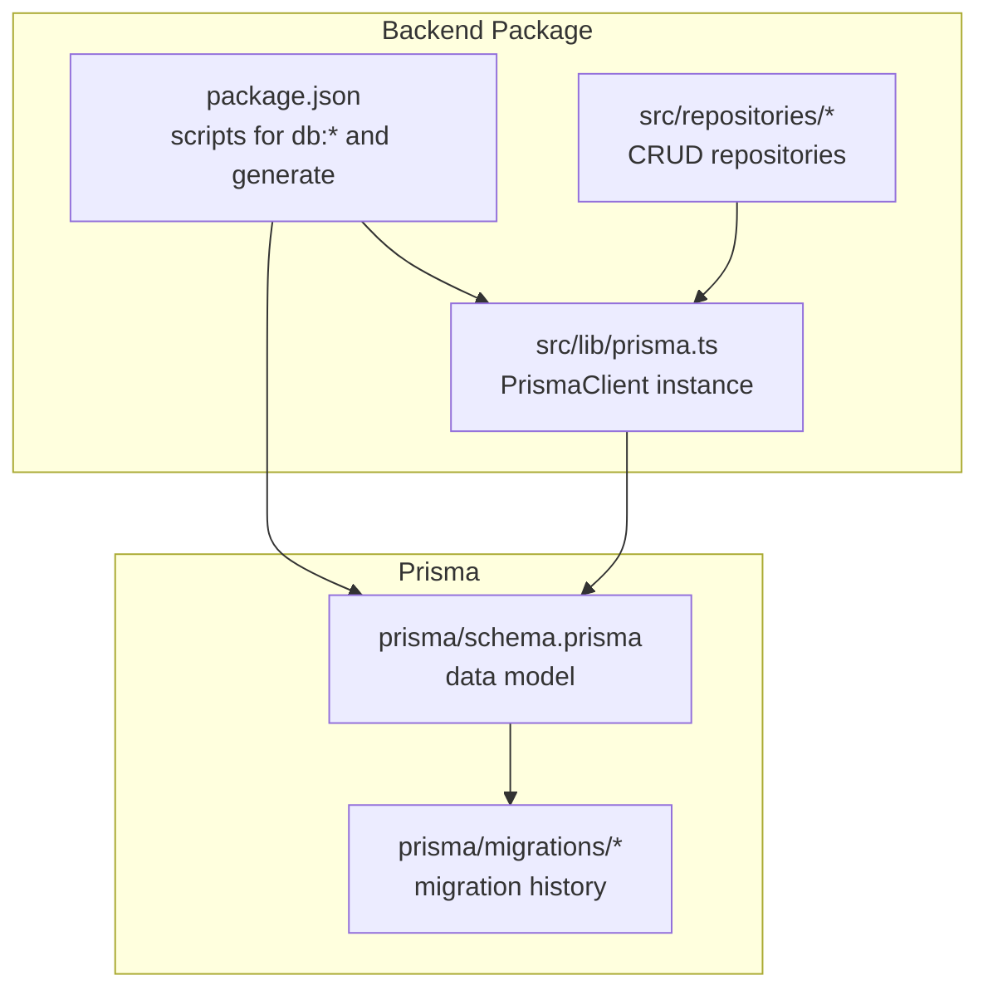
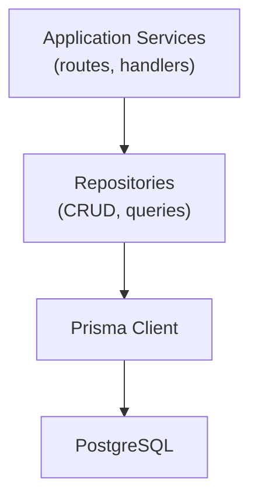
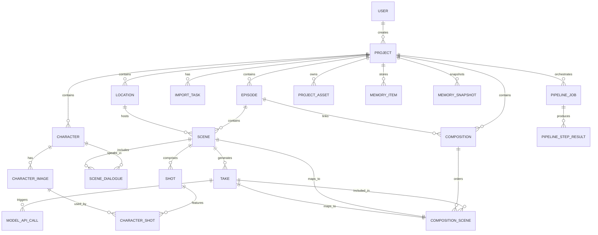
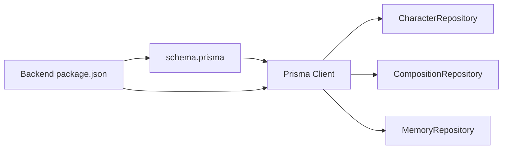

# Database Schema and ORM

<cite>
**Referenced Files in This Document**
- [schema.prisma](file://packages/backend/prisma/schema.prisma)
- [prisma.ts](file://packages/backend/src/lib/prisma.ts)
- [character-repository.ts](file://packages/backend/src/repositories/character-repository.ts)
- [composition-repository.ts](file://packages/backend/src/repositories/composition-repository.ts)
- [memory-repository.ts](file://packages/backend/src/repositories/memory-repository.ts)
- [package.json](file://packages/backend/package.json)
- [README.md](file://README.md)
</cite>

## Table of Contents

1. [Introduction](#introduction)
2. [Project Structure](#project-structure)
3. [Core Components](#core-components)
4. [Architecture Overview](#architecture-overview)
5. [Detailed Component Analysis](#detailed-component-analysis)
6. [Dependency Analysis](#dependency-analysis)
7. [Performance Considerations](#performance-considerations)
8. [Troubleshooting Guide](#troubleshooting-guide)
9. [Conclusion](#conclusion)
10. [Appendices](#appendices)

## Introduction

This document provides comprehensive database schema documentation for the Prisma ORM implementation used by the backend service. It covers all entities (users, projects, episodes, scenes, takes, compositions, characters, locations, and memory-related models), their fields, data types, constraints, indexes, and foreign key relationships. It also explains the migration strategy, schema evolution, and repository pattern usage, along with Prisma client configuration, query optimization techniques, transactions, and operational guidance.

## Project Structure

The database layer centers around Prisma’s schema definition and generated client, with repositories encapsulating data access logic. The backend package defines scripts for development and deployment operations, including database migration and generation steps.

**Diagram sources**

- [package.json:6-21](file://packages/backend/package.json#L6-L21)
- [prisma.ts:1-4](file://packages/backend/src/lib/prisma.ts#L1-L4)
- [schema.prisma:1-430](file://packages/backend/prisma/schema.prisma#L1-L430)

**Section sources**

- [README.md:44-87](file://README.md#L44-L87)
- [package.json:6-21](file://packages/backend/package.json#L6-L21)

## Core Components

- Prisma Client: Centralized client instance exported for use across repositories.
- Repositories: Typed CRUD and composite queries for domain entities.
- Schema: Declarative data model with relations, indexes, defaults, and constraints.

Key responsibilities:

- Prisma Client: Provides type-safe database access and supports transactions.
- Repositories: Encapsulate business query patterns, batching, and transactional operations.
- Schema: Defines entities, relationships, and constraints; migrations evolve the schema over time.

**Section sources**

- [prisma.ts:1-4](file://packages/backend/src/lib/prisma.ts#L1-L4)
- [character-repository.ts:1-194](file://packages/backend/src/repositories/character-repository.ts#L1-L194)
- [composition-repository.ts:1-83](file://packages/backend/src/repositories/composition-repository.ts#L1-L83)
- [memory-repository.ts:1-241](file://packages/backend/src/repositories/memory-repository.ts#L1-L241)
- [schema.prisma:10-430](file://packages/backend/prisma/schema.prisma#L10-L430)

## Architecture Overview

The backend uses a layered architecture:

- Application layer: Fastify routes/services
- Domain layer: Repositories
- Persistence layer: Prisma Client against PostgreSQL

**Diagram sources**

- [prisma.ts:1-4](file://packages/backend/src/lib/prisma.ts#L1-L4)
- [schema.prisma:5-8](file://packages/backend/prisma/schema.prisma#L5-L8)

## Detailed Component Analysis

### Users

- Purpose: Authentication and API keys for providers.
- Fields:
  - id: String, primary key, cuid()
  - email: String, unique
  - name: String
  - password: String
  - apiKey: String?
  - deepseekApiUrl: String?
  - atlasApiKey: String?
  - atlasApiUrl: String?
  - arkApiKey: String?
  - arkApiUrl: String?
  - createdAt: DateTime, default now()
  - updatedAt: DateTime, default now(), updated at
- Relationships:
  - projects: One-to-many
  - apiCalls: One-to-many
- Notes:
  - No soft delete or audit trail fields present.

**Section sources**

- [schema.prisma:10-26](file://packages/backend/prisma/schema.prisma#L10-L26)

### Projects

- Purpose: Container for episodes, characters, locations, compositions, assets, and memory snapshots.
- Fields:
  - id: String, primary key, cuid()
  - name: String
  - description: String?
  - synopsis: String?
  - storyContext: String?, mapped to Text
  - aspectRatio: String? (e.g., "9:16", "16:9")
  - userId: String
  - visualStyle: String[], default []
  - createdAt: DateTime, default now()
  - updatedAt: DateTime, default now(), updated at
- Relationships:
  - user: Many-to-one
  - episodes: One-to-many
  - characters: One-to-many
  - locations: One-to-many
  - compositions: One-to-many
  - importTasks: One-to-many
  - pipelineJobs: One-to-many
  - assets: One-to-many
  - memories: One-to-many
  - memorySnapshots: One-to-many
- Indexes:
  - idx_project_userId(userId)
- Constraints:
  - Unique constraint on (userId, id) via relation; explicit uniqueness on (userId) index implies uniqueness per user.

**Section sources**

- [schema.prisma:28-53](file://packages/backend/prisma/schema.prisma#L28-L53)

### Episodes

- Purpose: Logical grouping of scenes within a project.
- Fields:
  - id: String, primary key, cuid()
  - projectId: String
  - episodeNum: Int
  - title: String?
  - synopsis: String?
  - script: Json?
  - createdAt: DateTime, default now()
  - updatedAt: DateTime, default now(), updated at
- Relationships:
  - project: Many-to-one (Cascade on delete)
  - scenes: One-to-many
  - compositions: One-to-many
  - memories: One-to-many
- Indexes:
  - idx_episode_projectId(projectId)
  - idx_episode_projectId_episodeNum(projectId, episodeNum) unique
- Constraints:
  - Unique constraint on (projectId, episodeNum)

**Section sources**

- [schema.prisma:55-72](file://packages/backend/prisma/schema.prisma#L55-L72)

### Characters

- Purpose: Character definitions and metadata for a project.
- Fields:
  - id: String, primary key, cuid()
  - projectId: String
  - name: String
  - description: String?
  - voiceId: String?
  - voiceConfig: Json?
  - createdAt: DateTime, default now()
  - updatedAt: DateTime, default now(), updated at
- Relationships:
  - project: Many-to-one (Cascade on delete)
  - images: One-to-many
  - dialogues: One-to-many (via SceneDialogue)
- Indexes:
  - idx_character_projectId(projectId)
  - idx_character_projectId_name(projectId, name) unique
- Constraints:
  - Unique constraint on (projectId, name)

**Section sources**

- [schema.prisma:74-90](file://packages/backend/prisma/schema.prisma#L74-L90)

### Character Images

- Purpose: Character visual variants (base, variants), hierarchical parent-child relationships, and ordering.
- Fields:
  - id: String, primary key, cuid()
  - characterId: String
  - name: String
  - prompt: String?
  - avatarUrl: String?
  - imageCost: Float?
  - parentId: String?
  - type: String, default "base"
  - description: String?
  - order: Int, default 0
  - createdAt: DateTime, default now()
  - updatedAt: DateTime, default now(), updated at
- Relationships:
  - character: Many-to-one (Cascade on delete)
  - parent: Self-reference (ImageHierarchy)
  - children: Self-reference (ImageHierarchy)
  - characterShots: One-to-many
- Indexes:
  - idx_character_image_characterId(characterId)
  - idx_character_image_parentId(parentId)
- Constraints:
  - Unique constraint on (shotId, characterImageId) via CharacterShot
  - Unique constraint on (projectId, name) via Character (enforced indirectly)

**Section sources**

- [schema.prisma:92-113](file://packages/backend/prisma/schema.prisma#L92-L113)

### Scenes

- Purpose: Individual shot breakdowns within an episode.
- Fields:
  - id: String, primary key, cuid()
  - episodeId: String
  - sceneNum: Int
  - locationId: String?
  - timeOfDay: String?
  - description: String, default ""
  - duration: Int, default 0
  - aspectRatio: String, default "9:16"
  - visualStyle: String[], default []
  - seedanceParams: Json?
  - status: String, default "pending"
  - createdAt: DateTime, default now()
  - updatedAt: DateTime, default now(), updated at
- Relationships:
  - episode: Many-to-one (Cascade on delete)
  - location: One-to-one (optional)
  - shots: One-to-many
  - dialogues: One-to-many (via SceneDialogue)
  - takes: One-to-many
  - compositionUsages: One-to-many (via CompositionScene)
- Indexes:
  - idx_scene_episodeId(episodeId)
  - idx_scene_locationId(locationId)
  - idx_scene_episodeId_sceneNum(episodeId, sceneNum) unique

**Section sources**

- [schema.prisma:115-140](file://packages/backend/prisma/schema.prisma#L115-L140)

### Shots

- Purpose: Camera framing/unit within a scene.
- Fields:
  - id: String, primary key, cuid()
  - sceneId: String
  - shotNum: Int
  - order: Int
  - description: String
  - duration: Int, default 0
  - cameraMovement: String?
  - cameraAngle: String?
  - createdAt: DateTime, default now()
  - updatedAt: DateTime, default now(), updated at
- Relationships:
  - scene: Many-to-one (Cascade on delete)
  - characterShots: One-to-many
- Indexes:
  - idx_shot_sceneId(sceneId)

**Section sources**

- [schema.prisma:142-158](file://packages/backend/prisma/schema.prisma#L142-L158)

### Character Shots

- Purpose: Junction between shots and character images.
- Fields:
  - id: String, primary key, cuid()
  - shotId: String
  - characterImageId: String
  - action: String?
  - createdAt: DateTime, default now()
  - updatedAt: DateTime, default now(), updated at
- Relationships:
  - shot: Many-to-one (Cascade on delete)
  - characterImage: Many-to-one
- Indexes:
  - idx_character_shot_shotId(shotId)
  - idx_character_shot_characterImageId(characterImageId)
- Constraints:
  - Unique constraint on (shotId, characterImageId)

**Section sources**

- [schema.prisma:160-173](file://packages/backend/prisma/schema.prisma#L160-L173)

### Scene Dialogues

- Purpose: Dialogue lines associated with a scene and character.
- Fields:
  - id: String, primary key, cuid()
  - sceneId: String
  - characterId: String
  - order: Int
  - startTimeMs: Int
  - durationMs: Int
  - text: String
  - voiceConfig: Json
  - emotion: String?
  - createdAt: DateTime, default now()
  - updatedAt: DateTime, default now(), updated at
- Relationships:
  - scene: Many-to-one (relations "SceneDialogues", Cascade on delete)
  - character: Many-to-one (relations "CharacterDialogues")
- Indexes:
  - idx_scene_dialogue_sceneId(sceneId)
  - idx_scene_dialogue_characterId(characterId)

**Section sources**

- [schema.prisma:175-192](file://packages/backend/prisma/schema.prisma#L175-L192)

### Locations

- Purpose: Setting definitions for scenes.
- Fields:
  - id: String, primary key, cuid()
  - projectId: String
  - name: String (mapped to "location")
  - timeOfDay: String?
  - characters: String[], default []
  - description: String?
  - imagePrompt: String?
  - imageUrl: String?
  - imageCost: Float?
  - deletedAt: DateTime? (soft delete)
  - createdAt: DateTime, default now()
  - updatedAt: DateTime, default now(), updated at
- Relationships:
  - project: Many-to-one (Cascade on delete)
  - scenes: One-to-many
- Indexes:
  - idx_location_projectId(projectId)
  - idx_location_projectId_name(projectId, name) unique
  - idx_location_projectId_deletedAt(projectId, deletedAt)

**Section sources**

- [schema.prisma:194-214](file://packages/backend/prisma/schema.prisma#L194-L214)

### Takes

- Purpose: Generated media units (video/audio) linked to scenes and model API calls.
- Fields:
  - id: String, primary key, cuid()
  - sceneId: String
  - model: String
  - externalTaskId: String?
  - status: String, default "queued"
  - prompt: String
  - cost: Float?
  - duration: Int?
  - videoUrl: String?
  - thumbnailUrl: String?
  - errorMsg: String?
  - isSelected: Boolean, default false
  - createdAt: DateTime, default now()
  - updatedAt: DateTime, default now(), updated at
- Relationships:
  - scene: Many-to-one (Cascade on delete)
  - apiCalls: One-to-many
  - compositionUsages: One-to-many (via CompositionScene)
- Indexes:
  - idx_take_sceneId(sceneId)
  - idx_take_externalTaskId(externalTaskId)

**Section sources**

- [schema.prisma:216-238](file://packages/backend/prisma/schema.prisma#L216-L238)

### Model API Calls

- Purpose: Audit and tracing of model invocations.
- Fields:
  - id: String, primary key, cuid()
  - userId: String
  - model: String
  - provider: String
  - prompt: String
  - requestParams: String?
  - externalTaskId: String?
  - status: String, default "pending"
  - responseData: String?
  - cost: Float?
  - duration: Int?
  - errorMsg: String?
  - takeId: String?
  - createdAt: DateTime, default now()
  - updatedAt: DateTime, default now(), updated at
- Relationships:
  - user: Many-to-one (Cascade on delete)
  - take: One-to-one (optional, SetNull on delete)
- Indexes:
  - idx_model_api_call_userId(userId)
  - idx_model_api_call_externalTaskId(externalTaskId)
  - idx_model_api_call_model(model)
  - idx_model_api_call_createdAt(createdAt)

**Section sources**

- [schema.prisma:240-263](file://packages/backend/prisma/schema.prisma#L240-L263)

### Compositions

- Purpose: Editable sequences combining scenes and takes.
- Fields:
  - id: String, primary key, cuid()
  - projectId: String
  - episodeId: String
  - title: String
  - status: String, default "draft"
  - outputUrl: String?
  - createdAt: DateTime, default now()
  - updatedAt: DateTime, default now(), updated at
- Relationships:
  - project: Many-to-one (Cascade on delete)
  - episode: Many-to-one (Cascade on delete)
  - scenes: One-to-many (via CompositionScene)
- Indexes:
  - idx_composition_projectId(projectId)
  - idx_composition_episodeId(episodeId)

**Section sources**

- [schema.prisma:265-281](file://packages/backend/prisma/schema.prisma#L265-L281)

### Composition Scenes

- Purpose: Ordered mapping of scenes/takes to compositions.
- Fields:
  - id: String, primary key, cuid()
  - compositionId: String
  - sceneId: String
  - takeId: String
  - order: Int
- Relationships:
  - composition: Many-to-one (Cascade on delete)
  - scene: Many-to-one (Cascade on delete)
  - take: Many-to-one (Cascade on delete)
- Indexes:
  - idx_composition_scene_compositionId(compositionId)
  - idx_composition_scene_sceneId(sceneId)
  - idx_composition_scene_takeId(takeId)

**Section sources**

- [schema.prisma:283-296](file://packages/backend/prisma/schema.prisma#L283-L296)

### Import Tasks

- Purpose: Background ingestion tasks for content import.
- Fields:
  - id: String, primary key, cuid()
  - projectId: String?
  - userId: String
  - status: String, default "pending"
  - content: String
  - type: String, default "markdown"
  - result: Json?
  - errorMsg: String?
  - createdAt: DateTime, default now()
  - updatedAt: DateTime, default now(), updated at
- Relationships:
  - project: One-to-one (optional, SetNull on delete)
  - user: Many-to-one
- Indexes:
  - idx_import_task_userId(userId)

**Section sources**

- [schema.prisma:298-312](file://packages/backend/prisma/schema.prisma#L298-L312)

### Pipeline Jobs and Steps

- Purpose: Orchestration of multi-step generation pipelines.
- Fields:
  - PipelineJob:
    - id: String, primary key, cuid()
    - projectId: String
    - status: String, default "pending"
    - jobType: String, default "full-pipeline"
    - currentStep: String, default "script-writing"
    - progress: Int, default 0
    - progressMeta: Json?
    - error: String?
    - createdAt: DateTime, default now()
    - updatedAt: DateTime, default now(), updated at
  - PipelineStepResult:
    - id: String, primary key, cuid()
    - jobId: String
    - step: String
    - status: String, default "pending"
    - input: Json?
    - output: Json?
    - error: String?
    - createdAt: DateTime, default now()
    - updatedAt: DateTime, default now(), updated at
- Relationships:
  - PipelineJob -> PipelineStepResult: One-to-many
  - PipelineStepResult -> PipelineJob: Many-to-one
- Indexes:
  - idx_pipeline_job_projectId(projectId)
  - idx_pipeline_step_result_jobId(jobId)
  - idx_pipeline_step_result_jobId_step(jobId, step) unique

**Section sources**

- [schema.prisma:314-346](file://packages/backend/prisma/schema.prisma#L314-L346)

### Project Assets

- Purpose: Media assets catalogued per project.
- Fields:
  - id: String, primary key, cuid()
  - projectId: String
  - type: String
  - name: String
  - url: String
  - description: String?
  - tags: String[]
  - mood: String[]
  - location: String?
  - source: String?
  - createdAt: DateTime, default now()
  - updatedAt: DateTime, default now(), updated at
- Relationships:
  - project: Many-to-one (Cascade on delete)
- Indexes:
  - idx_project_asset_projectId(projectId)

**Section sources**

- [schema.prisma:348-364](file://packages/backend/prisma/schema.prisma#L348-L364)

### Memory Items and Snapshots

- Purpose: Persistent narrative memory and episodic snapshots.
- Fields:
  - MemoryItem:
    - id: String, primary key, cuid()
    - projectId: String
    - type: Enum(MemoryType)
    - category: String?
    - title: String
    - content: String (Text)
    - metadata: Json?
    - embedding: Float[] (default [])
    - relatedIds: String[] (default [])
    - episodeId: String?
    - tags: String[] (default [])
    - importance: Int, default 3
    - isActive: Boolean, default true
    - verified: Boolean, default false
    - createdAt: DateTime, default now()
    - updatedAt: DateTime, default now(), updated at
  - MemorySnapshot:
    - id: String, primary key, cuid()
    - projectId: String
    - snapshotAt: DateTime, default now()
    - upToEpisode: Int
    - summary: String (Text)
    - contextJson: Json
    - createdAt: DateTime, default now()
- Relationships:
  - MemoryItem -> Project: Many-to-one (Cascade on delete)
  - MemoryItem -> Episode: One-to-one (optional)
  - MemorySnapshot -> Project: Many-to-one (Cascade on delete)
- Indexes:
  - idx_memory_item_projectId_type(projectId, type)
  - idx_memory_item_projectId_isActive(projectId, isActive)
  - idx_memory_item_projectId_importance(projectId, importance)
  - idx_memory_item_episodeId(episodeId)
  - idx_memory_snapshot_projectId(projectId)
  - idx_memory_snapshot_projectId_upToEpisode(projectId, upToEpisode) unique

**Section sources**

- [schema.prisma:366-430](file://packages/backend/prisma/schema.prisma#L366-L430)

### Entity Relationship Diagram

**Diagram sources**

- [schema.prisma:10-430](file://packages/backend/prisma/schema.prisma#L10-L430)

## Dependency Analysis

- Prisma Client is instantiated once and reused across repositories.
- Repositories depend on Prisma Client for typed queries and transactions.
- Scripts in the backend package orchestrate schema generation and migrations.

**Diagram sources**

- [schema.prisma:1-8](file://packages/backend/prisma/schema.prisma#L1-L8)
- [prisma.ts:1-4](file://packages/backend/src/lib/prisma.ts#L1-L4)
- [character-repository.ts:1-2](file://packages/backend/src/repositories/character-repository.ts#L1-L2)
- [composition-repository.ts:1-2](file://packages/backend/src/repositories/composition-repository.ts#L1-L2)
- [memory-repository.ts:1](file://packages/backend/src/repositories/memory-repository.ts#L1)
- [package.json:6-21](file://packages/backend/package.json#L6-L21)

**Section sources**

- [prisma.ts:1-4](file://packages/backend/src/lib/prisma.ts#L1-L4)
- [character-repository.ts:1-2](file://packages/backend/src/repositories/character-repository.ts#L1-L2)
- [composition-repository.ts:1-2](file://packages/backend/src/repositories/composition-repository.ts#L1-L2)
- [memory-repository.ts:1](file://packages/backend/src/repositories/memory-repository.ts#L1)
- [package.json:6-21](file://packages/backend/package.json#L6-L21)

## Performance Considerations

- Indexes:
  - Ensure selective filtering on foreign keys and frequently queried columns (e.g., projectId, episodeId, sceneId).
  - Composite indexes for unique constraints and frequent lookups (e.g., (projectId, name), (episodeId, sceneNum)).
- Queries:
  - Use include with orderBy to minimize round-trips for related entities.
  - Prefer findMany with where clauses and pagination for large datasets.
- Transactions:
  - Batch writes using createMany/updateMany/deleteMany when appropriate.
  - Use $transaction for atomicity across multiple writes (e.g., batch updates in CharacterRepository).
- Soft deletes:
  - Locations support soft deletion via deletedAt; leverage filtered queries to exclude deleted items.
- JSON fields:
  - Keep JSON payloads minimal; avoid heavy nesting to reduce storage and indexing overhead.
- Caching:
  - Consider caching hot reads (e.g., project metadata) at the application level.

[No sources needed since this section provides general guidance]

## Troubleshooting Guide

- Migration drift or lock issues:
  - Use the provided scripts to deploy migrations and to execute squashed migration SQL if needed.
  - Ensure DATABASE_URL is set and reachable.
- Development vs production:
  - Use db:push for quick local iteration; prefer db:migrate for controlled evolution in staging/prod.
- Client generation:
  - Run db:generate after schema changes to refresh Prisma Client types.

**Section sources**

- [package.json:12-18](file://packages/backend/package.json#L12-L18)
- [README.md:74-78](file://README.md#L74-L78)

## Conclusion

The Prisma schema models a rich, interconnected domain for short-form video production, with strong referential integrity, targeted indexes, and clear separation of concerns via repositories. The migration strategy supports iterative evolution, while the repository pattern enables efficient, testable data access. Adopt the recommended query and transaction patterns to maintain performance and reliability.

[No sources needed since this section summarizes without analyzing specific files]

## Appendices

### Migration Strategy and Schema Evolution

- Baseline and incremental migrations:
  - Migrations under prisma/migrations define the evolving schema over time.
  - Use db:migrate to apply pending migrations in development.
  - Use db:migrate:deploy to apply migrations in CI/CD environments.
- Local development:
  - Use db:push for rapid iteration during early stages.
- Operational safety:
  - Use db:migrate:squash-drift-rows to clean up migration drift rows if needed.

**Section sources**

- [package.json:12-18](file://packages/backend/package.json#L12-L18)
- [README.md:74-78](file://README.md#L74-L78)

### Prisma Client Usage Patterns

- Single client instance:
  - Import prisma from src/lib/prisma.ts across repositories.
- Repository pattern:
  - Encapsulate queries and transactions in dedicated classes.
- Example patterns:
  - findMany with include and orderBy
  - createMany for bulk inserts
  - $transaction for multi-statement atomicity

**Section sources**

- [prisma.ts:1-4](file://packages/backend/src/lib/prisma.ts#L1-L4)
- [character-repository.ts:7-194](file://packages/backend/src/repositories/character-repository.ts#L7-L194)
- [composition-repository.ts:7-83](file://packages/backend/src/repositories/composition-repository.ts#L7-L83)
- [memory-repository.ts:51-241](file://packages/backend/src/repositories/memory-repository.ts#L51-L241)

### Transaction Handling

- Atomic operations:
  - Use $transaction for multi-entity updates (e.g., batch updates in CharacterRepository).
- Idempotency:
  - Upserts for placeholders and snapshots to avoid duplicates.

**Section sources**

- [character-repository.ts:127-135](file://packages/backend/src/repositories/character-repository.ts#L127-L135)
- [memory-repository.ts:164-184](file://packages/backend/src/repositories/memory-repository.ts#L164-L184)

### Data Validation, Soft Deletes, Audit Trails, Lifecycle Management

- Validation:
  - Use Zod or similar at the API boundary; rely on Prisma’s type system for internal validations.
- Soft deletes:
  - Locations support soft deletion via deletedAt; filter out deleted items in queries.
- Audit trails:
  - ModelApiCall captures provider, model, cost, duration, and timestamps.
- Lifecycle:
  - Status fields (e.g., take.status, composition.status) track entity progression.
  - createdAt/updatedAt fields record changes.

**Section sources**

- [schema.prisma:205](file://packages/backend/prisma/schema.prisma#L205)
- [schema.prisma:222](file://packages/backend/prisma/schema.prisma#L222)
- [schema.prisma:272](file://packages/backend/prisma/schema.prisma#L272)
- [schema.prisma:249](file://packages/backend/prisma/schema.prisma#L249)
