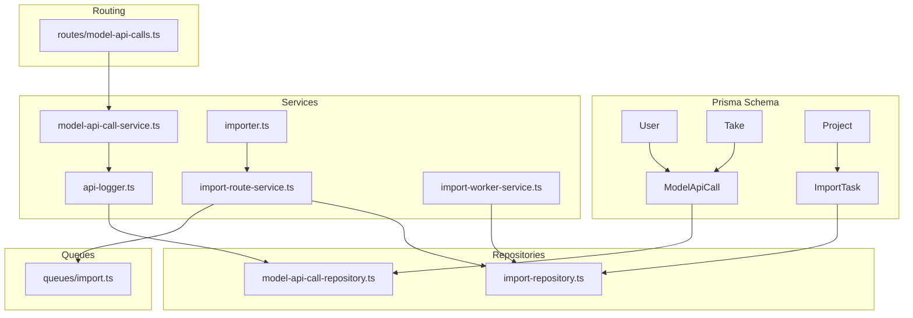
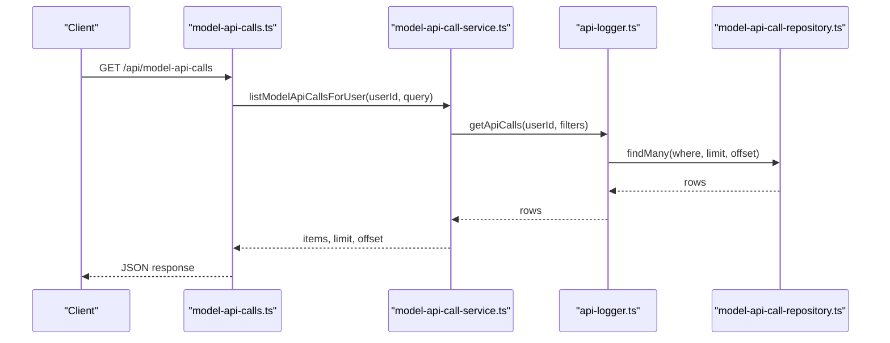
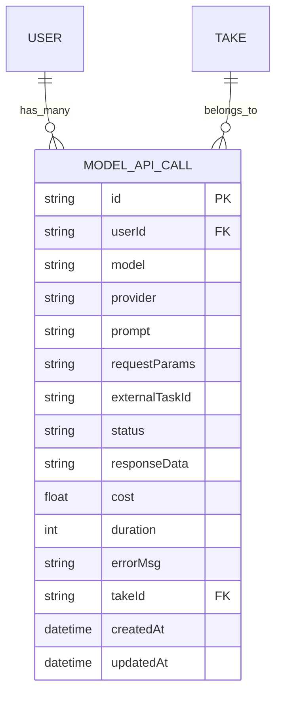
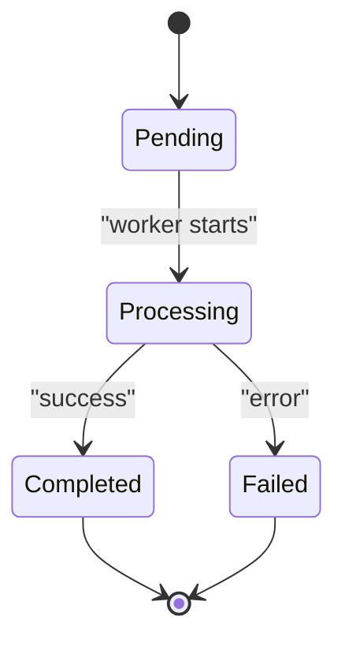
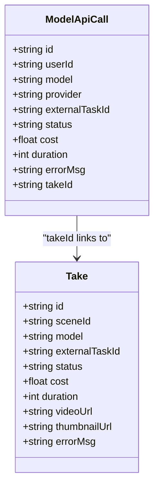
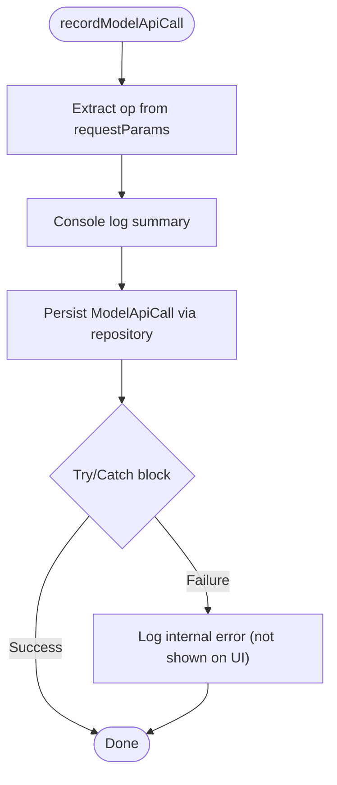
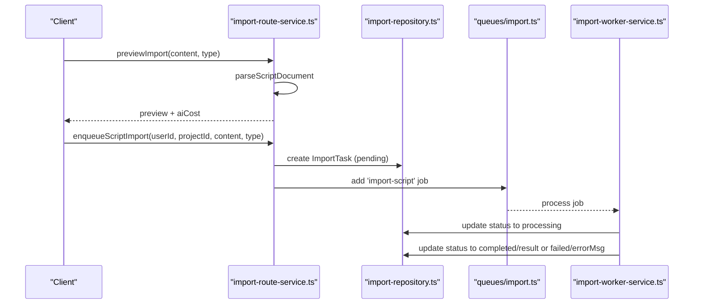
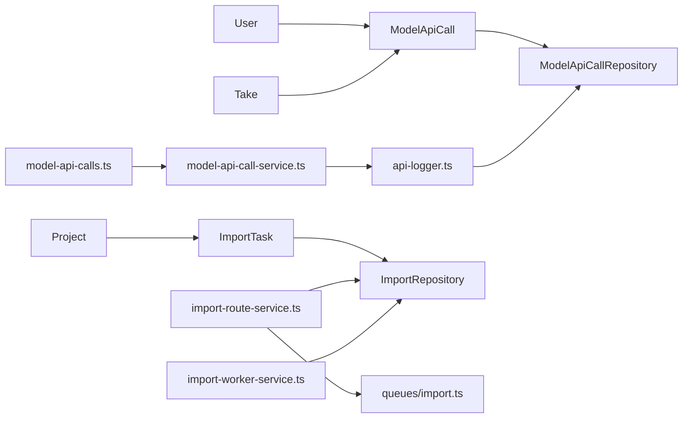

# API Integration Models

<cite>
**Referenced Files in This Document**
- [schema.prisma](file://packages/backend/prisma/schema.prisma)
- [api-logger.ts](file://packages/backend/src/services/ai/api-logger.ts)
- [model-api-call-service.ts](file://packages/backend/src/services/ai/model-api-call-service.ts)
- [model-api-call-repository.ts](file://packages/backend/src/repositories/model-api-call-repository.ts)
- [model-api-calls.ts](file://packages/backend/src/routes/model-api-calls.ts)
- [importer.ts](file://packages/backend/src/services/importer.ts)
- [import-repository.ts](file://packages/backend/src/repositories/import-repository.ts)
- [import-route-service.ts](file://packages/backend/src/services/import-route-service.ts)
- [import-worker-service.ts](file://packages/backend/src/services/import-worker-service.ts)
- [import.ts](file://packages/backend/src/queues/import.ts)
</cite>

## Table of Contents

1. [Introduction](#introduction)
2. [Project Structure](#project-structure)
3. [Core Components](#core-components)
4. [Architecture Overview](#architecture-overview)
5. [Detailed Component Analysis](#detailed-component-analysis)
6. [Dependency Analysis](#dependency-analysis)
7. [Performance Considerations](#performance-considerations)
8. [Troubleshooting Guide](#troubleshooting-guide)
9. [Conclusion](#conclusion)

## Introduction

This document provides a comprehensive entity model reference for API integration entities focused on AI service workflows: ModelApiCall and ImportTask. It explains how these entities capture user-driven AI calls, track provider and model usage, store response data, and manage costs. It also documents ImportTask for content import workflows, including status tracking and result storage. The document covers logging patterns, error handling strategies, cost management, and the relationship between API calls and generated takes.

## Project Structure

The relevant implementation spans Prisma schema definitions, service utilities, repositories, routes, and queue workers:

- Prisma schema defines ModelApiCall and ImportTask entities and their relations.
- API logging utilities centralize recording and querying of model API calls.
- Import route service manages task creation and queue dispatch.
- Import worker service updates task status and results.
- Repositories encapsulate persistence operations.

**Diagram sources**

- [schema.prisma](file://packages/backend/prisma/schema.prisma)
- [api-logger.ts](file://packages/backend/src/services/ai/api-logger.ts)
- [model-api-call-service.ts](file://packages/backend/src/services/ai/model-api-call-service.ts)
- [model-api-call-repository.ts](file://packages/backend/src/repositories/model-api-call-repository.ts)
- [import-route-service.ts](file://packages/backend/src/services/import-route-service.ts)
- [import-worker-service.ts](file://packages/backend/src/services/import-worker-service.ts)
- [importer.ts](file://packages/backend/src/services/importer.ts)
- [import.ts](file://packages/backend/src/queues/import.ts)
- [model-api-calls.ts](file://packages/backend/src/routes/model-api-calls.ts)

**Section sources**

- [schema.prisma](file://packages/backend/prisma/schema.prisma)
- [api-logger.ts](file://packages/backend/src/services/ai/api-logger.ts)
- [model-api-call-service.ts](file://packages/backend/src/services/ai/model-api-call-service.ts)
- [model-api-call-repository.ts](file://packages/backend/src/repositories/model-api-call-repository.ts)
- [import-route-service.ts](file://packages/backend/src/services/import-route-service.ts)
- [import-worker-service.ts](file://packages/backend/src/services/import-worker-service.ts)
- [importer.ts](file://packages/backend/src/services/importer.ts)
- [import.ts](file://packages/backend/src/queues/import.ts)
- [model-api-calls.ts](file://packages/backend/src/routes/model-api-calls.ts)

## Core Components

This section documents the two primary entities and their roles in API integration and content import workflows.

- ModelApiCall
  - Purpose: Records user-triggered AI model calls, including provider, model, prompt, request parameters, status, response data, cost, duration, and optional linkage to a take.
  - Key associations: Belongs to User; optionally belongs to Take; optionally tracks external_task_id for AI service task identifiers.
  - Cost and timing fields: cost (Float), duration (Int), errorMsg (String), status (String).
  - Request context: requestParams (JSON string) stores operation context (e.g., op, projectId) for filtering and auditing.

- ImportTask
  - Purpose: Tracks asynchronous content import jobs (script or project), including content type, status, and result metadata.
  - Key associations: Belongs to User; optionally belongs to Project.
  - Status lifecycle: pending → processing → completed or failed.
  - Result storage: result (JSON) captures structured outcomes; errorMsg (String) captures failures.

**Section sources**

- [schema.prisma](file://packages/backend/prisma/schema.prisma)

## Architecture Overview

The system integrates AI model calls and import workflows through centralized logging and queue-based processing. ModelApiCall captures all AI interactions for observability and cost tracking. ImportTask orchestrates content ingestion via queue workers that update task state and results.

**Diagram sources**

- [model-api-calls.ts](file://packages/backend/src/routes/model-api-calls.ts)
- [model-api-call-service.ts](file://packages/backend/src/services/ai/model-api-call-service.ts)
- [api-logger.ts](file://packages/backend/src/services/ai/api-logger.ts)
- [model-api-call-repository.ts](file://packages/backend/src/repositories/model-api-call-repository.ts)

## Detailed Component Analysis

### ModelApiCall Entity

ModelApiCall persists AI service interactions for auditability, cost accounting, and operational insights. It supports:

- User association via userId and relation to User.
- Provider and model identification for analytics.
- Prompt truncation to prevent oversized fields.
- Request context stored as JSON string for filtering and reporting.
- Optional linkage to Take via takeId for traceability from generated media back to the triggering call.
- Status lifecycle: pending → processing → completed or failed.
- Cost and duration tracking for billing and performance metrics.
- Error messaging for diagnostics.

Key fields and constraints:

- id, userId, user (relation), model, provider, prompt, requestParams (JSON), externalTaskId, status, responseData (JSON), cost, duration, errorMsg, takeId, take (relation), createdAt, updatedAt.
- Indexes on userId, externalTaskId, model, createdAt for efficient queries.

**Diagram sources**

- [schema.prisma](file://packages/backend/prisma/schema.prisma)

**Section sources**

- [schema.prisma](file://packages/backend/prisma/schema.prisma)
- [api-logger.ts](file://packages/backend/src/services/ai/api-logger.ts)
- [model-api-call-repository.ts](file://packages/backend/src/repositories/model-api-call-repository.ts)
- [model-api-call-service.ts](file://packages/backend/src/services/ai/model-api-call-service.ts)

### ImportTask Entity

ImportTask manages asynchronous content import jobs. It supports:

- Content ingestion from markdown or JSON.
- Queue-based processing with status transitions.
- Result storage as JSON for downstream consumption.
- Error capture for failure diagnostics.

Lifecycle:

- Creation: ImportRouteService creates ImportTask with status pending.
- Dispatch: Task is enqueued via import queue.
- Processing: Worker updates status to processing and performs import.
- Completion/Failure: Worker sets completed with result or failed with errorMsg.

**Diagram sources**

- [import-route-service.ts](file://packages/backend/src/services/import-route-service.ts)
- [import-worker-service.ts](file://packages/backend/src/services/import-worker-service.ts)
- [import.ts](file://packages/backend/src/queues/import.ts)

**Section sources**

- [schema.prisma](file://packages/backend/prisma/schema.prisma)
- [import-route-service.ts](file://packages/backend/src/services/import-route-service.ts)
- [import-worker-service.ts](file://packages/backend/src/services/import-worker-service.ts)
- [import-repository.ts](file://packages/backend/src/repositories/import-repository.ts)
- [import.ts](file://packages/backend/src/queues/import.ts)

### Relationship Between API Calls and Generated Takes

Generated takes (video assets) are linked to ModelApiCall via takeId. This enables tracing:

- Which AI call produced a take.
- Cost attribution per take.
- Status propagation for long-running tasks.

**Diagram sources**

- [schema.prisma](file://packages/backend/prisma/schema.prisma)

**Section sources**

- [schema.prisma](file://packages/backend/prisma/schema.prisma)

### API Call Logging Patterns and Error Handling

Logging patterns:

- recordModelApiCall writes a concise terminal summary and persists a ModelApiCall record.
- logApiCall records either a new call or updates an existing one identified by externalTaskId.
- getApiCalls filters by userId, model, op (operation), projectId, and status; op filtering normalizes hyphens to underscores for matching.

Error handling:

- Logging functions wrap persistence in try/catch to avoid masking upstream errors.
- getApiCalls applies safe substring matching for op and projectId inside requestParams JSON.
- API call status is derived from presence of error, videoUrl, or absence thereof.

**Diagram sources**

- [api-logger.ts](file://packages/backend/src/services/ai/api-logger.ts)
- [model-api-call-repository.ts](file://packages/backend/src/repositories/model-api-call-repository.ts)

**Section sources**

- [api-logger.ts](file://packages/backend/src/services/ai/api-logger.ts)
- [model-api-call-repository.ts](file://packages/backend/src/repositories/model-api-call-repository.ts)

### Cost Management Approaches

- Cost fields: ModelApiCall.cost and Take.cost enable per-call and per-take cost tracking.
- Truncation: Prompt truncation prevents oversized logs while preserving context.
- Filtering: getApiCalls supports filtering by model and op to isolate cost drivers.
- Reporting: listModelApiCallsForUser aggregates items with parsed requestParams for cost analysis.

**Section sources**

- [api-logger.ts](file://packages/backend/src/services/ai/api-logger.ts)
- [model-api-call-service.ts](file://packages/backend/src/services/ai/model-api-call-service.ts)
- [schema.prisma](file://packages/backend/prisma/schema.prisma)

### Import Workflow Integration

- Preview parsing: ImportRouteService parses content and estimates cost before enqueuing.
- Enqueue: Tasks are persisted and dispatched to the import queue.
- Worker: ImportWorkerService updates task status and result/error fields upon completion.

**Diagram sources**

- [import-route-service.ts](file://packages/backend/src/services/import-route-service.ts)
- [import-repository.ts](file://packages/backend/src/repositories/import-repository.ts)
- [import.ts](file://packages/backend/src/queues/import.ts)
- [import-worker-service.ts](file://packages/backend/src/services/import-worker-service.ts)

**Section sources**

- [import-route-service.ts](file://packages/backend/src/services/import-route-service.ts)
- [import-worker-service.ts](file://packages/backend/src/services/import-worker-service.ts)
- [import-repository.ts](file://packages/backend/src/repositories/import-repository.ts)
- [import.ts](file://packages/backend/src/queues/import.ts)

## Dependency Analysis

- ModelApiCall depends on User and optionally Take.
- API logging utilities depend on ModelApiCallRepository for persistence.
- Route depends on model-api-call-service for filtering and pagination.
- ImportTask depends on User and optionally Project.
- ImportRouteService depends on ImportRepository and queue.
- ImportWorkerService depends on ImportRepository and ProjectRepository.

**Diagram sources**

- [schema.prisma](file://packages/backend/prisma/schema.prisma)
- [api-logger.ts](file://packages/backend/src/services/ai/api-logger.ts)
- [model-api-call-service.ts](file://packages/backend/src/services/ai/model-api-call-service.ts)
- [model-api-call-repository.ts](file://packages/backend/src/repositories/model-api-call-repository.ts)
- [model-api-calls.ts](file://packages/backend/src/routes/model-api-calls.ts)
- [import-route-service.ts](file://packages/backend/src/services/import-route-service.ts)
- [import-worker-service.ts](file://packages/backend/src/services/import-worker-service.ts)
- [import-repository.ts](file://packages/backend/src/repositories/import-repository.ts)
- [import.ts](file://packages/backend/src/queues/import.ts)

**Section sources**

- [schema.prisma](file://packages/backend/prisma/schema.prisma)
- [api-logger.ts](file://packages/backend/src/services/ai/api-logger.ts)
- [model-api-call-service.ts](file://packages/backend/src/services/ai/model-api-call-service.ts)
- [model-api-call-repository.ts](file://packages/backend/src/repositories/model-api-call-repository.ts)
- [model-api-calls.ts](file://packages/backend/src/routes/model-api-calls.ts)
- [import-route-service.ts](file://packages/backend/src/services/import-route-service.ts)
- [import-worker-service.ts](file://packages/backend/src/services/import-worker-service.ts)
- [import-repository.ts](file://packages/backend/src/repositories/import-repository.ts)
- [import.ts](file://packages/backend/src/queues/import.ts)

## Performance Considerations

- Prompt truncation: MODEL_LOG_PROMPT_MAX prevents oversized fields and reduces storage overhead.
- Indexes: ModelApiCall indexes on userId, externalTaskId, model, createdAt optimize common queries.
- Pagination: Service enforces limits and offsets to cap result sizes.
- Queue-based import: Offloads heavy parsing and project creation to workers, keeping API responses responsive.

[No sources needed since this section provides general guidance]

## Troubleshooting Guide

Common scenarios and remedies:

- Missing or truncated prompt data: Verify prompt length and truncation thresholds.
- Empty or malformed requestParams: Ensure op and projectId are properly set when invoking logging functions.
- Stuck tasks: Check ImportTask status transitions and queue worker logs.
- Cost discrepancies: Confirm cost fields are populated during logApiCall and recordModelApiCall.

**Section sources**

- [api-logger.ts](file://packages/backend/src/services/ai/api-logger.ts)
- [import-worker-service.ts](file://packages/backend/src/services/import-worker-service.ts)

## Conclusion

ModelApiCall and ImportTask form the backbone of API integration and content import workflows. ModelApiCall centralizes observability, cost tracking, and traceability for AI calls, while ImportTask manages asynchronous content ingestion with robust status and result handling. Together, they support scalable monitoring, billing, and operational insights for AI-driven content production.
