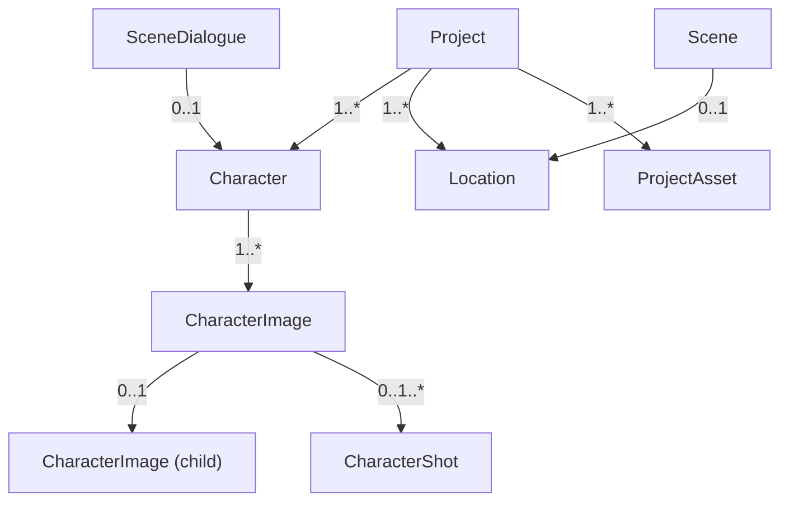
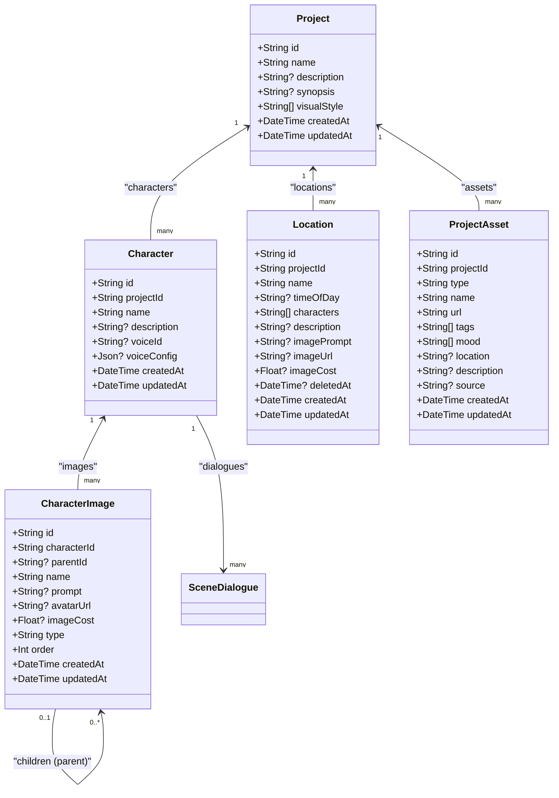
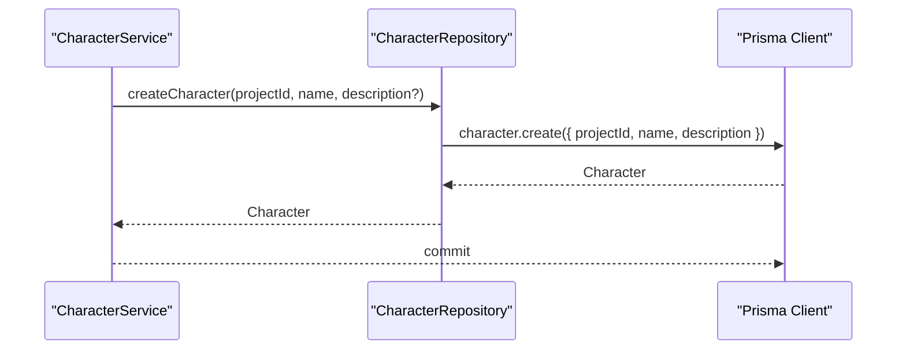
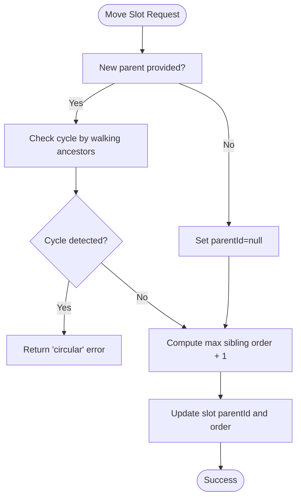
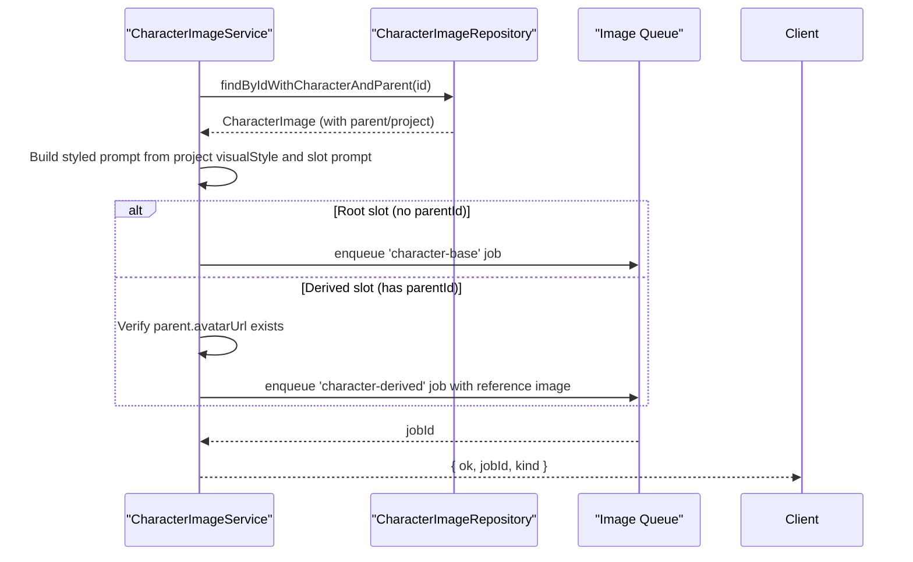
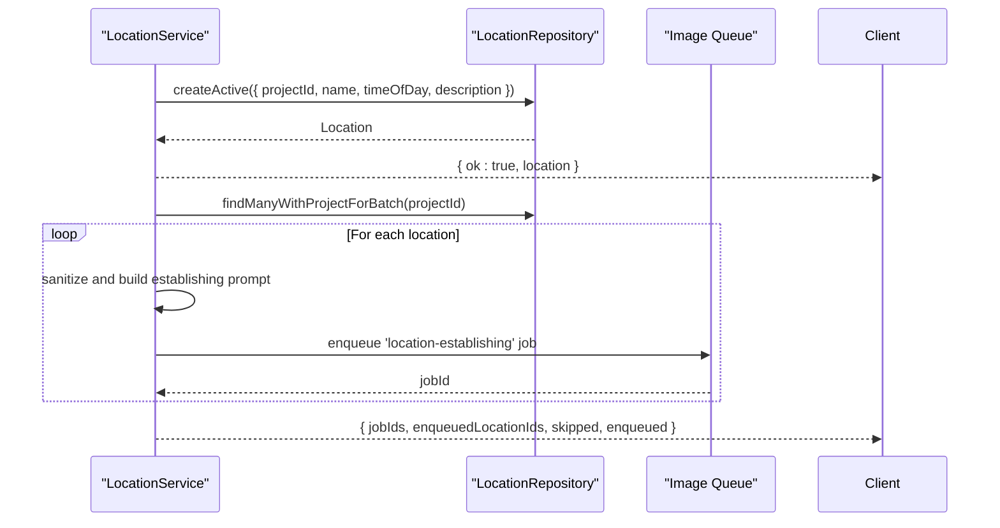
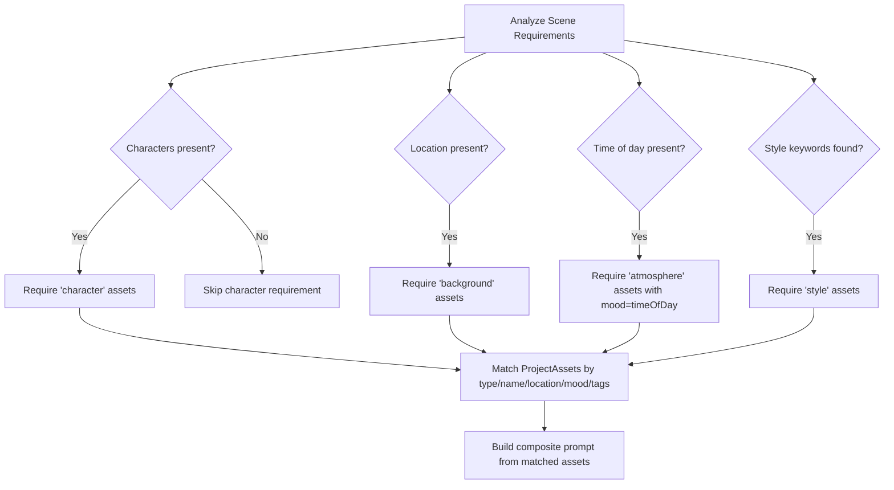
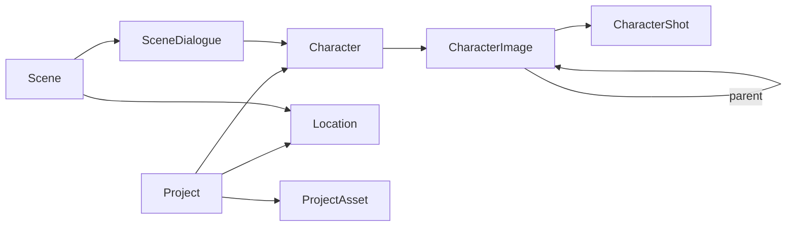

# Asset Management Models

<cite>
**Referenced Files in This Document**
- [schema.prisma](file://packages/backend/prisma/schema.prisma)
- [migration.sql (20260420140000)](file://packages/backend/prisma/migrations/20260420140000_location_deleted_at/migration.sql)
- [migration.sql (20260416120001)](file://packages/backend/prisma/migrations/20260416120001_character_image_prompt_location_image_prompt/migration.sql)
- [character-service.ts](file://packages/backend/src/services/character-service.ts)
- [character-image-service.ts](file://packages/backend/src/services/character-image-service.ts)
- [location-service.ts](file://packages/backend/src/services/location-service.ts)
- [scene-asset.ts](file://packages/backend/src/services/scene-asset.ts)
- [scene-asset.constants.ts](file://packages/backend/src/services/scene-asset.constants.ts)
- [character-repository.ts](file://packages/backend/src/repositories/character-repository.ts)
</cite>

## Table of Contents

1. [Introduction](#introduction)
2. [Project Structure](#project-structure)
3. [Core Components](#core-components)
4. [Architecture Overview](#architecture-overview)
5. [Detailed Component Analysis](#detailed-component-analysis)
6. [Dependency Analysis](#dependency-analysis)
7. [Performance Considerations](#performance-considerations)
8. [Troubleshooting Guide](#troubleshooting-guide)
9. [Conclusion](#conclusion)

## Introduction

This document describes the asset management entity model with a focus on Characters, CharacterImages, Locations, and ProjectAssets. It explains relationships, cascade behaviors, and business logic, and provides examples of creation and management workflows grounded in the repository’s Prisma schema and service-layer implementations.

## Project Structure

The asset models are defined in the Prisma schema and supported by service and repository layers:

- Entities: Character, CharacterImage, Location, ProjectAsset
- Relationships: Project → Character/Location/ProjectAsset; Character → CharacterImage; CharacterImage ↔ CharacterImage (hierarchical); SceneDialogue ↔ Character
- Migrations: Added optional prompt fields and soft-delete support for Location

**Diagram sources**

- [schema.prisma:28-53](file://packages/backend/prisma/schema.prisma#L28-L53)
- [schema.prisma:74-90](file://packages/backend/prisma/schema.prisma#L74-L90)
- [schema.prisma:92-113](file://packages/backend/prisma/schema.prisma#L92-L113)
- [schema.prisma:194-214](file://packages/backend/prisma/schema.prisma#L194-L214)
- [schema.prisma:348-364](file://packages/backend/prisma/schema.prisma#L348-L364)

**Section sources**

- [schema.prisma:28-53](file://packages/backend/prisma/schema.prisma#L28-L53)
- [schema.prisma:74-90](file://packages/backend/prisma/schema.prisma#L74-L90)
- [schema.prisma:92-113](file://packages/backend/prisma/schema.prisma#L92-L113)
- [schema.prisma:194-214](file://packages/backend/prisma/schema.prisma#L194-L214)
- [schema.prisma:348-364](file://packages/backend/prisma/schema.prisma#L348-L364)

## Core Components

- Character: Represents a role within a project. Supports voice configuration via a JSON field and maintains a collection of CharacterImages and a bidirectional relation to SceneDialogue through a named relation.
- CharacterImage: Hierarchical slots for character visuals with prompt, avatarUrl, optional cost, parent-child relations, type enumeration, ordering, and derived/derived-from semantics.
- Location: Represents a place with optional time-of-day attribute and soft-deletion support via a deletedAt timestamp.
- ProjectAsset: Generic asset container for the project with type, name, url, tags, mood, location, and source metadata.

**Section sources**

- [schema.prisma:74-90](file://packages/backend/prisma/schema.prisma#L74-L90)
- [schema.prisma:92-113](file://packages/backend/prisma/schema.prisma#L92-L113)
- [schema.prisma:194-214](file://packages/backend/prisma/schema.prisma#L194-L214)
- [schema.prisma:348-364](file://packages/backend/prisma/schema.prisma#L348-L364)

## Architecture Overview

The asset model is anchored by Project and connected to Characters, Locations, and ProjectAssets. CharacterImages form a tree under Character, enabling base and derived variants. SceneDialogue references Character, and ProjectAssets can be leveraged by scene generation logic.

**Diagram sources**

- [schema.prisma:28-53](file://packages/backend/prisma/schema.prisma#L28-L53)
- [schema.prisma:74-90](file://packages/backend/prisma/schema.prisma#L74-L90)
- [schema.prisma:92-113](file://packages/backend/prisma/schema.prisma#L92-L113)
- [schema.prisma:194-214](file://packages/backend/prisma/schema.prisma#L194-L214)
- [schema.prisma:348-364](file://packages/backend/prisma/schema.prisma#L348-L364)

## Detailed Component Analysis

### Character Entity

- Purpose: Defines a role within a project with optional voice identity and configuration stored as JSON.
- Voice configuration: A JSON field supports flexible voice-related settings per character.
- Dialogues relationship: Bidirectional relation to SceneDialogue via a named relation, enabling association of spoken lines to characters.
- Cascade behavior: Deleting a Character cascades to dependent CharacterImages and SceneDialogue entries due to explicit onDelete: Cascade on the Character relation in CharacterImage and SceneDialogue.
- Cardinality:
  - Project → Character: one-to-many
  - Character → CharacterImage: one-to-many
  - Character ↔ SceneDialogue: one-to-many (via named relation)

**Diagram sources**

- [character-service.ts:45-51](file://packages/backend/src/services/character-service.ts#L45-L51)
- [character-repository.ts:39-41](file://packages/backend/src/repositories/character-repository.ts#L39-L41)

**Section sources**

- [schema.prisma:74-90](file://packages/backend/prisma/schema.prisma#L74-L90)
- [character-service.ts:45-51](file://packages/backend/src/services/character-service.ts#L45-L51)
- [character-repository.ts:39-41](file://packages/backend/src/repositories/character-repository.ts#L39-L41)

### CharacterImage Entity and Hierarchy

- Purpose: Stores character visual slots with hierarchical relationships and type enumeration.
- Parent-child hierarchy: Self-referencing relation with named relation "ImageHierarchy". A slot can have one parent and many children.
- Type enumeration: Slots are typed (e.g., base vs. derived), enforced by defaults and service-level checks.
- Ordering: Sibling ordering maintained via an order field.
- Cascade behavior: Deleting a Character cascades to CharacterImage; deleting a CharacterImage does not cascade further by default.
- Business logic highlights:
  - Base slot uniqueness: Each character can have at most one root-level base slot.
  - Prompt generation: AI-generated prompts can be attached to slots; uploaded images can be stored via avatarUrl.
  - Movement validation: Prevents moving a slot into its own descendant subtree (cycle detection).
  - Deletion with descendants: Deletes a slot and all its descendants recursively.

**Diagram sources**

- [character-service.ts:228-261](file://packages/backend/src/services/character-service.ts#L228-L261)

**Diagram sources**

- [character-image-service.ts:34-86](file://packages/backend/src/services/character-image-service.ts#L34-L86)

**Section sources**

- [schema.prisma:92-113](file://packages/backend/prisma/schema.prisma#L92-L113)
- [character-service.ts:61-134](file://packages/backend/src/services/character-service.ts#L61-L134)
- [character-service.ts:197-226](file://packages/backend/src/services/character-service.ts#L197-L226)
- [character-service.ts:228-261](file://packages/backend/src/services/character-service.ts#L228-L261)
- [character-image-service.ts:34-86](file://packages/backend/src/services/character-image-service.ts#L34-L86)

### Location Entity (Soft Deletion and Time-of-Day)

- Purpose: Represents a place used in scenes with optional time-of-day and soft-deletion support.
- Soft deletion: A deletedAt timestamp allows listing active locations while retaining historical records.
- Time-of-day: Optional attribute to influence scene atmosphere and asset selection.
- Cascade behavior: Deleting a Location cascades to dependent Scene entries due to onDelete: Cascade on Scene.locationId.
- Business logic highlights:
  - Manual creation validates non-empty name and uniqueness within the project.
  - Establishing image generation can be batched or enqueued per location.
  - Deletion unlinks scenes from the location and marks it deleted.

**Diagram sources**

- [location-service.ts:35-64](file://packages/backend/src/services/location-service.ts#L35-L64)
- [location-service.ts:74-124](file://packages/backend/src/services/location-service.ts#L74-L124)

**Section sources**

- [schema.prisma:194-214](file://packages/backend/prisma/schema.prisma#L194-L214)
- [migration.sql (20260420140000):1-5](file://packages/backend/prisma/migrations/20260420140000_location_deleted_at/migration.sql#L1-L5)
- [location-service.ts:35-64](file://packages/backend/src/services/location-service.ts#L35-L64)
- [location-service.ts:74-124](file://packages/backend/src/services/location-service.ts#L74-L124)
- [location-service.ts:167-179](file://packages/backend/src/services/location-service.ts#L167-L179)

### ProjectAsset Entity (Generic Asset Management)

- Purpose: Generic asset container for project-wide use, supporting tagging and mood attributes.
- Attributes: type, name, url, description, tags[], mood[], location?, source?, createdAt/updatedAt.
- Relationship: Project → ProjectAsset is one-to-many.
- Business logic highlights:
  - Scene asset recommendation engine matches ProjectAssets to scenes based on type, location, mood, and tags.
  - Composite prompts are generated by combining matched assets’ descriptions.
  - CharacterImage instances can be converted to ProjectAsset format for use in scene generation.

**Diagram sources**

- [scene-asset.ts:45-101](file://packages/backend/src/services/scene-asset.ts#L45-L101)
- [scene-asset.ts:106-218](file://packages/backend/src/services/scene-asset.ts#L106-L218)
- [scene-asset.constants.ts:9-16](file://packages/backend/src/services/scene-asset.constants.ts#L9-L16)
- [scene-asset.constants.ts:21-38](file://packages/backend/src/services/scene-asset.constants.ts#L21-L38)
- [scene-asset.constants.ts:56-64](file://packages/backend/src/services/scene-asset.constants.ts#L56-L64)

**Section sources**

- [schema.prisma:348-364](file://packages/backend/prisma/schema.prisma#L348-L364)
- [scene-asset.ts:45-101](file://packages/backend/src/services/scene-asset.ts#L45-L101)
- [scene-asset.ts:106-218](file://packages/backend/src/services/scene-asset.ts#L106-L218)
- [scene-asset.ts:377-386](file://packages/backend/src/services/scene-asset.ts#L377-L386)
- [scene-asset.constants.ts:9-16](file://packages/backend/src/services/scene-asset.constants.ts#L9-L16)
- [scene-asset.constants.ts:21-38](file://packages/backend/src/services/scene-asset.constants.ts#L21-L38)
- [scene-asset.constants.ts:56-64](file://packages/backend/src/services/scene-asset.constants.ts#L56-L64)

## Dependency Analysis

- Project anchors all assets; Character and Location are owned by Project with cascade deletes.
- CharacterImage forms a tree under Character; CharacterImage → CharacterShot links images to shots.
- SceneDialogue references Character and Scene; Location participates in Scene.
- ProjectAsset is independent of Project’s core entities but is consumed by scene asset recommendation logic.

**Diagram sources**

- [schema.prisma:28-53](file://packages/backend/prisma/schema.prisma#L28-L53)
- [schema.prisma:74-90](file://packages/backend/prisma/schema.prisma#L74-L90)
- [schema.prisma:92-113](file://packages/backend/prisma/schema.prisma#L92-L113)
- [schema.prisma:194-214](file://packages/backend/prisma/schema.prisma#L194-L214)
- [schema.prisma:348-364](file://packages/backend/prisma/schema.prisma#L348-L364)

**Section sources**

- [schema.prisma:28-53](file://packages/backend/prisma/schema.prisma#L28-L53)
- [schema.prisma:74-90](file://packages/backend/prisma/schema.prisma#L74-L90)
- [schema.prisma:92-113](file://packages/backend/prisma/schema.prisma#L92-L113)
- [schema.prisma:194-214](file://packages/backend/prisma/schema.prisma#L194-L214)
- [schema.prisma:348-364](file://packages/backend/prisma/schema.prisma#L348-L364)

## Performance Considerations

- Indexes: CharacterImage and Location include indexes on foreign keys and composite indexes (e.g., Location projectId + deletedAt) to optimize queries.
- Aggregation: CharacterRepository computes max sibling order via aggregation to avoid extra round trips.
- Cascading: Use cascade deletes judiciously; they simplify cleanup but can mask partial failures if not handled carefully in higher layers.

[No sources needed since this section provides general guidance]

## Troubleshooting Guide

- CharacterImage movement creates cycles: If moving a slot causes a cycle, the operation fails with a circular error. Walk ancestors to detect loops before updating parentId.
- Base slot uniqueness: Creating a second root-level base slot for the same character is rejected by the service.
- Missing prompt or parent avatar: Enqueuing a derived image generation requires a prompt and a parent avatar; otherwise, the operation fails early.
- Location deletion: Soft-deleting a location removes it from active listings and unlinks scenes; confirm that scenes are properly disassociated before deletion.

**Section sources**

- [character-service.ts:228-261](file://packages/backend/src/services/character-service.ts#L228-L261)
- [character-service.ts:61-134](file://packages/backend/src/services/character-service.ts#L61-L134)
- [character-image-service.ts:34-86](file://packages/backend/src/services/character-image-service.ts#L34-L86)
- [location-service.ts:167-179](file://packages/backend/src/services/location-service.ts#L167-L179)

## Conclusion

The asset model centers on Project with strong ownership of Characters, Locations, and ProjectAssets. CharacterImages form a flexible, hierarchical slot system with robust validation and generation workflows. Location supports time-of-day and soft deletion, while ProjectAssets enable rich scene asset recommendations through tagging and mood metadata. The service and repository layers enforce business rules and maintain referential integrity.
