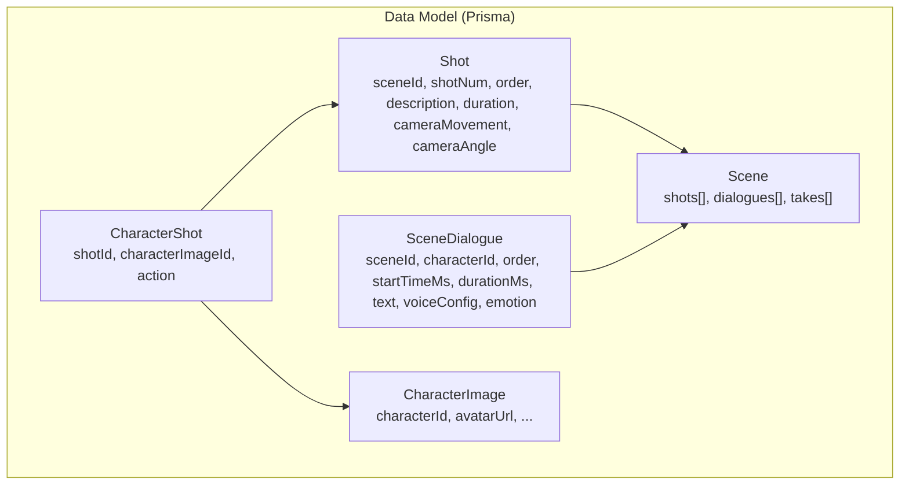
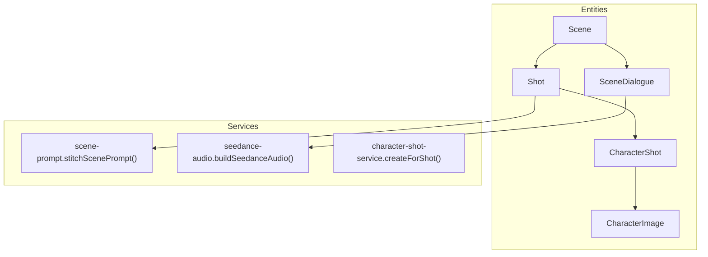
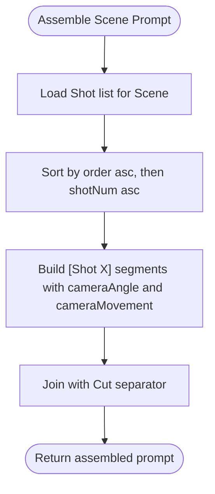
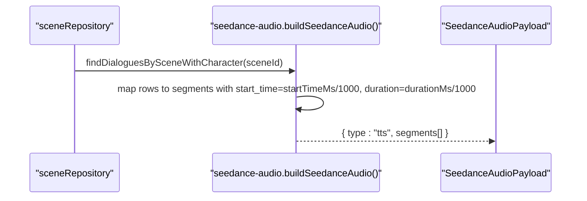
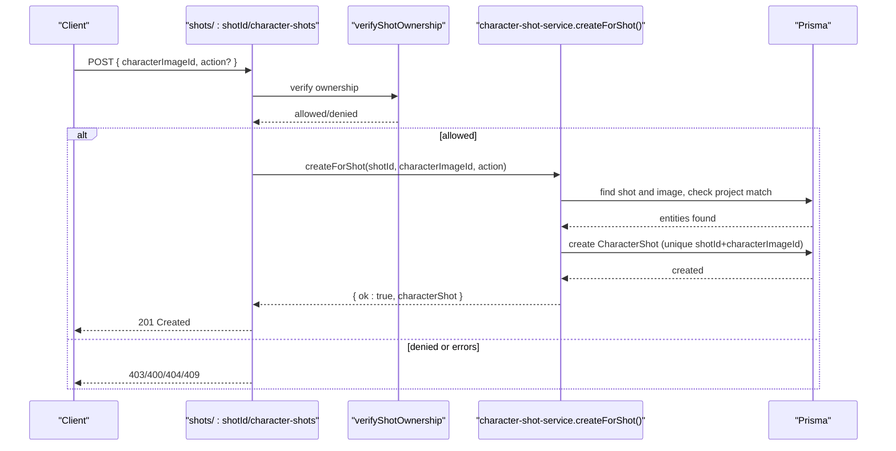
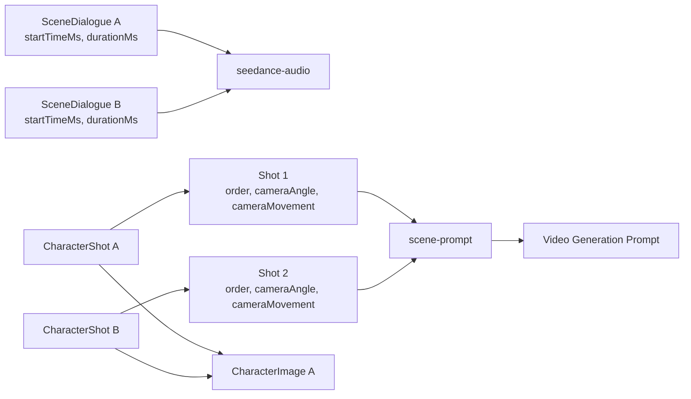
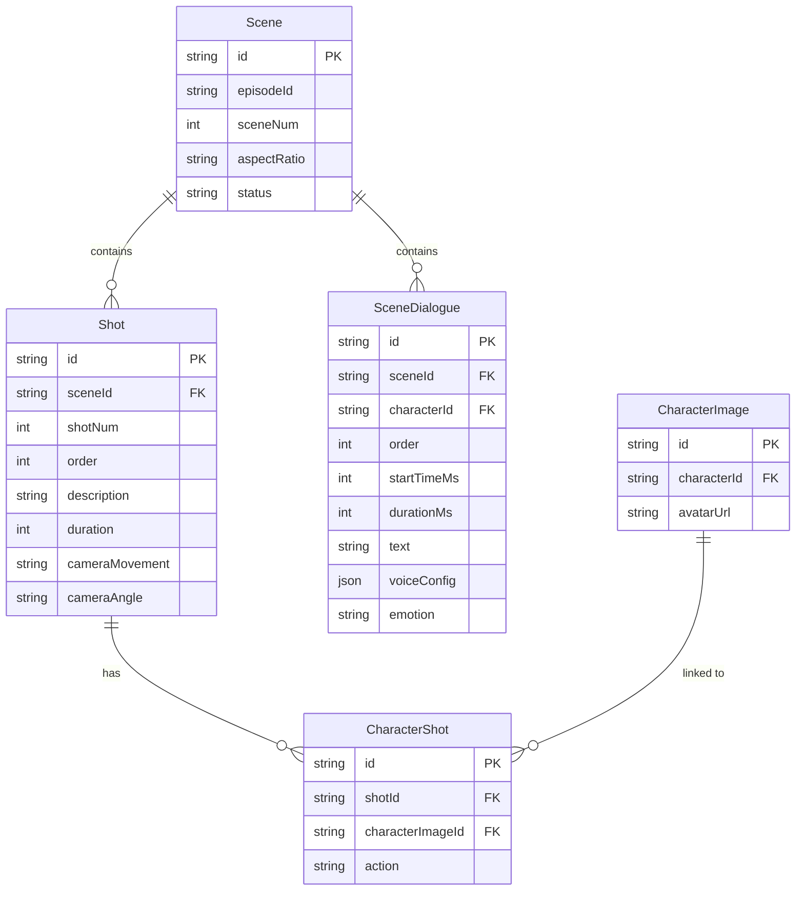

# Content Creation Models

<cite>
**Referenced Files in This Document**
- [schema.prisma](file://packages/backend/prisma/schema.prisma)
- [DREAMER_DATA_MODEL.md](file://docs/DREAMER_DATA_MODEL.md)
- [shots.ts](file://packages/backend/src/routes/shots.ts)
- [character-shot-service.ts](file://packages/backend/src/services/character-shot-service.ts)
- [scene-prompt.ts](file://packages/backend/src/services/scene-prompt.ts)
- [seedance-audio.ts](file://packages/backend/src/services/seedance-audio.ts)
- [seedance-scene-request.test.ts](file://packages/backend/tests/seedance-scene-request.test.ts)
- [shots.test.ts](file://packages/backend/tests/shots.test.ts)
- [character-shot-service.test.ts](file://packages/backend/tests/character-shot-service.test.ts)
- [SKILL.md](file://docs/skills/SKILL.md)
</cite>

## Table of Contents

1. [Introduction](#introduction)
2. [Project Structure](#project-structure)
3. [Core Components](#core-components)
4. [Architecture Overview](#architecture-overview)
5. [Detailed Component Analysis](#detailed-component-analysis)
6. [Dependency Analysis](#dependency-analysis)
7. [Performance Considerations](#performance-considerations)
8. [Troubleshooting Guide](#troubleshooting-guide)
9. [Conclusion](#conclusion)
10. [Appendices](#appendices)

## Introduction

This document defines the content creation entity model for Shot, SceneDialogue, and CharacterShot. It explains how these entities support the creative workflow for video generation, including camera movement and angle controls, precise timing for dialogue, voice configuration, and the many-to-many bridge between Shots and CharacterImages. It also documents the stitching of Shot descriptions into a single video generation prompt and the assembly of audio segments for voice synthesis.

## Project Structure

The entity model is defined in the Prisma schema and enforced by database constraints. Supporting services assemble Shot descriptions into prompts and SceneDialogue entries into audio payloads for video generation.

**Diagram sources**

- [schema.prisma:115-192](file://packages/backend/prisma/schema.prisma#L115-L192)

**Section sources**

- [schema.prisma:115-192](file://packages/backend/prisma/schema.prisma#L115-L192)

## Core Components

- Shot: Describes a camera framing and movement for a scene. Attributes include sequence ordering, descriptive text, optional camera movement and angle, and duration. Shots are ordered per scene and contribute to the prompt for video generation.
- SceneDialogue: Represents spoken dialogue with precise timing and voice configuration. Includes start time in milliseconds, duration in milliseconds, text content, voice configuration, and optional emotion.
- CharacterShot: Many-to-many bridge linking a Shot to a CharacterImage. It optionally records an action associated with the character in that shot.

Key fields for workflows:

- Shot.order: Controls the order of Shot descriptions when assembling the video generation prompt.
- SceneDialogue.startTimeMs: Defines the absolute start time of a dialogue segment in milliseconds for audio/video synchronization.

**Section sources**

- [schema.prisma:142-158](file://packages/backend/prisma/schema.prisma#L142-L158)
- [schema.prisma:175-192](file://packages/backend/prisma/schema.prisma#L175-L192)
- [DREAMER_DATA_MODEL.md:11-18](file://docs/DREAMER_DATA_MODEL.md#L11-L18)

## Architecture Overview

The Shot, SceneDialogue, and CharacterShot entities integrate with services that:

- Assemble Shot descriptions into a single prompt for video generation.
- Convert SceneDialogue entries into voice segments for audio synthesis.
- Manage the association between Shots and CharacterImages via CharacterShot.

**Diagram sources**

- [schema.prisma:115-192](file://packages/backend/prisma/schema.prisma#L115-L192)
- [scene-prompt.ts:15-28](file://packages/backend/src/services/scene-prompt.ts#L15-L28)
- [seedance-audio.ts:14-26](file://packages/backend/src/services/seedance-audio.ts#L14-L26)
- [character-shot-service.ts:38-85](file://packages/backend/src/services/character-shot-service.ts#L38-L85)

## Detailed Component Analysis

### Shot Entity

Shot captures camera movement and angle for video generation. It is ordered within a Scene and contributes to the prompt assembly.

- Fields and relationships
  - Identifiers: id, sceneId
  - Ordering: shotNum, order
  - Description: description, duration (milliseconds)
  - Camera controls: cameraMovement, cameraAngle
  - Relations: belongs to Scene; links to CharacterShot via characterShots

- Prompt assembly
  - Shots are sorted by order and shotNum, then concatenated with a cut separator to form a single prompt for video generation.

**Diagram sources**

- [scene-prompt.ts:15-28](file://packages/backend/src/services/scene-prompt.ts#L15-L28)
- [seedance-scene-request.test.ts:5-21](file://packages/backend/tests/seedance-scene-request.test.ts#L5-L21)

**Section sources**

- [schema.prisma:142-158](file://packages/backend/prisma/schema.prisma#L142-L158)
- [scene-prompt.ts:15-28](file://packages/backend/src/services/scene-prompt.ts#L15-L28)
- [seedance-scene-request.test.ts:5-21](file://packages/backend/tests/seedance-scene-request.test.ts#L5-L21)
- [SKILL.md:97-134](file://docs/skills/SKILL.md#L97-L134)

### SceneDialogue Entity

SceneDialogue stores dialogue with precise timing and voice configuration. It enables synchronized audio generation and timeline alignment.

- Fields and relationships
  - Identifiers: id, sceneId, characterId
  - Timing: startTimeMs, durationMs
  - Content: text, voiceConfig (JSON), emotion (optional)
  - Relations: belongs to Scene and Character

- Audio payload assembly
  - Services convert SceneDialogue rows into voice segments with start_time and duration derived from startTimeMs and durationMs, and embed voiceConfig for synthesis.

**Diagram sources**

- [seedance-audio.ts:14-26](file://packages/backend/src/services/seedance-audio.ts#L14-L26)

**Section sources**

- [schema.prisma:175-192](file://packages/backend/prisma/schema.prisma#L175-L192)
- [seedance-audio.ts:14-26](file://packages/backend/src/services/seedance-audio.ts#L14-L26)

### CharacterShot Entity (Bridge)

CharacterShot connects Shots to CharacterImages, enabling a many-to-many relationship. It optionally includes an action for that character in the shot.

- Fields and relationships
  - Identifiers: id, shotId, characterImageId
  - Optional action: action
  - Relations: belongs to Shot and CharacterImage

- API and validation
  - Route enforces ownership and validates inputs.
  - Service ensures project consistency and prevents duplicates.

**Diagram sources**

- [shots.ts:6-43](file://packages/backend/src/routes/shots.ts#L6-L43)
- [character-shot-service.ts:38-85](file://packages/backend/src/services/character-shot-service.ts#L38-L85)
- [shots.test.ts:46-240](file://packages/backend/tests/shots.test.ts#L46-L240)
- [character-shot-service.test.ts:111-317](file://packages/backend/tests/character-shot-service.test.ts#L111-L317)

**Section sources**

- [schema.prisma:160-173](file://packages/backend/prisma/schema.prisma#L160-L173)
- [shots.ts:6-43](file://packages/backend/src/routes/shots.ts#L6-L43)
- [character-shot-service.ts:38-85](file://packages/backend/src/services/character-shot-service.ts#L38-L85)
- [shots.test.ts:46-240](file://packages/backend/tests/shots.test.ts#L46-L240)
- [character-shot-service.test.ts:111-317](file://packages/backend/tests/character-shot-service.test.ts#L111-L317)

### Creative Workflow Relationships

- Prompt stitching: Within a Scene, Shot descriptions are concatenated in order to produce a single prompt for video generation.
- Dialogue scripting: SceneDialogue entries define the spoken content and timing for audio synthesis.
- Shot planning: CharacterShot associates characters with specific shots, optionally annotating actions.

**Diagram sources**

- [scene-prompt.ts:15-28](file://packages/backend/src/services/scene-prompt.ts#L15-L28)
- [seedance-audio.ts:14-26](file://packages/backend/src/services/seedance-audio.ts#L14-L26)
- [schema.prisma:115-192](file://packages/backend/prisma/schema.prisma#L115-L192)

**Section sources**

- [DREAMER_DATA_MODEL.md:20-22](file://docs/DREAMER_DATA_MODEL.md#L20-L22)
- [scene-prompt.ts:15-28](file://packages/backend/src/services/scene-prompt.ts#L15-L28)
- [seedance-audio.ts:14-26](file://packages/backend/src/services/seedance-audio.ts#L14-L26)

## Dependency Analysis

- Shot depends on Scene; Scene aggregates Shots and SceneDialogues.
- CharacterShot bridges Shot and CharacterImage; uniqueness constraint prevents duplicate associations.
- Services depend on Prisma for reads/writes and enforce business rules (ownership, project consistency, uniqueness).

**Diagram sources**

- [schema.prisma:115-192](file://packages/backend/prisma/schema.prisma#L115-L192)

**Section sources**

- [schema.prisma:115-192](file://packages/backend/prisma/schema.prisma#L115-L192)

## Performance Considerations

- Prompt assembly: Sorting Shots by order and shotNum is O(n log n); concatenation is linear in total text length. Keep Shot descriptions concise to minimize prompt size.
- Audio assembly: Mapping SceneDialogue rows to voice segments is O(n); ensure indices on sceneId and characterId for efficient queries.
- CharacterShot creation: Unique constraint prevents duplicates; ensure proper indexing on (shotId, characterImageId) to avoid conflicts and optimize inserts.

## Troubleshooting Guide

Common issues and resolutions:

- Ownership errors: Ensure the authenticated user owns the Shot before associating a CharacterImage.
- Missing entities: Verify Shot and CharacterImage exist prior to creating CharacterShot.
- Project mismatch: CharacterImage must belong to the same project as the Shot’s Episode’s Project.
- Duplicate association: CharacterShot is unique per (shotId, characterImageId); avoid re-associating the same pair.
- Validation failures: Ensure characterImageId is present and non-empty; handle whitespace trimming at the route level.

**Section sources**

- [shots.ts:15-21](file://packages/backend/src/routes/shots.ts#L15-L21)
- [character-shot-service.ts:38-85](file://packages/backend/src/services/character-shot-service.ts#L38-L85)
- [shots.test.ts:46-240](file://packages/backend/tests/shots.test.ts#L46-L240)
- [character-shot-service.test.ts:111-317](file://packages/backend/tests/character-shot-service.test.ts#L111-L317)

## Conclusion

The Shot, SceneDialogue, and CharacterShot entities form a cohesive model for content creation workflows. Shots provide camera framing and movement cues, SceneDialogues encode precise timing and voice configuration, and CharacterShot bridges characters to shots. Together with supporting services, they enable deterministic prompt assembly and synchronized audio generation for video production.

## Appendices

### Field Definitions and Examples

- Shot
  - sceneId: Links to Scene
  - shotNum: Sequence number within a Scene
  - order: Determines prompt order among Shots
  - description: Shot description text
  - duration: Shot duration in milliseconds
  - cameraMovement: Movement keywords (e.g., push, pull, pan)
  - cameraAngle: Angle keywords (e.g., close-up, wide)
  - Example usage: Use order to sequence multiple shots; combine cameraMovement and cameraAngle with description for rich prompts.

- SceneDialogue
  - sceneId: Links to Scene
  - characterId: Links to Character
  - order: Dialogue order within the Scene
  - startTimeMs: Start time in milliseconds
  - durationMs: Duration in milliseconds
  - text: Dialogue content
  - voiceConfig: JSON configuration for voice synthesis
  - emotion: Optional emotion label
  - Example usage: Compute startTimeMs and durationMs based on previous segments; populate voiceConfig and emotion for audio generation.

- CharacterShot
  - shotId: Links to Shot
  - characterImageId: Links to CharacterImage
  - action: Optional action label for the character in this shot
  - Example usage: Associate a CharacterImage with a Shot; set action to annotate gestures or expressions.

**Section sources**

- [schema.prisma:142-158](file://packages/backend/prisma/schema.prisma#L142-L158)
- [schema.prisma:175-192](file://packages/backend/prisma/schema.prisma#L175-L192)
- [schema.prisma:160-173](file://packages/backend/prisma/schema.prisma#L160-L173)
- [DREAMER_DATA_MODEL.md:11-18](file://docs/DREAMER_DATA_MODEL.md#L11-L18)
- [SKILL.md:97-134](file://docs/skills/SKILL.md#L97-L134)
