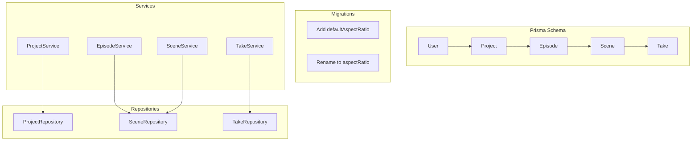

# Core Domain Models

<cite>
**Referenced Files in This Document**
- [schema.prisma](file://packages/backend/prisma/schema.prisma)
- [migration.sql (project default aspect ratio)](file://packages/backend/prisma/migrations/20260420130000_project_default_aspect_ratio/migration.sql)
- [migration.sql (project aspect ratio rename)](file://packages/backend/prisma/migrations/20260420150000_project_aspect_ratio_rename/migration.sql)
- [project-service.ts](file://packages/backend/src/services/project-service.ts)
- [episode-service.ts](file://packages/backend/src/services/episode-service.ts)
- [scene-service.ts](file://packages/backend/src/services/scene-service.ts)
- [take-service.ts](file://packages/backend/src/services/take-service.ts)
- [project-repository.ts](file://packages/backend/src/repositories/project-repository.ts)
- [scene-repository.ts](file://packages/backend/src/repositories/scene-repository.ts)
- [take-repository.ts](file://packages/backend/src/repositories/take-repository.ts)
</cite>

## Table of Contents

1. [Introduction](#introduction)
2. [Project Structure](#project-structure)
3. [Core Components](#core-components)
4. [Architecture Overview](#architecture-overview)
5. [Detailed Component Analysis](#detailed-component-analysis)
6. [Dependency Analysis](#dependency-analysis)
7. [Performance Considerations](#performance-considerations)
8. [Troubleshooting Guide](#troubleshooting-guide)
9. [Conclusion](#conclusion)
10. [Appendices](#appendices)

## Introduction

This document describes the core domain entity model used by the backend, focusing on User, Project, Episode, Scene, and Take. It explains each entity’s fields, data types, constraints, defaults, and business rules, and documents the hierarchical relationships among them. It also covers indexing strategies, cascade behaviors, referential integrity, and practical examples of creating, querying, and linking entities. The goal is to provide a clear, actionable reference for developers and stakeholders.

## Project Structure

The domain model is defined in the Prisma schema and enforced by database migrations. Services and repositories encapsulate business logic and data access patterns for each entity.

**Diagram sources**

- [schema.prisma](file://packages/backend/prisma/schema.prisma)
- [project-service.ts](file://packages/backend/src/services/project-service.ts)
- [episode-service.ts](file://packages/backend/src/services/episode-service.ts)
- [scene-service.ts](file://packages/backend/src/services/scene-service.ts)
- [take-service.ts](file://packages/backend/src/services/take-service.ts)
- [project-repository.ts](file://packages/backend/src/repositories/project-repository.ts)
- [scene-repository.ts](file://packages/backend/src/repositories/scene-repository.ts)
- [take-repository.ts](file://packages/backend/src/repositories/take-repository.ts)
- [migration.sql (project default aspect ratio)](file://packages/backend/prisma/migrations/20260420130000_project_default_aspect_ratio/migration.sql)
- [migration.sql (project aspect ratio rename)](file://packages/backend/prisma/migrations/20260420150000_project_aspect_ratio_rename/migration.sql)

**Section sources**

- [schema.prisma](file://packages/backend/prisma/schema.prisma)
- [project-service.ts](file://packages/backend/src/services/project-service.ts)
- [episode-service.ts](file://packages/backend/src/services/episode-service.ts)
- [scene-service.ts](file://packages/backend/src/services/scene-service.ts)
- [take-service.ts](file://packages/backend/src/services/take-service.ts)
- [project-repository.ts](file://packages/backend/src/repositories/project-repository.ts)
- [scene-repository.ts](file://packages/backend/src/repositories/scene-repository.ts)
- [take-repository.ts](file://packages/backend/src/repositories/take-repository.ts)
- [migration.sql (project default aspect ratio)](file://packages/backend/prisma/migrations/20260420130000_project_default_aspect_ratio/migration.sql)
- [migration.sql (project aspect ratio rename)](file://packages/backend/prisma/migrations/20260420150000_project_aspect_ratio_rename/migration.sql)

## Core Components

This section defines each entity, its fields, types, defaults, and constraints, and explains business rules derived from services and repositories.

- User
  - Purpose: Authentication and ownership of Projects.
  - Fields and constraints:
    - id: String, primary key, generated.
    - email: String, unique.
    - name: String.
    - password: String.
    - apiKey, deepseekApiUrl, atlasApiKey, atlasApiUrl, arkApiKey, arkApiUrl: String?.
    - createdAt, updatedAt: DateTime, auto-managed.
  - Business rules:
    - Uniqueness enforced by database constraint via @unique.
    - Ownership implied by foreign keys on dependent entities.

- Project
  - Purpose: Top-level container for Episodes and associated metadata.
  - Fields and constraints:
    - id: String, primary key, generated.
    - name: String.
    - description, synopsis, storyContext: String?, Text.
    - aspectRatio: String? (defaults to null; normalized to canonical form by service).
    - userId: String (foreign key to User).
    - visualStyle: String[] (array default []).
    - createdAt, updatedAt: DateTime, auto-managed.
  - Indices:
    - Index on userId for fast lookup by owner.
  - Business rules:
    - aspectRatio normalization handled by service; defaults to null in schema.
    - visualStyle defaults to empty array per schema.
    - Cascading deletes: none declared; deletion behavior depends on downstream usage.

- Episode
  - Purpose: Logical grouping of Scenes within a Project.
  - Fields and constraints:
    - id: String, primary key, generated.
    - projectId: String (foreign key to Project).
    - episodeNum: Int (unique with projectId).
    - title, synopsis: String?.
    - script: Json?.
    - createdAt, updatedAt: DateTime, auto-managed.
  - Indices:
    - Unique index on (projectId, episodeNum).
    - Index on projectId.
  - Business rules:
    - Enforces unique episode numbers per project.
    - Cascading delete configured on relation to Project.

- Scene
  - Purpose: A single shot breakdown within an Episode.
  - Fields and constraints:
    - id: String, primary key, generated.
    - episodeId: String (foreign key to Episode).
    - sceneNum: Int (unique with episodeId).
    - locationId: String? (foreign key to Location).
    - timeOfDay: String?.
    - description: String, default "".
    - duration: Int, default 0.
    - aspectRatio: String, default "9:16".
    - visualStyle: String[], default [].
    - seedanceParams: Json?.
    - status: String, default "pending".
    - createdAt, updatedAt: DateTime, auto-managed.
  - Indices:
    - Unique index on (episodeId, sceneNum).
    - Index on episodeId.
    - Index on locationId.
  - Business rules:
    - Defaults for aspectRatio and visualStyle are defined in schema.
    - Status defaults to pending.

- Take
  - Purpose: A candidate video generation task for a Scene.
  - Fields and constraints:
    - id: String, primary key, generated.
    - sceneId: String (foreign key to Scene).
    - model: String.
    - externalTaskId: String?.
    - status: String, default "queued".
    - prompt: String.
    - cost, duration: Float?, Int?.
    - videoUrl, thumbnailUrl: String?.
    - errorMsg: String?.
    - isSelected: Boolean, default false.
    - createdAt, updatedAt: DateTime, auto-managed.
  - Indices:
    - Index on sceneId.
    - Index on externalTaskId.
  - Business rules:
    - Defaults for status and selection are defined in schema.
    - Cascading delete configured on relation to Scene.

Notes on defaults and normalization:

- Project.visualStyle defaults to an empty array in schema.
- Scene.aspectRatio defaults to "9:16" in schema.
- Scene.status defaults to "pending" in schema.
- Take.status defaults to "queued" in schema.
- Project.aspectRatio column was introduced and later renamed via migrations; service normalizes values.

**Section sources**

- [schema.prisma](file://packages/backend/prisma/schema.prisma)
- [project-service.ts](file://packages/backend/src/services/project-service.ts)
- [episode-service.ts](file://packages/backend/src/services/episode-service.ts)
- [scene-service.ts](file://packages/backend/src/services/scene-service.ts)
- [take-service.ts](file://packages/backend/src/services/take-service.ts)
- [migration.sql (project default aspect ratio)](file://packages/backend/prisma/migrations/20260420130000_project_default_aspect_ratio/migration.sql)
- [migration.sql (project aspect ratio rename)](file://packages/backend/prisma/migrations/20260420150000_project_aspect_ratio_rename/migration.sql)

## Architecture Overview

The domain follows a strict hierarchy: User → Project → Episode → Scene → Take. Relations are modeled with explicit foreign keys and optional cascades. Services orchestrate creation and updates, while repositories encapsulate queries and mutations.

```mermaid
classDiagram
class User {
+String id
+String email
+String name
+String password
+String? apiKey
+String? deepseekApiUrl
+String? atlasApiKey
+String? atlasApiUrl
+String? arkApiKey
+String? arkApiUrl
+DateTime createdAt
+DateTime updatedAt
}
class Project {
+String id
+String name
+String? description
+String? synopsis
+String? storyContext
+String? aspectRatio
+String userId
+String[] visualStyle
+DateTime createdAt
+DateTime updatedAt
}
class Episode {
+String id
+String projectId
+Int episodeNum
+String? title
+String? synopsis
+Json? script
+DateTime createdAt
+DateTime updatedAt
}
class Scene {
+String id
+String episodeId
+Int sceneNum
+String? locationId
+String? timeOfDay
+String description
+Int duration
+String aspectRatio
+String[] visualStyle
+Json? seedanceParams
+String status
+DateTime createdAt
+DateTime updatedAt
}
class Take {
+String id
+String sceneId
+String model
+String? externalTaskId
+String status
+String prompt
+Float? cost
+Int? duration
+String? videoUrl
+String? thumbnailUrl
+String? errorMsg
+Boolean isSelected
+DateTime createdAt
+DateTime updatedAt
}
User "1" --> "many" Project : "owns"
Project "1" --> "many" Episode : "contains"
Episode "1" --> "many" Scene : "contains"
Scene "1" --> "many" Take : "generates"
```

**Diagram sources**

- [schema.prisma](file://packages/backend/prisma/schema.prisma)

## Detailed Component Analysis

### User

- Identity and authentication:
  - email is unique; used as the primary identity.
  - password stored as hashed value; sensitive fields excluded from public APIs.
- Ownership:
  - Projects owned by a User via userId foreign key.
- Lifecycle:
  - createdAt/updatedAt managed automatically.

Constraints and defaults:

- @unique on email.
- No array defaults; optional API keys for third-party integrations.

Practical usage:

- Create: via authentication flows; associate Projects by setting userId.
- Query: filter Projects by userId for list and detail views.

**Section sources**

- [schema.prisma](file://packages/backend/prisma/schema.prisma)

### Project

- Purpose:
  - Container for Episodes and metadata; carries default aspectRatio and visualStyle.
- Defaults and normalization:
  - visualStyle defaults to [].
  - aspectRatio defaults to null; service normalizes incoming values to canonical forms.
- Indices:
  - Index on userId for efficient owner queries.

Business rules:

- aspectRatio normalization occurs in ProjectService.create/update.
- Deleting a Project requires handling dependent entities (e.g., Episodes) outside the schema cascade.

Practical usage:

- Create: ProjectService.createProject(userId, { name, description?, aspectRatio? }).
- Update: ProjectService.updateProject(userId, projectId, { name?, description?, synopsis?, visualStyle?, aspectRatio? }).
- Query: ProjectRepository.findManyByUserForList(userId); ProjectRepository.findFirstOwnedFullDetail(projectId, userId).

**Section sources**

- [schema.prisma](file://packages/backend/prisma/schema.prisma)
- [project-service.ts](file://packages/backend/src/services/project-service.ts)
- [project-repository.ts](file://packages/backend/src/repositories/project-repository.ts)
- [migration.sql (project default aspect ratio)](file://packages/backend/prisma/migrations/20260420130000_project_default_aspect_ratio/migration.sql)
- [migration.sql (project aspect ratio rename)](file://packages/backend/prisma/migrations/20260420150000_project_aspect_ratio_rename/migration.sql)

### Episode

- Purpose:
  - Groups Scenes within a Project; maintains episodeNum uniqueness per project.
- Indices:
  - Unique index on (projectId, episodeNum).
  - Index on projectId.

Business rules:

- Cascading delete configured on relation to Project.
- episodeNum must be unique within a Project.

Practical usage:

- Create: EpisodeService.createEpisode(projectId, episodeNum, title?).
- Update: EpisodeService.updateEpisode(episodeId, { title?, synopsis?, script? }).
- Query: EpisodeService.listByProject(projectId); EpisodeService.getEpisodeDetail(episodeId).

**Section sources**

- [schema.prisma](file://packages/backend/prisma/schema.prisma)
- [episode-service.ts](file://packages/backend/src/services/episode-service.ts)

### Scene

- Purpose:
  - Breakdown unit within an Episode; holds shot-level details and Take candidates.
- Defaults:
  - aspectRatio default "9:16".
  - visualStyle default [].
  - status default "pending".
- Indices:
  - Unique index on (episodeId, sceneNum).
  - Index on episodeId.
  - Index on locationId.

Business rules:

- Cascading delete configured on relation to Episode.
- Scene creation inherits Project’s aspectRatio when generating default values.

Practical usage:

- Create: SceneService.createSceneWithFirstShot(episodeId, sceneNum, prompt, description?).
- Update: SceneService.updateScene(sceneId, { description?, sceneNum?, prompt? }).
- Query: SceneRepository.findManyByEpisodeWithTakes(episodeId); SceneRepository.findUniqueWithTakesAndShots(sceneId).

**Section sources**

- [schema.prisma](file://packages/backend/prisma/schema.prisma)
- [scene-service.ts](file://packages/backend/src/services/scene-service.ts)
- [scene-repository.ts](file://packages/backend/src/repositories/scene-repository.ts)

### Take

- Purpose:
  - Candidate video generation task; linked to a Scene.
- Defaults:
  - status default "queued".
  - isSelected default false.
- Indices:
  - Index on sceneId.
  - Index on externalTaskId.

Business rules:

- Cascading delete configured on relation to Scene.
- Selection logic ensures only one Take per Scene is marked as selected.

Practical usage:

- Create: SceneService.enqueueVideoGenerate(sceneId, { model, referenceImage?, imageUrls?, duration? }) creates a Take and enqueues generation.
- Select: TakeService.selectTakeAsCurrent(takeId) clears previous selection and selects the given Take.

**Section sources**

- [schema.prisma](file://packages/backend/prisma/schema.prisma)
- [scene-service.ts](file://packages/backend/src/services/scene-service.ts)
- [take-service.ts](file://packages/backend/src/services/take-service.ts)
- [take-repository.ts](file://packages/backend/src/repositories/take-repository.ts)

## Dependency Analysis

This section maps the relationships among entities and highlights cascade behaviors and referential integrity.

```mermaid
erDiagram
USER {
string id PK
string email UK
string name
string password
string apiKey
string deepseekApiUrl
string atlasApiKey
string atlasApiUrl
string arkApiKey
string arkApiUrl
timestamp createdAt
timestamp updatedAt
}
PROJECT {
string id PK
string name
string description
string synopsis
text storyContext
string aspectRatio
string userId FK
string[] visualStyle
timestamp createdAt
timestamp updatedAt
}
EPISODE {
string id PK
string projectId FK
int episodeNum
string title
string synopsis
json script
timestamp createdAt
timestamp updatedAt
}
SCENE {
string id PK
string episodeId FK
int sceneNum
string locationId
string timeOfDay
string description
int duration
string aspectRatio
string[] visualStyle
json seedanceParams
string status
timestamp createdAt
timestamp updatedAt
}
TAKE {
string id PK
string sceneId FK
string model
string externalTaskId
string status
string prompt
float cost
int duration
string videoUrl
string thumbnailUrl
string errorMsg
boolean isSelected
timestamp createdAt
timestamp updatedAt
}
USER ||--o{ PROJECT : "owns"
PROJECT ||--o{ EPISODE : "contains"
EPISODE ||--o{ SCENE : "contains"
SCENE ||--o{ TAKE : "generates"
```

**Diagram sources**

- [schema.prisma](file://packages/backend/prisma/schema.prisma)

Cascade behaviors observed in schema:

- Episode: onDelete: Cascade (deleting a Project deletes Episodes).
- Scene: onDelete: Cascade (deleting an Episode deletes Scenes).
- Take: onDelete: Cascade (deleting a Scene deletes Takes).
- ModelApiCall: onDelete: Cascade (deleting a User deletes ModelApiCalls).
- ModelApiCall.takeId: onDelete: SetNull (deleting a Take sets foreign key to null).

Referential integrity:

- Foreign keys enforce referential integrity at the database level.
- Unique constraints ensure:
  - (projectId, episodeNum) is unique for Episode.
  - (episodeId, sceneNum) is unique for Scene.
  - (jobId, step) is unique for PipelineStepResult.
  - (projectId, name) is unique for Location.
  - (projectId, episodeNum) is unique for MemorySnapshot.

**Section sources**

- [schema.prisma](file://packages/backend/prisma/schema.prisma)

## Performance Considerations

Indexing and query patterns:

- Project
  - Index on userId for owner-scoped queries.
  - Typical queries: list by user, detail by id, update by id.
- Episode
  - Unique index on (projectId, episodeNum) prevents duplicates and supports fast lookup by project+episode.
  - Index on projectId for listing episodes per project.
- Scene
  - Unique index on (episodeId, sceneNum) for fast scene lookup by episode.
  - Index on episodeId for listing scenes per episode.
  - Index on locationId for filtering scenes by location.
- Take
  - Index on sceneId for listing and updating tasks per scene.
  - Index on externalTaskId for correlating external jobs.

Recommendations:

- Use selective projections (select/include) to avoid loading unnecessary relations.
- Batch operations where possible (e.g., batch enqueue video generation).
- Monitor slow queries using indices and adjust projections accordingly.

**Section sources**

- [schema.prisma](file://packages/backend/prisma/schema.prisma)
- [project-repository.ts](file://packages/backend/src/repositories/project-repository.ts)
- [scene-repository.ts](file://packages/backend/src/repositories/scene-repository.ts)
- [take-repository.ts](file://packages/backend/src/repositories/take-repository.ts)

## Troubleshooting Guide

Common issues and resolutions:

- Unique constraint violations
  - Episode: Ensure (projectId, episodeNum) is unique before insert/update.
  - Scene: Ensure (episodeId, sceneNum) is unique.
  - Location: Ensure (projectId, name) is unique.
  - MemorySnapshot: Ensure (projectId, upToEpisode) is unique.
- Missing required fields
  - Project.visualStyle must be an array; ensure validation passes before update.
  - Project.aspectRatio must be a string; service normalizes it; ensure input is valid.
- Cascading deletes
  - Deleting a Project removes Episodes; deleting an Episode removes Scenes; deleting a Scene removes Takes.
  - If you need to preserve child records, remove the cascade or handle deletions explicitly.
- Task selection
  - Only one Take per Scene can be selected; use TakeService.selectTakeAsCurrent to manage selection.

Validation and error handling:

- ProjectService.updateProject validates types and returns structured errors.
- SceneService.enqueueVideoGenerate checks for prompt availability and returns reasons for failure.
- TakeService.selectTakeAsCurrent returns not_found if the Take does not exist.

**Section sources**

- [schema.prisma](file://packages/backend/prisma/schema.prisma)
- [project-service.ts](file://packages/backend/src/services/project-service.ts)
- [scene-service.ts](file://packages/backend/src/services/scene-service.ts)
- [take-service.ts](file://packages/backend/src/services/take-service.ts)

## Conclusion

The core domain model establishes a clear hierarchy and strong referential integrity. Defaults and normalization rules ensure consistent behavior across entities. Services encapsulate business logic and validations, while repositories provide efficient data access patterns. Proper indexing and careful cascade configuration support performance and data integrity.

## Appendices

### Practical Examples

- Create a Project
  - Steps:
    - Call ProjectService.createProject(userId, { name, description?, aspectRatio? }).
    - The service normalizes aspectRatio and persists the record.
  - Validation:
    - visualStyle must be an array; aspectRatio must be a string.

- Create an Episode
  - Steps:
    - Call EpisodeService.createEpisode(projectId, episodeNum, title?).
  - Constraints:
    - episodeNum must be unique within the Project.

- Create a Scene
  - Steps:
    - Call SceneService.createSceneWithFirstShot(episodeId, sceneNum, prompt, description?).
  - Defaults:
    - aspectRatio defaults to Project.aspectRatio or "9:16".
    - visualStyle defaults to [].
    - status defaults to "pending".

- Create a Take
  - Steps:
    - Call SceneService.enqueueVideoGenerate(sceneId, { model, referenceImage?, imageUrls?, duration? }).
  - Defaults:
    - status defaults to "queued".
    - isSelected defaults to false.

- Query Scenes with Tasks
  - Steps:
    - Use SceneRepository.findManyByEpisodeWithTakes(episodeId) to fetch scenes ordered by sceneNum and latest tasks.

- Select a Take as Current
  - Steps:
    - Use TakeService.selectTakeAsCurrent(takeId) to clear previous selections and mark the chosen Take as selected.

**Section sources**

- [project-service.ts](file://packages/backend/src/services/project-service.ts)
- [episode-service.ts](file://packages/backend/src/services/episode-service.ts)
- [scene-service.ts](file://packages/backend/src/services/scene-service.ts)
- [take-service.ts](file://packages/backend/src/services/take-service.ts)
- [scene-repository.ts](file://packages/backend/src/repositories/scene-repository.ts)
- [take-repository.ts](file://packages/backend/src/repositories/take-repository.ts)
