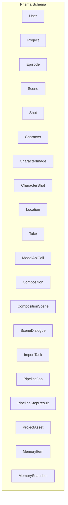
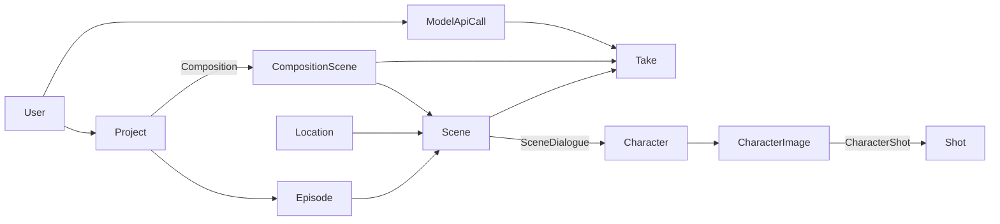
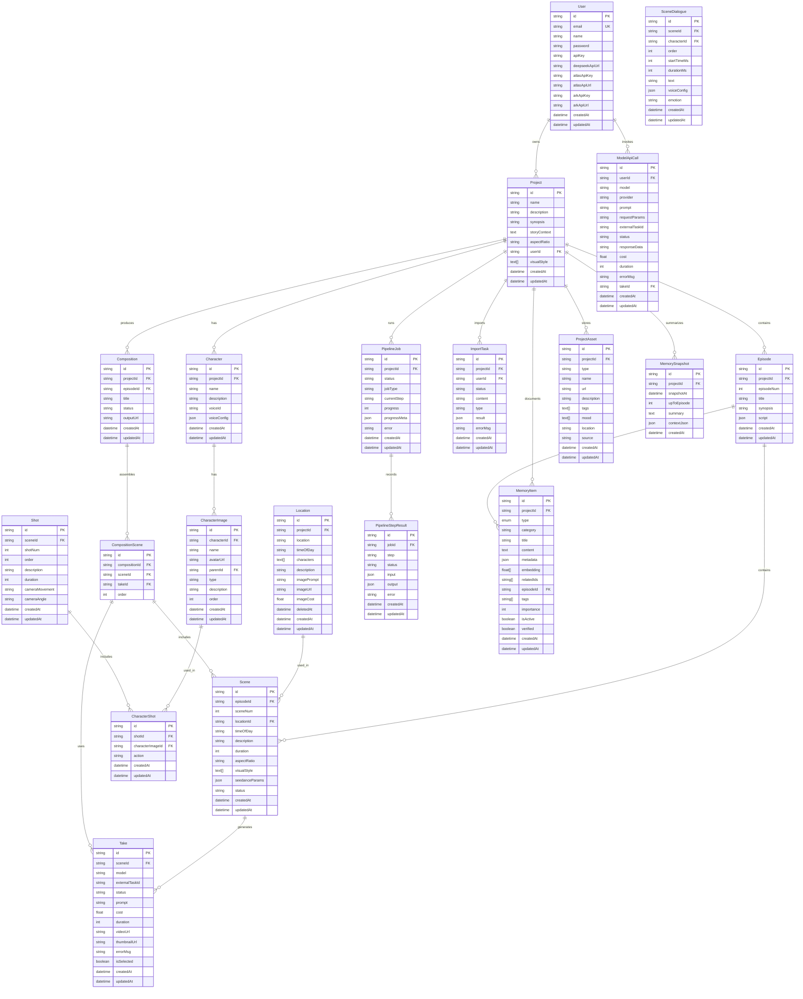
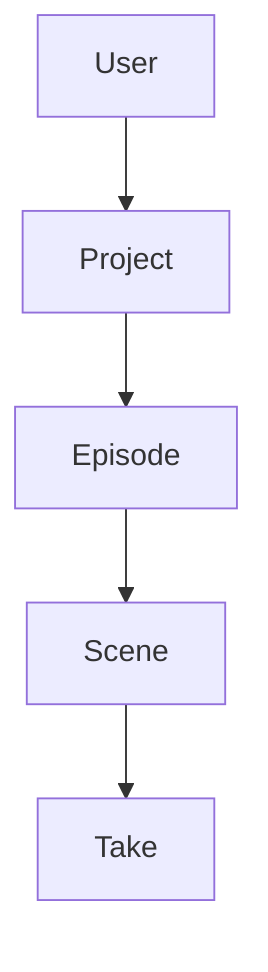
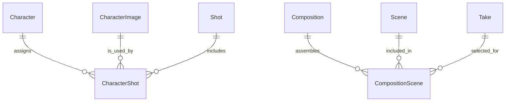
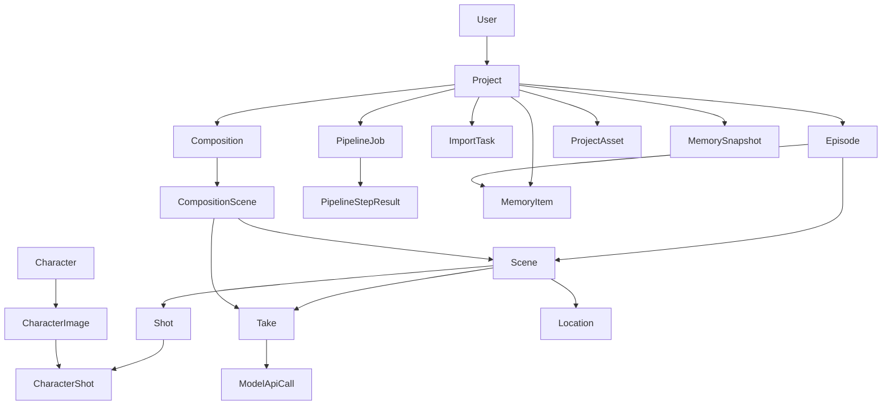

# Entity Models and Relationships

<cite>
**Referenced Files in This Document**
- [schema.prisma](file://packages/backend/prisma/schema.prisma)
- [migration baseline](file://packages/backend/prisma/migrations/20260416120000_baseline_schema/migration.sql)
- [DREAMER_DATA_MODEL.md](file://docs/DREAMER_DATA_MODEL.md)
</cite>

## Table of Contents

1. [Introduction](#introduction)
2. [Project Structure](#project-structure)
3. [Core Components](#core-components)
4. [Architecture Overview](#architecture-overview)
5. [Detailed Component Analysis](#detailed-component-analysis)
6. [Dependency Analysis](#dependency-analysis)
7. [Performance Considerations](#performance-considerations)
8. [Troubleshooting Guide](#troubleshooting-guide)
9. [Conclusion](#conclusion)

## Introduction

This document provides a comprehensive entity model reference for the Prisma schema used by the backend service. It documents all entities, their fields, data types, constraints, unique indexes, and foreign key relationships. It also explains the hierarchical structure from User → Project → Episode → Scene → Take, and details many-to-many relationships such as Character ↔ Shot via CharacterShot, and Composition ↔ Scene via CompositionScene. Business logic and referential integrity rules are explained alongside entity relationship diagrams.

## Project Structure

The data model is defined centrally in the Prisma schema and mirrored in the initial migration. The authoritative source for entity definitions and relations is the Prisma schema file. Supporting documentation clarifies business semantics.

**Diagram sources**

- [schema.prisma:10-430](file://packages/backend/prisma/schema.prisma#L10-L430)

**Section sources**

- [schema.prisma:1-430](file://packages/backend/prisma/schema.prisma#L1-L430)
- [migration baseline:1-471](file://packages/backend/prisma/migrations/20260416120000_baseline_schema/migration.sql#L1-L471)

## Core Components

This section enumerates each entity with its fields, data types, constraints, unique indexes, and foreign keys. Cardinalities and cascade behaviors are derived from relation directives and foreign key constraints.

- User
  - Fields: id (String, @id, cuid), email (String, @unique), name (String), password (String), apiKey (String?), deepseekApiUrl (String?), atlasApiKey (String?), atlasApiUrl (String?), arkApiKey (String?), arkApiUrl (String?), createdAt (DateTime, @default(now)), updatedAt (DateTime, @updatedAt)
  - Unique indexes: email
  - Relationships: 1.._ projects, 1.._ apiCalls
  - Notes: User is the top-level owner of Projects.

- Project
  - Fields: id (String, @id, cuid), name (String), description (String?), synopsis (String?), storyContext (String?, @db.Text), aspectRatio (String?), userId (String), visualStyle (String[], @default([])), createdAt (DateTime, @default(now)), updatedAt (DateTime, @updatedAt)
  - Unique indexes: none
  - Indexes: userId
  - Relationships: belongs to 1 User (userId), 1.._ episodes, 1.._ characters, 1.._ locations, 1.._ compositions, 1.._ importTasks, 1.._ pipelineJobs, 1.._ assets, 1.._ memories, 1..\* memorySnapshots
  - Cascade: Project → Episode/Character/Location/Composition/ImportTask/PipelineJob/ProjectAsset/MemoryItem/MemorySnapshot: onDelete: Cascade
  - Notes: Project holds per-project metadata and references to higher-level entities.

- Episode
  - Fields: id (String, @id, cuid), projectId (String), project (Project, @relation), episodeNum (Int), title (String?), synopsis (String?), script (Json?), createdAt (DateTime, @default(now)), updatedAt (DateTime, @updatedAt)
  - Unique indexes: (projectId, episodeNum)
  - Indexes: projectId
  - Relationships: belongs to 1 Project (projectId), 1.._ scenes, 1.._ compositions, 1..\* memories
  - Cascade: Episode → Scene/Composition/Memory: onDelete: Cascade
  - Notes: Episodes group Scenes and can produce Compositions.

- Character
  - Fields: id (String, @id, cuid), projectId (String), project (Project, @relation), name (String), description (String?), voiceId (String?), voiceConfig (Json?), createdAt (DateTime, @default(now)), updatedAt (DateTime, @updatedAt)
  - Unique indexes: (projectId, name)
  - Indexes: projectId
  - Relationships: belongs to 1 Project (projectId), 1.._ images, many.._ dialogues (via SceneDialogue)
  - Cascade: Character → CharacterImage/SceneDialogue: onDelete: Cascade
  - Notes: Characters belong to a Project and can have multiple images (versions).

- CharacterImage
  - Fields: id (String, @id, cuid), characterId (String), character (Character, @relation), name (String), prompt (String?), avatarUrl (String?), imageCost (Float?), parentId (String?), type (String, @default("base")), description (String?), order (Int, @default(0)), createdAt (DateTime, @default(now)), updatedAt (DateTime, @updatedAt)
  - Indexes: characterId, parentId
  - Relationships: belongs to 1 Character (characterId), optional 1.._ children (self-referencing), 1.._ characterShots, optional 1..\* parent
  - Cascade: CharacterImage → CharacterShot: onDelete: Cascade; self-parent: onDelete: SET NULL
  - Notes: Hierarchical images (e.g., base, variants) linked to Characters.

- Scene
  - Fields: id (String, @id, cuid), episodeId (String), episode (Episode, @relation), sceneNum (Int), locationId (String?), location (Location?, @relation), timeOfDay (String?), description (String, @default("")), duration (Int, @default(0)), aspectRatio (String, @default("9:16")), visualStyle (String[], @default([])), seedanceParams (Json?), status (String, @default("pending")), createdAt (DateTime, @default(now)), updatedAt (DateTime, @updatedAt)
  - Unique indexes: (episodeId, sceneNum)
  - Indexes: episodeId, locationId
  - Relationships: belongs to 1 Episode (episodeId), optional 1 Location (locationId), 1.._ shots, 1.._ dialogues, 1.._ takes, 1.._ compositionUsages (CompositionScene)
  - Cascade: Scene → Shot/SceneDialogue/Take/CompositionScene: onDelete: Cascade; Scene → Location: onDelete: SET NULL
  - Notes: Scene is the unit for video generation; Takes are attached to Scenes.

- Shot
  - Fields: id (String, @id, cuid), sceneId (String), scene (Scene, @relation), shotNum (Int), order (Int), description (String), duration (Int, @default(0)), cameraMovement (String?), cameraAngle (String?), createdAt (DateTime, @default(now)), updatedAt (DateTime, @updatedAt)
  - Indexes: sceneId
  - Relationships: belongs to 1 Scene (sceneId), many..\* characterShots
  - Cascade: Shot → CharacterShot: onDelete: Cascade
  - Notes: Shots describe camera framing and editing units within a Scene; they do not directly own Takes.

- CharacterShot
  - Fields: id (String, @id, cuid), shotId (String), shot (Shot, @relation), characterImageId (String), characterImage (CharacterImage, @relation), action (String?), createdAt (DateTime, @default(now)), updatedAt (DateTime, @updatedAt)
  - Unique indexes: (shotId, characterImageId)
  - Indexes: shotId, characterImageId
  - Relationships: belongs to 1 Shot (shotId), belongs to 1 CharacterImage (characterImageId)
  - Cascade: CharacterShot → Shot: onDelete: Cascade; CharacterShot → CharacterImage: onDelete: RESTRICT
  - Notes: Many-to-many bridge between Shots and CharacterImages; restricts deletion of referenced CharacterImage.

- Location
  - Fields: id (String, @id, cuid), projectId (String), project (Project, @relation), name (String @map("location")), timeOfDay (String?), characters (String[], @default([])), description (String?), imagePrompt (String?), imageUrl (String?), imageCost (Float?), deletedAt (DateTime?), createdAt (DateTime, @default(now)), updatedAt (DateTime, @updatedAt)
  - Unique indexes: (projectId, name)
  - Indexes: projectId, (projectId, deletedAt)
  - Relationships: belongs to 1 Project (projectId), many..\* scenes
  - Cascade: Location → Scene: onDelete: SET NULL
  - Notes: Locations are soft-deleted via deletedAt; scenes reference locations.

- Take
  - Fields: id (String, @id, cuid), sceneId (String), scene (Scene, @relation), model (String), externalTaskId (String?), status (String, @default("queued")), prompt (String), cost (Float?), duration (Int?), videoUrl (String?), thumbnailUrl (String?), errorMsg (String?), isSelected (Boolean, @default(false)), createdAt (DateTime, @default(now)), updatedAt (DateTime, @updatedAt)
  - Indexes: sceneId, externalTaskId
  - Relationships: belongs to 1 Scene (sceneId), 1.._ apiCalls (ModelApiCall), many.._ compositionUsages (CompositionScene)
  - Cascade: Take → ModelApiCall: onDelete: SET NULL; Take → CompositionScene: onDelete: CASCADE
  - Notes: Takes represent generated videos for a Scene; selected Take is used for composition.

- ModelApiCall
  - Fields: id (String, @id, cuid), userId (String), user (User, @relation), model (String), provider (String), prompt (String), requestParams (String?), externalTaskId (String?), status (String, @default("pending")), responseData (String?), cost (Float?), duration (Int?), errorMsg (String?), takeId (String?), take (Take?, @relation), createdAt (DateTime, @default(now)), updatedAt (DateTime, @updatedAt)
  - Indexes: userId, externalTaskId, model, createdAt
  - Relationships: belongs to 1 User (userId), optional 1 Take (takeId)
  - Cascade: ModelApiCall → User: onDelete: CASCADE; ModelApiCall → Take: onDelete: SET NULL
  - Notes: Tracks external model invocations tied to Users and optional Takes.

- Composition
  - Fields: id (String, @id, cuid), projectId (String), project (Project, @relation), episodeId (String), episode (Episode, @relation), title (String), status (String, @default("draft")), outputUrl (String?), createdAt (DateTime, @default(now)), updatedAt (DateTime, @updatedAt)
  - Indexes: projectId, episodeId
  - Relationships: belongs to 1 Project (projectId), belongs to 1 Episode (episodeId), many..\* scenes (CompositionScene)
  - Cascade: Composition → CompositionScene: onDelete: CASCADE
  - Notes: Compositions assemble Scenes into final outputs.

- CompositionScene
  - Fields: id (String, @id, cuid), compositionId (String), composition (Composition, @relation), sceneId (String), scene (Scene, @relation), takeId (String), take (Take, @relation), order (Int)
  - Indexes: compositionId, sceneId, takeId
  - Relationships: belongs to 1 Composition (compositionId), belongs to 1 Scene (sceneId), belongs to 1 Take (takeId)
  - Cascade: CompositionScene → Composition/Scene/Take: onDelete: CASCADE
  - Notes: Links a Scene and Take into a Composition in a specific order.

- SceneDialogue
  - Fields: id (String, @id, cuid), sceneId (String), scene (Scene, @relation), characterId (String), character (Character, @relation), order (Int), startTimeMs (Int), durationMs (Int), text (String), voiceConfig (Json), emotion (String?), createdAt (DateTime, @default(now)), updatedAt (DateTime, @updatedAt)
  - Indexes: sceneId, characterId
  - Relationships: belongs to 1 Scene (sceneId), belongs to 1 Character (characterId)
  - Cascade: SceneDialogue → Scene: onDelete: CASCADE; SceneDialogue → Character: onDelete: RESTRICT
  - Notes: Represents spoken dialogue within a Scene.

- ImportTask
  - Fields: id (String, @id, cuid), projectId (String?), project (Project?, @relation), userId (String), status (String, @default("pending")), content (String), type (String, @default("markdown")), result (Json?), errorMsg (String?), createdAt (DateTime, @default(now)), updatedAt (DateTime, @updatedAt)
  - Indexes: userId
  - Relationships: optional 1 Project (projectId), belongs to 1 User (userId)
  - Cascade: ImportTask → Project: onDelete: SET NULL
  - Notes: Imports content into a Project or globally under a User.

- PipelineJob
  - Fields: id (String, @id, cuid), projectId (String), project (Project, @relation), status (String, @default("pending")), jobType (String, @default("full-pipeline")), currentStep (String, @default("script-writing")), progress (Int, @default(0)), progressMeta (Json?), error (String?), createdAt (DateTime, @default(now)), updatedAt (DateTime, @updatedAt)
  - Indexes: projectId
  - Relationships: belongs to 1 Project (projectId), many..\* stepResults
  - Cascade: PipelineJob → PipelineStepResult: onDelete: CASCADE
  - Notes: Orchestrates multi-step generation pipelines.

- PipelineStepResult
  - Fields: id (String, @id, cuid), jobId (String), job (PipelineJob, @relation), step (String), status (String, @default("pending")), input (Json?), output (Json?), error (String?), createdAt (DateTime, @default(now)), updatedAt (DateTime, @updatedAt)
  - Unique indexes: (jobId, step)
  - Indexes: jobId
  - Relationships: belongs to 1 PipelineJob (jobId)
  - Cascade: PipelineStepResult → PipelineJob: onDelete: CASCADE
  - Notes: Stores per-step results and state.

- ProjectAsset
  - Fields: id (String, @id, cuid), projectId (String), project (Project, @relation), type (String), name (String), url (String), description (String?), tags (String[]), mood (String[]), location (String?), source (String?), createdAt (DateTime, @default(now)), updatedAt (DateTime, @updatedAt)
  - Indexes: projectId
  - Relationships: belongs to 1 Project (projectId)
  - Cascade: ProjectAsset → Project: onDelete: CASCADE
  - Notes: Assets associated with a Project.

- MemoryItem
  - Fields: id (String, @id, cuid), projectId (String), project (Project, @relation), type (MemoryType), category (String?), title (String), content (String, @db.Text), metadata (Json?), embedding (Float[], @default([])), relatedIds (String[], @default([])), episodeId (String?), episode (Episode?, @relation), tags (String[], @default([])), importance (Int, @default(3)), isActive (Boolean, @default(true)), verified (Boolean, @default(false)), createdAt (DateTime, @default(now)), updatedAt (DateTime, @updatedAt)
  - Indexes: projectId, type, isActive, importance, episodeId
  - Relationships: belongs to 1 Project (projectId), optional 1 Episode (episodeId)
  - Cascade: MemoryItem → Episode: onDelete: SET NULL
  - Notes: Narrative/memory records with categorization and embeddings.

- MemorySnapshot
  - Fields: id (String, @id, cuid), projectId (String), project (Project, @relation), snapshotAt (DateTime, @default(now)), upToEpisode (Int), summary (String, @db.Text), contextJson (Json), createdAt (DateTime, @default(now))
  - Unique indexes: (projectId, upToEpisode)
  - Indexes: projectId
  - Relationships: belongs to 1 Project (projectId)
  - Cascade: none
  - Notes: Historical summaries of project memory up to a given episode.

**Section sources**

- [schema.prisma:10-430](file://packages/backend/prisma/schema.prisma#L10-L430)
- [migration baseline:292-471](file://packages/backend/prisma/migrations/20260416120000_baseline_schema/migration.sql#L292-L471)
- [DREAMER_DATA_MODEL.md:9-28](file://docs/DREAMER_DATA_MODEL.md#L9-L28)

## Architecture Overview

The data model follows a strict hierarchy: User → Project → Episode → Scene → Take. Many-to-many relationships are bridged by explicit join tables. Referential integrity is enforced via foreign keys with explicit cascade behaviors.

**Diagram sources**

- [schema.prisma:10-430](file://packages/backend/prisma/schema.prisma#L10-L430)
- [migration baseline:397-471](file://packages/backend/prisma/migrations/20260416120000_baseline_schema/migration.sql#L397-L471)

## Detailed Component Analysis

### Entity Relationship Diagram (ERD)

This ERD consolidates all entities and relationships, highlighting primary keys, unique constraints, and foreign keys.

**Diagram sources**

- [schema.prisma:10-430](file://packages/backend/prisma/schema.prisma#L10-L430)
- [migration baseline:292-471](file://packages/backend/prisma/migrations/20260416120000_baseline_schema/migration.sql#L292-L471)

### Hierarchy: User → Project → Episode → Scene → Take

- User creates Projects.
- Projects contain Episodes.
- Episodes contain Scenes.
- Scenes contain Takes (generated videos).
- Cascading deletes propagate down the chain to maintain referential integrity.

**Diagram sources**

- [schema.prisma:10-430](file://packages/backend/prisma/schema.prisma#L10-L430)
- [migration baseline:397-471](file://packages/backend/prisma/migrations/20260416120000_baseline_schema/migration.sql#L397-L471)

### Many-to-Many Relationships

- Character ↔ Shot via CharacterShot
  - Bridge entity: CharacterShot
  - Constraints: unique (shotId, characterImageId); indexes on both sides; cascade on Shot; restrict on CharacterImage
- Composition ↔ Scene via CompositionScene
  - Bridge entity: CompositionScene
  - Constraints: indexes on compositionId, sceneId, takeId; cascade on all three

**Diagram sources**

- [schema.prisma:160-296](file://packages/backend/prisma/schema.prisma#L160-L296)
- [migration baseline:118-225](file://packages/backend/prisma/migrations/20260416120000_baseline_schema/migration.sql#L118-L225)

### Business Logic Behind Relationships

- Scene is the video generation unit; Shot describes camera framing within a Scene; Take is the generated clip for a Scene.
- CompositionScene links a Scene and Take into a Composition in order; Composition aggregates Scenes into a final output.
- SceneDialogue connects Characters to Scenes for synchronized audio and subtitles.
- Location is optional and can be soft-deleted; deletion sets foreign keys to NULL to preserve history.
- ModelApiCall optionally references a Take to track costs and durations per generated asset.

**Section sources**

- [DREAMER_DATA_MODEL.md:9-28](file://docs/DREAMER_DATA_MODEL.md#L9-L28)
- [schema.prisma:115-238](file://packages/backend/prisma/schema.prisma#L115-L238)

## Dependency Analysis

This section maps direct dependencies among entities and highlights potential circular dependencies (none observed).

**Diagram sources**

- [schema.prisma:10-430](file://packages/backend/prisma/schema.prisma#L10-L430)
- [migration baseline:397-471](file://packages/backend/prisma/migrations/20260416120000_baseline_schema/migration.sql#L397-L471)

**Section sources**

- [schema.prisma:10-430](file://packages/backend/prisma/schema.prisma#L10-L430)
- [migration baseline:397-471](file://packages/backend/prisma/migrations/20260416120000_baseline_schema/migration.sql#L397-L471)

## Performance Considerations

- Indexes are strategically placed on foreign keys and frequently queried columns (e.g., userId, projectId, episodeId, sceneId, externalTaskId) to optimize joins and lookups.
- Composite unique indexes prevent duplicates for business-critical combinations (e.g., (projectId, episodeNum), (projectId, name), (jobId, step)).
- JSON fields are used for flexible data structures; consider selective indexing or materialized views if querying JSON becomes frequent.
- Cascade deletes simplify cleanup but can trigger cascades across multiple rows; batch operations should be considered for bulk deletions.

[No sources needed since this section provides general guidance]

## Troubleshooting Guide

Common issues and resolutions grounded in schema constraints and cascade behaviors:

- Deleting a Project deletes Episodes, Scenes, Takes, Characters, Locations, Compositions, ImportTasks, PipelineJobs, and related records due to CASCADE.
- Deleting a Location sets Scene.locationId to NULL (SET NULL), preserving Scene records while removing the location association.
- Deleting a CharacterImage may fail if referenced by CharacterShot (RESTRICT), ensuring referential integrity.
- Deleting a Take may orphan ModelApiCall entries (SET NULL) if they reference the Take, allowing cleanup without breaking the call record.
- Unique constraints prevent duplicate entries (e.g., (projectId, name) for Character, (episodeId, sceneNum) for Scene).

**Section sources**

- [schema.prisma:55-238](file://packages/backend/prisma/schema.prisma#L55-L238)
- [migration baseline:397-471](file://packages/backend/prisma/migrations/20260416120000_baseline_schema/migration.sql#L397-L471)

## Conclusion

The Prisma schema defines a robust, hierarchical data model centered on Scenes and Takes, with explicit many-to-many bridges for Characters and Compositions. Foreign keys and cascade behaviors ensure referential integrity across the model. The accompanying documentation clarifies business semantics and prompt composition rules. This entity model supports the end-to-end workflow from project creation to video composition.
