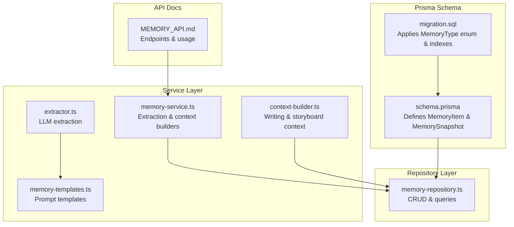
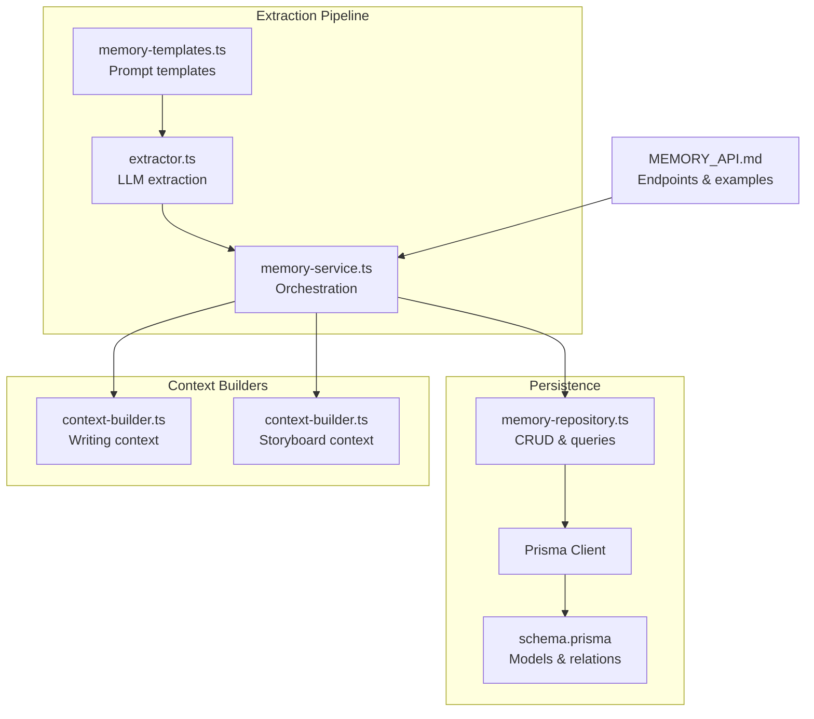
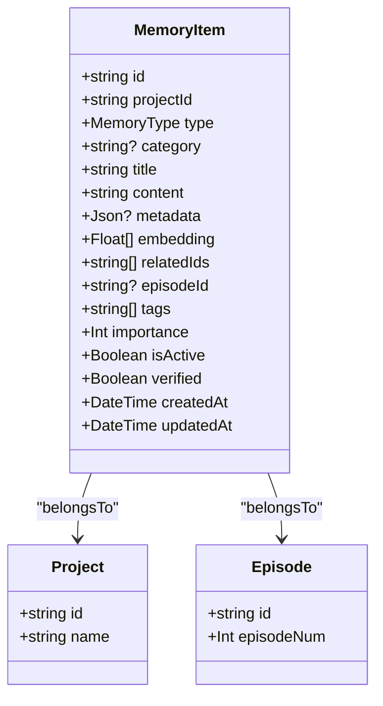
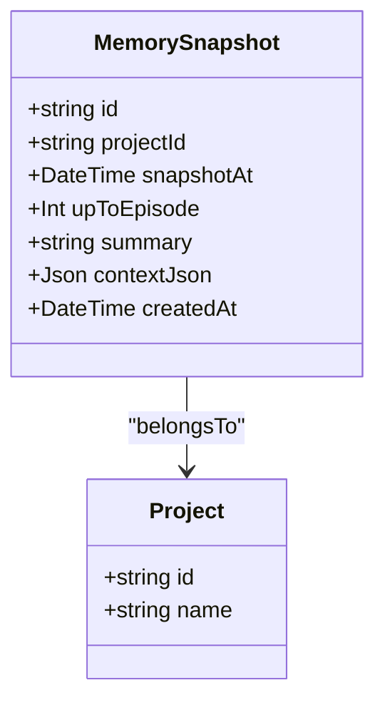
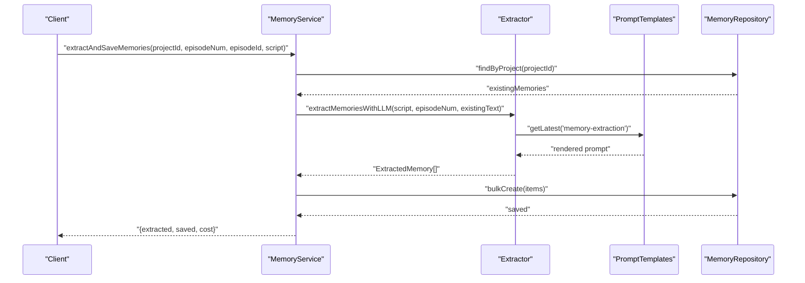
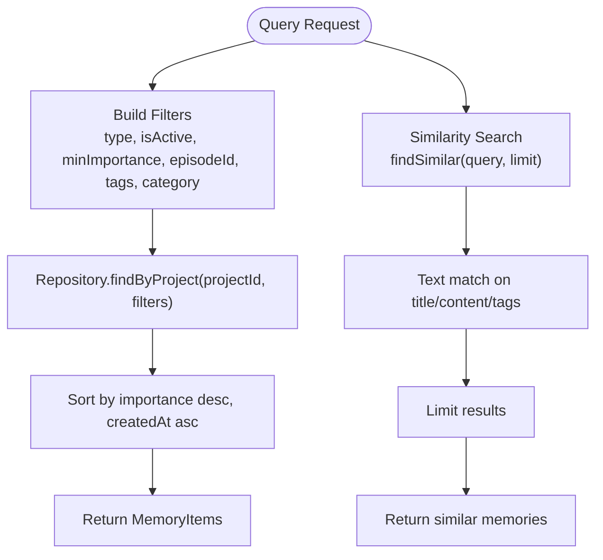
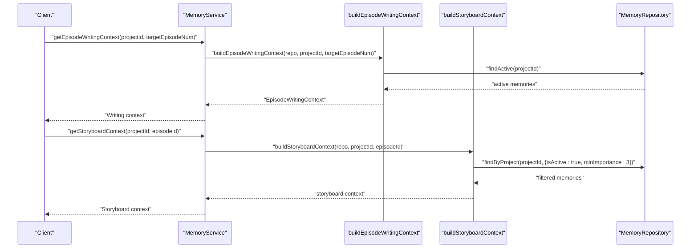
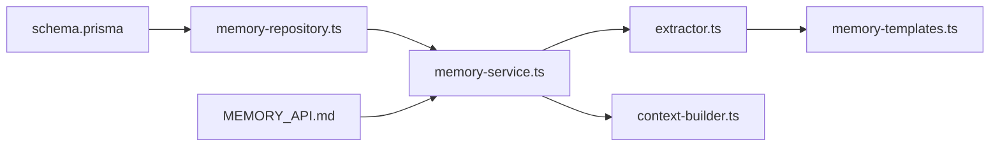

# Memory System Models

<cite>
**Referenced Files in This Document**
- [schema.prisma](file://packages/backend/prisma/schema.prisma)
- [migration.sql](file://packages/backend/prisma/migrations/20260417094945_20260417_memory/migration.sql)
- [memory-repository.ts](file://packages/backend/src/repositories/memory-repository.ts)
- [memory-service.ts](file://packages/backend/src/services/memory/memory-service.ts)
- [memory-templates.ts](file://packages/backend/src/services/prompts/memory-templates.ts)
- [extractor.ts](file://packages/backend/src/services/memory/extractor.ts)
- [context-builder.ts](file://packages/backend/src/services/memory/context-builder.ts)
- [MEMORY_API.md](file://docs/MEMORY_API.md)
</cite>

## Table of Contents

1. [Introduction](#introduction)
2. [Project Structure](#project-structure)
3. [Core Components](#core-components)
4. [Architecture Overview](#architecture-overview)
5. [Detailed Component Analysis](#detailed-component-analysis)
6. [Dependency Analysis](#dependency-analysis)
7. [Performance Considerations](#performance-considerations)
8. [Troubleshooting Guide](#troubleshooting-guide)
9. [Conclusion](#conclusion)

## Introduction

This document provides comprehensive entity model documentation for the memory system, focusing on MemoryItem and MemorySnapshot. It defines the MemoryItem type enumeration, metadata structure for episode associations and importance scoring, and the MemorySnapshot entity for project timeline snapshots with summary generation and context JSON storage. It also documents vector embedding fields reserved for future AI-powered search capabilities and explains the relationship between memory items and project episodes. Finally, it outlines practical workflows for memory creation, categorization, and retrieval.

## Project Structure

The memory system spans the Prisma schema, repository layer, service layer, and prompt templates. The schema defines the database entities and indexes. The repository encapsulates persistence operations. The service orchestrates extraction, context building, and querying. Prompt templates define the LLM prompts used for memory extraction and context construction.

**Diagram sources**

- [schema.prisma:366-429](file://packages/backend/prisma/schema.prisma#L366-L429)
- [migration.sql:1-64](file://packages/backend/prisma/migrations/20260417094945_20260417_memory/migration.sql#L1-L64)
- [memory-repository.ts:51-237](file://packages/backend/src/repositories/memory-repository.ts#L51-L237)
- [memory-service.ts:10-112](file://packages/backend/src/services/memory/memory-service.ts#L10-L112)
- [extractor.ts:27-93](file://packages/backend/src/services/memory/extractor.ts#L27-L93)
- [context-builder.ts:16-106](file://packages/backend/src/services/memory/context-builder.ts#L16-L106)
- [memory-templates.ts:6-167](file://packages/backend/src/services/prompts/memory-templates.ts#L6-L167)
- [MEMORY_API.md:1-541](file://docs/MEMORY_API.md#L1-L541)

**Section sources**

- [schema.prisma:366-429](file://packages/backend/prisma/schema.prisma#L366-L429)
- [memory-repository.ts:51-237](file://packages/backend/src/repositories/memory-repository.ts#L51-L237)
- [memory-service.ts:10-112](file://packages/backend/src/services/memory/memory-service.ts#L10-L112)
- [memory-templates.ts:6-167](file://packages/backend/src/services/prompts/memory-templates.ts#L6-L167)
- [MEMORY_API.md:1-541](file://docs/MEMORY_API.md#L1-L541)

## Core Components

### MemoryItem Entity

MemoryItem represents a single plot element extracted from or manually created for a project. It supports seven primary types and includes metadata for episode association, importance scoring, tagging, activity flags, verification, and vector embeddings for future AI search.

Key attributes and relationships:

- Identity and project linkage: id, projectId (foreign key to Project)
- Classification: type (enumeration), category (optional subtype)
- Content: title, content (text), metadata (JSON for structured episode associations)
- Embedding: embedding (vector array for future AI search)
- Relations: relatedIds (cross-memory relations), episodeId (foreign key to Episode)
- Management: tags (labels), importance (1–5), isActive, verified
- Timestamps: createdAt, updatedAt

Indexes:

- Composite indexes on (projectId, type), (projectId, isActive), (projectId, importance)
- Index on episodeId

Vector embeddings:

- Field exists for future AI-powered search and similarity retrieval.

Episode association:

- metadata can include episodeNum, characters, and location for structured episode context.
- episodeId links directly to the Episode entity.

Importance scoring:

- importance is an integer from 1 to 5, with higher values indicating greater narrative significance.

Activity and verification:

- isActive indicates whether the memory remains influential for future episodes.
- verified marks user-reviewed and confirmed memories.

Related IDs:

- relatedIds enables cross-linking of related memories (e.g., interconnected foreshadowings).

**Section sources**

- [schema.prisma:377-412](file://packages/backend/prisma/schema.prisma#L377-L412)
- [migration.sql:4-24](file://packages/backend/prisma/migrations/20260417094945_20260417_memory/migration.sql#L4-L24)
- [memory-repository.ts:3-35](file://packages/backend/src/repositories/memory-repository.ts#L3-L35)
- [memory-repository.ts:51-96](file://packages/backend/src/repositories/memory-repository.ts#L51-L96)

### MemorySnapshot Entity

MemorySnapshot captures a project’s timeline state up to a specific episode. It stores a human-readable summary and a structured context JSON used for script generation and review.

Key attributes:

- Identity and project linkage: id, projectId (foreign key to Project)
- Timeline: upToEpisode (integer episode number)
- Content: summary (text), contextJson (structured JSON)
- Timestamps: snapshotAt, createdAt

Constraints and indexes:

- Unique constraint on (projectId, upToEpisode)
- Index on projectId for efficient lookups

Use cases:

- Timeline snapshots for project history and regeneration checkpoints
- Structured context JSON passed to downstream systems for writing and storyboard generation

**Section sources**

- [schema.prisma:414-429](file://packages/backend/prisma/schema.prisma#L414-L429)
- [migration.sql:26-37](file://packages/backend/prisma/migrations/20260417094945_20260417_memory/migration.sql#L26-L37)
- [memory-repository.ts:46-49](file://packages/backend/src/repositories/memory-repository.ts#L46-L49)
- [memory-repository.ts:161-199](file://packages/backend/src/repositories/memory-repository.ts#L161-L199)

### Memory Type Enumeration

The MemoryType enumeration defines seven categories:

- CHARACTER
- LOCATION
- EVENT
- PLOT_POINT
- FORESHADOWING
- RELATIONSHIP
- VISUAL_STYLE

These types guide extraction, filtering, and context construction workflows.

**Section sources**

- [schema.prisma:367-375](file://packages/backend/prisma/schema.prisma#L367-L375)
- [migration.sql:1-2](file://packages/backend/prisma/migrations/20260417094945_20260417_memory/migration.sql#L1-L2)
- [memory-repository.ts:3-10](file://packages/backend/src/repositories/memory-repository.ts#L3-L10)

## Architecture Overview

The memory system integrates LLM-driven extraction, structured storage, and context building for script and storyboard generation. The service layer coordinates extraction and context building, while the repository persists and retrieves data efficiently using indexes.

**Diagram sources**

- [memory-templates.ts:6-167](file://packages/backend/src/services/prompts/memory-templates.ts#L6-L167)
- [extractor.ts:27-93](file://packages/backend/src/services/memory/extractor.ts#L27-L93)
- [memory-service.ts:10-112](file://packages/backend/src/services/memory/memory-service.ts#L10-L112)
- [memory-repository.ts:51-237](file://packages/backend/src/repositories/memory-repository.ts#L51-L237)
- [schema.prisma:366-429](file://packages/backend/prisma/schema.prisma#L366-L429)
- [context-builder.ts:16-106](file://packages/backend/src/services/memory/context-builder.ts#L16-L106)
- [MEMORY_API.md:1-541](file://docs/MEMORY_API.md#L1-L541)

## Detailed Component Analysis

### MemoryItem Class Model

**Diagram sources**

- [schema.prisma:377-412](file://packages/backend/prisma/schema.prisma#L377-L412)

**Section sources**

- [schema.prisma:377-412](file://packages/backend/prisma/schema.prisma#L377-L412)
- [migration.sql:4-24](file://packages/backend/prisma/migrations/20260417094945_20260417_memory/migration.sql#L4-L24)

### MemorySnapshot Class Model

**Diagram sources**

- [schema.prisma:414-429](file://packages/backend/prisma/schema.prisma#L414-L429)

**Section sources**

- [schema.prisma:414-429](file://packages/backend/prisma/schema.prisma#L414-L429)
- [migration.sql:26-37](file://packages/backend/prisma/migrations/20260417094945_20260417_memory/migration.sql#L26-L37)

### Memory Creation and Extraction Workflow

This sequence illustrates how memories are extracted from episode scripts and persisted.

**Diagram sources**

- [memory-service.ts:16-58](file://packages/backend/src/services/memory/memory-service.ts#L16-L58)
- [extractor.ts:27-93](file://packages/backend/src/services/memory/extractor.ts#L27-L93)
- [memory-templates.ts:6-69](file://packages/backend/src/services/prompts/memory-templates.ts#L6-L69)
- [memory-repository.ts:207-225](file://packages/backend/src/repositories/memory-repository.ts#L207-L225)

**Section sources**

- [memory-service.ts:16-58](file://packages/backend/src/services/memory/memory-service.ts#L16-L58)
- [extractor.ts:27-93](file://packages/backend/src/services/memory/extractor.ts#L27-L93)
- [memory-templates.ts:6-69](file://packages/backend/src/services/prompts/memory-templates.ts#L6-L69)
- [memory-repository.ts:207-225](file://packages/backend/src/repositories/memory-repository.ts#L207-L225)

### Memory Retrieval and Search Workflow

This flow shows filtering, sorting, and similarity search for memories.

**Diagram sources**

- [memory-repository.ts:98-159](file://packages/backend/src/repositories/memory-repository.ts#L98-L159)

**Section sources**

- [memory-repository.ts:98-159](file://packages/backend/src/repositories/memory-repository.ts#L98-L159)

### Context Building for Writing and Storyboarding

This sequence demonstrates how memory context is constructed for script writing and storyboard generation.

**Diagram sources**

- [memory-service.ts:63-72](file://packages/backend/src/services/memory/memory-service.ts#L63-L72)
- [context-builder.ts:16-106](file://packages/backend/src/services/memory/context-builder.ts#L16-L106)
- [memory-repository.ts:132-137](file://packages/backend/src/repositories/memory-repository.ts#L132-L137)
- [memory-repository.ts:84-89](file://packages/backend/src/repositories/memory-repository.ts#L84-L89)

**Section sources**

- [memory-service.ts:63-72](file://packages/backend/src/services/memory/memory-service.ts#L63-L72)
- [context-builder.ts:16-106](file://packages/backend/src/services/memory/context-builder.ts#L16-L106)
- [memory-repository.ts:132-137](file://packages/backend/src/repositories/memory-repository.ts#L132-L137)
- [memory-repository.ts:84-89](file://packages/backend/src/repositories/memory-repository.ts#L84-L89)

## Dependency Analysis

The memory system exhibits clear separation of concerns:

- Prisma schema defines entities and foreign keys.
- Repository encapsulates persistence logic and leverages indexes for performance.
- Service layer orchestrates extraction and context building.
- Prompt templates provide reusable LLM prompts.
- API documentation describes endpoints and usage patterns.

**Diagram sources**

- [schema.prisma:366-429](file://packages/backend/prisma/schema.prisma#L366-L429)
- [memory-repository.ts:51-237](file://packages/backend/src/repositories/memory-repository.ts#L51-L237)
- [memory-service.ts:10-112](file://packages/backend/src/services/memory/memory-service.ts#L10-L112)
- [extractor.ts:27-93](file://packages/backend/src/services/memory/extractor.ts#L27-L93)
- [context-builder.ts:16-106](file://packages/backend/src/services/memory/context-builder.ts#L16-L106)
- [memory-templates.ts:6-167](file://packages/backend/src/services/prompts/memory-templates.ts#L6-L167)
- [MEMORY_API.md:1-541](file://docs/MEMORY_API.md#L1-L541)

**Section sources**

- [schema.prisma:366-429](file://packages/backend/prisma/schema.prisma#L366-L429)
- [memory-repository.ts:51-237](file://packages/backend/src/repositories/memory-repository.ts#L51-L237)
- [memory-service.ts:10-112](file://packages/backend/src/services/memory/memory-service.ts#L10-L112)
- [extractor.ts:27-93](file://packages/backend/src/services/memory/extractor.ts#L27-L93)
- [context-builder.ts:16-106](file://packages/backend/src/services/memory/context-builder.ts#L16-L106)
- [memory-templates.ts:6-167](file://packages/backend/src/services/prompts/memory-templates.ts#L6-L167)
- [MEMORY_API.md:1-541](file://docs/MEMORY_API.md#L1-L541)

## Performance Considerations

- Indexes: Composite indexes on (projectId, type), (projectId, isActive), (projectId, importance), and (episodeId) optimize filtering and sorting by project and episode.
- Sorting: Queries sort by importance descending and createdAt ascending to surface critical memories first.
- Text search: Current implementation uses text containment with tags; vector similarity is reserved for future enhancement.
- Bulk operations: Repository supports bulk creation to reduce round-trips during extraction.

[No sources needed since this section provides general guidance]

## Troubleshooting Guide

Common issues and resolutions:

- Missing required fields: Ensure type, title, and content are provided when creating memories.
- Permission denied: Verify JWT authentication headers for protected endpoints.
- Memory not found: Confirm memoryId and projectId correctness.
- Extraction failures: Non-blocking errors do not halt script generation; inspect error logs and retry.

**Section sources**

- [MEMORY_API.md:429-465](file://docs/MEMORY_API.md#L429-L465)

## Conclusion

The memory system models MemoryItem and MemorySnapshot to support automated and manual memory management. MemoryItem captures categorized plot elements with episode metadata, importance scoring, and activity flags, while MemorySnapshot preserves timeline snapshots with summaries and structured context JSON. Vector embeddings are reserved for future AI-powered search. The service and repository layers integrate LLM-driven extraction and efficient persistence, enabling robust workflows for memory creation, categorization, and retrieval.
