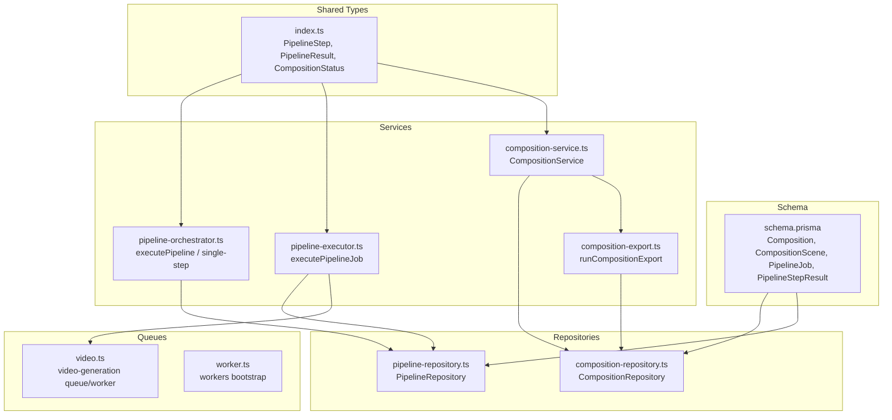
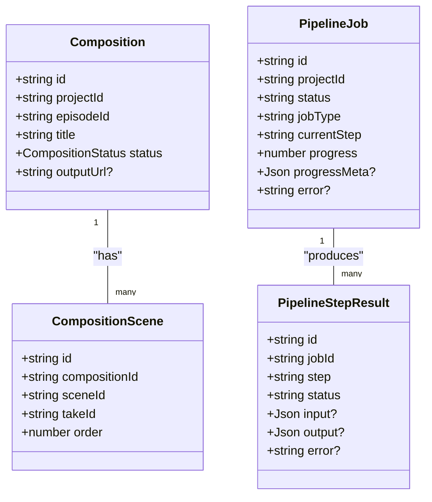
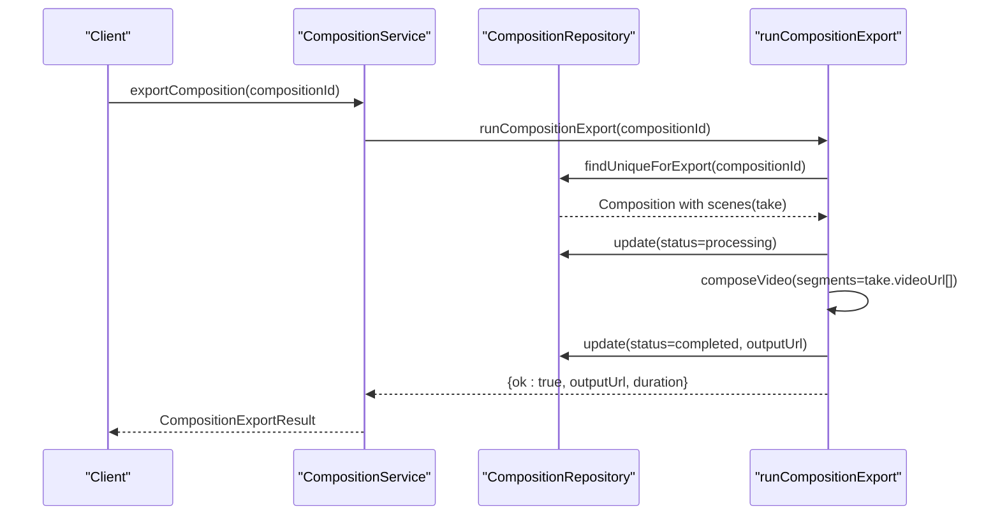
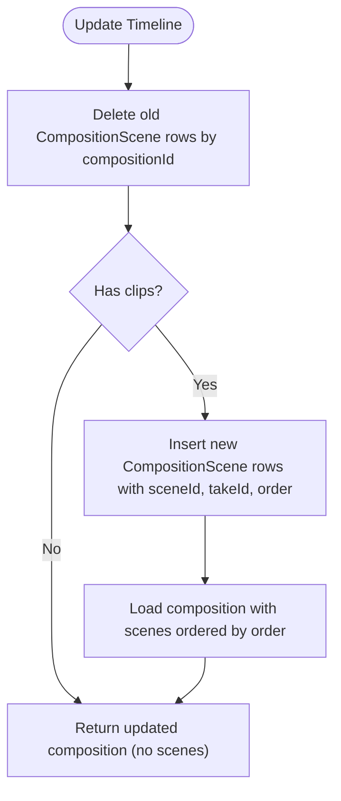
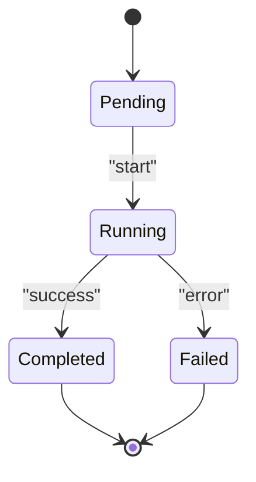
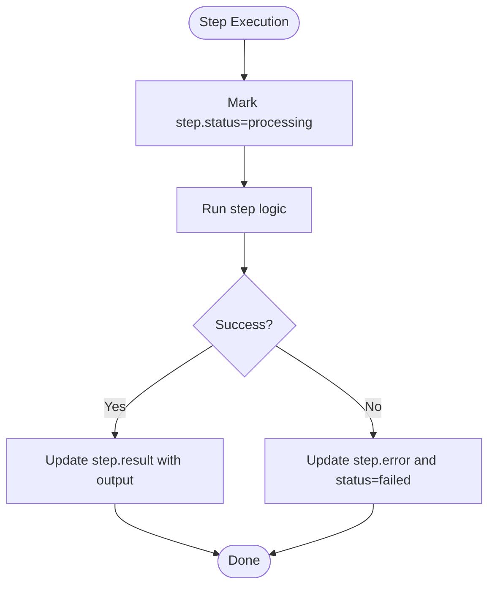

# Pipeline Orchestration Models

<cite>
**Referenced Files in This Document**
- [schema.prisma](file://packages/backend/prisma/schema.prisma)
- [composition-service.ts](file://packages/backend/src/services/composition-service.ts)
- [composition-repository.ts](file://packages/backend/src/repositories/composition-repository.ts)
- [composition-export.ts](file://packages/backend/src/services/composition-export.ts)
- [pipeline-orchestrator.ts](file://packages/backend/src/services/pipeline-orchestrator.ts)
- [pipeline-executor.ts](file://packages/backend/src/services/pipeline-executor.ts)
- [pipeline-repository.ts](file://packages/backend/src/repositories/pipeline-repository.ts)
- [index.ts (shared types)](file://packages/shared/src/types/index.ts)
- [video.ts (video queue)](file://packages/backend/src/queues/video.ts)
- [worker.ts](file://packages/backend/src/worker.ts)
</cite>

## Table of Contents

1. [Introduction](#introduction)
2. [Project Structure](#project-structure)
3. [Core Components](#core-components)
4. [Architecture Overview](#architecture-overview)
5. [Detailed Component Analysis](#detailed-component-analysis)
6. [Dependency Analysis](#dependency-analysis)
7. [Performance Considerations](#performance-considerations)
8. [Troubleshooting Guide](#troubleshooting-guide)
9. [Conclusion](#conclusion)

## Introduction

This document provides a comprehensive entity model and orchestration workflow guide for pipeline orchestration in the system. It focuses on four key entities:

- Composition: Final video assembly container with status tracking and output URL.
- CompositionScene: Bridge table linking compositions, scenes, and takes for timeline assembly.
- PipelineJob: Asynchronous job representing a full or partial pipeline execution with step tracking and progress metadata.
- PipelineStepResult: Granular step execution record with status, input/output, and error handling.

It also documents workflow state machines, progress calculation logic, error recovery mechanisms, and practical monitoring/troubleshooting workflows.

## Project Structure

The pipeline orchestration spans the Prisma schema, service layer, repository layer, and worker queue. The following diagram maps the primary files involved in orchestration.

**Diagram sources**

- [schema.prisma](file://packages/backend/prisma/schema.prisma)
- [composition-service.ts](file://packages/backend/src/services/composition-service.ts)
- [composition-repository.ts](file://packages/backend/src/repositories/composition-repository.ts)
- [composition-export.ts](file://packages/backend/src/services/composition-export.ts)
- [pipeline-orchestrator.ts](file://packages/backend/src/services/pipeline-orchestrator.ts)
- [pipeline-executor.ts](file://packages/backend/src/services/pipeline-executor.ts)
- [pipeline-repository.ts](file://packages/backend/src/repositories/pipeline-repository.ts)
- [index.ts (shared types)](file://packages/shared/src/types/index.ts)
- [video.ts (video queue)](file://packages/backend/src/queues/video.ts)
- [worker.ts](file://packages/backend/src/worker.ts)

**Section sources**

- [schema.prisma](file://packages/backend/prisma/schema.prisma)
- [composition-service.ts](file://packages/backend/src/services/composition-service.ts)
- [composition-repository.ts](file://packages/backend/src/repositories/composition-repository.ts)
- [composition-export.ts](file://packages/backend/src/services/composition-export.ts)
- [pipeline-orchestrator.ts](file://packages/backend/src/services/pipeline-orchestrator.ts)
- [pipeline-executor.ts](file://packages/backend/src/services/pipeline-executor.ts)
- [pipeline-repository.ts](file://packages/backend/src/repositories/pipeline-repository.ts)
- [index.ts (shared types)](file://packages/shared/src/types/index.ts)
- [video.ts (video queue)](file://packages/backend/src/queues/video.ts)
- [worker.ts](file://packages/backend/src/worker.ts)

## Core Components

This section defines the four core orchestration entities and their roles.

- Composition
  - Purpose: Container for assembling final video from ordered scene/take clips.
  - Key attributes: id, projectId, episodeId, title, status, outputUrl.
  - Status lifecycle: draft → processing → completed/failed.
  - Output URL: populated after successful export.

- CompositionScene (Bridge)
  - Purpose: Timeline assembly linkage between Composition, Scene, and Take.
  - Key attributes: id, compositionId, sceneId, takeId, order.
  - Enforces ordering via order field and links video clips to scenes.

- PipelineJob
  - Purpose: Tracks asynchronous pipeline execution for a project.
  - Key attributes: id, projectId, status, jobType, currentStep, progress, progressMeta, error.
  - Progress: numeric percentage; progressMeta stores contextual metadata (e.g., episodeId for episode-specific jobs).
  - Step tracking: currentStep indicates the active step.

- PipelineStepResult
  - Purpose: Per-step execution record with input/output and error details.
  - Key attributes: id, jobId, step, status, input, output, error, timestamps.
  - Uniqueness: unique per (jobId, step).

These entities are defined in the Prisma schema and surfaced through services and repositories for orchestration.

**Section sources**

- [schema.prisma](file://packages/backend/prisma/schema.prisma)
- [index.ts (shared types)](file://packages/shared/src/types/index.ts)

## Architecture Overview

The orchestration architecture integrates schema-driven entities, service-layer orchestration, repository persistence, and asynchronous workers.

**Diagram sources**

- [schema.prisma](file://packages/backend/prisma/schema.prisma)
- [index.ts (shared types)](file://packages/shared/src/types/index.ts)

## Detailed Component Analysis

### Composition Entity

Composition encapsulates final video assembly. It maintains status and output URL, and is enriched with scene/take details for rendering timelines.

- Responsibilities
  - Create/update compositions.
  - Update timeline by replacing CompositionScene entries.
  - Export assembled video and set status/outputUrl.

- Data enrichment
  - CompositionService enriches scenes with take.videoUrl and take.thumbnailUrl for UI consumption.

- Export workflow
  - runCompositionExport validates existence and non-empty scenes, sets status to processing, composes clips, updates outputUrl on success, or sets failed on error.

**Diagram sources**

- [composition-service.ts](file://packages/backend/src/services/composition-service.ts)
- [composition-repository.ts](file://packages/backend/src/repositories/composition-repository.ts)
- [composition-export.ts](file://packages/backend/src/services/composition-export.ts)

**Section sources**

- [composition-service.ts](file://packages/backend/src/services/composition-service.ts)
- [composition-repository.ts](file://packages/backend/src/repositories/composition-repository.ts)
- [composition-export.ts](file://packages/backend/src/services/composition-export.ts)
- [schema.prisma](file://packages/backend/prisma/schema.prisma)

### CompositionScene Bridge Table

CompositionScene is the bridge enabling ordered timeline assembly by linking compositions to scenes and selected takes.

- Behavior
  - Deletion and replacement of CompositionScene entries when updating timeline.
  - Ordered retrieval by order for deterministic assembly.

- Usage
  - CompositionService.updateTimeline deletes old entries and inserts new CompositionScene rows with explicit order.

**Diagram sources**

- [composition-service.ts](file://packages/backend/src/services/composition-service.ts)
- [composition-repository.ts](file://packages/backend/src/repositories/composition-repository.ts)

**Section sources**

- [composition-service.ts](file://packages/backend/src/services/composition-service.ts)
- [composition-repository.ts](file://packages/backend/src/repositories/composition-repository.ts)
- [schema.prisma](file://packages/backend/prisma/schema.prisma)

### PipelineJob Entity

PipelineJob tracks asynchronous pipeline executions for a project, including job types, current step, progress, and error state.

- Lifecycle
  - Pending → Running → Completed/Failed.
  - progressMeta stores contextual metadata (e.g., episodeId for episode-specific jobs).

- Execution modes
  - executePipelineJob orchestrates steps, updates job and step results, and handles failures.

- Progress calculation
  - executePipelineJob advances progress in stages (e.g., 25 after script-writing, 45 after episode-split, 65 after segment-extract, 90 after storyboard, 100 on completion).
  - Skips early steps when sufficient data already exists.

**Diagram sources**

- [pipeline-executor.ts](file://packages/backend/src/services/pipeline-executor.ts)
- [pipeline-repository.ts](file://packages/backend/src/repositories/pipeline-repository.ts)
- [schema.prisma](file://packages/backend/prisma/schema.prisma)

**Section sources**

- [pipeline-executor.ts](file://packages/backend/src/services/pipeline-executor.ts)
- [pipeline-repository.ts](file://packages/backend/src/repositories/pipeline-repository.ts)
- [schema.prisma](file://packages/backend/prisma/schema.prisma)

### PipelineStepResult Entity

PipelineStepResult captures granular execution outcomes for each step, enabling monitoring and recovery.

- Fields
  - step: identifies the step (e.g., script-writing, episode-split, storyboard).
  - status: pending/processing/completed/failed.
  - input/output/error: structured data for diagnostics and replay.

- Persistence
  - PipelineRepository.updateStepResult updates step records atomically by jobId and step.

- Monitoring
  - Clients can poll PipelineJob with stepResults included to track progress and errors.

**Diagram sources**

- [pipeline-executor.ts](file://packages/backend/src/services/pipeline-executor.ts)
- [pipeline-repository.ts](file://packages/backend/src/repositories/pipeline-repository.ts)
- [schema.prisma](file://packages/backend/prisma/schema.prisma)

**Section sources**

- [pipeline-executor.ts](file://packages/backend/src/services/pipeline-executor.ts)
- [pipeline-repository.ts](file://packages/backend/src/repositories/pipeline-repository.ts)
- [schema.prisma](file://packages/backend/prisma/schema.prisma)

### Workflow State Machines and Progress Calculation

- PipelineJob state machine
  - Pending → Running → Completed/Failed.
  - progressMeta supports episode-scoped jobs (e.g., episode-storyboard-script).

- Progress calculation
  - executePipelineJob advances progress in fixed stages aligned to major steps.
  - Skips early steps when prerequisite data exists, reducing redundant work.

- Error handling
  - On failure, PipelineJob status transitions to failed and error is recorded.
  - Current step result is updated with error for visibility.

**Section sources**

- [pipeline-executor.ts](file://packages/backend/src/services/pipeline-executor.ts)
- [pipeline-repository.ts](file://packages/backend/src/repositories/pipeline-repository.ts)
- [schema.prisma](file://packages/backend/prisma/schema.prisma)

### Error Recovery Mechanisms

- Step-level recovery
  - executeSingleStep allows re-running individual steps with previous results as inputs.
  - executePipelineJob can skip steps when data is present, avoiding repeated failures.

- Job-level recovery
  - PipelineJob can be retried; step results are updated to reflect re-execution.
  - Workers handle transient failures with retries and exponential backoff.

- Export recovery
  - runCompositionExport sets status to failed on error, allowing manual retry after fixing missing take.videoUrl.

**Section sources**

- [pipeline-orchestrator.ts](file://packages/backend/src/services/pipeline-orchestrator.ts)
- [pipeline-executor.ts](file://packages/backend/src/services/pipeline-executor.ts)
- [composition-export.ts](file://packages/backend/src/services/composition-export.ts)
- [video.ts (video queue)](file://packages/backend/src/queues/video.ts)

### Examples: Pipeline Execution Monitoring and Troubleshooting

- Monitoring
  - Poll PipelineJob with include stepResults to observe currentStep, progress, and per-step status.
  - Use progressMeta to correlate episode-specific jobs.

- Troubleshooting
  - If a step failed, inspect PipelineStepResult.error and input/output for diagnostics.
  - For video generation failures, verify take.taskId externalTaskId and API logs; retry via re-execution.
  - For composition export failures, ensure all CompositionScene entries have take.videoUrl; retry after correcting.

[No sources needed since this section provides general guidance]

## Dependency Analysis

The orchestration components depend on shared types and repositories for persistence. The video queue worker consumes tasks generated during pipeline execution.

```mermaid
graph LR
TYPES["Shared Types (PipelineStep, Status)"] --> ORCH["pipeline-orchestrator.ts"]
TYPES --> EXEC["pipeline-executor.ts"]
TYPES --> COMP["composition-service.ts"]
REPO_PIPE["pipeline-repository.ts"] --> EXEC
REPO_COMP["composition-repository.ts"] --> COMP
EXEC --> Q_VIDEO["video.ts (queue/worker)"]
COMP --> COMP_EXPORT["composition-export.ts"]
```

**Diagram sources**

- [index.ts (shared types)](file://packages/shared/src/types/index.ts)
- [pipeline-orchestrator.ts](file://packages/backend/src/services/pipeline-orchestrator.ts)
- [pipeline-executor.ts](file://packages/backend/src/services/pipeline-executor.ts)
- [pipeline-repository.ts](file://packages/backend/src/repositories/pipeline-repository.ts)
- [composition-service.ts](file://packages/backend/src/services/composition-service.ts)
- [composition-repository.ts](file://packages/backend/src/repositories/composition-repository.ts)
- [composition-export.ts](file://packages/backend/src/services/composition-export.ts)
- [video.ts (video queue)](file://packages/backend/src/queues/video.ts)

**Section sources**

- [index.ts (shared types)](file://packages/shared/src/types/index.ts)
- [pipeline-orchestrator.ts](file://packages/backend/src/services/pipeline-orchestrator.ts)
- [pipeline-executor.ts](file://packages/backend/src/services/pipeline-executor.ts)
- [pipeline-repository.ts](file://packages/backend/src/repositories/pipeline-repository.ts)
- [composition-service.ts](file://packages/backend/src/services/composition-service.ts)
- [composition-repository.ts](file://packages/backend/src/repositories/composition-repository.ts)
- [composition-export.ts](file://packages/backend/src/services/composition-export.ts)
- [video.ts (video queue)](file://packages/backend/src/queues/video.ts)

## Performance Considerations

- Asynchronous execution
  - PipelineJob runs asynchronously; use progress and stepResults for non-blocking monitoring.
- Batch writes
  - CompositionScene bulk insert/delete minimizes round-trips during timeline updates.
- Worker concurrency
  - Video worker concurrency is tuned to balance throughput and resource usage.
- Cost estimation
  - estimatePipelineCost provides a simple heuristic for planning budgets.

[No sources needed since this section provides general guidance]

## Troubleshooting Guide

- Composition export fails with “No clips” or missing take.videoUrl
  - Cause: Empty CompositionScene or missing take.videoUrl.
  - Action: Verify CompositionScene entries and ensure take generation completed; retry export.

- PipelineJob stuck at a step
  - Cause: External API failure or missing prerequisites.
  - Action: Inspect PipelineStepResult.error; re-run executeSingleStep for the failing step; confirm progressMeta correctness.

- Video generation task fails
  - Cause: No video URL returned or API error.
  - Action: Check API logs, externalTaskId, and retry; ensure reference images and durations are valid.

- Worker shutdown or restart
  - Action: Graceful shutdown closes queues; restart worker to resume processing.

**Section sources**

- [composition-export.ts](file://packages/backend/src/services/composition-export.ts)
- [pipeline-executor.ts](file://packages/backend/src/services/pipeline-executor.ts)
- [pipeline-repository.ts](file://packages/backend/src/repositories/pipeline-repository.ts)
- [video.ts (video queue)](file://packages/backend/src/queues/video.ts)
- [worker.ts](file://packages/backend/src/worker.ts)

## Conclusion

The pipeline orchestration models—Composition, CompositionScene, PipelineJob, and PipelineStepResult—provide a robust foundation for end-to-end video production workflows. They enable asynchronous execution, granular monitoring, and resilient error recovery. By leveraging progress tracking, step results, and bridge table ordering, teams can reliably assemble final videos and troubleshoot issues efficiently.
