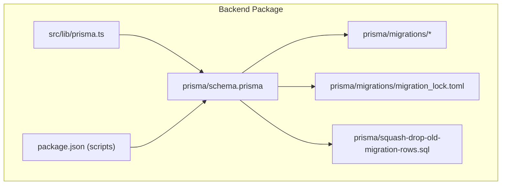
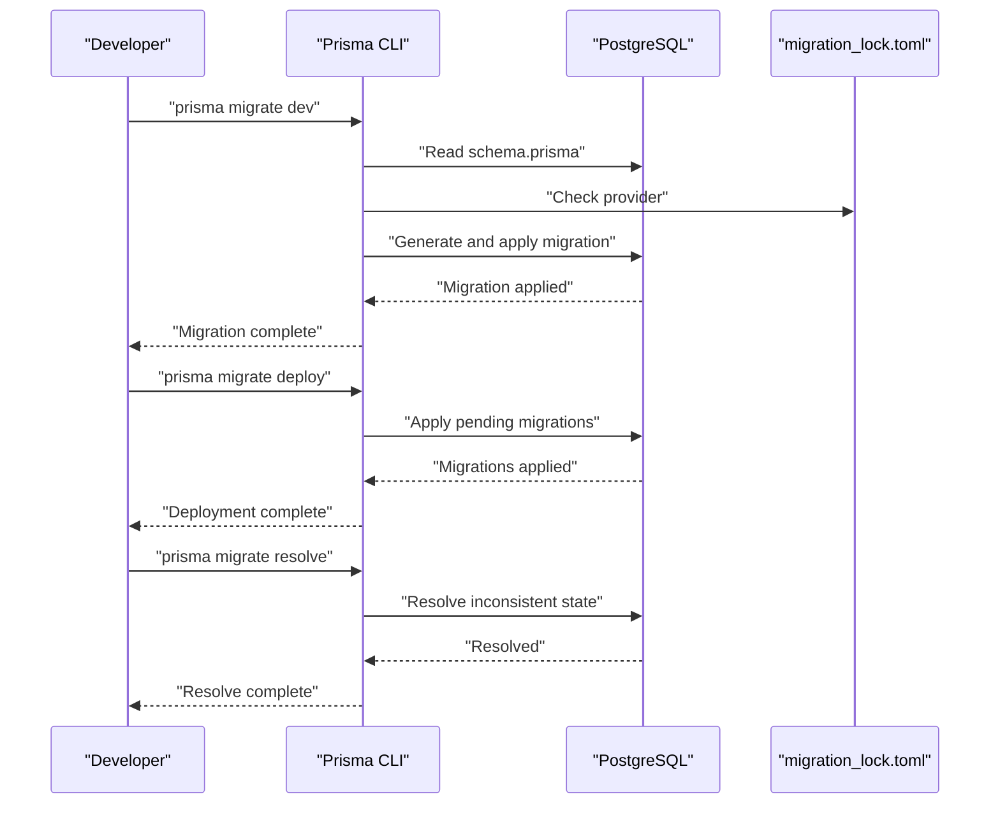
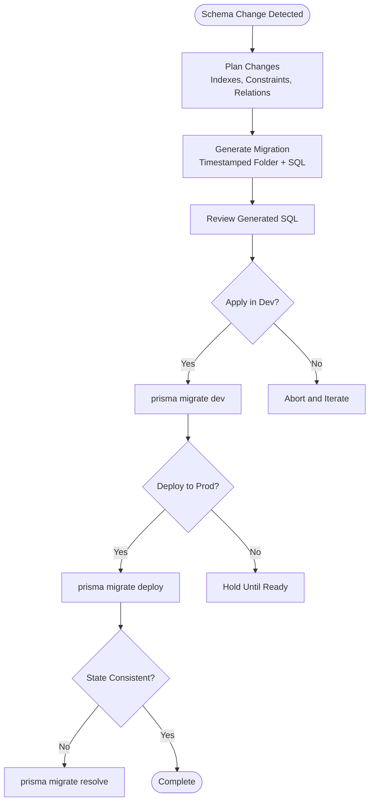
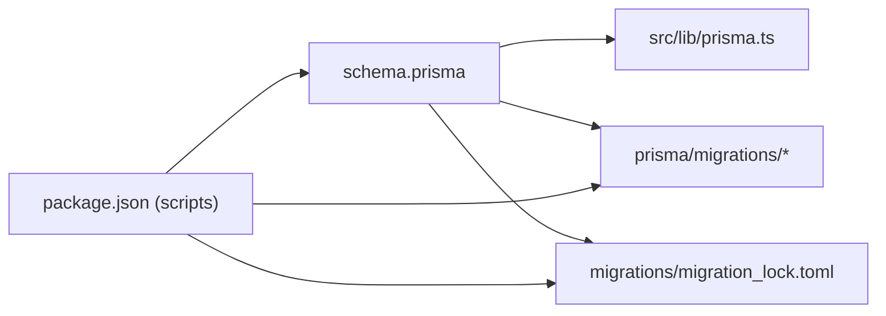

# Migration Strategy and Schema Evolution

<cite>
**Referenced Files in This Document**
- [schema.prisma](file://packages/backend/prisma/schema.prisma)
- [migration_lock.toml](file://packages/backend/prisma/migrations/migration_lock.toml)
- [squash-drop-old-migration-rows.sql](file://packages/backend/prisma/squash-drop-old-migration-rows.sql)
- [package.json](file://packages/backend/package.json)
- [prisma.ts](file://packages/backend/src/lib/prisma.ts)
- [DEVELOPMENT.md](file://docs/DEVELOPMENT.md)
</cite>

## Table of Contents

1. [Introduction](#introduction)
2. [Project Structure](#project-structure)
3. [Core Components](#core-components)
4. [Architecture Overview](#architecture-overview)
5. [Detailed Component Analysis](#detailed-component-analysis)
6. [Dependency Analysis](#dependency-analysis)
7. [Performance Considerations](#performance-considerations)
8. [Troubleshooting Guide](#troubleshooting-guide)
9. [Conclusion](#conclusion)
10. [Appendices](#appendices)

## Introduction

This document provides a comprehensive migration strategy and schema evolution guide for Prisma within the project. It explains how to evolve the database safely from schema changes to production-ready updates, covering development-time migrations, deployment-time migrations, resolving migration conflicts, and operational safety practices. It also covers rollback strategies, data preservation, backward compatibility, environment-specific configurations, and best practices for breaking changes, index modifications, and constraint updates.

## Project Structure

The backend package contains the Prisma schema and migration artifacts, along with npm scripts to orchestrate migration workflows. The Prisma client is initialized in the backend and used by services.

**Diagram sources**

- [schema.prisma](file://packages/backend/prisma/schema.prisma)
- [migration_lock.toml](file://packages/backend/prisma/migrations/migration_lock.toml)
- [squash-drop-old-migration-rows.sql](file://packages/backend/prisma/squash-drop-old-migration-rows.sql)
- [prisma.ts](file://packages/backend/src/lib/prisma.ts)
- [package.json](file://packages/backend/package.json)

**Section sources**

- [schema.prisma](file://packages/backend/prisma/schema.prisma)
- [package.json](file://packages/backend/package.json)

## Core Components

- Prisma schema: Defines models, relations, enums, and indexes. It is the single source of truth for the database structure.
- Migration directory: Contains timestamped migration folders with SQL scripts generated by Prisma.
- Migration lock: Tracks the active provider and ensures migration integrity.
- Squash script: Utility to remove old migration rows from the internal migration table after squashing.
- Prisma client initialization: Provides a typed client used across services.
- NPM scripts: Define migration commands for development and deployment.

Key migration-related scripts:

- Development migration: runs Prisma’s development migration workflow.
- Deployment migration: applies pending migrations against a target environment.
- Squash drift rows: cleans up legacy migration entries after squashing.

**Section sources**

- [schema.prisma](file://packages/backend/prisma/schema.prisma)
- [migration_lock.toml](file://packages/backend/prisma/migrations/migration_lock.toml)
- [squash-drop-old-migration-rows.sql](file://packages/backend/prisma/squash-drop-old-migration-rows.sql)
- [prisma.ts](file://packages/backend/src/lib/prisma.ts)
- [package.json](file://packages/backend/package.json)

## Architecture Overview

The migration lifecycle spans three stages:

- Development: Detects schema changes and generates incremental migrations.
- Deployment: Applies migrations to target environments.
- Resolution: Resolves conflicts or inconsistent states when migrations diverge.

**Diagram sources**

- [schema.prisma](file://packages/backend/prisma/schema.prisma)
- [migration_lock.toml](file://packages/backend/prisma/migrations/migration_lock.toml)
- [package.json](file://packages/backend/package.json)

## Detailed Component Analysis

### Migration File Structure and Timestamp Ordering

- Each migration resides in its own folder named with a strict timestamp prefix followed by a descriptive label. This enforces chronological ordering and deterministic application.
- Inside each folder is a migration SQL file containing the database changes.
- The migration lock file records the provider and should remain under version control to maintain consistency across environments.

**Diagram sources**

- [schema.prisma](file://packages/backend/prisma/schema.prisma)
- [migration_lock.toml](file://packages/backend/prisma/migrations/migration_lock.toml)
- [package.json](file://packages/backend/package.json)

**Section sources**

- [schema.prisma](file://packages/backend/prisma/schema.prisma)
- [migration_lock.toml](file://packages/backend/prisma/migrations/migration_lock.toml)

### Development Workflow: prisma migrate dev

- Purpose: Detect schema changes and apply them locally during development.
- Behavior: Compares the current Prisma schema to the last applied migration, generates a new migration if needed, and applies it to the local database.
- Safety: Ensures local state matches the schema without manual SQL intervention.

Operational notes:

- Ensure DATABASE_URL is set in the environment.
- The command is exposed via the backend package script for convenience.

**Section sources**

- [package.json](file://packages/backend/package.json)

### Deployment Workflow: prisma migrate deploy

- Purpose: Apply pending migrations to a target environment (staging/production).
- Behavior: Connects to the configured database URL and applies all unapplied migrations in order.
- Safety: Designed for automated CI/CD pipelines; does not open an interactive prompt.

Operational notes:

- Ensure DATABASE_URL points to the target environment.
- The script invokes Prisma programmatically and forwards environment variables.

**Section sources**

- [package.json](file://packages/backend/package.json)

### Conflict Resolution: prisma migrate resolve

- Purpose: Resolve inconsistent migration states (e.g., missing migration rows, mixed branches).
- Typical scenarios:
  - A migration was manually applied but not recorded.
  - Branches were merged with divergent migration histories.
- Options:
  - Mark a migration as applied without replaying SQL.
  - Mark a migration as failed to unblock subsequent migrations.
- Safety: Use only after verifying the database state and backing up data.

**Section sources**

- [package.json](file://packages/backend/package.json)

### Rollback Procedures and Data Preservation

Rollback approaches depend on the nature of the change:

- Non-destructive changes (adds columns, indexes):
  - Use a reverse migration to undo additions.
  - Preserve data by avoiding DROP operations on columns or tables.
- Destructive changes (drops, renames):
  - Prefer adding new columns/tables, copying data, then dropping old ones.
  - Maintain backups before destructive operations.
- Index and constraint changes:
  - Drop indexes/constraints before altering columns, recreate afterward.
  - Use separate migrations for drop/create to minimize downtime.

Data preservation strategies:

- Always backup the database before applying risky migrations.
- Use transactions for small, atomic changes where supported.
- Validate data integrity post-migration with targeted queries.

[No sources needed since this section provides general guidance]

### Backward Compatibility Considerations

- Avoid breaking changes to existing APIs and data formats.
- When renaming or removing fields:
  - Add new fields/columns first.
  - Populate new fields from old data.
  - Update application logic to use new fields.
  - Schedule removal of old fields in a future release.
- Enum and relation changes:
  - Add new enum values or relations before removing old ones.
  - Update application code to handle both old and new forms temporarily.

[No sources needed since this section provides general guidance]

### Development vs Production Migration Differences

- Development:
  - Frequent schema iteration; migrations are fast and reversible.
  - Use prisma migrate dev for quick feedback loops.
- Production:
  - Migrations must be deterministic and safe.
  - Use prisma migrate deploy in CI/CD.
  - Require approvals and backups before applying.

Environment-specific configurations:

- DATABASE_URL must point to the correct environment.
- Ensure environment variables are loaded consistently in scripts.

**Section sources**

- [DEVELOPMENT.md](file://docs/DEVELOPMENT.md)
- [package.json](file://packages/backend/package.json)

### Seed Data Management

- Seed data is typically managed outside of regular migrations (e.g., via a seed script or initial load).
- If schema changes require seed adjustments, update the seed logic accordingly and re-run seeding after migrations.
- Keep seed data versioned and idempotent to avoid duplication.

[No sources needed since this section provides general guidance]

### Best Practices for Breaking Changes, Index Modifications, and Constraint Updates

Breaking changes:

- Use additive-only changes initially; deprecate old fields gradually.
- Version APIs and data formats to support coexistence.

Index modifications:

- Drop indexes before altering columns; recreate after.
- Batch index changes to reduce maintenance windows.

Constraint updates:

- Validate referential integrity before adding foreign keys.
- Use SET NULL or CASCADE carefully; test cascading effects.

[No sources needed since this section provides general guidance]

## Dependency Analysis

The backend Prisma client depends on the Prisma schema and migration state. Scripts orchestrate migration workflows and ensure environment variables are passed correctly.

**Diagram sources**

- [schema.prisma](file://packages/backend/prisma/schema.prisma)
- [migration_lock.toml](file://packages/backend/prisma/migrations/migration_lock.toml)
- [prisma.ts](file://packages/backend/src/lib/prisma.ts)
- [package.json](file://packages/backend/package.json)

**Section sources**

- [schema.prisma](file://packages/backend/prisma/schema.prisma)
- [prisma.ts](file://packages/backend/src/lib/prisma.ts)
- [package.json](file://packages/backend/package.json)

## Performance Considerations

- Keep migrations small and focused to reduce downtime.
- Avoid long-running migrations on large tables; consider background jobs or phased rollouts.
- Monitor query performance after index changes; adjust indexes as needed.

[No sources needed since this section provides general guidance]

## Troubleshooting Guide

Common issues and resolutions:

- Migration fails due to provider mismatch:
  - Verify migration_lock.toml provider matches the target database.
- Pending migrations not applied:
  - Run prisma migrate deploy to apply pending migrations.
- Conflicting migration states:
  - Use prisma migrate resolve to mark migrations as applied or failed.
- Drifted migration rows after squashing:
  - Use the provided SQL script to clean up internal migration rows.

Operational tips:

- Always backup the database before applying migrations.
- Test migrations on a staging replica first.
- Review generated SQL before applying to production.

**Section sources**

- [migration_lock.toml](file://packages/backend/prisma/migrations/migration_lock.toml)
- [squash-drop-old-migration-rows.sql](file://packages/backend/prisma/squash-drop-old-migration-rows.sql)
- [package.json](file://packages/backend/package.json)

## Conclusion

A disciplined migration strategy ensures safe, repeatable schema evolution. Use prisma migrate dev for iterative development, prisma migrate deploy for controlled production deployments, and prisma migrate resolve for conflict resolution. Preserve data, maintain backward compatibility, and adopt additive-only changes where possible. Leverage environment-specific configurations, backups, and staged rollouts to minimize risk.

[No sources needed since this section summarizes without analyzing specific files]

## Appendices

### Appendix A: Migration Commands Reference

- Development: prisma migrate dev
- Deployment: prisma migrate deploy
- Resolve: prisma migrate resolve
- Generate client: prisma generate
- Push schema (development only): prisma db push

**Section sources**

- [package.json](file://packages/backend/package.json)

### Appendix B: Environment Variables

- DATABASE_URL: Points to the target database.
- Other environment variables required by the application.

**Section sources**

- [DEVELOPMENT.md](file://docs/DEVELOPMENT.md)
