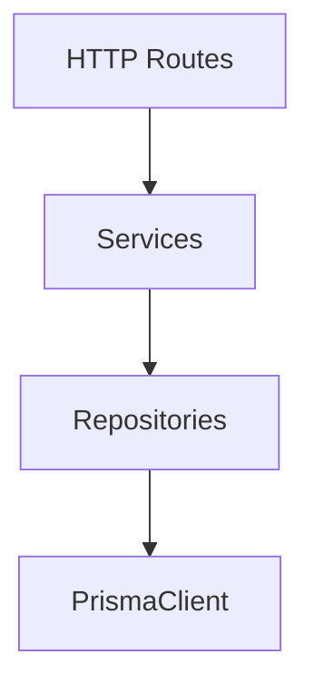
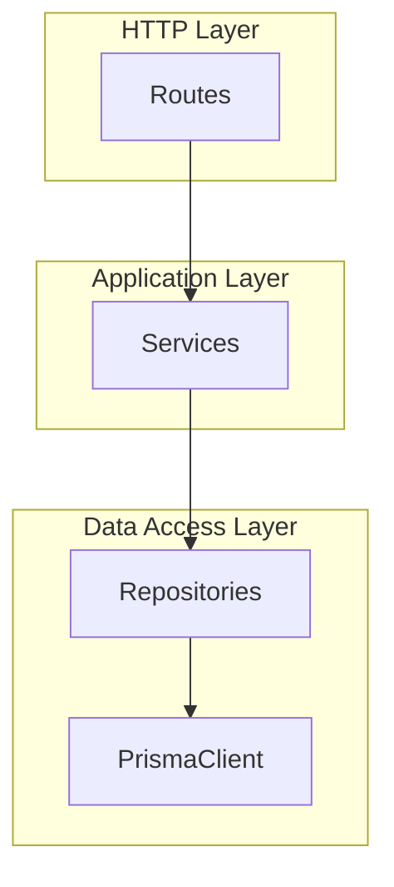
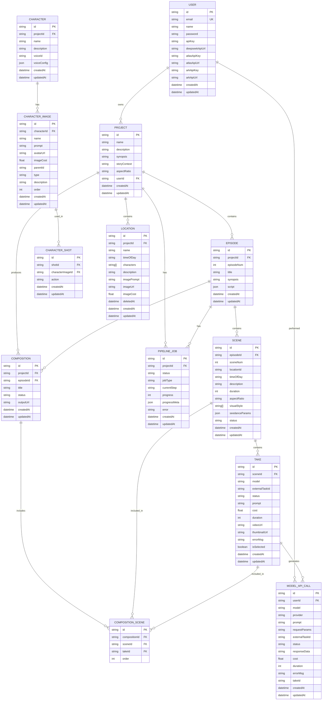
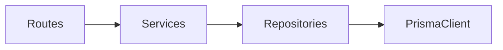
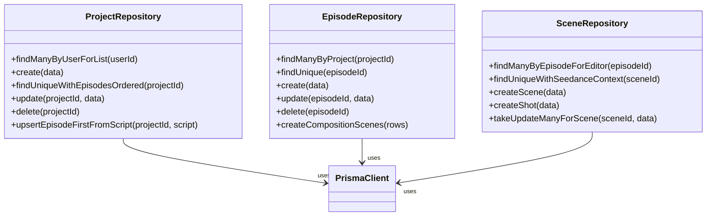

# Prisma Client Usage and Query Patterns

<cite>
**Referenced Files in This Document**
- [schema.prisma](file://packages/backend/prisma/schema.prisma)
- [prisma.ts](file://packages/backend/src/lib/prisma.ts)
- [project-repository.ts](file://packages/backend/src/repositories/project-repository.ts)
- [episode-repository.ts](file://packages/backend/src/repositories/episode-repository.ts)
- [scene-repository.ts](file://packages/backend/src/repositories/scene-repository.ts)
- [project-service.ts](file://packages/backend/src/services/project-service.ts)
- [episode-service.ts](file://packages/backend/src/services/episode-service.ts)
- [后端第一阶段重构_20260414.md](file://docs/plans/后端第一阶段重构_20260414.md)
- [后端第二阶段重构_20260414.md](file://docs/plans/后端第二阶段重构_20260414.md)
- [后端第三阶段重构_20260414.md](file://docs/plans/后端第三阶段重构_20260414.md)
</cite>

## Table of Contents

1. [Introduction](#introduction)
2. [Project Structure](#project-structure)
3. [Core Components](#core-components)
4. [Architecture Overview](#architecture-overview)
5. [Detailed Component Analysis](#detailed-component-analysis)
6. [Dependency Analysis](#dependency-analysis)
7. [Performance Considerations](#performance-considerations)
8. [Troubleshooting Guide](#troubleshooting-guide)
9. [Conclusion](#conclusion)
10. [Appendices](#appendices)

## Introduction

This document explains how the backend uses Prisma Client to implement robust data access patterns across the application. It focuses on repository and service layer patterns, common query operations (findUnique, findMany, create, update, delete), batch operations, transactions, relationship queries, pagination, sorting, filtering, and complex joins. It also covers dependency injection, error handling, async/await usage, and performance optimization strategies grounded in the existing codebase.

## Project Structure

The backend follows a layered architecture:

- Routes: Thin HTTP handlers
- Services: Orchestration, validation, and cross-repository coordination
- Repositories: Encapsulate Prisma operations per domain entity
- Prisma: Data model and client

**Diagram sources**

- [后端第一阶段重构\_20260414.md:104-114](file://docs/plans/后端第一阶段重构_20260414.md#L104-L114)

**Section sources**

- [后端第一阶段重构\_20260414.md:47-118](file://docs/plans/后端第一阶段重构_20260414.md#L47-L118)

## Core Components

- Prisma client initialization is centralized and injected into repositories via dependency injection.
- Repositories encapsulate CRUD and complex queries for each domain entity.
- Services orchestrate business logic and coordinate multiple repositories.

Key implementation references:

- Prisma client singleton: [prisma.ts:1-4](file://packages/backend/src/lib/prisma.ts#L1-L4)
- Project repository with findMany, findUnique, create, update, delete, upsert, and nested queries: [project-repository.ts:1-160](file://packages/backend/src/repositories/project-repository.ts#L1-L160)
- Episode repository with findMany, findUnique, create, update, delete, and batch insert: [episode-repository.ts:1-115](file://packages/backend/src/repositories/episode-repository.ts#L1-L115)
- Scene repository with nested includes, ordering, and batch updates: [scene-repository.ts:1-176](file://packages/backend/src/repositories/scene-repository.ts#L1-L176)
- Service layer integrating repositories for higher-level operations: [project-service.ts:1-322](file://packages/backend/src/services/project-service.ts#L1-L322), [episode-service.ts:1-594](file://packages/backend/src/services/episode-service.ts#L1-L594)

**Section sources**

- [prisma.ts:1-4](file://packages/backend/src/lib/prisma.ts#L1-L4)
- [project-repository.ts:1-160](file://packages/backend/src/repositories/project-repository.ts#L1-L160)
- [episode-repository.ts:1-115](file://packages/backend/src/repositories/episode-repository.ts#L1-L115)
- [scene-repository.ts:1-176](file://packages/backend/src/repositories/scene-repository.ts#L1-L176)
- [project-service.ts:1-322](file://packages/backend/src/services/project-service.ts#L1-L322)
- [episode-service.ts:1-594](file://packages/backend/src/services/episode-service.ts#L1-L594)

## Architecture Overview

The system enforces a strict dependency chain: routes → services → repositories → Prisma. This ensures testability, separation of concerns, and clean error handling.

**Diagram sources**

- [后端第一阶段重构\_20260414.md:104-114](file://docs/plans/后端第一阶段重构_20260414.md#L104-L114)

**Section sources**

- [后端第一阶段重构\_20260414.md:29-61](file://docs/plans/后端第一阶段重构_20260414.md#L29-L61)

## Detailed Component Analysis

### Prisma Client Initialization and Injection

- A single PrismaClient instance is exported and imported by repositories.
- This enables dependency injection so services receive repository instances pre-bound to the client.

Implementation highlights:

- Client creation: [prisma.ts:1-4](file://packages/backend/src/lib/prisma.ts#L1-L4)
- Repository constructors accept the client: [project-repository.ts:5-7](file://packages/backend/src/repositories/project-repository.ts#L5-L7), [episode-repository.ts:4-6](file://packages/backend/src/repositories/episode-repository.ts#L4-L6), [scene-repository.ts:4-6](file://packages/backend/src/repositories/scene-repository.ts#L4-L6)

Best practices derived from the codebase:

- Keep a single client instance per process to benefit from internal connection pooling.
- Inject the client into repositories rather than importing it inside services to simplify testing and avoid circular dependencies.

**Section sources**

- [prisma.ts:1-4](file://packages/backend/src/lib/prisma.ts#L1-L4)
- [project-repository.ts:5-7](file://packages/backend/src/repositories/project-repository.ts#L5-L7)
- [episode-repository.ts:4-6](file://packages/backend/src/repositories/episode-repository.ts#L4-L6)
- [scene-repository.ts:4-6](file://packages/backend/src/repositories/scene-repository.ts#L4-L6)

### Repository Pattern Implementation

Repositories encapsulate all Prisma operations for a domain entity and expose typed methods. Examples:

- ProjectRepository: findManyByUserForList, findUnique, create, update, delete, upsertEpisodeFirstFromScript, findManyEpisodesOrdered, and more.
- EpisodeRepository: findManyByProject, findUnique, create, update, delete, createCompositionScenes (batch), and more.
- SceneRepository: findManyByEpisodeForEditor, findUniqueWithSeedanceContext, takeUpdateManyForScene, and more.

Common patterns:

- Selectivity: Prefer select to limit returned fields (e.g., aspect ratio, visual style).
- Includes: Use include for related entities; order nested relations when needed.
- Upserts: Use upsert for idempotent writes keyed by composite unique constraints.
- Batch operations: Use createMany for composition scenes to reduce round-trips.

Example references:

- Selective reads: [project-repository.ts:22-27](file://packages/backend/src/repositories/project-repository.ts#L22-L27)
- Nested includes with ordering: [scene-repository.ts:20-49](file://packages/backend/src/repositories/scene-repository.ts#L20-L49)
- Upsert with composite key: [project-repository.ts:110-124](file://packages/backend/src/repositories/project-repository.ts#L110-L124)
- Batch insert: [episode-repository.ts:74-83](file://packages/backend/src/repositories/episode-repository.ts#L74-L83)

**Section sources**

- [project-repository.ts:1-160](file://packages/backend/src/repositories/project-repository.ts#L1-L160)
- [episode-repository.ts:1-115](file://packages/backend/src/repositories/episode-repository.ts#L1-L115)
- [scene-repository.ts:1-176](file://packages/backend/src/repositories/scene-repository.ts#L1-L176)

### Service Layer Integration and Dependency Injection

Services depend on repositories, not on Prisma directly. This improves testability and keeps business logic cohesive.

Examples:

- ProjectService composes ProjectRepository for listing, creating, updating, and pipeline job creation.
- EpisodeService composes EpisodeRepository and SceneRepository for episode lifecycle operations.

References:

- ProjectService DI: [project-service.ts:52-52](file://packages/backend/src/services/project-service.ts#L52-L52)
- EpisodeService DI: [episode-service.ts:88-88](file://packages/backend/src/services/episode-service.ts#L88-L88)

**Section sources**

- [project-service.ts:52-52](file://packages/backend/src/services/project-service.ts#L52-L52)
- [episode-service.ts:88-88](file://packages/backend/src/services/episode-service.ts#L88-L88)

### Common Query Patterns

#### findUnique

- Retrieve a single record by a unique constraint.
- Example: ProjectRepository.findUnique, EpisodeRepository.findUnique, SceneRepository.findSceneById.

References:

- [project-repository.ts:86-88](file://packages/backend/src/repositories/project-repository.ts#L86-L88)
- [episode-repository.ts:14-16](file://packages/backend/src/repositories/episode-repository.ts#L14-L16)
- [scene-repository.ts:133-135](file://packages/backend/src/repositories/scene-repository.ts#L133-L135)

#### findMany

- List records with optional ordering and inclusion of related data.
- Examples: ProjectRepository.findManyByUserForList, EpisodeRepository.findManyByProject, SceneRepository.findManyByEpisodeWithTakes.

References:

- [project-repository.ts:8-16](file://packages/backend/src/repositories/project-repository.ts#L8-L16)
- [episode-repository.ts:7-12](file://packages/backend/src/repositories/episode-repository.ts#L7-L12)
- [scene-repository.ts:7-17](file://packages/backend/src/repositories/scene-repository.ts#L7-L17)

#### create

- Insert a new record.
- Examples: ProjectRepository.create, EpisodeRepository.create, SceneRepository.createScene, ShotRepository.createShot.

References:

- [project-repository.ts:18-20](file://packages/backend/src/repositories/project-repository.ts#L18-L20)
- [episode-repository.ts:40-42](file://packages/backend/src/repositories/episode-repository.ts#L40-L42)
- [scene-repository.ts:106-112](file://packages/backend/src/repositories/scene-repository.ts#L106-L112)

#### update

- Modify an existing record by ID.
- Examples: ProjectRepository.update, EpisodeRepository.update, SceneRepository.updateScene, ShotRepository.updateShot.

References:

- [project-repository.ts:65-70](file://packages/backend/src/repositories/project-repository.ts#L65-L70)
- [episode-repository.ts:44-49](file://packages/backend/src/repositories/episode-repository.ts#L44-L49)
- [scene-repository.ts:125-127](file://packages/backend/src/repositories/scene-repository.ts#L125-L127)

#### delete

- Remove a record by ID.
- Example: ProjectRepository.delete, EpisodeRepository.delete.

References:

- [project-repository.ts:72-74](file://packages/backend/src/repositories/project-repository.ts#L72-L74)
- [episode-repository.ts:51-53](file://packages/backend/src/repositories/episode-repository.ts#L51-L53)

#### upsert

- Idempotent insert/update using unique constraints.
- Example: ProjectRepository.upsertEpisodeFirstFromScript.

References:

- [project-repository.ts:110-124](file://packages/backend/src/repositories/project-repository.ts#L110-L124)

#### Batch Operations

- Use createMany for efficient inserts across related entities.
- Example: EpisodeRepository.createCompositionScenes.

References:

- [episode-repository.ts:74-83](file://packages/backend/src/repositories/episode-repository.ts#L74-L83)

#### Relationship Queries

- Use include to fetch related entities; combine with orderBy and where filters.
- Examples:
  - Project with episodes and characters: [project-repository.ts:49-63](file://packages/backend/src/repositories/project-repository.ts#L49-L63)
  - Episode with scenes and selected takes: [episode-repository.ts:26-38](file://packages/backend/src/repositories/episode-repository.ts#L26-L38)
  - Scene with location, shots, dialogues, and takes: [scene-repository.ts:20-49](file://packages/backend/src/repositories/scene-repository.ts#L20-L49)

#### Pagination, Sorting, Filtering

- Ordering: Use orderBy on findMany/findUnique include blocks.
- Filtering: Use where conditions on top-level queries and nested includes.
- Limiting: Use take in include clauses for top N related items.

References:

- Ordering episodes: [project-repository.ts:90-95](file://packages/backend/src/repositories/project-repository.ts#L90-L95)
- Ordering shots and dialogues: [scene-repository.ts:26-46](file://packages/backend/src/repositories/scene-repository.ts#L26-L46)
- Limiting characters in project list: [project-repository.ts:12-15](file://packages/backend/src/repositories/project-repository.ts#L12-L15)

#### Complex Joins and Subqueries

- The codebase demonstrates joins implicitly via relation includes and groupBy-style aggregations using Prisma’s aggregation capabilities.
- Aggregation example: EpisodeService performs groupBy counts and joins across related entities to enrich episode lists.

References:

- Aggregation and joins: [episode-service.ts:232-253](file://packages/backend/src/services/episode-service.ts#L232-L253)

### Transactions and Multi-Entity Writes

- The codebase does not show explicit Prisma transaction blocks. However, it orchestrates multi-entity writes in services (e.g., applying script content to create scenes, shots, and dialogues) and relies on Prisma’s client-level batching for efficiency.
- Recommendation: Wrap multi-entity write operations that must succeed or fail together in a Prisma transaction block to maintain atomicity.

[No sources needed since this section provides general guidance]

### Async/Await and Error Handling

- Services commonly use async/await and return discriminated union results for robust error handling.
- Examples:
  - ProjectService.generateFirstEpisode returns a discriminated union with status codes.
  - EpisodeService.expandEpisodeScript and generateEpisodeStoryboardScript handle AI errors and return structured results.

References:

- [project-service.ts:70-115](file://packages/backend/src/services/project-service.ts#L70-L115)
- [episode-service.ts:425-509](file://packages/backend/src/services/episode-service.ts#L425-L509)

### Repository Singletons and DI Cleanup

- The project is migrating toward exporting repository singletons from repository files and importing them in services, reducing coupling and TDZ risks.
- References:
  - Migration plan for unified repository singletons: [后端第三阶段重构\_20260414.md:39-62](file://docs/plans/后端第三阶段重构_20260414.md#L39-L62)
  - Existing mixed usage (service-side construction) still present: [后端第三阶段重构\_20260414.md:47-56](file://docs/plans/后端第三阶段重构_20260414.md#L47-L56)

**Section sources**

- [后端第三阶段重构\_20260414.md:39-62](file://docs/plans/后端第三阶段重构_20260414.md#L39-L62)
- [后端第三阶段重构\_20260414.md:47-56](file://docs/plans/后端第三阶段重构_20260414.md#L47-L56)

### Data Model Overview

The Prisma schema defines core entities and relationships used throughout the repositories and services.

**Diagram sources**

- [schema.prisma:10-430](file://packages/backend/prisma/schema.prisma#L10-L430)

## Dependency Analysis

The dependency chain is intentionally strict: routes → services → repositories → Prisma. This minimizes coupling and simplifies testing.

**Diagram sources**

- [后端第一阶段重构\_20260414.md:104-114](file://docs/plans/后端第一阶段重构_20260414.md#L104-L114)

**Section sources**

- [后端第一阶段重构\_20260414.md:29-61](file://docs/plans/后端第一阶段重构_20260414.md#L29-L61)

## Performance Considerations

- Connection pooling: Use a single PrismaClient instance to leverage internal pooling.
- Selectivity: Use select to minimize payload sizes.
- Includes and ordering: Fetch only required relations and order them to avoid client-side sorting.
- Batch operations: Use createMany for bulk inserts to reduce round-trips.
- Aggregations: Use Prisma’s aggregation features to compute counts and summaries server-side.
- Indexes: Ensure database indexes align with frequent filter keys (e.g., composite unique keys for episodes).

[No sources needed since this section provides general guidance]

## Troubleshooting Guide

- Authentication and rate-limit errors from AI providers are handled with structured responses in services.
- Errors are caught and mapped to appropriate HTTP-like statuses with messages.
- For pipeline jobs, failures are persisted with error metadata to aid debugging.

References:

- AI error handling in EpisodeService: [episode-service.ts:484-508](file://packages/backend/src/services/episode-service.ts#L484-L508)
- Pipeline failure persistence: [project-service.ts:164-175](file://packages/backend/src/services/project-service.ts#L164-L175)

**Section sources**

- [episode-service.ts:484-508](file://packages/backend/src/services/episode-service.ts#L484-L508)
- [project-service.ts:164-175](file://packages/backend/src/services/project-service.ts#L164-L175)

## Conclusion

The backend employs a clean repository-service-Prisma architecture with strong DI and selective querying. Repositories encapsulate Prisma operations, services orchestrate business workflows, and the schema defines rich relationships enabling complex queries. Adopting explicit transactions for multi-entity writes, further consolidating repository singletons, and leveraging batch operations will improve correctness, maintainability, and performance.

## Appendices

### Appendix A: Repository Class Diagram

**Diagram sources**

- [project-repository.ts:5-160](file://packages/backend/src/repositories/project-repository.ts#L5-L160)
- [episode-repository.ts:4-115](file://packages/backend/src/repositories/episode-repository.ts#L4-L115)
- [scene-repository.ts:4-176](file://packages/backend/src/repositories/scene-repository.ts#L4-L176)
