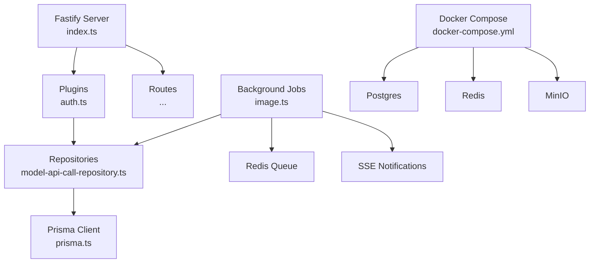
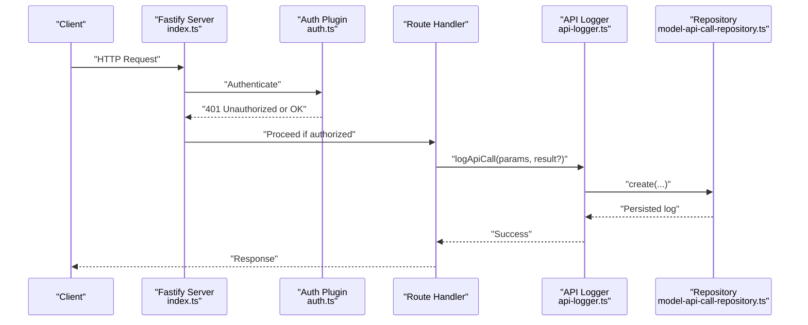
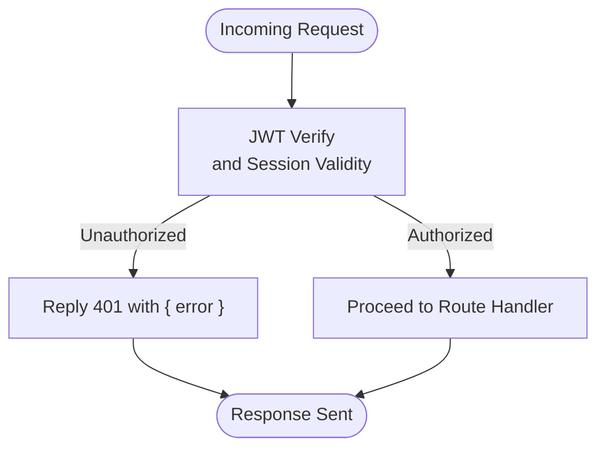
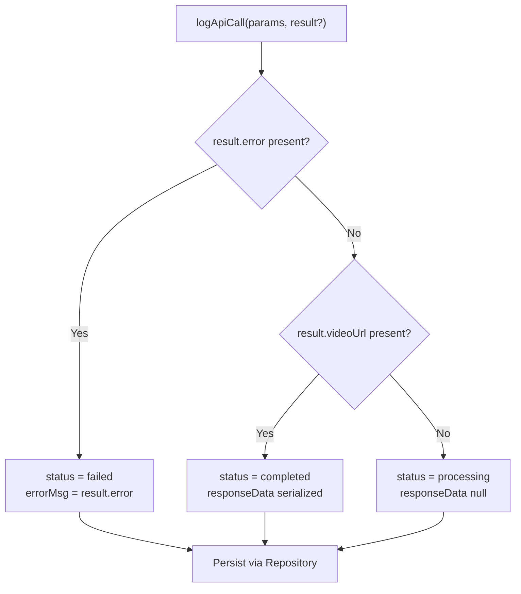
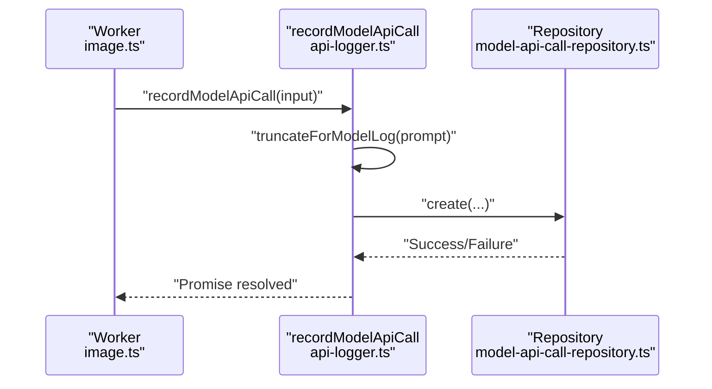
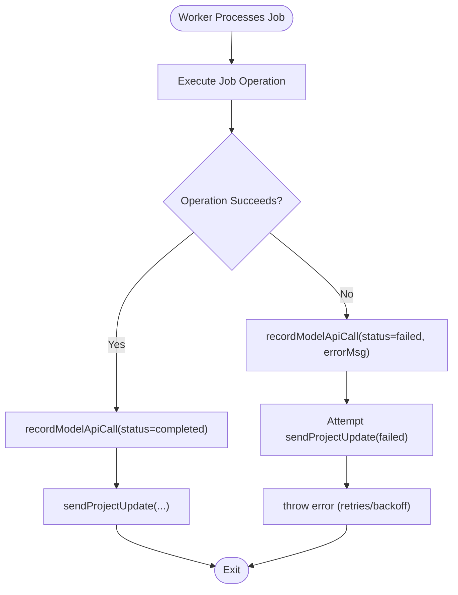
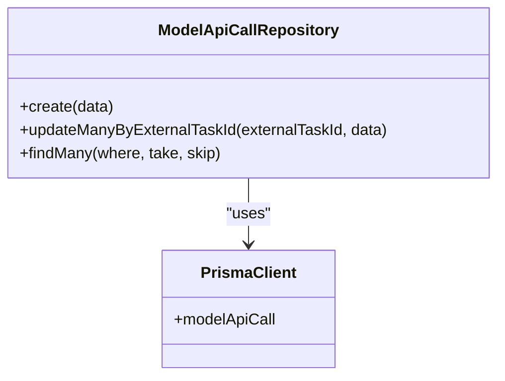
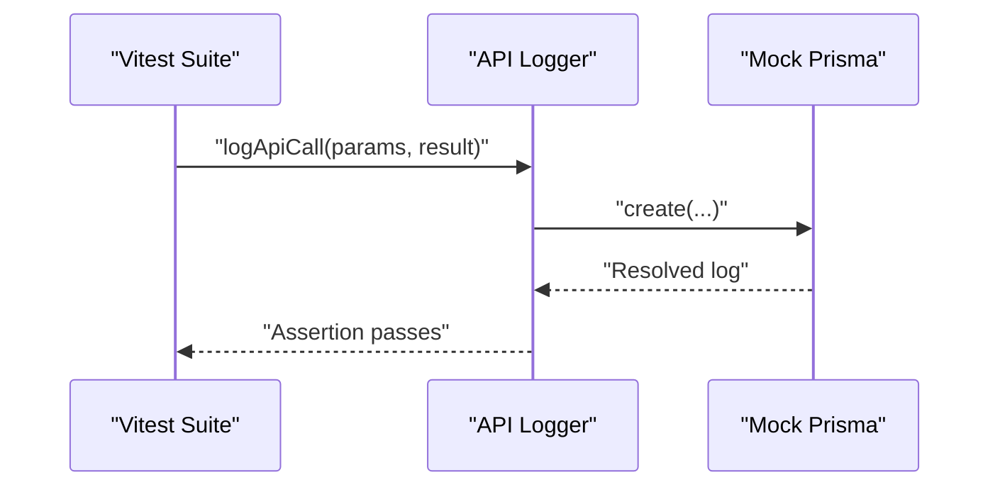
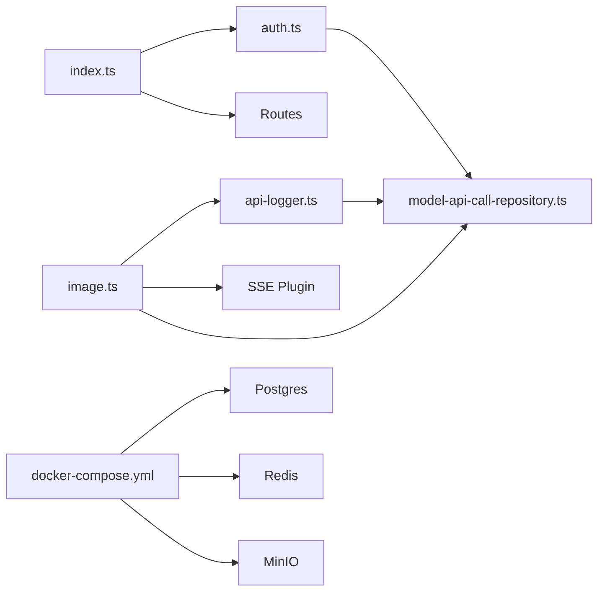

# Error Handling and Logging

<cite>
**Referenced Files in This Document**
- [index.ts](file://packages/backend/src/index.ts)
- [auth.ts](file://packages/backend/src/plugins/auth.ts)
- [http-errors.ts](file://packages/backend/src/lib/http-errors.ts)
- [api-logger.ts](file://packages/backend/src/services/ai/api-logger.ts)
- [image.ts](file://packages/backend/src/queues/image.ts)
- [model-api-call-repository.ts](file://packages/backend/src/repositories/model-api-call-repository.ts)
- [prisma.ts](file://packages/backend/src/lib/prisma.ts)
- [docker-compose.yml](file://docker/docker-compose.yml)
- [package.json](file://packages/backend/package.json)
- [http-errors.test.ts](file://packages/backend/tests/http-errors.test.ts)
- [api-logger.test.ts](file://packages/backend/tests/api-logger.test.ts)
</cite>

## Table of Contents

1. [Introduction](#introduction)
2. [Project Structure](#project-structure)
3. [Core Components](#core-components)
4. [Architecture Overview](#architecture-overview)
5. [Detailed Component Analysis](#detailed-component-analysis)
6. [Dependency Analysis](#dependency-analysis)
7. [Performance Considerations](#performance-considerations)
8. [Troubleshooting Guide](#troubleshooting-guide)
9. [Conclusion](#conclusion)

## Introduction

This document provides comprehensive error handling and logging guidance for the backend system. It documents custom HTTP error patterns, standardized error response formatting, error propagation across middleware and routes, structured logging for API calls and model interactions, and practical strategies for error tracking, monitoring, and alerting. It also covers debugging techniques, stack trace handling, sensitive data sanitization, graceful degradation, circuit breaker patterns, fallback mechanisms, performance monitoring, error rate tracking, and system health checks. Integration points with external monitoring tools and log analysis platforms are outlined to support operational excellence.

## Project Structure

The backend is built on Fastify with a modular structure:

- Server bootstrap and routing registration
- Authentication plugin enforcing JWT verification and ownership checks
- API logging service for model and API call telemetry
- Background job queue with retry/backoff and SSE notifications
- Repository layer for database operations via Prisma
- Docker Compose for local infrastructure health checks

**Diagram sources**

- [index.ts:35-126](file://packages/backend/src/index.ts#L35-L126)
- [auth.ts:12-35](file://packages/backend/src/plugins/auth.ts#L12-L35)
- [model-api-call-repository.ts:4-32](file://packages/backend/src/repositories/model-api-call-repository.ts#L4-L32)
- [prisma.ts:1-4](file://packages/backend/src/lib/prisma.ts#L1-L4)
- [image.ts:19-287](file://packages/backend/src/queues/image.ts#L19-L287)
- [docker-compose.yml:3-71](file://docker/docker-compose.yml#L3-L71)

**Section sources**

- [index.ts:1-136](file://packages/backend/src/index.ts#L1-L136)
- [auth.ts:1-98](file://packages/backend/src/plugins/auth.ts#L1-L98)
- [api-logger.ts:1-165](file://packages/backend/src/services/ai/api-logger.ts#L1-L165)
- [image.ts:1-302](file://packages/backend/src/queues/image.ts#L1-L302)
- [model-api-call-repository.ts:1-32](file://packages/backend/src/repositories/model-api-call-repository.ts#L1-L32)
- [prisma.ts:1-4](file://packages/backend/src/lib/prisma.ts#L1-L4)
- [docker-compose.yml:1-71](file://docker/docker-compose.yml#L1-L71)

## Core Components

- Custom HTTP error payload for permission-related failures
- Standardized API call logging with status transitions and sanitized prompt truncation
- Structured model API call logging with cost, duration, and error fields
- Authentication plugin returning consistent 401 responses
- Background job worker with retry/backoff, SSE notifications, and failure recording
- Repository abstraction for database operations
- Health checks for Postgres, Redis, and MinIO

Key implementation references:

- Unified 403 payload definition
  - [http-errors.ts:1-3](file://packages/backend/src/lib/http-errors.ts#L1-L3)
- Authentication plugin error responses
  - [auth.ts:16-31](file://packages/backend/src/plugins/auth.ts#L16-L31)
- API logger service and model log truncation
  - [api-logger.ts:36-61](file://packages/backend/src/services/ai/api-logger.ts#L36-L61)
  - [api-logger.ts:16-20](file://packages/backend/src/services/ai/api-logger.ts#L16-L20)
- Background job worker error handling and recording
  - [image.ts:249-281](file://packages/backend/src/queues/image.ts#L249-L281)
- Repository for model API call persistence
  - [model-api-call-repository.ts:7-28](file://packages/backend/src/repositories/model-api-call-repository.ts#L7-L28)

**Section sources**

- [http-errors.ts:1-3](file://packages/backend/src/lib/http-errors.ts#L1-L3)
- [auth.ts:16-31](file://packages/backend/src/plugins/auth.ts#L16-L31)
- [api-logger.ts:16-61](file://packages/backend/src/services/ai/api-logger.ts#L16-L61)
- [image.ts:249-281](file://packages/backend/src/queues/image.ts#L249-L281)
- [model-api-call-repository.ts:7-28](file://packages/backend/src/repositories/model-api-call-repository.ts#L7-L28)

## Architecture Overview

The system integrates Fastify middleware and routes with a robust logging and error propagation strategy:

- Server initialization enables structured logging and registers plugins and routes
- Authentication plugin enforces JWT verification and ownership checks, returning standardized 401 responses
- API logging service records model and API calls with consistent fields and status transitions
- Background workers process jobs with retry/backoff, record outcomes, and notify clients via SSE
- Repositories encapsulate database operations; Prisma client handles persistence

**Diagram sources**

- [index.ts:44-126](file://packages/backend/src/index.ts#L44-L126)
- [auth.ts:12-35](file://packages/backend/src/plugins/auth.ts#L12-L35)
- [api-logger.ts:81-101](file://packages/backend/src/services/ai/api-logger.ts#L81-L101)
- [model-api-call-repository.ts:7-9](file://packages/backend/src/repositories/model-api-call-repository.ts#L7-L9)

## Detailed Component Analysis

### HTTP Error Classes and Propagation

- Permission-denied response body is standardized for 403 scenarios
- Authentication plugin returns consistent 401 responses when JWT verification fails or user session is invalid
- Route handlers should propagate these standardized payloads to maintain uniformity

**Diagram sources**

- [auth.ts:16-31](file://packages/backend/src/plugins/auth.ts#L16-L31)
- [http-errors.ts:1-3](file://packages/backend/src/lib/http-errors.ts#L1-L3)

**Section sources**

- [auth.ts:16-31](file://packages/backend/src/plugins/auth.ts#L16-L31)
- [http-errors.ts:1-3](file://packages/backend/src/lib/http-errors.ts#L1-L3)

### API Call Logging and Status Transitions

- The API logger service defines a unified schema for model and API call logs
- Status transitions:
  - processing when no result is provided
  - failed when result.error is present
  - completed when result.videoUrl exists
- Prompt truncation prevents oversized fields in logs
- JSON serialization is applied to requestParams and responseData for structured storage

**Diagram sources**

- [api-logger.ts:81-101](file://packages/backend/src/services/ai/api-logger.ts#L81-L101)
- [api-logger.ts:16-20](file://packages/backend/src/services/ai/api-logger.ts#L16-L20)

**Section sources**

- [api-logger.ts:63-101](file://packages/backend/src/services/ai/api-logger.ts#L63-L101)
- [api-logger.ts:16-20](file://packages/backend/src/services/ai/api-logger.ts#L16-L20)

### Model API Call Logging and Truncation

- recordModelApiCall persists unified model call logs with optional cost and truncated prompt
- truncateForModelLog ensures prompt length remains within configured bounds
- Errors during persistence are caught and logged to prevent masking underlying issues

**Diagram sources**

- [image.ts:75-88](file://packages/backend/src/queues/image.ts#L75-L88)
- [api-logger.ts:36-61](file://packages/backend/src/services/ai/api-logger.ts#L36-L61)
- [model-api-call-repository.ts:7-9](file://packages/backend/src/repositories/model-api-call-repository.ts#L7-L9)

**Section sources**

- [api-logger.ts:36-61](file://packages/backend/src/services/ai/api-logger.ts#L36-L61)
- [image.ts:75-88](file://packages/backend/src/queues/image.ts#L75-L88)

### Background Job Error Handling and SSE Notifications

- Workers process jobs with retry/backoff and exponential delays
- On success, outcomes are recorded and SSE notifications are sent
- On failure, outcomes are recorded with status failed and error messages, and SSE failure notifications are attempted with guarded logging

**Diagram sources**

- [image.ts:42-287](file://packages/backend/src/queues/image.ts#L42-L287)
- [image.ts:249-281](file://packages/backend/src/queues/image.ts#L249-L281)

**Section sources**

- [image.ts:19-287](file://packages/backend/src/queues/image.ts#L19-L287)

### Repository and Database Layer

- ModelApiCallRepository encapsulates create, updateManyByExternalTaskId, and findMany operations
- Prisma client is initialized centrally and injected into repositories

**Diagram sources**

- [model-api-call-repository.ts:4-32](file://packages/backend/src/repositories/model-api-call-repository.ts#L4-L32)
- [prisma.ts:1-4](file://packages/backend/src/lib/prisma.ts#L1-L4)

**Section sources**

- [model-api-call-repository.ts:4-32](file://packages/backend/src/repositories/model-api-call-repository.ts#L4-L32)
- [prisma.ts:1-4](file://packages/backend/src/lib/prisma.ts#L1-L4)

### Testing Patterns for Error Handling and Logging

- Tests validate status transitions based on result presence and error fields
- Tests assert prompt truncation behavior and repository interactions
- Tests mock Prisma to isolate logging service behavior

**Diagram sources**

- [api-logger.test.ts:29-136](file://packages/backend/tests/api-logger.test.ts#L29-L136)

**Section sources**

- [http-errors.test.ts:1-9](file://packages/backend/tests/http-errors.test.ts#L1-L9)
- [api-logger.test.ts:29-136](file://packages/backend/tests/api-logger.test.ts#L29-L136)

## Dependency Analysis

- Fastify server initializes with structured logging enabled and registers plugins and routes
- Authentication plugin depends on user and ownership repositories
- API logging service depends on the model API call repository
- Background job worker depends on image generation services, SSE plugin, and the model API call logger
- Infrastructure services (Postgres, Redis, MinIO) are managed via Docker Compose with health checks

**Diagram sources**

- [index.ts:44-126](file://packages/backend/src/index.ts#L44-L126)
- [auth.ts:12-35](file://packages/backend/src/plugins/auth.ts#L12-L35)
- [api-logger.ts:3-5](file://packages/backend/src/services/ai/api-logger.ts#L3-L5)
- [image.ts:10-13](file://packages/backend/src/queues/image.ts#L10-L13)
- [docker-compose.yml:3-71](file://docker/docker-compose.yml#L3-L71)

**Section sources**

- [index.ts:44-126](file://packages/backend/src/index.ts#L44-L126)
- [auth.ts:12-35](file://packages/backend/src/plugins/auth.ts#L12-L35)
- [api-logger.ts:3-5](file://packages/backend/src/services/ai/api-logger.ts#L3-L5)
- [image.ts:10-13](file://packages/backend/src/queues/image.ts#L10-L13)
- [docker-compose.yml:3-71](file://docker/docker-compose.yml#L3-L71)

## Performance Considerations

- Request timeouts and connection handling are configured at the server level to avoid zombie connections while enabling long-lived SSE
- Background job workers use retry/backoff with exponential delays to balance resilience and resource usage
- Prompt truncation reduces payload sizes and avoids database field limits
- Health checks for Postgres, Redis, and MinIO support quick detection of infrastructure issues

Recommendations:

- Monitor queue depth and worker concurrency to prevent backlog growth
- Track error rates per model/provider to identify failing integrations
- Use pagination and filtering in API logs queries to keep latency low

**Section sources**

- [index.ts:35-42](file://packages/backend/src/index.ts#L35-L42)
- [image.ts:21-27](file://packages/backend/src/queues/image.ts#L21-L27)
- [api-logger.ts:16-20](file://packages/backend/src/services/ai/api-logger.ts#L16-L20)
- [docker-compose.yml:15-50](file://docker/docker-compose.yml#L15-L50)

## Troubleshooting Guide

Common issues and resolutions:

- Authentication failures
  - Ensure JWT secret is configured and tokens are valid; verify user session existence
  - Reference: [auth.ts:16-31](file://packages/backend/src/plugins/auth.ts#L16-L31)
- Unauthorized access attempts
  - Confirm ownership checks pass for requested resources
  - Reference: [auth.ts:38-97](file://packages/backend/src/plugins/auth.ts#L38-L97)
- API logging anomalies
  - Verify status transitions align with result presence; confirm prompt truncation thresholds
  - Reference: [api-logger.ts:81-101](file://packages/backend/src/services/ai/api-logger.ts#L81-L101), [api-logger.ts:16-20](file://packages/backend/src/services/ai/api-logger.ts#L16-L20)
- Background job failures
  - Inspect worker logs for failed events; confirm retry/backoff behavior and SSE notification attempts
  - Reference: [image.ts:293-295](file://packages/backend/src/queues/image.ts#L293-L295), [image.ts:35-40](file://packages/backend/src/queues/image.ts#L35-L40)
- Database persistence errors
  - Validate Prisma client configuration and repository calls
  - Reference: [prisma.ts:1-4](file://packages/backend/src/lib/prisma.ts#L1-L4), [model-api-call-repository.ts:7-28](file://packages/backend/src/repositories/model-api-call-repository.ts#L7-L28)
- Infrastructure readiness
  - Use Docker health checks to verify Postgres, Redis, and MinIO availability
  - Reference: [docker-compose.yml:15-50](file://docker/docker-compose.yml#L15-L50)

Debugging techniques:

- Enable structured logging at the server level and correlate request IDs across services
- Capture stack traces for unhandled exceptions and surface minimal context without exposing secrets
- Sanitize sensitive fields (tokens, passwords, URLs) before logging
- Use paginated queries and filters to investigate historical logs efficiently

**Section sources**

- [auth.ts:16-31](file://packages/backend/src/plugins/auth.ts#L16-L31)
- [auth.ts:38-97](file://packages/backend/src/plugins/auth.ts#L38-L97)
- [api-logger.ts:81-101](file://packages/backend/src/services/ai/api-logger.ts#L81-L101)
- [api-logger.ts:16-20](file://packages/backend/src/services/ai/api-logger.ts#L16-L20)
- [image.ts:293-295](file://packages/backend/src/queues/image.ts#L293-L295)
- [image.ts:35-40](file://packages/backend/src/queues/image.ts#L35-L40)
- [prisma.ts:1-4](file://packages/backend/src/lib/prisma.ts#L1-L4)
- [model-api-call-repository.ts:7-28](file://packages/backend/src/repositories/model-api-call-repository.ts#L7-L28)
- [docker-compose.yml:15-50](file://docker/docker-compose.yml#L15-L50)

## Conclusion

The backend implements a cohesive error handling and logging strategy centered on:

- Standardized HTTP error responses for authentication and permission failures
- Structured API and model call logging with consistent fields, status transitions, and prompt truncation
- Robust background job processing with retry/backoff, SSE notifications, and failure recording
- Repository abstraction and centralized Prisma client for reliable persistence
- Operational readiness through Docker health checks and server-level logging configuration

These patterns provide a solid foundation for observability, debugging, and resilient operations. Extending the system with external monitoring and log aggregation platforms involves exporting metrics and logs to supported sinks and configuring alerting rules based on error rates, latency, and health indicators.
