# AI Integration Services

<cite>
**Referenced Files in This Document**
- [llm-provider.ts](file://packages/backend/src/services/ai/llm-provider.ts)
- [llm-factory.ts](file://packages/backend/src/services/ai/llm-factory.ts)
- [llm-call-wrapper.ts](file://packages/backend/src/services/ai/llm-call-wrapper.ts)
- [deepseek-provider.ts](file://packages/backend/src/services/ai/deepseek-provider.ts)
- [deepseek-client.ts](file://packages/backend/src/services/ai/deepseek-client.ts)
- [deepseek-balance.ts](file://packages/backend/src/services/ai/deepseek-balance.ts)
- [deepseek.ts](file://packages/backend/src/services/ai/deepseek.ts)
- [seedance.ts](file://packages/backend/src/services/ai/seedance.ts)
- [wan26.ts](file://packages/backend/src/services/ai/wan26.ts)
- [script-visual-enrichment.ts](file://packages/backend/src/services/ai/script-visual-enrichment.ts)
- [character-slot-image-prompt.ts](file://packages/backend/src/services/ai/character-slot-image-prompt.ts)
- [scene-prompt-optimize.ts](file://packages/backend/src/services/ai/scene-prompt-optimize.ts)
- [api-logger.ts](file://packages/backend/src/services/ai/api-logger.ts)
- [model-call-log.ts](file://packages/backend/src/services/ai/model-call-log.ts)
- [stats-service.ts](file://packages/backend/src/services/stats-service.ts)
- [deepseek.test.ts](file://packages/backend/tests/deepseek.test.ts)
- [seedance-scene-request.test.ts](file://packages/backend/tests/seedance-scene-request.test.ts)
- [seedance-optimizer.test.ts](file://packages/backend/tests/seedance-optimizer.test.ts)
- [seedance-audio.test.ts](file://packages/backend/tests/seedance-audio.test.ts)
- [seedance.test.ts](file://packages/backend/tests/seedance.test.ts)
- [wan26.test.ts](file://packages/backend/tests/wan26.test.ts)
</cite>

## Table of Contents

1. [Introduction](#introduction)
2. [Project Structure](#project-structure)
3. [Core Components](#core-components)
4. [Architecture Overview](#architecture-overview)
5. [Detailed Component Analysis](#detailed-component-analysis)
6. [Dependency Analysis](#dependency-analysis)
7. [Performance Considerations](#performance-considerations)
8. [Troubleshooting Guide](#troubleshooting-guide)
9. [Conclusion](#conclusion)
10. [Appendices](#appendices)

## Introduction

This document describes the AI integration services that power the system’s AI capabilities. It focuses on:

- AI provider abstraction via a unified LLM provider interface and factory pattern
- DeepSeek service wrappers and cost calculation
- Seedance 2.0 and Wan 2.6 video generation APIs
- LLM call retry and error handling strategies
- AI response parsing mechanisms for structured outputs
- Script generation workflows, visual enrichment, prompt optimization, and model selection
- Configuration management, rate limiting, fallback strategies, and performance monitoring

## Project Structure

The AI integration resides under packages/backend/src/services/ai and includes:

- Provider abstraction and factory for LLMs
- DeepSeek provider implementation and client utilities
- Seedance 2.0 and Wan 2.6 video generation integrations
- LLM call wrapper with retry and logging
- Script visual enrichment and prompt optimization utilities
- API logging and model call logging
- Statistics service for balance retrieval and cost monitoring

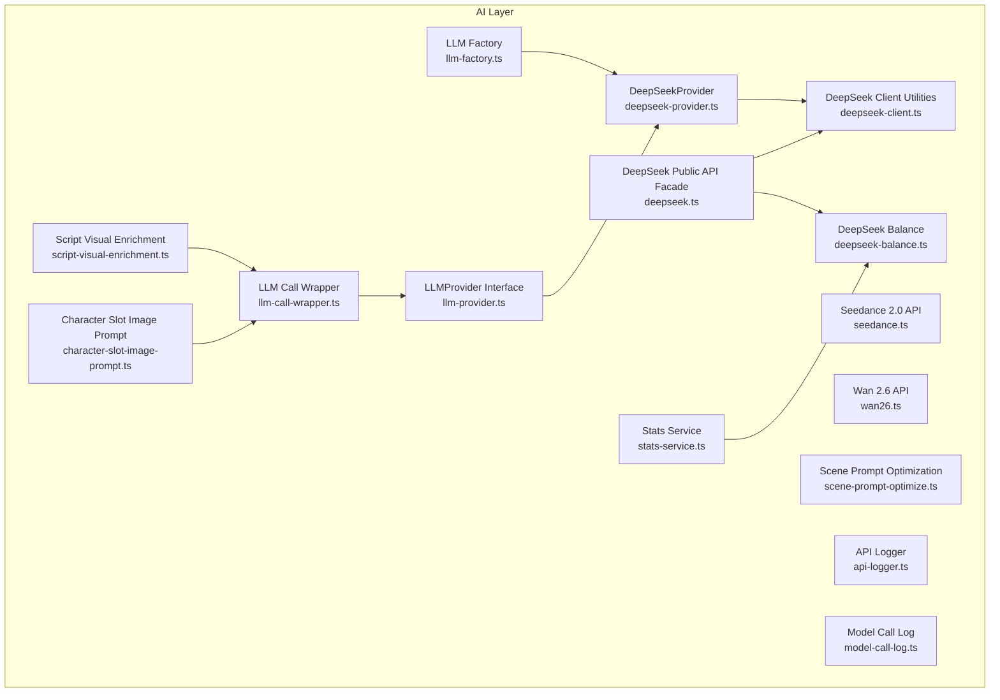

**Diagram sources**

- [llm-provider.ts:66-82](file://packages/backend/src/services/ai/llm-provider.ts#L66-L82)
- [llm-factory.ts:17-35](file://packages/backend/src/services/ai/llm-factory.ts#L17-L35)
- [deepseek-provider.ts:21-88](file://packages/backend/src/services/ai/deepseek-provider.ts#L21-L88)
- [deepseek-client.ts:45-63](file://packages/backend/src/services/ai/deepseek-client.ts#L45-L63)
- [deepseek-balance.ts:11-33](file://packages/backend/src/services/ai/deepseek-balance.ts#L11-L33)
- [deepseek.ts:1-30](file://packages/backend/src/services/ai/deepseek.ts#L1-L30)
- [seedance.ts:1-231](file://packages/backend/src/services/ai/seedance.ts#L1-L231)
- [wan26.ts:1-97](file://packages/backend/src/services/ai/wan26.ts#L1-L97)
- [llm-call-wrapper.ts:51-94](file://packages/backend/src/services/ai/llm-call-wrapper.ts#L51-L94)
- [script-visual-enrichment.ts:83-118](file://packages/backend/src/services/ai/script-visual-enrichment.ts#L83-L118)
- [character-slot-image-prompt.ts:76-93](file://packages/backend/src/services/ai/character-slot-image-prompt.ts#L76-L93)
- [scene-prompt-optimize.ts](file://packages/backend/src/services/ai/scene-prompt-optimize.ts)
- [api-logger.ts](file://packages/backend/src/services/ai/api-logger.ts)
- [model-call-log.ts](file://packages/backend/src/services/ai/model-call-log.ts)
- [stats-service.ts:240-248](file://packages/backend/src/services/stats-service.ts#L240-L248)

**Section sources**

- [llm-provider.ts:1-86](file://packages/backend/src/services/ai/llm-provider.ts#L1-L86)
- [llm-factory.ts:1-68](file://packages/backend/src/services/ai/llm-factory.ts#L1-L68)
- [deepseek.ts:1-30](file://packages/backend/src/services/ai/deepseek.ts#L1-L30)

## Core Components

- LLM Provider Abstraction: Defines roles, messages, usage statistics, completion results, provider configuration, and the provider interface contract.
- LLM Factory: Creates provider instances based on configuration and environment variables, currently supporting DeepSeek and stubbed placeholders for OpenAI/Claude.
- DeepSeek Provider: Implements the LLMProvider interface using an OpenAI-compatible client, with standardized error mapping for auth and rate limit conditions and token usage cost calculation.
- LLM Call Wrapper: Provides a generic retry mechanism, error classification, and model call logging for LLM interactions.
- Seedance 2.0: Encapsulates submission, polling, and completion waiting for video generation tasks, including base64 conversion utilities and cost estimation.
- Wan 2.6: Encapsulates submission, polling, and completion waiting for video generation tasks with cost estimation.
- Script Visual Enrichment: Renders prompts, sends messages to the LLM, parses JSON responses, and tracks costs.
- Character Slot Image Prompt: Uses the LLM wrapper to produce image prompts for character slots with cost tracking.
- Scene Prompt Optimization: Exposes an optimization utility for scene prompts.
- API and Model Logging: Centralized logging for API interactions and model call metadata.
- Stats Service: Retrieves DeepSeek account balances and exposes availability and balance details.

**Section sources**

- [llm-provider.ts:6-82](file://packages/backend/src/services/ai/llm-provider.ts#L6-L82)
- [llm-factory.ts:17-67](file://packages/backend/src/services/ai/llm-factory.ts#L17-L67)
- [deepseek-provider.ts:21-88](file://packages/backend/src/services/ai/deepseek-provider.ts#L21-L88)
- [llm-call-wrapper.ts:20-94](file://packages/backend/src/services/ai/llm-call-wrapper.ts#L20-L94)
- [seedance.ts:124-231](file://packages/backend/src/services/ai/seedance.ts#L124-L231)
- [wan26.ts:26-97](file://packages/backend/src/services/ai/wan26.ts#L26-L97)
- [script-visual-enrichment.ts:83-118](file://packages/backend/src/services/ai/script-visual-enrichment.ts#L83-L118)
- [character-slot-image-prompt.ts:76-93](file://packages/backend/src/services/ai/character-slot-image-prompt.ts#L76-L93)
- [scene-prompt-optimize.ts](file://packages/backend/src/services/ai/scene-prompt-optimize.ts)
- [api-logger.ts](file://packages/backend/src/services/ai/api-logger.ts)
- [model-call-log.ts](file://packages/backend/src/services/ai/model-call-log.ts)
- [stats-service.ts:240-248](file://packages/backend/src/services/stats-service.ts#L240-L248)

## Architecture Overview

The AI integration follows a layered architecture:

- Provider Abstraction: A single interface for LLM interactions
- Provider Factory: Selects and instantiates providers based on configuration
- Provider Implementation: DeepSeek provider wraps an OpenAI-compatible client
- Call Wrapper: Adds retry, error handling, and logging around provider calls
- Domain Services: Visual enrichment, prompt optimization, and video generation integrations
- Logging and Monitoring: API logger and model call log for observability
- Configuration and Environment: Provider defaults and API keys loaded from environment variables

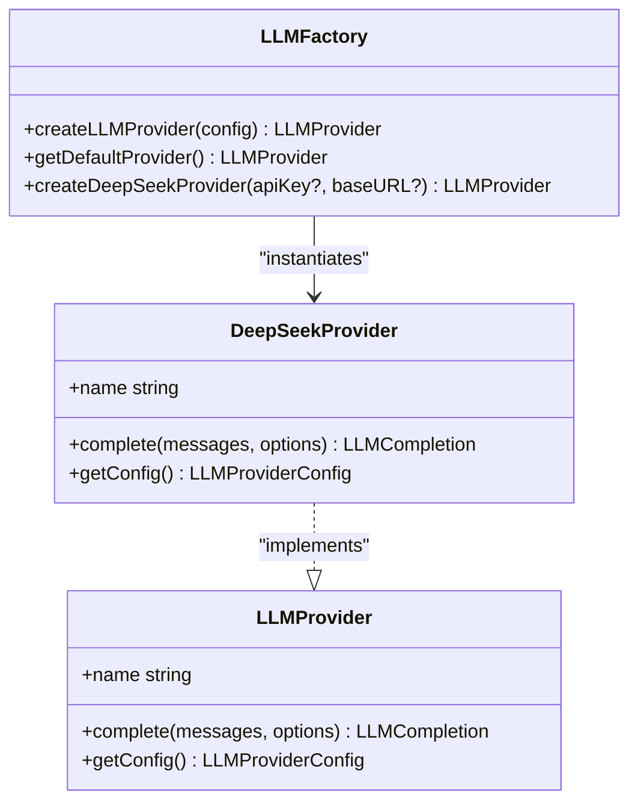

**Diagram sources**

- [llm-provider.ts:66-82](file://packages/backend/src/services/ai/llm-provider.ts#L66-L82)
- [deepseek-provider.ts:21-88](file://packages/backend/src/services/ai/deepseek-provider.ts#L21-L88)
- [llm-factory.ts:17-67](file://packages/backend/src/services/ai/llm-factory.ts#L17-L67)

## Detailed Component Analysis

### LLM Provider Abstraction and Factory

- Contract Definition: Roles, messages, usage metrics, completion results, provider configuration, and completion options define a portable interface for LLM interactions.
- Factory Pattern: Supports creation of providers from configuration and environment variables, with a default provider configured from environment variables. OpenAI and Claude are reserved for future implementation.

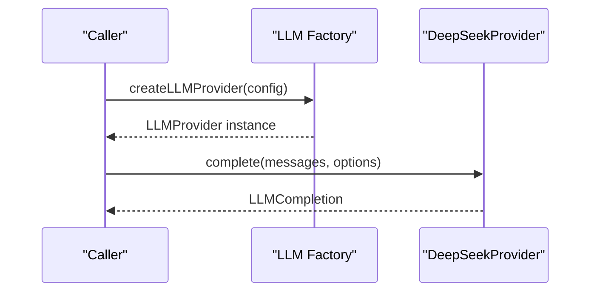

**Diagram sources**

- [llm-factory.ts:17-35](file://packages/backend/src/services/ai/llm-factory.ts#L17-L35)
- [deepseek-provider.ts:35-73](file://packages/backend/src/services/ai/deepseek-provider.ts#L35-L73)

**Section sources**

- [llm-provider.ts:6-82](file://packages/backend/src/services/ai/llm-provider.ts#L6-L82)
- [llm-factory.ts:17-67](file://packages/backend/src/services/ai/llm-factory.ts#L17-L67)

### DeepSeek Provider Implementation

- OpenAI-Compatible Client: Uses an OpenAI SDK client with configurable base URL and default model.
- Standardized Error Mapping: Converts HTTP errors into typed auth and rate limit errors.
- Usage Calculation: Computes token counts and estimated cost in RMB using provider utilities.

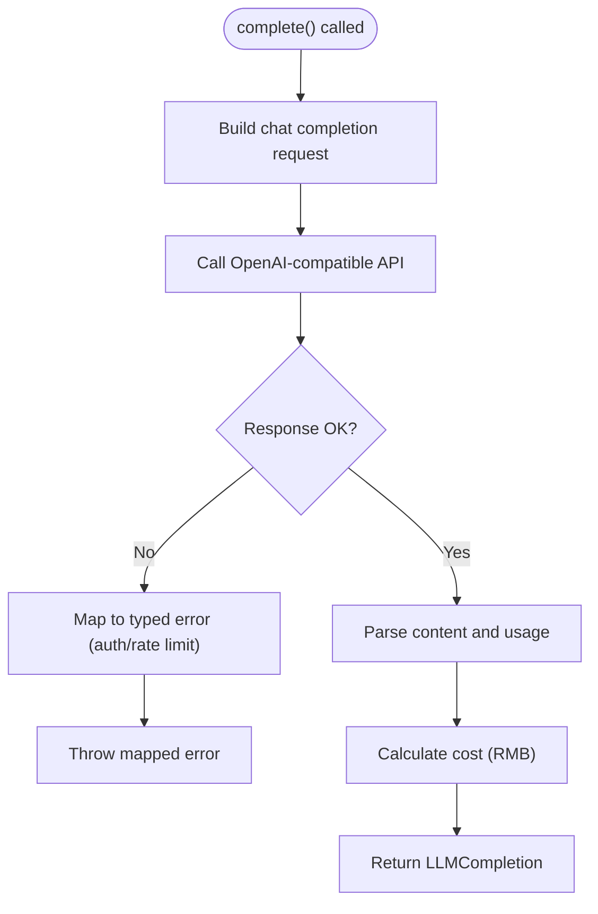

**Diagram sources**

- [deepseek-provider.ts:35-87](file://packages/backend/src/services/ai/deepseek-provider.ts#L35-L87)
- [deepseek-client.ts:45-63](file://packages/backend/src/services/ai/deepseek-client.ts#L45-L63)

**Section sources**

- [deepseek-provider.ts:21-88](file://packages/backend/src/services/ai/deepseek-provider.ts#L21-L88)
- [deepseek-client.ts:45-63](file://packages/backend/src/services/ai/deepseek-client.ts#L45-L63)

### LLM Call Wrapper and Retry Strategy

- Generic Wrapper: Accepts provider, messages, optional model, temperature, max tokens, and model log context.
- Retry Logic: Retries up to a configurable number of attempts on transient failures.
- Error Classification: Distinguishes auth and rate limit errors for specialized handling.
- Logging: Logs successful completions with cost and user prompt context.

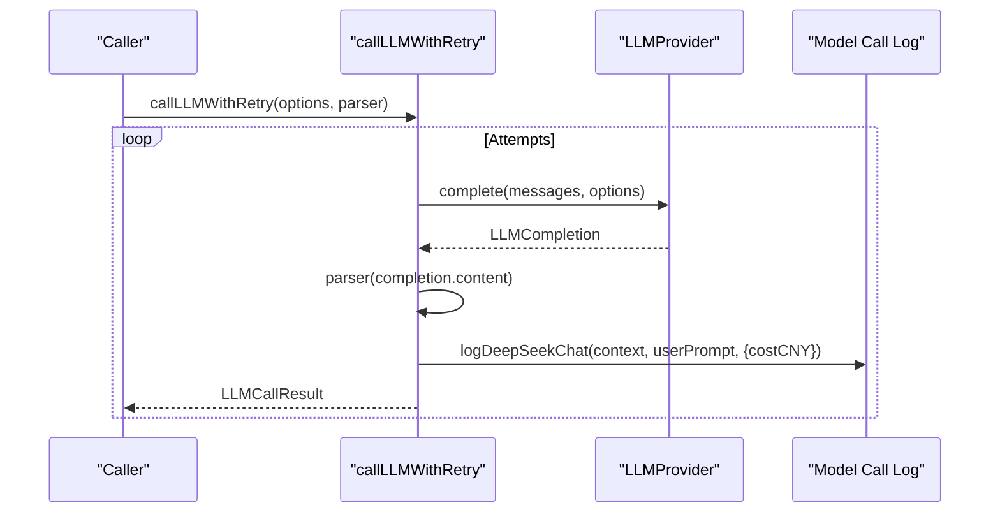

**Diagram sources**

- [llm-call-wrapper.ts:51-94](file://packages/backend/src/services/ai/llm-call-wrapper.ts#L51-L94)
- [model-call-log.ts](file://packages/backend/src/services/ai/model-call-log.ts)

**Section sources**

- [llm-call-wrapper.ts:20-94](file://packages/backend/src/services/ai/llm-call-wrapper.ts#L20-L94)

### DeepSeek Balance Retrieval

- Endpoint Access: Fetches account balance from the DeepSeek API using the configured API key.
- Response Parsing: Normalizes balance information into typed fields.
- Error Handling: Wraps network errors and returns availability flags.

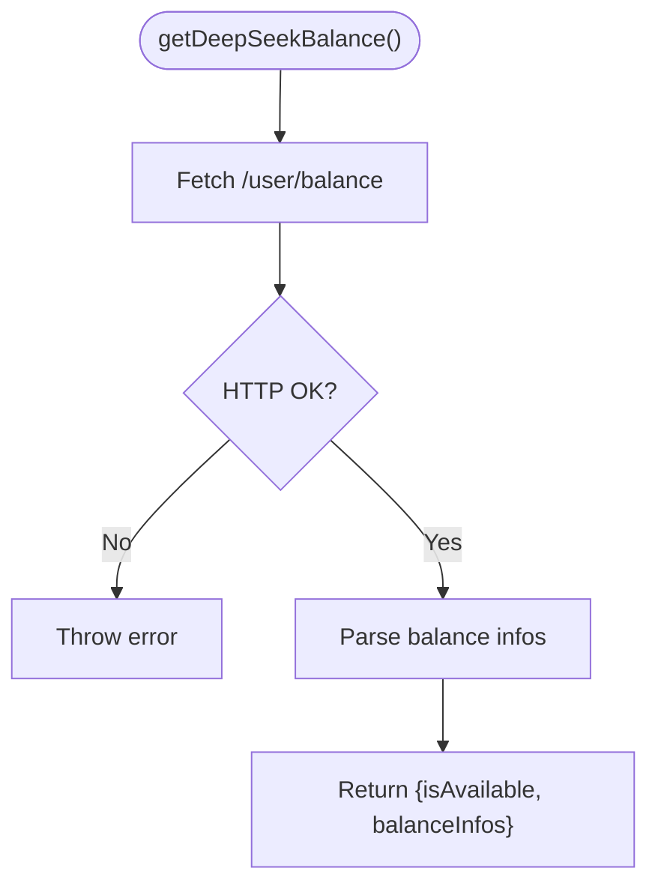

**Diagram sources**

- [deepseek-balance.ts:11-33](file://packages/backend/src/services/ai/deepseek-balance.ts#L11-L33)

**Section sources**

- [deepseek-balance.ts:1-33](file://packages/backend/src/services/ai/deepseek-balance.ts#L1-L33)
- [stats-service.ts:240-248](file://packages/backend/src/services/stats-service.ts#L240-L248)

### Seedance 2.0 Video Generation

- Request Building: Constructs content arrays with text, optional reference images (URL or base64), and parameters such as aspect ratio, duration, and resolution.
- Authentication: Uses Bearer token from environment variables.
- Task Submission: Posts to the generation endpoint and returns a task ID.
- Status Polling: Maps provider statuses to queued/processing/completed/failed and retrieves media URLs.
- Completion Waiting: Polls until completion or failure, with a configurable timeout.
- Cost Estimation: Computes approximate cost per second.

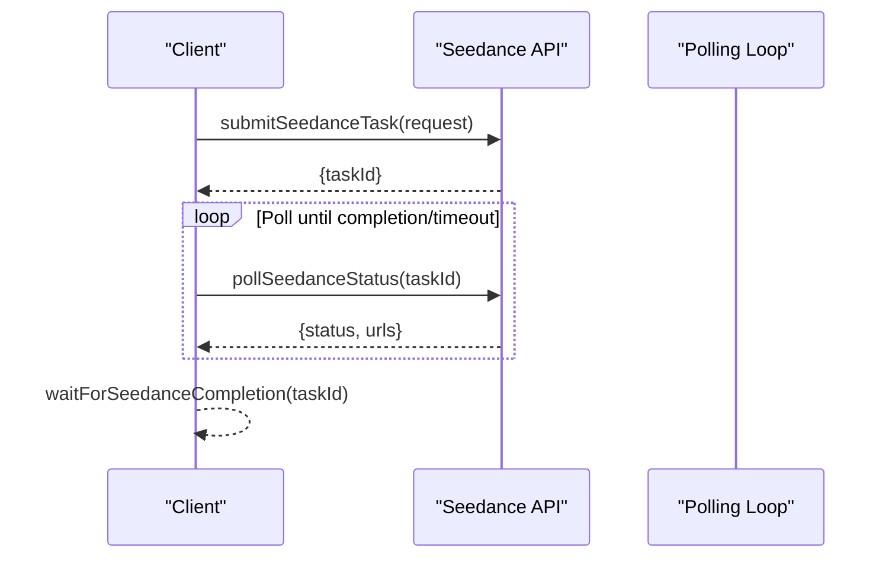

**Diagram sources**

- [seedance.ts:124-219](file://packages/backend/src/services/ai/seedance.ts#L124-L219)

**Section sources**

- [seedance.ts:1-231](file://packages/backend/src/services/ai/seedance.ts#L1-L231)

### Wan 2.6 Video Generation

- Request Building: Sends prompt, optional reference image, duration, and aspect ratio.
- Authentication: Uses Bearer token from environment variables.
- Task Submission and Polling: Similar polling pattern to Seedance with completion and failure handling.
- Cost Estimation: Computes cost per second.

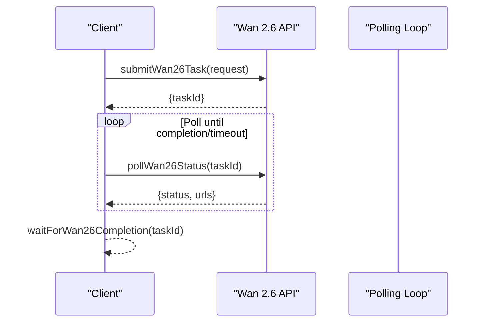

**Diagram sources**

- [wan26.ts:26-90](file://packages/backend/src/services/ai/wan26.ts#L26-L90)

**Section sources**

- [wan26.ts:1-97](file://packages/backend/src/services/ai/wan26.ts#L1-L97)

### Script Visual Enrichment Workflow

- Prompt Rendering: Uses a prompt registry to render system and user prompts tailored for visual enrichment.
- LLM Interaction: Sends messages to the default provider and parses JSON text from the response.
- Cost Tracking: Returns cost information alongside the enriched JSON text.

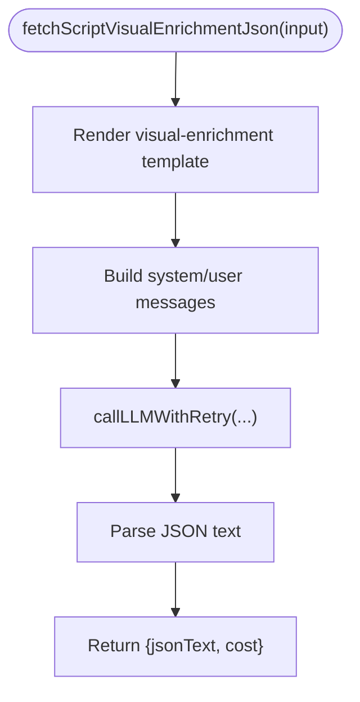

**Diagram sources**

- [script-visual-enrichment.ts:83-118](file://packages/backend/src/services/ai/script-visual-enrichment.ts#L83-L118)
- [llm-call-wrapper.ts:51-94](file://packages/backend/src/services/ai/llm-call-wrapper.ts#L51-L94)

**Section sources**

- [script-visual-enrichment.ts:83-118](file://packages/backend/src/services/ai/script-visual-enrichment.ts#L83-L118)

### Character Slot Image Prompt Generation

- Prompt Construction: Builds a prompt for generating image prompts for character slots.
- LLM Interaction: Uses the LLM wrapper with a parser to extract the resulting prompt.
- Cost Tracking: Returns cost alongside the generated prompt.

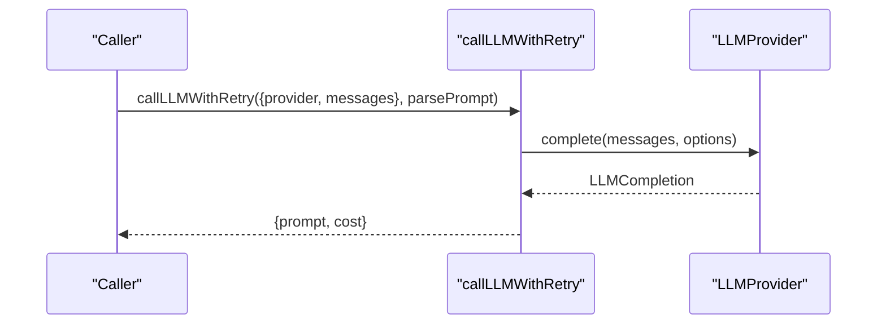

**Diagram sources**

- [character-slot-image-prompt.ts:76-93](file://packages/backend/src/services/ai/character-slot-image-prompt.ts#L76-L93)
- [llm-call-wrapper.ts:51-94](file://packages/backend/src/services/ai/llm-call-wrapper.ts#L51-L94)

**Section sources**

- [character-slot-image-prompt.ts:76-93](file://packages/backend/src/services/ai/character-slot-image-prompt.ts#L76-L93)

### Prompt Optimization

- Optimization Utility: Exposes a function to optimize scene prompts for better generation outcomes.

**Section sources**

- [scene-prompt-optimize.ts](file://packages/backend/src/services/ai/scene-prompt-optimize.ts)

### API and Model Logging

- API Logger: Centralized logging for API interactions.
- Model Call Log: Logs model call metadata including cost and user prompts for auditability and debugging.

**Section sources**

- [api-logger.ts](file://packages/backend/src/services/ai/api-logger.ts)
- [model-call-log.ts](file://packages/backend/src/services/ai/model-call-log.ts)

## Dependency Analysis

- Provider Coupling: DeepSeek provider depends on the OpenAI SDK client and provider utilities for cost calculation and error mapping.
- Factory Cohesion: Factory encapsulates provider instantiation logic and environment-driven defaults.
- Wrapper Dependencies: LLM call wrapper depends on provider interface, constants for retries and delays, and model call logging.
- Domain Services: Visual enrichment and character slot prompt generation depend on the LLM wrapper and prompt registry.
- Monitoring: Stats service depends on balance retrieval for availability checks.

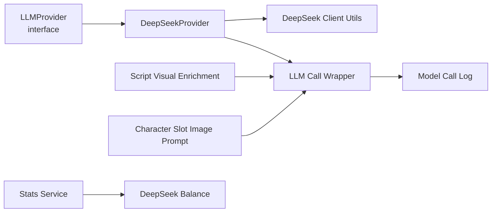

**Diagram sources**

- [llm-provider.ts:66-82](file://packages/backend/src/services/ai/llm-provider.ts#L66-L82)
- [deepseek-provider.ts:21-88](file://packages/backend/src/services/ai/deepseek-provider.ts#L21-L88)
- [llm-call-wrapper.ts:51-94](file://packages/backend/src/services/ai/llm-call-wrapper.ts#L51-L94)
- [script-visual-enrichment.ts:83-118](file://packages/backend/src/services/ai/script-visual-enrichment.ts#L83-L118)
- [character-slot-image-prompt.ts:76-93](file://packages/backend/src/services/ai/character-slot-image-prompt.ts#L76-L93)
- [stats-service.ts:240-248](file://packages/backend/src/services/stats-service.ts#L240-L248)
- [deepseek-balance.ts:11-33](file://packages/backend/src/services/ai/deepseek-balance.ts#L11-L33)

**Section sources**

- [llm-factory.ts:17-35](file://packages/backend/src/services/ai/llm-factory.ts#L17-L35)
- [deepseek-provider.ts:21-88](file://packages/backend/src/services/ai/deepseek-provider.ts#L21-L88)
- [llm-call-wrapper.ts:51-94](file://packages/backend/src/services/ai/llm-call-wrapper.ts#L51-L94)
- [script-visual-enrichment.ts:83-118](file://packages/backend/src/services/ai/script-visual-enrichment.ts#L83-L118)
- [character-slot-image-prompt.ts:76-93](file://packages/backend/src/services/ai/character-slot-image-prompt.ts#L76-L93)
- [stats-service.ts:240-248](file://packages/backend/src/services/stats-service.ts#L240-L248)

## Performance Considerations

- Token and Cost Awareness: Providers compute usage and cost; ensure to pass appropriate maxTokens and monitor costCNY for budget control.
- Retry Strategy: Configure maxRetries and backoff delays to balance resilience and latency.
- Batch Operations: For Seedance/Wan 2.6, batch tasks and manage concurrency to avoid provider throttling.
- Prompt Efficiency: Use prompt optimization and concise templates to reduce token usage and latency.
- Caching: Consider caching frequently used prompts or intermediate results where applicable.

## Troubleshooting Guide

Common issues and strategies:

- Authentication Failures: Mapped to typed auth errors; verify API keys and base URLs.
- Rate Limiting: Mapped to typed rate limit errors; implement exponential backoff and queueing.
- Network Errors: Wrap provider calls with retry logic; surface meaningful error messages.
- Timeout Handling: Both Seedance and Wan 2.6 include timeouts; adjust maxWaitMs based on expected durations.
- Logging and Observability: Use model call logs and API logger to diagnose failures and track costs.

**Section sources**

- [deepseek-provider.ts:63-72](file://packages/backend/src/services/ai/deepseek-provider.ts#L63-L72)
- [seedance.ts:194-219](file://packages/backend/src/services/ai/seedance.ts#L194-L219)
- [wan26.ts:68-90](file://packages/backend/src/services/ai/wan26.ts#L68-L90)
- [llm-call-wrapper.ts:93-94](file://packages/backend/src/services/ai/llm-call-wrapper.ts#L93-L94)

## Conclusion

The AI integration layer provides a robust, extensible foundation for interacting with multiple AI providers and services. The LLM provider abstraction and factory enable easy addition of new providers, while the call wrapper, logging, and domain-specific services deliver reliable workflows for script generation, visual enrichment, and video generation. Proper configuration, rate limiting, and monitoring ensure predictable performance and cost control.

## Appendices

### Configuration Management

- Environment Variables:
  - DEEPSEEK_API_KEY: Required for DeepSeek provider and balance retrieval
  - DEEPSEEK_BASE_URL: Optional override for DeepSeek base URL
  - ARK_API_KEY: Required for Seedance 2.0
  - ARK_API_URL: Optional override for Seedance API base URL
  - ATLAS_API_KEY: Required for Wan 2.6
  - ATLAS_API_URL: Optional override for Wan 2.6 base URL

**Section sources**

- [llm-factory.ts:42-54](file://packages/backend/src/services/ai/llm-factory.ts#L42-L54)
- [seedance.ts:4-5](file://packages/backend/src/services/ai/seedance.ts#L4-L5)
- [wan26.ts:3-4](file://packages/backend/src/services/ai/wan26.ts#L3-L4)

### Rate Limiting and Fallback Strategies

- Rate Limiting: Provider maps 429/rate_limit to typed errors; implement exponential backoff and circuit breaker patterns.
- Fallbacks: For LLM calls, consider alternate providers or reduced complexity prompts; for video tasks, implement task queuing and alternative providers.

**Section sources**

- [deepseek-provider.ts:68-69](file://packages/backend/src/services/ai/deepseek-provider.ts#L68-L69)
- [llm-call-wrapper.ts:93-94](file://packages/backend/src/services/ai/llm-call-wrapper.ts#L93-L94)

### Performance Monitoring

- Cost Tracking: Use costCNY returned by providers and model call logs to monitor daily and per-task expenses.
- Balance Monitoring: Retrieve account balance periodically to proactively manage spending.

**Section sources**

- [deepseek-client.ts:45-55](file://packages/backend/src/services/ai/deepseek-client.ts#L45-L55)
- [stats-service.ts:240-248](file://packages/backend/src/services/stats-service.ts#L240-L248)

### Test Coverage Highlights

- DeepSeek Visual Enrichment: Validates system/user prompt construction and JSON parsing rules.
- Seedance: Tests task submission, status polling, and completion waiting.
- Seedance Optimizer and Audio: Exercises optimizer and audio generation flows.
- Wan 2.6: Validates task lifecycle and cost calculation.

**Section sources**

- [deepseek.test.ts:460-503](file://packages/backend/tests/deepseek.test.ts#L460-L503)
- [seedance-scene-request.test.ts](file://packages/backend/tests/seedance-scene-request.test.ts)
- [seedance-optimizer.test.ts](file://packages/backend/tests/seedance-optimizer.test.ts)
- [seedance-audio.test.ts](file://packages/backend/tests/seedance-audio.test.ts)
- [seedance.test.ts](file://packages/backend/tests/seedance.test.ts)
- [wan26.test.ts](file://packages/backend/tests/wan26.test.ts)
