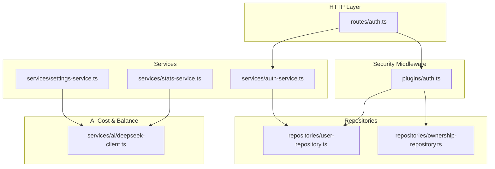
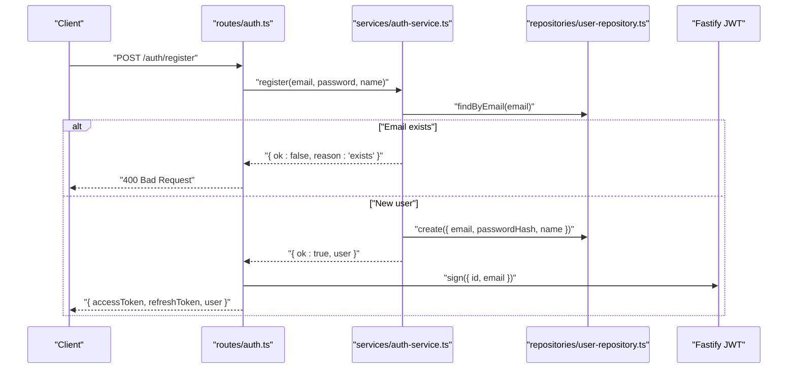
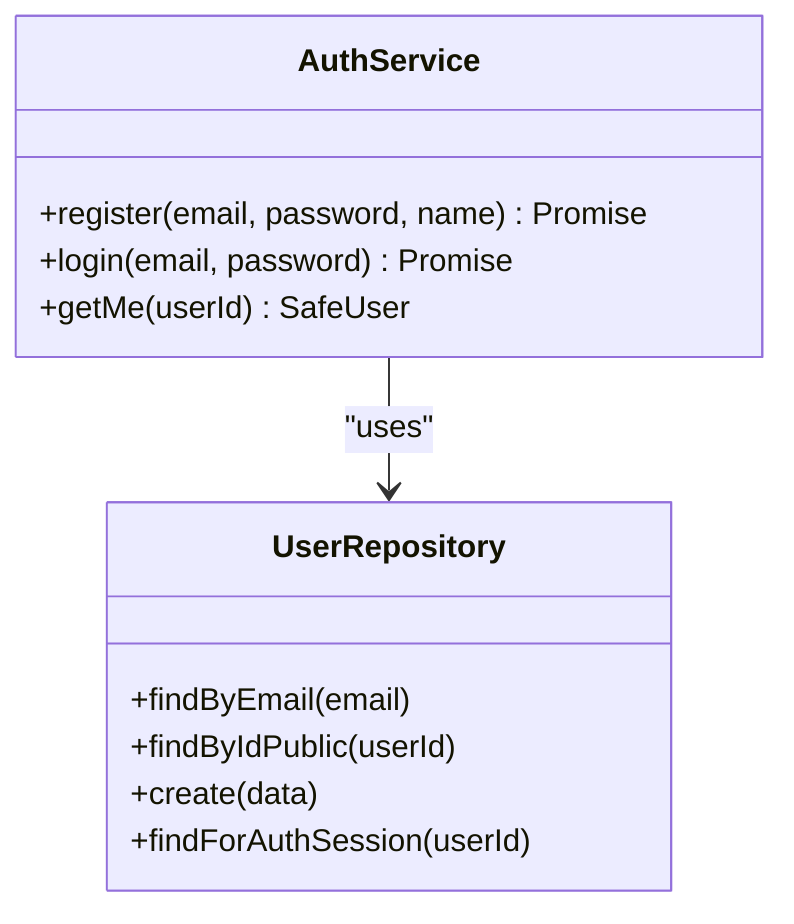
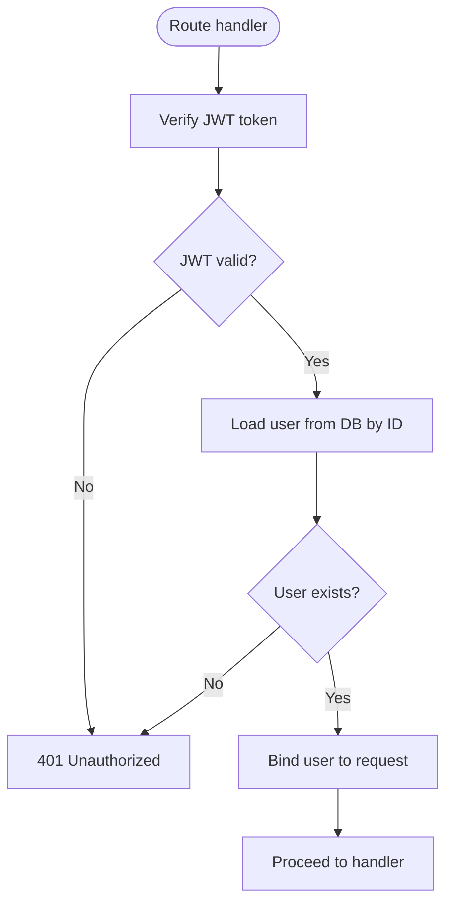
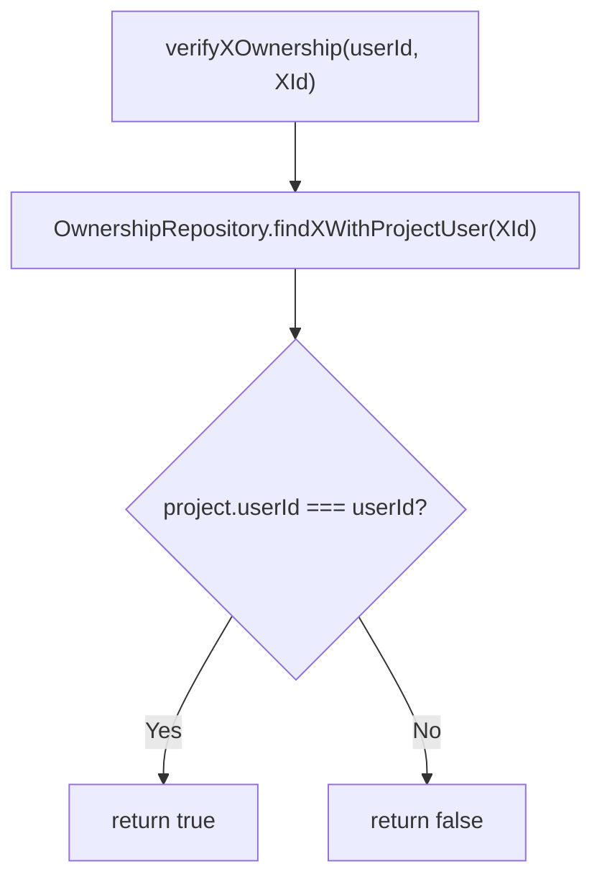
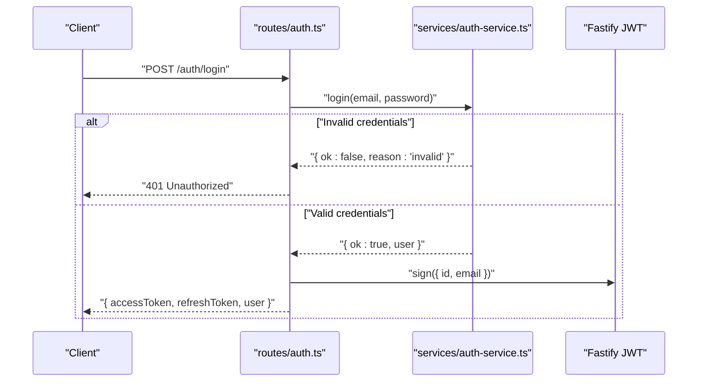
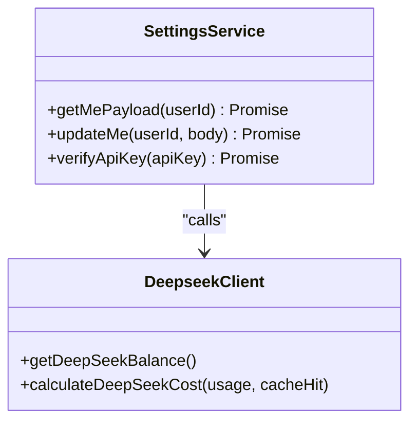
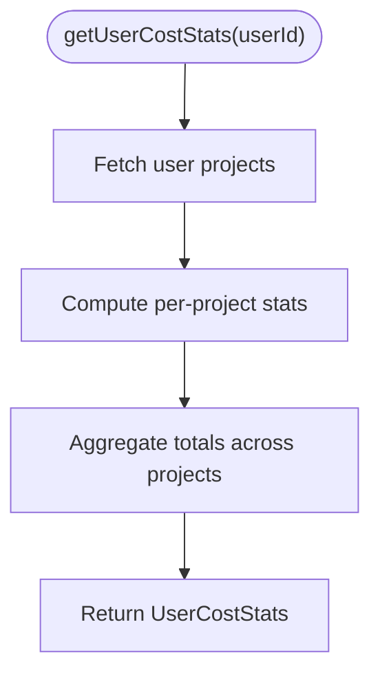
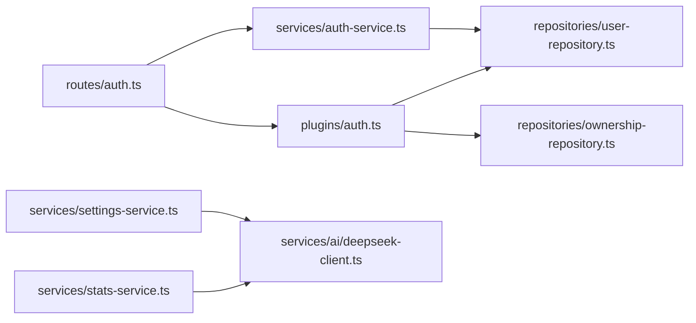

# Authentication and Authorization Services

<cite>
**Referenced Files in This Document**
- [auth-service.ts](file://packages/backend/src/services/auth-service.ts)
- [auth.ts](file://packages/backend/src/plugins/auth.ts)
- [user-repository.ts](file://packages/backend/src/repositories/user-repository.ts)
- [ownership-repository.ts](file://packages/backend/src/repositories/ownership-repository.ts)
- [auth.ts](file://packages/backend/src/routes/auth.ts)
- [settings-service.ts](file://packages/backend/src/services/settings-service.ts)
- [stats-service.ts](file://packages/backend/src/services/stats-service.ts)
- [deepseek-client.ts](file://packages/backend/src/services/ai/deepseek-client.ts)
</cite>

## Table of Contents

1. [Introduction](#introduction)
2. [Project Structure](#project-structure)
3. [Core Components](#core-components)
4. [Architecture Overview](#architecture-overview)
5. [Detailed Component Analysis](#detailed-component-analysis)
6. [Dependency Analysis](#dependency-analysis)
7. [Performance Considerations](#performance-considerations)
8. [Troubleshooting Guide](#troubleshooting-guide)
9. [Conclusion](#conclusion)

## Introduction

This document provides comprehensive documentation for the authentication, authorization, and user management services in the backend. It covers:

- Authentication service implementation and user registration/login flows
- JWT token management and session handling
- Authorization patterns, ownership verification, and resource-level access control
- User settings management, including API key configuration and balance checks
- Statistics collection and cost tracking services
- Security best practices, token refresh mechanisms, and account management features

## Project Structure

The authentication and authorization subsystem is organized around:

- Routes: HTTP endpoints for registration, login, and profile retrieval
- Plugins: Security middleware for JWT verification and session binding
- Services: Business logic for authentication, settings, and statistics
- Repositories: Data access for users, ownership, and related entities
- AI services: Token usage calculation and balance retrieval for cost accounting

**Diagram sources**

- [auth.ts:1-58](file://packages/backend/src/routes/auth.ts#L1-L58)
- [auth.ts:1-107](file://packages/backend/src/plugins/auth.ts#L1-L107)
- [auth-service.ts:1-73](file://packages/backend/src/services/auth-service.ts#L1-L73)
- [settings-service.ts:1-117](file://packages/backend/src/services/settings-service.ts#L1-L117)
- [stats-service.ts:1-252](file://packages/backend/src/services/stats-service.ts#L1-L252)
- [user-repository.ts:1-32](file://packages/backend/src/repositories/user-repository.ts#L1-L32)
- [ownership-repository.ts:1-118](file://packages/backend/src/repositories/ownership-repository.ts#L1-L118)
- [deepseek-client.ts:1-64](file://packages/backend/src/services/ai/deepseek-client.ts#L1-L64)

**Section sources**

- [auth.ts:1-58](file://packages/backend/src/routes/auth.ts#L1-L58)
- [auth.ts:1-107](file://packages/backend/src/plugins/auth.ts#L1-L107)
- [auth-service.ts:1-73](file://packages/backend/src/services/auth-service.ts#L1-L73)
- [settings-service.ts:1-117](file://packages/backend/src/services/settings-service.ts#L1-L117)
- [stats-service.ts:1-252](file://packages/backend/src/services/stats-service.ts#L1-L252)
- [user-repository.ts:1-32](file://packages/backend/src/repositories/user-repository.ts#L1-L32)
- [ownership-repository.ts:1-118](file://packages/backend/src/repositories/ownership-repository.ts#L1-L118)
- [deepseek-client.ts:1-64](file://packages/backend/src/services/ai/deepseek-client.ts#L1-L64)

## Core Components

- Authentication Service: Handles user registration, login, and profile retrieval. Uses bcrypt for password hashing and returns a safe user profile.
- Authentication Plugin: Provides a Fastify decorator to verify JWT tokens and bind a validated user session to the request.
- Ownership Verification Helpers: Resource-level authorization helpers to verify ownership across projects, episodes, scenes, characters, compositions, tasks, locations, images, shots, and character shots.
- Settings Service: Manages user settings, API keys, and balance checks via external AI provider APIs.
- Stats Service: Aggregates cost statistics per project and user, trend analysis, and AI balance retrieval.
- AI Client: Calculates token usage costs and retrieves balances for billing and auditing.

**Section sources**

- [auth-service.ts:1-73](file://packages/backend/src/services/auth-service.ts#L1-L73)
- [auth.ts:1-107](file://packages/backend/src/plugins/auth.ts#L1-L107)
- [ownership-repository.ts:1-118](file://packages/backend/src/repositories/ownership-repository.ts#L1-L118)
- [settings-service.ts:1-117](file://packages/backend/src/services/settings-service.ts#L1-L117)
- [stats-service.ts:1-252](file://packages/backend/src/services/stats-service.ts#L1-L252)
- [deepseek-client.ts:1-64](file://packages/backend/src/services/ai/deepseek-client.ts#L1-L64)

## Architecture Overview

The authentication and authorization architecture integrates route handlers, a JWT-based security plugin, and resource ownership checks. The settings and stats services leverage AI cost calculations and balances for user-centric insights.

**Diagram sources**

- [auth.ts:1-58](file://packages/backend/src/routes/auth.ts#L1-L58)
- [auth-service.ts:1-73](file://packages/backend/src/services/auth-service.ts#L1-L73)
- [user-repository.ts:1-32](file://packages/backend/src/repositories/user-repository.ts#L1-L32)

## Detailed Component Analysis

### Authentication Service

Responsibilities:

- Registration: Validates uniqueness, hashes passwords, persists user, and returns a safe profile.
- Login: Verifies credentials against stored hash and returns a safe profile.
- Profile Retrieval: Loads public profile for the authenticated user.

Key behaviors:

- Password hashing and comparison using bcrypt.
- Safe user profile exposure to prevent sensitive data leakage.
- Integration with the JWT signing flow in routes.

**Diagram sources**

- [auth-service.ts:1-73](file://packages/backend/src/services/auth-service.ts#L1-L73)
- [user-repository.ts:1-32](file://packages/backend/src/repositories/user-repository.ts#L1-L32)

**Section sources**

- [auth-service.ts:1-73](file://packages/backend/src/services/auth-service.ts#L1-L73)
- [user-repository.ts:1-32](file://packages/backend/src/repositories/user-repository.ts#L1-L32)

### Authentication Plugin and Session Handling

Responsibilities:

- Decorates Fastify with an authenticate method that verifies JWT and binds a validated user session to the request.
- Enforces session validity by re-fetching the user from the database and rejecting invalid sessions.

Authorization helpers:

- Ownership verification helpers for projects, episodes, scenes, characters, compositions, tasks, locations, images, shots, and character shots.

**Diagram sources**

- [auth.ts:1-107](file://packages/backend/src/plugins/auth.ts#L1-L107)

**Section sources**

- [auth.ts:1-107](file://packages/backend/src/plugins/auth.ts#L1-L107)
- [user-repository.ts:1-32](file://packages/backend/src/repositories/user-repository.ts#L1-L32)
- [ownership-repository.ts:1-118](file://packages/backend/src/repositories/ownership-repository.ts#L1-L118)

### Ownership Verification Helpers

These helpers encapsulate resource ownership checks across the domain model. They rely on the ownership repository to traverse relationships and compare user IDs.

**Diagram sources**

- [ownership-repository.ts:1-118](file://packages/backend/src/repositories/ownership-repository.ts#L1-L118)
- [auth.ts:37-106](file://packages/backend/src/plugins/auth.ts#L37-L106)

**Section sources**

- [ownership-repository.ts:1-118](file://packages/backend/src/repositories/ownership-repository.ts#L1-L118)
- [auth.ts:37-106](file://packages/backend/src/plugins/auth.ts#L37-L106)

### User Registration and Login Workflows

Endpoints:

- POST /auth/register: Registers a new user, signs access and refresh tokens, and returns user data.
- POST /auth/login: Authenticates an existing user, signs access and refresh tokens, and returns user data.
- GET /auth/me: Returns the authenticated user’s public profile after JWT verification.

Token management:

- Access tokens are signed on successful registration/login.
- Refresh tokens are signed with a longer expiration and can be used to obtain new access tokens.

**Diagram sources**

- [auth.ts:1-58](file://packages/backend/src/routes/auth.ts#L1-L58)
- [auth-service.ts:1-73](file://packages/backend/src/services/auth-service.ts#L1-L73)

**Section sources**

- [auth.ts:1-58](file://packages/backend/src/routes/auth.ts#L1-L58)
- [auth-service.ts:1-73](file://packages/backend/src/services/auth-service.ts#L1-L73)

### User Settings Management

Capabilities:

- Retrieve user payload including API key presence and balance (via external provider).
- Update user profile (name) and API keys.
- Validate API keys by attempting a balance retrieval.

Integration:

- Uses AI client to fetch balances and calculate costs for billing visibility.

**Diagram sources**

- [settings-service.ts:1-117](file://packages/backend/src/services/settings-service.ts#L1-L117)
- [deepseek-client.ts:1-64](file://packages/backend/src/services/ai/deepseek-client.ts#L1-L64)

**Section sources**

- [settings-service.ts:1-117](file://packages/backend/src/services/settings-service.ts#L1-L117)
- [deepseek-client.ts:1-64](file://packages/backend/src/services/ai/deepseek-client.ts#L1-L64)

### Statistics Collection and Cost Tracking

Capabilities:

- Project-level cost statistics: total, AI, video, and image costs; task counts and recent tasks.
- User-level cost aggregation across projects.
- Cost trends over time segmented by model and image generation.
- AI balance retrieval for account monitoring.

**Diagram sources**

- [stats-service.ts:102-150](file://packages/backend/src/services/stats-service.ts#L102-L150)

**Section sources**

- [stats-service.ts:1-252](file://packages/backend/src/services/stats-service.ts#L1-L252)

### Security Best Practices and Recommendations

- Password Handling: Ensure bcrypt is configured with appropriate rounds and secrets are managed securely.
- Token Lifetimes: Use short-lived access tokens and long-lived refresh tokens; enforce rotation and revocation policies.
- Session Binding: Re-validate user sessions against the database to mitigate token theft or tampering.
- Least Privilege: Apply ownership checks for all write operations and sensitive reads.
- Secrets Management: Store JWT secret, API keys, and base URLs in environment variables; avoid hardcoding.
- Rate Limiting: Apply rate limiting to authentication endpoints to reduce brute-force risks.
- Logging and Auditing: Log authentication events and ownership checks for audit trails.

[No sources needed since this section provides general guidance]

## Dependency Analysis

The authentication and authorization stack exhibits clear separation of concerns:

- Routes depend on the authentication service and security plugin.
- The authentication service depends on the user repository.
- The security plugin depends on the user repository and ownership repository for authorization helpers.
- Settings and stats services depend on the AI client for cost and balance computations.

**Diagram sources**

- [auth.ts:1-58](file://packages/backend/src/routes/auth.ts#L1-L58)
- [auth-service.ts:1-73](file://packages/backend/src/services/auth-service.ts#L1-L73)
- [auth.ts:1-107](file://packages/backend/src/plugins/auth.ts#L1-L107)
- [user-repository.ts:1-32](file://packages/backend/src/repositories/user-repository.ts#L1-L32)
- [ownership-repository.ts:1-118](file://packages/backend/src/repositories/ownership-repository.ts#L1-L118)
- [settings-service.ts:1-117](file://packages/backend/src/services/settings-service.ts#L1-L117)
- [stats-service.ts:1-252](file://packages/backend/src/services/stats-service.ts#L1-L252)
- [deepseek-client.ts:1-64](file://packages/backend/src/services/ai/deepseek-client.ts#L1-L64)

**Section sources**

- [auth.ts:1-58](file://packages/backend/src/routes/auth.ts#L1-L58)
- [auth-service.ts:1-73](file://packages/backend/src/services/auth-service.ts#L1-L73)
- [auth.ts:1-107](file://packages/backend/src/plugins/auth.ts#L1-L107)
- [user-repository.ts:1-32](file://packages/backend/src/repositories/user-repository.ts#L1-L32)
- [ownership-repository.ts:1-118](file://packages/backend/src/repositories/ownership-repository.ts#L1-L118)
- [settings-service.ts:1-117](file://packages/backend/src/services/settings-service.ts#L1-L117)
- [stats-service.ts:1-252](file://packages/backend/src/services/stats-service.ts#L1-L252)
- [deepseek-client.ts:1-64](file://packages/backend/src/services/ai/deepseek-client.ts#L1-L64)

## Performance Considerations

- Hashing Costs: bcrypt cost factor impacts login performance; tune for acceptable latency vs. security.
- Database Queries: Minimize redundant queries in ownership checks; batch where possible.
- Token Validation: Keep JWT verification lightweight; avoid heavy operations inside middleware.
- Caching: Cache frequently accessed user profiles and balances where safe and appropriate.
- Asynchronous Operations: Offload AI balance checks and cost computations to avoid blocking requests.

[No sources needed since this section provides general guidance]

## Troubleshooting Guide

Common issues and resolutions:

- Authentication Failures:
  - Invalid credentials during login or registration failure due to duplicate email.
  - Ensure proper error responses are returned and clients handle 400/401 statuses.
- Session Invalid:
  - If the user is deleted or disabled between token issuance and usage, authentication fails.
  - Confirm that the session validation re-fetches the user from the database.
- Ownership Checks:
  - Resource ownership helpers return false if the user does not own the target resource.
  - Verify the relationship traversal in the ownership repository and correct entity IDs.
- Settings and API Keys:
  - API key validation failures indicate incorrect or expired keys; surface the underlying error messages.
  - Balance retrieval errors should be handled gracefully with fallbacks.
- Stats and Cost Trends:
  - Missing cost data often indicates incomplete task records or missing cost fields.
  - Validate filters and date ranges for trend queries.

**Section sources**

- [auth.ts:1-58](file://packages/backend/src/routes/auth.ts#L1-L58)
- [auth-service.ts:1-73](file://packages/backend/src/services/auth-service.ts#L1-L73)
- [auth.ts:1-107](file://packages/backend/src/plugins/auth.ts#L1-L107)
- [settings-service.ts:1-117](file://packages/backend/src/services/settings-service.ts#L1-L117)
- [stats-service.ts:1-252](file://packages/backend/src/services/stats-service.ts#L1-L252)

## Conclusion

The authentication and authorization subsystem provides a robust foundation for secure user management, session handling, and resource-level access control. By combining JWT-based authentication, strict session validation, and comprehensive ownership checks, the system ensures secure access patterns. The settings and stats services further enhance user experience by offering configuration flexibility and financial transparency. Adhering to the recommended best practices will strengthen security posture and maintain system reliability.
