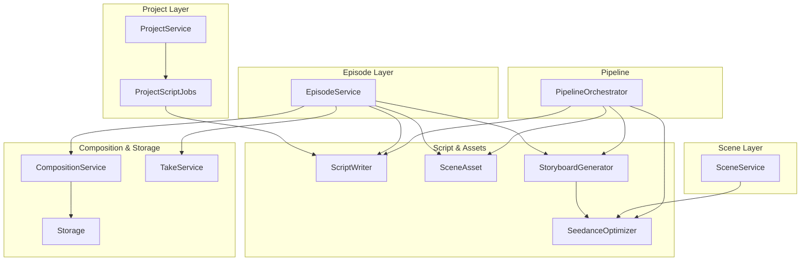
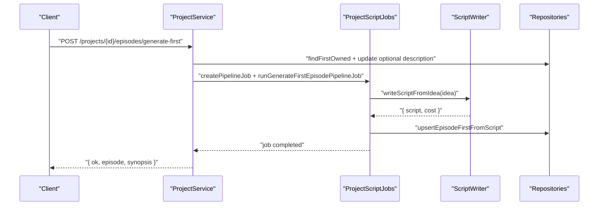
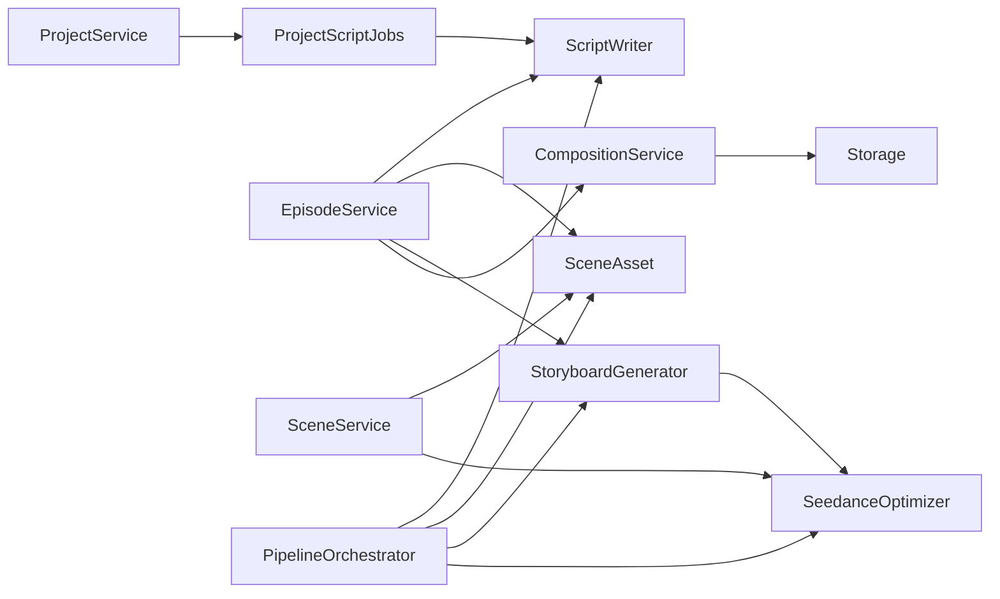

# Business Logic Services

<cite>
**Referenced Files in This Document**
- [project-service.ts](file://packages/backend/src/services/project-service.ts)
- [episode-service.ts](file://packages/backend/src/services/episode-service.ts)
- [scene-service.ts](file://packages/backend/src/services/scene-service.ts)
- [script-writer.ts](file://packages/backend/src/services/script-writer.ts)
- [composition-service.ts](file://packages/backend/src/services/composition-service.ts)
- [take-service.ts](file://packages/backend/src/services/take-service.ts)
- [storage.ts](file://packages/backend/src/services/storage.ts)
- [pipeline-orchestrator.ts](file://packages/backend/src/services/pipeline-orchestrator.ts)
- [scene-asset.ts](file://packages/backend/src/services/scene-asset.ts)
- [storyboard-generator.ts](file://packages/backend/src/services/storyboard-generator.ts)
- [seedance-optimizer.ts](file://packages/backend/src/services/seedance-optimizer.ts)
- [project-script-jobs.ts](file://packages/backend/src/services/project-script-jobs.ts)
- [action-extractor.ts](file://packages/backend/src/services/action-extractor.ts)
</cite>

## Table of Contents

1. [Introduction](#introduction)
2. [Project Structure](#project-structure)
3. [Core Components](#core-components)
4. [Architecture Overview](#architecture-overview)
5. [Detailed Component Analysis](#detailed-component-analysis)
6. [Dependency Analysis](#dependency-analysis)
7. [Performance Considerations](#performance-considerations)
8. [Troubleshooting Guide](#troubleshooting-guide)
9. [Conclusion](#conclusion)

## Introduction

This document explains the core business logic services that implement the main domain functionality for short-form video production powered by AI. It covers:

- Project management and orchestration of script-first generation, batch episode creation, and parsing
- Episode and scene orchestration, including script expansion, storyboard script generation, and composition assembly
- Script writing workflows and enrichment
- Composition assembly and take generation
- Asset management and Seedance parameterization
- Cross-service interactions, validation, error handling, and integration patterns

The goal is to help developers and product stakeholders understand responsibilities, method contracts, data transformations, and integration points across services.

## Project Structure

The backend organizes business logic under packages/backend/src/services. Key modules include:

- Project orchestration: project-service.ts, project-script-jobs.ts
- Episode orchestration: episode-service.ts
- Scene orchestration: scene-service.ts
- Script writing: script-writer.ts
- Composition and takes: composition-service.ts, take-service.ts
- Assets and Seedance: scene-asset.ts, storyboard-generator.ts, seedance-optimizer.ts
- Pipeline orchestration: pipeline-orchestrator.ts
- Storage: storage.ts

**Diagram sources**

- [project-service.ts:54-339](file://packages/backend/src/services/project-service.ts#L54-L339)
- [project-script-jobs.ts:164-531](file://packages/backend/src/services/project-script-jobs.ts#L164-L531)
- [episode-service.ts:90-624](file://packages/backend/src/services/episode-service.ts#L90-L624)
- [scene-service.ts:12-304](file://packages/backend/src/services/scene-service.ts#L12-L304)
- [script-writer.ts:31-386](file://packages/backend/src/services/script-writer.ts#L31-L386)
- [scene-asset.ts:106-413](file://packages/backend/src/services/scene-asset.ts#L106-L413)
- [storyboard-generator.ts:29-535](file://packages/backend/src/services/storyboard-generator.ts#L29-L535)
- [seedance-optimizer.ts:32-380](file://packages/backend/src/services/seedance-optimizer.ts#L32-L380)
- [composition-service.ts:7-75](file://packages/backend/src/services/composition-service.ts#L7-L75)
- [take-service.ts:4-20](file://packages/backend/src/services/take-service.ts#L4-L20)
- [storage.ts:23-65](file://packages/backend/src/services/storage.ts#L23-L65)
- [pipeline-orchestrator.ts:80-399](file://packages/backend/src/services/pipeline-orchestrator.ts#L80-L399)

**Section sources**

- [project-service.ts:54-339](file://packages/backend/src/services/project-service.ts#L54-L339)
- [episode-service.ts:90-624](file://packages/backend/src/services/episode-service.ts#L90-L624)
- [scene-service.ts:12-304](file://packages/backend/src/services/scene-service.ts#L12-L304)
- [script-writer.ts:31-386](file://packages/backend/src/services/script-writer.ts#L31-L386)
- [scene-asset.ts:106-413](file://packages/backend/src/services/scene-asset.ts#L106-L413)
- [storyboard-generator.ts:29-535](file://packages/backend/src/services/storyboard-generator.ts#L29-L535)
- [seedance-optimizer.ts:32-380](file://packages/backend/src/services/seedance-optimizer.ts#L32-L380)
- [composition-service.ts:7-75](file://packages/backend/src/services/composition-service.ts#L7-L75)
- [take-service.ts:4-20](file://packages/backend/src/services/take-service.ts#L4-L20)
- [storage.ts:23-65](file://packages/backend/src/services/storage.ts#L23-L65)
- [pipeline-orchestrator.ts:80-399](file://packages/backend/src/services/pipeline-orchestrator.ts#L80-L399)

## Core Components

This section outlines the primary services, their responsibilities, method contracts, validation, and return structures.

- ProjectService
  - Responsibilities: project lifecycle, first-episode generation, batch episode generation, script parsing initiation, outline job status retrieval, project updates, deletion.
  - Key methods and contracts:
    - listProjects(userId)
    - createProject(userId, input)
    - generateFirstEpisode(userId, projectId, body)
    - generateRemainingEpisodes(userId, projectId, targetEpisodes?)
    - parseScript(userId, projectId, targetEpisodes?)
    - getOutlineActiveJob(userId, projectId)
    - getProjectDetail(userId, projectId)
    - updateProject(userId, projectId, body)
    - deleteProject(userId, projectId)
  - Validation and errors:
    - Ownership checks and 404 on missing project
    - Parameter range checks (targetEpisodes 2–200)
    - Concurrent job guard via outline pipeline job detection
    - Visual style presence check for parseScript
  - Returns: Strongly typed union results with ok/status/error fields

- EpisodeService
  - Responsibilities: apply structured script to episode, expand script, generate storyboard script, compose episode into a final composition, enrich memories post-expansion.
  - Key methods and contracts:
    - listByProject(projectId)
    - getById(episodeId)
    - getEpisodeDetail(episodeId)
    - listScenesForEpisode(episodeId)
    - createEpisode(projectId, episodeNum, title?)
    - updateEpisode(episodeId, body)
    - deleteEpisodeIfExists(episodeId)
    - composeEpisode(episodeId, titleOverride?)
    - expandEpisodeScript(userId, episodeId, summary)
    - generateEpisodeStoryboardScript(userId, episodeId, hint?)
  - Validation and errors:
    - Episode existence checks
    - Content completeness for storyboard script generation
    - AI provider-specific error mapping (auth, rate limit, generic)
  - Returns: Strongly typed union results with ok/status/error/message fields

- SceneService
  - Responsibilities: scene CRUD, shot prompt optimization, video generation task enqueueing, batch enqueueing, take selection, and Seedance payload building.
  - Key methods and contracts:
    - resolveSceneGeneratePrompt(sceneId)
    - listByEpisode(episodeId)
    - getByIdWithTakesAndShots(sceneId)
    - createSceneWithFirstShot(episodeId, sceneNum, prompt, description?)
    - updateScene(sceneId, body)
    - deleteSceneIfExists(sceneId)
    - enqueueVideoGenerate(sceneId, body)
    - batchEnqueueVideoGenerate(userId, sceneIds, model, referenceImage?, imageUrls?, verifyOwnership)
    - selectTaskInScene(sceneId, taskId)
    - listTasksForScene(sceneId)
    - optimizeScenePrompt(sceneId, userId, bodyPrompt?)
  - Validation and errors:
    - Prompt availability for video generation
    - Ownership verification for batch operations
    - AI provider-specific error mapping (auth, rate limit, generic)
  - Returns: Union results with ok/reason fields

- ScriptWriter
  - Responsibilities: generate script from idea, write episode for project, expand script, improve script, optimize single scene description.
  - Key functions and contracts:
    - writeScriptFromIdea(idea, options?)
    - writeEpisodeForProject(episodeNum, seriesSynopsis, rollingContext, seriesTitle, modelLog?)
    - expandScript(script, additionalScenes?, options?)
    - improveScript(script, feedback, options?)
    - optimizeSceneDescription(description, sceneContext?, modelLog?)
  - Validation and errors:
    - JSON parsing and extraction with robust cleanup
    - Schema validation of returned ScriptContent
  - Returns: { script, cost } with DeepSeek cost tracking

- CompositionService
  - Responsibilities: composition listing/detail enrichment, creation/update, timeline updates, export trigger.
  - Key methods and contracts:
    - listByProject(projectId)
    - getDetailEnriched(compositionId)
    - create(projectId, episodeId, title)
    - updateTitle(compositionId, title)
    - deleteIfExists(compositionId)
    - updateTimeline(compositionId, clips)
    - exportComposition(compositionId)
  - Validation and errors:
    - Existence checks and safe deletions
  - Returns: Enriched composition with derived video/thumbnail URLs

- TakeService
  - Responsibilities: select a take as current for a scene.
  - Key methods and contracts:
    - selectTakeAsCurrent(takeId)
  - Validation and errors:
    - Not-found handling
  - Returns: { ok, task } or { ok, reason }

- Storage
  - Responsibilities: S3-compatible file upload, URL generation, deletion, and key generation.
  - Key functions and contracts:
    - uploadFile(bucket, key, body, contentType)
    - getFileUrl(bucket, key)
    - deleteFile(bucket, key)
    - generateFileKey(bucket, filename)
  - Validation and errors:
    - Environment-driven endpoint/credentials
  - Returns: Public URL for uploaded objects

- PipelineOrchestrator
  - Responsibilities: end-to-end orchestration across script-writing, episode-splitting, action-extraction, asset-matching, storyboard-generation, seedance-parametrization.
  - Key functions and contracts:
    - executePipeline(idea, context, options?)
    - executeSingleStep(step, previousResults, context, options?)
    - getStepDescription(step)
    - getPipelineSteps()
    - estimatePipelineCost(script, seedanceConfigs)
  - Validation and errors:
    - Step-level failure reporting
    - Cost estimation helpers
  - Returns: Structured pipeline result with artifacts

- SceneAsset
  - Responsibilities: analyze scene requirements, match project assets, generate composite prompts, suggest asset generation, convert character images to assets, collect reference images.
  - Key functions and contracts:
    - analyzeSceneRequirements(scene, sceneActions?)
    - matchAssets(scene, projectAssets, sceneActions?, options?)
    - generateCompositePrompt(scene, assets)
    - suggestAssetGeneration(scene, sceneActions?)
    - matchAssetsForScenes(scenes, projectAssets, sceneActions?)
    - convertCharacterImagesToAssets(characterImages)
    - getReferenceImageUrls(recommendations, maxImages?)
  - Validation and errors:
    - Priority-based allocation and relevance scoring
  - Returns: Recommendations and prompts for Seedance

- StoryboardGenerator
  - Responsibilities: transform scenes/actions/assets into Seedance-friendly segments with voice segments, camera movement, visual style, and context.
  - Key functions and contracts:
    - generateStoryboard(episodePlan, scenes, assetRecommendations?, options?)
    - exportStoryboardAsText(segments)
    - exportStoryboardAsJSON(segments)
  - Validation and errors:
    - Segment construction with fallbacks
  - Returns: StoryboardSegment[] with enriched metadata

- SeedanceOptimizer
  - Responsibilities: convert storyboard segments to Seedance configs, select reference images, validate configs, enhance prompts, estimate costs.
  - Key functions and contracts:
    - buildSeedanceConfig(segment, options?)
    - buildSeedanceConfigs(segments, options?)
    - validateSeedanceConfig(config)
    - optimizePromptForSeedance(prompt)
    - estimateSeedanceCost(duration)
    - selectBestCharacterImage(characterName, characterImages, context?)
    - generateFirstFramePrompt(segment, characterImageUrl?)
    - evaluatePromptQuality(prompt, segment)
  - Validation and errors:
    - Config constraints (duration, image count, prompt length)
  - Returns: SeedanceSegmentConfig[] and quality metrics

- ProjectScriptJobs
  - Responsibilities: asynchronous orchestration for first episode generation, batch episode generation, and script parsing; manages pipeline job state and progress.
  - Key functions and contracts:
    - hasConcurrentOutlinePipelineJob(projectId)
    - getActiveOutlinePipelineJob(projectId)
    - scriptFromJson(raw)
    - areEpisodeScriptsComplete(episodes, targetEpisodes)
    - buildEpisodePlansFromDbEpisodes(episodes, merged)
    - mergeEpisodesToScriptContent(episodes)
    - runGenerateFirstEpisode(projectId)
    - runGenerateFirstEpisodePipelineJob(jobId, projectId)
    - runScriptBatchJob(jobId, projectId, targetEpisodes, opts?)
    - ensureAllEpisodeScripts(projectId, targetEpisodes, reusePipelineJobId?)
    - runParseScriptJob(jobId, projectId, targetEpisodes)
  - Validation and errors:
    - Progress updates and failure propagation
  - Returns: Side-effects updating pipeline jobs and project state

- ActionExtractor
  - Responsibilities: extract character actions/emotions from scenes, infer video style, suggest durations/camera movement, and merge sequences.
  - Key functions and contracts:
    - extractActionsFromScene(scene, characters?, options?)
    - extractActionsFromScenes(scenes, characters?, options?)
    - extractCharacterActionSequence(scene, characterName)
    - mergeSceneActions(sceneActions[])
  - Validation and errors:
    - Emotion inference and style classification
  - Returns: SceneActions with inferred metadata

**Section sources**

- [project-service.ts:54-339](file://packages/backend/src/services/project-service.ts#L54-L339)
- [episode-service.ts:90-624](file://packages/backend/src/services/episode-service.ts#L90-L624)
- [scene-service.ts:12-304](file://packages/backend/src/services/scene-service.ts#L12-L304)
- [script-writer.ts:31-386](file://packages/backend/src/services/script-writer.ts#L31-L386)
- [composition-service.ts:7-75](file://packages/backend/src/services/composition-service.ts#L7-L75)
- [take-service.ts:4-20](file://packages/backend/src/services/take-service.ts#L4-L20)
- [storage.ts:23-65](file://packages/backend/src/services/storage.ts#L23-L65)
- [pipeline-orchestrator.ts:80-399](file://packages/backend/src/services/pipeline-orchestrator.ts#L80-L399)
- [scene-asset.ts:106-413](file://packages/backend/src/services/scene-asset.ts#L106-L413)
- [storyboard-generator.ts:29-535](file://packages/backend/src/services/storyboard-generator.ts#L29-L535)
- [seedance-optimizer.ts:32-380](file://packages/backend/src/services/seedance-optimizer.ts#L32-L380)
- [project-script-jobs.ts:164-531](file://packages/backend/src/services/project-script-jobs.ts#L164-L531)
- [action-extractor.ts:16-395](file://packages/backend/src/services/action-extractor.ts#L16-L395)

## Architecture Overview

The system follows a layered architecture:

- Orchestration: ProjectService and ProjectScriptJobs coordinate end-to-end workflows
- Domain services: EpisodeService, SceneService, CompositionService, TakeService manage domain entities
- AI/Asset services: ScriptWriter, SceneAsset, StoryboardGenerator, SeedanceOptimizer handle enrichment and parameterization
- Infrastructure: Storage integrates with S3-compatible object storage
- Pipeline: PipelineOrchestrator coordinates multi-step workflows

**Diagram sources**

- [project-service.ts:73-118](file://packages/backend/src/services/project-service.ts#L73-L118)
- [project-script-jobs.ts:216-241](file://packages/backend/src/services/project-script-jobs.ts#L216-L241)
- [script-writer.ts:31-61](file://packages/backend/src/services/script-writer.ts#L31-L61)

**Section sources**

- [project-service.ts:73-118](file://packages/backend/src/services/project-service.ts#L73-L118)
- [project-script-jobs.ts:216-241](file://packages/backend/src/services/project-script-jobs.ts#L216-L241)
- [script-writer.ts:31-61](file://packages/backend/src/services/script-writer.ts#L31-L61)

## Detailed Component Analysis

### Project Management Service

Responsibilities:

- Manage project lifecycle and metadata
- Coordinate first-episode generation, batch episode generation, and script parsing
- Guard against concurrent outline jobs
- Expose project detail and active outline job status

Key methods:

- Ownership checks and validation before mutations
- Asynchronous job creation and execution
- Error mapping to standardized HTTP-like status codes

Usage example:

- Generate first episode: call generateFirstEpisode with project ownership verified
- Batch episodes: call generateRemainingEpisodes with targetEpisodes in [2, 200]
- Parse script: call parseScript ensuring visualStyle is set and first episode exists

Integration patterns:

- Uses pipelineRepository to track job state
- Calls ProjectScriptJobs for actual work
- Integrates with memory service for post-processing

**Section sources**

- [project-service.ts:54-339](file://packages/backend/src/services/project-service.ts#L54-L339)
- [project-script-jobs.ts:26-39](file://packages/backend/src/services/project-script-jobs.ts#L26-L39)

### Episode and Scene Orchestration

Responsibilities:

- Apply structured script content to episodes and create scenes/shots/dialogue
- Expand episode script and generate storyboard script
- Compose episode into a final composition
- Enforce business rules around scene duration, shot ordering, and take selection

Key methods:

- applyScriptContentToEpisode: deletes existing scenes, creates new ones, attaches shots and character images, builds dialogue timing
- composeEpisode: validates selected takes, constructs composition scenes, triggers export
- SceneService: resolves prompts, enqueues video generation, optimizes prompts

Validation and rules:

- Scene duration capped at 15 seconds
- Shot ordering enforced by scene.shots sort
- Composition requires completed takes with video URLs

**Section sources**

- [episode-service.ts:90-624](file://packages/backend/src/services/episode-service.ts#L90-L624)
- [scene-service.ts:12-304](file://packages/backend/src/services/scene-service.ts#L12-L304)

### Script Writing Workflows

Responsibilities:

- Generate professional scripts from ideas
- Write episodes for a project using rolling context
- Expand and improve scripts
- Optimize scene descriptions for video generation

Processing logic:

- ScriptWriter uses DeepSeek with retry and robust JSON parsing
- Extracts and validates ScriptContent schema
- Supports model logging for audit/tracing

**Section sources**

- [script-writer.ts:31-386](file://packages/backend/src/services/script-writer.ts#L31-L386)

### Composition Assembly and Take Generation

Responsibilities:

- Build compositions from selected takes
- Enrich composition details with video/thumbnail URLs
- Select current take per scene
- Export compositions

Flow:

- SceneService enqueues video generation tasks
- EpisodeService selects takes and composes
- CompositionService updates timelines and exports

**Section sources**

- [composition-service.ts:7-75](file://packages/backend/src/services/composition-service.ts#L7-L75)
- [take-service.ts:4-20](file://packages/backend/src/services/take-service.ts#L4-L20)
- [episode-service.ts:366-444](file://packages/backend/src/services/episode-service.ts#L366-L444)

### Asset Management and Seedance Parameterization

Responsibilities:

- Match project assets to scenes
- Generate composite prompts and reference images
- Convert storyboard segments to Seedance configs
- Validate configs and estimate costs

Data transformation:

- SceneAsset: analyze requirements → match assets → generate composite prompt
- StoryboardGenerator: build segments with voice, camera movement, visual style
- SeedanceOptimizer: allocate reference images, validate constraints, enhance prompts

**Section sources**

- [scene-asset.ts:106-413](file://packages/backend/src/services/scene-asset.ts#L106-L413)
- [storyboard-generator.ts:29-535](file://packages/backend/src/services/storyboard-generator.ts#L29-L535)
- [seedance-optimizer.ts:32-380](file://packages/backend/src/services/seedance-optimizer.ts#L32-L380)

### Pipeline Orchestration

Responsibilities:

- Execute multi-step workflows from script to video
- Support single-step execution and cost estimation
- Aggregate results and report step-level outcomes

Cross-service interactions:

- ScriptWriter for script generation
- ActionExtractor for scene actions
- SceneAsset for asset matching
- StoryboardGenerator for segments
- SeedanceOptimizer for configs

**Section sources**

- [pipeline-orchestrator.ts:80-399](file://packages/backend/src/services/pipeline-orchestrator.ts#L80-L399)

### Storage Integration

Responsibilities:

- Upload/delete files to S3-compatible buckets
- Generate public URLs for assets and videos
- Provide deterministic file keys

Integration patterns:

- Used by asset generation flows and composition exports
- Returns public URLs for downstream consumption

**Section sources**

- [storage.ts:23-65](file://packages/backend/src/services/storage.ts#L23-L65)

## Dependency Analysis

High-level dependencies:

- ProjectService depends on ProjectScriptJobs and repositories
- EpisodeService depends on AI services (ScriptWriter, SceneAsset, StoryboardGenerator) and repositories
- SceneService depends on SceneAsset and SeedanceOptimizer
- CompositionService depends on EpisodeService and Storage
- PipelineOrchestrator aggregates all major services

**Diagram sources**

- [project-service.ts:54-339](file://packages/backend/src/services/project-service.ts#L54-L339)
- [project-script-jobs.ts:164-531](file://packages/backend/src/services/project-script-jobs.ts#L164-L531)
- [episode-service.ts:90-624](file://packages/backend/src/services/episode-service.ts#L90-L624)
- [scene-service.ts:12-304](file://packages/backend/src/services/scene-service.ts#L12-L304)
- [composition-service.ts:7-75](file://packages/backend/src/services/composition-service.ts#L7-L75)
- [pipeline-orchestrator.ts:80-399](file://packages/backend/src/services/pipeline-orchestrator.ts#L80-L399)

**Section sources**

- [project-service.ts:54-339](file://packages/backend/src/services/project-service.ts#L54-L339)
- [episode-service.ts:90-624](file://packages/backend/src/services/episode-service.ts#L90-L624)
- [scene-service.ts:12-304](file://packages/backend/src/services/scene-service.ts#L12-L304)
- [composition-service.ts:7-75](file://packages/backend/src/services/composition-service.ts#L7-L75)
- [pipeline-orchestrator.ts:80-399](file://packages/backend/src/services/pipeline-orchestrator.ts#L80-L399)

## Performance Considerations

- Concurrency guards: outline pipeline job checks prevent overlapping writes
- Batch operations: batchEnqueueVideoGenerate processes multiple scenes with minimal overhead
- Caching and memoization: consider caching AI cost and prompt optimization results
- Database queries: EpisodeService attaches stats via grouped aggregations; ensure proper indexing on episodeId and sceneId
- Export pipeline: composition export runs asynchronously; ensure idempotent updates

## Troubleshooting Guide

Common issues and strategies:

- AI provider errors:
  - Authentication failures: surfaced as 401 with provider-specific messages
  - Rate limiting: surfaced as 429 with provider-specific messages
  - General failures: surfaced as 500 with error messages
- Ownership and permissions:
  - ProjectService and SceneService validate ownership; ensure userId is correct
- Concurrency conflicts:
  - ProjectService blocks operations when outline jobs exist; wait or poll job status
- Data validation:
  - ScriptWriter validates ScriptContent; ensure returned JSON conforms to schema
  - SceneService requires non-empty prompts for video generation

**Section sources**

- [episode-service.ts:511-535](file://packages/backend/src/services/episode-service.ts#L511-L535)
- [scene-service.ts:290-299](file://packages/backend/src/services/scene-service.ts#L290-L299)
- [project-service.ts:88-94](file://packages/backend/src/services/project-service.ts#L88-L94)

## Conclusion

The business logic services form a cohesive pipeline from script creation to video generation and composition. They enforce business rules, validate inputs, integrate with AI providers and storage, and coordinate through explicit job orchestration. The modular design enables clear separation of concerns and supports scalable enhancements.
