# Pipeline Orchestration Services

<cite>
**Referenced Files in This Document**
- [pipeline-orchestrator.ts](file://packages/backend/src/services/pipeline-orchestrator.ts)
- [pipeline-executor.ts](file://packages/backend/src/services/pipeline-executor.ts)
- [pipeline-route-service.ts](file://packages/backend/src/services/pipeline-route-service.ts)
- [project-script-jobs.ts](file://packages/backend/src/services/project-script-jobs.ts)
- [parse-script-entity-pipeline.ts](file://packages/backend/src/services/parse-script-entity-pipeline.ts)
- [storyboard-generator.ts](file://packages/backend/src/services/storyboard-generator.ts)
- [seedance-optimizer.ts](file://packages/backend/src/services/seedance-optimizer.ts)
- [pipeline-repository.ts](file://packages/backend/src/repositories/pipeline-repository.ts)
- [pipeline.ts](file://packages/backend/src/routes/pipeline.ts)
- [types/index.ts](file://packages/shared/src/types/index.ts)
</cite>

## Table of Contents

1. [Introduction](#introduction)
2. [Project Structure](#project-structure)
3. [Core Components](#core-components)
4. [Architecture Overview](#architecture-overview)
5. [Detailed Component Analysis](#detailed-component-analysis)
6. [Dependency Analysis](#dependency-analysis)
7. [Performance Considerations](#performance-considerations)
8. [Troubleshooting Guide](#troubleshooting-guide)
9. [Conclusion](#conclusion)
10. [Appendices](#appendices)

## Introduction

This document explains the pipeline orchestration and workflow management services that coordinate multi-step video generation workflows. It covers the pipeline orchestrator for pure-function orchestration, the pipeline executor for asynchronous job execution, and the route service that exposes APIs for job creation, status monitoring, and cancellation. It also documents script entity parsing pipelines, storyboard generation jobs, and project-level workflow coordination. Progress tracking, status management, and workflow visualization patterns are included to help operators monitor and recover from failures.

## Project Structure

The pipeline system is implemented in the backend service layer and integrates with routes, repositories, and shared types. The main orchestration logic resides in dedicated service modules, while persistence and job state are handled by the pipeline repository. Shared types define the data contracts across the system.

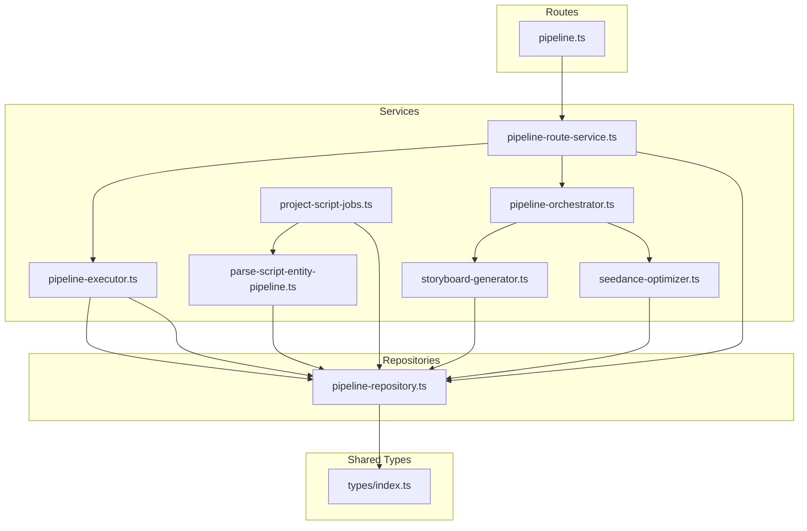

**Diagram sources**

- [pipeline.ts:1-143](file://packages/backend/src/routes/pipeline.ts#L1-L143)
- [pipeline-route-service.ts:1-193](file://packages/backend/src/services/pipeline-route-service.ts#L1-L193)
- [pipeline-executor.ts:1-239](file://packages/backend/src/services/pipeline-executor.ts#L1-L239)
- [pipeline-orchestrator.ts:1-372](file://packages/backend/src/services/pipeline-orchestrator.ts#L1-L372)
- [project-script-jobs.ts:1-465](file://packages/backend/src/services/project-script-jobs.ts#L1-L465)
- [parse-script-entity-pipeline.ts:1-276](file://packages/backend/src/services/parse-script-entity-pipeline.ts#L1-L276)
- [storyboard-generator.ts:1-517](file://packages/backend/src/services/storyboard-generator.ts#L1-L517)
- [seedance-optimizer.ts:1-385](file://packages/backend/src/services/seedance-optimizer.ts#L1-L385)
- [pipeline-repository.ts:1-404](file://packages/backend/src/repositories/pipeline-repository.ts#L1-L404)
- [types/index.ts:369-567](file://packages/shared/src/types/index.ts#L369-L567)

**Section sources**

- [pipeline.ts:1-143](file://packages/backend/src/routes/pipeline.ts#L1-L143)
- [pipeline-route-service.ts:1-193](file://packages/backend/src/services/pipeline-route-service.ts#L1-L193)
- [pipeline-executor.ts:1-239](file://packages/backend/src/services/pipeline-executor.ts#L1-L239)
- [pipeline-orchestrator.ts:1-372](file://packages/backend/src/services/pipeline-orchestrator.ts#L1-L372)
- [project-script-jobs.ts:1-465](file://packages/backend/src/services/project-script-jobs.ts#L1-L465)
- [parse-script-entity-pipeline.ts:1-276](file://packages/backend/src/services/parse-script-entity-pipeline.ts#L1-L276)
- [storyboard-generator.ts:1-517](file://packages/backend/src/services/storyboard-generator.ts#L1-L517)
- [seedance-optimizer.ts:1-385](file://packages/backend/src/services/seedance-optimizer.ts#L1-L385)
- [pipeline-repository.ts:1-404](file://packages/backend/src/repositories/pipeline-repository.ts#L1-L404)
- [types/index.ts:369-567](file://packages/shared/src/types/index.ts#L369-L567)

## Core Components

- Pipeline Orchestrator (pure-function orchestration): Executes a predefined sequence of steps (script writing, episode splitting, action extraction, asset matching, storyboard generation, Seedance parametrization) and aggregates results. It supports single-step execution for resuming work and step descriptions/status queries.
- Pipeline Executor (asynchronous job execution): Runs long-running jobs, updates job and step progress, persists intermediate results, and coordinates with project-level jobs such as outline generation and script parsing.
- Route Service: Exposes REST endpoints to create jobs, poll status, list jobs, and cancel jobs. It validates ownership and maps internal job states to API responses.
- Project Script Jobs: Implements outline pipeline jobs (first episode generation, batch episode generation, and script parsing), with concurrency guards and progress reporting.
- Parse Script Entity Pipeline: Normalizes character identities, merges aliases, writes back normalized scripts, persists locations and characters, and ensures character image slots.
- Storyboard Generator: Converts episodes and scenes into storyboard segments with visual style, camera movement, special effects, voice segments, and Seedance prompts.
- Seedance Optimizer: Transforms storyboard segments into Seedance API-compatible configurations, selects reference images, validates durations, and optimizes prompts.
- Pipeline Repository: Persists jobs, step results, episodes, segments, scenes, shots, and related associations; provides concurrency checks and lookup helpers.

**Section sources**

- [pipeline-orchestrator.ts:66-192](file://packages/backend/src/services/pipeline-orchestrator.ts#L66-L192)
- [pipeline-executor.ts:80-234](file://packages/backend/src/services/pipeline-executor.ts#L80-L234)
- [pipeline-route-service.ts:5-193](file://packages/backend/src/services/pipeline-route-service.ts#L5-L193)
- [project-script-jobs.ts:151-464](file://packages/backend/src/services/project-script-jobs.ts#L151-L464)
- [parse-script-entity-pipeline.ts:222-275](file://packages/backend/src/services/parse-script-entity-pipeline.ts#L222-L275)
- [storyboard-generator.ts:29-123](file://packages/backend/src/services/storyboard-generator.ts#L29-L123)
- [seedance-optimizer.ts:32-207](file://packages/backend/src/services/seedance-optimizer.ts#L32-L207)
- [pipeline-repository.ts:19-401](file://packages/backend/src/repositories/pipeline-repository.ts#L19-L401)

## Architecture Overview

The system separates concerns across routes, services, and repositories. Routes accept requests and delegate to the route service, which either starts a full pipeline job or orchestrates pure-function execution. The executor updates persistent state and coordinates downstream steps. The repository encapsulates database operations and maintains job metadata and results.

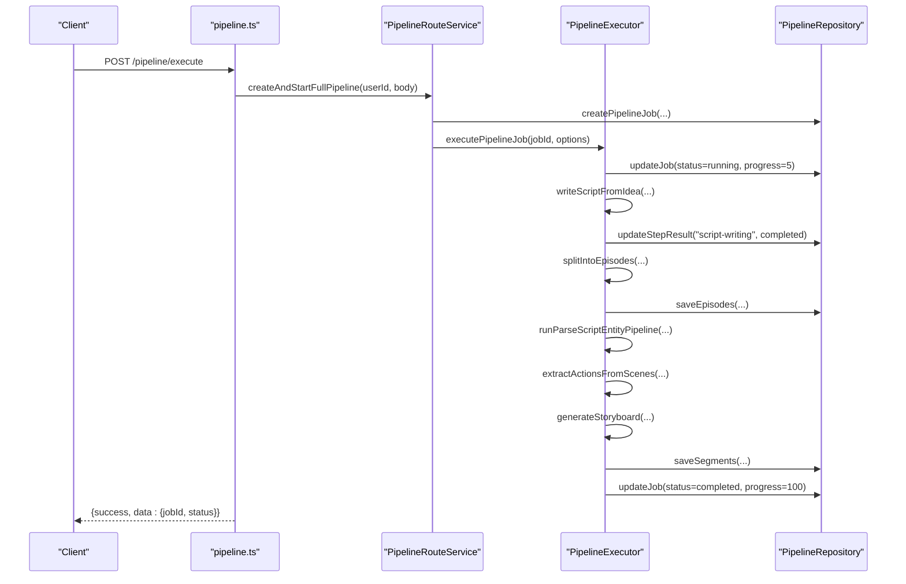

**Diagram sources**

- [pipeline.ts:10-49](file://packages/backend/src/routes/pipeline.ts#L10-L49)
- [pipeline-route-service.ts:19-93](file://packages/backend/src/services/pipeline-route-service.ts#L19-L93)
- [pipeline-executor.ts:80-234](file://packages/backend/src/services/pipeline-executor.ts#L80-L234)
- [pipeline-repository.ts:19-70](file://packages/backend/src/repositories/pipeline-repository.ts#L19-L70)

**Section sources**

- [pipeline.ts:1-143](file://packages/backend/src/routes/pipeline.ts#L1-L143)
- [pipeline-route-service.ts:1-193](file://packages/backend/src/services/pipeline-route-service.ts#L1-L193)
- [pipeline-executor.ts:1-239](file://packages/backend/src/services/pipeline-executor.ts#L1-L239)
- [pipeline-repository.ts:1-404](file://packages/backend/src/repositories/pipeline-repository.ts#L1-L404)

## Detailed Component Analysis

### Pipeline Orchestrator

The orchestrator defines a fixed pipeline with explicit step ordering and dependency resolution. It executes steps sequentially, captures results, and aborts on failure with detailed error reporting. It also supports single-step execution for resuming partial runs and provides step descriptions and cost estimation.

Key behaviors:

- Step execution order: script-writing → episode-splitting → action-extraction → asset-matching → storyboard-generation → seedance-parametrization
- Dependency resolution: later steps require outputs from earlier steps; missing data triggers failure
- Error handling: immediate propagation of step failures with timing and messages
- Resumability: single-step execution validates prerequisites and reuses prior results where possible
- Cost estimation: computes script and video cost estimates

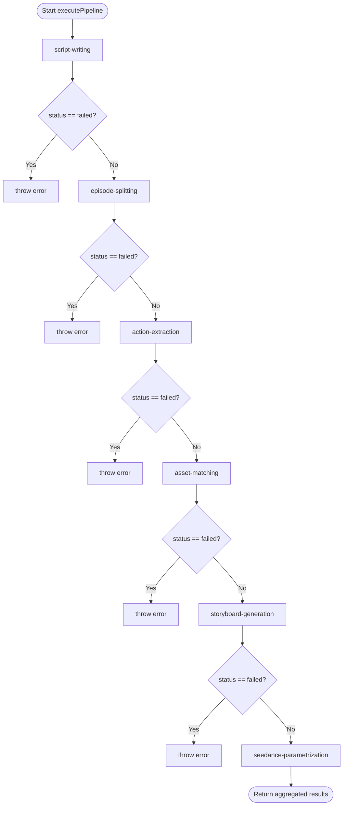

**Diagram sources**

- [pipeline-orchestrator.ts:66-192](file://packages/backend/src/services/pipeline-orchestrator.ts#L66-L192)

**Section sources**

- [pipeline-orchestrator.ts:35-372](file://packages/backend/src/services/pipeline-orchestrator.ts#L35-L372)

### Pipeline Executor

The executor runs asynchronous jobs, updates job and step progress, and persists results. It detects whether early steps can be skipped when sufficient data exists (e.g., episodes with complete scripts). It also enriches parsed scripts with visuals and saves storyboard segments to the database.

Highlights:

- Ownership checks and project metadata retrieval
- Skipping early steps when episodes already contain complete scripts
- Updating job progress and step results consistently
- Saving episodes and storyboard segments to the database
- Integrating with memory and enrichment services

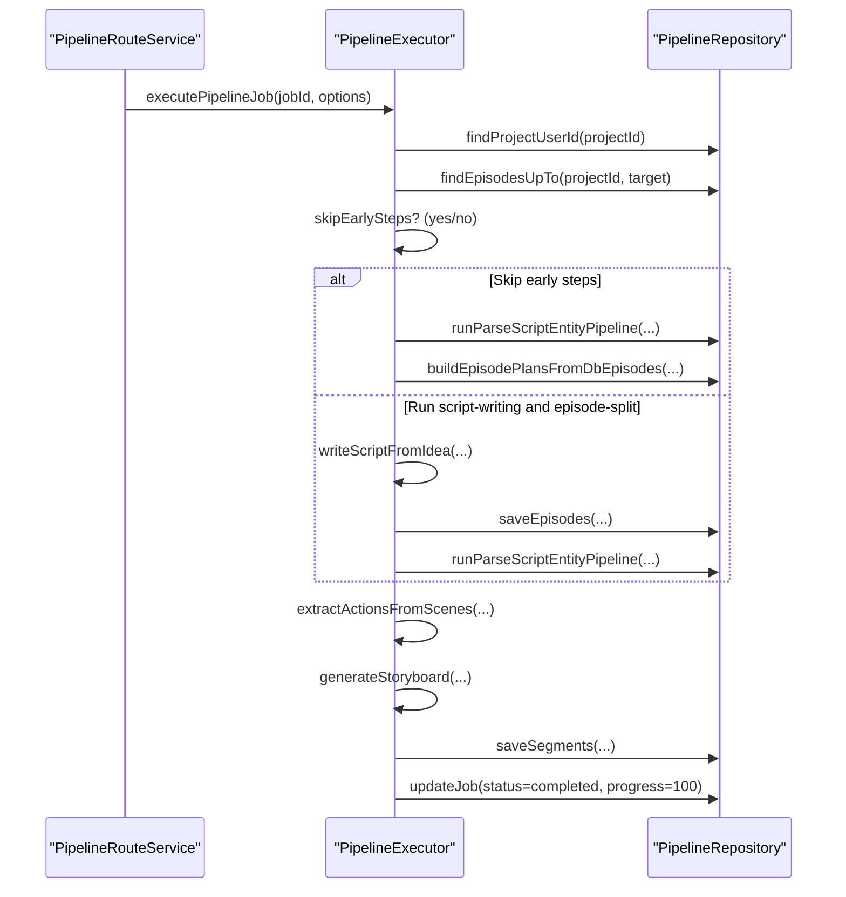

**Diagram sources**

- [pipeline-executor.ts:80-234](file://packages/backend/src/services/pipeline-executor.ts#L80-L234)
- [pipeline-repository.ts:183-401](file://packages/backend/src/repositories/pipeline-repository.ts#L183-L401)

**Section sources**

- [pipeline-executor.ts:1-239](file://packages/backend/src/services/pipeline-executor.ts#L1-L239)
- [pipeline-repository.ts:1-404](file://packages/backend/src/repositories/pipeline-repository.ts#L1-L404)

### Route Service

The route service exposes endpoints for creating jobs, retrieving job details, listing jobs, and canceling jobs. It enforces ownership checks and translates internal job states into API responses.

Endpoints:

- POST /pipeline/execute: creates a full pipeline job and returns immediately with pending status
- GET /pipeline/job/:jobId: returns detailed job status and step results
- GET /pipeline/status/:projectId: returns latest job status for a project
- GET /pipeline/steps: returns step catalog with descriptions
- GET /pipeline/jobs: lists all jobs for the user
- DELETE /pipeline/job/:jobId: cancels a job (only if not running)

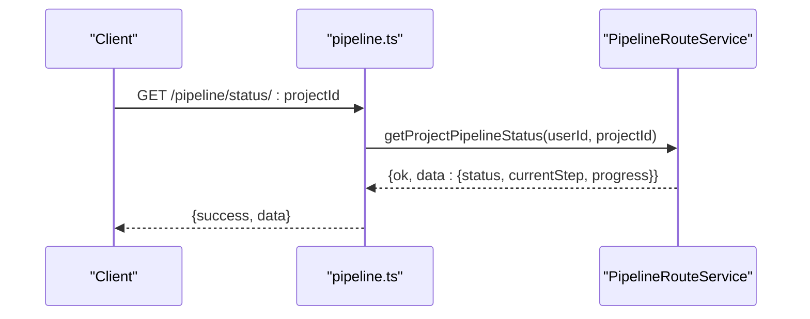

**Diagram sources**

- [pipeline.ts:75-97](file://packages/backend/src/routes/pipeline.ts#L75-L97)
- [pipeline-route-service.ts:124-146](file://packages/backend/src/services/pipeline-route-service.ts#L124-L146)

**Section sources**

- [pipeline.ts:1-143](file://packages/backend/src/routes/pipeline.ts#L1-L143)
- [pipeline-route-service.ts:1-193](file://packages/backend/src/services/pipeline-route-service.ts#L1-L193)

### Project Script Jobs

This module implements outline pipeline jobs:

- First episode generation: writes the initial episode from project description
- Batch episode generation: generates subsequent episodes with rolling context and memory-aware writing
- Script parsing: ensures all episodes exist, normalizes character identities, persists locations/characters, and enriches visuals

Concurrency controls prevent overlapping outline jobs for the same project.

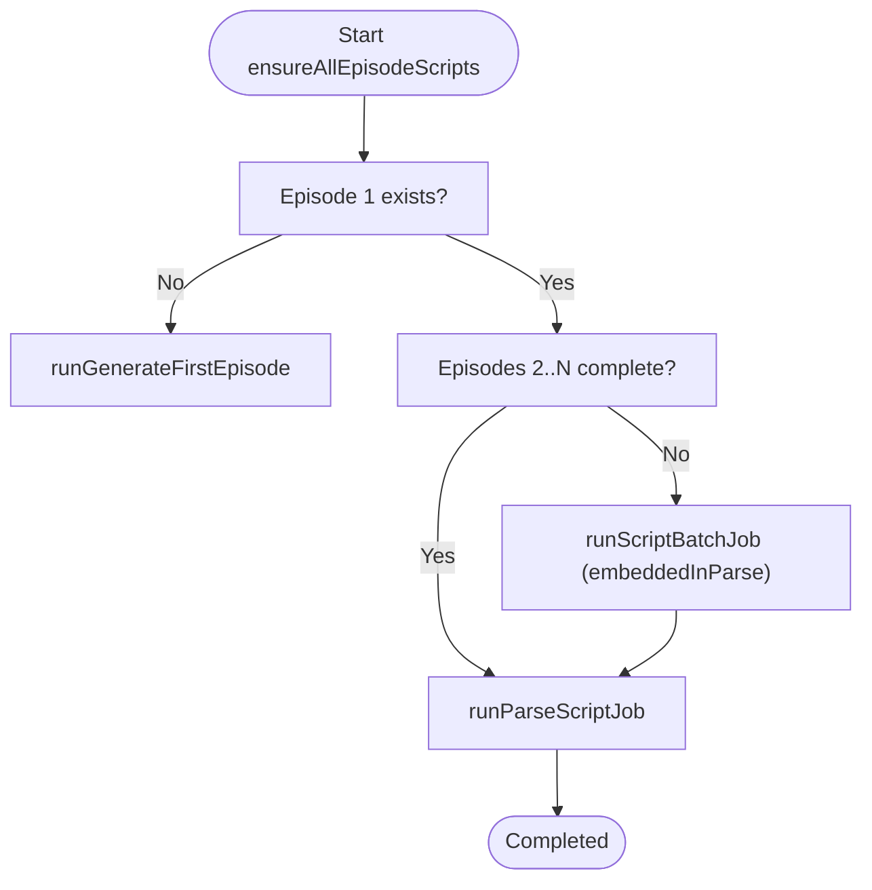

**Diagram sources**

- [project-script-jobs.ts:363-464](file://packages/backend/src/services/project-script-jobs.ts#L363-L464)

**Section sources**

- [project-script-jobs.ts:1-465](file://packages/backend/src/services/project-script-jobs.ts#L1-L465)

### Parse Script Entity Pipeline

Normalizes character identities, merges aliases, writes normalized scripts back to episodes, persists locations and characters, and ensures character image slots exist. It also updates descriptions and creates missing base images.

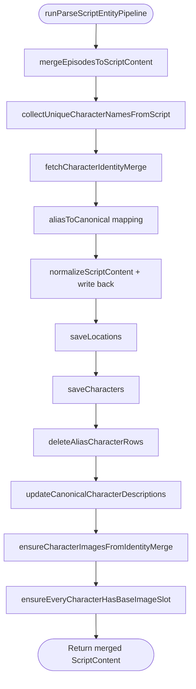

**Diagram sources**

- [parse-script-entity-pipeline.ts:222-275](file://packages/backend/src/services/parse-script-entity-pipeline.ts#L222-L275)

**Section sources**

- [parse-script-entity-pipeline.ts:1-276](file://packages/backend/src/services/parse-script-entity-pipeline.ts#L1-L276)

### Storyboard Generator

Generates storyboard segments per episode by extracting actions, determining visual style and camera movement, selecting special effects, building voice segments, and composing Seedance prompts. It supports exporting segments as text or JSON.

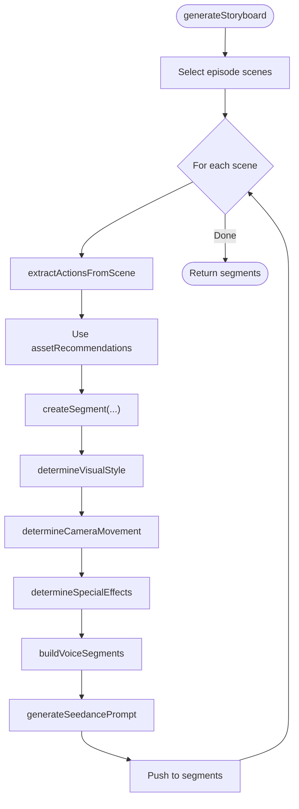

**Diagram sources**

- [storyboard-generator.ts:29-123](file://packages/backend/src/services/storyboard-generator.ts#L29-L123)

**Section sources**

- [storyboard-generator.ts:1-517](file://packages/backend/src/services/storyboard-generator.ts#L1-L517)

### Seedance Optimizer

Converts storyboard segments into Seedance configurations by selecting up to nine reference images, validating durations, and enhancing prompts. It also provides cost estimation and prompt quality evaluation.

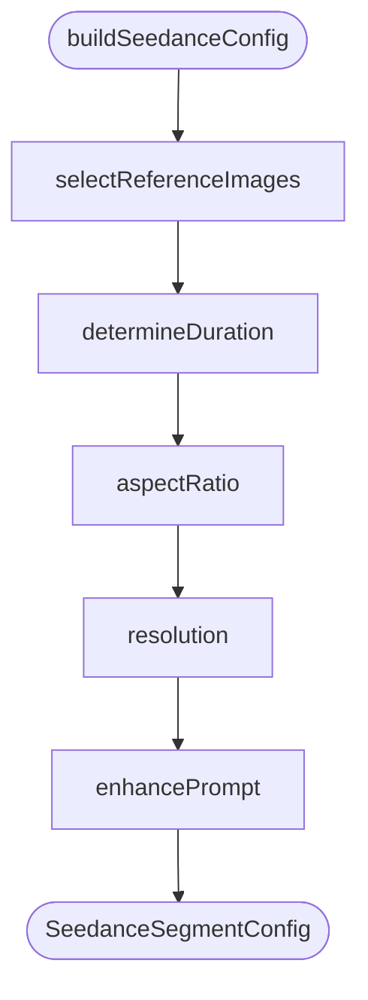

**Diagram sources**

- [seedance-optimizer.ts:32-61](file://packages/backend/src/services/seedance-optimizer.ts#L32-L61)

**Section sources**

- [seedance-optimizer.ts:1-385](file://packages/backend/src/services/seedance-optimizer.ts#L1-L385)

### Pipeline Repository

Persists and retrieves pipeline jobs, step results, episodes, and storyboard segments. It includes helpers for concurrency checks, ownership verification, and saving scenes/shots/dialogue associations.

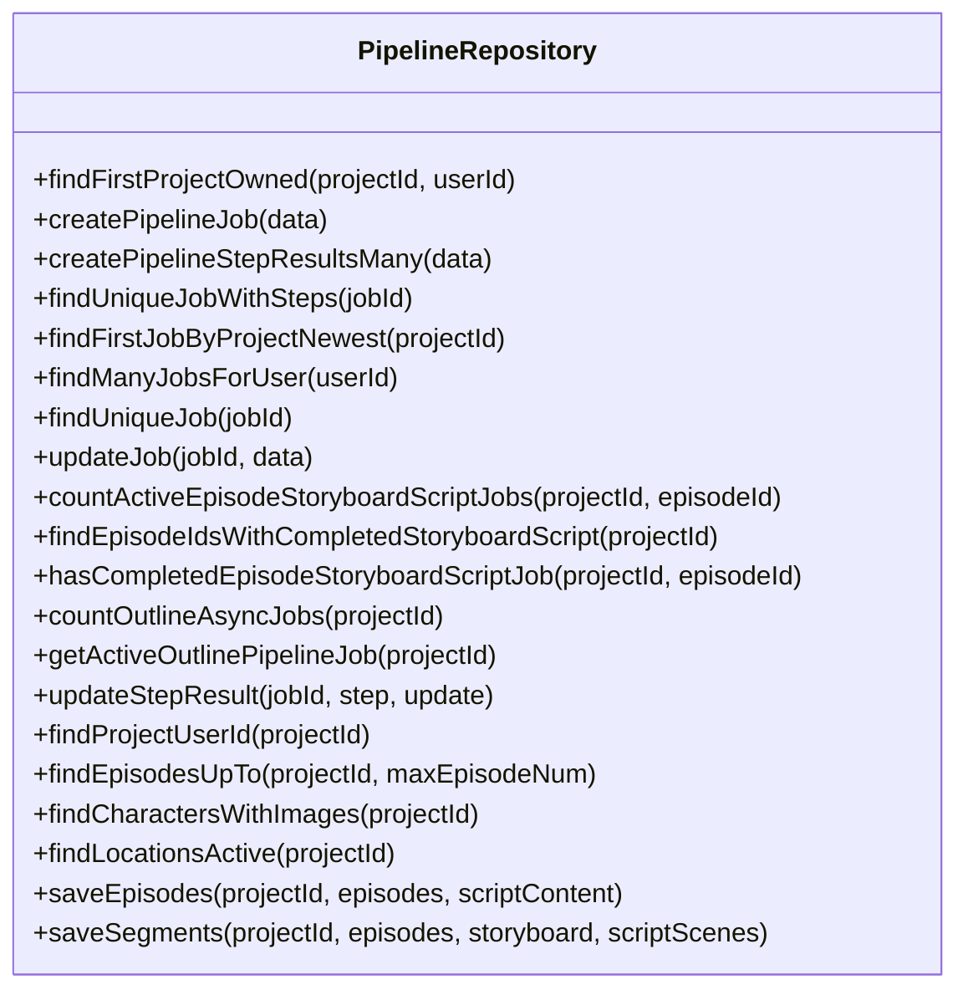

**Diagram sources**

- [pipeline-repository.ts:10-404](file://packages/backend/src/repositories/pipeline-repository.ts#L10-L404)

**Section sources**

- [pipeline-repository.ts:1-404](file://packages/backend/src/repositories/pipeline-repository.ts#L1-L404)

## Dependency Analysis

The orchestration services depend on shared types for data contracts and on repositories for persistence. The executor depends on the repository for saving episodes and segments and on the parse pipeline for enriching scripts. The route service depends on the executor and repository for job lifecycle management.

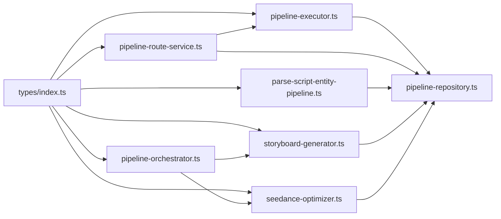

**Diagram sources**

- [types/index.ts:369-567](file://packages/shared/src/types/index.ts#L369-L567)
- [pipeline-orchestrator.ts:1-372](file://packages/backend/src/services/pipeline-orchestrator.ts#L1-L372)
- [pipeline-executor.ts:1-239](file://packages/backend/src/services/pipeline-executor.ts#L1-L239)
- [pipeline-route-service.ts:1-193](file://packages/backend/src/services/pipeline-route-service.ts#L1-L193)
- [parse-script-entity-pipeline.ts:1-276](file://packages/backend/src/services/parse-script-entity-pipeline.ts#L1-L276)
- [storyboard-generator.ts:1-517](file://packages/backend/src/services/storyboard-generator.ts#L1-L517)
- [seedance-optimizer.ts:1-385](file://packages/backend/src/services/seedance-optimizer.ts#L1-L385)
- [pipeline-repository.ts:1-404](file://packages/backend/src/repositories/pipeline-repository.ts#L1-L404)

**Section sources**

- [types/index.ts:369-567](file://packages/shared/src/types/index.ts#L369-L567)
- [pipeline-orchestrator.ts:1-372](file://packages/backend/src/services/pipeline-orchestrator.ts#L1-L372)
- [pipeline-executor.ts:1-239](file://packages/backend/src/services/pipeline-executor.ts#L1-L239)
- [pipeline-route-service.ts:1-193](file://packages/backend/src/services/pipeline-route-service.ts#L1-L193)
- [parse-script-entity-pipeline.ts:1-276](file://packages/backend/src/services/parse-script-entity-pipeline.ts#L1-L276)
- [storyboard-generator.ts:1-517](file://packages/backend/src/services/storyboard-generator.ts#L1-L517)
- [seedance-optimizer.ts:1-385](file://packages/backend/src/services/seedance-optimizer.ts#L1-L385)
- [pipeline-repository.ts:1-404](file://packages/backend/src/repositories/pipeline-repository.ts#L1-L404)

## Performance Considerations

- Concurrency control: Outline pipeline jobs prevent overlapping concurrent runs via repository counters and active job detection.
- Early exit optimization: The executor skips script-writing and episode-splitting when episodes already contain complete scripts.
- Incremental progress: Jobs report granular progress per step and per batch iteration to keep clients informed.
- Cost estimation: Both orchestrator and optimizer expose cost estimations to guide budgeting.
- Persistence batching: Repository methods upsert and create many records efficiently to reduce round-trips.

[No sources needed since this section provides general guidance]

## Troubleshooting Guide

Common issues and recovery strategies:

- Job stuck in pending/running: Verify ownership and check repository job status; use cancel endpoint only if safe (not running).
- Missing prerequisite data: Single-step execution requires prior results; ensure earlier steps completed successfully.
- Duplicate outline jobs: Concurrency guards prevent overlapping outline jobs; wait for active jobs to finish.
- Step failures: Inspect step results for error messages and retry after fixing root causes.

Operational tips:

- Poll job status endpoints to track progress.
- Use the steps catalog to understand each step’s purpose.
- Cancel jobs only when they are not actively running.

**Section sources**

- [pipeline-route-service.ts:165-190](file://packages/backend/src/services/pipeline-route-service.ts#L165-L190)
- [pipeline-executor.ts:218-234](file://packages/backend/src/services/pipeline-executor.ts#L218-L234)
- [project-script-jobs.ts:19-30](file://packages/backend/src/services/project-script-jobs.ts#L19-L30)

## Conclusion

The pipeline orchestration system provides robust, observable workflows for multi-step video generation. It separates pure orchestration from asynchronous job execution, persists state consistently, and offers clear APIs for monitoring and recovery. The parse pipeline, storyboard generator, and Seedance optimizer integrate seamlessly to transform scripts into production-ready video assets.

[No sources needed since this section summarizes without analyzing specific files]

## Appendices

### API Definitions

- POST /pipeline/execute: Creates a full pipeline job; returns jobId and pending status.
- GET /pipeline/job/:jobId: Returns job details including status, current step, progress, and step results.
- GET /pipeline/status/:projectId: Returns latest job status for a project.
- GET /pipeline/steps: Returns step catalog with descriptions.
- GET /pipeline/jobs: Lists all jobs for the user.
- DELETE /pipeline/job/:jobId: Cancels a job if not running.

**Section sources**

- [pipeline.ts:10-141](file://packages/backend/src/routes/pipeline.ts#L10-L141)

### Data Contracts

- PipelineStep: Ordered stages of the pipeline.
- PipelineStatus: Current step, status, progress, and optional error.
- ScriptContent, EpisodePlan, SceneActions, StoryboardSegment, SeedanceSegmentConfig: Core types for orchestration and video generation.

**Section sources**

- [types/index.ts:506-567](file://packages/shared/src/types/index.ts#L506-L567)
