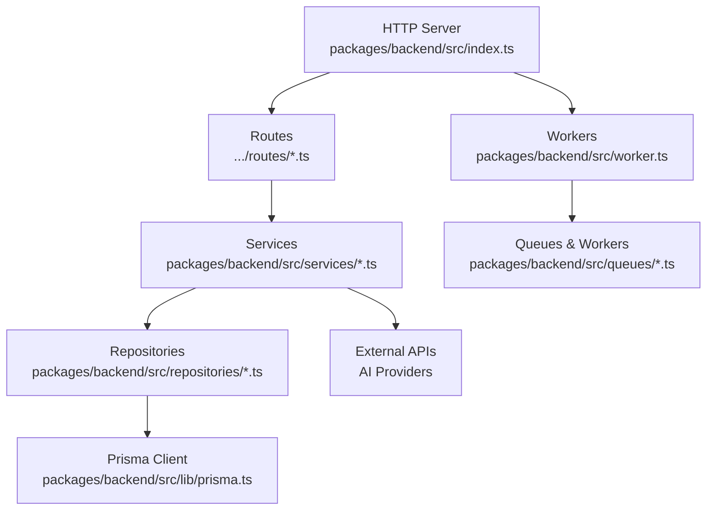
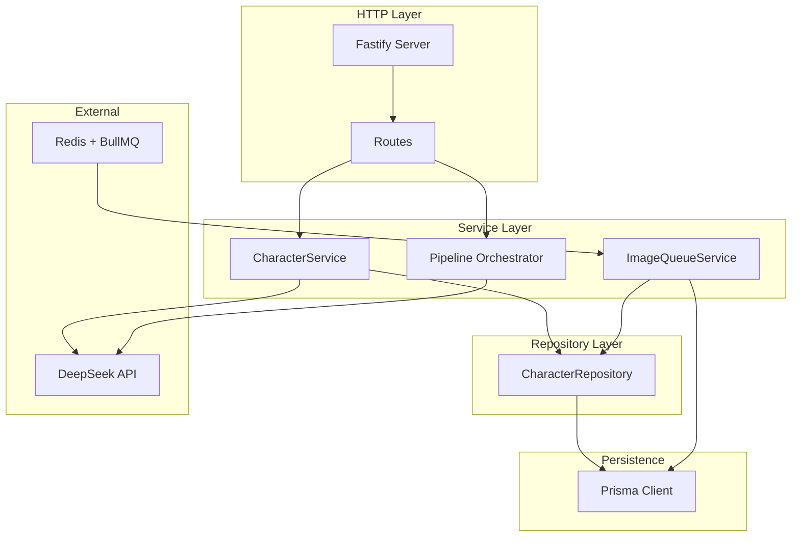
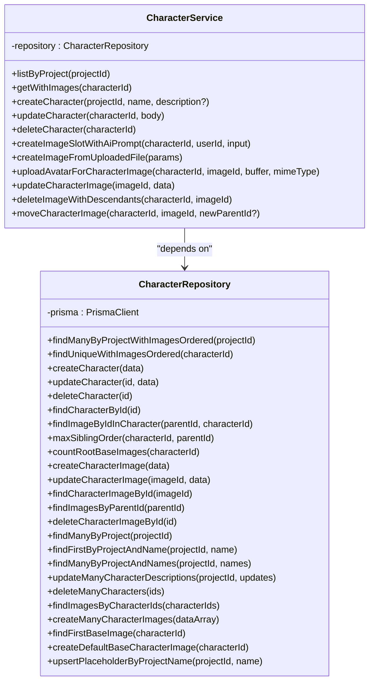
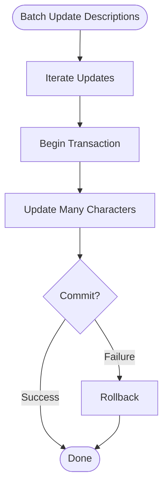
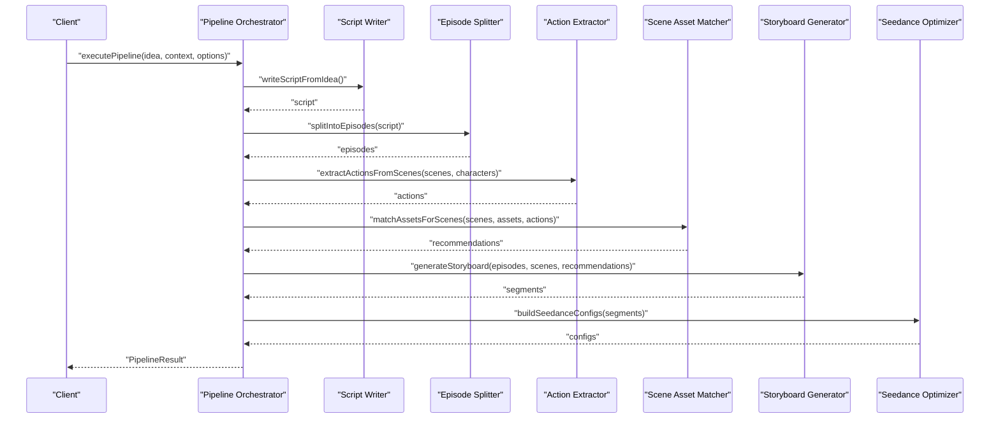
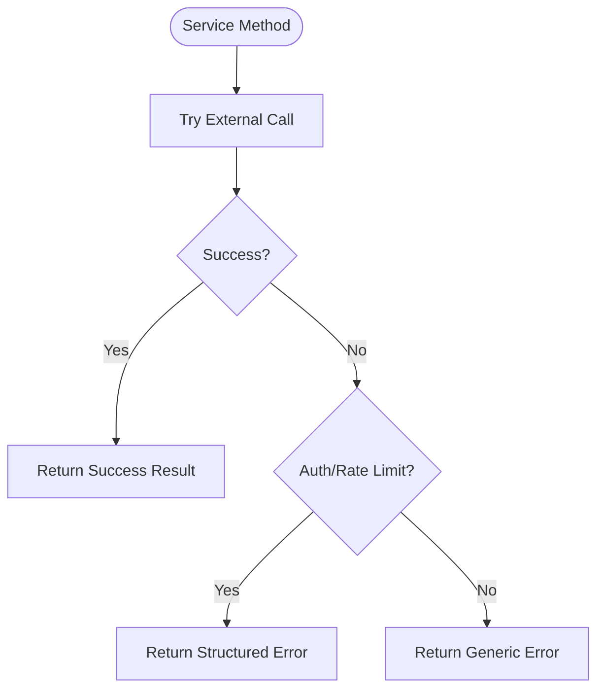
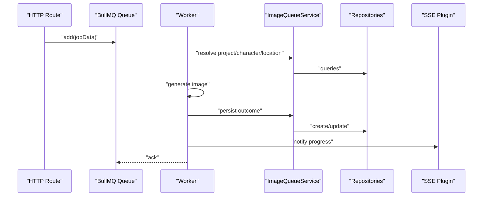
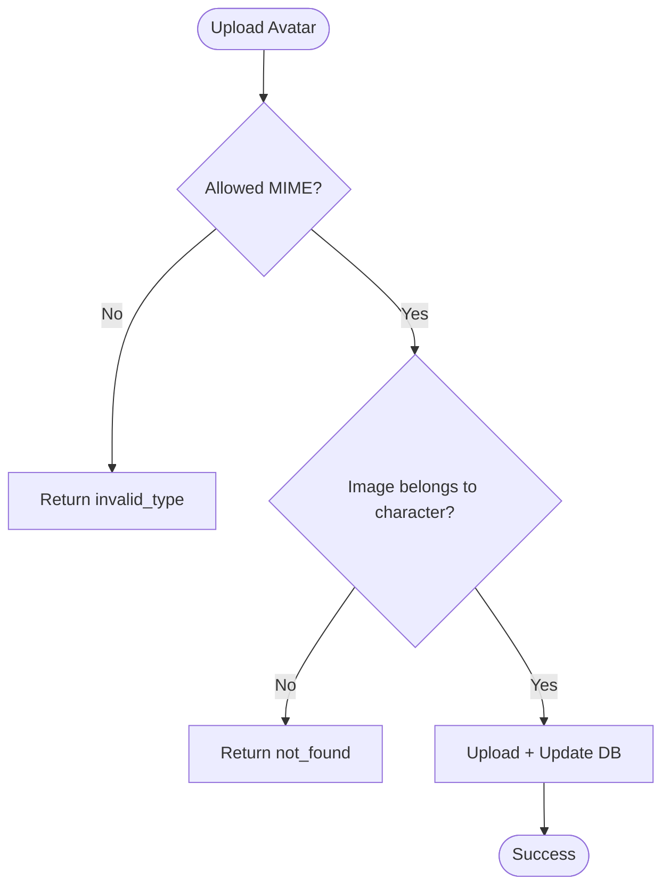
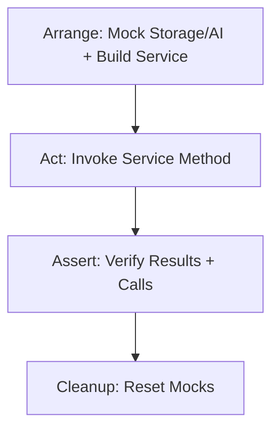
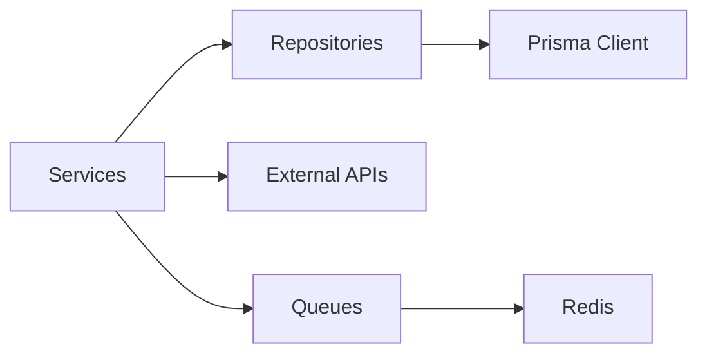

# Service Layer Architecture

<cite>
**Referenced Files in This Document**
- [index.ts](file://packages/backend/src/index.ts)
- [services/index.ts](file://packages/backend/src/services/index.ts)
- [character-service.ts](file://packages/backend/src/services/character-service.ts)
- [character-repository.ts](file://packages/backend/src/repositories/character-repository.ts)
- [pipeline-orchestrator.ts](file://packages/backend/src/services/pipeline-orchestrator.ts)
- [deepseek.ts](file://packages/backend/src/services/ai/deepseek.ts)
- [deepseek-client.ts](file://packages/backend/src/services/ai/deepseek-client.ts)
- [image-queue-service.ts](file://packages/backend/src/services/image-queue-service.ts)
- [image.ts](file://packages/backend/src/queues/image.ts)
- [prisma.ts](file://packages/backend/src/lib/prisma.ts)
- [worker.ts](file://packages/backend/src/worker.ts)
- [character-service.test.ts](file://packages/backend/tests/character-service.test.ts)
</cite>

## Table of Contents

1. [Introduction](#introduction)
2. [Project Structure](#project-structure)
3. [Core Components](#core-components)
4. [Architecture Overview](#architecture-overview)
5. [Detailed Component Analysis](#detailed-component-analysis)
6. [Dependency Analysis](#dependency-analysis)
7. [Performance Considerations](#performance-considerations)
8. [Troubleshooting Guide](#troubleshooting-guide)
9. [Conclusion](#conclusion)
10. [Appendices](#appendices)

## Introduction

This document describes the service layer architecture and business logic implementation of the backend. It explains how services encapsulate domain logic, how repositories abstract data access, and how orchestration coordinates cross-service workflows. It also covers dependency injection patterns, service composition, transaction management, error propagation, validation and transformation strategies, testing approaches, performance optimization, caching, and monitoring. Finally, it clarifies the relationships among services, repositories, and external APIs.

## Project Structure

The backend is organized around a layered architecture:

- Entry point initializes the HTTP server, registers plugins and routes.
- Services encapsulate business logic and coordinate operations across repositories and external APIs.
- Repositories abstract persistence via Prisma.
- Queues and workers handle asynchronous tasks independently from the HTTP server.
- Tests demonstrate mocking strategies and integration-style verification.

**Diagram sources**

- [index.ts:1-136](file://packages/backend/src/index.ts#L1-L136)
- [character-service.ts:1-268](file://packages/backend/src/services/character-service.ts#L1-L268)
- [character-repository.ts:1-194](file://packages/backend/src/repositories/character-repository.ts#L1-L194)
- [prisma.ts:1-4](file://packages/backend/src/lib/prisma.ts#L1-L4)
- [image.ts:1-302](file://packages/backend/src/queues/image.ts#L1-L302)
- [worker.ts:1-30](file://packages/backend/src/worker.ts#L1-L30)

**Section sources**

- [index.ts:1-136](file://packages/backend/src/index.ts#L1-L136)
- [services/index.ts:1-14](file://packages/backend/src/services/index.ts#L1-L14)

## Core Components

- Service pattern: Services are stateless or dependency-injected classes that orchestrate business operations, delegate persistence to repositories, and integrate with external APIs.
- Repository pattern: Repositories wrap Prisma queries and expose domain-focused methods, centralizing data access logic.
- Orchestration: A pipeline orchestrator composes multiple services into a production workflow, managing step boundaries, error propagation, and metrics.
- Queue-based composition: Background jobs offload long-running tasks and persist outcomes via a dedicated queue service that coordinates repository updates.
- Dependency injection: Services receive dependencies through constructors; repositories receive Prisma clients; queue workers receive injected repository adapters.

**Section sources**

- [character-service.ts:37-268](file://packages/backend/src/services/character-service.ts#L37-L268)
- [character-repository.ts:4-194](file://packages/backend/src/repositories/character-repository.ts#L4-L194)
- [pipeline-orchestrator.ts:80-399](file://packages/backend/src/services/pipeline-orchestrator.ts#L80-L399)
- [image-queue-service.ts:9-52](file://packages/backend/src/services/image-queue-service.ts#L9-L52)
- [image.ts:42-302](file://packages/backend/src/queues/image.ts#L42-L302)

## Architecture Overview

The service layer follows a clean architecture:

- HTTP routes depend on services.
- Services depend on repositories for persistence.
- Repositories depend on Prisma.
- External API integrations are encapsulated behind service modules.
- Asynchronous tasks are decoupled via queues and workers.

**Diagram sources**

- [index.ts:88-115](file://packages/backend/src/index.ts#L88-L115)
- [character-service.ts:37-268](file://packages/backend/src/services/character-service.ts#L37-L268)
- [character-repository.ts:4-194](file://packages/backend/src/repositories/character-repository.ts#L4-L194)
- [prisma.ts:1-4](file://packages/backend/src/lib/prisma.ts#L1-L4)
- [deepseek-client.ts:58-64](file://packages/backend/src/services/ai/deepseek-client.ts#L58-L64)
- [image-queue-service.ts:9-52](file://packages/backend/src/services/image-queue-service.ts#L9-L52)
- [image.ts:19-28](file://packages/backend/src/queues/image.ts#L19-L28)

## Detailed Component Analysis

### Service Pattern and Dependency Injection

- Services are instantiated with dependencies injected via constructors. For example, CharacterService receives a CharacterRepository instance.
- Repositories receive a Prisma client instance and encapsulate CRUD and aggregation operations.
- External API clients are isolated behind service modules (e.g., DeepSeek) to simplify DI and testing.

**Diagram sources**

- [character-service.ts:37-268](file://packages/backend/src/services/character-service.ts#L37-L268)
- [character-repository.ts:4-194](file://packages/backend/src/repositories/character-repository.ts#L4-L194)

**Section sources**

- [character-service.ts:37-268](file://packages/backend/src/services/character-service.ts#L37-L268)
- [character-repository.ts:4-194](file://packages/backend/src/repositories/character-repository.ts#L4-L194)

### Repository Pattern and Transaction Management

- Repositories centralize queries and mutations, exposing domain-specific methods.
- Transactions are used for batch operations, ensuring atomicity across related writes.

**Diagram sources**

- [character-repository.ts:127-135](file://packages/backend/src/repositories/character-repository.ts#L127-L135)

**Section sources**

- [character-repository.ts:127-135](file://packages/backend/src/repositories/character-repository.ts#L127-L135)

### Service Orchestration and Cross-Service Communication

- The pipeline orchestrator composes multiple services (script writing, episode splitting, action extraction, asset matching, storyboard generation, Seedance parametrization) into a single workflow.
- It manages step boundaries, collects results, and propagates errors with timing metrics.
- Step execution supports both full runs and single-step re-execution with data reuse.

**Diagram sources**

- [pipeline-orchestrator.ts:80-225](file://packages/backend/src/services/pipeline-orchestrator.ts#L80-L225)

**Section sources**

- [pipeline-orchestrator.ts:80-399](file://packages/backend/src/services/pipeline-orchestrator.ts#L80-L399)

### External API Integration and Error Propagation

- External API access is encapsulated behind service modules (e.g., DeepSeek). Dedicated errors are thrown for auth and rate-limit conditions.
- Service methods translate external errors into structured result unions, enabling robust error propagation to callers.

**Diagram sources**

- [character-service.ts:123-137](file://packages/backend/src/services/character-service.ts#L123-L137)
- [deepseek-client.ts:17-29](file://packages/backend/src/services/ai/deepseek-client.ts#L17-L29)

**Section sources**

- [character-service.ts:123-137](file://packages/backend/src/services/character-service.ts#L123-L137)
- [deepseek-client.ts:17-29](file://packages/backend/src/services/ai/deepseek-client.ts#L17-L29)

### Service Composition and Queue-Based Persistence

- Queue workers offload long-running tasks and persist outcomes via a queue service that depends on repositories.
- The queue service abstracts repository operations for worker-side writes, keeping workers free of route concerns.

**Diagram sources**

- [image.ts:42-287](file://packages/backend/src/queues/image.ts#L42-L287)
- [image-queue-service.ts:9-52](file://packages/backend/src/services/image-queue-service.ts#L9-L52)

**Section sources**

- [image.ts:42-302](file://packages/backend/src/queues/image.ts#L42-L302)
- [image-queue-service.ts:9-52](file://packages/backend/src/services/image-queue-service.ts#L9-L52)

### Business Rule Enforcement and Validation Strategies

- Services enforce domain rules (e.g., preventing cycles when moving image slots, preventing deletion of base images, enforcing single base slot per character).
- Validation includes MIME-type checks for uploads and structured error returns for external API failures.

**Diagram sources**

- [character-service.ts:177-198](file://packages/backend/src/services/character-service.ts#L177-L198)

**Section sources**

- [character-service.ts:177-198](file://packages/backend/src/services/character-service.ts#L177-L198)

### Data Transformation Patterns

- Services transform raw inputs into domain entities and normalize outputs for transport.
- Orchestration aggregates outputs from multiple services into a unified pipeline result.

**Section sources**

- [character-service.ts:9-11](file://packages/backend/src/services/character-service.ts#L9-L11)
- [pipeline-orchestrator.ts:212-219](file://packages/backend/src/services/pipeline-orchestrator.ts#L212-L219)

### Testing Approaches, Mocking, and Integration Testing

- Unit tests mock external dependencies (e.g., storage, AI prompt generator) and repository methods to isolate service logic.
- Integration-style tests verify cross-service behavior and error propagation.

**Diagram sources**

- [character-service.test.ts:32-126](file://packages/backend/tests/character-service.test.ts#L32-L126)

**Section sources**

- [character-service.test.ts:1-228](file://packages/backend/tests/character-service.test.ts#L1-L228)

## Dependency Analysis

- Coupling: Services depend on repositories and external modules; repositories depend on Prisma. This maintains low coupling and high cohesion.
- External dependencies: Redis/BullMQ for queues, OpenAI-compatible clients for external APIs.
- No circular dependencies observed in the examined files.

**Diagram sources**

- [character-service.ts:37-268](file://packages/backend/src/services/character-service.ts#L37-L268)
- [character-repository.ts:4-194](file://packages/backend/src/repositories/character-repository.ts#L4-L194)
- [prisma.ts:1-4](file://packages/backend/src/lib/prisma.ts#L1-L4)
- [image.ts:19-28](file://packages/backend/src/queues/image.ts#L19-L28)

**Section sources**

- [character-service.ts:37-268](file://packages/backend/src/services/character-service.ts#L37-L268)
- [character-repository.ts:4-194](file://packages/backend/src/repositories/character-repository.ts#L4-L194)
- [prisma.ts:1-4](file://packages/backend/src/lib/prisma.ts#L1-L4)
- [image.ts:19-28](file://packages/backend/src/queues/image.ts#L19-L28)

## Performance Considerations

- Asynchronous processing: Long-running tasks are moved to workers to keep the HTTP server responsive.
- Concurrency tuning: Worker concurrency is configured per queue to balance throughput and resource usage.
- Cost estimation: Pipelines include cost estimation helpers to guide budget-aware operations.
- Caching: External API pricing accounts for cache-hit scenarios to estimate costs.

**Section sources**

- [image.ts:283-287](file://packages/backend/src/queues/image.ts#L283-L287)
- [pipeline-orchestrator.ts:377-399](file://packages/backend/src/services/pipeline-orchestrator.ts#L377-L399)
- [deepseek-client.ts:31-56](file://packages/backend/src/services/ai/deepseek-client.ts#L31-L56)

## Troubleshooting Guide

- Authentication and rate limit errors from external APIs are surfaced as structured errors; services map these to result unions for safe propagation.
- Queue failures are recorded with detailed metadata and notifications are sent via SSE for visibility.
- Graceful shutdown ensures workers and connections are closed cleanly.

**Section sources**

- [deepseek-client.ts:17-29](file://packages/backend/src/services/ai/deepseek-client.ts#L17-L29)
- [image.ts:249-281](file://packages/backend/src/queues/image.ts#L249-L281)
- [worker.ts:14-29](file://packages/backend/src/worker.ts#L14-L29)

## Conclusion

The service layer employs a clean separation of concerns: services encapsulate business logic, repositories abstract persistence, and queues handle asynchronous workloads. Orchestration composes services into end-to-end workflows, while DI and mocking enable maintainable testing. External API integration is isolated behind service modules with explicit error handling. Performance and observability are addressed through worker concurrency, SSE notifications, and cost estimation.

## Appendices

- Entry point and routing registration are centralized in the HTTP server bootstrap.
- Service exports are aggregated for convenient imports across the application.

**Section sources**

- [index.ts:44-127](file://packages/backend/src/index.ts#L44-L127)
- [services/index.ts:1-14](file://packages/backend/src/services/index.ts#L1-L14)
