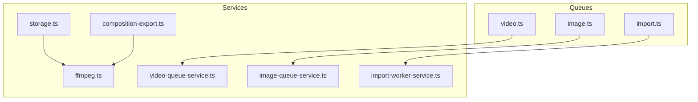
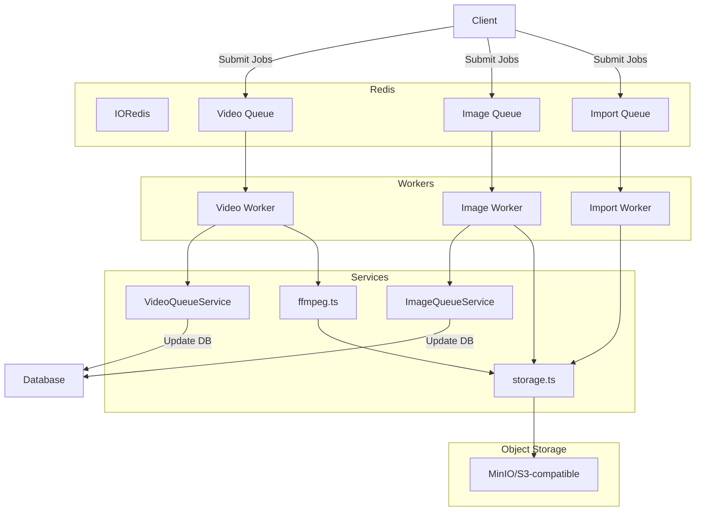
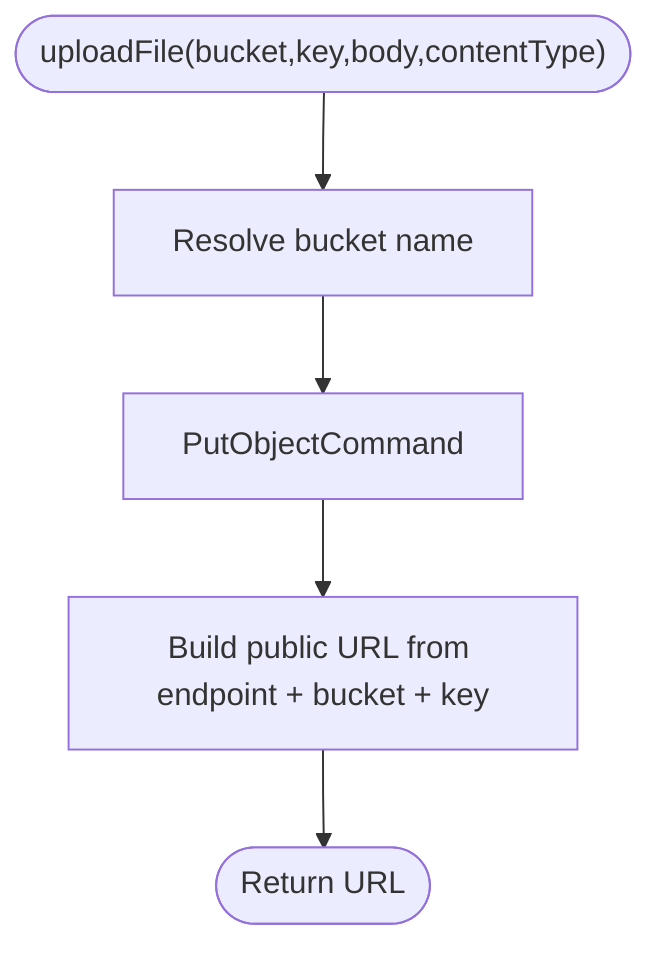
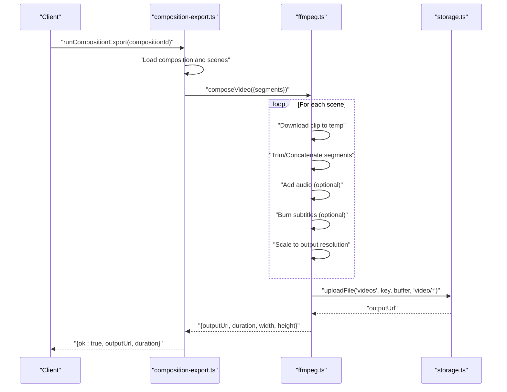
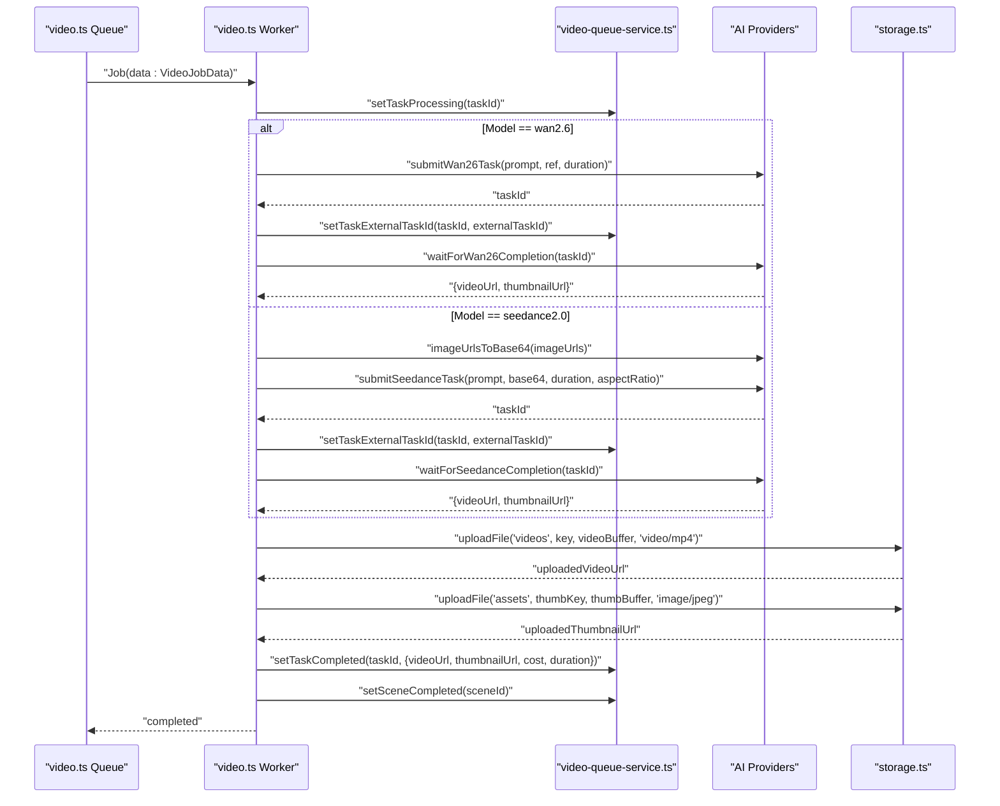
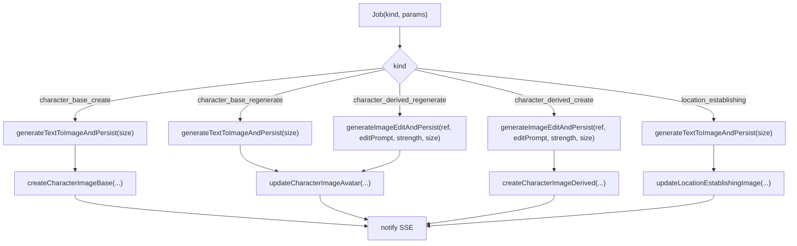
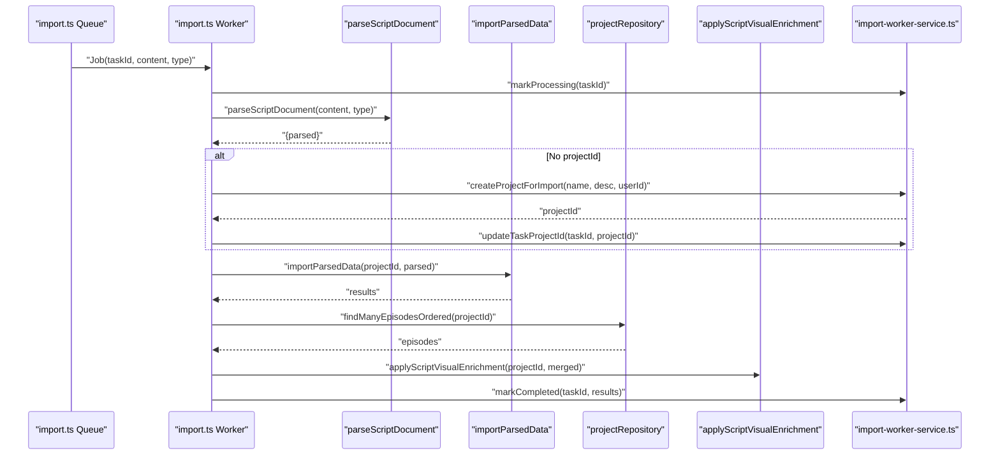
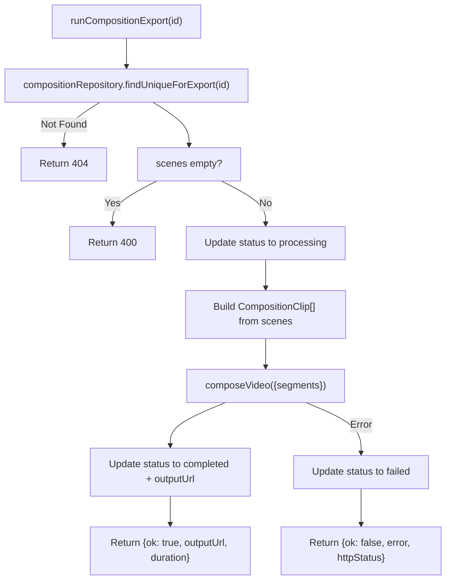
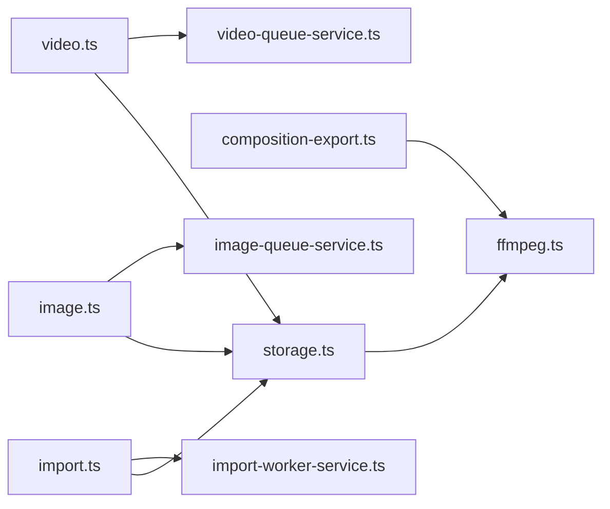

# Storage and Media Services

<cite>
**Referenced Files in This Document**
- [storage.ts](file://packages/backend/src/services/storage.ts)
- [ffmpeg.ts](file://packages/backend/src/services/ffmpeg.ts)
- [composition-export.ts](file://packages/backend/src/services/composition-export.ts)
- [video.ts](file://packages/backend/src/queues/video.ts)
- [image.ts](file://packages/backend/src/queues/image.ts)
- [import.ts](file://packages/backend/src/queues/import.ts)
- [video-queue-service.ts](file://packages/backend/src/services/video-queue-service.ts)
- [image-queue-service.ts](file://packages/backend/src/services/image-queue-service.ts)
- [import-worker-service.ts](file://packages/backend/src/services/import-worker-service.ts)
- [storage.test.ts](file://packages/backend/tests/storage.test.ts)
- [ffmpeg.test.ts](file://packages/backend/tests/ffmpeg.test.ts)
- [composition-export.test.ts](file://packages/backend/tests/composition-export.test.ts)
</cite>

## Table of Contents

1. [Introduction](#introduction)
2. [Project Structure](#project-structure)
3. [Core Components](#core-components)
4. [Architecture Overview](#architecture-overview)
5. [Detailed Component Analysis](#detailed-component-analysis)
6. [Dependency Analysis](#dependency-analysis)
7. [Performance Considerations](#performance-considerations)
8. [Troubleshooting Guide](#troubleshooting-guide)
9. [Conclusion](#conclusion)

## Introduction

This document describes the storage management and media processing services powering video composition, image generation, and batch import workflows. It explains the storage abstraction over object storage, FFmpeg integration for media composition, queue management for asynchronous generation, and the orchestration of jobs across workers. It also covers file upload/download patterns, object storage integration, media format conversion, batch processing workflows, queue service implementations for video and image generation, job prioritization, and resource management. Finally, it outlines performance optimization, caching strategies, and storage cost management.

## Project Structure

The relevant backend modules are organized by domain:

- Services: storage abstraction, FFmpeg composition, composition export orchestrator, AI image generation, and queue services
- Queues: BullMQ-based workers for video, image, and import jobs
- Tests: unit and integration tests validating storage, FFmpeg composition, and composition export flows

**Diagram sources**

- [storage.ts:1-74](file://packages/backend/src/services/storage.ts#L1-L74)
- [ffmpeg.ts:1-341](file://packages/backend/src/services/ffmpeg.ts#L1-L341)
- [composition-export.ts:1-61](file://packages/backend/src/services/composition-export.ts#L1-L61)
- [video.ts:1-279](file://packages/backend/src/queues/video.ts#L1-L279)
- [image.ts:1-304](file://packages/backend/src/queues/image.ts#L1-L304)
- [import.ts:1-114](file://packages/backend/src/queues/import.ts#L1-L114)
- [video-queue-service.ts:1-61](file://packages/backend/src/services/video-queue-service.ts#L1-L61)
- [image-queue-service.ts:1-52](file://packages/backend/src/services/image-queue-service.ts#L1-L52)
- [import-worker-service.ts:1-36](file://packages/backend/src/services/import-worker-service.ts#L1-L36)

**Section sources**

- [storage.ts:1-74](file://packages/backend/src/services/storage.ts#L1-L74)
- [ffmpeg.ts:1-341](file://packages/backend/src/services/ffmpeg.ts#L1-L341)
- [composition-export.ts:1-61](file://packages/backend/src/services/composition-export.ts#L1-L61)
- [video.ts:1-279](file://packages/backend/src/queues/video.ts#L1-L279)
- [image.ts:1-304](file://packages/backend/src/queues/image.ts#L1-L304)
- [import.ts:1-114](file://packages/backend/src/queues/import.ts#L1-L114)
- [video-queue-service.ts:1-61](file://packages/backend/src/services/video-queue-service.ts#L1-L61)
- [image-queue-service.ts:1-52](file://packages/backend/src/services/image-queue-service.ts#L1-L52)
- [import-worker-service.ts:1-36](file://packages/backend/src/services/import-worker-service.ts#L1-L36)

## Core Components

- Storage service: Provides upload, URL generation, deletion, and key generation for object storage (MinIO-compatible) with configurable buckets for assets and videos.
- FFmpeg service: Implements video composition from multiple clips, optional voiceover/BGM addition, subtitle burning, scaling, and final upload to object storage.
- Composition export: Orchestrates composition export from persisted scenes, updating status and returning output URLs.
- Queue services: Video and image queue workers manage retries, exponential backoff, SSE notifications, and database updates for task/scene lifecycle.
- Import queue: Batch import worker parses documents, optionally creates projects, imports parsed data, enriches scripts, and updates task state.

**Section sources**

- [storage.ts:28-74](file://packages/backend/src/services/storage.ts#L28-L74)
- [ffmpeg.ts:244-341](file://packages/backend/src/services/ffmpeg.ts#L244-L341)
- [composition-export.ts:12-61](file://packages/backend/src/services/composition-export.ts#L12-L61)
- [video.ts:24-33](file://packages/backend/src/queues/video.ts#L24-L33)
- [image.ts:19-28](file://packages/backend/src/queues/image.ts#L19-L28)
- [import.ts:30-39](file://packages/backend/src/queues/import.ts#L30-L39)

## Architecture Overview

The system integrates object storage and FFmpeg for media processing, coordinated by Redis-backed BullMQ queues. Workers consume jobs, call AI providers or FFmpeg, persist results, and notify clients via server-sent events.

**Diagram sources**

- [video.ts:24-33](file://packages/backend/src/queues/video.ts#L24-L33)
- [image.ts:19-28](file://packages/backend/src/queues/image.ts#L19-L28)
- [import.ts:30-39](file://packages/backend/src/queues/import.ts#L30-L39)
- [video.ts:36-263](file://packages/backend/src/queues/video.ts#L36-L263)
- [image.ts:38-289](file://packages/backend/src/queues/image.ts#L38-L289)
- [import.ts:42-95](file://packages/backend/src/queues/import.ts#L42-L95)
- [video-queue-service.ts:6-61](file://packages/backend/src/services/video-queue-service.ts#L6-L61)
- [image-queue-service.ts:9-52](file://packages/backend/src/services/image-queue-service.ts#L9-L52)
- [ffmpeg.ts:244-341](file://packages/backend/src/services/ffmpeg.ts#L244-L341)
- [storage.ts:28-74](file://packages/backend/src/services/storage.ts#L28-L74)

## Detailed Component Analysis

### Storage Service Abstraction

The storage service encapsulates object storage operations with:

- Environment-driven configuration for endpoint, region, credentials, and bucket names
- Upload with content-type, URL generation, and deletion
- Key generation with timestamp, randomness, and sanitized filenames

**Diagram sources**

- [storage.ts:28-48](file://packages/backend/src/services/storage.ts#L28-L48)

Key behaviors:

- Bucket selection via type union
- URL construction using configured endpoint and bucket
- Key generation ensuring uniqueness and safe naming

**Section sources**

- [storage.ts:9-26](file://packages/backend/src/services/storage.ts#L9-L26)
- [storage.ts:28-48](file://packages/backend/src/services/storage.ts#L28-L48)
- [storage.ts:50-64](file://packages/backend/src/services/storage.ts#L50-L64)
- [storage.ts:66-74](file://packages/backend/src/services/storage.ts#L66-L74)

### FFmpeg Integration and Composition Export

The FFmpeg service composes videos from multiple clips, optionally adds audio tracks, burns subtitles, scales resolution, and uploads the result to object storage. The composition export service orchestrates this from persisted scenes.

**Diagram sources**

- [composition-export.ts:12-61](file://packages/backend/src/services/composition-export.ts#L12-L61)
- [ffmpeg.ts:244-341](file://packages/backend/src/services/ffmpeg.ts#L244-L341)
- [storage.ts:28-48](file://packages/backend/src/services/storage.ts#L28-L48)

Composition steps:

- Segment merging with trimming and concatenation
- Optional voiceover/BGM addition with volume control
- Subtitle burning into video frames
- Resolution scaling
- Final upload to videos bucket with generated key

**Section sources**

- [ffmpeg.ts:36-42](file://packages/backend/src/services/ffmpeg.ts#L36-L42)
- [ffmpeg.ts:77-133](file://packages/backend/src/services/ffmpeg.ts#L77-L133)
- [ffmpeg.ts:138-168](file://packages/backend/src/services/ffmpeg.ts#L138-L168)
- [ffmpeg.ts:173-209](file://packages/backend/src/services/ffmpeg.ts#L173-L209)
- [ffmpeg.ts:214-239](file://packages/backend/src/services/ffmpeg.ts#L214-L239)
- [ffmpeg.ts:244-341](file://packages/backend/src/services/ffmpeg.ts#L244-L341)
- [composition-export.ts:12-61](file://packages/backend/src/services/composition-export.ts#L12-L61)

### Queue Management for Video Generation

The video queue worker manages retries, exponential backoff, AI provider calls, SSE notifications, and database updates. It supports two models and uploads artifacts to object storage.

**Diagram sources**

- [video.ts:36-263](file://packages/backend/src/queues/video.ts#L36-L263)
- [video-queue-service.ts:14-57](file://packages/backend/src/services/video-queue-service.ts#L14-L57)
- [storage.ts:28-48](file://packages/backend/src/services/storage.ts#L28-L48)

Queue configuration:

- Attempts with exponential backoff
- Concurrency tuned for GPU/AI provider throughput
- SSE notifications for real-time updates

**Section sources**

- [video.ts:24-33](file://packages/backend/src/queues/video.ts#L24-L33)
- [video.ts:36-263](file://packages/backend/src/queues/video.ts#L36-L263)
- [video-queue-service.ts:6-61](file://packages/backend/src/services/video-queue-service.ts#L6-L61)

### Queue Management for Image Generation

The image queue worker handles multiple job kinds (character base/create, derived regenerate/create, location establishing), computes image sizes from project aspect ratios, persists results, records API calls, and notifies via SSE.

**Diagram sources**

- [image.ts:38-289](file://packages/backend/src/queues/image.ts#L38-L289)
- [image-queue-service.ts:24-44](file://packages/backend/src/services/image-queue-service.ts#L24-L44)

**Section sources**

- [image.ts:19-28](file://packages/backend/src/queues/image.ts#L19-L28)
- [image.ts:38-289](file://packages/backend/src/queues/image.ts#L38-L289)
- [image-queue-service.ts:9-52](file://packages/backend/src/services/image-queue-service.ts#L9-L52)

### Import Queue and Batch Processing

The import queue worker parses content, optionally creates a project, imports parsed data, merges episodes, applies visual enrichment, and updates task state.

**Diagram sources**

- [import.ts:42-95](file://packages/backend/src/queues/import.ts#L42-L95)
- [import-worker-service.ts:5-35](file://packages/backend/src/services/import-worker-service.ts#L5-L35)

**Section sources**

- [import.ts:30-39](file://packages/backend/src/queues/import.ts#L30-L39)
- [import.ts:42-95](file://packages/backend/src/queues/import.ts#L42-L95)
- [import-worker-service.ts:5-35](file://packages/backend/src/services/import-worker-service.ts#L5-L35)

### Composition Export Orchestration

The composition export service validates composition state, iterates scenes to build clips, invokes FFmpeg composition, updates status, and returns results.

**Diagram sources**

- [composition-export.ts:12-61](file://packages/backend/src/services/composition-export.ts#L12-L61)
- [ffmpeg.ts:244-341](file://packages/backend/src/services/ffmpeg.ts#L244-L341)

**Section sources**

- [composition-export.ts:12-61](file://packages/backend/src/services/composition-export.ts#L12-L61)

## Dependency Analysis

- Storage service depends on AWS SDK S3 client and environment variables for endpoint, region, credentials, and bucket names.
- FFmpeg service depends on child process spawning, filesystem, OS temp directories, and storage service for final upload.
- Composition export depends on composition repository and FFmpeg service.
- Video queue worker depends on AI providers, storage service, SSE plugin, API logger, and video queue service.
- Image queue worker depends on AI image generation utilities, SSE plugin, API logger, and image queue service.
- Import queue worker depends on parser, importer, project repository, and import worker service.

**Diagram sources**

- [storage.ts:1-74](file://packages/backend/src/services/storage.ts#L1-L74)
- [ffmpeg.ts:1-341](file://packages/backend/src/services/ffmpeg.ts#L1-L341)
- [composition-export.ts:1-61](file://packages/backend/src/services/composition-export.ts#L1-L61)
- [video.ts:1-279](file://packages/backend/src/queues/video.ts#L1-L279)
- [image.ts:1-304](file://packages/backend/src/queues/image.ts#L1-L304)
- [import.ts:1-114](file://packages/backend/src/queues/import.ts#L1-L114)
- [video-queue-service.ts:1-61](file://packages/backend/src/services/video-queue-service.ts#L1-L61)
- [image-queue-service.ts:1-52](file://packages/backend/src/services/image-queue-service.ts#L1-L52)
- [import-worker-service.ts:1-36](file://packages/backend/src/services/import-worker-service.ts#L1-L36)

**Section sources**

- [storage.ts:1-74](file://packages/backend/src/services/storage.ts#L1-L74)
- [ffmpeg.ts:1-341](file://packages/backend/src/services/ffmpeg.ts#L1-L341)
- [composition-export.ts:1-61](file://packages/backend/src/services/composition-export.ts#L1-L61)
- [video.ts:1-279](file://packages/backend/src/queues/video.ts#L1-L279)
- [image.ts:1-304](file://packages/backend/src/queues/image.ts#L1-L304)
- [import.ts:1-114](file://packages/backend/src/queues/import.ts#L1-L114)
- [video-queue-service.ts:1-61](file://packages/backend/src/services/video-queue-service.ts#L1-L61)
- [image-queue-service.ts:1-52](file://packages/backend/src/services/image-queue-service.ts#L1-L52)
- [import-worker-service.ts:1-36](file://packages/backend/src/services/import-worker-service.ts#L1-L36)

## Performance Considerations

- Asynchronous processing: Use BullMQ queues to decouple long-running tasks (video/image generation, composition) from request threads.
- Retries and backoff: Configure attempts and exponential backoff to handle transient failures in AI providers and network I/O.
- Concurrency tuning: Adjust worker concurrency per available GPU/CPU resources and provider rate limits.
- Temporary file management: Clean up temp files after FFmpeg operations to avoid disk pressure.
- Object storage costs: Prefer efficient container formats and resolutions; reuse thumbnails; archive old assets according to retention policies.
- Caching strategies: Cache frequently accessed metadata (project aspect ratio) in workers to reduce database round-trips.
- Network efficiency: Stream downloads and uploads where possible; avoid unnecessary buffering.

[No sources needed since this section provides general guidance]

## Troubleshooting Guide

Common issues and diagnostics:

- Storage failures: Verify endpoint, region, credentials, and bucket names; check object storage connectivity and permissions.
- FFmpeg errors: Confirm FFmpeg/ffprobe availability and accessibility; inspect exit codes and logs for trimming/concat/audio/subtitle operations.
- Queue job failures: Inspect retry logs, external task IDs, and SSE notifications; ensure Redis connectivity and queue persistence.
- Composition export errors: Validate composition existence, scene completeness, and take video URLs before composition.
- Import parsing errors: Review parser outputs and database writes; confirm episode merging and visual enrichment steps.

**Section sources**

- [storage.test.ts:1-117](file://packages/backend/tests/storage.test.ts#L1-L117)
- [ffmpeg.test.ts:1-113](file://packages/backend/tests/ffmpeg.test.ts#L1-L113)
- [composition-export.test.ts:1-107](file://packages/backend/tests/composition-export.test.ts#L1-L107)
- [video.ts:269-271](file://packages/backend/src/queues/video.ts#L269-L271)
- [image.ts:295-297](file://packages/backend/src/queues/image.ts#L295-L297)
- [import.ts:101-103](file://packages/backend/src/queues/import.ts#L101-L103)

## Conclusion

The system combines a robust storage abstraction, FFmpeg-based composition, and Redis-backed queue workers to support scalable media generation and batch processing. By leveraging retries, SSE notifications, and database orchestration, it ensures reliable job execution while enabling performance optimizations through concurrency tuning, caching, and storage cost controls.
