# Utility and Helper Services

<cite>
**Referenced Files in This Document**
- [memory-service.ts](file://packages/backend/src/services/memory/memory-service.ts)
- [context-builder.ts](file://packages/backend/src/services/memory/context-builder.ts)
- [extractor.ts](file://packages/backend/src/services/memory/extractor.ts)
- [template-engine.ts](file://packages/backend/src/services/prompts/template-engine.ts)
- [action-extractor.ts](file://packages/backend/src/services/action-extractor.ts)
- [storyboard-generator.ts](file://packages/backend/src/services/storyboard-generator.ts)
- [importer.ts](file://packages/backend/src/services/importer.ts)
- [task-service.ts](file://packages/backend/src/services/task-service.ts)
- [api-logger.ts](file://packages/backend/src/services/ai/api-logger.ts)
- [llm-call-wrapper.ts](file://packages/backend/src/services/ai/llm-call-wrapper.ts)
- [ai.constants.ts](file://packages/backend/src/services/ai/ai.constants.ts)
</cite>

## Table of Contents

1. [Introduction](#introduction)
2. [Project Structure](#project-structure)
3. [Core Components](#core-components)
4. [Architecture Overview](#architecture-overview)
5. [Detailed Component Analysis](#detailed-component-analysis)
6. [Dependency Analysis](#dependency-analysis)
7. [Performance Considerations](#performance-considerations)
8. [Troubleshooting Guide](#troubleshooting-guide)
9. [Conclusion](#conclusion)

## Introduction

This document describes the utility and helper services that provide cross-cutting functionality across the Dreamer application. It focuses on:

- Memory service for context management and story memory extraction
- Prompt template engine for standardized prompt construction
- Action extraction utilities for transforming script scenes into actionable video elements
- Storyboard generation helpers for assembling visual and audio elements
- Data importers for ingesting parsed scripts into the system
- Task management services for video generation lifecycle
- Configuration management, logging utilities, and debugging support

These services are designed to be reusable, testable, and integrated with the broader AI pipeline and data repositories.

## Project Structure

The relevant utility and helper services are organized under the backend package, primarily in the services directory. Supporting AI infrastructure (LLM providers, wrappers, and constants) resides alongside these services to enable consistent prompting and model interactions.

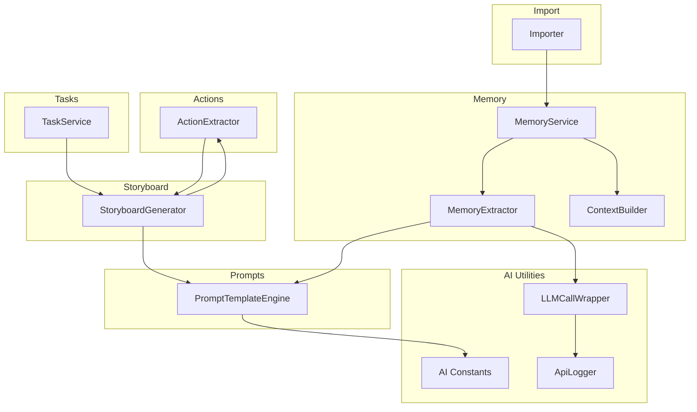

**Diagram sources**

- [memory-service.ts:1-112](file://packages/backend/src/services/memory/memory-service.ts#L1-L112)
- [context-builder.ts:1-121](file://packages/backend/src/services/memory/context-builder.ts#L1-L121)
- [extractor.ts:1-109](file://packages/backend/src/services/memory/extractor.ts#L1-L109)
- [template-engine.ts:1-282](file://packages/backend/src/services/prompts/template-engine.ts#L1-L282)
- [action-extractor.ts:1-428](file://packages/backend/src/services/action-extractor.ts#L1-L428)
- [storyboard-generator.ts:1-517](file://packages/backend/src/services/storyboard-generator.ts#L1-L517)
- [importer.ts:1-160](file://packages/backend/src/services/importer.ts#L1-L160)
- [task-service.ts:1-93](file://packages/backend/src/services/task-service.ts#L1-L93)
- [api-logger.ts:1-167](file://packages/backend/src/services/ai/api-logger.ts#L1-L167)
- [llm-call-wrapper.ts:1-177](file://packages/backend/src/services/ai/llm-call-wrapper.ts#L1-L177)
- [ai.constants.ts:1-78](file://packages/backend/src/services/ai/ai.constants.ts#L1-L78)

**Section sources**

- [memory-service.ts:1-112](file://packages/backend/src/services/memory/memory-service.ts#L1-L112)
- [template-engine.ts:1-282](file://packages/backend/src/services/prompts/template-engine.ts#L1-L282)
- [action-extractor.ts:1-428](file://packages/backend/src/services/action-extractor.ts#L1-L428)
- [storyboard-generator.ts:1-517](file://packages/backend/src/services/storyboard-generator.ts#L1-L517)
- [importer.ts:1-160](file://packages/backend/src/services/importer.ts#L1-L160)
- [task-service.ts:1-93](file://packages/backend/src/services/task-service.ts#L1-L93)
- [api-logger.ts:1-167](file://packages/backend/src/services/ai/api-logger.ts#L1-L167)
- [llm-call-wrapper.ts:1-177](file://packages/backend/src/services/ai/llm-call-wrapper.ts#L1-L177)
- [ai.constants.ts:1-78](file://packages/backend/src/services/ai/ai.constants.ts#L1-L78)

## Core Components

This section outlines the primary utility services and their responsibilities.

- Memory Service
  - Orchestrates memory extraction from scripts, builds contextual prompts for writing and storyboard generation, and manages memory CRUD operations.
  - Provides single-instance access via a factory function.

- Prompt Template Engine
  - Centralized template registry with versioning, interpolation, and rendering for system/user prompts.
  - Supports advanced templating constructs including sections, arrays, and nested property access.

- Action Extraction Utilities
  - Transforms script scenes into structured actions with inferred emotions, types, and durations.
  - Provides helpers for grouping, merging, and sequencing actions across scenes.

- Storyboard Generation Helpers
  - Assembles storyboard segments from scenes, actions, assets, and voice configurations.
  - Generates Seedance prompts and exports storyboard data to text or JSON.

- Data Importers
  - Imports parsed scripts into projects, creating episodes, scenes, and character images with normalized aspect ratios.

- Task Management Services
  - Manages the lifecycle of video generation tasks (cancel/retry), updates scene statuses, and enqueues work.

- Logging and Debugging Utilities
  - Unified API call logging with truncation, filtering, and structured persistence.
  - LLM call wrapper with retry logic, error categorization, and cost tracking.

**Section sources**

- [memory-service.ts:10-112](file://packages/backend/src/services/memory/memory-service.ts#L10-L112)
- [template-engine.ts:52-139](file://packages/backend/src/services/prompts/template-engine.ts#L52-L139)
- [action-extractor.ts:16-80](file://packages/backend/src/services/action-extractor.ts#L16-L80)
- [storyboard-generator.ts:29-123](file://packages/backend/src/services/storyboard-generator.ts#L29-L123)
- [importer.ts:67-160](file://packages/backend/src/services/importer.ts#L67-L160)
- [task-service.ts:20-93](file://packages/backend/src/services/task-service.ts#L20-L93)
- [api-logger.ts:36-167](file://packages/backend/src/services/ai/api-logger.ts#L36-L167)
- [llm-call-wrapper.ts:51-142](file://packages/backend/src/services/ai/llm-call-wrapper.ts#L51-L142)

## Architecture Overview

The utility services integrate with repositories and AI infrastructure to form a cohesive pipeline. The memory service coordinates with the prompt template engine and LLM call wrapper to extract and persist story memories. The action extractor feeds the storyboard generator, which composes visual and audio elements and generates prompts for content generation models. Importers populate the system with parsed scripts, while task services manage asynchronous video generation.

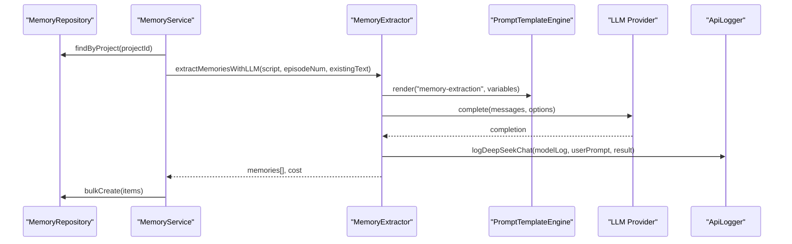

**Diagram sources**

- [memory-service.ts:16-58](file://packages/backend/src/services/memory/memory-service.ts#L16-L58)
- [extractor.ts:27-93](file://packages/backend/src/services/memory/extractor.ts#L27-L93)
- [template-engine.ts:115-128](file://packages/backend/src/services/prompts/template-engine.ts#L115-L128)
- [api-logger.ts:78-101](file://packages/backend/src/services/ai/api-logger.ts#L78-L101)

**Section sources**

- [memory-service.ts:16-100](file://packages/backend/src/services/memory/memory-service.ts#L16-L100)
- [extractor.ts:27-93](file://packages/backend/src/services/memory/extractor.ts#L27-L93)
- [template-engine.ts:115-128](file://packages/backend/src/services/prompts/template-engine.ts#L115-L128)
- [api-logger.ts:78-101](file://packages/backend/src/services/ai/api-logger.ts#L78-L101)

## Detailed Component Analysis

### Memory Service

The MemoryService encapsulates memory lifecycle operations:

- Extract and save memories from scripts using an LLM-backed extractor
- Build contextual prompts for episode writing and storyboard generation
- Query, update, delete, and search memories with similarity matching

Key behaviors:

- Formats existing memories for LLM prompts
- Uses a singleton pattern for consistent repository access
- Returns extraction metrics (count and cost) for observability

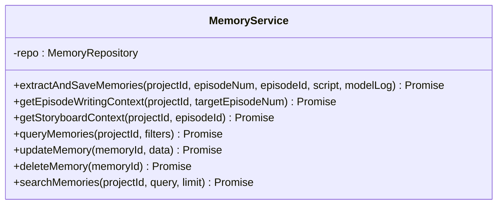

**Diagram sources**

- [memory-service.ts:10-101](file://packages/backend/src/services/memory/memory-service.ts#L10-L101)

**Section sources**

- [memory-service.ts:10-112](file://packages/backend/src/services/memory/memory-service.ts#L10-L112)

### Context Builder

Builds structured contexts for writing and storyboard generation:

- Episode writing context groups memories by type (characters, locations, events, foreshadowings, relationships)
- Storyboard context filters active, high-importance memories and aggregates visual references

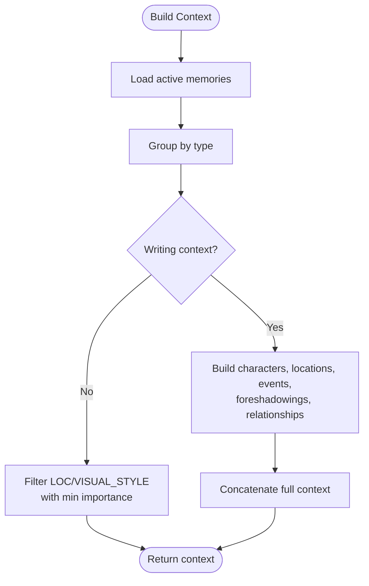

**Diagram sources**

- [context-builder.ts:16-106](file://packages/backend/src/services/memory/context-builder.ts#L16-L106)

**Section sources**

- [context-builder.ts:16-121](file://packages/backend/src/services/memory/context-builder.ts#L16-L121)

### Memory Extractor

Extracts structured memories from scripts using a template-driven prompt and parses JSON responses:

- Renders a memory extraction template with episode and script context
- Calls the LLM provider with retry logic and cost tracking
- Parses and validates the returned JSON structure

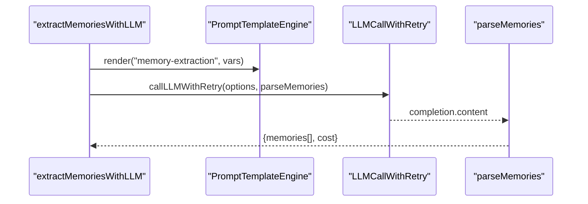

**Diagram sources**

- [extractor.ts:27-93](file://packages/backend/src/services/memory/extractor.ts#L27-L93)
- [llm-call-wrapper.ts:51-92](file://packages/backend/src/services/ai/llm-call-wrapper.ts#L51-L92)

**Section sources**

- [extractor.ts:27-109](file://packages/backend/src/services/memory/extractor.ts#L27-L109)

### Prompt Template Engine

Provides a robust templating system:

- Registers multiple versions per template ID and selects latest or requested version
- Interpolates variables with support for conditionals, loops, and nested paths
- Exposes convenience methods for category queries and existence checks

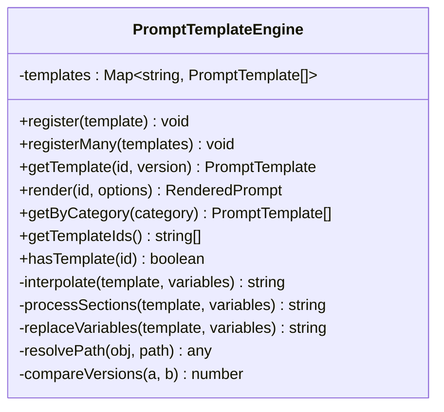

**Diagram sources**

- [template-engine.ts:52-282](file://packages/backend/src/services/prompts/template-engine.ts#L52-L282)

**Section sources**

- [template-engine.ts:52-282](file://packages/backend/src/services/prompts/template-engine.ts#L52-L282)

### Action Extraction Utilities

Transforms script scenes into actionable video elements:

- Extracts dialogues and descriptive actions
- Infers action types and emotions from text
- Groups actions by character and limits counts
- Determines video style, suggested duration, and camera movement

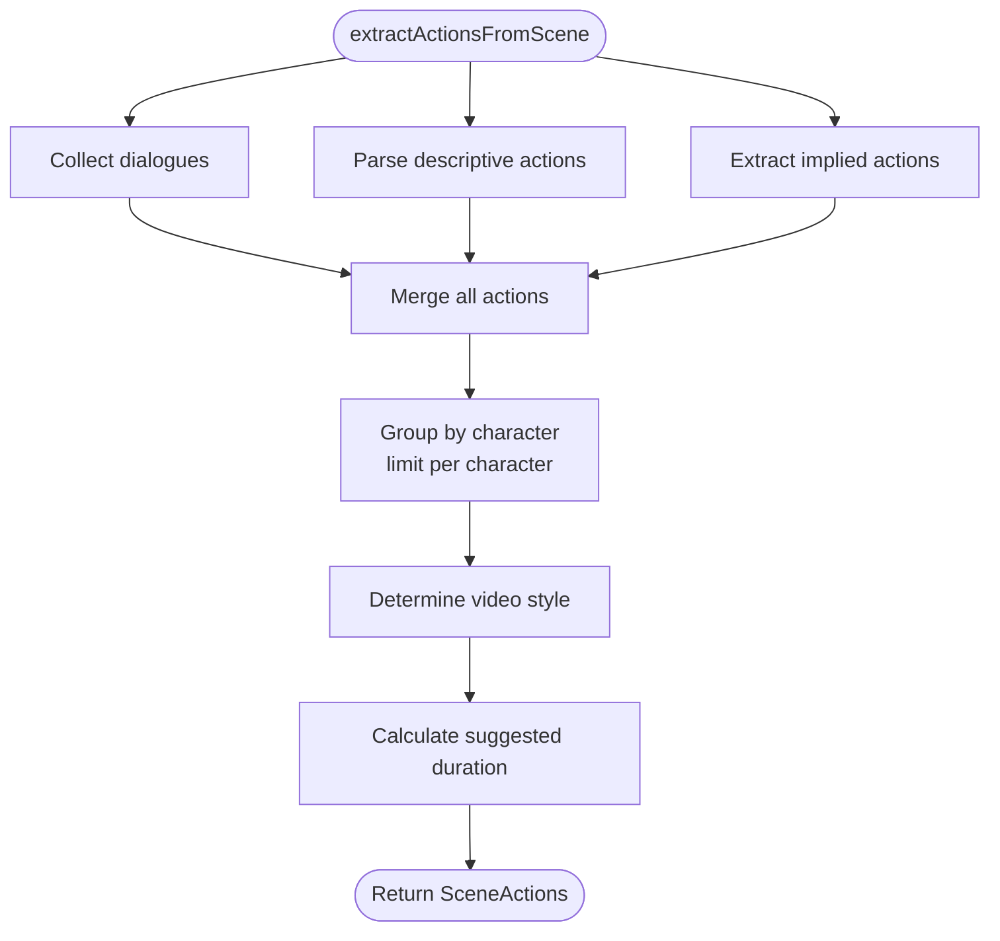

**Diagram sources**

- [action-extractor.ts:16-80](file://packages/backend/src/services/action-extractor.ts#L16-L80)

**Section sources**

- [action-extractor.ts:16-428](file://packages/backend/src/services/action-extractor.ts#L16-L428)

### Storyboard Generator

Assembles storyboard segments from scenes and actions:

- Builds character info, visual style, camera movement, and special effects
- Generates voice segments with timing and inferred voice configs
- Creates Seedance prompts and exports to text/JSON formats

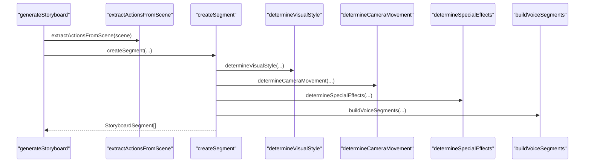

**Diagram sources**

- [storyboard-generator.ts:29-123](file://packages/backend/src/services/storyboard-generator.ts#L29-L123)

**Section sources**

- [storyboard-generator.ts:29-517](file://packages/backend/src/services/storyboard-generator.ts#L29-L517)

### Data Importer

Imports parsed scripts into projects:

- Normalizes project aspect ratio and creates characters with images
- Upserts episodes and scenes, preserving script content and generating initial shots

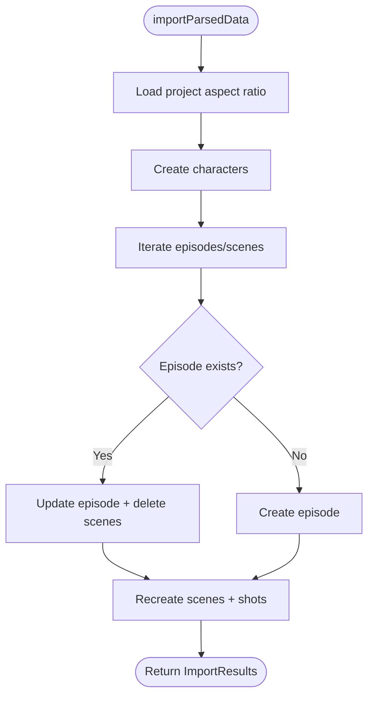

**Diagram sources**

- [importer.ts:67-160](file://packages/backend/src/services/importer.ts#L67-L160)

**Section sources**

- [importer.ts:67-160](file://packages/backend/src/services/importer.ts#L67-L160)

### Task Management Service

Manages video generation tasks:

- Lists tasks with scene metadata, sorts by creation time
- Cancels tasks with validation and resets scene status
- Retries failed tasks by enqueuing new work

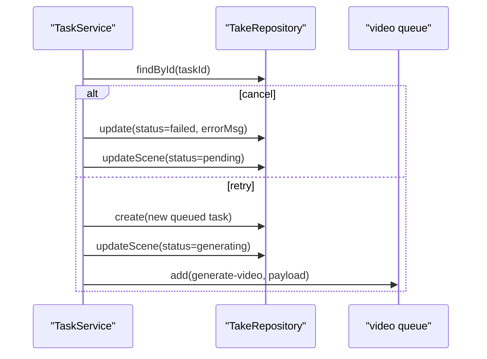

**Diagram sources**

- [task-service.ts:41-93](file://packages/backend/src/services/task-service.ts#L41-L93)

**Section sources**

- [task-service.ts:20-93](file://packages/backend/src/services/task-service.ts#L20-L93)

### Logging and Debugging Utilities

Centralized logging and model call tracking:

- Truncates long prompts to avoid database limits
- Records API calls with status, cost, and optional error details
- Filters and queries model API calls by user, model, operation, and project

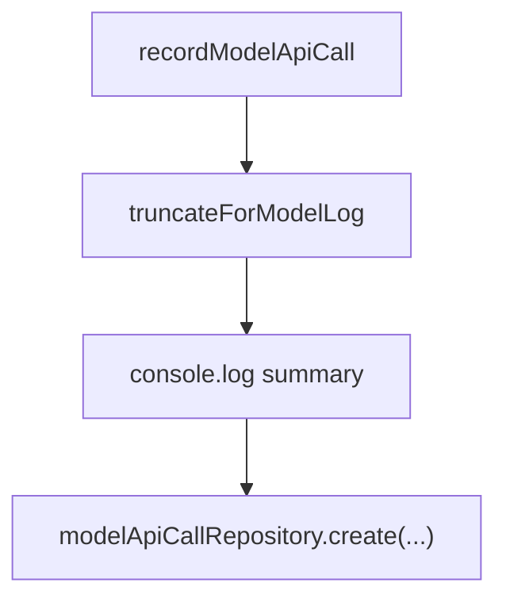

**Diagram sources**

- [api-logger.ts:36-61](file://packages/backend/src/services/ai/api-logger.ts#L36-L61)

**Section sources**

- [api-logger.ts:1-167](file://packages/backend/src/services/ai/api-logger.ts#L1-L167)

### LLM Call Wrapper and Configuration

Provides robust LLM invocation:

- Implements retry logic with exponential/backoff-like delays
- Categorizes errors (auth vs rate limit vs transient)
- Logs model calls with cost and usage metrics

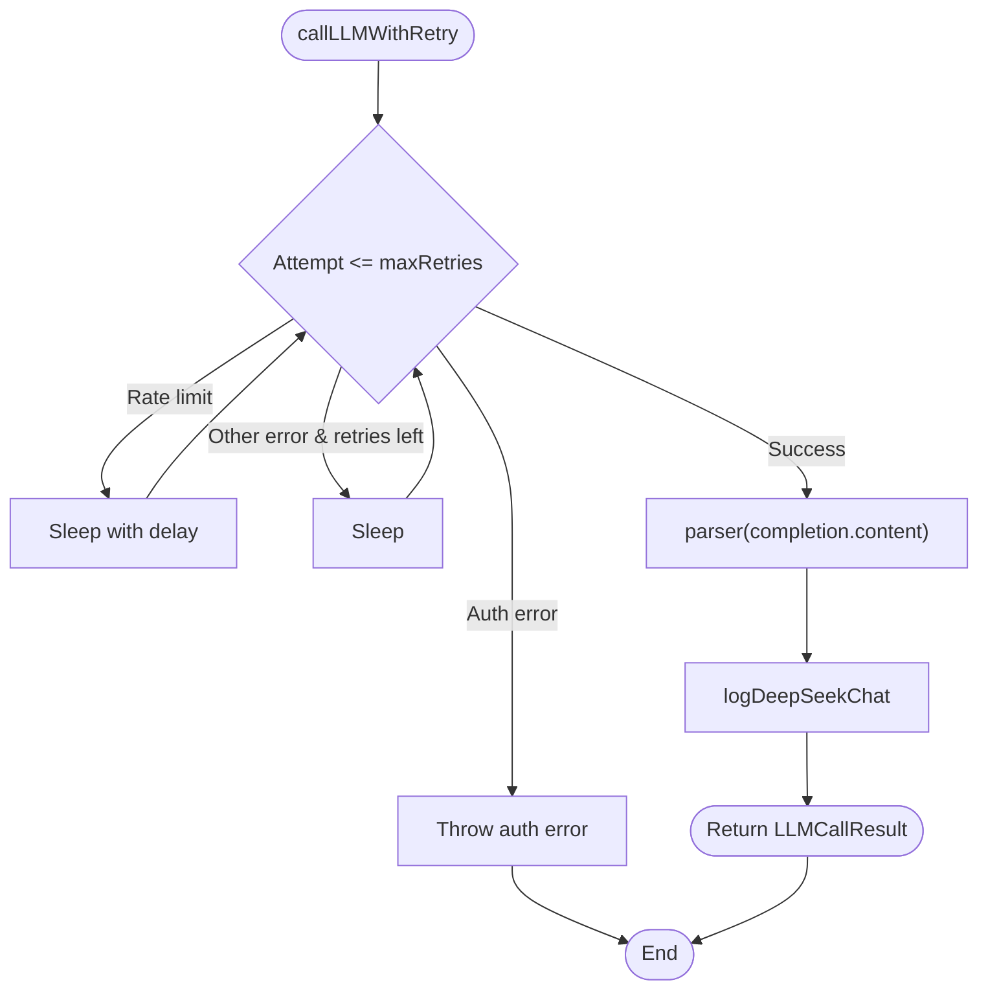

**Diagram sources**

- [llm-call-wrapper.ts:51-142](file://packages/backend/src/services/ai/llm-call-wrapper.ts#L51-L142)
- [ai.constants.ts:54-78](file://packages/backend/src/services/ai/ai.constants.ts#L54-L78)

**Section sources**

- [llm-call-wrapper.ts:51-177](file://packages/backend/src/services/ai/llm-call-wrapper.ts#L51-L177)
- [ai.constants.ts:1-78](file://packages/backend/src/services/ai/ai.constants.ts#L1-L78)

## Dependency Analysis

The services exhibit clear separation of concerns with minimal coupling:

- MemoryService depends on MemoryRepository and integrates with extractor and context builder
- Extractor depends on PromptTemplateEngine, LLM provider abstraction, and LLM call wrapper
- StoryboardGenerator depends on ActionExtractor and scene asset utilities
- TaskService depends on TakeRepository and enqueues work via queues
- Logging utilities are standalone but integrated into LLM and API flows

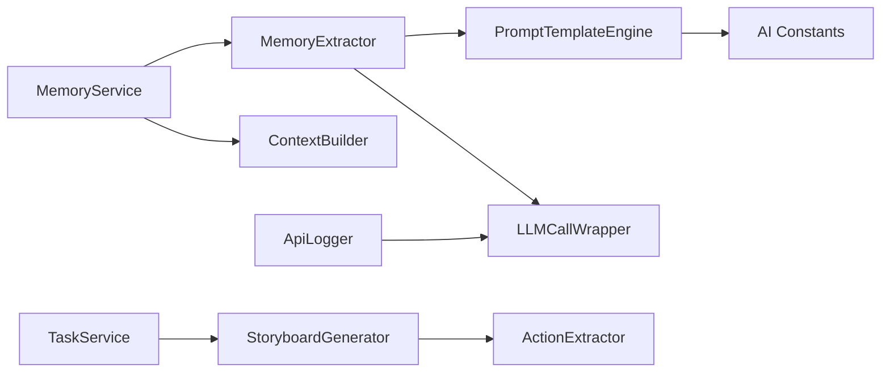

**Diagram sources**

- [memory-service.ts:1-11](file://packages/backend/src/services/memory/memory-service.ts#L1-L11)
- [extractor.ts:1-7](file://packages/backend/src/services/memory/extractor.ts#L1-L7)
- [template-engine.ts:1-4](file://packages/backend/src/services/prompts/template-engine.ts#L1-L4)
- [llm-call-wrapper.ts:1-11](file://packages/backend/src/services/ai/llm-call-wrapper.ts#L1-L11)
- [storyboard-generator.ts:1-18](file://packages/backend/src/services/storyboard-generator.ts#L1-L18)
- [action-extractor.ts:1-6](file://packages/backend/src/services/action-extractor.ts#L1-L6)
- [task-service.ts:1-3](file://packages/backend/src/services/task-service.ts#L1-L3)
- [api-logger.ts:1-4](file://packages/backend/src/services/ai/api-logger.ts#L1-L4)
- [ai.constants.ts:1-4](file://packages/backend/src/services/ai/ai.constants.ts#L1-L4)

**Section sources**

- [memory-service.ts:1-11](file://packages/backend/src/services/memory/memory-service.ts#L1-L11)
- [extractor.ts:1-7](file://packages/backend/src/services/memory/extractor.ts#L1-L7)
- [template-engine.ts:1-4](file://packages/backend/src/services/prompts/template-engine.ts#L1-L4)
- [llm-call-wrapper.ts:1-11](file://packages/backend/src/services/ai/llm-call-wrapper.ts#L1-L11)
- [storyboard-generator.ts:1-18](file://packages/backend/src/services/storyboard-generator.ts#L1-L18)
- [action-extractor.ts:1-6](file://packages/backend/src/services/action-extractor.ts#L1-L6)
- [task-service.ts:1-3](file://packages/backend/src/services/task-service.ts#L1-L3)
- [api-logger.ts:1-4](file://packages/backend/src/services/ai/api-logger.ts#L1-L4)
- [ai.constants.ts:1-4](file://packages/backend/src/services/ai/ai.constants.ts#L1-L4)

## Performance Considerations

- Prompt template interpolation supports efficient variable substitution and reduces duplication across prompts.
- Memory extraction batches writes to minimize database round-trips.
- Action extraction limits per-character actions to keep downstream processing tractable.
- Storyboard generation computes derived values once per segment and reuses them.
- Task service enqueues work asynchronously to avoid blocking request threads.
- Logging utilities truncate long prompts to maintain database field limits and reduce overhead.

## Troubleshooting Guide

Common issues and resolutions:

- Authentication failures during LLM calls: Immediate non-retriable errors; verify credentials and provider configuration.
- Rate limit errors: Automatic retries with increasing delays; monitor provider quotas and adjust retry attempts if needed.
- Invalid memory extraction responses: Ensure the LLM returns valid JSON and the extractor’s parsing logic matches the expected schema.
- Prompt truncation: Long prompts are truncated; review logs and adjust prompt length or chunking strategy.
- Task cancellation/retry: Validate task status before operations; canceled tasks cannot be retried until recreated.

**Section sources**

- [llm-call-wrapper.ts:96-142](file://packages/backend/src/services/ai/llm-call-wrapper.ts#L96-L142)
- [api-logger.ts:16-20](file://packages/backend/src/services/ai/api-logger.ts#L16-L20)
- [task-service.ts:41-89](file://packages/backend/src/services/task-service.ts#L41-L89)

## Conclusion

The utility and helper services provide a robust foundation for context management, standardized prompting, action extraction, storyboard assembly, data import, task orchestration, and observability. Their modular design enables reuse across features, consistent behavior through shared templates and constants, and reliable integration with AI providers and repositories.
