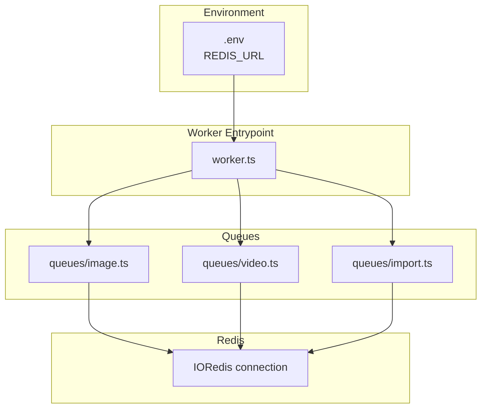
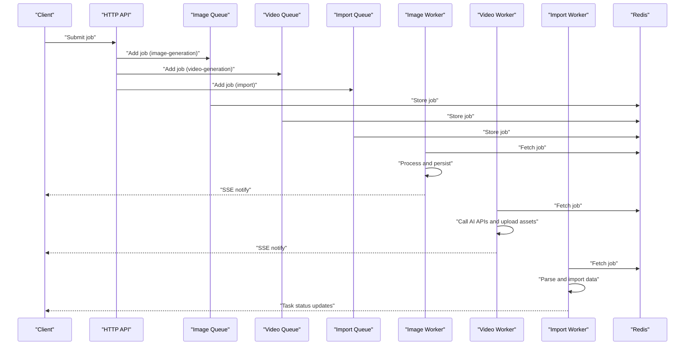
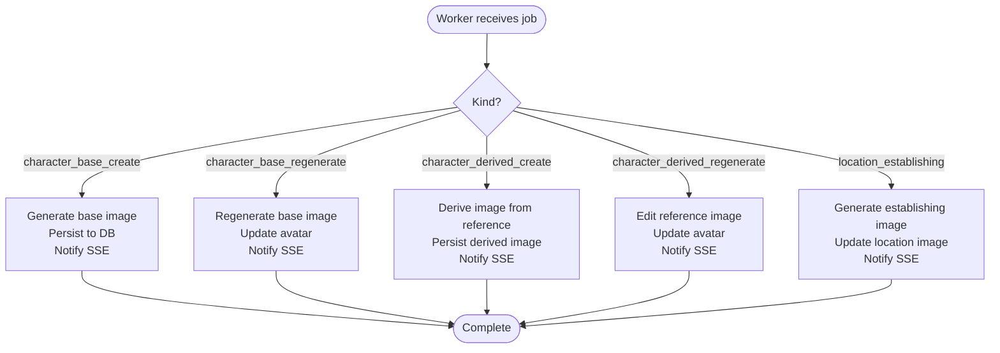
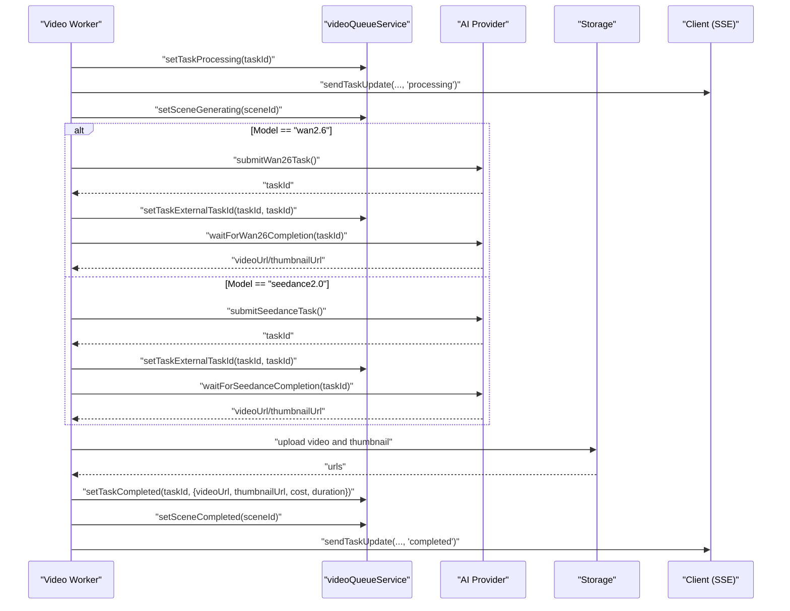
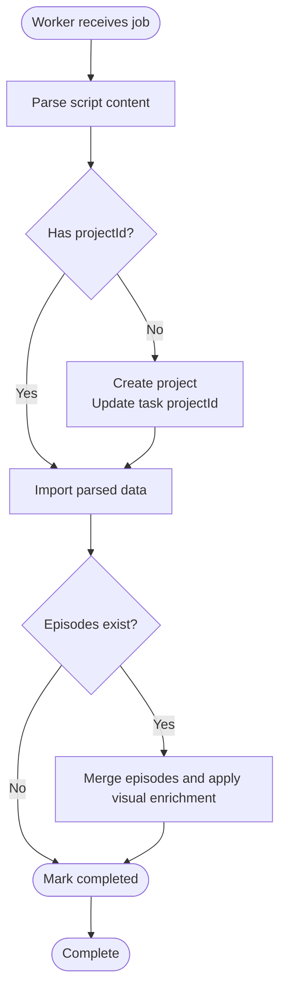
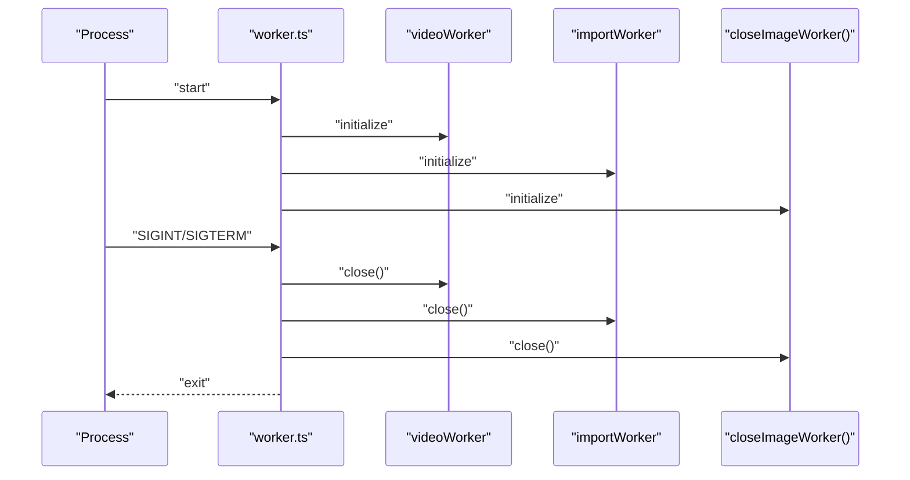
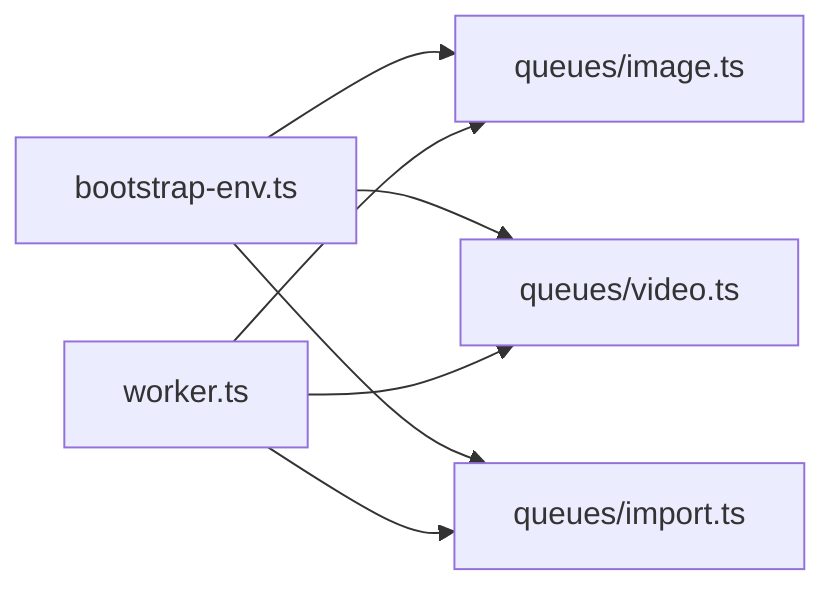

# BullMQ Configuration and Setup

<cite>
**Referenced Files in This Document**
- [bootstrap-env.ts](file://packages/backend/src/bootstrap-env.ts)
- [worker.ts](file://packages/backend/src/worker.ts)
- [image.ts](file://packages/backend/src/queues/image.ts)
- [video.ts](file://packages/backend/src/queues/video.ts)
- [import.ts](file://packages/backend/src/queues/import.ts)
</cite>

## Table of Contents

1. [Introduction](#introduction)
2. [Project Structure](#project-structure)
3. [Core Components](#core-components)
4. [Architecture Overview](#architecture-overview)
5. [Detailed Component Analysis](#detailed-component-analysis)
6. [Dependency Analysis](#dependency-analysis)
7. [Performance Considerations](#performance-considerations)
8. [Troubleshooting Guide](#troubleshooting-guide)
9. [Conclusion](#conclusion)
10. [Appendices](#appendices)

## Introduction

This document explains how BullMQ is configured and set up in the backend package. It covers queue initialization, Redis connection management, worker registration, concurrency, graceful shutdown, and environment-specific configuration. It also documents queue naming conventions, serialization settings, and operational best practices derived from the existing implementation.

## Project Structure

The BullMQ setup is organized around three queues:

- Image generation queue
- Video generation queue
- Import queue

Each queue defines its own Redis connection, queue, and worker. A dedicated worker entrypoint initializes and manages workers with graceful shutdown hooks.

**Diagram sources**

- [bootstrap-env.ts:1-12](file://packages/backend/src/bootstrap-env.ts#L1-L12)
- [worker.ts:1-30](file://packages/backend/src/worker.ts#L1-L30)
- [image.ts:1-302](file://packages/backend/src/queues/image.ts#L1-L302)
- [video.ts:1-272](file://packages/backend/src/queues/video.ts#L1-L272)
- [import.ts:1-114](file://packages/backend/src/queues/import.ts#L1-L114)

**Section sources**

- [bootstrap-env.ts:1-12](file://packages/backend/src/bootstrap-env.ts#L1-L12)
- [worker.ts:1-30](file://packages/backend/src/worker.ts#L1-L30)

## Core Components

- Environment bootstrap ensures .env is loaded before other modules, making Redis and AI credentials available to BullMQ and related services.
- Worker entrypoint initializes all workers and registers signal handlers for graceful shutdown.
- Each queue module encapsulates:
  - Redis connection creation
  - Queue instantiation with default job options
  - Worker creation with concurrency
  - Event listeners for completed/failed jobs
  - Graceful shutdown helpers

Key implementation references:

- Environment loading: [bootstrap-env.ts:1-12](file://packages/backend/src/bootstrap-env.ts#L1-L12)
- Worker entrypoint and shutdown: [worker.ts:1-30](file://packages/backend/src/worker.ts#L1-L30)
- Image queue: [image.ts:1-302](file://packages/backend/src/queues/image.ts#L1-L302)
- Video queue: [video.ts:1-272](file://packages/backend/src/queues/video.ts#L1-L272)
- Import queue: [import.ts:1-114](file://packages/backend/src/queues/import.ts#L1-L114)

**Section sources**

- [bootstrap-env.ts:1-12](file://packages/backend/src/bootstrap-env.ts#L1-L12)
- [worker.ts:1-30](file://packages/backend/src/worker.ts#L1-L30)
- [image.ts:1-302](file://packages/backend/src/queues/image.ts#L1-L302)
- [video.ts:1-272](file://packages/backend/src/queues/video.ts#L1-L272)
- [import.ts:1-114](file://packages/backend/src/queues/import.ts#L1-L114)

## Architecture Overview

The system uses separate BullMQ queues per workload. Each queue maintains its own Redis connection and worker pool. Workers listen for jobs and perform domain-specific actions, updating state via repositories and notifying clients via SSE.

**Diagram sources**

- [image.ts:19-287](file://packages/backend/src/queues/image.ts#L19-L287)
- [video.ts:15-256](file://packages/backend/src/queues/video.ts#L15-L256)
- [import.ts:30-95](file://packages/backend/src/queues/import.ts#L30-L95)

## Detailed Component Analysis

### Image Generation Queue

- Queue name: "image-generation"
- Redis connection: Created with IORedis using REDIS_URL or localhost fallback; maxRetriesPerRequest disabled.
- Default job options: attempts=2, exponential backoff starting at 4 seconds.
- Worker concurrency: 3
- Job processing:
  - Determines image size from project aspect ratio
  - Supports multiple job kinds (character base/create, regenerate, derived create/regenerate, location establishing)
  - Persists results to database via imageQueueService
  - Notifies via SSE on completion or failure
  - Records model API calls
- Shutdown: closeImageWorker() closes worker, queue, and Redis connection.

**Diagram sources**

- [image.ts:42-287](file://packages/backend/src/queues/image.ts#L42-L287)

**Section sources**

- [image.ts:15-28](file://packages/backend/src/queues/image.ts#L15-L28)
- [image.ts:42-287](file://packages/backend/src/queues/image.ts#L42-L287)
- [image.ts:297-302](file://packages/backend/src/queues/image.ts#L297-L302)

### Video Generation Queue

- Queue name: "video-generation"
- Redis connection: IORedis with REDIS_URL or localhost fallback; maxRetriesPerRequest disabled.
- Default job options: attempts=3, exponential backoff starting at 5 seconds.
- Worker concurrency: 5
- Job processing:
  - Resolves user ID for SSE notifications
  - Updates task and scene statuses
  - Chooses AI provider (Wan 2.6 or Seedance 2.0)
  - Logs API calls and tracks external task IDs
  - Downloads generated video, uploads to storage, and persists metadata
  - Sends SSE notifications on completion or failure
- Shutdown: SIGTERM handler closes worker and Redis connection.

**Diagram sources**

- [video.ts:27-256](file://packages/backend/src/queues/video.ts#L27-L256)

**Section sources**

- [video.ts:11-24](file://packages/backend/src/queues/video.ts#L11-L24)
- [video.ts:27-256](file://packages/backend/src/queues/video.ts#L27-L256)
- [video.ts:267-272](file://packages/backend/src/queues/video.ts#L267-L272)

### Import Queue

- Queue name: "import"
- Redis connection: Lazy-initialized IORedis with REDIS_URL or localhost fallback; maxRetriesPerRequest disabled.
- Default job options: attempts=2, exponential backoff starting at 3 seconds.
- Worker concurrency: 2
- Job processing:
  - Marks task as processing
  - Parses script content (Markdown/JSON)
  - Creates project if missing and links task to project
  - Imports parsed data into domain entities
  - Merges episodes and applies visual enrichment
  - Marks task completed or failed
- Shutdown: closeImportWorker() closes worker, queue, and quits Redis connection.

**Diagram sources**

- [import.ts:42-95](file://packages/backend/src/queues/import.ts#L42-L95)

**Section sources**

- [import.ts:10-19](file://packages/backend/src/queues/import.ts#L10-L19)
- [import.ts:30-39](file://packages/backend/src/queues/import.ts#L30-L39)
- [import.ts:42-95](file://packages/backend/src/queues/import.ts#L42-L95)
- [import.ts:105-114](file://packages/backend/src/queues/import.ts#L105-L114)

### Worker Registration and Concurrency

- Worker entrypoint imports and starts all workers, logging their concurrency levels.
- Signal handlers for SIGINT/SIGTERM trigger graceful shutdown across all workers.

**Diagram sources**

- [worker.ts:5-29](file://packages/backend/src/worker.ts#L5-L29)

**Section sources**

- [worker.ts:1-30](file://packages/backend/src/worker.ts#L1-L30)

## Dependency Analysis

- Environment bootstrap precedes all imports to ensure environment variables are available before Redis/IORedis initialization.
- Each queue module independently manages its Redis connection and worker lifecycle.
- Worker entrypoint coordinates shutdown across all queues.

**Diagram sources**

- [bootstrap-env.ts:1-12](file://packages/backend/src/bootstrap-env.ts#L1-L12)
- [worker.ts:1-30](file://packages/backend/src/worker.ts#L1-L30)
- [image.ts:1-302](file://packages/backend/src/queues/image.ts#L1-L302)
- [video.ts:1-272](file://packages/backend/src/queues/video.ts#L1-L272)
- [import.ts:1-114](file://packages/backend/src/queues/import.ts#L1-L114)

**Section sources**

- [bootstrap-env.ts:1-12](file://packages/backend/src/bootstrap-env.ts#L1-L12)
- [worker.ts:1-30](file://packages/backend/src/worker.ts#L1-L30)

## Performance Considerations

- Concurrency tuning:
  - Image generation: concurrency 3
  - Video generation: concurrency 5
  - Import: concurrency 2
- Backoff strategy:
  - Exponential backoff reduces load during transient failures.
- Redis connection:
  - maxRetriesPerRequest disabled to avoid partial command retries at the client level.
- Serialization:
  - BullMQ serializes job data automatically; ensure job payloads are compact and typed to minimize overhead.
- Memory management:
  - Workers process jobs synchronously; keep job payloads small and avoid retaining large buffers unnecessarily.
- Throughput:
  - Increase concurrency cautiously; monitor Redis latency and CPU utilization.

[No sources needed since this section provides general guidance]

## Troubleshooting Guide

- Redis connectivity:
  - Verify REDIS_URL environment variable is set consistently across environments.
  - Ensure Redis server is reachable from the worker host.
- Job failures:
  - Check worker event logs for "failed" events and inspect error messages.
  - Confirm exponential backoff is functioning as expected.
- Graceful shutdown:
  - On SIGINT/SIGTERM, workers close cleanly; confirm all connections are quit and queues closed.
- SSE notifications:
  - For image and video queues, ensure SSE plugin is available and working when sending notifications.

**Section sources**

- [image.ts:289-295](file://packages/backend/src/queues/image.ts#L289-L295)
- [video.ts:258-264](file://packages/backend/src/queues/video.ts#L258-L264)
- [import.ts:97-103](file://packages/backend/src/queues/import.ts#L97-L103)
- [worker.ts:14-29](file://packages/backend/src/worker.ts#L14-L29)

## Conclusion

The BullMQ setup follows a modular pattern with explicit Redis connections per queue, sensible default job options, and worker concurrency tailored to workload characteristics. Environment bootstrapping ensures credentials are available before initialization. Graceful shutdown is handled centrally via signal handlers. The configuration supports development, staging, and production deployment by adjusting environment variables and concurrency levels.

[No sources needed since this section summarizes without analyzing specific files]

## Appendices

### Configuration Examples by Environment

- Development
  - REDIS_URL: redis://localhost:6379
  - Concurrency: moderate (as defined in queue modules)
- Staging
  - REDIS_URL: managed Redis endpoint
  - Concurrency: scaled up gradually with monitoring
- Production
  - REDIS_URL: secure, clustered Redis endpoint
  - Concurrency: tuned based on CPU and Redis capacity
  - Enable health checks and alerting around queue backlog and job latency

[No sources needed since this section provides general guidance]

### Queue Naming Conventions

- image-generation
- video-generation
- import

**Section sources**

- [image.ts:19](file://packages/backend/src/queues/image.ts#L19)
- [video.ts:15](file://packages/backend/src/queues/video.ts#L15)
- [import.ts:30](file://packages/backend/src/queues/import.ts#L30)

### Serialization Settings

- BullMQ handles serialization automatically; ensure job data types align with expected runtime behavior and avoid passing large binary blobs directly in job payloads.

[No sources needed since this section provides general guidance]

### Redis Connection Management

- IORedis instances are created per queue (or lazily for import). maxRetriesPerRequest is disabled to prevent partial command retries at the client level.

**Section sources**

- [image.ts:15-17](file://packages/backend/src/queues/image.ts#L15-L17)
- [video.ts:11-13](file://packages/backend/src/queues/video.ts#L11-L13)
- [import.ts:12-19](file://packages/backend/src/queues/import.ts#L12-L19)

### Worker Registration and Concurrency

- Worker entrypoint initializes workers and logs their concurrency.
- Signal handlers ensure graceful shutdown across all workers.

**Section sources**

- [worker.ts:5-29](file://packages/backend/src/worker.ts#L5-L29)

### Graceful Shutdown Procedures

- Image queue: closeImageWorker()
- Video queue: SIGTERM handler
- Import queue: closeImportWorker()

**Section sources**

- [image.ts:297-302](file://packages/backend/src/queues/image.ts#L297-L302)
- [video.ts:267-272](file://packages/backend/src/queues/video.ts#L267-L272)
- [import.ts:105-114](file://packages/backend/src/queues/import.ts#L105-L114)

### Queue-Specific Settings

- Default attempts and backoff are set per queue to balance reliability and throughput.
- Concurrency is tuned per workload to match compute and I/O characteristics.

**Section sources**

- [image.ts:21-27](file://packages/backend/src/queues/image.ts#L21-L27)
- [video.ts:17-23](file://packages/backend/src/queues/video.ts#L17-L23)
- [import.ts:32-38](file://packages/backend/src/queues/import.ts#L32-L38)

### Connection Health Checks, Reconnection, and Failover

- Health checks:
  - Monitor queue length, job latency, and worker counts.
- Reconnection:
  - IORedis reconnects automatically; disable maxRetriesPerRequest to avoid partial command retries.
- Failover:
  - Use a managed Redis cluster and ensure REDIS_URL points to a cluster endpoint in production.

[No sources needed since this section provides general guidance]
